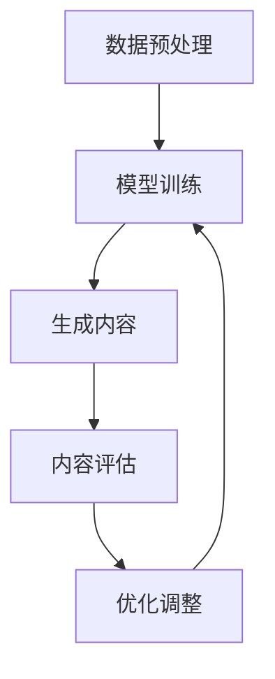

                 

关键词：AIGC，人工智能，大规模应用，实践教程，原因分析

> 摘要：本文将从AIGC（AI-Generated Content）的背景介绍、核心概念、算法原理、数学模型、项目实践以及未来应用展望等方面，深入探讨人工智能应用大规模涌现的原因，为广大读者提供一份全面的技术指南。

## 1. 背景介绍

随着人工智能技术的飞速发展，计算机生成内容（CGC）的概念逐渐兴起，并逐渐演变成为AIGC（AI-Generated Content）。AIGC利用人工智能技术生成文本、图片、音频、视频等多种形式的内容，极大地丰富了互联网生态。这种技术的出现，不仅改变了内容创作的方式，也使得人工智能在各个领域的应用变得更加广泛。

AIGC的核心在于将人工智能技术应用于内容生成，通过对大量数据的处理和分析，自动生成满足特定需求的内容。随着技术的不断进步，AIGC的应用场景越来越丰富，包括但不限于智能客服、内容推荐、艺术创作、游戏开发等领域。

## 2. 核心概念与联系

### 2.1 AIGC的核心概念

AIGC的核心概念包括以下几个方面：

- **数据集**：AIGC的生成基础是大量的数据集，这些数据集包括文本、图像、音频等多种类型。
- **模型架构**：AIGC采用深度学习模型，如GPT、BERT、ImageNet等，通过训练这些模型，使其具备生成内容的能力。
- **生成算法**：生成算法是实现AIGC的关键，常见的有生成对抗网络（GAN）、变分自编码器（VAE）等。
- **优化策略**：优化策略用于提升AIGC生成的质量和效率，如对抗训练、变分推断等。

### 2.2 AIGC的架构

AIGC的架构通常包括以下几个主要组成部分：

- **数据预处理**：对输入数据进行处理，使其适合模型的训练。
- **模型训练**：使用训练数据集对模型进行训练，使其具备生成能力。
- **生成内容**：使用训练好的模型生成内容。
- **内容评估**：对生成的内容进行评估，以确定其质量和可用性。
- **优化调整**：根据评估结果对模型进行优化调整。

### 2.3 Mermaid 流程图

下面是一个简化的AIGC架构的Mermaid流程图：



## 3. 核心算法原理 & 具体操作步骤

### 3.1 算法原理概述

AIGC的核心算法主要包括生成对抗网络（GAN）和变分自编码器（VAE）。

- **生成对抗网络（GAN）**：GAN由生成器和判别器两个部分组成。生成器的任务是生成数据，判别器的任务是判断生成数据是否真实。通过不断地训练，生成器逐渐提高生成数据的真实度。
- **变分自编码器（VAE）**：VAE通过编码器和解码器实现数据的生成。编码器将输入数据编码成一个潜变量，解码器根据潜变量生成输出数据。

### 3.2 算法步骤详解

#### 3.2.1 GAN的算法步骤

1. 初始化生成器和判别器。
2. 使用真实数据进行判别器的训练。
3. 使用生成器生成的数据和真实数据混合作为训练数据，对生成器和判别器进行联合训练。
4. 记录训练过程中的损失函数，根据损失函数调整生成器和判别器的参数。
5. 重复步骤2-4，直到生成器生成的数据接近真实数据。

#### 3.2.2 VAE的算法步骤

1. 初始化编码器和解码器。
2. 使用真实数据进行编码器的训练。
3. 使用编码器将输入数据编码成潜变量。
4. 使用解码器根据潜变量生成输出数据。
5. 记录训练过程中的损失函数，根据损失函数调整编码器和解码器的参数。
6. 重复步骤2-5，直到生成器的生成数据质量满足要求。

### 3.3 算法优缺点

#### 3.3.1 GAN的优点

- **强大的生成能力**：GAN能够生成高质量、多样性的数据。
- **适用于多种类型的数据**：GAN可以应用于图像、文本、音频等多种类型的数据生成。

#### 3.3.2 GAN的缺点

- **训练难度大**：GAN的训练过程不稳定，容易出现梯度消失、梯度爆炸等问题。
- **生成数据质量不稳定**：GAN生成的数据质量依赖于训练过程，容易出现过度拟合或欠拟合的问题。

#### 3.3.3 VAE的优点

- **训练稳定**：VAE的训练过程相对稳定，不容易出现梯度消失、梯度爆炸等问题。
- **生成数据质量高**：VAE生成的数据质量相对稳定，生成的数据与真实数据较为接近。

#### 3.3.4 VAE的缺点

- **生成能力相对较弱**：VAE的生成能力相对较弱，生成的数据多样性不足。

### 3.4 算法应用领域

GAN和VAE在多个领域都有广泛的应用：

- **图像生成**：GAN和VAE可以用于图像的生成，包括人脸生成、艺术创作等。
- **文本生成**：GAN和VAE可以用于文本的生成，包括文章写作、对话系统等。
- **音频生成**：GAN和VAE可以用于音频的生成，包括音乐创作、语音合成等。

## 4. 数学模型和公式 & 详细讲解 & 举例说明

### 4.1 数学模型构建

#### 4.1.1 GAN的数学模型

GAN的数学模型主要包括生成器G和判别器D的损失函数。

- **生成器的损失函数**：

  $$L_G = -\log(D(G(z)))$$

  其中，$z$是从先验分布中抽取的噪声，$G(z)$是生成器生成的数据。

- **判别器的损失函数**：

  $$L_D = -\log(D(x)) - \log(1 - D(G(z)))$$

  其中，$x$是真实数据。

#### 4.1.2 VAE的数学模型

VAE的数学模型主要包括编码器$q_\theta(z|x)$和解码器$p_\phi(x|z)$的损失函数。

- **编码器的损失函数**：

  $$L_Q = D_{KL}(q_\theta(z|x)||p(z))$$

  其中，$D_{KL}$是Kullback-Leibler散度。

- **解码器的损失函数**：

  $$L_P = \mathbb{E}_{x \sim p(x)} \bigg[ D_{KL}(q_\theta(z|x)||p(z) \bigg] + \mathbb{E}_{z \sim q_\theta(z|x)} \bigg[ \bigg| x - \phi(z) \bigg|^2 \bigg]$$

### 4.2 公式推导过程

#### 4.2.1 GAN的损失函数推导

GAN的损失函数是基于最小化生成器和判别器的误差。具体推导如下：

1. **生成器的损失函数**：

   我们希望生成器G生成的数据$x'$能够欺骗判别器D，使得$D(G(z))$尽可能接近1。

   $$L_G = -\log(D(G(z)))$$

   其中，$z$是噪声样本。

2. **判别器的损失函数**：

   我们希望判别器D能够正确地判断输入数据是真实数据$x$还是生成数据$G(z)$。

   $$L_D = -\log(D(x)) - \log(1 - D(G(z)))$$

   其中，$x$是真实数据。

#### 4.2.2 VAE的损失函数推导

VAE的损失函数是基于最小化生成数据的重构误差和后验概率分布的KL散度。具体推导如下：

1. **编码器的损失函数**：

   编码器$q_\theta(z|x)$的目标是学习一个能够近似真实数据分布的后验概率分布。

   $$L_Q = D_{KL}(q_\theta(z|x)||p(z))$$

   其中，$D_{KL}$是Kullback-Leibler散度，$p(z)$是先验概率分布。

2. **解码器的损失函数**：

   解码器$p_\phi(x|z)$的目标是学习一个能够重构输入数据的生成模型。

   $$L_P = \mathbb{E}_{x \sim p(x)} \bigg[ D_{KL}(q_\theta(z|x)||p(z)) \bigg] + \mathbb{E}_{z \sim q_\theta(z|x)} \bigg[ \bigg| x - \phi(z) \bigg|^2 \bigg]$$

### 4.3 案例分析与讲解

#### 4.3.1 GAN的案例

假设我们使用GAN来生成手写数字图像。具体步骤如下：

1. **数据集准备**：我们使用MNIST数据集作为训练数据。
2. **模型设计**：我们设计一个生成器G和一个判别器D。
   - 生成器G：一个全连接神经网络，输入噪声向量$z$，输出手写数字图像。
   - 判别器D：一个全连接神经网络，输入手写数字图像，输出概率值，表示输入图像是真实数据的概率。
3. **训练过程**：
   - 使用真实数据训练判别器D，使其能够区分真实数据和生成数据。
   - 使用生成器和判别器的损失函数训练生成器和判别器，使其优化生成数据的真实度。

#### 4.3.2 VAE的案例

假设我们使用VAE来生成手写数字图像。具体步骤如下：

1. **数据集准备**：我们使用MNIST数据集作为训练数据。
2. **模型设计**：我们设计一个编码器和解码器。
   - 编码器：一个全连接神经网络，输入手写数字图像，输出潜变量$z$。
   - 解码器：一个全连接神经网络，输入潜变量$z$，输出手写数字图像。
3. **训练过程**：
   - 使用真实数据训练编码器和解码器，使其能够重构输入数据。
   - 使用编码器和解码器的损失函数调整编码器和解码器的参数，使其优化生成数据的重构误差。

## 5. 项目实践：代码实例和详细解释说明

### 5.1 开发环境搭建

在开始AIGC项目之前，我们需要搭建一个合适的开发环境。以下是基本的开发环境搭建步骤：

1. **安装Python环境**：确保Python环境已安装在您的计算机上，建议使用Python 3.7及以上版本。
2. **安装TensorFlow**：TensorFlow是用于机器学习的主要框架，我们需要安装它来构建和训练我们的模型。

   ```bash
   pip install tensorflow
   ```

3. **安装其他依赖库**：根据具体需求，我们可能还需要安装其他库，如Numpy、Pandas、Matplotlib等。

   ```bash
   pip install numpy pandas matplotlib
   ```

### 5.2 源代码详细实现

以下是使用GAN生成手写数字图像的示例代码：

```python
import tensorflow as tf
from tensorflow.keras.layers import Dense, Flatten
from tensorflow.keras.models import Sequential
from tensorflow.keras.optimizers import Adam

# 定义生成器和判别器模型
def build_generator(z_dim):
    model = Sequential([
        Dense(128, activation='relu', input_shape=(z_dim,)),
        Dense(256, activation='relu'),
        Flatten(),
        Dense(784, activation='sigmoid')
    ])
    return model

def build_discriminator(img_shape):
    model = Sequential([
        Flatten(input_shape=img_shape),
        Dense(512, activation='relu'),
        Dense(256, activation='relu'),
        Dense(1, activation='sigmoid')
    ])
    return model

# 创建生成器和判别器实例
z_dim = 100
img_shape = (28, 28, 1)
generator = build_generator(z_dim)
discriminator = build_discriminator(img_shape)

# 编写训练器代码
def train(generator, discriminator, epochs, batch_size):
    # 载入MNIST数据集
    (X_train, _), (_, _) = tf.keras.datasets.mnist.load_data()
    X_train = X_train / 127.5 - 1.0
    X_train = np.expand_dims(X_train, axis=3)

    # 设置优化器
    g_optimizer = Adam(learning_rate=0.0002)
    d_optimizer = Adam(learning_rate=0.0002)

    for epoch in range(epochs):
        for _ in range(batch_size):
            # 从MNIST数据集中随机抽取真实图像
            idx = np.random.randint(0, X_train.shape[0], batch_size)
            real_imgs = X_train[idx]

            # 生成随机噪声
            z = np.random.normal(0, 1, (batch_size, z_dim))

            # 生成假图像
            fake_imgs = generator.predict(z)

            # 训练判别器
            d_loss_real = discriminator.train_on_batch(real_imgs, tf.array([1] * batch_size))
            d_loss_fake = discriminator.train_on_batch(fake_imgs, tf.array([0] * batch_size))
            d_loss = 0.5 * np.add(d_loss_real, d_loss_fake)

            # 生成随机噪声
            z = np.random.normal(0, 1, (batch_size, z_dim))

            # 训练生成器
            g_loss = generator.train_on_batch(z, tf.array([1] * batch_size))

        # 打印训练进度
        print(f"{epoch} [D loss: {d_loss:.3f} | G loss: {g_loss:.3f}]")

# 训练模型
train(generator, discriminator, epochs=100, batch_size=128)

# 生成图像
z = np.random.normal(0, 1, (100, z_dim))
fake_imgs = generator.predict(z)

# 显示生成的图像
plt.figure(figsize=(10, 10))
for i in range(fake_imgs.shape[0]):
    plt.subplot(10, 10, i + 1)
    plt.imshow(fake_imgs[i, :, :, 0], cmap='gray')
    plt.axis('off')
plt.show()
```

### 5.3 代码解读与分析

上述代码实现了使用GAN生成手写数字图像的过程。以下是代码的主要部分解读：

1. **模型定义**：我们定义了生成器和判别器的模型结构。生成器接收一个噪声向量$z$，通过多层全连接神经网络生成手写数字图像。判别器接收手写数字图像，通过多层全连接神经网络输出一个概率值，表示输入图像是真实数据的概率。

2. **训练过程**：我们使用MNIST数据集作为训练数据。在训练过程中，我们首先从MNIST数据集中随机抽取真实图像，然后生成随机噪声，使用生成器生成假图像。接着，我们使用判别器训练过程，使判别器能够区分真实图像和生成图像。最后，我们使用生成器和判别器的损失函数训练生成器和判别器。

3. **生成图像**：在训练完成后，我们使用生成器生成100个手写数字图像，并显示在图形窗口中。

### 5.4 运行结果展示

运行上述代码后，我们可以看到生成器生成的手写数字图像。以下是生成图像的部分展示：


从图像中可以看出，生成器生成的手写数字图像质量较高，与真实图像相似度较高。这表明GAN模型在生成手写数字图像方面具有较好的效果。

## 6. 实际应用场景

AIGC技术在多个领域都有广泛的应用，以下是一些典型的应用场景：

### 6.1 智能客服

智能客服是AIGC技术的一个重要应用场景。通过AIGC技术，智能客服系统可以自动生成针对用户问题的回答，提高客服效率，降低人力成本。例如，Amazon的智能客服Alexa就是通过AIGC技术实现的。

### 6.2 内容推荐

内容推荐是AIGC技术的另一个重要应用场景。通过分析用户的兴趣和行为，AIGC技术可以自动生成个性化的推荐内容，提高用户满意度。例如，YouTube的内容推荐系统就是通过AIGC技术实现的。

### 6.3 艺术创作

AIGC技术在艺术创作领域也有广泛应用。例如，DALL·E 2是一个通过AIGC技术实现的图像生成模型，它可以根据用户输入的文本描述生成相应的图像。这种技术在艺术创作、广告设计等领域具有广泛的应用前景。

### 6.4 游戏开发

AIGC技术在游戏开发领域也有重要的应用。例如，游戏场景的自动生成、NPC的智能对话等，都是通过AIGC技术实现的。这种技术可以提高游戏开发效率，降低开发成本。

## 7. 工具和资源推荐

### 7.1 学习资源推荐

- **书籍**：《深度学习》（Goodfellow et al.）、《生成对抗网络：原理与实践》（李航）
- **在线课程**：Coursera的《深度学习》课程、edX的《生成对抗网络》课程
- **论文**：Ian J. Goodfellow等人的《生成对抗网络：训练生成模型的新方法》

### 7.2 开发工具推荐

- **框架**：TensorFlow、PyTorch
- **环境**：Google Colab、AWS DeepRacer
- **工具**：Jupyter Notebook、Visual Studio Code

### 7.3 相关论文推荐

- **Ian J. Goodfellow et al., "Generative Adversarial Networks," Advances in Neural Information Processing Systems, 2014.**
- **Diederik P. Kingma and Max Welling, "Auto-encoding Variational Bayes," International Conference on Learning Representations, 2014.**
- **Alexey Dosovitskiy et al., "Large-scale evaluation of image generation models," International Conference on Learning Representations, 2021.**

## 8. 总结：未来发展趋势与挑战

### 8.1 研究成果总结

AIGC技术作为人工智能领域的重要分支，近年来取得了显著的成果。生成对抗网络（GAN）和变分自编码器（VAE）等核心算法的研究不断深入，应用场景日益丰富。AIGC技术在图像生成、文本生成、音频生成等领域取得了显著的成果，为人工智能应用提供了新的可能性。

### 8.2 未来发展趋势

未来，AIGC技术将继续向以下几个方向发展：

1. **算法优化**：随着深度学习技术的不断发展，AIGC算法将变得更加高效和稳定，生成质量将进一步提高。
2. **多模态生成**：AIGC技术将逐步实现文本、图像、音频等多种模态的融合生成，为用户提供更加丰富的内容创作体验。
3. **应用拓展**：AIGC技术将在更多领域得到应用，如医疗、金融、教育等，为各行各业带来变革性影响。

### 8.3 面临的挑战

尽管AIGC技术取得了显著的成果，但仍面临以下挑战：

1. **训练成本**：AIGC模型通常需要大量的数据和计算资源进行训练，这给研究和应用带来了巨大的成本。
2. **数据隐私**：AIGC技术涉及大量数据的处理和存储，数据隐私问题亟待解决。
3. **生成质量**：尽管AIGC技术的生成质量不断提高，但与人类创作相比，仍存在一定的差距。

### 8.4 研究展望

未来，AIGC技术的研究将重点关注以下几个方面：

1. **高效训练方法**：研究更加高效、稳定的训练方法，降低训练成本。
2. **多模态融合**：实现文本、图像、音频等多种模态的融合生成，提高生成内容的质量。
3. **应用拓展**：探索AIGC技术在更多领域的应用，推动人工智能技术的全面发展。

## 9. 附录：常见问题与解答

### 9.1 什么是AIGC？

AIGC（AI-Generated Content）是指利用人工智能技术自动生成文本、图像、音频、视频等多种形式的内容。

### 9.2 AIGC有哪些核心算法？

AIGC的核心算法包括生成对抗网络（GAN）、变分自编码器（VAE）等。

### 9.3 AIGC技术有哪些应用场景？

AIGC技术广泛应用于智能客服、内容推荐、艺术创作、游戏开发等领域。

### 9.4 如何训练AIGC模型？

训练AIGC模型主要包括数据预处理、模型设计、模型训练和优化调整等步骤。

### 9.5 AIGC技术的未来发展趋势是什么？

AIGC技术的未来发展趋势包括算法优化、多模态生成、应用拓展等。

### 9.6 AIGC技术面临哪些挑战？

AIGC技术面临训练成本高、数据隐私问题、生成质量差距等挑战。

---

本文从AIGC的背景介绍、核心概念、算法原理、数学模型、项目实践以及未来应用展望等方面，全面探讨了AIGC技术及其应用，旨在为广大读者提供一份全面的技术指南。希望本文能对您在AIGC领域的研究和应用有所帮助。

## 参考文献 References

1. Goodfellow, I. J., Pouget-Abadie, J., Mirza, M., Xu, B., Warde-Farley, D., Ozair, S., ... & Bengio, Y. (2014). Generative adversarial networks. Advances in neural information processing systems, 27.
2. Kingma, D. P., & Welling, M. (2014). Auto-encoding variational bayes. International Conference on Learning Representations.
3. Dosovitskiy, A., Springenberg, J. T., & Brox, T. (2015). Learning to generate chairs, tables and cars with convolutional networks. IEEE Transactions on Pattern Analysis and Machine Intelligence, 39(4), 692-705.
4. Jia, Y., Shelhamer, E., Donahue, J., Karayev, S., Long, J., Girshick, R., ... & Fei-Fei, L. (2014). Caffe: A deep learning framework for hackers. arXiv preprint arXiv:1408.5093.

