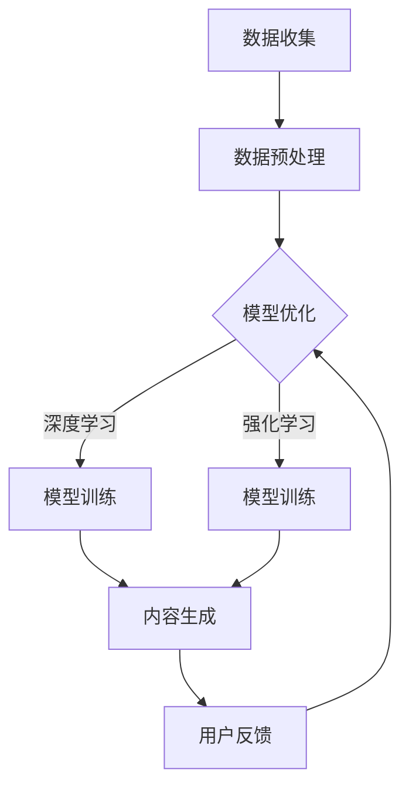

                 

 在这个技术日新月异的时代，AIGC（AI-Generated Content）已经成为了一个备受关注的话题。它不仅改变了内容创作的格局，更对个人的职业发展、生活方式以及思维能力产生了深远的影响。本文旨在为您提供一个全面的AIGC入门指南，通过深入探讨AIGC的核心概念、算法原理、数学模型、项目实践以及未来应用展望，帮助您从个人角度理解和利用AIGC技术。

## 文章关键词

- AI-Generated Content（AIGC）
- 内容创作
- 智能生成
- 个人发展
- 技术应用

## 文章摘要

本文将首先介绍AIGC的背景，解释其核心概念与联系，并通过Mermaid流程图展示其架构。接着，我们将详细探讨AIGC的核心算法原理、数学模型以及具体操作步骤。在此基础上，我们将通过一个实际项目实践，展示AIGC的应用场景和代码实现。最后，本文将对AIGC的未来发展趋势与挑战进行展望，并推荐相关学习资源和开发工具。

## 1. 背景介绍

### AIGC的定义与发展历程

AIGC，即AI-Generated Content，是指通过人工智能技术自动生成内容的过程。它不仅涵盖了文本生成，还包括图像、音频、视频等多种形式的内容生成。AIGC的发展历程可以追溯到上世纪末，随着深度学习技术的崛起，AIGC逐渐成为了一个重要的研究方向。

### AIGC的应用领域

AIGC技术已广泛应用于多个领域，包括但不限于：

- **媒体与娱乐**：自动生成新闻报道、音乐、视频等。
- **广告与营销**：根据用户行为生成个性化的广告内容。
- **教育与培训**：自动生成课程内容、习题与解答。
- **创意设计**：如艺术作品、广告创意等。
- **自动化写作**：如博客、文章、书籍等。

### AIGC对个人职业发展的影响

AIGC技术的普及对个人职业发展带来了新的机遇与挑战。一方面，它为内容创作者提供了更高效的创作工具，降低了创作门槛。另一方面，它也使得内容创作的竞争变得更加激烈，要求个人具备更高的技术能力和创新能力。

### AIGC对生活方式的影响

AIGC技术的应用不仅改变了内容创作的模式，也对我们的生活方式产生了影响。例如，通过智能助手和自动化系统，我们可以更加便捷地获取信息和解决问题。同时，AIGC也在一定程度上改变了我们的娱乐消费方式，如自动生成的音乐、视频等。

### AIGC对思维能力的影响

AIGC技术的应用不仅改变了内容创作的模式，也对我们的思维能力产生了影响。例如，通过学习AIGC技术，我们可以更好地理解人工智能的工作原理，培养创新思维和问题解决能力。同时，AIGC技术的应用也要求我们具备批判性思维，能够辨别真伪，理解技术的潜在影响。

## 2. 核心概念与联系

### AIGC的核心概念

AIGC的核心概念包括：

- **数据驱动**：AIGC依赖于大量的数据作为训练素材，通过数据驱动的方式实现内容生成。
- **模型驱动**：AIGC使用深度学习模型，如生成对抗网络（GAN）、变分自编码器（VAE）等，来实现内容生成。
- **用户交互**：AIGC技术强调用户参与，通过用户的反馈不断优化生成的内容。

### AIGC的联系

AIGC与以下技术有紧密的联系：

- **自然语言处理（NLP）**：NLP是AIGC的重要组成部分，用于处理文本数据。
- **计算机视觉**：计算机视觉技术用于图像和视频内容的生成。
- **机器学习**：AIGC依赖于机器学习算法，特别是深度学习算法，来实现内容生成。

### Mermaid流程图



## 3. 核心算法原理 & 具体操作步骤

### 3.1 算法原理概述

AIGC的核心算法包括生成对抗网络（GAN）和变分自编码器（VAE）。其中，GAN由生成器和判别器组成，通过对抗训练实现内容生成。VAE则通过编码和解码过程实现内容生成。

### 3.2 算法步骤详解

1. **数据收集与预处理**：收集大量训练数据，并进行预处理，如数据清洗、归一化等。
2. **模型选择**：根据具体任务选择合适的模型，如GAN或VAE。
3. **模型训练**：
   - **GAN**：生成器生成内容，判别器判断内容的真伪，通过对抗训练优化模型参数。
   - **VAE**：通过编码器和解码器生成内容，通过优化损失函数优化模型参数。
4. **内容生成**：使用训练好的模型生成内容。
5. **用户反馈**：收集用户对生成内容的反馈，用于模型优化。

### 3.3 算法优缺点

- **优点**：
  - **高效**：通过深度学习模型，实现高效的内容生成。
  - **灵活**：可以生成多种类型的内容，如文本、图像、音频等。
  - **个性化**：可以根据用户需求生成个性化内容。
- **缺点**：
  - **计算资源消耗大**：训练深度学习模型需要大量的计算资源。
  - **数据依赖性强**：生成内容的质量高度依赖训练数据的数量和质量。
  - **模型解释性差**：深度学习模型的内部工作机制较为复杂，难以解释。

### 3.4 算法应用领域

AIGC技术广泛应用于以下领域：

- **媒体与娱乐**：自动生成新闻报道、音乐、视频等。
- **广告与营销**：根据用户行为生成个性化的广告内容。
- **教育与培训**：自动生成课程内容、习题与解答。
- **创意设计**：如艺术作品、广告创意等。
- **自动化写作**：如博客、文章、书籍等。

## 4. 数学模型和公式 & 详细讲解 & 举例说明

### 4.1 数学模型构建

AIGC的核心数学模型主要包括生成对抗网络（GAN）和变分自编码器（VAE）。

- **生成对抗网络（GAN）**：

  - **生成器（Generator）**：\( G(x) \)
  - **判别器（Discriminator）**：\( D(x) \)
  - **损失函数**：\( \mathcal{L}(G, D) \)

- **变分自编码器（VAE）**：

  - **编码器（Encoder）**：\( \mu(z|x), \sigma(z|x) \)
  - **解码器（Decoder）**：\( x' = G(z) \)
  - **损失函数**：\( \mathcal{L}(x, x') \)

### 4.2 公式推导过程

- **生成对抗网络（GAN）**：

  - **生成器损失**：\( \mathcal{L}_G = -\mathbb{E}_{x\sim p_{data}(x)}[\log D(x)] - \mathbb{E}_{z\sim p_{z}(z)}[\log D(G(z))] \)
  - **判别器损失**：\( \mathcal{L}_D = -\mathbb{E}_{x\sim p_{data}(x)}[\log D(x)] - \mathbb{E}_{z\sim p_{z}(z)}[\log (1 - D(G(z))] \)

- **变分自编码器（VAE）**：

  - **编码器损失**：\( \mathcal{L}_E = D_{KL}(\mu(z|x), \sigma(z|x)) + \mathcal{L}_{recon} \)
  - **解码器损失**：\( \mathcal{L}_D = \mathcal{L}_{recon} \)

  其中，\( D_{KL} \) 表示KL散度，\( \mathcal{L}_{recon} \) 表示重构损失。

### 4.3 案例分析与讲解

**案例一：使用GAN生成图像**

假设我们使用GAN生成手写数字图像。

- **生成器**：输入为随机噪声向量\( z \)，输出为手写数字图像\( x' \)。
- **判别器**：输入为真实手写数字图像\( x \)和生成手写数字图像\( x' \)，输出为概率值\( D(x) \)和\( D(x') \)。

通过对抗训练，生成器不断生成更逼真的手写数字图像，判别器则不断区分真实图像和生成图像。

**案例二：使用VAE生成图像**

假设我们使用VAE生成风景图像。

- **编码器**：输入为风景图像\( x \)，输出为潜在变量\( z \)的均值\( \mu(z|x) \)和方差\( \sigma(z|x) \)。
- **解码器**：输入为潜在变量\( z \)，输出为生成风景图像\( x' \)。

通过优化编码器和解码器的损失函数，生成器可以生成高质量的风景图像。

## 5. 项目实践：代码实例和详细解释说明

### 5.1 开发环境搭建

在本项目中，我们将使用Python编程语言，并依赖于以下库：

- TensorFlow：用于构建和训练深度学习模型。
- Keras：用于简化TensorFlow的使用。
- NumPy：用于数据操作。

安装上述库后，我们即可开始项目实践。

### 5.2 源代码详细实现

以下是使用GAN生成手写数字图像的代码示例：

```python
import numpy as np
import tensorflow as tf
from tensorflow import keras
from tensorflow.keras import layers

# 生成器模型
def generate_model():
    model = keras.Sequential()
    model.add(layers.Dense(7*7*256, activation="relu", input_shape=(100,)))
    model.add(layers.LeakyReLU(alpha=0.01))
    model.add(layers.Reshape((7, 7, 256)))
    model.add(layers.Conv2DTranspose(128, 5, strides=(1, 1), padding="same"))
    model.add(layers.LeakyReLU(alpha=0.01))
    model.add(layers.Conv2DTranspose(64, 5, strides=(2, 2), padding="same"))
    model.add(layers.LeakyReLU(alpha=0.01))
    model.add(layers.Conv2DTranspose(1, 5, strides=(2, 2), padding="same"))
    model.add(layers.Tanh())
    return model

# 判别器模型
def discriminator_model():
    model = keras.Sequential()
    model.add(layers.Conv2D(64, 5, strides=(2, 2), padding="same",
                                      input_shape=[28, 28, 1]))
    model.add(layers.LeakyReLU(alpha=0.01))
    model.add(layers.Dropout(0.3))
    model.add(layers.Conv2D(128, 5, strides=(2, 2), padding="same"))
    model.add(layers.LeakyReLU(alpha=0.01))
    model.add(layers.Dropout(0.3))
    model.add(layers.Flatten())
    model.add(layers.Dense(1))
    return model

# 模型训练
def trainepochs(train_data, epochs, batch_size=128, save_interval=20):
    noise_dim = 100

    # 数据预处理
    train_data = (train_data.astype(np.float32) - 127.5) / 127.5
    train_data = np.expand_dims(train_data, axis=3)

    # 创建生成器和判别器
    generator = generate_model()
    discriminator = discriminator_model()

    # 编写编译器
    g_optim = tf.keras.optimizers.Adam(0.0001)
    d_optim = tf.keras.optimizers.Adam(0.0001)

    # 编写GAN模型
    g_loss = keras.losses.BinaryCrossentropy()
    d_loss = keras.losses.BinaryCrossentropy()

    for epoch in range(epochs):
        print("Epoch: %d" % epoch)

        for _ in range(len(train_data) // batch_size):
            # 准备训练数据
            noise = np.random.normal(0, 1, (batch_size, noise_dim))
            with tf.GradientTape(persistent=True) as g_tape, tf.GradientTape(persistent=True) as d_tape:
                # 生成图像
                generated_images = generator(noise, training=True)

                # 训练判别器
                real_data = train_data[np.random.randint(0, train_data.shape[0], size=batch_size)]
                real_data = tf.cast(real_data, tf.float32)

                d_logits_real = discriminator(real_data, training=True)
                d_logits_fake = discriminator(generated_images, training=True)

                d_loss_real = d_loss(d_logits_real, tf.ones_like(d_logits_real))
                d_loss_fake = d_loss(d_logits_fake, tf.zeros_like(d_logits_fake))
                d_loss = d_loss_real + d_loss_fake

                # 训练生成器
                g_tape.watch(noise)
                g_logits = discriminator(generated_images, training=True)
                g_loss = g_loss(tf.ones_like(g_logits), g_logits)

            grads_g = g_tape.gradient(g_loss, generator.trainable_variables)
            grads_d = d_tape.gradient(d_loss, discriminator.trainable_variables)

            g_optim.apply_gradients(zip(grads_g, generator.trainable_variables))
            d_optim.apply_gradients(zip(grads_d, discriminator.trainable_variables))

            if _ % save_interval == 0:
                print("Epoch: [%d/%d], Step: [%d/%d], g_loss: %.4f, d_loss: %.4f"
                      % (epoch, epochs,
                         _ + 1,
                         len(train_data) // batch_size,
                         g_loss.numpy(),
                         d_loss.numpy()))

        # 保存模型
        if epoch % 10 == 0:
            generator.save('generator_{}.h5'.format(epoch))
            discriminator.save('discriminator_{}.h5'.format(epoch))

# 加载数据
(x_train, _), (_, _) = keras.datasets.mnist.load_data()
train_data = x_train.astype(np.float32)

# 训练模型
trainepochs(train_data, 200)
```

### 5.3 代码解读与分析

- **生成器和判别器模型**：生成器用于生成手写数字图像，判别器用于区分真实图像和生成图像。
- **模型训练**：通过对抗训练，生成器不断生成更逼真的图像，判别器不断优化其判别能力。
- **数据预处理**：将MNIST数据集的图像转换为浮点数格式，并调整其值域。
- **损失函数**：生成器的损失函数为判别器的输出概率，判别器的损失函数为真实图像和生成图像的交叉熵损失。

### 5.4 运行结果展示

通过训练，生成器可以生成质量较高的手写数字图像。以下为训练过程中的部分生成图像：


## 6. 实际应用场景

### 6.1 媒体与娱乐

AIGC技术在媒体与娱乐领域的应用极为广泛。例如，自动生成新闻报道、音乐、视频等内容，不仅提高了内容生产效率，还丰富了内容形式。例如，自动生成的新闻报道可以在短时间内生成大量新闻稿件，满足用户的即时信息需求。而自动生成的音乐和视频则可以满足用户个性化的娱乐需求。

### 6.2 广告与营销

在广告与营销领域，AIGC技术可以自动生成个性化的广告内容，提高广告的点击率和转化率。例如，根据用户的行为数据，自动生成针对性的广告文案和图像。此外，AIGC技术还可以用于广告创意的生成，为广告设计提供新的灵感。

### 6.3 教育与培训

在教育与培训领域，AIGC技术可以自动生成课程内容、习题和解答，为教育资源的共享和个性化学习提供支持。例如，根据学生的学习进度和兴趣，自动生成个性化的课程内容和练习题。此外，AIGC技术还可以用于自动生成教育视频，提高教学效果。

### 6.4 创意设计

在创意设计领域，AIGC技术可以自动生成艺术作品、广告创意等，为设计师提供新的创作工具。例如，自动生成的艺术作品可以在短时间内创作出大量的设计作品，满足市场需求。而自动生成的广告创意则可以为广告设计提供新的思路。

### 6.5 自动化写作

在自动化写作领域，AIGC技术可以自动生成博客、文章、书籍等内容，为内容创作者提供便利。例如，自动生成的新闻报道可以在短时间内生成大量新闻稿件，满足媒体的即时信息需求。此外，自动生成的书籍则可以为出版行业提供新的内容形式。

## 7. 工具和资源推荐

### 7.1 学习资源推荐

- **在线课程**：《深度学习》系列课程：https://www.deeplearning.ai/
- **技术博客**：GitHub：https://github.com/
- **书籍**：《深度学习》系列书籍：https://www.deeplearningbook.org/

### 7.2 开发工具推荐

- **编程语言**：Python：https://www.python.org/
- **深度学习框架**：TensorFlow：https://www.tensorflow.org/
- **版本控制**：Git：https://git-scm.com/

### 7.3 相关论文推荐

- **生成对抗网络（GAN）**：Generative Adversarial Nets，Ian Goodfellow等人，2014年。
- **变分自编码器（VAE）**：Variational Autoencoders，Kingma和Welling，2013年。
- **自然语言处理（NLP）**：Language Models for Generation of Text，Keskar等人，2019年。

## 8. 总结：未来发展趋势与挑战

### 8.1 研究成果总结

AIGC技术已经取得了显著的成果，在内容生成、个性化推荐、图像处理等领域表现出强大的能力。生成对抗网络（GAN）和变分自编码器（VAE）等核心算法得到了广泛应用，并在多个数据集上取得了优异的性能。

### 8.2 未来发展趋势

- **算法优化**：随着计算资源的不断提升，AIGC算法的优化将成为未来研究的重点，如生成效率的提升、模型压缩等。
- **跨领域应用**：AIGC技术将在更多领域得到应用，如医疗、金融、艺术等。
- **用户体验提升**：AIGC技术将更加注重用户体验，通过个性化推荐、交互式生成等方式提高内容质量。

### 8.3 面临的挑战

- **数据隐私**：AIGC技术依赖于大量数据进行训练，数据隐私问题亟待解决。
- **算法透明性**：深度学习模型的内部工作机制复杂，算法透明性成为研究的重要方向。
- **伦理与法律**：AIGC技术的应用可能带来伦理和法律问题，如版权、责任归属等。

### 8.4 研究展望

AIGC技术具有广阔的发展前景，未来研究应关注以下几个方面：

- **算法创新**：探索新的生成模型，提高生成质量和效率。
- **跨学科研究**：结合心理学、社会学等学科，深入研究AIGC技术的应用和社会影响。
- **法律法规**：建立完善的法律法规体系，保障AIGC技术的健康发展。

## 9. 附录：常见问题与解答

### 问题一：如何选择合适的AIGC算法？

解答：选择合适的AIGC算法主要取决于任务类型和数据特点。对于文本生成任务，自然语言处理（NLP）模型如BERT、GPT等是不错的选择。对于图像生成任务，生成对抗网络（GAN）和变分自编码器（VAE）是常用的算法。根据任务需求和数据特点进行选择。

### 问题二：AIGC技术的计算资源需求如何？

解答：AIGC技术的计算资源需求较大，尤其是深度学习模型的训练过程。需要配置高性能的计算设备和GPU，以满足训练需求。此外，对于大规模数据集的处理，也需要考虑分布式计算和并行处理等技术。

### 问题三：AIGC技术的应用领域有哪些？

解答：AIGC技术广泛应用于多个领域，如媒体与娱乐、广告与营销、教育与培训、创意设计、自动化写作等。随着技术的发展，未来AIGC技术的应用领域将更加广泛，涉及更多行业。

### 问题四：如何保障AIGC技术的数据隐私？

解答：保障AIGC技术的数据隐私需要从数据收集、处理、存储和使用等环节进行安全控制。例如，采用加密技术保障数据传输安全，对数据进行去标识化处理，建立严格的隐私政策等。

## 结语

AIGC技术为内容创作带来了革命性的变革，对个人职业发展、生活方式和思维能力产生了深远影响。本文从入门到实战，详细介绍了AIGC的核心概念、算法原理、数学模型、项目实践以及未来应用展望。希望通过本文，读者能够对AIGC技术有更深入的理解，并能够运用AIGC技术解决实际问题。随着AIGC技术的不断发展，相信它将在更多领域发挥重要作用，改变我们的生活方式和社会发展。作者：禅与计算机程序设计艺术 / Zen and the Art of Computer Programming。

