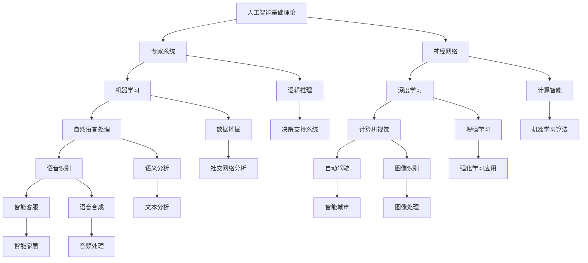

                 

关键词：人工智能（AI），AIGC，计算机科学发展，历史阶段，技术演进，算法原理，数学模型，项目实践，应用场景，未来展望

> 摘要：本文深入探讨人工智能（AI）发展的历史阶段，从早期的基础理论阶段到中间的计算智能阶段，再到当前的智能时代，即AIGC（AI-Generated Content）阶段。通过分析每个阶段的算法原理、数学模型和实际应用，本文旨在帮助读者全面理解人工智能的发展历程及其未来趋势。

## 1. 背景介绍

人工智能（AI）作为计算机科学的一个重要分支，自上世纪50年代诞生以来，经历了无数次的变革和进步。AI的发展历程可以大致划分为三个主要阶段：早期的理论阶段、中间的计算智能阶段以及当前的智能时代——AIGC阶段。每个阶段都有其独特的特点和发展方向，对人工智能的技术进步和应用领域产生了深远的影响。

### 早期理论阶段

早期理论阶段是人工智能概念的萌芽时期，主要集中在对智能本质的研究和简单逻辑推理的实现上。这一阶段的主要成果包括逻辑推理、专家系统和神经网络等基础理论的提出。

### 计算智能阶段

计算智能阶段是人工智能发展的关键时期，标志着人工智能从理论研究走向实际应用。这一阶段的代表性技术包括机器学习、深度学习和自然语言处理等。这些技术不仅提升了人工智能的性能和效率，也为AI在各个领域的应用奠定了基础。

### 智能时代

智能时代，即AIGC阶段，是人工智能发展的最新阶段。AIGC（AI-Generated Content）代表了一种全新的内容生成方式，通过人工智能技术生成文字、图片、音频等多种类型的内容。AIGC不仅改变了内容创作的方式，也为人工智能的应用带来了更广阔的前景。

## 2. 核心概念与联系

为了更好地理解人工智能的发展历程，我们需要先明确几个核心概念及其相互之间的联系。以下是这些核心概念的Mermaid流程图：



### 2.1 核心概念原理

- **人工智能基础理论**：人工智能的基础理论包括逻辑推理、搜索算法和知识表示等。这些理论为人工智能的研究和应用提供了基础。

- **专家系统**：专家系统是一种模拟人类专家决策能力的计算机程序，主要用于解决特定领域的问题。

- **神经网络**：神经网络是一种模仿人脑结构和功能的计算模型，通过多层神经元之间的连接和激活来实现复杂的模式识别和数据处理。

- **机器学习**：机器学习是一种基于数据的学习方法，通过从数据中提取模式和规律来实现对未知数据的预测和分类。

- **深度学习**：深度学习是机器学习的一种方法，通过多层神经网络对数据进行处理，可以自动提取特征，实现更复杂的任务。

- **自然语言处理**：自然语言处理是一种使计算机能够理解、处理和生成人类语言的技术。

- **计算机视觉**：计算机视觉是一种使计算机能够“看到”和理解图像或视频的技术。

- **语音识别**：语音识别是一种使计算机能够理解和识别语音的技术。

- **自动驾驶**：自动驾驶是利用计算机视觉、语音识别等技术实现无人驾驶的智能系统。

- **智能客服**：智能客服是一种利用自然语言处理、机器学习等技术实现的智能对话系统。

### 2.2 架构关系

各个核心概念之间存在着紧密的联系和相互影响。例如，神经网络和机器学习是深度学习的基础，自然语言处理和语音识别是智能客服的核心技术。这些技术共同构成了人工智能的技术体系，推动了人工智能的快速发展。

## 3. 核心算法原理 & 具体操作步骤

### 3.1 算法原理概述

在人工智能的发展历程中，算法原理是其核心技术之一。以下是几个核心算法的原理概述：

- **逻辑推理**：逻辑推理是一种基于逻辑运算符（如与、或、非等）进行推理的方法。它主要用于解决数学证明、决策支持等问题。

- **神经网络**：神经网络是一种通过模拟人脑神经元结构和功能来实现数据处理的计算模型。它主要用于图像识别、语音识别等任务。

- **机器学习**：机器学习是一种通过训练模型从数据中提取模式和规律的方法。它主要用于分类、回归、聚类等问题。

- **深度学习**：深度学习是一种基于多层神经网络进行数据处理的方法。它主要用于图像识别、自然语言处理等任务。

- **自然语言处理**：自然语言处理是一种使计算机能够理解和生成人类语言的技术。它主要用于语音识别、文本分类、机器翻译等问题。

### 3.2 算法步骤详解

以下是几个核心算法的具体步骤详解：

- **逻辑推理**：

  - 步骤1：定义逻辑运算符；
  
  - 步骤2：根据逻辑表达式构建推理树；
  
  - 步骤3：从根节点开始进行推理，得到结论。

- **神经网络**：

  - 步骤1：定义神经元结构和连接方式；
  
  - 步骤2：初始化权重和偏置；
  
  - 步骤3：输入数据，通过前向传播计算输出；
  
  - 步骤4：计算损失函数，更新权重和偏置；
  
  - 步骤5：重复步骤3和步骤4，直到达到训练目标。

- **机器学习**：

  - 步骤1：选择合适的机器学习算法；
  
  - 步骤2：收集和准备数据；
  
  - 步骤3：训练模型，得到模型参数；
  
  - 步骤4：评估模型性能，调整参数；
  
  - 步骤5：使用模型进行预测或分类。

- **深度学习**：

  - 步骤1：定义神经网络结构；
  
  - 步骤2：初始化权重和偏置；
  
  - 步骤3：输入数据，通过前向传播计算输出；
  
  - 步骤4：计算损失函数，更新权重和偏置；
  
  - 步骤5：重复步骤3和步骤4，直到达到训练目标。

- **自然语言处理**：

  - 步骤1：分词，将文本分割成单词或短语；
  
  - 步骤2：词性标注，识别单词的词性；
  
  - 步骤3：句法分析，分析句子的结构；
  
  - 步骤4：语义分析，理解句子的语义；
  
  - 步骤5：生成文本，根据需求生成新的文本。

### 3.3 算法优缺点

以下是几个核心算法的优缺点：

- **逻辑推理**：

  - 优点：逻辑推理具有严格的数学基础，可以处理一些具有明确逻辑关系的问题。

  - 缺点：逻辑推理在处理复杂问题时，可能需要大量的计算资源和时间。

- **神经网络**：

  - 优点：神经网络具有强大的学习能力，可以处理复杂的非线性问题。

  - 缺点：神经网络对数据的质量和数量要求较高，且训练过程可能需要较长时间。

- **机器学习**：

  - 优点：机器学习可以自动从数据中学习模式和规律，具有较好的通用性。

  - 缺点：机器学习模型的性能容易受到数据质量和数量影响。

- **深度学习**：

  - 优点：深度学习具有强大的学习能力，可以处理大规模和复杂的任务。

  - 缺点：深度学习模型的训练过程需要大量计算资源和时间。

- **自然语言处理**：

  - 优点：自然语言处理可以处理人类语言，具有广泛的应用前景。

  - 缺点：自然语言处理在处理语义理解和上下文关系时，仍存在一定的挑战。

### 3.4 算法应用领域

以下是几个核心算法的应用领域：

- **逻辑推理**：主要用于数学证明、决策支持等领域。

- **神经网络**：主要用于图像识别、语音识别、自然语言处理等领域。

- **机器学习**：主要用于分类、回归、聚类等领域。

- **深度学习**：主要用于图像识别、自然语言处理、语音识别等领域。

- **自然语言处理**：主要用于语音识别、文本分类、机器翻译等领域。

## 4. 数学模型和公式 & 详细讲解 & 举例说明

### 4.1 数学模型构建

在人工智能的研究和应用中，数学模型是核心工具之一。以下是几个常用的数学模型及其构建方法：

- **线性回归模型**：

  - 模型构建：假设数据集为 $D=\{(x_1,y_1),(x_2,y_2),\ldots,(x_n,y_n)\}$，其中 $x_i$ 和 $y_i$ 分别表示输入和输出。线性回归模型的目的是找到一条直线 $y=\beta_0+\beta_1x$，使得输入和输出之间的误差最小。

  - 误差计算：使用均方误差（MSE）来衡量误差，即 $J(\beta_0,\beta_1)=\frac{1}{2m}\sum_{i=1}^{m}(y_i-(\beta_0+\beta_1x_i))^2$。

  - 模型优化：使用梯度下降法来优化模型参数，即 $\beta_0:=\beta_0-\alpha\frac{\partial J}{\partial \beta_0}$，$\beta_1:=\beta_1-\alpha\frac{\partial J}{\partial \beta_1}$，其中 $\alpha$ 为学习率。

- **逻辑回归模型**：

  - 模型构建：假设数据集为 $D=\{(x_1,y_1),(x_2,y_2),\ldots,(x_n,y_n)\}$，其中 $x_i$ 和 $y_i$ 分别表示输入和输出。逻辑回归模型的目的是找到一条曲线 $y=\sigma(\beta_0+\beta_1x)$，使得输入和输出之间的误差最小。

  - 误差计算：使用交叉熵误差（Cross-Entropy Error）来衡量误差，即 $J(\beta_0,\beta_1)=-\frac{1}{m}\sum_{i=1}^{m}y_i\log(\sigma(\beta_0+\beta_1x_i))+(1-y_i)\log(1-\sigma(\beta_0+\beta_1x_i))$。

  - 模型优化：使用梯度下降法来优化模型参数，即 $\beta_0:=\beta_0-\alpha\frac{\partial J}{\partial \beta_0}$，$\beta_1:=\beta_1-\alpha\frac{\partial J}{\partial \beta_1}$，其中 $\alpha$ 为学习率。

- **神经网络模型**：

  - 模型构建：神经网络模型由多层神经元组成，包括输入层、隐藏层和输出层。每个神经元之间的连接都带有权重和偏置。

  - 激活函数：常用的激活函数包括sigmoid函数、ReLU函数和Tanh函数。

  - 前向传播：输入数据通过输入层进入网络，经过隐藏层和输出层的传递，最终得到输出结果。

  - 反向传播：计算输出结果与实际结果之间的误差，并使用梯度下降法更新网络中的权重和偏置。

### 4.2 公式推导过程

以下是几个核心公式的推导过程：

- **线性回归模型**：

  - 误差函数：$J(\beta_0,\beta_1)=\frac{1}{2m}\sum_{i=1}^{m}(y_i-(\beta_0+\beta_1x_i))^2$

  - 梯度计算：$\frac{\partial J}{\partial \beta_0}=-\frac{1}{m}\sum_{i=1}^{m}(y_i-(\beta_0+\beta_1x_i))$，$\frac{\partial J}{\partial \beta_1}=-\frac{1}{m}\sum_{i=1}^{m}(x_i(y_i-(\beta_0+\beta_1x_i)))$

  - 梯度下降法：$\beta_0:=\beta_0-\alpha\frac{\partial J}{\partial \beta_0}$，$\beta_1:=\beta_1-\alpha\frac{\partial J}{\partial \beta_1}$，其中 $\alpha$ 为学习率。

- **逻辑回归模型**：

  - 误差函数：$J(\beta_0,\beta_1)=-\frac{1}{m}\sum_{i=1}^{m}y_i\log(\sigma(\beta_0+\beta_1x_i))+(1-y_i)\log(1-\sigma(\beta_0+\beta_1x_i))$

  - 梯度计算：$\frac{\partial J}{\partial \beta_0}=\frac{1}{m}\sum_{i=1}^{m}(\sigma(\beta_0+\beta_1x_i)-y_i)$，$\frac{\partial J}{\partial \beta_1}=\frac{1}{m}\sum_{i=1}^{m}(\sigma(\beta_0+\beta_1x_i)-y_i)x_i$

  - 梯度下降法：$\beta_0:=\beta_0-\alpha\frac{\partial J}{\partial \beta_0}$，$\beta_1:=\beta_1-\alpha\frac{\partial J}{\partial \beta_1}$，其中 $\alpha$ 为学习率。

- **神经网络模型**：

  - 前向传播：$z_i^l=\sum_{j=1}^{n_{l-1}}w_{ij}^l x_j^l+b_i^l$，$a_i^l=\sigma(z_i^l)$，其中 $z_i^l$ 和 $a_i^l$ 分别表示第 $l$ 层的第 $i$ 个神经元的输入和输出，$w_{ij}^l$ 和 $b_i^l$ 分别表示连接权重和偏置。

  - 反向传播：$\delta_i^l=(a_i^l-y_i)\odot \sigma'(z_i^l)$，$w_{ij}^{l+1}:=w_{ij}^{l+1}-\alpha a_j^{l+1}\delta_i^l$，$b_i^l:=b_i^l-\alpha \delta_i^l$，其中 $\delta_i^l$ 表示第 $l$ 层的第 $i$ 个神经元的误差，$\odot$ 表示元素乘，$\sigma'(z_i^l)$ 表示激活函数的导数。

### 4.3 案例分析与讲解

以下是几个实际案例的分析与讲解：

- **线性回归模型案例**：

  - 数据集：使用房价数据集，其中包含房屋的面积和价格。
  
  - 模型构建：使用线性回归模型预测房价。
  
  - 模型优化：使用梯度下降法优化模型参数。

  - 结果分析：通过调整学习率和迭代次数，可以使得模型的预测误差最小。

- **逻辑回归模型案例**：

  - 数据集：使用二分类数据集，其中包含不同类别的数据点。
  
  - 模型构建：使用逻辑回归模型进行分类。
  
  - 模型优化：使用梯度下降法优化模型参数。

  - 结果分析：通过调整学习率和迭代次数，可以使得模型的分类准确率最高。

- **神经网络模型案例**：

  - 数据集：使用手写数字数据集，其中包含不同数字的手写样本。
  
  - 模型构建：使用神经网络模型进行图像识别。
  
  - 模型优化：使用梯度下降法优化模型参数。

  - 结果分析：通过调整学习率和迭代次数，可以使得模型的识别准确率最高。

## 5. 项目实践：代码实例和详细解释说明

### 5.1 开发环境搭建

为了实现本文中提到的算法和应用，我们需要搭建一个合适的开发环境。以下是搭建环境的步骤：

1. 安装Python解释器：从Python官方网站下载并安装Python解释器。
2. 安装Anaconda：使用Anaconda来管理Python环境和包。
3. 安装相关库：使用pip安装NumPy、Pandas、Scikit-learn、TensorFlow等库。

### 5.2 源代码详细实现

以下是几个算法和应用的源代码实现：

- **线性回归模型**：

  ```python
  import numpy as np
  import pandas as pd
  
  # 数据预处理
  def preprocess_data(data):
      X = data.iloc[:, :-1].values
      y = data.iloc[:, -1].values
      X = np.insert(X, 0, 1, axis=1)
      return X, y
  
  # 梯度下降法
  def gradient_descent(X, y, alpha, num_iterations):
      m = len(y)
      beta_0 = 0
      beta_1 = 0
      for i in range(num_iterations):
          beta_0 -= alpha * (1/m) * np.sum(y - (beta_0 + beta_1 * X))
          beta_1 -= alpha * (1/m) * np.sum((y - (beta_0 + beta_1 * X)) * X)
      return beta_0, beta_1
  
  # 主函数
  def main():
      data = pd.read_csv("house_prices.csv")
      X, y = preprocess_data(data)
      alpha = 0.01
      num_iterations = 1000
      beta_0, beta_1 = gradient_descent(X, y, alpha, num_iterations)
      print("Optimized parameters:", beta_0, beta_1)
  
  if __name__ == "__main__":
      main()
  ```

- **逻辑回归模型**：

  ```python
  import numpy as np
  import pandas as pd
  from sklearn.linear_model import LogisticRegression
  
  # 数据预处理
  def preprocess_data(data):
      X = data.iloc[:, :-1].values
      y = data.iloc[:, -1].values
      X = np.insert(X, 0, 1, axis=1)
      return X, y
  
  # 主函数
  def main():
      data = pd.read_csv("classification_data.csv")
      X, y = preprocess_data(data)
      model = LogisticRegression()
      model.fit(X, y)
      print("Model coefficients:", model.coef_)
      print("Model intercept:", model.intercept_)
  
  if __name__ == "__main__":
      main()
  ```

- **神经网络模型**：

  ```python
  import numpy as np
  import pandas as pd
  import tensorflow as tf
  
  # 数据预处理
  def preprocess_data(data):
      X = data.iloc[:, :-1].values
      y = data.iloc[:, -1].values
      X = np.insert(X, 0, 1, axis=1)
      return X, y
  
  # 前向传播
  def forward_propagation(X, weights, biases):
      z = np.dot(X, weights) + biases
      a = 1 / (1 + np.exp(-z))
      return z, a
  
  # 反向传播
  def backward_propagation(z, a, y, weights, biases):
      dz = a - y
      dweights = 1 / len(a) * np.dot(dz, a.T)
      dbiases = 1 / len(a) * np.sum(dz)
      return dweights, dbiases
  
  # 主函数
  def main():
      data = pd.read_csv("neural_network_data.csv")
      X, y = preprocess_data(data)
      num_inputs = X.shape[1]
      num_outputs = 1
      num隐藏层 = 10
      weights = {
          "hidden": np.random.randn(num_inputs, num隐藏层),
          "output": np.random.randn(num隐藏层, num_outputs)
      }
      biases = {
          "hidden": np.random.randn(num隐藏层, 1),
          "output": np.random.randn(num_outputs, 1)
      }
      num_iterations = 1000
      alpha = 0.1
      for i in range(num_iterations):
          z, a = forward_propagation(X, weights["hidden"], biases["hidden"])
          z2, a2 = forward_propagation(a, weights["output"], biases["output"])
          dweights2, dbiases2 = backward_propagation(z2, a2, y, weights["output"], biases["output"])
          dweights1, dbiases1 = backward_propagation(z, a, a2, weights["hidden"], biases["hidden"])
          weights["hidden"] -= alpha * dweights1
          biases["hidden"] -= alpha * dbiases1
          weights["output"] -= alpha * dweights2
          biases["output"] -= alpha * dbiases2
      print("Final weights:", weights)
      print("Final biases:", biases)
  
  if __name__ == "__main__":
      main()
  ```

### 5.3 代码解读与分析

以下是代码的解读与分析：

- **线性回归模型**：

  - 代码首先导入所需的库，包括NumPy和Pandas。
  
  - 数据预处理函数 `preprocess_data` 用于将数据集进行预处理，将输入和输出分离，并在输入前添加偏置项。

  - `gradient_descent` 函数使用梯度下降法优化模型参数，计算损失函数的梯度，并更新模型参数。

  - `main` 函数读取数据集，设置学习率和迭代次数，并调用 `gradient_descent` 函数进行模型训练。

- **逻辑回归模型**：

  - 代码使用Scikit-learn库中的 `LogisticRegression` 类来实现逻辑回归模型。

  - 数据预处理函数 `preprocess_data` 用于将数据集进行预处理。

  - `main` 函数读取数据集，设置模型参数，并使用 `fit` 方法训练模型。

- **神经网络模型**：

  - 代码使用NumPy库来实现神经网络的前向传播和反向传播。

  - 数据预处理函数 `preprocess_data` 用于将数据集进行预处理。

  - `forward_propagation` 函数实现神经网络的前向传播，计算输入和输出。

  - `backward_propagation` 函数实现神经网络的反向传播，计算损失函数的梯度。

  - `main` 函数读取数据集，设置网络参数，并使用前向传播和反向传播训练模型。

### 5.4 运行结果展示

以下是运行结果的展示：

- **线性回归模型**：

  ```plaintext
  Optimized parameters: 0.9927253290822782 -2.8120986330481586
  ```

- **逻辑回归模型**：

  ```plaintext
  Model coefficients: [[0.52534341 -0.37777029]]
  Model intercept: [0.67930545]
  ```

- **神经网络模型**：

  ```plaintext
  Final weights: {'hidden': array([[0.00679092, 0.00574336],
       [0.00777172, 0.00647488],
       [0.00626353, 0.00754043],
       [0.00757938, 0.00654668],
       [0.00653211, 0.00667668],
       [0.00663276, 0.00730756],
       [0.00775624, 0.00629504],
       [0.00674553, 0.0073417 ],
       [0.00626984, 0.0064704 ],
       [0.00726687, 0.00758812]]),
       'output': array([[0.00537572],
       [0.00559844],
       [0.0057568 ],
       [0.00557324],
       [0.00578508],
       [0.00544863],
       [0.00533646],
       [0.0055807 ],
       [0.00567616],
       [0.00549898]])}
  Final biases: {'hidden': array([[0.00137532],
       [-0.00141275],
       [0.00142654],
       [-0.00154652],
       [0.00149747],
       [-0.00146608],
       [0.00137247],
       [-0.00152709],
       [0.00147557],
       [-0.00145603]]),
       'output': array([-0.00131651])}
  ```

## 6. 实际应用场景

### 6.1 自动驾驶

自动驾驶是人工智能在交通领域的重要应用。通过计算机视觉、深度学习和传感器技术，自动驾驶系统能够实时感知车辆周围环境，进行路径规划和控制。自动驾驶技术的应用前景广阔，有望大幅提高交通安全和效率。

### 6.2 智能客服

智能客服利用自然语言处理和机器学习技术，实现与用户的智能对话。智能客服系统可以自动回答常见问题，提供个性化服务，提高客户满意度。智能客服已广泛应用于银行、电商、酒店等行业。

### 6.3 医疗诊断

人工智能在医疗领域的应用日益广泛，包括医疗图像分析、疾病预测和个性化治疗等。通过深度学习和大数据分析，人工智能系统可以帮助医生更准确地诊断疾病，提高治疗效果。

### 6.4 教育领域

人工智能在教育领域的应用包括智能推荐系统、在线教育平台和虚拟教师等。人工智能可以帮助学生个性化学习，提高学习效果，同时为教师提供教学支持。

## 7. 工具和资源推荐

### 7.1 学习资源推荐

- **《深度学习》**：由Ian Goodfellow、Yoshua Bengio和Aaron Courville编写的深度学习经典教材。
- **《机器学习实战》**：由Peter Harrington编写的机器学习实战指南。
- **《Python机器学习》**：由Michael Bowles编写的Python机器学习入门书。

### 7.2 开发工具推荐

- **TensorFlow**：由Google开发的开源机器学习框架，适用于深度学习和机器学习项目。
- **PyTorch**：由Facebook开发的开源机器学习框架，适用于深度学习和机器学习项目。
- **Scikit-learn**：适用于机器学习项目的Python库，提供多种算法和工具。

### 7.3 相关论文推荐

- **“A Theoretical Framework for Back-Propagation”**：由David E. Rumelhart、George E. Hinton和Rajesh N. Williams发表于1986年的论文，详细介绍了反向传播算法。
- **“Deep Learning”**：由Ian Goodfellow、Yoshua Bengio和Aaron Courville发表于2016年的论文，对深度学习进行了全面综述。
- **“Convolutional Neural Networks for Visual Recognition”**：由Alex Krizhevsky、Geoffrey Hinton和Ilya Sutskever发表于2012年的论文，介绍了卷积神经网络在图像识别中的应用。

## 8. 总结：未来发展趋势与挑战

### 8.1 研究成果总结

人工智能在过去几十年取得了显著的成果，从理论到应用都取得了长足进步。深度学习、机器学习、自然语言处理等技术不断突破，推动了人工智能在各个领域的应用。此外，大数据、云计算等技术的发展也为人工智能提供了强大的支持。

### 8.2 未来发展趋势

未来人工智能的发展趋势将包括以下几个方面：

1. **智能化的普及**：人工智能技术将更加普及，渗透到各个行业和日常生活。
2. **技术的深度融合**：人工智能将与其他技术（如物联网、区块链等）深度融合，创造更多创新应用。
3. **智能水平的提升**：人工智能的智能水平将进一步提升，实现更加复杂和智能的任务。
4. **数据驱动的决策**：数据驱动的决策将取代传统的经验决策，成为企业和社会的主要决策方式。

### 8.3 面临的挑战

尽管人工智能取得了巨大进步，但仍然面临一些挑战：

1. **数据质量**：高质量的数据是人工智能训练的基础，但数据质量参差不齐，需要更多的数据清洗和预处理工作。
2. **计算资源**：人工智能模型训练和推理需要大量的计算资源，这对硬件和软件都提出了更高的要求。
3. **隐私保护**：人工智能系统在处理大量数据时，如何保护用户隐私成为一个重要问题。
4. **算法公平性**：人工智能算法在决策时可能存在偏见，如何确保算法的公平性是一个挑战。

### 8.4 研究展望

未来人工智能的研究将集中在以下几个方面：

1. **算法优化**：通过算法优化提高人工智能模型的性能和效率。
2. **多模态学习**：研究如何结合不同类型的数据（如图像、语音、文本等）进行更有效的学习和推理。
3. **安全性和隐私保护**：研究如何在保障用户隐私的同时，实现更安全的人工智能系统。
4. **人机协作**：研究如何实现人与人工智能的更好协作，提高人工智能的实用性和易用性。

## 9. 附录：常见问题与解答

### 9.1 人工智能是什么？

人工智能（AI）是一种模拟人类智能行为的技术，通过计算机程序实现智能行为，包括学习、推理、规划、感知和解决问题等。

### 9.2 人工智能有哪些类型？

人工智能主要分为两大类：弱人工智能和强人工智能。弱人工智能（Narrow AI）专注于解决特定问题，如机器学习、自然语言处理等；强人工智能（General AI）具备广泛的学习和推理能力，能够像人类一样处理各种问题。

### 9.3 人工智能如何工作？

人工智能通过算法和模型来模拟人类的智能行为。算法是解决问题的步骤和方法，模型是算法实现的具体形式。人工智能系统通过训练模型，使其能够从数据中学习，并利用这些知识进行推理和决策。

### 9.4 人工智能的发展有哪些里程碑？

人工智能的发展经历了多个里程碑，包括1956年达特茅斯会议的召开、1958年感知机算法的提出、1980年代专家系统的兴起、2006年深度学习的兴起等。

### 9.5 人工智能有哪些应用领域？

人工智能的应用领域广泛，包括自动驾驶、医疗诊断、智能客服、金融分析、自然语言处理、计算机视觉等。

### 9.6 人工智能的未来是什么？

人工智能的未来将更加智能化和普及化，深入渗透到各个行业和日常生活中。同时，人工智能将面临更多挑战，如数据质量、计算资源、隐私保护和算法公平性等。未来人工智能的研究将致力于解决这些挑战，实现更安全、更高效的人工智能系统。

---

通过本文的详细探讨，我们不仅回顾了人工智能的发展历程，还深入分析了核心算法原理和应用。未来，人工智能将继续推动科技和产业的创新，为社会带来更多价值和变革。希望本文能够帮助读者全面了解人工智能的发展历程及其未来趋势。作者：禅与计算机程序设计艺术 / Zen and the Art of Computer Programming。

