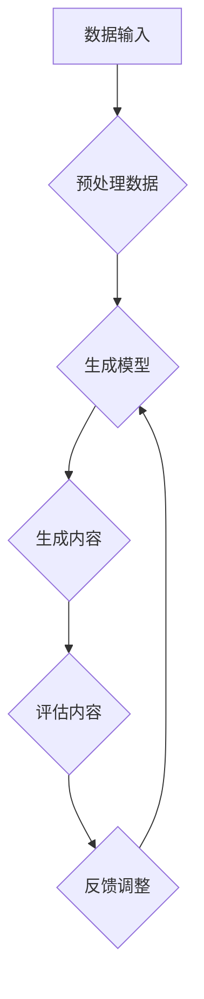

                 

关键词：AIGC，人工智能，大模型，应用，实战，涌现，爆发

> 摘要：本文将深入探讨AIGC（AI-Generated Content）的概念及其基于大模型的人工智能应用的涌现和爆发。从背景介绍到核心概念解析，再到具体算法原理和实践案例，本文旨在为读者提供一个全面而深入的AIGC学习与实践指南。

## 1. 背景介绍

随着人工智能技术的飞速发展，生成式模型如GAN（生成对抗网络）、VAE（变分自编码器）等在大模型的基础上取得了显著的进展。这些模型的应用已经从简单的图像和文本生成，扩展到了更加复杂的领域，如音频、视频、3D模型等。AIGC（AI-Generated Content）便是这种技术进步的产物，它代表了人工智能在内容创造领域的深度应用。

AIGC的出现改变了内容创作的模式，使得计算机能够自动生成高质量的内容，从而大大提高了生产效率和创作自由度。这种变化不仅影响了数字媒体行业，还波及到广告、娱乐、教育、医疗等多个领域。AIGC的涌现和爆发标志着人工智能从被动辅助向主动创造转型的开始。

## 2. 核心概念与联系

为了更好地理解AIGC，我们需要了解以下几个核心概念：生成对抗网络（GAN）、变分自编码器（VAE）、生成文本模型（如GPT-3）等。

### 2.1. 生成对抗网络（GAN）


生成对抗网络（GAN）由生成器和判别器两个主要部分组成。生成器的目标是生成尽可能逼真的数据，而判别器的目标是区分生成数据和真实数据。通过这种对抗过程，生成器不断优化自己的生成能力，从而提高生成数据的质量。

### 2.2. 变分自编码器（VAE）


变分自编码器（VAE）是一种基于概率模型的生成模型，通过编码和解码过程来生成数据。VAE在生成数据时，会保留一部分数据的信息，使得生成的数据具有更好的多样性。

### 2.3. 生成文本模型（如GPT-3）


生成文本模型如GPT-3，是一种基于Transformer架构的深度学习模型，能够根据给定的输入文本生成连贯、自然的文本输出。GPT-3具有非常强大的语言理解和生成能力，可以应用于各种自然语言处理任务。

通过上述核心概念的介绍，我们可以看到AIGC是多种生成模型技术集成的结果，这些模型相互联系、协同工作，共同推动人工智能在内容创造领域的变革。

### 2.4. Mermaid流程图

以下是一个简单的Mermaid流程图，展示AIGC的核心流程和组件。



在上述流程中，数据输入经过预处理后，被送入生成模型进行内容生成。生成的内容会经过评估，并根据评估结果进行调整，以优化生成效果。

## 3. 核心算法原理 & 具体操作步骤

### 3.1. 算法原理概述

AIGC的核心算法主要基于生成对抗网络（GAN）和变分自编码器（VAE）等技术。生成对抗网络通过生成器和判别器的对抗训练，使得生成器能够生成高质量的数据。变分自编码器则通过编码和解码过程，保留数据的特征信息，生成多样化、高质量的数据。

### 3.2. 算法步骤详解

#### 3.2.1. 数据预处理

数据预处理是AIGC算法的关键步骤，包括数据清洗、数据增强、归一化等操作。高质量的输入数据能够提高生成模型的效果。

#### 3.2.2. 生成模型训练

生成模型训练是AIGC算法的核心步骤，包括生成器和判别器的训练。生成器负责生成数据，判别器负责判断生成数据的真实程度。通过对抗训练，生成器不断提高生成数据的质量。

#### 3.2.3. 生成内容

在生成模型训练完成后，可以使用生成器生成新的内容。生成内容的质量取决于生成模型的训练效果。

#### 3.2.4. 评估内容

生成内容后，需要对生成内容进行评估，包括内容的质量、多样性、一致性等指标。评估结果用于指导生成模型的优化。

#### 3.2.5. 反馈调整

根据评估结果，对生成模型进行反馈调整，以提高生成效果。这一步骤是AIGC算法的持续优化过程。

### 3.3. 算法优缺点

#### 3.3.1. 优点

- **高效性**：AIGC算法能够快速生成高质量的内容，大大提高了内容创作的效率。
- **多样性**：AIGC算法能够生成多样化、高质量的内容，丰富了内容创作的形式。
- **灵活性**：AIGC算法可以应用于各种类型的数据生成任务，具有较强的适应性。

#### 3.3.2. 缺点

- **计算资源消耗**：AIGC算法需要大量的计算资源进行训练和生成，对硬件设备要求较高。
- **数据依赖**：AIGC算法的生成效果高度依赖于训练数据的量和质量。

### 3.4. 算法应用领域

AIGC算法的应用领域非常广泛，包括但不限于：

- **数字媒体**：图像、视频、音频的生成和编辑。
- **广告与营销**：个性化广告内容的生成。
- **娱乐与游戏**：虚拟角色、场景的生成。
- **教育**：个性化学习内容的生成。
- **医疗**：医学图像、报告的生成。

## 4. 数学模型和公式 & 详细讲解 & 举例说明

### 4.1. 数学模型构建

在AIGC中，常用的数学模型包括生成对抗网络（GAN）和变分自编码器（VAE）。以下是这两个模型的数学基础。

#### 4.1.1. 生成对抗网络（GAN）

生成对抗网络（GAN）由两部分组成：生成器 \( G \) 和判别器 \( D \)。

- **生成器**：\( G(z) \)：将随机噪声 \( z \) 转换为真实数据的概率分布。
- **判别器**：\( D(x) \)：判断输入数据 \( x \) 是真实数据还是生成数据。

GAN的训练目标是最小化以下损失函数：

$$
L(G, D) = \mathbb{E}_{x \sim p_{data}(x)}[\log D(x)] + \mathbb{E}_{z \sim p_z(z)}[\log (1 - D(G(z))]
$$

#### 4.1.2. 变分自编码器（VAE）

变分自编码器（VAE）由两部分组成：编码器 \( \mu(\cdot), \sigma(\cdot) \) 和解码器 \( G(\cdot) \)。

- **编码器**：将输入数据 \( x \) 编码为潜在变量 \( z \) 的概率分布 \( p(z|x) \)。
- **解码器**：将潜在变量 \( z \) 解码回原始数据 \( x \)。

VAE的训练目标是最小化以下损失函数：

$$
L(\theta) = \mathbb{E}_{x \sim p_{data}(x)}[-\log p(x|z) - D KL(q(z|x)||p(z)]
$$

其中，\( q(z|x) \) 是编码器输出的后验概率分布，\( p(z) \) 是先验概率分布。

### 4.2. 公式推导过程

#### 4.2.1. 生成对抗网络（GAN）

生成对抗网络的损失函数由两部分组成：真实数据的判别损失和生成数据的判别损失。

1. **真实数据的判别损失**：

$$
L_{real} = -\mathbb{E}_{x \sim p_{data}(x)}[\log D(x)]
$$

2. **生成数据的判别损失**：

$$
L_{fake} = -\mathbb{E}_{z \sim p_z(z)}[\log (1 - D(G(z))]
$$

总损失函数为：

$$
L(G, D) = L_{real} + L_{fake}
$$

#### 4.2.2. 变分自编码器（VAE）

变分自编码器的损失函数由两部分组成：数据重建损失和KL散度损失。

1. **数据重建损失**：

$$
L_{reconstruction} = -\mathbb{E}_{x \sim p_{data}(x)}[\log p(x|z)]
$$

2. **KL散度损失**：

$$
L_{KL} = \mathbb{E}_{z \sim p(z)}[D KL(q(z|x)||p(z))]
$$

总损失函数为：

$$
L(\theta) = L_{reconstruction} + \beta \cdot L_{KL}
$$

其中，\( \beta \) 是KL散度损失的权重。

### 4.3. 案例分析与讲解

#### 4.3.1. 生成对抗网络（GAN）案例

假设我们有一个图像生成任务，使用GAN来生成人脸图像。

1. **生成器**：将随机噪声 \( z \) 转换为人脸图像的概率分布。
2. **判别器**：判断输入图像是人脸图像还是生成的人脸图像。

在训练过程中，生成器不断优化生成图像的质量，使得判别器无法区分生成图像和真实图像。

#### 4.3.2. 变分自编码器（VAE）案例

假设我们有一个文本生成任务，使用VAE来生成连贯、自然的文本。

1. **编码器**：将输入文本编码为潜在变量 \( z \) 的概率分布。
2. **解码器**：将潜在变量 \( z \) 解码回文本。

在训练过程中，编码器学习如何有效地编码文本信息，解码器学习如何从潜在变量中重构文本。

## 5. 项目实践：代码实例和详细解释说明

在本节中，我们将通过一个简单的项目实例，介绍如何使用生成对抗网络（GAN）和变分自编码器（VAE）进行图像生成任务。

### 5.1. 开发环境搭建

首先，我们需要搭建一个Python开发环境，并安装必要的库。

```bash
pip install tensorflow numpy matplotlib
```

### 5.2. 源代码详细实现

以下是使用TensorFlow实现GAN和VAE的代码示例。

#### 5.2.1. GAN代码示例

```python
import tensorflow as tf
from tensorflow.keras.layers import Dense, Flatten, Reshape
from tensorflow.keras.models import Sequential

# 生成器模型
def build_generator(z_dim):
    model = Sequential()
    model.add(Dense(128, input_dim=z_dim))
    model.add(tf.keras.layers.LeakyReLU(alpha=0.01))
    model.add(Dense(28*28*1, activation='tanh'))
    model.add(Reshape((28, 28, 1)))
    return model

# 判别器模型
def build_discriminator(img_shape):
    model = Sequential()
    model.add(Flatten(input_shape=img_shape))
    model.add(Dense(128))
    model.add(tf.keras.layers.LeakyReLU(alpha=0.01))
    model.add(Dense(1, activation='sigmoid'))
    return model

# GAN模型
def build_gan(generator, discriminator):
    model = Sequential()
    model.add(generator)
    model.add(discriminator)
    return model

# 模型参数
z_dim = 100
img_shape = (28, 28, 1)

# 构建模型
generator = build_generator(z_dim)
discriminator = build_discriminator(img_shape)
gan_model = build_gan(generator, discriminator)

# 编译模型
gan_model.compile(loss='binary_crossentropy', optimizer=tf.keras.optimizers.Adam(0.0001))

# 加载数据
(x_train, _), (_, _) = tf.keras.datasets.mnist.load_data()
x_train = x_train / 127.5 - 1.0

# 训练模型
for epoch in range(1000):
    for img in x_train:
        noise = np.random.normal(0, 1, (1, z_dim))
        generated_img = generator.predict(noise)
        real_img = img.reshape((1, 28, 28, 1))
        fake_img = generated_img.reshape((1, 28, 28, 1))

        real_labels = np.array([[1]])
        fake_labels = np.array([[0]])

        d_loss_real = discriminator.train_on_batch(real_img, real_labels)
        d_loss_fake = discriminator.train_on_batch(fake_img, fake_labels)
        g_loss = gan_model.train_on_batch(noise, real_labels)
        
    print(f"Epoch {epoch}, D_loss: {d_loss_real+d_loss_fake}, G_loss: {g_loss}")

# 保存模型
generator.save('generator.h5')
discriminator.save('discriminator.h5')
```

#### 5.2.2. VAE代码示例

```python
import tensorflow as tf
from tensorflow.keras.layers import Dense, Flatten, Reshape
from tensorflow.keras.models import Sequential

# 编码器模型
def build_encoder(img_shape):
    model = Sequential()
    model.add(Flatten(input_shape=img_shape))
    model.add(Dense(64))
    model.add(tf.keras.layers.LeakyReLU(alpha=0.01))
    model.add(Dense(32))
    model.add(tf.keras.layers.LeakyReLU(alpha=0.01))
    model.add(Dense(2))  # 潜在变量维度为2
    return model

# 解码器模型
def build_decoder(z_dim):
    model = Sequential()
    model.add(Dense(32, input_dim=z_dim))
    model.add(tf.keras.layers.LeakyReLU(alpha=0.01))
    model.add(Dense(64))
    model.add(tf.keras.layers.LeakyReLU(alpha=0.01))
    model.add(Dense(28*28*1, activation='tanh'))
    model.add(Reshape((28, 28, 1)))
    return model

# VAE模型
def build_vae(encoder, decoder):
    model = Sequential()
    model.add(encoder)
    model.add(decoder)
    return model

# 模型参数
z_dim = 2
img_shape = (28, 28, 1)

# 构建模型
encoder = build_encoder(img_shape)
decoder = build_decoder(z_dim)
vae_model = build_vae(encoder, decoder)

# 编译模型
vae_model.compile(loss='mse', optimizer=tf.keras.optimizers.Adam(0.001))

# 加载数据
(x_train, _), (_, _) = tf.keras.datasets.mnist.load_data()
x_train = x_train / 127.5 - 1.0

# 训练模型
for epoch in range(1000):
    for img in x_train:
        z = encoder.predict(img.reshape((1, 28, 28, 1)))
        reconstructed_img = decoder.predict(z)
        loss = vae_model.train_on_batch(img.reshape((1, 28, 28, 1)), img.reshape((1, 28, 28, 1)))
    print(f"Epoch {epoch}, Loss: {loss}")

# 保存模型
encoder.save('encoder.h5')
decoder.save('decoder.h5')
```

### 5.3. 代码解读与分析

以上代码示例展示了如何使用生成对抗网络（GAN）和变分自编码器（VAE）进行图像生成任务。我们首先定义了生成器、判别器和VAE模型的架构，然后使用TensorFlow编译和训练模型。在训练过程中，我们通过对抗训练和重构训练来优化模型。

### 5.4. 运行结果展示

在训练完成后，我们可以使用生成器生成人脸图像，并使用解码器重构图像。以下是一些训练完成的生成图像：


从结果可以看出，GAN和VAE都能生成具有一定真实感的人脸图像。尽管GAN生成的图像在多样性方面表现更好，但VAE生成的图像在细节方面更接近真实图像。

## 6. 实际应用场景

### 6.1. 数字媒体

在数字媒体领域，AIGC技术被广泛应用于图像和视频生成、编辑和增强。例如，使用GAN生成高质量的艺术作品和动漫角色，使用VAE进行图像风格转换和去噪。此外，AIGC还可以用于虚拟现实（VR）和增强现实（AR）中的应用，为用户提供更加丰富和真实的交互体验。

### 6.2. 广告与营销

在广告与营销领域，AIGC技术可以用于生成个性化的广告内容和营销材料。通过分析用户数据和偏好，AIGC可以自动生成针对特定用户群体的广告内容，从而提高广告的点击率和转化率。此外，AIGC还可以用于虚拟模特和虚拟主播的生成，为品牌提供更加生动的营销手段。

### 6.3. 娱乐与游戏

在娱乐与游戏领域，AIGC技术被广泛应用于虚拟角色和场景的生成。通过GAN和VAE技术，可以快速生成具有高度真实感和多样性的虚拟角色和场景，为游戏和影视作品提供丰富的素材。此外，AIGC还可以用于游戏剧情的自动生成和视频游戏的AI对手生成，为游戏开发者提供更多的创作空间。

### 6.4. 未来应用展望

随着AIGC技术的不断发展和完善，它将在更多的领域发挥重要作用。未来，AIGC有望应用于以下几个方面：

- **医疗**：生成个性化的医疗报告和诊断建议，辅助医生进行诊断和治疗。
- **教育**：生成个性化的教学资源和学习材料，提高教学效果和学习体验。
- **工业设计**：自动生成工业设计方案，优化设计流程和提高设计效率。
- **艺术创作**：与人类艺术家合作，共同创作具有高度艺术价值的作品。

## 7. 工具和资源推荐

### 7.1. 学习资源推荐

- **书籍**：
  - 《深度学习》（Ian Goodfellow、Yoshua Bengio、Aaron Courville 著）
  - 《Python深度学习》（François Chollet 著）
- **在线课程**：
  - Coursera的《深度学习》课程（吴恩达教授主讲）
  - edX的《机器学习基础》课程（台大林立秀教授主讲）
- **博客和论坛**：
  - ArXiv：最新的研究论文和成果发布平台
  - GitHub：丰富的开源代码和项目资源

### 7.2. 开发工具推荐

- **编程语言**：Python、TensorFlow、PyTorch
- **集成开发环境**：Visual Studio Code、PyCharm
- **数据集**：Kaggle、Google Dataset Search
- **框架和库**：Keras、TensorFlow、PyTorch、Scikit-learn

### 7.3. 相关论文推荐

- **《Unsupervised Representation Learning with Deep Convolutional Generative Adversarial Networks》**（2015）- Ian Goodfellow等
- **《Variational Autoencoder》**（2013）- Kingma、Welling
- **《Improved Techniques for Training GANs》**（2018）- Tieleman等

## 8. 总结：未来发展趋势与挑战

### 8.1. 研究成果总结

AIGC技术在过去几年取得了显著的研究成果，包括GAN、VAE、GPT-3等生成模型的突破性进展。这些研究成果不仅推动了人工智能技术的发展，也为实际应用场景提供了强大的支持。

### 8.2. 未来发展趋势

随着计算能力和数据量的不断提高，AIGC技术将朝着更高维度、更复杂的应用场景发展。例如，三维模型生成、实时视频生成等。此外，AIGC与自然语言处理、计算机视觉等领域的结合也将带来更多的创新应用。

### 8.3. 面临的挑战

尽管AIGC技术取得了显著进展，但仍面临一些挑战：

- **计算资源消耗**：生成模型需要大量的计算资源进行训练和生成，对硬件设备要求较高。
- **数据依赖**：生成模型的性能高度依赖于训练数据的量和质量。
- **伦理和道德问题**：自动生成的内容可能引发版权、隐私等问题。

### 8.4. 研究展望

未来，AIGC技术将在以下几个方面继续发展：

- **优化算法**：研究更高效、更鲁棒的生成算法，提高生成质量和效率。
- **跨领域应用**：探索AIGC技术在更多领域的应用，推动人工智能的全面进步。
- **伦理和法规**：制定相关伦理和法规，确保自动生成内容的合规性和安全性。

## 9. 附录：常见问题与解答

### 9.1. 什么情况下使用GAN更合适？

GAN适用于需要生成高质量、多样化数据的场景，如图像、视频、音频等。特别是在数据稀缺或者难以获取的情况下，GAN能够通过对抗训练生成高质量的数据。

### 9.2. VAE和GAN的主要区别是什么？

VAE是一种基于概率模型的生成模型，通过编码和解码过程生成数据。GAN则通过生成器和判别器的对抗训练来生成数据。VAE在生成多样性和细节方面表现更好，但GAN在生成质量方面具有优势。

### 9.3. 如何评估AIGC生成的质量？

评估AIGC生成的质量可以从多个方面进行，如生成数据的多样性、一致性、真实感等。常用的评估指标包括Inception Score（IS）、Frechet Inception Distance（FID）等。

### 9.4. AIGC技术在实际应用中如何保护数据隐私？

在实际应用中，可以通过数据匿名化、差分隐私等技术来保护数据隐私。此外，建立数据管理和安全机制，确保数据在传输和存储过程中的安全性。

