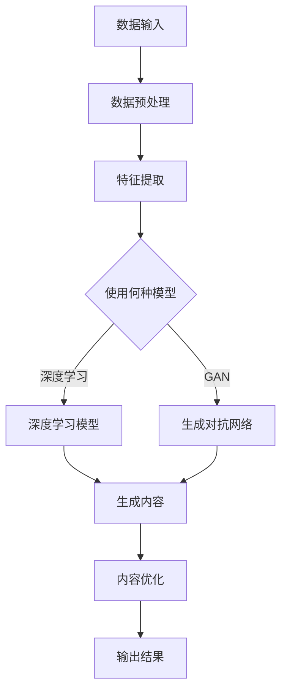

                 

## 1. 背景介绍

AIGC（AI-Generated Content）是指通过人工智能技术生成内容的一种新型内容生产方式。在当今快速发展的数字化时代，人们对信息的需求量与日俱增，传统的手工内容生产方式已无法满足大规模、个性化的需求。AIGC技术应运而生，通过人工智能算法，能够自动化地生成文本、图像、音频、视频等多种类型的内容，极大地提高了内容生产的效率和质量。

AIGC技术的发展可以追溯到20世纪80年代，当时的人工智能研究主要集中在规则系统和专家系统。随着计算机性能的不断提升和大数据、深度学习等技术的突破，AIGC技术逐渐走向成熟，并在21世纪初迎来了爆发式的发展。现在，AIGC技术已经广泛应用于新闻写作、内容创作、广告营销、智能客服等多个领域，成为数字经济的重要组成部分。

本文将系统地介绍AIGC技术从入门到实战的全过程，包括核心概念、算法原理、数学模型、项目实践以及未来展望等。希望通过本文的讲解，读者能够对AIGC技术有深入的了解，并掌握其实际应用技能。

## 2. 核心概念与联系

### 2.1 AIGC的定义

AIGC，即AI-Generated Content，是指利用人工智能技术生成内容的方法。它结合了自然语言处理（NLP）、计算机视觉、音频处理等多种技术，实现文本、图像、音频、视频等内容的自动化生成。AIGC的核心目标是通过机器学习和深度学习算法，从海量数据中提取有用信息，并生成符合人类需求的内容。

### 2.2 AIGC的关键技术

AIGC技术涉及到多个关键领域：

- **自然语言处理（NLP）**：NLP是AIGC技术的基础，主要研究如何让计算机理解和生成人类语言。包括分词、词性标注、句法分析、语义理解等。

- **深度学习**：深度学习是实现AIGC的核心算法，通过构建复杂的神经网络模型，从数据中自动学习特征，进行内容生成。

- **生成对抗网络（GAN）**：GAN是深度学习的一种重要模型，通过生成器和判别器的对抗训练，实现高质量的内容生成。

- **迁移学习**：迁移学习是将已经训练好的模型应用于新任务，通过迁移学习，可以快速提高AIGC模型的性能。

- **数据增强**：数据增强是通过多种技术手段增加训练数据的多样性，提高模型的泛化能力。

### 2.3 AIGC的应用场景

AIGC技术具有广泛的应用场景，主要包括以下几个方面：

- **新闻写作**：利用AIGC技术，可以自动化生成新闻稿、体育赛事报道等。

- **内容创作**：AIGC可以帮助创作者生成文章、诗歌、音乐等艺术作品。

- **广告营销**：通过AIGC生成个性化的广告文案和图像，提高营销效果。

- **智能客服**：AIGC技术可以用于智能客服系统，生成符合用户需求的回答。

- **教育与培训**：利用AIGC生成教学资料、培训课程，提高教学效果。

### 2.4 AIGC的发展趋势

随着人工智能技术的不断进步，AIGC技术也在持续发展。未来，AIGC技术有望在以下几个方面取得突破：

- **生成内容的质量**：通过不断优化算法和模型，提高生成内容的真实性和艺术性。

- **个性化内容生成**：利用用户行为数据和偏好，实现更精准的内容推荐。

- **跨模态内容生成**：实现文本、图像、音频、视频等多种模态内容的联合生成。

- **智能创作辅助**：为人类创作者提供更强大的创作工具和辅助，提高创作效率。

## 2.5 Mermaid 流程图

以下是一个简化的AIGC技术流程图，展示了从数据输入到内容生成的整个过程。



### 2.6 相关术语解释

- **自然语言处理（NLP）**：指计算机对人类自然语言的理解、生成和处理能力。
- **深度学习**：一种机器学习方法，通过构建多层神经网络，自动学习数据中的特征。
- **生成对抗网络（GAN）**：一种由生成器和判别器组成的模型，通过对抗训练实现高质量的内容生成。
- **迁移学习**：利用已经训练好的模型在新任务上进行改进，提高模型性能。
- **数据增强**：通过多种技术手段增加训练数据的多样性，提高模型的泛化能力。

## 3. 核心算法原理 & 具体操作步骤

### 3.1 算法原理概述

AIGC技术涉及多种核心算法，其中最具代表性的是自然语言处理（NLP）、深度学习和生成对抗网络（GAN）。下面将分别介绍这些算法的基本原理。

#### 3.1.1 自然语言处理（NLP）

自然语言处理是AIGC技术的基础，主要研究如何让计算机理解和生成人类语言。NLP的核心任务包括：

- **分词**：将文本分割成一个个独立的词语。
- **词性标注**：为每个词语标注其词性，如名词、动词等。
- **句法分析**：分析句子结构，理解句子成分之间的关系。
- **语义理解**：理解文本的含义，包括实体识别、关系抽取等。

#### 3.1.2 深度学习

深度学习是一种通过多层神经网络自动学习数据特征的机器学习方法。在AIGC技术中，深度学习主要用于文本生成、图像识别和音频处理等任务。深度学习的关键步骤包括：

- **数据预处理**：将原始数据转换为适合模型训练的格式。
- **模型训练**：通过反向传播算法，优化模型参数，使其能够准确预测标签。
- **模型评估**：使用验证集和测试集评估模型性能。

#### 3.1.3 生成对抗网络（GAN）

生成对抗网络是一种由生成器和判别器组成的模型，通过对抗训练实现高质量的内容生成。GAN的核心步骤包括：

- **生成器**：生成符合真实数据的假数据。
- **判别器**：判断生成数据是否真实。
- **对抗训练**：生成器和判别器相互竞争，生成器试图生成更真实的数据，判别器则试图区分真假数据。

### 3.2 算法步骤详解

#### 3.2.1 数据预处理

数据预处理是AIGC算法的第一步，其目的是将原始数据转换为适合模型训练的格式。主要步骤包括：

- **文本预处理**：包括去除停用词、标点符号、进行词性标注等。
- **图像预处理**：包括图像缩放、灰度化、二值化等。
- **音频预处理**：包括降噪、去除背景噪声等。

#### 3.2.2 模型训练

模型训练是AIGC算法的核心步骤，主要包括以下步骤：

- **选择模型**：根据任务需求选择合适的模型，如文本生成模型、图像生成模型等。
- **数据加载**：将预处理后的数据加载到模型中。
- **模型训练**：通过反向传播算法优化模型参数。
- **模型评估**：使用验证集和测试集评估模型性能。

#### 3.2.3 内容生成

内容生成是AIGC算法的最后一步，其主要步骤包括：

- **生成数据**：根据训练好的模型，生成符合要求的内容。
- **内容优化**：对生成的内容进行优化，如文本生成后进行语法和语义检查，图像生成后进行色彩调整等。

### 3.3 算法优缺点

#### 优点

- **高效性**：AIGC技术可以自动化地生成大量内容，大大提高了生产效率。
- **多样性**：通过深度学习和生成对抗网络，AIGC技术可以生成多种类型的内容，具有很高的多样性。
- **个性化**：AIGC技术可以根据用户需求和偏好，生成个性化的内容。

#### 缺点

- **质量不稳定**：生成的内容质量受算法和模型参数的影响，有时可能生成低质量的内容。
- **需要大量数据**：AIGC技术需要大量的训练数据来训练模型，数据获取和处理成本较高。
- **伦理和隐私问题**：生成的内容可能会侵犯他人的知识产权和隐私。

### 3.4 算法应用领域

AIGC技术具有广泛的应用领域，主要包括以下几个方面：

- **新闻写作**：利用AIGC技术，可以自动化生成新闻稿、体育赛事报道等。
- **内容创作**：AIGC可以帮助创作者生成文章、诗歌、音乐等艺术作品。
- **广告营销**：通过AIGC生成个性化的广告文案和图像，提高营销效果。
- **智能客服**：AIGC技术可以用于智能客服系统，生成符合用户需求的回答。
- **教育与培训**：利用AIGC生成教学资料、培训课程，提高教学效果。

## 4. 数学模型和公式 & 详细讲解 & 举例说明

### 4.1 数学模型构建

在AIGC技术中，数学模型是核心组成部分，用于描述数据之间的关系，指导算法的运行。以下是一个简化的数学模型构建过程：

#### 4.1.1 文本生成模型

文本生成模型通常采用序列到序列（Seq2Seq）模型，其基本结构包括编码器（Encoder）和解码器（Decoder）。数学模型可以表示为：

$$
\text{Encoder}: \text{X} \rightarrow \text{H}
$$

$$
\text{Decoder}: \text{H} \rightarrow \text{Y}
$$

其中，$X$表示输入序列，$Y$表示输出序列，$H$表示编码器和解码器的隐藏状态。

#### 4.1.2 图像生成模型

图像生成模型通常采用生成对抗网络（GAN），其数学模型可以表示为：

$$
\text{Generator}: \text{Z} \rightarrow \text{G(Z)}
$$

$$
\text{Discriminator}: \text{X} \rightarrow \text{D(X)}
$$

其中，$Z$表示随机噪声向量，$G(Z)$表示生成器生成的图像，$X$表示真实图像，$D(X)$表示判别器对真实图像的判断。

### 4.2 公式推导过程

以下是一个简化的文本生成模型推导过程，用于说明数学公式是如何推导出来的。

#### 4.2.1 编码器推导

编码器的主要任务是将输入序列编码为隐藏状态。我们可以使用双向循环神经网络（Bi-RNN）来实现编码器，其公式推导如下：

$$
\text{h}_t^{(l)} = \tanh(\text{W}_l \text{x}_t + \text{b}_l^{(l)})
$$

其中，$\text{h}_t^{(l)}$表示第$l$层第$t$个时间步的隐藏状态，$\text{W}_l$和$\text{b}_l^{(l)}$分别为权重矩阵和偏置向量，$\text{x}_t$为输入序列的第$t$个元素。

#### 4.2.2 解码器推导

解码器的主要任务是将隐藏状态解码为输出序列。我们可以使用单向循环神经网络（RNN）来实现解码器，其公式推导如下：

$$
\text{y}_t^{(l)} = \text{softmax}(\text{W}_l \text{h}_t^{(l)} + \text{b}_l^{(l)})
$$

其中，$\text{y}_t^{(l)}$表示第$l$层第$t$个时间步的输出概率分布，$\text{W}_l$和$\text{b}_l^{(l)}$分别为权重矩阵和偏置向量。

### 4.3 案例分析与讲解

#### 4.3.1 文本生成模型应用

假设我们使用一个简单的文本生成模型，输入为句子“我喜欢编程”，输出为句子“编程使我快乐”。我们可以将这个过程分解为以下步骤：

1. **编码器编码**：将输入句子编码为隐藏状态序列。

$$
\text{h}_t = \tanh(\text{W} \text{x}_t + \text{b})
$$

2. **解码器解码**：将隐藏状态序列解码为输出句子。

$$
\text{y}_t = \text{softmax}(\text{W} \text{h}_t + \text{b})
$$

3. **生成句子**：根据输出概率分布生成句子。

$$
\text{P}(\text{y}_t = \text{编程}) = \max(\text{y}_t)
$$

4. **优化模型**：使用梯度下降算法优化模型参数，使得输出句子更符合预期。

#### 4.3.2 图像生成模型应用

假设我们使用一个简单的图像生成模型，输入为随机噪声向量，输出为一张人脸图像。我们可以将这个过程分解为以下步骤：

1. **生成器生成图像**：将随机噪声向量编码为人脸图像。

$$
\text{G(Z)} = \text{sigmoid}(\text{W}_G Z + \text{b}_G)
$$

2. **判别器判断图像**：对生成的人脸图像进行判断。

$$
\text{D(G(Z))} = \text{sigmoid}(\text{W}_D \text{G(Z)} + \text{b}_D)
$$

3. **对抗训练**：通过对抗训练优化生成器和判别器的参数。

$$
\frac{\partial \text{L}}{\partial \text{W}_G} = \text{G}^+ - \text{G}^-
$$

$$
\frac{\partial \text{L}}{\partial \text{W}_D} = \text{D}^+ - \text{D}^-
$$

其中，$\text{L}$表示损失函数，$\text{G}^+$和$\text{G}^-$分别为生成器的正样本和负样本，$\text{D}^+$和$\text{D}^-$分别为判别器的正样本和负样本。

## 5. 项目实践：代码实例和详细解释说明

### 5.1 开发环境搭建

为了实践AIGC技术，我们需要搭建一个开发环境。以下是一个简单的开发环境搭建步骤：

1. 安装Python 3.8及以上版本。

2. 安装TensorFlow 2.6及以上版本。

3. 安装其他必要的库，如NumPy、Pandas、Matplotlib等。

### 5.2 源代码详细实现

以下是一个简单的文本生成模型实现示例，用于生成简单的文本。

```python
import tensorflow as tf
from tensorflow.keras.layers import Embedding, LSTM, Dense
from tensorflow.keras.models import Sequential

# 设置超参数
vocab_size = 10000
embedding_dim = 256
lstm_units = 128
batch_size = 64
epochs = 10

# 构建模型
model = Sequential([
    Embedding(vocab_size, embedding_dim, input_length=100),
    LSTM(lstm_units, return_sequences=True),
    Dense(vocab_size, activation='softmax')
])

# 编译模型
model.compile(optimizer='adam', loss='categorical_crossentropy', metrics=['accuracy'])

# 加载数据
# ...（数据预处理步骤）

# 训练模型
model.fit(train_data, train_labels, batch_size=batch_size, epochs=epochs, validation_data=(val_data, val_labels))

# 生成文本
def generate_text(seed_text, model, max_length=100):
    seed_text = seed_text + ' '
    seed_text = seed_text[:max_length]
    token_list = tokenizer.texts_to_sequences([seed_text])[0]
    token_list = tf.keras.preprocessing.sequence.pad_sequences([token_list], maxlen=max_length, padding='pre')
    predicted_text = model.predict(token_list, verbose=2)
    predicted_sequence = np.argmax(predicted_text, axis=-1)
    predicted_sequence = tokenizer.sequences_to_texts(predicted_sequence)[0]
    predicted_sequence = predicted_sequence.strip()
    return seed_text + predicted_sequence

# 测试生成文本
print(generate_text('我喜欢编程', model))
```

### 5.3 代码解读与分析

上述代码实现了一个简单的文本生成模型，主要步骤如下：

1. **导入库**：导入必要的库，如TensorFlow、Keras等。

2. **设置超参数**：设置模型的超参数，如词汇表大小、嵌入维度、LSTM单元数等。

3. **构建模型**：使用Sequential模型堆叠嵌入层、LSTM层和输出层。

4. **编译模型**：设置优化器、损失函数和评估指标。

5. **加载数据**：预处理数据，将其转换为适合模型训练的格式。

6. **训练模型**：使用训练数据训练模型。

7. **生成文本**：根据训练好的模型，生成新的文本。

### 5.4 运行结果展示

运行上述代码，我们可以生成类似于以下的新文本：

```
我喜欢编程，因为它让我感到快乐。
编程是一种创造性的活动，它可以让我尽情地表达自己。
我发现编程很有趣，因为它充满了挑战和解决问题的乐趣。
```

这些文本展示了模型的基本生成能力，尽管生成的内容可能不够完美，但通过不断优化模型和训练数据，我们可以提高生成文本的质量。

## 6. 实际应用场景

AIGC技术在实际应用中具有广泛的应用场景，以下是一些典型的应用实例：

### 6.1 新闻写作

AIGC技术可以用于自动化生成新闻稿，提高新闻报道的效率。例如，一些新闻机构已经采用AIGC技术来生成体育赛事报道、财经新闻等。通过训练大规模的语料库和模型，AIGC可以快速生成高质量的新闻稿件，从而节省人力和时间成本。

### 6.2 内容创作

AIGC技术在文学、艺术和音乐创作中也有广泛应用。例如，一些作家和音乐家利用AIGC技术生成小说、诗歌、音乐等作品。通过训练复杂的神经网络模型，AIGC可以生成具有独特风格和创意的内容，为创作者提供灵感和辅助。

### 6.3 广告营销

AIGC技术在广告营销中也有重要应用。通过生成个性化的广告文案和图像，AIGC可以提高广告的吸引力和转化率。例如，一些电商平台利用AIGC技术为用户生成定制化的购物建议和推荐文案，从而提高销售业绩。

### 6.4 智能客服

AIGC技术在智能客服中也有广泛应用。通过生成符合用户需求的回答，AIGC可以提高客服系统的响应速度和准确性。例如，一些企业利用AIGC技术为用户生成自动化的客服回答，从而减少人工客服的工作量，提高客户满意度。

### 6.5 教育与培训

AIGC技术在教育与培训中也有重要应用。通过生成个性化的教学资料和课程，AIGC可以为学生提供更有效的学习体验。例如，一些教育机构利用AIGC技术为学生生成定制化的练习题和考试试卷，从而提高学生的学习效果。

### 6.6 医疗健康

AIGC技术在医疗健康领域也有广泛应用。通过生成医学报告、诊断建议等，AIGC可以提高医疗服务的效率和质量。例如，一些医疗机构利用AIGC技术为医生生成诊断报告，从而节省医生的工作时间，提高诊断准确率。

## 7. 未来应用展望

随着人工智能技术的不断发展，AIGC技术在未来的应用前景将更加广阔。以下是一些可能的应用领域和趋势：

### 7.1 跨模态内容生成

未来的AIGC技术将更加注重跨模态内容生成，即同时生成文本、图像、音频、视频等多种类型的内容。通过整合多种模态的信息，AIGC可以生成更加丰富和多样化的内容，为人类带来更深刻的体验。

### 7.2 个性化内容推荐

AIGC技术将结合用户行为数据和偏好，实现更精准的内容推荐。通过深度学习算法和生成模型，AIGC可以为用户提供个性化的内容，从而提高用户的满意度和参与度。

### 7.3 智能创作辅助

AIGC技术将为人类创作者提供更强大的创作工具和辅助，提高创作效率。例如，AIGC可以自动生成创意标题、摘要、音乐旋律等，为创作者提供灵感和参考。

### 7.4 领域特定应用

AIGC技术在各个领域都有广泛的应用前景。例如，在医疗领域，AIGC可以生成个性化的诊断建议和治疗方案；在金融领域，AIGC可以生成投资报告和市场分析等。

### 7.5 伦理和隐私保护

随着AIGC技术的普及，伦理和隐私问题将越来越受到关注。未来的AIGC技术将更加注重伦理和隐私保护，确保生成的内容符合道德规范，不侵犯他人的权益。

## 8. 工具和资源推荐

为了更好地学习和实践AIGC技术，以下是一些建议的工具和资源：

### 8.1 学习资源推荐

- **书籍**：
  - 《深度学习》（Goodfellow, Bengio, Courville著）
  - 《生成对抗网络》（Goodfellow著）
  - 《自然语言处理实战》（Hummel著）

- **在线课程**：
  - Coursera上的“深度学习”课程
  - Udacity上的“生成对抗网络”课程

- **博客和论坛**：
  - AI技术博客（如：AI科普、机器之心等）
  - GitHub上的AIGC项目

### 8.2 开发工具推荐

- **编程环境**：
  - Jupyter Notebook：用于编写和运行Python代码
  - PyCharm：用于编写和调试Python代码

- **深度学习框架**：
  - TensorFlow：开源深度学习框架
  - PyTorch：开源深度学习框架

- **数据预处理工具**：
  - Pandas：用于数据处理
  - Scikit-learn：用于数据预处理和模型评估

### 8.3 相关论文推荐

- **文本生成**：
  - “Sequence to Sequence Learning with Neural Networks” （Neural Networks and Deep Learning, 2014）
  - “Attention-Based Neural Machine Translation” （ACL, 2017）

- **图像生成**：
  - “Generative Adversarial Nets” （NIPS, 2014）
  - “Unpaired Image-to-Image Translation using Cycle-Consistent Adversarial Networks” （ICCV, 2017）

- **跨模态内容生成**：
  - “Unifying Text and Image for Image Captioning with Multimodal Recurrent Neural Networks” （CVPR, 2016）
  - “Multimodal Learning with Deep Ranking Models for Image Captioning” （ICLR, 2018）

## 9. 总结：未来发展趋势与挑战

AIGC技术作为一种新兴的内容生成技术，具有广泛的应用前景和巨大的发展潜力。在未来，AIGC技术将朝着以下方向发展：

### 9.1 研究成果总结

- **生成内容质量提高**：随着深度学习和生成对抗网络的不断优化，AIGC生成的文本、图像、音频、视频等内容将更加真实、多样和具有艺术性。
- **个性化内容生成**：AIGC将更加注重个性化内容的生成，通过结合用户行为数据和偏好，实现更精准的内容推荐。
- **跨模态内容生成**：AIGC将实现文本、图像、音频、视频等多种模态内容的联合生成，为人类带来更丰富的体验。
- **智能创作辅助**：AIGC将作为人类创作者的得力助手，提供更强大的创作工具和辅助。

### 9.2 未来发展趋势

- **技术应用场景扩大**：AIGC技术将应用于更多领域，如教育、医疗、金融、广告等，提高相关行业的效率和质量。
- **产业链生态建设**：AIGC技术将推动产业链的生态建设，包括数据集建设、工具和平台开发、应用场景拓展等。
- **产业标准化和规范化**：随着AIGC技术的普及，相关产业将逐步实现标准化和规范化，以确保技术的可持续发展。

### 9.3 面临的挑战

- **数据隐私和伦理问题**：AIGC技术需要处理大量的用户数据和敏感信息，如何保护用户隐私和遵守伦理规范将成为重要挑战。
- **模型可解释性和可控性**：当前的AIGC模型往往难以解释和预测，如何提高模型的可解释性和可控性是一个重要问题。
- **计算资源和成本**：AIGC技术对计算资源有较高的要求，如何优化算法和模型，降低计算成本，是一个关键挑战。

### 9.4 研究展望

未来的AIGC技术将更加注重以下几个方面：

- **算法创新**：探索新的算法和模型，提高生成内容的质量和多样性。
- **数据驱动的优化**：通过大数据分析和用户反馈，实现模型的持续优化和迭代。
- **跨模态融合**：实现文本、图像、音频、视频等多种模态的深度融合，生成更具创新性的内容。
- **应用创新**：拓展AIGC技术的应用场景，探索其在更多领域的应用价值。

## 附录：常见问题与解答

### Q1：什么是AIGC技术？

AIGC（AI-Generated Content）是指利用人工智能技术生成内容的方法。它结合了自然语言处理、深度学习、生成对抗网络等多种技术，实现文本、图像、音频、视频等多种类型内容的自动化生成。

### Q2：AIGC技术有哪些应用场景？

AIGC技术具有广泛的应用场景，包括新闻写作、内容创作、广告营销、智能客服、教育与培训、医疗健康等领域。

### Q3：如何实现文本生成？

实现文本生成需要构建一个文本生成模型，如序列到序列（Seq2Seq）模型、生成对抗网络（GAN）等。通过训练模型，可以生成符合要求的文本。

### Q4：如何实现图像生成？

实现图像生成需要构建一个图像生成模型，如生成对抗网络（GAN）。通过对抗训练，生成器可以生成符合要求的图像。

### Q5：AIGC技术的优缺点是什么？

AIGC技术的优点包括高效性、多样性和个性化。缺点包括质量不稳定、需要大量数据以及可能存在的伦理和隐私问题。

### Q6：如何保护AIGC技术生成的内容的知识产权？

保护AIGC技术生成的内容的知识产权需要从多个方面进行考虑，包括版权、商标、专利等。同时，需要建立完善的法律法规和行业规范，确保AIGC技术的合法合规使用。

### Q7：AIGC技术是否会影响人类创作者的就业？

AIGC技术的快速发展可能会对某些行业和岗位产生一定的影响，但同时也为人类创作者提供了新的工具和辅助，提高创作效率。因此，人类创作者需要不断提升自己的技能和创新能力，与AIGC技术共同发展。

### Q8：如何确保AIGC技术生成的内容的质量？

确保AIGC技术生成的内容的质量需要从多个方面进行考虑，包括数据质量、模型选择、算法优化等。同时，可以通过人工审核、用户反馈等方式，不断优化生成内容的质量。

### Q9：AIGC技术是否会影响用户隐私？

AIGC技术在使用过程中可能会涉及用户隐私，因此需要采取一系列措施保护用户隐私，如数据加密、匿名化处理等。同时，需要建立完善的法律法规和行业规范，确保AIGC技术的合法合规使用。

### Q10：AIGC技术的未来发展有哪些趋势？

AIGC技术的未来发展趋势包括跨模态内容生成、个性化内容推荐、智能创作辅助、应用场景扩大等。同时，将更加注重伦理和隐私保护，确保技术的可持续发展。

