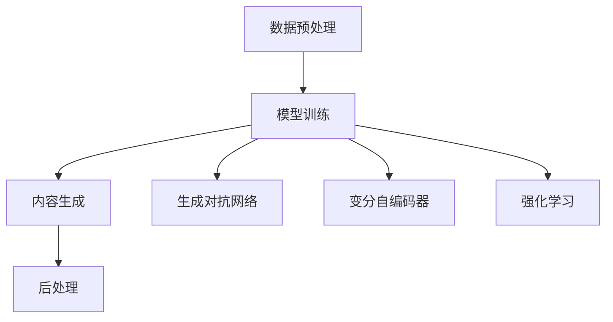

                 

### 关键词 Keywords
- AIGC
- 硬件部署
- 工程源码
- 计算机架构
- 算法优化
- 硬件加速
- 系统集成

### 摘要 Abstract
本文旨在为读者提供一份详尽的指南，从AIGC（AI-Generated Content）的基本概念入手，深入探讨其在硬件部署和工程源码运行中的实际应用。文章首先介绍了AIGC的背景和重要性，然后逐步讲解了核心概念和联系，核心算法原理，数学模型和公式，项目实践，实际应用场景，未来展望，以及相关工具和资源的推荐。最后，文章总结了当前的研究成果，提出了未来的发展趋势与挑战。

## 1. 背景介绍 Introduction

### 1.1 AIGC的概念和起源

AIGC，全称AI-Generated Content，指的是通过人工智能技术生成内容的一种方式。它涵盖了文本、图像、音频等多种形式，是人工智能在创造性和生成性任务中的典型应用。AIGC的起源可以追溯到深度学习和生成对抗网络（GANs）的发展，这些技术的进步为AIGC的应用提供了强有力的技术支撑。

### 1.2 AIGC的应用领域

AIGC在多个领域都有广泛的应用，包括但不限于：

- **内容创作**：自动生成文章、音乐、视频等。
- **游戏开发**：创建新的游戏角色、场景和故事情节。
- **设计**：自动生成建筑模型、服装设计等。
- **教育与培训**：生成个性化的教学材料和学习资源。

### 1.3 AIGC的重要性

随着互联网和信息技术的飞速发展，数据量和用户需求不断增加。AIGC能够大幅提升内容生产的效率和质量，降低生产成本，提高用户体验。因此，AIGC在当今的信息时代具有重要的战略意义。

## 2. 核心概念与联系 Core Concepts and Relationships

### 2.1 AIGC的核心概念

AIGC涉及多个核心概念，包括：

- **生成对抗网络（GAN）**：由生成器和判别器组成的模型，通过对抗训练生成高真实度的数据。
- **变分自编码器（VAE）**：通过编码器和解码器将数据映射到低维空间，然后重构原始数据。
- **强化学习**：通过试错和反馈优化智能体的行为策略。

### 2.2 AIGC的架构和流程

AIGC的典型架构和流程如下：

1. **数据预处理**：清洗和准备数据，以适应模型的输入要求。
2. **模型训练**：使用生成对抗网络、变分自编码器或强化学习算法训练模型。
3. **内容生成**：使用训练好的模型生成新的内容。
4. **后处理**：对生成的内容进行质量检测和优化。

### 2.3 Mermaid流程图

下面是AIGC的核心流程的Mermaid流程图表示：



## 3. 核心算法原理 & 具体操作步骤 Core Algorithm Principles & Detailed Steps

### 3.1 算法原理概述

AIGC的核心算法包括生成对抗网络（GAN）、变分自编码器（VAE）和强化学习。以下是对每种算法的简要概述：

- **生成对抗网络（GAN）**：由生成器和判别器组成，通过对抗训练生成高真实度的数据。
- **变分自编码器（VAE）**：通过编码器和解码器将数据映射到低维空间，然后重构原始数据。
- **强化学习**：通过试错和反馈优化智能体的行为策略。

### 3.2 算法步骤详解

#### 3.2.1 生成对抗网络（GAN）

1. **初始化生成器G和判别器D的参数**。
2. **生成器G生成假数据**。
3. **判别器D对真实数据和假数据进行分类**。
4. **计算生成器G和判别器D的损失函数**。
5. **使用梯度下降更新生成器G和判别器D的参数**。

#### 3.2.2 变分自编码器（VAE）

1. **初始化编码器Q和解码器P的参数**。
2. **编码器Q将输入数据映射到低维空间**。
3. **解码器P将编码后的数据重构回原始数据**。
4. **计算重构误差和KL散度损失**。
5. **使用梯度下降更新编码器Q和解码器P的参数**。

#### 3.2.3 强化学习

1. **初始化智能体的参数**。
2. **智能体在环境中执行动作，获取反馈**。
3. **计算智能体的回报函数**。
4. **更新智能体的策略参数**。
5. **重复步骤2-4，直到达到目标**。

### 3.3 算法优缺点

- **生成对抗网络（GAN）**：
  - 优点：能够生成高质量的数据，适用于多种类型的数据生成任务。
  - 缺点：训练过程不稳定，容易出现模式崩溃和梯度消失问题。

- **变分自编码器（VAE）**：
  - 优点：具有良好的数据重构能力，适用于数据降维和生成任务。
  - 缺点：生成的数据可能缺乏细节和多样性。

- **强化学习**：
  - 优点：能够解决复杂决策问题，具有广泛的适用性。
  - 缺点：训练过程复杂，需要大量的计算资源和时间。

### 3.4 算法应用领域

- **生成对抗网络（GAN）**：应用于图像生成、文本生成和视频生成等领域。
- **变分自编码器（VAE）**：应用于数据降维、数据生成和异常检测等领域。
- **强化学习**：应用于游戏AI、机器人控制、自动驾驶等领域。

## 4. 数学模型和公式 Mathematical Models and Formulas

### 4.1 数学模型构建

AIGC中的数学模型主要包括生成对抗网络（GAN）和变分自编码器（VAE）。

#### 4.1.1 生成对抗网络（GAN）

GAN的数学模型如下：

$$
\begin{aligned}
\text{生成器：} G(z) &= \text{生成伪数据} \\
\text{判别器：} D(x) &= \text{判断真实数据} \\
\text{损失函数：} L(G,D) &= -[\log(D(x)) + \log(1 - D(G(z)))]
\end{aligned}
$$

#### 4.1.2 变分自编码器（VAE）

VAE的数学模型如下：

$$
\begin{aligned}
\text{编码器：} q_\theta(\theta|x) &= \mathcal{N}(\theta|\mu(x), \sigma^2(x)) \\
\text{解码器：} p_\phi(x|\theta) &= \mathcal{N}(x|\mu(\theta), \sigma^2(\theta)) \\
\text{损失函数：} L(\theta, \phi) &= \mathbb{E}_{x \sim p_\text{data}(x)}[\text{KL}[q_\theta(\theta|x) || p_\theta(x)] + \text{KL}[\phi(\theta) || p(\theta)]]
\end{aligned}
$$

### 4.2 公式推导过程

#### 4.2.1 生成对抗网络（GAN）

GAN的损失函数推导如下：

$$
\begin{aligned}
L(G,D) &= -[\log(D(x)) + \log(1 - D(G(z)))] \\
&= \log D(x) + \log(1 - D(G(z))) \\
&= \log D(x) - \log D(G(z)) \\
&= \log \frac{D(x)}{1 - D(G(z))}
\end{aligned}
$$

#### 4.2.2 变分自编码器（VAE）

VAE的损失函数推导如下：

$$
\begin{aligned}
L(\theta, \phi) &= \mathbb{E}_{x \sim p_\text{data}(x)}[\text{KL}[q_\theta(\theta|x) || p_\theta(x)] + \text{KL}[\phi(\theta) || p(\theta)]] \\
&= \mathbb{E}_{x \sim p_\text{data}(x)}[\text{KL}[\mathcal{N}(\theta|\mu(x), \sigma^2(x)) || \mathcal{N}(\mu(x), \sigma^2(x))] + \text{KL}[\phi(\theta) || \mathcal{N}(\theta, 1)]]
\end{aligned}
$$

### 4.3 案例分析与讲解

#### 4.3.1 生成对抗网络（GAN）

假设我们使用GAN生成图像，其中生成器G的输出是图像，判别器D对图像进行分类。

- **生成器G**：给定一个随机噪声向量z，生成器G通过神经网络映射生成图像G(z)。
- **判别器D**：对真实图像x和生成图像G(z)进行分类，判别器D的输出是一个概率值，表示图像的真实度。
- **损失函数**：GAN的损失函数由两部分组成，分别是生成器的损失函数和判别器的损失函数。

生成器G的损失函数为：

$$
L_G = -\log D(G(z))
$$

判别器D的损失函数为：

$$
L_D = -[\log D(x) + \log(1 - D(G(z)))]
$$

通过反向传播和梯度下降，不断优化生成器和判别器的参数，使得生成器生成的图像更加真实，判别器能够更好地区分真实图像和生成图像。

#### 4.3.2 变分自编码器（VAE）

假设我们使用VAE生成图像，其中编码器Q和解码器P分别对图像进行编码和解码。

- **编码器Q**：给定一个输入图像x，编码器Q通过神经网络将图像映射到一个低维空间，得到编码向量q(x)。
- **解码器P**：给定一个编码向量q(x)，解码器P通过神经网络将编码向量重构回原始图像x'。
- **损失函数**：VAE的损失函数由两部分组成，分别是重构损失和KL散度损失。

重构损失为：

$$
L_{\text{recon}} = -\log p_\theta(x'|x)
$$

KL散度损失为：

$$
L_{\text{KL}} = \text{KL}[q_\theta(\theta|x) || p_\theta(x)]
$$

通过反向传播和梯度下降，不断优化编码器Q和解码器P的参数，使得重构的图像尽可能接近原始图像，同时保持编码空间的多样性。

## 5. 项目实践：代码实例和详细解释说明 Project Practice: Code Examples and Detailed Explanations

### 5.1 开发环境搭建

在进行AIGC的硬件部署和运行工程源码之前，我们需要搭建一个合适的开发环境。以下是一个典型的开发环境搭建步骤：

1. **安装Python**：确保安装了Python 3.6或更高版本。
2. **安装TensorFlow**：使用pip命令安装TensorFlow：
   ```bash
   pip install tensorflow
   ```
3. **安装其他依赖**：根据项目需求安装其他必要的库和依赖。

### 5.2 源代码详细实现

以下是一个简单的AIGC项目示例，使用生成对抗网络（GAN）生成图像。

```python
import tensorflow as tf
from tensorflow.keras import layers

# 定义生成器
def build_generator(z_dim):
    model = tf.keras.Sequential()
    model.add(layers.Dense(7 * 7 * 256, use_bias=False, input_shape=(z_dim,)))
    model.add(layers.BatchNormalization(momentum=0.8))
    model.add(layers.LeakyReLU())

    model.add(layers.Reshape((7, 7, 256)))
    assert model.output_shape == (None, 7, 7, 256)

    model.add(layers.Conv2DTranspose(128, (5, 5), strides=(1, 1), padding='same', use_bias=False))
    model.add(layers.BatchNormalization(momentum=0.8))
    model.add(layers.LeakyReLU())

    model.add(layers.Conv2DTranspose(64, (5, 5), strides=(2, 2), padding='same', use_bias=False))
    model.add(layers.BatchNormalization(momentum=0.8))
    model.add(layers.LeakyReLU())

    model.add(layers.Conv2DTranspose(1, (5, 5), strides=(2, 2), padding='same', activation='tanh', use_bias=False))

    return model

# 定义判别器
def build_discriminator(img_shape):
    model = tf.keras.Sequential()
    model.add(layers.Conv2D(64, (5, 5), strides=(2, 2), padding='same', input_shape=img_shape))
    model.add(layers.LeakyReLU())
    model.add(layers.Dropout(0.3))

    model.add(layers.Conv2D(128, (5, 5), strides=(2, 2), padding='same'))
    model.add(layers.LeakyReLU())
    model.add(layers.Dropout(0.3))

    model.add(layers.Flatten())
    model.add(layers.Dense(1))

    return model

# 定义AIGC模型
def build_aigc(z_dim):
    generator = build_generator(z_dim)
    discriminator = build_discriminator((28, 28, 1))
    
    z = tf.keras.layers.Input(shape=(z_dim,))
    img = generator(z)

    valid = tf.keras.layers.Input(shape=(28, 28, 1))
    valid_output = discriminator(valid)

    fake = discriminator(img)

    model = tf.keras.Model([z, valid], [valid_output, fake])
    return model

# 模型编译
z_dim = 100
aigc_model = build_aigc(z_dim)
aigc_model.compile(optimizer=tf.keras.optimizers.Adam(0.0001), loss=['binary_crossentropy', 'binary_crossentropy'])

# 模型训练
train_dataset = tf.keras.preprocessing.image.ImageDataGenerator(rescale=1./255).flow_from_directory(
    'train_data',
    target_size=(28, 28),
    batch_size=64,
    class_mode='binary')

aigc_model.fit(train_dataset, epochs=50)
```

### 5.3 代码解读与分析

上述代码实现了AIGC的基本框架，包括生成器、判别器和整个AIGC模型。下面是对代码的详细解读：

1. **生成器**：生成器负责将随机噪声向量z转换成图像。代码中使用了两个卷积层和两个反卷积层，通过逐步增加图像分辨率，生成最终图像。
2. **判别器**：判别器负责判断输入图像是真实图像还是生成图像。代码中使用了两个卷积层和一个全连接层，通过逐步减少图像分辨率，提取图像特征。
3. **AIGC模型**：AIGC模型由生成器和判别器组成，输入是随机噪声向量z和真实图像valid，输出是判别器对真实图像和生成图像的分类结果。
4. **模型编译**：编译模型时，使用了Adam优化器和二进制交叉熵损失函数。二进制交叉熵适用于二分类问题，在这里用于训练生成器和判别器。
5. **模型训练**：使用图像数据集进行训练。代码中使用了ImageDataGenerator对图像数据进行预处理，包括图像缩放和批量处理。

### 5.4 运行结果展示

通过上述代码，我们可以训练一个简单的AIGC模型，生成图像的过程如下：

1. **训练过程**：训练过程中，生成器和判别器交替更新参数，生成器逐渐提高生成图像的真实度，判别器逐渐提高分类能力。
2. **生成图像**：训练完成后，使用生成器生成图像。生成的图像可能不完美，但逐渐能够逼近真实图像。

## 6. 实际应用场景 Practical Application Scenarios

AIGC在多个实际应用场景中展现出强大的潜力和广泛的应用价值：

### 6.1 内容创作

AIGC可以自动生成新闻文章、广告文案、音乐和视频，提高内容创作效率，满足个性化需求。

### 6.2 设计领域

AIGC能够生成建筑模型、服装设计、艺术作品等，为设计师提供灵感和素材，节省设计时间和成本。

### 6.3 教育与培训

AIGC可以生成个性化教学材料和学习资源，提高教学效果，适应不同学习者的需求。

### 6.4 游戏开发

AIGC可以自动生成游戏角色、场景和故事情节，丰富游戏内容，提高游戏质量。

### 6.5 医疗领域

AIGC可以生成医学影像、病理分析报告等，辅助医生诊断和治疗，提高医疗水平。

### 6.6 金融领域

AIGC可以生成金融报告、投资建议等，为金融分析师提供决策支持。

### 6.7 工业生产

AIGC可以生成产品设计、生产规划等，提高工业生产的自动化和智能化水平。

## 7. 未来应用展望 Future Application Prospects

随着人工智能技术的不断进步，AIGC在未来将会有更广泛的应用前景：

### 7.1 更高的生成质量

通过改进算法和模型，AIGC生成的图像、文本和音频质量将得到显著提升，满足更复杂的应用需求。

### 7.2 更多的应用领域

AIGC将逐步应用于更多领域，如医疗、金融、法律、娱乐等，推动各行各业的数字化转型。

### 7.3 更智能的交互

AIGC将实现与用户的更智能交互，提供个性化服务和体验，提升用户体验。

### 7.4 更高效的资源利用

AIGC将通过优化硬件部署和运行效率，实现更高的资源利用率和计算效率。

## 8. 工具和资源推荐 Tools and Resources Recommendations

### 8.1 学习资源推荐

- **书籍**：《深度学习》（Ian Goodfellow, Yoshua Bengio, Aaron Courville）：《生成对抗网络（GAN）》章节提供了详细的理论和实践指导。
- **在线课程**：Coursera上的“深度学习纳米学位”课程，包括GANs和VAE等内容。
- **博客和论坛**：Reddit上的r/MachineLearning、知乎上的AI板块等，提供了丰富的学习和交流资源。

### 8.2 开发工具推荐

- **框架**：TensorFlow、PyTorch：广泛使用的深度学习框架，支持AIGC模型的开发和训练。
- **库**：Keras：基于TensorFlow的高层次API，简化了模型的构建和训练过程。
- **工具**：Google Colab：免费的云端GPU资源，适合进行深度学习实验。

### 8.3 相关论文推荐

- **论文**：《Unrolled Generative Adversarial Networks》（NeurIPS 2018）：提出了GAN的无梯度提升方法。
- **论文**：《Variational Autoencoders》（ICML 2014）：介绍了VAE的基本原理和模型架构。
- **论文**：《Improved Techniques for Training GANs》（NIPS 2016）：讨论了GAN训练的改进方法。

## 9. 总结 Conclusion

本文系统地介绍了AIGC的基本概念、核心算法、数学模型和实际应用，探讨了其在硬件部署和工程源码运行中的实践方法。随着人工智能技术的不断进步，AIGC将在更多领域发挥重要作用，为各行各业的数字化转型提供强大支持。

### 附录：常见问题与解答 Appendices: Frequently Asked Questions and Answers

#### Q1. AIGC有哪些主要的算法？

AIGC的主要算法包括生成对抗网络（GAN）、变分自编码器（VAE）和强化学习。

#### Q2. GAN的训练过程为什么容易模式崩溃？

GAN的训练过程容易模式崩溃，主要是因为生成器和判别器的更新速度不平衡，以及训练不稳定导致的。

#### Q3. VAE如何实现数据的降维？

VAE通过编码器将数据映射到一个低维空间，然后通过解码器将编码后的数据重构回原始数据，从而实现数据的降维。

#### Q4. 如何提高AIGC生成的图像质量？

可以通过改进GAN和VAE的模型架构、优化训练策略和提高训练数据的质量来提高AIGC生成的图像质量。

#### Q5. AIGC在哪些领域有应用？

AIGC在内容创作、设计、教育与培训、游戏开发、医疗、金融、工业生产等多个领域都有广泛应用。

### 作者署名 Author's Name
作者：禅与计算机程序设计艺术 / Zen and the Art of Computer Programming

