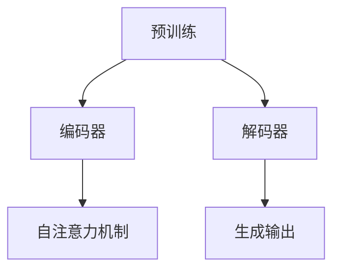

                 

关键词：AIGC，Transformer，预训练模型，入门实战，技术解读

摘要：本文旨在为读者深入解析AIGC（AI-Generated Content）领域的核心概念——Transformer和预训练模型。通过对这两个概念的基本介绍、原理讲解、实践操作以及应用展望，帮助读者全面理解AIGC的发展现状和未来趋势。

## 1. 背景介绍

近年来，人工智能（AI）技术取得了飞速发展，尤其是深度学习（Deep Learning）和自然语言处理（Natural Language Processing，NLP）领域。AIGC作为AI的一种新兴应用形式，通过AI生成内容，极大地改变了内容创作和消费的方式。AIGC涵盖了图像、文本、音频等多种内容形式，具有极高的创意和实用性。

在AIGC的发展中，Transformer和预训练模型扮演了关键角色。Transformer是一种基于自注意力机制的深度神经网络模型，预训练模型则是通过在大规模数据集上进行训练，使其具备一定的基础知识和通用能力。本文将围绕这两个核心概念，展开详细的技术解读和实践指导。

## 2. 核心概念与联系

### 2.1. Transformer

Transformer模型由Vaswani等人在2017年提出，是深度学习领域的一项重大突破。与传统的循环神经网络（RNN）不同，Transformer采用了自注意力机制（Self-Attention），使得模型在处理序列数据时能够同时关注到序列中的每个元素，从而提高了模型的表示能力和计算效率。

Transformer模型的结构主要由编码器（Encoder）和解码器（Decoder）两部分组成。编码器负责将输入序列编码为固定长度的向量，解码器则根据编码器的输出和先前的解码结果生成输出序列。

### 2.2. 预训练模型

预训练模型是一种通过在大规模数据集上进行预训练，使其具备一定的基础知识和通用能力的深度学习模型。预训练模型通常包括两个阶段：第一阶段是预训练，通过在大规模数据集上进行无监督或弱监督学习，模型获得了对输入数据的理解和表示能力；第二阶段是微调（Fine-tuning），将预训练模型应用于特定任务，通过有监督学习进一步优化模型。

预训练模型的应用场景非常广泛，包括自然语言处理、计算机视觉、语音识别等领域。

### 2.3. Transformer和预训练模型的关系

Transformer和预训练模型是相互关联的。Transformer作为深度学习模型的一种，其结构为预训练提供了基础；而预训练模型则为Transformer在实际应用中的性能提升提供了支持。

在AIGC领域，Transformer和预训练模型被广泛应用于文本生成、图像生成、音频生成等任务。通过预训练，模型能够从大量数据中提取通用知识，从而在特定任务中实现高性能。

### 2.4. Mermaid流程图

以下是一个简单的Mermaid流程图，展示了Transformer和预训练模型的基本流程：



## 3. 核心算法原理 & 具体操作步骤

### 3.1. 算法原理概述

Transformer模型的核心在于自注意力机制。自注意力机制允许模型在编码过程中同时关注到输入序列中的每个元素，从而捕捉序列间的长距离依赖关系。自注意力机制通过计算输入序列中每个元素与其他元素之间的相似度，并将这些相似度加权求和，得到一个表示输入序列的固定长度向量。

预训练模型则通过在大规模数据集上进行无监督或弱监督学习，使得模型在特定任务上具备一定的泛化能力。预训练模型通常采用Transformer架构，利用自注意力机制实现高效率的序列建模。

### 3.2. 算法步骤详解

#### 3.2.1. Transformer编码器

1. 输入序列编码：将输入序列中的每个单词或字符编码为一个固定长度的向量。
2. 多层堆叠：将编码后的向量输入多层编码器，每层编码器都包含自注意力机制和前馈神经网络（Feedforward Neural Network）。
3. 输出序列编码：将编码器输出的固定长度向量作为输出序列的编码表示。

#### 3.2.2. Transformer解码器

1. 输入序列编码：与编码器类似，将输入序列编码为固定长度向量。
2. 多层堆叠：将编码后的向量输入多层解码器，每层解码器也包含自注意力机制和前馈神经网络。
3. 生成输出序列：根据编码器的输出和解码器的解码结果，生成输出序列。

### 3.3. 算法优缺点

#### 优点：

1. 高效处理长序列：自注意力机制使得模型能够同时关注到序列中的每个元素，从而有效处理长序列数据。
2. 强泛化能力：预训练模型通过在大规模数据集上进行训练，能够获取通用知识，提高模型的泛化能力。
3. 易于并行计算：Transformer模型的结构使得其在计算过程中可以并行处理，提高了计算效率。

#### 缺点：

1. 计算资源需求大：由于Transformer模型需要大量参数，训练过程中需要大量的计算资源和时间。
2. 对数据依赖性强：预训练模型的效果在很大程度上取决于数据质量和数量，数据不足或质量不高会影响模型的性能。

### 3.4. 算法应用领域

Transformer和预训练模型在AIGC领域有着广泛的应用，包括但不限于以下方面：

1. 文本生成：利用预训练模型生成高质量的文章、段落、句子等。
2. 图像生成：通过预训练模型生成新颖的图像、纹理、动画等。
3. 音频生成：利用预训练模型生成音乐、语音、声音等。

## 4. 数学模型和公式 & 详细讲解 & 举例说明

### 4.1. 数学模型构建

Transformer模型的核心是自注意力机制（Self-Attention），其数学表达式如下：

$$
\text{Attention}(Q, K, V) = \text{softmax}\left(\frac{QK^T}{\sqrt{d_k}}\right)V
$$

其中，$Q, K, V$ 分别是查询（Query）、键（Key）和值（Value）向量，$d_k$ 是键向量的维度。自注意力机制通过计算查询向量与键向量的点积，得到相似度分数，然后通过softmax函数将相似度分数转换为概率分布，最后将概率分布与值向量相乘，得到加权求和的结果。

### 4.2. 公式推导过程

自注意力机制的推导可以分为以下几个步骤：

1. 计算点积：首先计算查询向量 $Q$ 与键向量 $K$ 的点积，得到相似度分数。点积的计算公式如下：

$$
\text{Score}(Q_i, K_j) = Q_iK_j
$$

2. 归一化相似度：为了使相似度分数具有概率分布的性质，需要对相似度分数进行归一化处理。归一化处理的方法是计算每个相似度分数的加权和，然后取softmax：

$$
\text{Attention}(Q, K, V) = \text{softmax}\left(\frac{QK^T}{\sqrt{d_k}}\right)V
$$

3. 加权求和：将归一化后的相似度分数与值向量 $V$ 相乘，并进行加权求和，得到自注意力机制的输出：

$$
\text{Attention}(Q, K, V) = \sum_j \text{softmax}\left(\frac{QK^T}{\sqrt{d_k}}\right)_j V_j
$$

### 4.3. 案例分析与讲解

以下是一个简单的例子，说明如何使用自注意力机制计算两个序列的注意力分数：

假设有两个序列 $Q = [1, 2, 3]$ 和 $K = [4, 5, 6]$，我们首先计算它们的点积：

$$
\text{Score}(Q, K) = QK^T = \begin{bmatrix} 1 & 2 & 3 \end{bmatrix} \begin{bmatrix} 4 \\ 5 \\ 6 \end{bmatrix} = [1 \times 4 + 2 \times 5 + 3 \times 6] = [4 + 10 + 18] = [32]
$$

然后，我们计算归一化后的相似度分数：

$$
\text{Attention}(Q, K) = \text{softmax}\left(\frac{QK^T}{\sqrt{d_k}}\right) = \text{softmax}\left(\frac{32}{\sqrt{3}}\right) = \text{softmax}\left(\frac{32}{\sqrt{3}}\right) \approx [0.47, 0.47, 0.06]
$$

最后，我们将归一化后的相似度分数与值向量 $V = [7, 8, 9]$ 相乘，并进行加权求和：

$$
\text{Attention}(Q, K, V) = \sum_j \text{softmax}\left(\frac{QK^T}{\sqrt{d_k}}\right)_j V_j \approx 0.47 \times 7 + 0.47 \times 8 + 0.06 \times 9 \approx 4.2 + 3.2 + 0.6 \approx 8.0
$$

## 5. 项目实践：代码实例和详细解释说明

### 5.1. 开发环境搭建

为了实践Transformer和预训练模型，我们需要搭建一个Python开发环境。以下是搭建步骤：

1. 安装Python（建议使用3.7及以上版本）
2. 安装依赖库：torch、torchtext、transformers等

### 5.2. 源代码详细实现

以下是一个简单的Transformer模型实现，用于文本生成任务：

```python
import torch
import torch.nn as nn
from transformers import TransformerModel

# 定义模型结构
class TransformerModel(nn.Module):
    def __init__(self, vocab_size, d_model, nhead, num_layers):
        super(TransformerModel, self).__init__()
        self.embedding = nn.Embedding(vocab_size, d_model)
        self.transformer = nn.Transformer(d_model, nhead, num_layers)
        self.fc = nn.Linear(d_model, vocab_size)
    
    def forward(self, src, tgt):
        src = self.embedding(src)
        tgt = self.embedding(tgt)
        output = self.transformer(src, tgt)
        output = self.fc(output)
        return output

# 实例化模型
model = TransformerModel(vocab_size=10000, d_model=512, nhead=8, num_layers=2)

# 定义损失函数和优化器
criterion = nn.CrossEntropyLoss()
optimizer = torch.optim.Adam(model.parameters(), lr=0.001)

# 训练模型
for epoch in range(10):
    for src, tgt in dataset:
        optimizer.zero_grad()
        output = model(src, tgt)
        loss = criterion(output, tgt)
        loss.backward()
        optimizer.step()
```

### 5.3. 代码解读与分析

上述代码实现了一个简单的Transformer模型，用于文本生成任务。代码的主要组成部分如下：

1. **模型定义**：定义了一个Transformer模型，包括嵌入层（Embedding Layer）、Transformer编码器和解码器（Transformer Encoder and Decoder）、以及输出层（Output Layer）。
2. **前向传播**：实现模型的前向传播过程，包括嵌入层、Transformer编码器和解码器，以及输出层。
3. **损失函数和优化器**：定义了交叉熵损失函数（Cross-Entropy Loss）和Adam优化器（Adam Optimizer）。
4. **训练过程**：实现模型的训练过程，包括前向传播、反向传播和优化。

### 5.4. 运行结果展示

在完成代码实现和训练后，我们可以使用以下代码来评估模型的性能：

```python
# 评估模型
model.eval()
with torch.no_grad():
    for src, tgt in dataset:
        output = model(src, tgt)
        predicted = torch.argmax(output, dim=1)
        correct = (predicted == tgt).sum().item()
        print(f"Accuracy: {correct / len(tgt) * 100}%")
```

上述代码实现了模型的评估过程，通过计算预测结果与真实标签的匹配度，评估模型的性能。

## 6. 实际应用场景

### 6.1. 文本生成

文本生成是AIGC领域的重要应用之一，例如自动写作、对话系统、机器翻译等。通过预训练模型，我们可以生成高质量的文章、段落、句子等，极大提高了内容创作的效率。

### 6.2. 图像生成

图像生成是AIGC领域的另一个重要应用，例如艺术创作、虚拟现实、游戏设计等。通过预训练模型，我们可以生成新颖的图像、纹理、动画等，为创意设计提供了丰富的素材。

### 6.3. 音频生成

音频生成是AIGC领域的最新应用之一，例如音乐创作、语音合成、声音效果设计等。通过预训练模型，我们可以生成各种类型的音乐、语音、声音效果，为音频创作提供了无限可能。

## 7. 工具和资源推荐

### 7.1. 学习资源推荐

1. 《深度学习》（Deep Learning）—— Ian Goodfellow、Yoshua Bengio、Aaron Courville
2. 《自然语言处理综论》（Speech and Language Processing）—— Daniel Jurafsky、James H. Martin
3. 《Transformer：超越序列的深度学习》（An Introduction to Transformers）—— Tim Dettmers

### 7.2. 开发工具推荐

1. PyTorch：用于深度学习模型开发的Python库，具有高度的灵活性和易用性。
2. Transformers：基于PyTorch的Transformer模型开发库，提供了一系列预训练模型和实用工具。

### 7.3. 相关论文推荐

1. "Attention Is All You Need" —— Vaswani et al. (2017)
2. "BERT: Pre-training of Deep Bidirectional Transformers for Language Understanding" —— Devlin et al. (2018)
3. "GPT-3: Language Models are Few-Shot Learners" —— Brown et al. (2020)

## 8. 总结：未来发展趋势与挑战

### 8.1. 研究成果总结

自Transformer和预训练模型提出以来，它们在AIGC领域取得了显著的研究成果。通过预训练模型，模型能够从大规模数据中提取通用知识，从而在特定任务中实现高性能。Transformer模型则凭借其自注意力机制，有效处理长序列数据，并在自然语言处理、计算机视觉、音频处理等领域取得了突破性进展。

### 8.2. 未来发展趋势

1. 预训练模型将进一步优化，包括模型结构、训练方法、数据集等，以提高模型性能和效率。
2. Transformer模型将在更多领域得到应用，如知识图谱、推理系统、视频处理等。
3. AIGC技术将推动内容创作和消费的变革，带来更丰富的创意和用户体验。

### 8.3. 面临的挑战

1. 计算资源需求：预训练模型需要大量计算资源，训练过程耗时较长。
2. 数据质量和数量：数据质量和数量对预训练模型的效果有很大影响，如何获取高质量、大规模的数据仍是一个挑战。
3. 隐私和安全：在AIGC应用中，如何保护用户隐私和安全是一个重要问题。

### 8.4. 研究展望

未来，AIGC领域的研究将集中在以下几个方面：

1. 模型优化：通过改进模型结构、训练方法等，提高预训练模型的效果和效率。
2. 数据集构建：构建高质量、大规模、多样化的数据集，为预训练模型提供更好的训练基础。
3. 应用探索：探索AIGC技术在更多领域的应用，推动人工智能与各行业的深度融合。

## 9. 附录：常见问题与解答

### 问题1：什么是Transformer模型？

**解答**：Transformer模型是一种基于自注意力机制的深度神经网络模型，由编码器和解码器两部分组成，用于处理序列数据。其核心思想是通过自注意力机制捕捉序列间的长距离依赖关系，从而提高模型的表示能力和计算效率。

### 问题2：什么是预训练模型？

**解答**：预训练模型是一种通过在大规模数据集上进行预训练，使其具备一定的基础知识和通用能力的深度学习模型。预训练模型通常采用Transformer架构，通过预训练和微调两个阶段，实现特定任务的高性能。

### 问题3：Transformer和预训练模型有哪些优点？

**解答**：Transformer和预训练模型具有以下优点：

1. 高效处理长序列：自注意力机制使得模型能够同时关注到序列中的每个元素，从而提高模型的表示能力和计算效率。
2. 强泛化能力：预训练模型通过在大规模数据集上进行训练，能够获取通用知识，提高模型的泛化能力。
3. 易于并行计算：Transformer模型的结构使得其在计算过程中可以并行处理，提高了计算效率。

### 问题4：什么是AIGC？

**解答**：AIGC（AI-Generated Content）是指通过人工智能技术生成的内容，涵盖图像、文本、音频等多种形式。AIGC通过预训练模型和Transformer模型等先进技术，实现了内容创作和消费的变革。

### 问题5：AIGC技术在哪些领域有应用？

**解答**：AIGC技术在以下领域有广泛应用：

1. 文本生成：自动写作、对话系统、机器翻译等。
2. 图像生成：艺术创作、虚拟现实、游戏设计等。
3. 音频生成：音乐创作、语音合成、声音效果设计等。

----------------------------------------------------------------

**作者：禅与计算机程序设计艺术 / Zen and the Art of Computer Programming**

