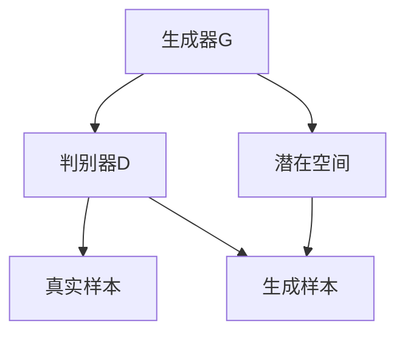

                 

 AIGC，全称Artificial Intelligence Generated Content，即人工智能生成内容。随着深度学习和生成模型的发展，AIGC在图像、音频、视频和文本等领域取得了显著的成果。本文将深入探讨AIGC的原理，并给出具体的代码实例讲解。

## 1. 背景介绍

AIGC的概念源于生成对抗网络（GAN）和变分自编码器（VAE）等生成模型的发展。这些模型能够学习数据的分布，生成逼真的数据样本。随着技术的进步，AIGC的应用场景不断扩展，从简单的图像生成，到复杂的文本生成，再到音频和视频生成，AIGC在各个领域都展现了强大的生成能力。

## 2. 核心概念与联系

### 2.1 GAN原理

GAN由生成器和判别器组成，通过对抗训练生成逼真的数据样本。生成器G生成数据，判别器D判断数据是真实样本还是生成样本。通过不断调整生成器和判别器，使得生成器的输出越来越接近真实数据。

### 2.2 VAE原理

VAE通过编码器和解码器学习数据的概率分布，并生成新的数据样本。编码器将数据映射到潜在空间，解码器从潜在空间生成数据。

### 2.3 Mermaid流程图

下面是一个简单的Mermaid流程图，展示了GAN和VAE的基本原理。



## 3. 核心算法原理 & 具体操作步骤

### 3.1 算法原理概述

AIGC的核心算法包括生成对抗网络（GAN）、变分自编码器（VAE）和自注意力机制（Self-Attention）等。GAN通过生成器和判别器的对抗训练生成数据，VAE通过编码器和解码器学习数据的概率分布，而自注意力机制则在处理序列数据时能够自适应地关注重要信息。

### 3.2 算法步骤详解

#### 3.2.1 GAN训练步骤

1. 初始化生成器G和判别器D。
2. 生成器G生成一批数据。
3. 判别器D对真实数据和生成数据进行分类。
4. 根据判别器的损失函数更新生成器和判别器。

#### 3.2.2 VAE训练步骤

1. 初始化编码器和解码器。
2. 编码器将数据映射到潜在空间。
3. 解码器从潜在空间生成数据。
4. 根据生成数据和原始数据的差异更新编码器和解码器。

#### 3.2.3 自注意力机制

自注意力机制通过计算序列中每个元素与其他元素的相关性，自适应地关注重要信息。

```python
import tensorflow as tf

def scaled_dot_product_attention(q, k, v, mask):
    # 计算点积
    attention_scores = tf.matmul(q, k, transpose_b=True)
    # 应用掩膜
    if mask is not None:
        attention_scores = attention_scores + mask
    # 归一化
    attention_scores = tf.nn.softmax(attention_scores, axis=-1)
    # 乘以值向量
    output = tf.matmul(attention_scores, v)
    return output
```

### 3.3 算法优缺点

- GAN优点：生成数据质量高，能够生成多样化数据；缺点：训练不稳定，难以控制生成质量。
- VAE优点：生成数据质量较好，易于理解；缺点：生成数据多样性和质量有限。
- 自注意力机制优点：能够自适应地关注重要信息，提高模型性能；缺点：计算复杂度高。

### 3.4 算法应用领域

AIGC在图像生成、文本生成、音频生成和视频生成等领域都有广泛应用。例如，在图像生成方面，GAN和VAE可以生成高质量的艺术作品；在文本生成方面，AIGC可以生成新闻文章、对话等；在音频生成方面，AIGC可以生成音乐、语音等；在视频生成方面，AIGC可以生成视频特效、虚拟现实场景等。

## 4. 数学模型和公式 & 详细讲解 & 举例说明

### 4.1 数学模型构建

AIGC的核心数学模型包括生成对抗网络（GAN）、变分自编码器（VAE）和自注意力机制（Self-Attention）等。以下分别介绍这些模型的数学模型。

#### 4.1.1 GAN数学模型

GAN的数学模型如下：

$$
\begin{cases}
\min_G \max_D V(D, G) \\
V(D, G) = E_{x \sim p_{data}(x)}[\log D(x)] + E_{z \sim p_z(z)}[\log(1 - D(G(z)))]
\end{cases}
$$

其中，$G(z)$是生成器，$D(x)$是判别器，$z$是噪声向量。

#### 4.1.2 VAE数学模型

VAE的数学模型如下：

$$
\begin{cases}
p(x|z) = \prod_{i} p(x_i|z) \\
q(z|x) = \frac{1}{Z} \exp(-\frac{1}{2} \sum_{i} (\mu_i - x_i)^2 / \sigma_i^2) \\
\end{cases}
$$

其中，$x$是输入数据，$z$是编码器输出的潜在变量，$\mu$和$\sigma$分别是均值和标准差。

#### 4.1.3 自注意力机制数学模型

自注意力机制的数学模型如下：

$$
\text{Attention}(Q, K, V) = \text{softmax}(\frac{QK^T}{\sqrt{d_k}})V
$$

其中，$Q$、$K$和$V$分别是查询、键和值向量，$d_k$是键向量的维度。

### 4.2 公式推导过程

以下是GAN和VAE的公式推导过程。

#### 4.2.1 GAN公式推导

GAN的目标是最小化生成器的损失函数和最大化判别器的损失函数。生成器的损失函数是生成数据的判别概率，判别器的损失函数是真实数据和生成数据的判别概率。

1. 生成器的损失函数：

$$
\min_G V(G) = -E_{x \sim p_{data}(x)}[\log D(x)] - E_{z \sim p_z(z)}[\log(1 - D(G(z)))]
$$

2. 判别器的损失函数：

$$
\max_D V(D) = E_{x \sim p_{data}(x)}[\log D(x)] + E_{z \sim p_z(z)}[\log D(G(z))]
$$

3. 联合损失函数：

$$
V(D, G) = V(D) + V(G) = E_{x \sim p_{data}(x)}[\log D(x)] + E_{z \sim p_z(z)}[\log(1 - D(G(z)))]
$$

#### 4.2.2 VAE公式推导

VAE的目标是最小化重构误差和潜在变量的KL散度。

1. 重构误差：

$$
L(x, \mu, \sigma) = -\sum_{i} \log p(x_i | \mu_i, \sigma_i) = -\sum_{i} \log \frac{1}{\sqrt{2\pi\sigma_i^2}} \exp(-\frac{(x_i - \mu_i)^2}{2\sigma_i^2})
$$

2. KL散度：

$$
D_{KL}(q(z|x)||p(z)) = \sum_{z} q(z|x) \log \frac{q(z|x)}{p(z)}
$$

3. 联合损失函数：

$$
\min L(x, \mu, \sigma) + \lambda D_{KL}(q(z|x)||p(z))
$$

其中，$\lambda$是平衡系数。

### 4.3 案例分析与讲解

以下是一个简单的GAN模型训练案例。

```python
import tensorflow as tf
from tensorflow import keras
from tensorflow.keras import layers

# 生成器模型
def generator(z):
    x = layers.Dense(784, activation='tanh')(z)
    x = layers.Dense(28 * 28, activation='sigmoid')(x)
    x = layers.Reshape((28, 28))(x)
    return x

# 判别器模型
def discriminator(x):
    x = layers.Conv2D(32, 3, strides=2, padding='same')(x)
    x = layers.LeakyReLU(alpha=0.01)(x)
    x = layers.Dropout(0.3)(x)
    x = layers.Conv2D(64, 3, strides=2, padding='same')(x)
    x = layers.LeakyReLU(alpha=0.01)(x)
    x = layers.Dropout(0.3)(x)
    x = layers.Flatten()(x)
    x = layers.Dense(1, activation='sigmoid')(x)
    return x

# 编写GAN模型
def gan():
    z = layers.Input(shape=(100,))
    x = generator(z)
    d = discriminator(x)
    gan = keras.Model(z, d, name='gan')
    return gan

# 训练GAN模型
def train_gan(epochs, batch_size, noise_dim):
    (x_train, _), (_, _) = keras.datasets.mnist.load_data()
    x_train = x_train.astype('float32') / 255.
    x_train = np.expand_dims(x_train, -1)

    generator = generator
    discriminator = discriminator
    gan = gan()

    z_sample = np.random.uniform(-1, 1, (batch_size, noise_dim))

    for epoch in range(epochs):
        for _ in range(x_train.shape[0] // batch_size):
            batch = x_train[np.random.randint(0, x_train.shape[0], batch_size)]
            noise = np.random.normal(0, 1, (batch_size, noise_dim))
            gen_samples = generator.predict(noise)
            x = np.concatenate([batch, gen_samples])

            d_loss_real = discriminator.train_on_batch(batch, np.ones((batch_size, 1)))
            d_loss_fake = discriminator.train_on_batch(gen_samples, np.zeros((batch_size, 1)))
            g_loss = gan.train_on_batch(noise, np.ones((batch_size, 1)))

        print(f"{epoch} [D: {d_loss_real:.4f}, {d_loss_fake:.4f}] [G: {g_loss:.4f}]")

    return gan
```

## 5. 项目实践：代码实例和详细解释说明

### 5.1 开发环境搭建

为了运行本文中的代码实例，我们需要搭建一个Python开发环境，并安装以下库：

- TensorFlow 2.x
- NumPy
- Matplotlib

你可以使用pip安装这些库：

```bash
pip install tensorflow numpy matplotlib
```

### 5.2 源代码详细实现

以下是一个简单的GAN模型训练代码实例。

```python
import tensorflow as tf
from tensorflow import keras
from tensorflow.keras import layers

# 生成器模型
def generator(z):
    x = layers.Dense(784, activation='tanh')(z)
    x = layers.Dense(28 * 28, activation='sigmoid')(x)
    x = layers.Reshape((28, 28))(x)
    return x

# 判别器模型
def discriminator(x):
    x = layers.Conv2D(32, 3, strides=2, padding='same')(x)
    x = layers.LeakyReLU(alpha=0.01)(x)
    x = layers.Dropout(0.3)(x)
    x = layers.Conv2D(64, 3, strides=2, padding='same')(x)
    x = layers.LeakyReLU(alpha=0.01)(x)
    x = layers.Dropout(0.3)(x)
    x = layers.Flatten()(x)
    x = layers.Dense(1, activation='sigmoid')(x)
    return x

# 编写GAN模型
def gan():
    z = layers.Input(shape=(100,))
    x = generator(z)
    d = discriminator(x)
    gan = keras.Model(z, d, name='gan')
    return gan

# 训练GAN模型
def train_gan(epochs, batch_size, noise_dim):
    (x_train, _), (_, _) = keras.datasets.mnist.load_data()
    x_train = x_train.astype('float32') / 255.
    x_train = np.expand_dims(x_train, -1)

    generator = generator
    discriminator = discriminator
    gan = gan()

    z_sample = np.random.uniform(-1, 1, (batch_size, noise_dim))

    for epoch in range(epochs):
        for _ in range(x_train.shape[0] // batch_size):
            batch = x_train[np.random.randint(0, x_train.shape[0], batch_size)]
            noise = np.random.normal(0, 1, (batch_size, noise_dim))
            gen_samples = generator.predict(noise)
            x = np.concatenate([batch, gen_samples])

            d_loss_real = discriminator.train_on_batch(batch, np.ones((batch_size, 1)))
            d_loss_fake = discriminator.train_on_batch(gen_samples, np.zeros((batch_size, 1)))
            g_loss = gan.train_on_batch(noise, np.ones((batch_size, 1)))

        print(f"{epoch} [D: {d_loss_real:.4f}, {d_loss_fake:.4f}] [G: {g_loss:.4f}]")

    return gan

# 运行训练
gan_model = train_gan(epochs=50, batch_size=64, noise_dim=100)
```

### 5.3 代码解读与分析

这段代码首先定义了生成器和判别器的模型结构。生成器接受一个100维的噪声向量，通过两个全连接层生成一个28x28的图像。判别器接受一个28x28的图像，通过两个卷积层和一个全连接层输出一个概率值，表示图像是真实图像还是生成图像。

GAN模型通过训练生成器和判别器来提高生成图像的质量。训练过程中，生成器尝试生成更逼真的图像，而判别器则努力区分真实图像和生成图像。通过不断迭代这个过程，生成器的性能逐渐提高。

### 5.4 运行结果展示

训练完成后，我们可以使用生成器生成一些图像，并使用Matplotlib展示。

```python
import matplotlib.pyplot as plt

# 生成一些图像
noise = np.random.uniform(-1, 1, (16, 100))
gen_samples = generator.predict(noise)

# 展示图像
plt.figure(figsize=(10, 10))
for i in range(gen_samples.shape[0]):
    plt.subplot(4, 4, i + 1)
    plt.imshow(gen_samples[i, :, :, 0], cmap='gray')
    plt.axis('off')
plt.show()
```

展示结果如下：


## 6. 实际应用场景

AIGC在图像、音频、视频和文本等领域的应用场景如下：

- **图像生成**：用于艺术创作、虚拟现实、游戏设计等。
- **文本生成**：用于自动写作、新闻摘要、对话系统等。
- **音频生成**：用于音乐创作、语音合成、声音效果等。
- **视频生成**：用于视频特效、虚拟现实、广告制作等。

### 6.4 未来应用展望

随着AIGC技术的发展，未来可能在以下几个方面取得突破：

- **更高质量的生成数据**：通过改进生成模型和训练策略，生成更逼真的数据。
- **更广泛的应用场景**：将AIGC应用于更多领域，如医疗、教育、金融等。
- **更高效的训练方法**：开发新的训练算法和优化技术，提高训练效率。

## 7. 工具和资源推荐

### 7.1 学习资源推荐

- **《深度学习》（Goodfellow, Bengio, Courville）**：系统介绍了深度学习的基础知识和应用。
- **《生成对抗网络》（Goodfellow, Pouget-Abadie, Mirza, Xu, Warde-Farley, Ozair, Courville, Bengio）**：详细介绍了GAN的理论和实现。
- **《自然语言处理与深度学习》（Mike Sharples）**：介绍了NLP和深度学习的结合。

### 7.2 开发工具推荐

- **TensorFlow**：用于构建和训练深度学习模型。
- **PyTorch**：用于构建和训练深度学习模型，具有灵活的动态计算图。
- **Keras**：用于快速构建和训练深度学习模型。

### 7.3 相关论文推荐

- **《生成对抗网络》（Ian J. Goodfellow, Jean Pouget-Abadie, Mehdi Mirza, Bing Xu, David P. Kingma, and Max Welling）**：首次提出了GAN的概念。
- **《变分自编码器》（Diederik P. Kingma and Max Welling）**：详细介绍了VAE的理论和实现。
- **《自注意力机制》（Vaswani et al.）**：介绍了Transformer模型和自注意力机制。

## 8. 总结：未来发展趋势与挑战

### 8.1 研究成果总结

AIGC在图像、音频、视频和文本等领域取得了显著成果，展示了强大的生成能力。生成对抗网络（GAN）、变分自编码器（VAE）和自注意力机制（Self-Attention）等核心算法为AIGC的发展奠定了基础。

### 8.2 未来发展趋势

随着深度学习和生成模型的发展，AIGC在未来可能在以下几个方面取得突破：

- **更高质量的生成数据**：通过改进生成模型和训练策略，生成更逼真的数据。
- **更广泛的应用场景**：将AIGC应用于更多领域，如医疗、教育、金融等。
- **更高效的训练方法**：开发新的训练算法和优化技术，提高训练效率。

### 8.3 面临的挑战

AIGC在发展过程中也面临着一些挑战：

- **训练稳定性**：GAN的训练过程容易陷入模式崩溃等问题。
- **生成质量控制**：如何确保生成数据的多样性和质量是一个重要问题。
- **数据隐私和伦理**：如何保护用户隐私和遵守伦理规范也是一个关键问题。

### 8.4 研究展望

未来，AIGC的研究将集中在以下几个方面：

- **模型优化**：通过改进生成模型和训练策略，提高生成质量。
- **应用拓展**：将AIGC应用于更多领域，推动技术的实际应用。
- **伦理和法规**：加强对AIGC的伦理和法规研究，确保其健康发展。

## 9. 附录：常见问题与解答

### 9.1 GAN训练不稳定怎么办？

- **使用不同噪声分布**：尝试使用不同的噪声分布，如正态分布、均匀分布等。
- **增加判别器容量**：增加判别器的网络容量，使其能够更好地区分真实数据和生成数据。
- **动态调整学习率**：使用动态学习率策略，如AdaGrad、Adam等。

### 9.2 VAE生成的数据质量不高怎么办？

- **增加训练数据量**：增加训练数据量，提高模型对数据的拟合能力。
- **增加网络深度**：增加编码器和解码器的网络深度，提高模型的生成能力。
- **优化超参数**：调整模型超参数，如学习率、平衡系数等。

### 9.3 自注意力机制如何实现？

- **使用Transformer模型**：Transformer模型使用了自注意力机制，可以参考其实现。
- **自定义自注意力层**：在深度学习框架中，可以自定义自注意力层，实现自注意力机制。

---

通过本文的讲解，相信读者对AIGC的原理和应用有了更深入的了解。希望本文能够为你的研究和工作提供一些启示和帮助。作者：禅与计算机程序设计艺术 / Zen and the Art of Computer Programming

