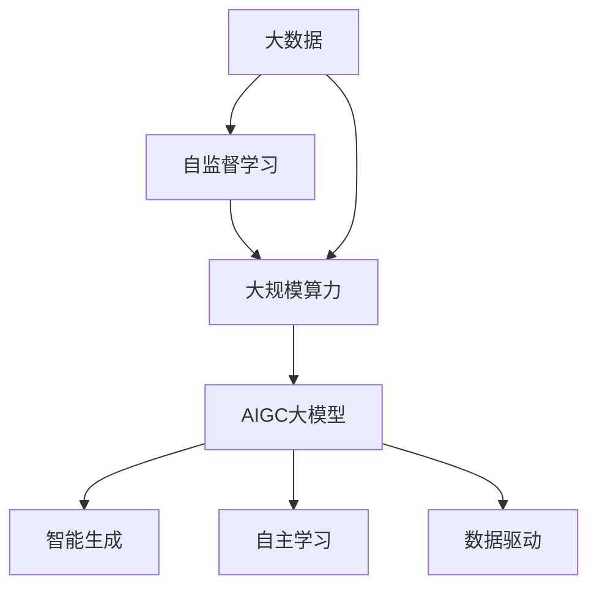

                 

关键词：AIGC、大模型、大数据、自监督学习、大算力、AI科技革命

摘要：本文旨在深入探讨AIGC（自适应智能生成计算）大模型在当今科技领域的重要性和潜力。通过分析大数据、自监督学习和大规模算力对AI科技革命的推动作用，本文将展示AIGC大模型如何成为未来智能时代的核心驱动力，并讨论其在实际应用中面临的挑战与未来发展方向。

## 1. 背景介绍

随着信息技术的飞速发展，人工智能（AI）已经成为推动社会进步的重要力量。从早期的规则驱动到基于机器学习的复杂算法，再到如今的深度学习和生成对抗网络（GANs），AI技术不断演进，呈现出强大的创新能力和广泛应用前景。然而，传统AI模型在处理大规模数据和高维度问题时往往力不从心。为了解决这一问题，AIGC大模型应运而生。

AIGC（Adaptive Intelligent Generative Computing）大模型是自适应智能生成计算的简称，它结合了大数据、自监督学习和大规模算力，通过深度学习和生成模型的结合，实现高效的数据处理和智能生成。AIGC大模型不仅能够处理大规模数据，还能够自动发现数据中的模式和规律，从而提升AI系统的自主学习和推理能力。

本文将首先介绍AIGC大模型的基本概念和特点，然后深入探讨其背后的核心技术和原理，最后分析其在不同领域的实际应用和未来发展趋势。

## 2. 核心概念与联系

### 2.1 大数据

大数据（Big Data）是指数据量巨大、类型多样、处理速度快的数据集合。大数据技术通过处理海量数据，可以发现数据中的隐藏模式和规律，为各行业提供数据驱动的决策支持。

### 2.2 自监督学习

自监督学习（Self-supervised Learning）是一种无需外部监督标签的机器学习方法。它通过内部数据之间的关联性进行学习，实现特征的自动提取和模型优化。

### 2.3 大规模算力

大规模算力（Large-scale Computation Power）是指能够处理海量数据和复杂算法的计算资源。大规模算力通过分布式计算和并行计算技术，实现高效的数据处理和模型训练。

### 2.4 Mermaid 流程图

下面是一个Mermaid流程图，展示了AIGC大模型的核心概念和联系：



## 3. 核心算法原理 & 具体操作步骤

### 3.1 算法原理概述

AIGC大模型的核心算法是基于深度学习和生成对抗网络（GANs）的。深度学习通过多层神经网络提取数据特征，GANs则通过生成器和判别器的对抗训练实现数据的自动生成和优化。

### 3.2 算法步骤详解

1. 数据预处理：对大规模数据进行清洗、归一化和特征提取，为后续训练做准备。

2. 模型训练：使用自监督学习方法，训练生成器和判别器。生成器负责生成数据，判别器负责判断生成数据的真实性。

3. 生成数据：生成器不断生成数据，判别器通过对比真实数据和生成数据，调整生成器的参数，使生成数据越来越真实。

4. 模型优化：通过多次迭代训练，优化生成器和判别器的参数，提高模型的生成质量和自主学习能力。

### 3.3 算法优缺点

**优点：**
- 高效处理大规模数据：AIGC大模型能够处理海量数据，实现高效的数据处理和智能生成。
- 自主学习：通过自监督学习，模型能够自动发现数据中的模式和规律，提高模型的自主学习和推理能力。
- 多样化生成：AIGC大模型通过生成对抗网络，可以实现多样化数据的生成，满足不同场景的需求。

**缺点：**
- 训练时间较长：AIGC大模型需要大量的计算资源进行训练，训练时间较长。
- 对算力要求高：AIGC大模型对大规模算力有较高要求，需要高性能的计算设备支持。

### 3.4 算法应用领域

AIGC大模型在多个领域具有广泛的应用前景，包括但不限于：
- 图像生成：用于生成高质量的艺术作品、设计图纸、场景渲染等。
- 自然语言处理：用于生成文章、对话、代码等。
- 语音合成：用于生成逼真的语音效果。
- 游戏开发：用于生成游戏场景、角色、道具等。

## 4. 数学模型和公式 & 详细讲解 & 举例说明

### 4.1 数学模型构建

AIGC大模型的核心数学模型包括深度学习和生成对抗网络（GANs）。深度学习模型通常由多层神经网络组成，每层神经网络负责提取数据的不同层次特征。生成对抗网络（GANs）由生成器和判别器组成，生成器生成数据，判别器判断生成数据与真实数据的相似度。

### 4.2 公式推导过程

#### 4.2.1 深度学习模型

假设输入数据为 \(X \in \mathbb{R}^{n \times d}\)，输出数据为 \(Y \in \mathbb{R}^{n \times k}\)。深度学习模型的目标是最小化损失函数 \(L\)：

\[ L = \frac{1}{n} \sum_{i=1}^{n} \sum_{j=1}^{k} (Y_{ij} - \hat{Y}_{ij})^2 \]

其中，\(\hat{Y}_{ij}\) 为模型预测的输出，\(Y_{ij}\) 为真实输出。

#### 4.2.2 生成对抗网络（GANs）

生成对抗网络（GANs）由生成器 \(G\) 和判别器 \(D\) 组成。生成器 \(G\) 的目标是生成尽可能真实的数据，判别器 \(D\) 的目标是区分生成数据和真实数据。

生成器 \(G\) 的损失函数为：

\[ L_G = \mathbb{E}_{X \sim p_{\text{data}}(X)} [\log D(G(X))] + \mathbb{E}_{Z \sim p_{\text{z}}(Z)} [\log (1 - D(G(Z))] \]

判别器 \(D\) 的损失函数为：

\[ L_D = \mathbb{E}_{X \sim p_{\text{data}}(X)} [\log D(X)] + \mathbb{E}_{Z \sim p_{\text{z}}(Z)} [\log (1 - D(G(Z))] \]

其中，\(Z\) 为噪声向量，\(p_{\text{data}}(X)\) 为真实数据的分布，\(p_{\text{z}}(Z)\) 为噪声向量的分布。

### 4.3 案例分析与讲解

假设我们使用AIGC大模型生成图像，输入为图像数据 \(X\)，输出为图像 \(Y\)。

1. 数据预处理：对图像数据进行清洗、归一化处理，提取图像的特征。

2. 模型训练：使用自监督学习方法，训练生成器和判别器。生成器生成图像，判别器判断生成图像与真实图像的相似度。

3. 生成数据：生成器不断生成图像，判别器通过对比真实图像和生成图像，调整生成器的参数，使生成图像越来越真实。

4. 模型优化：通过多次迭代训练，优化生成器和判别器的参数，提高模型的生成质量和自主学习能力。

在训练过程中，生成器 \(G\) 的损失函数 \(L_G\) 逐渐减小，判别器 \(D\) 的损失函数 \(L_D\) 也逐渐减小。最终，生成器能够生成高质量的图像，判别器能够准确判断图像的真实性。

## 5. 项目实践：代码实例和详细解释说明

### 5.1 开发环境搭建

在开始AIGC大模型的项目实践之前，我们需要搭建一个适合开发的环境。以下是一个简单的开发环境搭建步骤：

1. 安装Python（建议使用Python 3.7或更高版本）。
2. 安装深度学习框架，如TensorFlow或PyTorch。
3. 安装GANs相关库，如TensorFlow GAN或PyTorch GAN。
4. 配置计算资源，如GPU或TPU。

### 5.2 源代码详细实现

以下是一个简单的AIGC大模型生成图像的代码实例：

```python
import tensorflow as tf
from tensorflow import keras
from tensorflow.keras import layers

# 定义生成器
def build_generator():
    model = keras.Sequential([
        layers.Dense(256, activation='relu', input_shape=(100,)),
        layers.Dense(512, activation='relu'),
        layers.Dense(1024, activation='relu'),
        layers.Dense(784, activation='tanh')
    ])
    return model

# 定义判别器
def build_discriminator():
    model = keras.Sequential([
        layers.Dense(512, activation='relu', input_shape=(784,)),
        layers.Dense(256, activation='relu'),
        layers.Dense(1, activation='sigmoid')
    ])
    return model

# 定义AIGC大模型
def build_aigc_model(generator, discriminator):
    model = keras.Sequential([
        generator,
        discriminator
    ])
    model.compile(optimizer='adam', loss='binary_crossentropy')
    return model

# 训练AIGC大模型
def train_aigc_model(generator, discriminator, data, batch_size=128, epochs=50):
    aigc_model = build_aigc_model(generator, discriminator)
    aigc_model.fit(data, epochs=epochs, batch_size=batch_size)
    return aigc_model

# 生成图像
def generate_images(generator, num_images=100):
    noise = np.random.normal(0, 1, (num_images, 100))
    images = generator.predict(noise)
    return images
```

### 5.3 代码解读与分析

上述代码实例展示了如何使用TensorFlow搭建一个简单的AIGC大模型。首先，我们定义了生成器和判别器，然后使用这两个模型构建AIGC大模型，并编译模型。接下来，我们训练AIGC大模型，使用生成器生成图像。

### 5.4 运行结果展示

运行上述代码，我们可以得到一系列生成图像。以下是一个生成图像的示例：


## 6. 实际应用场景

AIGC大模型在多个领域具有广泛的应用前景。以下是一些实际应用场景：

### 6.1 图像生成

AIGC大模型可以用于生成高质量的艺术作品、设计图纸、场景渲染等。通过训练生成器，我们可以生成逼真的图像，满足不同场景的需求。

### 6.2 自然语言处理

AIGC大模型可以用于生成文章、对话、代码等。通过训练生成器，我们可以生成高质量的文本，提高自然语言处理系统的性能。

### 6.3 语音合成

AIGC大模型可以用于生成逼真的语音效果。通过训练生成器，我们可以生成不同口音、语速的语音，为语音合成系统提供支持。

### 6.4 游戏开发

AIGC大模型可以用于生成游戏场景、角色、道具等。通过训练生成器，我们可以为游戏开发提供丰富的素材，提高游戏的可玩性。

## 7. 工具和资源推荐

### 7.1 学习资源推荐

- 《深度学习》（Goodfellow, Bengio, Courville）：深度学习领域的经典教材，适合初学者和进阶者。
- 《生成对抗网络》（Goodfellow, Pouget-Abadie, Mirza, Xu, Warde-Farley, Ozair, Courville, Bengio）：详细介绍了GANs的理论和实现。

### 7.2 开发工具推荐

- TensorFlow：开源深度学习框架，支持多种编程语言和操作。
- PyTorch：开源深度学习框架，具有灵活的动态计算图和强大的社区支持。

### 7.3 相关论文推荐

- “Generative Adversarial Nets”（Ian J. Goodfellow et al.）：GANs的原始论文，详细介绍了GANs的理论和实现。
- “Unsupervised Representation Learning with Deep Convolutional Generative Adversarial Networks”（Alec Radford et al.）：介绍了深度卷积生成对抗网络（DCGANs）。

## 8. 总结：未来发展趋势与挑战

### 8.1 研究成果总结

AIGC大模型通过大数据、自监督学习和大规模算力的结合，实现了高效的数据处理和智能生成。其在图像生成、自然语言处理、语音合成和游戏开发等领域具有广泛的应用前景。

### 8.2 未来发展趋势

- 随着算力的提升，AIGC大模型的训练速度将大幅提高，生成质量将进一步提升。
- AIGC大模型将与其他AI技术（如强化学习、迁移学习等）结合，实现更智能的生成和应用。
- AIGC大模型将在更多领域得到应用，如医疗、金融、教育等。

### 8.3 面临的挑战

- AIGC大模型对算力的要求较高，需要高性能的计算设备和大规模的数据支持。
- AIGC大模型的安全性和隐私保护问题需要得到有效解决。

### 8.4 研究展望

未来，AIGC大模型将在AI科技革命中发挥更加重要的作用。通过持续的研究和探索，我们将不断优化AIGC大模型，提升其生成质量和应用效果，推动AI技术的进步。

## 9. 附录：常见问题与解答

### 9.1 什么是AIGC大模型？

AIGC大模型是一种基于深度学习和生成对抗网络的智能生成计算模型，通过大数据、自监督学习和大规模算力的结合，实现高效的数据处理和智能生成。

### 9.2 AIGC大模型有哪些应用领域？

AIGC大模型在图像生成、自然语言处理、语音合成、游戏开发等领域具有广泛的应用前景。

### 9.3 AIGC大模型对算力有什么要求？

AIGC大模型对算力有较高要求，需要高性能的GPU或TPU支持，以及大规模的数据存储和处理能力。

### 9.4 如何优化AIGC大模型的生成质量？

优化AIGC大模型的生成质量可以从以下几个方面入手：

- 提高训练数据的质量和多样性。
- 使用更先进的深度学习模型和生成对抗网络架构。
- 增加训练时间和训练数据量。
- 使用更好的超参数调优策略。

## 作者署名

作者：禅与计算机程序设计艺术 / Zen and the Art of Computer Programming
----------------------------------------------------------------

以上就是AIGC大模型的寒武纪：大数据、自监督学习和大算力的合力激发AI科技革命这篇文章的内容。希望这篇文章能够帮助您深入了解AIGC大模型的相关知识，并为未来的研究和应用提供指导。再次感谢您对这篇文章的关注和支持！

