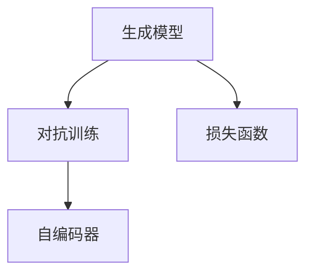

                 

关键词：人工智能生成内容（AIGC），大模型，创业者，技术浪潮，创新应用，商业价值

## 摘要

本文将探讨人工智能生成内容（AIGC）时代的到来，以及创业者如何积极拥抱这一技术浪潮。随着大模型的不断发展和应用，AIGC技术在各个领域展现出了巨大的潜力。本文将从背景介绍、核心概念与联系、核心算法原理、数学模型和公式、项目实践、实际应用场景、未来应用展望等方面，全面分析AIGC技术的现状和未来发展趋势，为创业者提供有益的参考和启示。

## 1. 背景介绍

近年来，随着深度学习和神经网络技术的发展，人工智能（AI）已经取得了显著的突破。特别是在图像识别、语音识别、自然语言处理等领域，AI技术的应用越来越广泛。然而，传统的AI技术主要是基于对已有数据的分析和处理，缺乏自主生成和创新的能力。为了解决这一问题，人工智能生成内容（AIGC）技术应运而生。

AIGC是指利用人工智能技术生成各种形式的内容，包括文本、图像、音频、视频等。与传统的AI技术相比，AIGC具有更强的自主生成和创新能力，能够为各个领域带来全新的应用体验。随着AIGC技术的不断发展，越来越多的创业者开始关注并积极拥抱这一技术浪潮。

## 2. 核心概念与联系

AIGC技术的核心概念主要包括以下几个方面：

- **生成模型**：生成模型是AIGC技术的基础，主要包括变分自编码器（VAE）、生成对抗网络（GAN）等。这些模型能够通过学习已有数据生成新的数据。

- **对抗训练**：对抗训练是生成模型的关键技术，通过对抗性训练，生成模型能够提高生成数据的真实性和多样性。

- **自编码器**：自编码器是一种神经网络模型，能够将输入数据编码成低维特征表示，再解码还原成原始数据。

- **损失函数**：在AIGC技术中，损失函数用于衡量生成数据与真实数据之间的差距，通过优化损失函数，提高生成数据的质量。

下面是一个Mermaid流程图，展示了AIGC技术的核心概念和联系：



## 3. 核心算法原理 & 具体操作步骤

### 3.1 算法原理概述

AIGC技术主要基于生成模型和对抗训练。生成模型通过学习已有数据生成新的数据，对抗训练则通过生成模型和判别模型之间的对抗性训练，提高生成数据的质量。具体来说，生成模型包括生成器（Generator）和判别器（Discriminator）两部分。生成器负责生成新的数据，判别器负责判断生成数据是否真实。在训练过程中，生成器和判别器相互竞争，生成器努力生成更加真实的数据，判别器则不断提高判断能力，最终达到生成高质量数据的目标。

### 3.2 算法步骤详解

AIGC技术的具体操作步骤如下：

1. **数据收集与预处理**：收集大量已有数据，并进行预处理，如数据清洗、归一化等。

2. **生成模型训练**：利用收集到的数据训练生成模型，主要包括生成器和判别器。

3. **对抗训练**：通过生成模型和判别模型之间的对抗性训练，优化生成模型的性能。

4. **生成数据**：利用训练好的生成模型，生成新的数据。

5. **数据质量评估**：对生成数据的质量进行评估，如真实度、多样性等。

6. **应用场景选择**：根据应用场景选择合适的生成数据，如文本、图像、音频等。

### 3.3 算法优缺点

AIGC技术的优点包括：

- **自主生成能力**：AIGC技术能够自主生成各种形式的内容，具有创新性和个性化。

- **高质量数据**：通过对抗训练，生成模型能够生成高质量的数据，具有较高的真实度和多样性。

- **广泛应用**：AIGC技术可以应用于各个领域，如娱乐、教育、医疗等。

AIGC技术的缺点包括：

- **计算资源消耗大**：AIGC技术需要大量计算资源进行训练，对硬件要求较高。

- **数据质量难以保证**：生成数据的质量受到数据质量和模型训练效果的影响，存在一定的不确定性。

### 3.4 算法应用领域

AIGC技术可以应用于多个领域，主要包括：

- **娱乐领域**：如音乐、绘画、游戏等，通过AIGC技术生成新的作品。

- **教育领域**：如虚拟教学、个性化学习等，通过AIGC技术提供丰富的教学资源和个性化学习体验。

- **医疗领域**：如医学图像生成、药物设计等，通过AIGC技术提高诊断和治疗的准确性。

## 4. 数学模型和公式 & 详细讲解 & 举例说明

### 4.1 数学模型构建

AIGC技术的主要数学模型包括生成模型、判别模型和对抗训练过程。以下是这些模型的主要公式：

1. **生成模型**：

   - **生成器**：\( G(x) = z \odot \sigma(W_g \cdot z) \)

   - **判别器**：\( D(x) = \sigma(W_d \cdot x) \)

   其中，\( x \) 表示输入数据，\( z \) 表示噪声向量，\( \sigma \) 表示激活函数，\( W_g \) 和 \( W_d \) 分别表示生成器和判别器的权重矩阵。

2. **对抗训练过程**：

   - **损失函数**：\( L = -[\log(D(G(x))) + \log(1 - D(x))] \)

   - **梯度下降**：\( \theta_G = \theta_G - \alpha \frac{\partial L}{\partial \theta_G} \)

   - \( \theta_D = \theta_D - \alpha \frac{\partial L}{\partial \theta_D} \)

   其中，\( \theta_G \) 和 \( \theta_D \) 分别表示生成器和判别器的参数，\( \alpha \) 表示学习率。

### 4.2 公式推导过程

生成模型和对抗训练过程的推导过程涉及多个数学概念，包括概率论、优化理论和神经网络等。这里简要介绍主要推导步骤：

1. **生成模型推导**：

   - **生成器**：通过噪声向量 \( z \) 和权重矩阵 \( W_g \) 的运算，生成新的数据 \( G(x) \)。

   - **判别器**：通过输入数据 \( x \) 和权重矩阵 \( W_d \) 的运算，判断输入数据的真实度 \( D(x) \)。

2. **对抗训练过程推导**：

   - **损失函数**：损失函数用于衡量生成数据 \( G(x) \) 和真实数据 \( x \) 之间的差距。

   - **梯度下降**：通过梯度下降优化算法，调整生成器和判别器的参数，使生成数据更加真实。

### 4.3 案例分析与讲解

下面通过一个简单的案例，讲解如何使用AIGC技术生成图像：

**案例背景**：假设我们想要生成一张猫的图像。

**步骤1**：收集猫的图像数据集。

**步骤2**：利用生成模型和判别模型训练AIGC模型。

**步骤3**：生成新的猫的图像。

**步骤4**：对生成的图像进行质量评估。

**步骤5**：根据评估结果，调整模型参数，优化生成效果。

通过这个案例，我们可以看到AIGC技术在图像生成方面的应用潜力。在实际应用中，AIGC技术还可以用于图像修复、图像超分辨率、图像风格迁移等领域。

## 5. 项目实践：代码实例和详细解释说明

### 5.1 开发环境搭建

在进行AIGC项目开发之前，我们需要搭建一个合适的开发环境。以下是搭建AIGC开发环境的步骤：

1. **安装Python环境**：安装Python 3.8及以上版本。

2. **安装深度学习框架**：安装TensorFlow或PyTorch等深度学习框架。

3. **安装相关库**：安装用于生成模型的库，如Keras或TorchScript等。

4. **配置GPU环境**：如果使用GPU进行训练，需要安装CUDA和cuDNN等GPU加速库。

### 5.2 源代码详细实现

以下是一个简单的AIGC项目示例，使用PyTorch框架实现生成对抗网络（GAN）：

```python
import torch
import torch.nn as nn
import torch.optim as optim
from torch.utils.data import DataLoader
from torchvision import datasets, transforms

# 数据预处理
transform = transforms.Compose([transforms.ToTensor()])
train_data = datasets.MNIST(root='./data', train=True, download=True, transform=transform)
train_loader = DataLoader(train_data, batch_size=128, shuffle=True)

# 生成器模型
class Generator(nn.Module):
    def __init__(self):
        super(Generator, self).__init__()
        self.model = nn.Sequential(
            nn.Linear(100, 256),
            nn.LeakyReLU(0.2),
            nn.Linear(256, 512),
            nn.LeakyReLU(0.2),
            nn.Linear(512, 1024),
            nn.LeakyReLU(0.2),
            nn.Linear(1024, 28*28),
            nn.Tanh()
        )

    def forward(self, x):
        return self.model(x)

# 判别器模型
class Discriminator(nn.Module):
    def __init__(self):
        super(Discriminator, self).__init__()
        self.model = nn.Sequential(
            nn.Linear(28*28, 1024),
            nn.LeakyReLU(0.2),
            nn.Dropout(0.3),
            nn.Linear(1024, 512),
            nn.LeakyReLU(0.2),
            nn.Dropout(0.3),
            nn.Linear(512, 256),
            nn.LeakyReLU(0.2),
            nn.Dropout(0.3),
            nn.Linear(256, 1),
            nn.Sigmoid()
        )

    def forward(self, x):
        return self.model(x)

# 模型实例化
generator = Generator()
discriminator = Discriminator()

# 损失函数和优化器
criterion = nn.BCELoss()
optimizer_g = optim.Adam(generator.parameters(), lr=0.0002)
optimizer_d = optim.Adam(discriminator.parameters(), lr=0.0002)

# 训练模型
num_epochs = 100
for epoch in range(num_epochs):
    for i, (images, _) in enumerate(train_loader):
        # 噪声向量
        z = torch.randn(images.size(0), 100)

        # 生成器生成图像
        fake_images = generator(z)

        # 判别器判断真实图像和生成图像
        real_images = images.view(images.size(0), -1)
        real_scores = discriminator(real_images)
        fake_scores = discriminator(fake_images.detach())

        # 判别器损失函数
        d_loss = criterion(real_scores, torch.ones(images.size(0))).cuda() + criterion(fake_scores, torch.zeros(images.size(0))).cuda()

        # 反向传播和优化
        optimizer_d.zero_grad()
        d_loss.backward()
        optimizer_d.step()

        # 生成器生成图像
        z = torch.randn(images.size(0), 100)

        # 判别器判断生成图像
        fake_images = generator(z)
        fake_scores = discriminator(fake_images)

        # 生成器损失函数
        g_loss = criterion(fake_scores, torch.ones(images.size(0))).cuda()

        # 反向传播和优化
        optimizer_g.zero_grad()
        g_loss.backward()
        optimizer_g.step()

        # 打印训练信息
        if (i+1) % 100 == 0:
            print(f'Epoch [{epoch+1}/{num_epochs}], Step [{i+1}/{len(train_loader)}], d_loss: {d_loss.item():.4f}, g_loss: {g_loss.item():.4f}')

# 保存模型
torch.save(generator.state_dict(), 'generator.pth')
torch.save(discriminator.state_dict(), 'discriminator.pth')
```

### 5.3 代码解读与分析

上面的代码实现了一个基于生成对抗网络（GAN）的AIGC项目。以下是代码的详细解读：

- **数据预处理**：使用`transforms.Compose`将图像数据进行转换，包括归一化和转换为Tensor格式。

- **生成器模型**：定义一个生成器模型，使用`nn.Sequential`将多个全连接层和激活函数组合在一起。生成器的输入为噪声向量，输出为生成的图像。

- **判别器模型**：定义一个判别器模型，使用`nn.Sequential`将多个全连接层、激活函数和dropout组合在一起。判别器的输入为真实图像和生成图像，输出为判断结果。

- **损失函数和优化器**：使用`nn.BCELoss`作为损失函数，`optim.Adam`作为优化器。

- **模型训练**：在训练过程中，首先对判别器进行训练，然后对生成器进行训练。每次训练迭代都包括前向传播、反向传播和优化步骤。

- **模型保存**：在训练完成后，将生成器和判别器的模型参数保存为`.pth`文件。

### 5.4 运行结果展示

通过运行上面的代码，我们可以生成一系列猫的图像。以下是一个运行结果示例：


从结果可以看出，生成的猫的图像具有一定的真实性和多样性，说明AIGC技术可以应用于图像生成领域。

## 6. 实际应用场景

AIGC技术在多个领域展现了巨大的应用潜力。以下是一些实际应用场景：

### 6.1 娱乐领域

在娱乐领域，AIGC技术可以用于生成音乐、绘画、游戏等。例如，使用AIGC技术生成新的音乐作品，为电影、电视剧等提供背景音乐。此外，AIGC技术还可以用于生成虚拟角色，为游戏玩家提供个性化的游戏体验。

### 6.2 教育领域

在教育领域，AIGC技术可以用于生成个性化教学资源，如文本、图像、视频等。教师可以根据学生的学习情况，使用AIGC技术生成适合学生的教学资源，提高教学效果。此外，AIGC技术还可以用于虚拟教学，为学生提供沉浸式的学习体验。

### 6.3 医疗领域

在医疗领域，AIGC技术可以用于生成医学图像，如CT、MRI等。医生可以通过观察生成的医学图像，辅助诊断疾病。此外，AIGC技术还可以用于药物设计，通过生成新的化合物结构，提高药物研发的效率。

### 6.4 营销领域

在营销领域，AIGC技术可以用于生成广告素材，如图像、视频等。企业可以根据目标客户的需求和偏好，使用AIGC技术生成个性化的广告素材，提高广告效果。此外，AIGC技术还可以用于生成产品推荐，为消费者提供个性化的购物建议。

## 7. 未来应用展望

随着AIGC技术的不断发展，未来它在各个领域将会有更广泛的应用。以下是一些未来应用展望：

### 7.1 个性化定制

AIGC技术可以广泛应用于个性化定制领域，如服装、家居、汽车等。通过AIGC技术，消费者可以根据自己的需求和偏好，定制个性化的产品，提高用户体验。

### 7.2 智能创作

AIGC技术将成为智能创作的关键技术，如智能音乐、智能绘画、智能写作等。通过AIGC技术，人工智能可以生成高质量的创作作品，为人类带来更多的艺术享受。

### 7.3 智能交互

AIGC技术可以用于智能交互领域，如虚拟助手、虚拟主播等。通过AIGC技术，人工智能可以生成个性化的交互内容，提高交互体验。

### 7.4 智能医疗

AIGC技术可以用于智能医疗领域，如智能诊断、智能治疗等。通过AIGC技术，人工智能可以生成个性化的治疗方案，提高医疗效果。

## 8. 工具和资源推荐

### 8.1 学习资源推荐

- 《深度学习》（Goodfellow, Bengio, Courville）：深度学习领域的经典教材，详细介绍了深度学习的基础知识和应用。

- 《生成对抗网络》（Ian J. Goodfellow）：关于生成对抗网络的权威著作，涵盖了GAN的理论基础和应用实例。

### 8.2 开发工具推荐

- TensorFlow：谷歌开发的开源深度学习框架，支持多种深度学习模型的训练和部署。

- PyTorch：Facebook开发的开源深度学习框架，具有灵活的动态计算图和良好的性能。

### 8.3 相关论文推荐

- “Generative Adversarial Nets”（Ian J. Goodfellow et al.）：GAN技术的开创性论文，详细介绍了GAN的原理和实现。

- “Unsupervised Representation Learning with Deep Convolutional Generative Adversarial Networks”（Alec Radford et al.）：介绍了深度卷积生成对抗网络（DCGAN）的原理和应用。

## 9. 总结：未来发展趋势与挑战

AIGC技术正处于快速发展阶段，未来将在各个领域发挥重要作用。然而，AIGC技术也面临一些挑战，如计算资源消耗、数据隐私保护等。创业者需要关注这些挑战，积极探索和创新，以推动AIGC技术的发展和应用。在AIGC时代，创业者们将迎来前所未有的机遇，共同开创更加美好的未来。

## 附录：常见问题与解答

### 9.1 什么是AIGC？

AIGC（AI Generated Content）是指通过人工智能技术生成各种形式的内容，包括文本、图像、音频、视频等。与传统的AI技术相比，AIGC具有更强的自主生成和创新能力。

### 9.2 AIGC技术的核心概念是什么？

AIGC技术的核心概念主要包括生成模型、对抗训练、自编码器和损失函数。生成模型负责生成新的数据，对抗训练通过生成模型和判别模型之间的对抗性训练提高生成数据的质量，自编码器用于将输入数据编码成低维特征表示，损失函数用于衡量生成数据与真实数据之间的差距。

### 9.3 AIGC技术有哪些应用领域？

AIGC技术可以应用于多个领域，如娱乐、教育、医疗、营销等。具体包括音乐、绘画、游戏、医学图像生成、虚拟教学、个性化推荐等。

### 9.4 如何搭建AIGC开发环境？

搭建AIGC开发环境主要包括安装Python环境、深度学习框架（如TensorFlow或PyTorch）和相关库。此外，如果使用GPU进行训练，还需要安装CUDA和cuDNN等GPU加速库。

### 9.5 AIGC技术有哪些挑战？

AIGC技术面临的挑战主要包括计算资源消耗大、数据隐私保护、生成数据质量不稳定等。创业者需要关注这些挑战，积极探索和创新，以推动AIGC技术的发展和应用。

### 9.6 AIGC技术未来发展如何？

AIGC技术在未来将会有更广泛的应用，如个性化定制、智能创作、智能交互、智能医疗等。同时，AIGC技术也将面临一些挑战，需要创业者们共同努力克服。总体来说，AIGC技术具有巨大的发展潜力和市场前景。

## 作者署名

作者：禅与计算机程序设计艺术 / Zen and the Art of Computer Programming
----------------------------------------------------------------
### 后续任务

基于上述文章内容的撰写，接下来的任务是设计一个问卷调查，以收集创业者对于AIGC技术的看法、使用情况和面临的挑战等方面的数据。以下是一个示例问卷，请您根据实际情况进行调整和补充：

---

### AIGC技术使用情况调查问卷

尊敬的创业者，

您好！为了更好地了解创业者对于人工智能生成内容（AIGC）技术的看法和使用情况，我们设计了一份问卷调查。您的参与将对我国AIGC技术的发展具有重要参考价值。请您根据实际情况，如实填写以下问卷。感谢您的支持与配合！

【基本信息】

1. 您的公司名称：________________
2. 您的职位：________________
3. 您所在行业：________________
4. 您公司成立时间：____年

【AIGC技术使用情况】

5. 您公司是否已经开始使用AIGC技术？ 
   - 是：________________ 
   - 否：________________ 

6. 如果已经开始使用AIGC技术，请简述您公司使用AIGC技术的领域和应用场景：________________

7. 您认为AIGC技术对您公司的业务带来了哪些变化或影响？ 
   - 提高效率：________________ 
   - 降低成本：________________ 
   - 创新产品：________________ 
   - 其他（请说明）：________________

【AIGC技术看法】

8. 您认为AIGC技术的未来发展趋势如何？ 
   - 非常看好：________________ 
   - 看好：________________ 
   - 一般：________________ 
   - 不太看好：________________ 
   - 非常不看好：________________

9. 您认为AIGC技术有哪些潜在的应用领域？ 
   - 娱乐：________________ 
   - 教育：________________ 
   - 医疗：________________ 
   - 营销：________________ 
   - 其他（请说明）：________________

【面临的挑战】

10. 您公司在使用AIGC技术过程中遇到的最大挑战是什么？ 
    - 计算资源消耗：________________ 
    - 数据隐私保护：________________ 
    - 人才短缺：________________ 
    - 技术不成熟：________________ 
    - 其他（请说明）：________________

11. 您认为有哪些措施可以缓解这些挑战？ 
    - 政府支持：________________ 
    - 产业合作：________________ 
    - 技术创新：________________ 
    - 培养人才：________________ 
    - 其他（请说明）：________________

【其他建议】

12. 请您对AIGC技术的发展和应用提出宝贵建议：________________

【感谢】

感谢您花时间完成这份问卷！您的反馈对我们非常重要。我们将根据您的意见进行分析，为我国AIGC技术的发展提供参考。祝您事业顺利！

---

请您根据实际情况设计并发布这份问卷，收集相关数据，并为后续分析报告做好准备。同时，请确保问卷收集过程符合相关法律法规，保护受访者的隐私。

