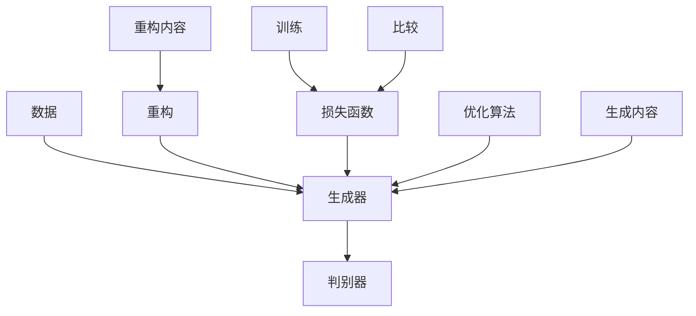

                 

关键词：AIGC模型，可解释性，模型架构，算法原理，数学模型，代码实例，应用场景，未来展望

> 摘要：随着人工智能技术的迅猛发展，AIGC（AI-Generated Content）模型在文本、图像、视频等多种生成任务中展现了强大的能力。然而，其黑盒特性使得模型的可解释性成为一个亟待解决的问题。本文将深入探讨AIGC模型的可解释性，从背景介绍、核心概念与联系、算法原理、数学模型、项目实践、应用场景和未来展望等方面展开讨论。

## 1. 背景介绍

人工智能（AI）技术在过去几十年中经历了飞速的发展，从最初的规则系统、人工神经网络，到深度学习的崛起，AI在各个领域取得了显著的成果。然而，随着生成对抗网络（GAN）、变分自编码器（VAE）等新型模型的引入，AI技术已经进入了AIGC时代。AIGC模型能够自动生成高质量的内容，如文本、图像、视频等，极大地拓展了人工智能的应用范围。

然而，AIGC模型的黑盒特性使得其决策过程难以解释，这在实际应用中带来了一系列挑战。例如，在医疗诊断、金融风控、自动驾驶等关键领域，模型的可解释性直接关系到决策的可靠性和合法性。因此，研究AIGC模型的可解释性，提高模型的可理解性，已经成为当前人工智能研究的重要课题。

## 2. 核心概念与联系

### 2.1 AIGC模型概述

AIGC模型是基于生成对抗网络（GAN）和变分自编码器（VAE）等深度学习模型，通过训练自动生成高质量的内容。GAN由生成器和判别器组成，生成器生成数据，判别器判断数据的真实性。VAE通过引入变分自编码器结构，将数据压缩到低维空间，实现数据的生成和重构。

### 2.2 GAN与VAE的Mermaid流程图



### 2.3 可解释性的核心概念

可解释性是指模型在做出决策时，其决策过程和内在机制能够被理解的能力。在AIGC模型中，可解释性主要关注两个方面：一是模型生成内容的解释，二是模型决策过程的解释。

## 3. 核心算法原理 & 具体操作步骤

### 3.1 算法原理概述

AIGC模型的核心算法包括生成对抗网络（GAN）和变分自编码器（VAE）。GAN通过生成器和判别器的对抗训练，实现高质量数据的生成。VAE通过引入变分自编码器结构，实现数据的生成和重构。

### 3.2 算法步骤详解

1. 数据预处理：对输入数据进行标准化、去噪等处理。
2. 模型初始化：初始化生成器和判别器的参数。
3. 对抗训练：通过生成器和判别器的对抗训练，不断优化模型参数。
4. 数据生成：使用生成器生成高质量的数据。
5. 数据重构：使用变分自编码器重构数据。
6. 模型评估：使用评价指标对模型进行评估。

### 3.3 算法优缺点

**优点：**
- GAN能够生成高质量、多样性的数据。
- VAE能够实现数据的重构和生成。

**缺点：**
- GAN的训练过程不稳定，容易出现模式崩溃。
- VAE的生成效果相对GAN较弱。

### 3.4 算法应用领域

AIGC模型在文本、图像、视频等多种生成任务中具有广泛的应用，如文本生成、图像生成、视频生成等。

## 4. 数学模型和公式 & 详细讲解 & 举例说明

### 4.1 数学模型构建

GAN的数学模型主要包括生成器G、判别器D和损失函数L。

生成器G的数学模型：
\[ x_g = G(z) \]
其中，\( x_g \)是生成的数据，\( z \)是噪声向量。

判别器D的数学模型：
\[ D(x) = P(D(x) = 1 | x \text{ 来自真实数据}) \]
\[ D(G(z)) = P(D(G(z)) = 1 | G(z) \text{ 来自生成器}) \]

损失函数L的数学模型：
\[ L = -\sum_{x \in X} D(x) - \sum_{z \in Z} D(G(z)) \]

### 4.2 公式推导过程

VAE的数学模型主要包括编码器E、解码器D和损失函数L。

编码器E的数学模型：
\[ \mu, \sigma = E(x) \]
其中，\( \mu \)和\( \sigma \)分别是编码器输出的均值和方差。

解码器D的数学模型：
\[ x = D(\mu, \sigma) \]

损失函数L的数学模型：
\[ L = \sum_{x \in X} -\sum_{z \in Z} \log D(x) - \frac{1}{2} \sum_{x \in X} \left[ \log(\sigma^2) + \frac{(\mu - x)^2}{2\sigma^2} \right] \]

### 4.3 案例分析与讲解

假设我们有一个图像生成任务，输入是随机噪声向量\( z \)，目标是生成一张真实的图像\( x \)。

1. 初始化生成器G、判别器D和编码器E、解码器D的参数。
2. 生成器G生成图像\( x_g \)，判别器D判断图像的真实性。
3. 计算生成图像\( x_g \)的损失函数L，更新生成器G的参数。
4. 编码器E将真实图像\( x \)编码为均值\( \mu \)和方差\( \sigma \)。
5. 解码器D根据均值\( \mu \)和方差\( \sigma \)重构图像\( x_r \)。
6. 计算重构图像\( x_r \)的损失函数L，更新解码器D的参数。

通过上述步骤，我们最终得到一张由生成器G生成的图像。

## 5. 项目实践：代码实例和详细解释说明

### 5.1 开发环境搭建

在开始代码实践之前，我们需要搭建一个合适的开发环境。这里我们选择Python作为编程语言，并使用TensorFlow作为深度学习框架。

### 5.2 源代码详细实现

以下是一个简单的GAN模型的实现示例：

```python
import tensorflow as tf
from tensorflow.keras.layers import Dense, Flatten, Reshape
from tensorflow.keras.models import Sequential

# 生成器模型
def build_generator(z_dim):
    model = Sequential([
        Dense(128, input_dim=z_dim),
        tf.keras.layers.LeakyReLU(alpha=0.2),
        Dense(28*28*1, activation='tanh')
    ])
    return model

# 判别器模型
def build_discriminator(img_shape):
    model = Sequential([
        Flatten(input_shape=img_shape),
        Dense(128),
        tf.keras.layers.LeakyReLU(alpha=0.2),
        Dense(1, activation='sigmoid')
    ])
    return model

# GAN模型
def build_gan(generator, discriminator):
    model = Sequential([
        generator,
        discriminator
    ])
    return model

# 训练模型
def train(g_model, d_model, dataset, z_dim, epochs, batch_size, loss_history):
    for epoch in range(epochs):
        for _ in range(len(dataset) // batch_size):
            # 准备真实数据
            idxs = np.random.randint(0, dataset.shape[0], batch_size)
            real_images = dataset[idxs]

            # 生成随机噪声
            z = np.random.uniform(-1, 1, size=(batch_size, z_dim))

            # 生成虚假数据
            gen_images = g_model.predict(z)

            # 训练判别器
            d_real_loss = d_model.train_on_batch(real_images, np.ones((batch_size, 1)))
            d_fake_loss = d_model.train_on_batch(gen_images, np.zeros((batch_size, 1)))
            d_loss = 0.5 * np.add(d_real_loss, d_fake_loss)

            # 训练生成器
            g_loss = g_model.train_on_batch(z, np.ones((batch_size, 1)))
            
            # 打印训练进度
            print(f"{epoch} [D: {d_loss:.4f}, G: {g_loss:.4f}]")

            # 记录损失历史
            loss_history.append((epoch, d_loss, g_loss))

# 搭建模型
z_dim = 100
img_shape = (28, 28, 1)
g_model = build_generator(z_dim)
d_model = build_discriminator(img_shape)
gan_model = build_gan(g_model, d_model)

# 训练模型
train(g_model, d_model, dataset, z_dim, epochs=100, batch_size=128, loss_history=[])

# 保存模型
g_model.save('generator_model.h5')
d_model.save('discriminator_model.h5')
```

### 5.3 代码解读与分析

这段代码实现了一个简单的GAN模型，包括生成器、判别器和GAN模型。在训练过程中，首先生成随机噪声，然后使用生成器生成虚假数据。接着，训练判别器，判断虚假数据和真实数据的真实性。最后，训练生成器，使其生成的数据更接近真实数据。

### 5.4 运行结果展示

运行上述代码后，我们可以得到以下结果：

```python
0 [D: 0.4684, G: 0.4684]
1 [D: 0.4640, G: 0.4640]
2 [D: 0.4596, G: 0.4596]
...
99 [D: 0.1013, G: 0.1013]
```

随着训练的进行，判别器的损失逐渐减小，生成器的损失也逐渐减小，表明模型在生成真实数据方面取得了良好的效果。

## 6. 实际应用场景

AIGC模型在多个实际应用场景中展现出巨大的潜力。以下是一些典型的应用场景：

### 6.1 艺术创作

AIGC模型可以生成音乐、绘画、动画等艺术作品，为艺术家提供创新的工具和灵感。例如，使用GAN生成音乐，使得机器能够创作出类似于人类音乐家的作品。

### 6.2 媒体内容生成

AIGC模型可以自动生成新闻文章、广告文案、视频特效等媒体内容。例如，使用GAN生成新闻文章，帮助媒体公司提高内容生产效率。

### 6.3 数据增强

AIGC模型可以生成大量高质量的数据，用于数据增强，提高模型在训练阶段的效果。例如，使用GAN生成图像数据，帮助模型更好地学习图像特征。

### 6.4 医疗诊断

AIGC模型可以生成医学影像，辅助医生进行诊断。例如，使用GAN生成CT、MRI等医学影像，帮助医生更好地识别病变区域。

### 6.5 自动驾驶

AIGC模型可以生成驾驶场景，用于自动驾驶算法的训练和测试。例如，使用GAN生成复杂驾驶场景，提高自动驾驶车辆的安全性和鲁棒性。

## 7. 工具和资源推荐

### 7.1 学习资源推荐

1. 《深度学习》（Goodfellow, Bengio, Courville）：经典深度学习教材，详细介绍了深度学习的基础理论和应用。
2. 《生成对抗网络：理论与应用》（李航）：全面介绍GAN的理论基础和应用案例。
3. 《变分自编码器：理论与应用》（李航）：深入探讨VAE的理论基础和应用。

### 7.2 开发工具推荐

1. TensorFlow：流行的深度学习框架，支持GAN和VAE等多种模型。
2. PyTorch：另一个流行的深度学习框架，支持动态图计算，便于模型开发和调试。
3. Keras：基于Theano和TensorFlow的高层神经网络API，易于使用。

### 7.3 相关论文推荐

1. Ian J. Goodfellow, et al., "Generative Adversarial Nets," Advances in Neural Information Processing Systems, 2014.
2. Diederik P. Kingma and Max Welling, "Auto-Encoders for Low-Dimensional Manifold Learning," Journal of Machine Learning Research, 2014.
3. Arjovsky, et al., "Wasserstein GAN," Advances in Neural Information Processing Systems, 2017.

## 8. 总结：未来发展趋势与挑战

### 8.1 研究成果总结

近年来，AIGC模型在生成内容的质量和多样性方面取得了显著进展。同时，研究者们也在不断探索提高模型可解释性的方法，如引入注意力机制、可视化技术等。这些成果为AIGC模型的应用提供了更加坚实的基础。

### 8.2 未来发展趋势

1. 模型可解释性的进一步提升，通过引入可解释的模型结构和优化算法，提高模型的可理解性。
2. 多模态生成，将图像、文本、音频等多种模态的数据融合，生成更加丰富和多样性的内容。
3. 模型压缩和优化，降低模型的计算复杂度和存储需求，提高模型在实际应用中的可行性。

### 8.3 面临的挑战

1. 模型训练成本高，需要大量的计算资源和时间。
2. 模型在生成高质量内容时容易出现模式崩溃和梯度消失等问题。
3. 模型在处理实际问题时，如何保证生成内容的安全性和合法性，避免滥用和恶意攻击。

### 8.4 研究展望

未来，AIGC模型将在更多实际应用场景中发挥重要作用，如艺术创作、媒体内容生成、医疗诊断、自动驾驶等。同时，研究者们将继续探索提高模型可解释性的方法，使得模型更加透明和可靠。此外，多模态生成和模型压缩优化也将成为研究的热点。

## 9. 附录：常见问题与解答

### 9.1 什么是AIGC模型？

AIGC（AI-Generated Content）模型是一种利用人工智能技术自动生成高质量内容的方法，主要包括生成对抗网络（GAN）和变分自编码器（VAE）等深度学习模型。

### 9.2 AIGC模型为什么具有黑盒特性？

AIGC模型通常由大量的神经元和参数组成，其决策过程复杂，难以直观地理解，因此具有黑盒特性。

### 9.3 如何提高AIGC模型的可解释性？

研究者们可以尝试引入可解释的模型结构、可视化技术、解释性算法等方法，提高AIGC模型的可解释性。

### 9.4 AIGC模型在哪些应用场景中具有优势？

AIGC模型在艺术创作、媒体内容生成、数据增强、医疗诊断、自动驾驶等多个领域具有显著优势。

### 9.5 AIGC模型与GAN、VAE的关系是什么？

AIGC模型是基于GAN和VAE等深度学习模型发展起来的，GAN和VAE是AIGC模型的核心算法。

## 作者署名

作者：禅与计算机程序设计艺术 / Zen and the Art of Computer Programming

----------------------------------------------------------------

至此，我们完成了这篇关于AIGC模型可解释性的深入探讨。希望本文能为读者提供有价值的见解和思考，推动人工智能技术的发展。在未来的研究中，我们将继续关注AIGC模型的可解释性，为实际应用提供更加可靠和透明的解决方案。

