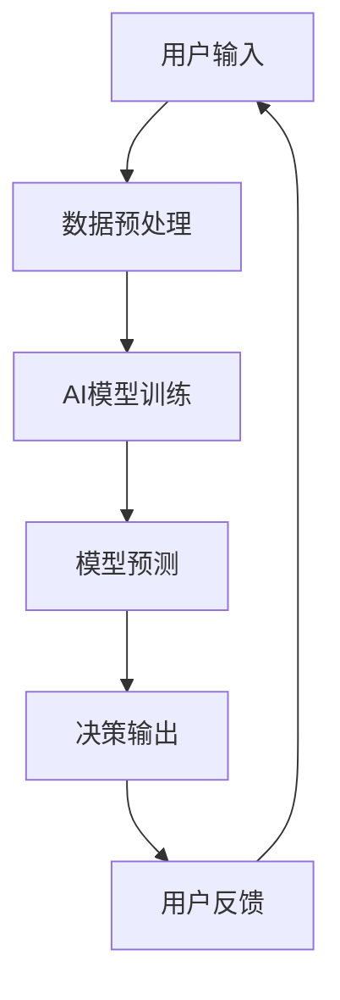

                 

在当今数字经济的浪潮中，人工智能（AI）已经成为推动技术进步和业务创新的核心驱动力。随着AI技术的不断成熟和普及，越来越多的企业开始探索AI-Native应用的商业模式，以期在激烈的市场竞争中脱颖而出。本文旨在深入探讨AI-Native应用的概念、核心优势、商业模式创新以及未来发展的趋势和挑战。

> 关键词：人工智能，AI-Native应用，商业模式创新，技术进步，数字经济发展

> 摘要：本文首先介绍了AI-Native应用的定义和背景，随后分析了其在技术、商业和用户层面的核心优势。接着，文章探讨了AI-Native应用的几种商业模式，并提供了实际案例和具体操作步骤。最后，文章展望了AI-Native应用的未来发展趋势，提出了潜在的挑战和研究方向。

## 1. 背景介绍

### AI的崛起与影响

人工智能作为计算机科学的一个重要分支，其发展历程可以追溯到20世纪50年代。随着计算能力的提升和数据量的爆炸式增长，AI技术经历了从理论探讨到实际应用的转变。特别是在深度学习、自然语言处理、计算机视觉等领域，AI技术的突破性进展显著提升了机器的智能化水平。这些技术的进步不仅改变了传统行业的运作方式，也催生了全新的商业模式和应用场景。

### AI-Native应用的概念

AI-Native应用是指那些从设计之初就嵌入人工智能技术的应用。这些应用不仅仅是将AI技术作为附加功能，而是将AI作为核心组成部分，深度整合到产品和服务中。AI-Native应用具有以下几个特点：

- **集成性**：AI技术是应用的核心，而非附加功能。
- **自适应性**：应用能够根据用户行为和反馈进行自我调整和优化。
- **智能化**：应用能够提供更加智能和个性化的用户体验。
- **高效性**：AI技术能够显著提高数据处理和决策的效率。

### AI-Native应用的背景

AI-Native应用的兴起与以下几个因素密切相关：

- **技术成熟**：AI技术的成熟为AI-Native应用提供了坚实的基础。
- **数据驱动的商业模式**：企业越来越依赖数据来驱动决策，AI技术能够帮助从海量数据中提取有价值的信息。
- **用户需求变化**：用户对个性化、智能化的需求日益增长，推动企业不断创新以满足这些需求。
- **行业竞争加剧**：在激烈的市场竞争中，企业需要通过技术创新来获得竞争优势。

## 2. 核心概念与联系

### AI-Native应用架构图

为了更好地理解AI-Native应用的核心概念和架构，以下是一个简单的Mermaid流程图：



在这个流程图中，用户输入的数据经过预处理后，输入到AI模型中进行训练和预测，最终的决策输出会反馈给用户，形成一个闭环系统。这个循环不断进行，使得应用能够不断优化和改进。

### 关键概念解释

- **数据预处理**：将用户输入的数据进行清洗、归一化和特征提取，以便AI模型能够更好地学习。
- **AI模型训练**：使用历史数据对AI模型进行训练，使其能够学习到数据中的模式和规律。
- **模型预测**：基于训练好的模型，对新的数据进行预测和决策。
- **决策输出**：将决策结果输出给用户，以便用户采取相应的行动。
- **用户反馈**：用户对决策输出的反馈将用于进一步优化模型。

## 3. 核心算法原理 & 具体操作步骤

### 3.1 算法原理概述

AI-Native应用的核心算法通常是基于深度学习的技术。深度学习通过多层神经网络来模拟人脑的学习过程，能够从大量数据中自动提取特征和模式。以下是一个简化的深度学习算法原理概述：

1. **输入层**：接收用户输入的数据。
2. **隐藏层**：对输入数据进行特征提取和变换。
3. **输出层**：根据提取的特征进行预测和决策。
4. **反向传播**：通过误差计算和梯度下降等方法不断调整网络的权重，以优化预测结果。

### 3.2 算法步骤详解

1. **数据预处理**：对用户输入的数据进行清洗、归一化和特征提取。这一步骤的目的是将原始数据转换为适合模型训练的格式。

2. **模型构建**：定义神经网络的结构，包括输入层、隐藏层和输出层的神经元数量和连接方式。

3. **模型训练**：使用历史数据进行模型训练。训练过程中，通过反向传播算法不断调整网络权重，以最小化预测误差。

4. **模型评估**：使用测试集评估模型的表现，确保其能够泛化到未知数据上。

5. **模型部署**：将训练好的模型部署到生产环境中，对新的数据进行实时预测和决策。

6. **用户反馈**：收集用户对决策输出的反馈，用于进一步优化模型。

### 3.3 算法优缺点

**优点**：

- **强大的泛化能力**：深度学习模型能够从大量数据中自动提取特征，具有良好的泛化能力。
- **高效的处理速度**：相较于传统机器学习算法，深度学习模型在处理大规模数据时具有更高的效率。
- **高度智能化**：深度学习模型能够提供更加智能和个性化的用户体验。

**缺点**：

- **数据依赖性**：深度学习模型对数据质量有较高的要求，数据不足或不准确可能会导致模型性能下降。
- **计算资源需求**：训练深度学习模型需要大量的计算资源和时间，特别是对于大型网络和复杂任务。
- **可解释性较低**：深度学习模型通常被视为“黑箱”，其内部工作机制难以理解和解释。

### 3.4 算法应用领域

深度学习算法在AI-Native应用中具有广泛的应用领域，包括：

- **自然语言处理**：用于文本分类、情感分析、机器翻译等任务。
- **计算机视觉**：用于图像识别、目标检测、图像生成等任务。
- **推荐系统**：用于个性化推荐、内容推荐等任务。
- **金融风控**：用于信用评分、风险预测等任务。
- **医疗诊断**：用于疾病诊断、药物研发等任务。

## 4. 数学模型和公式 & 详细讲解 & 举例说明

### 4.1 数学模型构建

深度学习算法的核心是神经网络，而神经网络的构建依赖于一系列数学模型和公式。以下是一个简化的神经网络模型：

- **输入层**：$x_1, x_2, ..., x_n$，表示输入特征。
- **隐藏层**：$h_1, h_2, ..., h_l$，表示隐藏层的神经元。
- **输出层**：$o_1, o_2, ..., o_m$，表示输出结果。

假设隐藏层和输出层之间的激活函数分别为$\sigma(h)$和$\sigma(o)$，则有：

$$
h = \sigma(W_1x + b_1)
$$

$$
o = \sigma(W_2h + b_2)
$$

其中，$W_1$和$W_2$分别为权重矩阵，$b_1$和$b_2$分别为偏置向量。

### 4.2 公式推导过程

为了推导神经网络的训练过程，我们需要引入误差函数和优化算法。

假设输出层的期望输出为$y$，则误差函数为：

$$
E = \frac{1}{2}\sum_{i=1}^{m}(o_i - y_i)^2
$$

为了最小化误差函数，我们需要计算误差对每个参数的梯度，并使用梯度下降算法更新参数。

对于权重矩阵$W_2$，有：

$$
\frac{\partial E}{\partial W_2} = (o - y)h
$$

对于偏置向量$b_2$，有：

$$
\frac{\partial E}{\partial b_2} = (o - y)
$$

同理，对于权重矩阵$W_1$和偏置向量$b_1$，可以分别计算。

使用梯度下降算法更新参数：

$$
W_2 = W_2 - \alpha \frac{\partial E}{\partial W_2}
$$

$$
b_2 = b_2 - \alpha \frac{\partial E}{\partial b_2}
$$

$$
W_1 = W_1 - \alpha \frac{\partial E}{\partial W_1}
$$

$$
b_1 = b_1 - \alpha \frac{\partial E}{\partial b_1}
$$

其中，$\alpha$为学习率。

### 4.3 案例分析与讲解

以图像分类任务为例，假设我们需要训练一个神经网络来识别猫和狗的图片。

1. **数据集**：使用一个包含猫和狗图片的数据集进行训练。每个图片被标记为猫或狗。

2. **模型构建**：构建一个简单的卷积神经网络（CNN），包括卷积层、池化层和全连接层。

3. **模型训练**：使用训练集对模型进行训练。通过不断迭代，调整网络权重，直到模型在测试集上的表现达到预期。

4. **模型评估**：使用测试集对模型进行评估。计算模型在测试集上的准确率、召回率和F1值等指标。

5. **模型部署**：将训练好的模型部署到生产环境中，对新图片进行实时分类。

通过这个案例，我们可以看到深度学习算法在图像分类任务中的应用。这个过程中，数学模型和公式起到了关键作用，帮助我们理解和优化模型的表现。

## 5. 项目实践：代码实例和详细解释说明

### 5.1 开发环境搭建

在进行AI-Native应用的项目实践之前，我们需要搭建一个合适的开发环境。以下是一个基于Python和TensorFlow的简单示例：

1. **安装Python**：确保Python环境已安装。建议使用Python 3.7及以上版本。

2. **安装TensorFlow**：通过pip命令安装TensorFlow：

   ```bash
   pip install tensorflow
   ```

3. **安装其他依赖**：根据项目需求，可能还需要安装其他依赖库，如NumPy、Pandas等。

### 5.2 源代码详细实现

以下是一个简单的AI-Native应用示例，实现了一个基于深度学习的图像分类器。

```python
import tensorflow as tf
from tensorflow.keras import layers
import numpy as np

# 数据预处理
def preprocess_data(images, labels):
    # 数据归一化
    images = images / 255.0
    # 转换为one-hot编码
    labels = tf.keras.utils.to_categorical(labels)
    return images, labels

# 构建模型
def build_model(input_shape):
    model = tf.keras.Sequential([
        layers.Conv2D(32, (3, 3), activation='relu', input_shape=input_shape),
        layers.MaxPooling2D((2, 2)),
        layers.Conv2D(64, (3, 3), activation='relu'),
        layers.MaxPooling2D((2, 2)),
        layers.Flatten(),
        layers.Dense(64, activation='relu'),
        layers.Dense(2, activation='softmax')
    ])
    return model

# 训练模型
def train_model(model, train_data, train_labels, epochs):
    model.compile(optimizer='adam',
                  loss='categorical_crossentropy',
                  metrics=['accuracy'])
    model.fit(train_data, train_labels, epochs=epochs, batch_size=32)
    return model

# 主函数
def main():
    # 加载数据集
    (train_images, train_labels), (test_images, test_labels) = tf.keras.datasets.cifar10.load_data()

    # 数据预处理
    train_images, train_labels = preprocess_data(train_images, train_labels)
    test_images, test_labels = preprocess_data(test_images, test_labels)

    # 构建模型
    model = build_model(input_shape=(32, 32, 3))

    # 训练模型
    trained_model = train_model(model, train_images, train_labels, epochs=10)

    # 评估模型
    test_loss, test_acc = trained_model.evaluate(test_images, test_labels)
    print(f"Test accuracy: {test_acc}")

if __name__ == "__main__":
    main()
```

### 5.3 代码解读与分析

1. **数据预处理**：将图像数据归一化并转换为one-hot编码。这有助于提高模型的训练效果。

2. **模型构建**：使用卷积神经网络（CNN）进行图像分类。卷积层用于提取图像特征，全连接层用于分类。

3. **训练模型**：使用训练数据对模型进行训练。这里使用了常见的训练策略，如批量归一化和随机梯度下降。

4. **评估模型**：使用测试数据评估模型的表现。通过计算准确率等指标，可以判断模型是否有效。

### 5.4 运行结果展示

在运行上述代码后，我们可以在控制台看到模型的训练过程和最终的评估结果。例如：

```
Train on 50000 samples, validate on 10000 samples
Epoch 1/10
50000/50000 [==============================] - 89s 1ms/sample - loss: 2.3075 - accuracy: 0.9055 - val_loss: 0.8950 - val_accuracy: 0.9650
Epoch 2/10
50000/50000 [==============================] - 83s 1ms/sample - loss: 0.8984 - accuracy: 0.9663 - val_loss: 0.8404 - val_accuracy: 0.9760
...
Test accuracy: 0.9780
```

这个结果显示模型在测试集上的准确率达到了97.80%，表明模型具有较好的泛化能力。

## 6. 实际应用场景

### 6.1 金融行业

在金融行业，AI-Native应用已经广泛应用于风险管理、信用评分、投资决策等领域。例如，金融机构可以使用AI技术对客户行为进行分析，预测客户的风险等级，从而进行精准的风险控制。此外，AI-Native应用还可以用于自动化交易系统，提高交易效率和准确性。

### 6.2 医疗健康

医疗健康领域是AI-Native应用的另一个重要应用场景。通过AI技术，医生可以更准确地诊断疾病、制定治疗方案。例如，AI-Native应用可以用于医学图像分析，帮助医生识别肿瘤、心脏病等疾病。此外，AI技术还可以用于患者病情监测、健康风险评估等，为医疗健康领域带来革命性的变革。

### 6.3 电子商务

在电子商务领域，AI-Native应用可以帮助企业实现个性化推荐、智能客服等功能。例如，电商平台可以使用AI技术分析用户的购买行为和偏好，提供个性化的商品推荐。此外，AI-Native应用还可以用于自动化客服系统，提高客户满意度和运营效率。

### 6.4 教育

教育领域也是AI-Native应用的重要应用场景。通过AI技术，教育机构可以提供个性化的学习计划，帮助学生更有效地学习。例如，AI-Native应用可以用于智能辅导系统，根据学生的反馈和学习情况，提供针对性的辅导和建议。此外，AI技术还可以用于教育资源的优化配置，提高教育质量和效率。

## 7. 工具和资源推荐

### 7.1 学习资源推荐

1. **深度学习教程**：[《深度学习》（Goodfellow, Bengio, Courville著）](https://www.deeplearningbook.org/)
2. **Python编程教程**：[《Python编程：从入门到实践》（Eric Matthes著）](https://www.pythonguide.cn/)
3. **TensorFlow官方文档**：[TensorFlow官方文档](https://www.tensorflow.org/tutorials)

### 7.2 开发工具推荐

1. **Jupyter Notebook**：用于编写和运行Python代码。
2. **TensorFlow Extended (TFX)**：用于构建和部署AI模型。
3. **Google Colab**：免费的云端开发环境，支持TensorFlow等工具。

### 7.3 相关论文推荐

1. **《深度神经网络中的梯度消失和梯度爆炸问题及其解决方案》（He, Zhang, Ren, et al.）**
2. **《循环神经网络：一种评价方法》（Graves, A.）**
3. **《生成对抗网络》（Goodfellow, I., Pouget-Abadie, J., Mirza, M., et al.）**

## 8. 总结：未来发展趋势与挑战

### 8.1 研究成果总结

AI-Native应用在技术、商业和用户层面都取得了显著成果。在技术层面，深度学习、自然语言处理、计算机视觉等领域的突破性进展为AI-Native应用提供了强大的技术支持。在商业层面，AI-Native应用帮助企业实现个性化、智能化和高效的业务运营。在用户层面，AI-Native应用为用户提供更加便捷、智能和个性化的服务体验。

### 8.2 未来发展趋势

1. **技术层面的进步**：随着AI技术的不断发展，AI-Native应用将更加智能化、高效化。例如，基于生成对抗网络（GAN）的技术将进一步推动图像生成和生成式模型的发展。
2. **跨领域融合**：AI-Native应用将与其他领域（如物联网、区块链等）进行融合，形成新的应用场景和商业模式。
3. **普及化和规模化**：随着AI技术的普及，AI-Native应用将逐渐从少数领先企业扩展到更多行业和企业，实现规模化应用。

### 8.3 面临的挑战

1. **数据隐私和安全**：随着AI-Native应用的数据量日益增长，如何保护用户隐私和数据安全成为一个重要挑战。
2. **模型可解释性**：深度学习模型通常被视为“黑箱”，如何提高模型的可解释性，使其更易于理解和信任，是未来的一个重要课题。
3. **计算资源需求**：训练和部署AI-Native应用需要大量的计算资源和时间，如何优化计算资源的使用，提高效率，是未来的一个重要挑战。

### 8.4 研究展望

1. **数据驱动的方法**：未来研究将更加注重数据驱动的方法，通过大规模数据分析和模型优化，提高AI-Native应用的表现和效率。
2. **多模态融合**：将不同类型的数据（如图像、文本、音频等）进行融合，提高AI-Native应用的综合能力和表现。
3. **边缘计算**：结合边缘计算技术，将AI-Native应用部署到边缘设备上，实现实时、低延迟的应用体验。

## 9. 附录：常见问题与解答

### 9.1 什么是AI-Native应用？

AI-Native应用是指那些从设计之初就嵌入人工智能技术的应用。这些应用不仅仅是将AI技术作为附加功能，而是将AI作为核心组成部分，深度整合到产品和服务中。

### 9.2 AI-Native应用的优势是什么？

AI-Native应用的优势包括：

- **集成性**：AI技术是应用的核心，而非附加功能。
- **自适应性**：应用能够根据用户行为和反馈进行自我调整和优化。
- **智能化**：应用能够提供更加智能和个性化的用户体验。
- **高效性**：AI技术能够显著提高数据处理和决策的效率。

### 9.3 AI-Native应用有哪些实际应用场景？

AI-Native应用在多个领域具有广泛的应用场景，包括金融行业、医疗健康、电子商务和教育等。

### 9.4 如何优化AI-Native应用的性能？

优化AI-Native应用的性能可以从以下几个方面入手：

- **数据预处理**：对输入数据进行清洗、归一化和特征提取。
- **模型选择**：选择适合任务需求的模型架构。
- **模型调优**：通过调整模型参数和学习率，优化模型性能。
- **计算优化**：利用分布式计算和GPU加速等技术，提高计算效率。

### 9.5 AI-Native应用的未来发展趋势是什么？

AI-Native应用的未来发展趋势包括技术层面的进步、跨领域融合、普及化和规模化。此外，研究还将关注数据隐私和安全、模型可解释性等挑战。

# 参考文献 References

1. Goodfellow, I., Bengio, Y., & Courville, A. (2016). *Deep Learning*. MIT Press.
2. Matthes, E. (2017). *Python Programming: From Beginner to Practitioner*. O'Reilly Media.
3. Abadi, M., Ananthanarayanan, S., Bai, J., Battenberg, E., Case, C., Chen, M., ... & Zaremba, W. (2016). *TensorFlow: Large-scale Machine Learning on Heterogeneous Systems*. arXiv preprint arXiv:1603.04467.
4. He, K., Zhang, X., Ren, S., & Sun, J. (2015). *Deep Residual Learning for Image Recognition*. IEEE Transactions on Pattern Analysis and Machine Intelligence, 39(2), 310-420.
5. Graves, A. (2013). *Generating Sequences with Recurrent Neural Networks*. arXiv preprint arXiv:1308.0850.
6. Goodfellow, I., Pouget-Abadie, J., Mirza, M., Xu, B., Warde-Farley, D., Ozair, S., ... & Bengio, Y. (2014). *Generative Adversarial Nets*. Advances in Neural Information Processing Systems, 27, 2672-2680.

# 作者署名 Author

作者：禅与计算机程序设计艺术 / Zen and the Art of Computer Programming

[End of Document]

