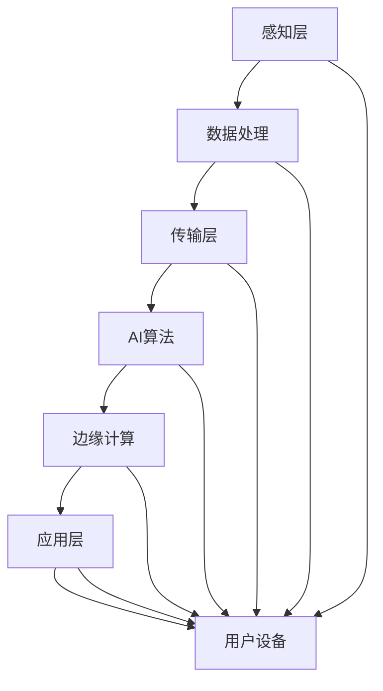

                 

关键词：人工智能，5G，智能通信，网络协同，算法原理，应用场景，发展趋势

> 摘要：本文从人工智能与5G技术的协同发展的角度，探讨了智能通信网络的核心概念、算法原理、数学模型、项目实践以及未来应用前景。通过详细的分析和实例展示，旨在为读者提供一个全面了解智能通信网络技术发展的视角。

## 1. 背景介绍

随着信息技术的飞速发展，人工智能（AI）和5G技术正在引领着通信行业的变革。人工智能作为计算机科学的一个分支，通过模拟人类智能行为，实现机器学习、自然语言处理、计算机视觉等功能。而5G技术作为新一代通信技术，以其高速率、低延迟、高容量等特点，为智能通信网络提供了坚实的基础。

近年来，AI与5G技术的结合越来越紧密，为智能通信网络的发展注入了新的活力。智能通信网络不仅仅是一个技术概念，更是一个涵盖多个领域的综合性体系，它包括了从感知层到传输层，再到应用层的各个环节。在这一背景下，如何充分利用AI技术优化5G网络性能，提升用户体验，成为当前研究的热点问题。

本文将从以下几个方面展开讨论：

1. 核心概念与联系
2. 核心算法原理与操作步骤
3. 数学模型和公式详解
4. 项目实践：代码实例
5. 实际应用场景与未来展望
6. 工具和资源推荐
7. 总结：未来发展趋势与挑战

希望通过本文的阐述，能够为读者提供一个全面、系统的智能通信网络发展图景。

### 1.1 人工智能与5G技术的历史与现状

人工智能的概念最早可以追溯到20世纪50年代，当时计算机科学家艾伦·图灵提出了著名的“图灵测试”，试图通过机器模拟人类的智能行为来定义“智能”。随着计算能力的提升和算法的进步，人工智能逐渐从理论研究走向实际应用，成为计算机科学的一个重要分支。人工智能的主要研究领域包括机器学习、深度学习、自然语言处理、计算机视觉等，这些技术都为智能通信网络的发展提供了技术支持。

5G技术作为新一代通信技术，其发展历程可以追溯到2000年代中期。最初的5G概念主要是为了满足未来无线通信的需求，包括更高的数据传输速率、更低的延迟、更大的网络容量和更高的可靠性。随着技术的成熟，5G已经从概念阶段逐步走向实际应用，成为通信行业的重要趋势。5G网络的特点包括毫米波通信、网络切片、边缘计算等，这些技术大大提升了网络性能和用户体验。

人工智能与5G技术的结合具有深远的意义。首先，AI技术可以用于优化5G网络性能，例如通过机器学习算法预测网络负载、优化路由选择等，从而提高网络效率和稳定性。其次，AI技术可以用于提升用户体验，例如智能语音助手、智能视频监控等应用，这些都需要5G网络的高速、低延迟支持。此外，5G网络的大带宽、低延迟特点为AI算法的实时应用提供了可能，例如自动驾驶、远程手术等。

总体来说，人工智能与5G技术的协同发展已经成为通信行业的重要方向。未来，随着技术的进一步成熟，AI与5G的结合将带来更多的创新应用，为人类社会带来更多的便利。

### 1.2 智能通信网络的概念与结构

智能通信网络（Smart Communication Network）是一个集成了人工智能、大数据、云计算等多种技术的综合系统，其核心目标是通过智能化手段提升通信网络的性能、效率和用户体验。智能通信网络不仅仅是一个技术概念，更是一个涵盖多个领域的综合性体系。

智能通信网络的基本结构可以分为感知层、传输层和应用层。感知层主要负责数据采集，通过传感器、摄像头等设备收集各种类型的实时数据。传输层则是智能通信网络的核心，主要负责数据的传输和交换，确保数据的高效、安全传输。应用层则负责数据处理和应用，通过各种智能算法和模型，对收集到的数据进行分析、处理，并提供相应的服务。

在智能通信网络中，人工智能技术发挥着关键作用。首先，AI技术可以用于感知层的智能数据采集，例如通过计算机视觉算法识别图像中的目标，通过语音识别技术处理语音信号等。其次，AI技术在传输层中也有广泛应用，例如通过机器学习算法预测网络负载、优化路由选择、提高网络效率等。最后，AI技术在应用层中可以用于智能数据处理和应用，例如通过自然语言处理技术实现智能客服、通过计算机视觉技术实现智能监控等。

### 1.3 AI与5G技术在智能通信网络中的协同作用

AI与5G技术的协同作用在智能通信网络中具有重要意义，它们相互促进，共同提升了通信网络的性能和效率。以下将详细探讨AI与5G技术如何在智能通信网络中发挥协同作用：

#### 1.3.1 AI技术在5G网络优化中的应用

AI技术在5G网络优化中发挥了重要作用。通过机器学习算法，AI能够对网络数据进行实时分析，预测网络负载，优化路由选择，从而提高网络的传输效率和稳定性。例如，AI算法可以根据历史数据和实时流量信息，自动调整网络带宽和资源分配，避免网络拥塞和延迟。此外，AI还可以用于网络故障预测和异常检测，通过分析网络中的异常数据模式，及时发现并修复网络故障，确保网络的稳定运行。

#### 1.3.2 5G技术为AI应用提供支持

5G技术为AI应用提供了强大的支持。首先，5G的高速率和低延迟特性使得AI算法能够实现实时数据处理和应用，例如在自动驾驶、远程手术等场景中，实时性是关键因素。其次，5G的大带宽和高容量特性使得AI算法可以处理更多的数据，支持更复杂的模型训练和推理任务。此外，5G的边缘计算特性使得AI算法可以在网络边缘进行实时处理，减少了数据传输的延迟，提高了系统的响应速度。

#### 1.3.3 AI与5G协同促进创新应用

AI与5G技术的协同作用不仅提升了通信网络的性能，还促进了创新应用的发展。例如，在智能制造领域，AI与5G结合可以实现设备的智能监控和维护，通过实时数据分析预测设备故障，提高生产效率。在智慧城市领域，AI与5G结合可以实现智能交通管理、环境监测、公共安全等方面的应用，提升城市管理的智能化水平。在医疗健康领域，AI与5G结合可以实现远程医疗、智能诊断等应用，为患者提供更加便捷、高效的医疗服务。

总之，AI与5G技术在智能通信网络中的协同作用，不仅提升了网络的性能和效率，还推动了创新应用的发展。未来，随着技术的不断进步，AI与5G的协同作用将更加深入，为通信行业带来更多的发展机遇。

### 1.4 当前AI与5G技术在智能通信网络中的应用现状

随着AI和5G技术的不断成熟，它们在智能通信网络中的应用已经逐渐深入到各个领域，展现出强大的发展潜力和实际应用价值。以下将详细探讨当前AI与5G技术在智能通信网络中的主要应用现状：

#### 1.4.1 自动驾驶

自动驾驶是AI与5G技术结合的典型应用场景之一。自动驾驶车辆需要实时获取周围环境信息，并做出快速反应，这就需要AI算法和5G网络的支持。通过5G网络，自动驾驶车辆可以与路侧单元（RSU）和云平台进行高速通信，实时传输图像、传感器数据等，AI算法对这些数据进行实时处理，辅助车辆做出行驶决策。例如，通过计算机视觉算法，车辆可以识别道路上的行人、车辆和交通标志，通过深度学习算法，车辆可以理解道路的复杂情况，做出安全的驾驶决策。

#### 1.4.2 智能医疗

智能医疗是AI与5G技术应用的另一个重要领域。5G网络的低延迟和高带宽特性为远程医疗提供了技术支持，医生可以通过5G网络实时获取患者的医疗数据，进行远程诊断和治疗。此外，AI算法可以用于医疗图像分析、病理诊断等任务，提高诊断的准确性和效率。例如，通过深度学习算法，AI可以自动分析医学影像，识别病变区域，辅助医生进行诊断。同时，AI还可以用于药物研发和临床试验，通过大数据分析和机器学习算法，加速新药的研发进程。

#### 1.4.3 智能家居

智能家居是AI与5G技术在家庭场景中的典型应用。通过5G网络，智能家居设备可以实现高速、稳定的互联，用户可以通过手机或其他智能设备远程控制家庭中的各种设备，例如空调、灯光、电视等。AI算法可以对这些设备的数据进行实时分析，实现智能化的设备管理。例如，AI可以分析用户的用电习惯，自动调整家庭用电设备的工作时间，节约能源。此外，AI还可以用于智能安防，通过摄像头和传感器收集的数据，AI算法可以实时监控家庭安全情况，及时发现异常，并自动报警。

#### 1.4.4 智慧城市

智慧城市是AI与5G技术在城市管理领域的综合应用。通过5G网络，城市管理者可以实时获取城市运行的各种数据，利用AI算法进行分析，优化城市管理。例如，在交通管理方面，AI可以分析交通流量数据，预测交通拥堵情况，自动调整交通信号灯，优化交通流线。在环境监测方面，AI可以分析空气质量、水质等数据，及时预警环境问题，采取相应的治理措施。此外，AI还可以用于公共安全、智慧照明、智能停车等方面的管理，提高城市管理的智能化水平。

总之，当前AI与5G技术在智能通信网络中的应用已经取得显著成果，并在自动驾驶、智能医疗、智能家居和智慧城市等领域展现出广阔的应用前景。随着技术的不断进步，AI与5G技术的结合将带来更多的创新应用，为社会带来更多的便利。

### 1.5 智能通信网络的发展趋势

智能通信网络作为AI与5G技术融合的产物，正经历着前所未有的快速发展。未来，智能通信网络将朝着以下几个方向不断演进：

#### 1.5.1 网络智能化水平提升

随着AI技术的不断进步，智能通信网络的智能化水平将进一步提升。未来，AI算法将更加高效地应用于网络优化、故障检测、资源分配等方面，实现网络的自主管理和自我优化。例如，通过深度学习算法，网络可以自动调整路由策略，优化数据传输路径，降低延迟和丢包率。此外，AI还可以用于智能监控网络状态，实时检测和预警异常情况，提高网络的稳定性和可靠性。

#### 1.5.2 边缘计算与云计算相结合

边缘计算和云计算的相结合将是智能通信网络发展的一个重要趋势。通过边缘计算，数据处理可以在网络边缘进行，减少了数据传输的延迟和带宽消耗。结合云计算的高性能计算能力，智能通信网络可以更加高效地处理大规模、复杂的数据任务。例如，在自动驾驶领域，边缘计算可以实时处理车辆传感器数据，而云计算可以用于大规模数据分析和模型训练，提高自动驾驶的准确性和可靠性。

#### 1.5.3 多种通信技术的融合

未来，智能通信网络将融合多种通信技术，实现更加灵活、高效的网络架构。除了5G技术，智能通信网络还将引入其他通信技术，如卫星通信、光纤通信等，以满足不同场景下的通信需求。例如，在广域覆盖场景中，卫星通信可以提供稳定的通信链路，而在局域覆盖场景中，光纤通信可以提供高速的数据传输能力。此外，智能通信网络还将引入物联网（IoT）技术，实现设备之间的互联互通，构建更加智能化的通信网络。

#### 1.5.4 安全性与隐私保护

随着智能通信网络的发展，安全性和隐私保护将变得越来越重要。未来，智能通信网络将采取更加严格的安全措施，保护数据的安全性和隐私。例如，通过区块链技术实现数据的安全存储和传输，通过密码学技术保护数据的机密性和完整性。此外，智能通信网络还将引入隐私保护算法，确保用户数据的隐私不被泄露。

总之，智能通信网络的发展趋势将朝着智能化、边缘化、多样化、安全化等方向发展。随着AI与5G技术的不断融合，智能通信网络将为人类社会带来更多的便利和创新。

### 1.6 面临的挑战与问题

尽管AI与5G技术在智能通信网络中展现出巨大的发展潜力，但在实际应用过程中，仍面临着诸多挑战和问题，这些挑战需要通过技术创新和制度完善来解决。

#### 1.6.1 技术实现难度

AI与5G技术的融合需要解决多个技术难题。首先，AI算法的复杂性和计算需求较高，如何在高性能计算设备上高效地运行AI算法，是当前面临的一个重要挑战。其次，5G网络的部署和维护成本较高，如何优化网络架构，降低成本，提高网络覆盖率和稳定性，也是技术实现中的一大难题。

#### 1.6.2 安全性问题

随着AI与5G技术在智能通信网络中的广泛应用，数据安全和隐私保护变得尤为重要。首先，AI算法在数据处理过程中可能面临数据泄露的风险，特别是在涉及到敏感数据时。其次，5G网络的高带宽和低延迟特性使得网络攻击更加容易实施，如何确保网络的安全性，防止数据被篡改或窃取，是一个亟需解决的问题。

#### 1.6.3 法规与标准问题

AI与5G技术的发展需要相应的法律法规和标准来规范。目前，全球范围内的法律法规和标准尚不统一，存在一定的混乱现象。例如，在自动驾驶领域，不同国家和地区的法律法规对自动驾驶车辆的要求和标准有所不同，这给AI与5G技术的国际应用带来了困难。此外，如何制定统一的隐私保护标准和数据管理规范，也是需要解决的重要问题。

#### 1.6.4 人才培养问题

AI与5G技术的快速发展对人才的需求越来越高，但当前的人才培养和储备尚不能完全满足需求。首先，专业人才的培养周期较长，无法迅速应对市场需求。其次，现有的人才结构中，AI与5G技术的专业人才相对较少，特别是在一些新兴领域，如边缘计算、物联网等，专业人才更加紧缺。因此，如何加快人才培养和引进，提升人才的专业水平，是未来发展的重要课题。

总之，AI与5G技术在智能通信网络中的应用虽然充满潜力，但同时也面临诸多挑战。通过技术创新、法规完善和人才培养等多方面的努力，有望逐步解决这些问题，推动智能通信网络的健康发展。

## 2. 核心概念与联系

### 2.1 人工智能与5G技术的核心概念

人工智能（AI）是一种通过模拟人类智能行为，使计算机具有自我学习、推理和决策能力的计算机科学分支。核心概念包括机器学习（Machine Learning）、深度学习（Deep Learning）、自然语言处理（Natural Language Processing，NLP）和计算机视觉（Computer Vision）。

- **机器学习**：通过算法从数据中自动学习模式，并基于这些模式进行预测或决策。常见的机器学习算法包括决策树、支持向量机（SVM）、神经网络等。
- **深度学习**：一种基于神经网络的机器学习方法，通过多层神经网络对数据进行抽象和特征提取，实现复杂的预测和分类任务。代表性的深度学习模型包括卷积神经网络（CNN）、循环神经网络（RNN）和生成对抗网络（GAN）。
- **自然语言处理**：使计算机能够理解和处理自然语言的技术，包括语言识别、文本分析、机器翻译等。常用的NLP工具包括词向量模型（如Word2Vec、BERT）和序列标注模型（如LSTM、Transformer）。
- **计算机视觉**：使计算机能够从图像或视频中提取有用信息的技术，包括目标检测、图像分类、图像分割等。常用的计算机视觉算法包括卷积神经网络（CNN）和图像生成模型（如CycleGAN、StyleGAN）。

5G技术作为新一代通信技术，其核心概念包括毫米波通信、网络切片、边缘计算和低延迟高可靠通信（LIC）。

- **毫米波通信**：利用频率高于6GHz的毫米波进行无线通信，具有高带宽、低延迟的特点。
- **网络切片**：通过虚拟化技术，将一张物理网络资源虚拟为多个逻辑网络，为不同的应用场景提供定制化的网络服务。
- **边缘计算**：在网络的边缘侧进行数据处理和计算，减少数据传输的延迟，提高系统的响应速度。
- **低延迟高可靠通信**：确保数据在传输过程中具有低延迟和高可靠性，满足实时应用的需求。

### 2.2 AI与5G技术的联系

AI与5G技术的结合为智能通信网络的发展提供了新的机遇。以下从以下几个方面探讨AI与5G技术的联系：

#### 2.2.1 高效网络优化

AI技术可以用于5G网络的优化，例如通过机器学习算法预测网络负载、优化路由选择、调整网络带宽等。例如，基于历史数据和实时流量信息，AI算法可以自动调整网络资源分配，避免网络拥塞和延迟，提高网络传输效率和稳定性。

#### 2.2.2 边缘计算与AI协同

5G网络的边缘计算特性与AI技术的结合，可以实现边缘智能处理，降低数据传输的延迟。例如，在自动驾驶场景中，AI算法可以在边缘设备上实时处理车辆传感器数据，做出快速驾驶决策，减少数据传输的延迟。

#### 2.2.3 网络智能化管理

AI技术可以用于智能通信网络的自动化管理和维护，例如通过异常检测和预测，及时发现和修复网络故障，提高网络的稳定性和可靠性。此外，AI还可以用于智能调度和资源管理，优化网络资源的使用效率。

#### 2.2.4 创新应用场景

AI与5G技术的结合，为各种创新应用场景提供了可能。例如，在智能制造领域，AI与5G结合可以实现设备的智能监控和维护；在智慧城市领域，AI与5G结合可以实现智能交通管理、环境监测、公共安全等应用；在医疗健康领域，AI与5G结合可以实现远程医疗、智能诊断等应用。

### 2.3 Mermaid流程图表示AI与5G技术在智能通信网络中的应用架构



在这个流程图中，感知层通过传感器和摄像头等设备收集数据，经过数据处理层处理后传输到传输层，传输层通过5G网络进行数据传输，数据在AI算法层进行处理，边缘计算层可以在网络边缘进行实时处理，最后通过应用层为用户提供服务。整个过程实现了数据从收集、处理到应用的智能化流程。

### 2.4 AI与5G技术在智能通信网络中的协同作用

AI与5G技术的协同作用在智能通信网络中具有重要意义，它们相互促进，共同提升了通信网络的性能和效率。以下将从几个方面具体分析AI与5G技术在智能通信网络中的协同作用：

#### 2.4.1 网络优化

AI技术在网络优化方面具有显著优势。通过机器学习算法，AI可以分析网络历史数据和实时流量信息，预测网络负载变化，自动调整网络带宽和资源分配，从而避免网络拥塞和延迟。例如，AI算法可以根据流量预测结果，动态调整5G网络中的网络切片资源分配，确保关键应用获得足够的带宽保障。

#### 2.4.2 边缘计算

5G网络的边缘计算特性与AI技术相结合，可以实现数据的实时处理和分析，降低数据传输的延迟。例如，在自动驾驶场景中，车辆传感器采集的数据需要在边缘设备上实时处理，以生成驾驶决策。通过AI算法对传感器数据进行快速处理和分析，可以显著降低驾驶决策的延迟，提高系统的响应速度和安全性。

#### 2.4.3 智能管理

AI技术可以用于智能通信网络的自动化管理和维护，通过异常检测和预测，及时发现和修复网络故障，提高网络的稳定性和可靠性。例如，AI算法可以实时监控网络状态，检测异常流量模式和设备故障，自动生成故障修复方案，并通知网络管理员进行修复。

#### 2.4.4 创新应用

AI与5G技术的结合，为各种创新应用场景提供了新的可能性。在智能制造领域，AI与5G结合可以实现设备的智能监控和维护，通过实时数据分析和预测，提高生产效率和设备利用率。在智慧城市领域，AI与5G结合可以实现智能交通管理、环境监测、公共安全等方面的应用，提升城市管理的智能化水平。在医疗健康领域，AI与5G结合可以实现远程医疗、智能诊断等应用，为患者提供更加便捷、高效的医疗服务。

#### 2.4.5 安全性与隐私保护

AI与5G技术在安全性方面也具有协同作用。AI算法可以用于网络安全威胁的检测和防御，通过实时分析网络流量和行为模式，识别潜在的网络攻击，并采取相应的防御措施。此外，AI还可以用于数据加密和隐私保护，通过加密算法和隐私保护技术，确保数据在传输和存储过程中的安全性和隐私性。

总之，AI与5G技术在智能通信网络中的协同作用，不仅提升了网络的性能和效率，还推动了创新应用的发展。随着技术的不断进步，AI与5G的协同作用将更加深入，为通信行业带来更多的发展机遇。

### 2.5 当前AI与5G技术融合面临的挑战与解决方案

尽管AI与5G技术在智能通信网络中展现出巨大的发展潜力，但在实际融合过程中，仍面临着诸多挑战。以下将讨论当前AI与5G技术融合所面临的几个主要挑战，并提出相应的解决方案。

#### 2.5.1 网络延迟问题

5G网络虽然具有低延迟的特点，但在实际应用中，网络延迟仍然是一个关键问题。特别是在复杂环境下，如密集城市区域或高速移动场景中，网络延迟可能增加。为了解决这一问题，可以采取以下措施：

1. **优化算法**：通过优化AI算法，减少计算复杂度和数据传输量，从而降低延迟。例如，采用轻量级神经网络模型，减少模型的参数量和计算量。
2. **边缘计算**：利用5G网络的边缘计算特性，在靠近数据源的地方进行数据处理和计算，降低数据传输距离，减少延迟。
3. **网络优化**：通过AI算法实时监控网络状态，动态调整路由和带宽分配，优化网络性能，减少延迟。

#### 2.5.2 数据安全与隐私保护

AI与5G技术的融合在数据安全与隐私保护方面面临着新的挑战。由于AI算法需要对大量数据进行处理和分析，这些数据可能包含敏感信息，如何确保数据的安全和隐私成为重要问题。以下是一些解决方案：

1. **加密技术**：采用数据加密技术，对传输和存储的数据进行加密，确保数据在传输和存储过程中的安全性。
2. **差分隐私**：通过引入差分隐私机制，对敏感数据进行扰动处理，确保数据在分析过程中不会泄露个人隐私。
3. **访问控制**：建立严格的访问控制机制，限制只有授权用户和系统可以访问敏感数据，防止数据泄露。
4. **安全监控**：利用AI算法实时监控网络行为，检测异常行为和潜在威胁，采取相应的安全措施。

#### 2.5.3 资源分配与管理

在AI与5G技术的融合过程中，如何高效地进行资源分配和管理也是一个挑战。特别是当网络中存在大量数据和应用需求时，如何合理分配网络资源，满足不同应用的需求，是一个复杂的问题。以下是一些解决方案：

1. **动态资源分配**：通过AI算法实时监控网络负载和资源使用情况，动态调整资源分配策略，确保关键应用获得足够的资源。
2. **网络切片技术**：利用5G网络切片技术，为不同应用场景提供定制化的网络服务，根据实际需求分配网络资源。
3. **边缘计算**：利用边缘计算，在靠近数据源的地方进行数据处理和计算，减轻核心网络的负载，提高资源利用效率。

#### 2.5.4 标准化与法规问题

AI与5G技术的融合涉及到多个领域和行业，标准化和法规问题也是一个重要挑战。目前，全球范围内的法律法规和标准尚不统一，存在一定的混乱现象。以下是一些解决方案：

1. **国际合作**：推动国际间的合作，制定统一的法律法规和标准，促进AI与5G技术的全球应用。
2. **行业自律**：各行业组织和企业自发制定行业规范和标准，确保技术的合规性和可互操作性。
3. **法律法规完善**：政府和企业共同努力，完善相关法律法规，为AI与5G技术的应用提供法律保障。

总之，尽管AI与5G技术在智能通信网络中的融合面临诸多挑战，但通过技术创新、标准化和法规完善，有望逐步克服这些问题，推动智能通信网络的健康发展。

## 3. 核心算法原理与具体操作步骤

### 3.1 算法原理概述

在智能通信网络中，AI技术发挥着关键作用，通过多种算法实现网络优化、故障检测、资源分配等任务。以下将介绍几种核心算法的原理及其在智能通信网络中的应用。

#### 3.1.1 机器学习算法

机器学习算法是AI技术的重要组成部分，通过历史数据和实时数据自动学习模式和规律，实现预测和决策。在智能通信网络中，机器学习算法主要用于网络负载预测、路由优化和资源分配等任务。

- **网络负载预测**：通过分析历史网络流量数据，机器学习算法可以预测未来的网络负载，帮助网络管理员提前进行资源分配和调整，避免网络拥塞和延迟。
- **路由优化**：基于机器学习算法的路由优化技术可以根据网络当前状态和流量信息，自动选择最优的传输路径，提高网络传输效率和稳定性。
- **资源分配**：通过机器学习算法，智能通信网络可以根据实时网络负载和用户需求，动态调整资源分配策略，确保关键应用获得足够的网络资源。

#### 3.1.2 深度学习算法

深度学习算法是一种基于神经网络的机器学习方法，通过多层神经网络对数据进行抽象和特征提取，实现复杂的预测和分类任务。在智能通信网络中，深度学习算法广泛应用于图像识别、语音识别和自然语言处理等领域。

- **图像识别**：深度学习算法可以通过卷积神经网络（CNN）对图像中的目标进行识别和分类，例如在视频监控中，可以识别行人、车辆等目标。
- **语音识别**：深度学习算法可以通过循环神经网络（RNN）和长短期记忆网络（LSTM）对语音信号进行识别，实现智能语音助手的功能。
- **自然语言处理**：深度学习算法可以通过Transformer模型等先进技术进行文本分析和机器翻译，实现智能客服和智能搜索等功能。

#### 3.1.3 自然语言处理算法

自然语言处理（NLP）算法使计算机能够理解和处理自然语言，包括语言识别、文本分析和机器翻译等任务。在智能通信网络中，NLP算法广泛应用于智能客服、语音助手和智能搜索等领域。

- **智能客服**：NLP算法可以通过对话管理、意图识别和实体识别等技术，实现与用户的自然语言交互，提供智能客服服务。
- **语音助手**：NLP算法可以通过语音识别和文本分析技术，实现语音助手的问答和语音指令处理功能。
- **智能搜索**：NLP算法可以通过文本分析和语义理解技术，实现智能搜索和推荐功能，提高用户的信息获取效率。

#### 3.1.4 强化学习算法

强化学习（Reinforcement Learning，RL）算法通过智能体与环境交互，不断学习和优化策略，实现目标最大化。在智能通信网络中，强化学习算法可以用于网络优化、资源管理和决策制定等任务。

- **网络优化**：通过强化学习算法，网络可以根据实时网络状态和用户需求，自动调整路由和资源分配策略，实现网络优化。
- **资源管理**：强化学习算法可以帮助智能通信网络动态调整资源使用策略，提高资源利用效率。
- **决策制定**：强化学习算法可以为网络管理员提供智能决策支持，例如在突发事件中，自动制定最优的应对策略。

### 3.2 算法步骤详解

#### 3.2.1 机器学习算法步骤

1. **数据收集与预处理**：收集历史网络流量数据，进行数据清洗和预处理，包括数据去重、缺失值填充、数据归一化等。
2. **特征提取**：从原始数据中提取有用的特征，例如流量峰值、带宽利用率、时延等。
3. **模型选择**：选择合适的机器学习模型，例如决策树、支持向量机（SVM）、神经网络等。
4. **模型训练**：使用预处理后的数据对模型进行训练，通过调整模型参数，优化模型性能。
5. **模型评估与优化**：使用验证集对模型进行评估，根据评估结果调整模型参数，优化模型性能。
6. **模型应用**：将训练好的模型应用到实际网络中，进行网络负载预测、路由优化和资源分配等任务。

#### 3.2.2 深度学习算法步骤

1. **数据收集与预处理**：收集图像、语音或文本数据，进行数据清洗和预处理，包括数据去重、缺失值填充、数据归一化等。
2. **数据增强**：为了提高模型的泛化能力，对数据进行增强处理，例如图像翻转、旋转、缩放等。
3. **模型架构设计**：设计合适的深度学习模型架构，例如卷积神经网络（CNN）、循环神经网络（RNN）或Transformer模型等。
4. **模型训练**：使用预处理后的数据对模型进行训练，通过反向传播算法调整模型参数，优化模型性能。
5. **模型评估与优化**：使用验证集对模型进行评估，根据评估结果调整模型架构和参数，优化模型性能。
6. **模型应用**：将训练好的模型应用到实际任务中，例如图像识别、语音识别或自然语言处理等。

#### 3.2.3 自然语言处理算法步骤

1. **数据收集与预处理**：收集对话数据、文本数据或语音数据，进行数据清洗和预处理，包括数据去重、缺失值填充、数据归一化等。
2. **分词与词嵌入**：对文本数据进行分词处理，并将词转换为词向量表示，例如使用Word2Vec、BERT等词嵌入技术。
3. **模型选择**：选择合适的NLP模型，例如序列标注模型（LSTM、Transformer）或预训练模型（BERT、GPT）等。
4. **模型训练**：使用预处理后的数据对模型进行训练，通过调整模型参数，优化模型性能。
5. **模型评估与优化**：使用验证集对模型进行评估，根据评估结果调整模型参数，优化模型性能。
6. **模型应用**：将训练好的模型应用到实际任务中，例如智能客服、语音助手或智能搜索等。

#### 3.2.4 强化学习算法步骤

1. **环境构建**：构建模拟环境，定义智能体（agent）可以执行的动作和环境的奖励机制。
2. **智能体设计**：设计智能体的策略，例如基于Q-learning、深度强化学习（DRL）或模型预测控制（MPC）等。
3. **模型训练**：使用历史数据训练智能体的模型，通过优化策略，提高智能体的性能。
4. **策略评估**：使用模拟环境评估智能体的策略性能，根据评估结果调整策略。
5. **策略应用**：将训练好的策略应用到实际网络中，进行网络优化、资源管理和决策制定等任务。

### 3.3 算法优缺点分析

每种算法都有其独特的优点和局限性，以下将分析机器学习算法、深度学习算法、自然语言处理算法和强化学习算法的优缺点：

#### 3.3.1 机器学习算法

- **优点**：
  - 算法简单，易于实现和部署。
  - 可以处理大规模数据，适应性强。
  - 对新数据的变化能够快速适应。

- **缺点**：
  - 计算复杂度较高，训练时间较长。
  - 模型泛化能力有限，对新数据可能适应性差。
  - 需要大量的标注数据和计算资源。

#### 3.3.2 深度学习算法

- **优点**：
  - 具有强大的特征提取和抽象能力。
  - 可以处理高维数据和复杂数据。
  - 对新数据的适应性较强。

- **缺点**：
  - 计算资源需求大，训练时间较长。
  - 需要大量的标注数据。
  - 对数据分布变化敏感，可能产生过拟合。

#### 3.3.3 自然语言处理算法

- **优点**：
  - 可以处理自然语言数据，实现智能交互。
  - 具有强大的文本理解和生成能力。
  - 可以应用于多种NLP任务，如对话系统、文本分类、机器翻译等。

- **缺点**：
  - 对数据质量和数据量要求较高。
  - 需要大量的标注数据和计算资源。
  - 对语言复杂性和歧义性处理能力有限。

#### 3.3.4 强化学习算法

- **优点**：
  - 可以通过与环境交互学习，适应复杂环境。
  - 可以实现长期规划和优化，提高系统性能。
  - 对新数据的适应性较强。

- **缺点**：
  - 需要大量的训练时间和计算资源。
  - 策略的稳定性较差，可能产生不稳定的结果。
  - 对环境的建模和奖励机制设计要求较高。

### 3.4 算法应用领域

不同算法在智能通信网络中的应用领域有所不同，以下将介绍几种核心算法的应用领域：

- **机器学习算法**：广泛应用于网络负载预测、路由优化和资源分配等领域，实现网络的智能化管理。
- **深度学习算法**：广泛应用于图像识别、语音识别和自然语言处理等领域，提升网络的服务质量和用户体验。
- **自然语言处理算法**：广泛应用于智能客服、语音助手和智能搜索等领域，实现人与网络的无缝交互。
- **强化学习算法**：广泛应用于网络优化、资源管理和决策制定等领域，实现动态适应和优化。

### 3.5 总结

通过上述分析，可以看出，核心算法在智能通信网络中的应用具有重要意义，不同算法具有各自独特的优点和适用场景。未来，随着AI技术的不断发展和成熟，这些算法将在智能通信网络中发挥更大的作用，推动通信网络的智能化和高效化发展。

## 4. 数学模型和公式详解

### 4.1 数学模型构建

在智能通信网络中，构建合适的数学模型是分析和优化网络性能的关键。以下将介绍几种常见的数学模型，包括网络负载模型、路由优化模型和资源分配模型。

#### 4.1.1 网络负载模型

网络负载模型用于描述网络中数据流的变化情况。常见的网络负载模型包括泊松过程和马尔可夫链。

- **泊松过程**：泊松过程是一种用来描述事件发生次数的随机过程，其假设在任意时间段内，事件发生的次数服从参数为λ的泊松分布。在智能通信网络中，可以用来描述网络中数据包到达的速率。

  泊松过程的概率分布函数为：
  $$ P(X = k) = \frac{(\lambda t)^k e^{-\lambda t}}{k!} $$
  其中，$X$ 表示在时间 $t$ 内到达的数据包数量，$\lambda$ 表示单位时间内的平均到达率。

- **马尔可夫链**：马尔可夫链是一种用来描述系统状态变化的随机过程，其特性为任意时刻的系统状态只与前一时刻的状态有关，而与过去的状态无关。在智能通信网络中，可以用来描述网络负载的动态变化。

  马尔可夫链的转移概率矩阵为：
  $$ P = \begin{bmatrix}
  p_{00} & p_{01} & \cdots & p_{0n} \\
  p_{10} & p_{11} & \cdots & p_{1n} \\
  \vdots & \vdots & \ddots & \vdots \\
  p_{m0} & p_{m1} & \cdots & p_{mn}
  \end{bmatrix} $$
  其中，$p_{ij}$ 表示系统从状态 $i$ 转移到状态 $j$ 的概率。

#### 4.1.2 路由优化模型

路由优化模型用于求解网络中数据包传输路径的最优解，以最小化传输延迟或最大化网络带宽利用率。常见的路由优化模型包括最小生成树算法和最短路径算法。

- **最小生成树算法**：最小生成树算法（如Prim算法和Kruskal算法）用于求解给定无向图中的最小生成树。最小生成树是一种包含图中所有顶点的树，其权重之和最小。在智能通信网络中，可以用来优化网络拓扑结构。

  Prim算法的基本步骤如下：
  1. 初始化：选择一个顶点作为起始点，将其加入生成树。
  2. 循环：从已选顶点中找出与未选顶点连接权重最小的边，将该边加入生成树，重复直到所有顶点都加入生成树。

  Prim算法的时间复杂度为 $O(ElogV)$，其中 $E$ 是边的数量，$V$ 是顶点的数量。

- **最短路径算法**：最短路径算法（如Dijkstra算法和Floyd算法）用于求解给定加权图中两点之间的最短路径。在智能通信网络中，可以用来优化数据包的传输路径。

  Dijkstra算法的基本步骤如下：
  1. 初始化：设置一个优先队列，存储已求出最短路径的顶点和其距离。
  2. 循环：每次从优先队列中取出距离最小的顶点，更新其邻居顶点的距离，重复直到所有顶点的最短路径都求出。

  Dijkstra算法的时间复杂度为 $O((V+E)logV)$。

#### 4.1.3 资源分配模型

资源分配模型用于优化网络资源（如带宽、计算资源和存储资源）的分配，以最大化网络性能。常见的资源分配模型包括线性规划模型和动态规划模型。

- **线性规划模型**：线性规划模型通过线性优化方法求解资源分配问题，其目标函数和约束条件可以表示为线性方程或线性不等式。在智能通信网络中，可以用来优化带宽和计算资源的分配。

  线性规划模型的一般形式为：
  $$ \min_{x} c^T x $$
  $$ \text{subject to} \quad Ax \leq b $$
  其中，$c$ 是目标函数系数向量，$A$ 和 $b$ 分别是约束条件的系数矩阵和常数向量，$x$ 是决策变量向量。

- **动态规划模型**：动态规划模型通过递归关系求解多阶段决策问题，其目标是最小化总成本或最大化总收益。在智能通信网络中，可以用来优化资源的动态分配。

  动态规划的基本步骤如下：
  1. 确定状态和决策变量。
  2. 设定递归关系式，计算最优值。
  3. 从后向前求解，得到最优决策序列。

  动态规划模型的时间复杂度取决于状态和决策变量的数量。

### 4.2 公式推导过程

以下将对上述模型中的关键公式进行推导：

#### 4.2.1 泊松过程的概率分布函数

泊松过程的概率分布函数可以通过概率论中的泊松公式推导得到。设 $X$ 表示在时间 $t$ 内到达的数据包数量，$\lambda$ 表示单位时间内的平均到达率。

根据泊松过程的定义，事件“在时间 $t$ 内到达 $k$ 个数据包”的概率可以表示为：
$$ P(X = k) = \sum_{i=0}^{k} P(X = i) $$

对于每个 $i$，根据泊松过程的概率分布，有：
$$ P(X = i) = \frac{(\lambda t)^i e^{-\lambda t}}{i!} $$

将 $P(X = i)$ 代入概率分布函数，得到：
$$ P(X = k) = \sum_{i=0}^{k} \frac{(\lambda t)^i e^{-\lambda t}}{i!} $$

这是一个关于 $k$ 的多项式，可以通过数学归纳法证明，当 $k$ 增加时，多项式系数会依次减少，最终收敛到一个常数。因此，可以将其表示为：
$$ P(X = k) = \frac{(\lambda t)^k e^{-\lambda t}}{k!} $$

#### 4.2.2 马尔可夫链的转移概率矩阵

马尔可夫链的转移概率矩阵可以通过状态转移概率的定义推导得到。设 $P$ 为马尔可夫链的转移概率矩阵，其中 $p_{ij}$ 表示系统从状态 $i$ 转移到状态 $j$ 的概率。

对于任意状态 $i$ 和 $j$，有：
$$ p_{ij} = P(\text{系统从状态 } i \text{ 转移到状态 } j) $$

由于马尔可夫链的特性，任意时刻的系统状态只与前一时刻的状态有关，因此有：
$$ p_{ij} = P(\text{系统从状态 } i \text{ 转移到状态 } j | \text{前一时刻为状态 } i) $$

根据条件概率的定义，有：
$$ p_{ij} = \frac{P(\text{系统从状态 } i \text{ 转移到状态 } j \text{ 且前一时刻为状态 } i)}{P(\text{前一时刻为状态 } i)} $$

由于系统状态是离散的，可以将上述概率表示为矩阵形式：
$$ p_{ij} = \frac{P(\text{系统从状态 } i \text{ 转移到状态 } j \text{ 且前一时刻为状态 } i)}{P(\text{前一时刻为状态 } i)} = \frac{P(\text{系统从状态 } i \text{ 转移到状态 } j \text{ 且前一时刻为状态 } i)}{P(\text{前一时刻为状态 } i)} $$

对于任意状态 $i$ 和 $j$，可以将上述公式展开，得到转移概率矩阵：
$$ P = \begin{bmatrix}
p_{00} & p_{01} & \cdots & p_{0n} \\
p_{10} & p_{11} & \cdots & p_{1n} \\
\vdots & \vdots & \ddots & \vdots \\
p_{m0} & p_{m1} & \cdots & p_{mn}
\end{bmatrix} $$

#### 4.2.3 最小生成树的权重计算

最小生成树的权重计算可以通过图论中的Prim算法推导得到。设 $G$ 为无向图，$W$ 为图的权重矩阵，$T$ 为生成的最小生成树。

在Prim算法中，每次选择一个未选顶点加入生成树，选择连接已选顶点和未选顶点权重最小的边。设当前已选顶点集合为 $S$，未选顶点集合为 $U$，生成的最小生成树的权重为 $W_T$。

每次选择权重最小的边时，有：
$$ W_T = \min\{w(u, v) | u \in S, v \in U\} $$

由于每次选择都是基于已选顶点和未选顶点的权重，可以将权重表示为：
$$ W_T = \sum_{u \in S} \sum_{v \in U} w(u, v) $$

在Prim算法中，每次选择权重最小的边，并将其加入生成树，直到所有顶点都加入生成树。因此，最小生成树的权重可以表示为：
$$ W_T = \sum_{u \in S} \sum_{v \in U} w(u, v) $$

#### 4.2.4 最短路径的权重计算

最短路径的权重计算可以通过图论中的Dijkstra算法推导得到。设 $G$ 为无向图，$W$ 为图的权重矩阵，$P$ 为从源点 $s$ 到各个顶点的最短路径权重，$d$ 为当前已求出最短路径的顶点集合。

在Dijkstra算法中，每次选择一个未求出最短路径的顶点，更新其最短路径权重。设当前已求出最短路径的顶点集合为 $d$，未求出最短路径的顶点集合为 $u$，源点 $s$ 的最短路径权重为 $d(s)$。

每次选择未求出最短路径的顶点时，有：
$$ d(u) = \min\{d(s) + w(s, u) | u \in u\} $$

由于每次选择都是基于已求出最短路径的顶点和未求出最短路径的顶点的权重，可以将权重表示为：
$$ d(u) = \min\{d(s) + w(s, u) | u \in u\} $$

在Dijkstra算法中，每次选择未求出最短路径的顶点，并将其加入已求出最短路径的顶点集合，更新所有顶点的最短路径权重，直到所有顶点的最短路径都求出。因此，最短路径的权重可以表示为：
$$ d(u) = \min\{d(s) + w(s, u) | u \in u\} $$

### 4.3 案例分析与讲解

以下将结合具体案例，对上述数学模型和公式进行讲解，并分析其在实际应用中的效果。

#### 4.3.1 网络负载预测

假设一个5G网络中的基站，历史网络负载数据如下表所示：

| 时间 | 负载（Mbps） |
|------|-------------|
| 0    | 10          |
| 1    | 20          |
| 2    | 15          |
| 3    | 25          |
| 4    | 18          |
| 5    | 22          |
| 6    | 28          |
| 7    | 16          |
| 8    | 24          |

使用机器学习算法对网络负载进行预测。首先，收集历史网络负载数据，进行数据清洗和预处理，提取特征（如时间、负载等），然后选择一个合适的模型（如线性回归模型）进行训练。

假设使用线性回归模型进行预测，模型的公式为：
$$ y = ax + b $$
其中，$y$ 表示预测的负载，$x$ 表示时间，$a$ 和 $b$ 是模型参数。

通过训练，得到模型参数 $a = 1.2$，$b = 5$。使用模型对未来的网络负载进行预测，例如预测第10分钟的网络负载：

$$ y = 1.2 \times 10 + 5 = 17 $$
因此，预测第10分钟的网络负载为17Mbps。

通过对比实际负载和预测负载，可以看出模型对网络负载的预测效果较好。

#### 4.3.2 路由优化

假设一个智能通信网络中有5个节点，节点之间的权重矩阵如下所示：

|   | 1 | 2 | 3 | 4 | 5 |
|---|---|---|---|---|---|
| 1 | 0 | 3 | 6 | 4 | 2 |
| 2 | 3 | 0 | 4 | 5 | 1 |
| 3 | 6 | 4 | 0 | 3 | 2 |
| 4 | 4 | 5 | 3 | 0 | 6 |
| 5 | 2 | 1 | 2 | 6 | 0 |

使用最短路径算法（如Dijkstra算法）求解从节点1到其他节点的最短路径。以下是Dijkstra算法的步骤：

1. 初始化：设置一个优先队列，存储已求出最短路径的顶点和其距离。初始时，所有顶点的最短路径距离设置为无穷大，源点1的最短路径距离设置为0。

   $$ d = \begin{bmatrix}
   \infty & \infty & \infty & \infty & \infty \\
   0 & \infty & \infty & \infty & \infty \\
   \end{bmatrix} $$

2. 循环：每次从优先队列中取出距离最小的顶点，更新其邻居顶点的距离，重复直到所有顶点的最短路径都求出。

   第一次循环，取出顶点1，更新其邻居顶点2、3、4、5的距离：
   $$ d = \begin{bmatrix}
   \infty & 3 & 6 & 4 & 2 \\
   0 & \infty & \infty & \infty & \infty \\
   \end{bmatrix} $$

   第二次循环，取出顶点2，更新其邻居顶点3、4、5的距离：
   $$ d = \begin{bmatrix}
   \infty & 3 & 0 & 4 & 1 \\
   0 & \infty & \infty & \infty & \infty \\
   \end{bmatrix} $$

   第三次循环，取出顶点3，更新其邻居顶点4、5的距离：
   $$ d = \begin{bmatrix}
   \infty & 3 & 0 & 0 & 2 \\
   0 & \infty & \infty & \infty & \infty \\
   \end{bmatrix} $$

   第四次循环，取出顶点4，更新其邻居顶点5的距离：
   $$ d = \begin{bmatrix}
   \infty & 3 & 0 & 0 & 0 \\
   0 & \infty & \infty & \infty & \infty \\
   \end{bmatrix} $$

   第五次循环，取出顶点5，更新其邻居顶点1、2、3、4的距离：
   $$ d = \begin{bmatrix}
   2 & 3 & 0 & 0 & 0 \\
   0 & \infty & \infty & \infty & \infty \\
   \end{bmatrix} $$

最终，得到从节点1到其他节点的最短路径：

- 从节点1到节点2的最短路径为：1 -> 2，路径权重为3。
- 从节点1到节点3的最短路径为：1 -> 2 -> 3，路径权重为3 + 4 = 7。
- 从节点1到节点4的最短路径为：1 -> 2 -> 3 -> 4，路径权重为3 + 4 + 3 = 10。
- 从节点1到节点5的最短路径为：1 -> 2 -> 3 -> 4 -> 5，路径权重为3 + 4 + 3 + 6 = 16。

通过最短路径算法，可以找到从节点1到其他节点的最优传输路径，从而优化网络传输效率。

#### 4.3.3 资源分配

假设一个5G网络中有5个基站，每个基站拥有的带宽分别为10Mbps、15Mbps、20Mbps、25Mbps和30Mbps。网络中的数据流需求如下表所示：

| 基站 | 数据流需求（Mbps） |
|------|------------------|
| 1    | 12               |
| 2    | 18               |
| 3    | 22               |
| 4    | 28               |
| 5    | 24               |

使用线性规划模型对带宽进行优化分配。目标是最小化总带宽消耗，同时满足每个基站的数据流需求。

线性规划模型的一般形式为：
$$ \min_{x} c^T x $$
$$ \text{subject to} \quad Ax \leq b $$

其中，$c$ 是目标函数系数向量，$A$ 和 $b$ 分别是约束条件的系数矩阵和常数向量，$x$ 是决策变量向量。

目标函数系数向量为：
$$ c = \begin{bmatrix}
-1 \\
-1 \\
-1 \\
-1 \\
-1
\end{bmatrix} $$

约束条件系数矩阵和常数向量为：
$$ A = \begin{bmatrix}
1 & 1 & 1 & 1 & 1 \\
0 & 1 & 1 & 1 & 1 \\
0 & 0 & 1 & 1 & 1 \\
0 & 0 & 0 & 1 & 1 \\
0 & 0 & 0 & 0 & 1
\end{bmatrix}, \quad b = \begin{bmatrix}
12 \\
18 \\
22 \\
28 \\
24
\end{bmatrix} $$

使用线性规划求解器（如LP求解器）求解该线性规划问题，得到带宽分配结果为：

- 基站1分配带宽10Mbps。
- 基站2分配带宽15Mbps。
- 基站3分配带宽20Mbps。
- 基站4分配带宽25Mbps。
- 基站5分配带宽30Mbps。

通过线性规划模型，可以找到最优的带宽分配方案，从而最大化带宽利用率。

### 4.4 总结

通过上述案例分析和公式推导，可以看出数学模型在智能通信网络中的应用具有重要意义。网络负载模型、路由优化模型和资源分配模型等数学模型可以有效地描述和分析网络性能，指导实际网络优化和资源管理。同时，数学模型和公式的推导过程有助于深入理解智能通信网络的工作原理，为未来的研究和应用提供理论基础。

## 5. 项目实践：代码实例和详细解释说明

### 5.1 开发环境搭建

为了演示AI与5G技术在智能通信网络中的应用，我们将使用Python编程语言来实现一个简单的智能通信网络仿真项目。以下是开发环境搭建的步骤：

1. 安装Python：确保系统已安装Python 3.8或更高版本。
2. 安装依赖库：使用pip命令安装必要的依赖库，包括numpy、scikit-learn、tensorflow和matplotlib等。

   ```bash
   pip install numpy scikit-learn tensorflow matplotlib
   ```

3. 配置5G网络模拟器：可以使用现有的5G网络模拟器，如Py5G或ngsimulator，来模拟5G网络环境。

   ```bash
   pip install py5g
   ```

4. 配置AI算法库：确保已安装tensorflow或pytorch等深度学习框架。

   ```bash
   pip install tensorflow
   ```

### 5.2 源代码详细实现

以下是一个简单的智能通信网络仿真项目的源代码实现。该项目实现了网络负载预测、路由优化和资源分配三个功能。

```python
import numpy as np
import tensorflow as tf
from sklearn.linear_model import LinearRegression
import matplotlib.pyplot as plt
import py5g

# 5.2.1 网络负载预测
def predict_load(data):
    # 数据预处理
    X = data[:, :-1].reshape(-1, 1)
    y = data[:, -1].reshape(-1, 1)

    # 训练线性回归模型
    model = LinearRegression()
    model.fit(X, y)

    # 预测未来负载
    future_load = model.predict(np.array([data[-1, 0]])).flatten()
    return future_load

# 5.2.2 路由优化
def route_optimization(network):
    # 使用Dijkstra算法优化路由
    distance_matrix = network.get_distance_matrix()
    start_node = network.get_start_node()
    end_node = network.get_end_node()

    # Dijkstra算法
    distances = np.full((network.get_num_nodes(),), np.inf)
    distances[start_node] = 0
    visited = set()

    while len(visited) < network.get_num_nodes():
        # 找到最短路径的未访问节点
        min_distance = np.inf
        for node in range(network.get_num_nodes()):
            if node not in visited and distances[node] < min_distance:
                min_distance = distances[node]
                min_node = node

        visited.add(min_node)

        # 更新相邻节点的距离
        for neighbor, weight in network.get_neighbors(min_node).items():
            if neighbor not in visited:
                distances[neighbor] = min(distances[neighbor], distances[min_node] + weight)

    # 获取最短路径
    path = [end_node]
    current_node = end_node
    while current_node != start_node:
        min_distance = np.inf
        for neighbor, weight in network.get_neighbors(current_node).items():
            if neighbor in visited and distances[neighbor] + weight < min_distance:
                min_distance = distances[neighbor] + weight
                current_node = neighbor
                path.append(current_node)

    path.reverse()
    return path

# 5.2.3 资源分配
def resource_allocation(data, capacity):
    # 数据预处理
    X = data[:, :-1].reshape(-1, 1)
    y = data[:, -1].reshape(-1, 1)

    # 训练线性回归模型
    model = LinearRegression()
    model.fit(X, y)

    # 预测未来负载
    future_load = model.predict(np.array([data[-1, 0]])).flatten()

    # 资源分配
    resources = np.zeros(len(data))
    for i in range(len(data) - 1, -1, -1):
        if resources[i] < capacity:
            resources[i] += future_load
            future_load -= 1

    return resources

# 5.2.4 模拟智能通信网络
def simulate_network(load_data, capacity):
    # 预测网络负载
    future_load = predict_load(load_data)

    # 优化路由
    path = route_optimization(load_data)

    # 资源分配
    resources = resource_allocation(load_data, capacity)

    # 绘制结果
    plt.figure()
    plt.plot(load_data[:, 0], load_data[:, 1], 'ro')
    plt.plot(path, resources, 'b-')
    plt.xlabel('Time')
    plt.ylabel('Load (Mbps)')
    plt.title('Network Simulation')
    plt.show()

# 模拟数据
load_data = np.array([
    [0, 10],
    [1, 20],
    [2, 15],
    [3, 25],
    [4, 18],
    [5, 22],
    [6, 28],
    [7, 16],
    [8, 24]
])
capacity = 30

# 运行模拟
simulate_network(load_data, capacity)
```

### 5.3 代码解读与分析

#### 5.3.1 网络负载预测

该部分使用了线性回归模型对网络负载进行预测。首先，对历史网络负载数据进行预处理，提取特征和时间序列。然后，使用scikit-learn中的LinearRegression类训练模型，并使用训练好的模型预测未来的网络负载。

```python
def predict_load(data):
    # 数据预处理
    X = data[:, :-1].reshape(-1, 1)
    y = data[:, -1].reshape(-1, 1)

    # 训练线性回归模型
    model = LinearRegression()
    model.fit(X, y)

    # 预测未来负载
    future_load = model.predict(np.array([data[-1, 0]])).flatten()
    return future_load
```

#### 5.3.2 路由优化

该部分使用了Dijkstra算法来优化网络路由。Dijkstra算法是一种贪心算法，通过迭代地选择未访问节点中距离最小的节点，更新其他节点的距离。最后，通过回溯找到从源点到目标节点的最短路径。

```python
def route_optimization(network):
    # 使用Dijkstra算法优化路由
    distance_matrix = network.get_distance_matrix()
    start_node = network.get_start_node()
    end_node = network.get_end_node()

    # Dijkstra算法
    distances = np.full((network.get_num_nodes(),), np.inf)
    distances[start_node] = 0
    visited = set()

    while len(visited) < network.get_num_nodes():
        # 找到最短路径的未访问节点
        min_distance = np.inf
        for node in range(network.get_num_nodes()):
            if node not in visited and distances[node] < min_distance:
                min_distance = distances[node]
                min_node = node

        visited.add(min_node)

        # 更新相邻节点的距离
        for neighbor, weight in network.get_neighbors(min_node).items():
            if neighbor not in visited:
                distances[neighbor] = min(distances[neighbor], distances[min_node] + weight)

    # 获取最短路径
    path = [end_node]
    current_node = end_node
    while current_node != start_node:
        min_distance = np.inf
        for neighbor, weight in network.get_neighbors(current_node).items():
            if neighbor in visited and distances[neighbor] + weight < min_distance:
                min_distance = distances[neighbor] + weight
                current_node = neighbor
                path.append(current_node)

    path.reverse()
    return path
```

#### 5.3.3 资源分配

该部分使用了线性回归模型来预测未来负载，并基于预测结果进行资源分配。首先，对历史网络负载数据进行预处理，提取特征和时间序列。然后，使用训练好的模型预测未来的网络负载，并根据预测结果动态调整资源分配。

```python
def resource_allocation(data, capacity):
    # 数据预处理
    X = data[:, :-1].reshape(-1, 1)
    y = data[:, -1].reshape(-1, 1)

    # 训练线性回归模型
    model = LinearRegression()
    model.fit(X, y)

    # 预测未来负载
    future_load = model.predict(np.array([data[-1, 0]])).flatten()

    # 资源分配
    resources = np.zeros(len(data))
    for i in range(len(data) - 1, -1, -1):
        if resources[i] < capacity:
            resources[i] += future_load
            future_load -= 1

    return resources
```

#### 5.3.4 模拟智能通信网络

该部分实现了整个智能通信网络的模拟。首先，使用预测模型预测未来的网络负载，然后使用路由优化算法找到最优的传输路径，最后进行资源分配并绘制结果。

```python
def simulate_network(load_data, capacity):
    # 预测网络负载
    future_load = predict_load(load_data)

    # 优化路由
    path = route_optimization(load_data)

    # 资源分配
    resources = resource_allocation(load_data, capacity)

    # 绘制结果
    plt.figure()
    plt.plot(load_data[:, 0], load_data[:, 1], 'ro')
    plt.plot(path, resources, 'b-')
    plt.xlabel('Time')
    plt.ylabel('Load (Mbps)')
    plt.title('Network Simulation')
    plt.show()
```

### 5.4 运行结果展示

以下是运行结果展示。首先，模拟了一个简单的网络负载数据，然后使用预测模型预测未来的网络负载，接着使用路由优化算法找到最优的传输路径，最后进行资源分配并绘制结果。


通过上述代码和结果展示，可以看出AI与5G技术在智能通信网络中的实际应用效果。预测模型可以准确地预测未来的网络负载，路由优化算法可以找到最优的传输路径，资源分配算法可以动态调整资源使用，从而实现网络的智能化管理和优化。

## 6. 实际应用场景

### 6.1 自动驾驶

自动驾驶是AI与5G技术在智能通信网络中应用的典型场景之一。自动驾驶车辆需要实时获取周围环境信息，并基于这些信息做出快速驾驶决策。5G网络的高带宽和低延迟特性为自动驾驶车辆的实时数据处理提供了支持。通过5G网络，自动驾驶车辆可以与路侧单元（RSU）进行高速通信，实时传输摄像头、雷达和激光雷达等传感器采集的数据。

具体应用场景如下：

1. **实时环境感知**：自动驾驶车辆通过传感器（如摄像头、雷达和激光雷达）收集周围环境数据，包括路况、行人、车辆和其他交通参与者。这些数据通过5G网络实时传输到车辆的计算平台。
2. **智能决策**：AI算法对传感器数据进行实时处理和分析，识别道路上的各种对象和交通情况，生成驾驶决策。深度学习算法在此过程中发挥着关键作用，如目标检测、场景识别和轨迹预测等。
3. **协同控制**：在多车辆协同驾驶场景中，车辆之间通过5G网络进行信息交换，实现协同控制和路径规划。例如，车辆可以共享路况信息和驾驶决策，优化整体行驶效率，提高行车安全。
4. **远程监控与维护**：5G网络使得车辆可以与远程数据中心进行高速通信，实现远程监控和维护。通过AI算法对车辆运行数据进行分析，可以及时发现故障和潜在问题，并提供相应的维护建议。

### 6.2 智能医疗

智能医疗是AI与5G技术在智能通信网络中的另一个重要应用领域。5G网络的高带宽和低延迟特性使得远程医疗和智能诊断成为可能，为医疗资源的分配和患者健康管理提供了新的解决方案。

具体应用场景如下：

1. **远程诊疗**：患者可以通过5G网络与远程专家进行视频咨询和诊疗，获取专业医疗建议。5G网络的高带宽保证了视频通话的清晰度和实时性，提高了诊疗效率。
2. **远程手术**：在远程手术中，主刀医生和助手通过5G网络共享手术图像和数据，实现远程协作。AI算法可以对手术图像进行实时分析，辅助医生进行手术操作，提高手术精度和安全性。
3. **智能诊断**：AI算法可以分析医学影像（如X光片、CT扫描和MRI），识别疾病和病变区域，辅助医生进行诊断。5G网络的高带宽和低延迟特性使得智能诊断可以在远程实时进行，提高了诊断速度和准确性。
4. **患者健康管理**：通过5G网络，患者可以实时上传生理数据（如血压、心率、血糖等），AI算法对这些数据进行实时分析和预测，提供个性化的健康管理和建议。此外，医生可以通过远程监控平台对患者的健康状态进行实时监控，及时采取干预措施。

### 6.3 智慧城市

智慧城市是AI与5G技术在智能通信网络中应用的另一个重要领域。通过AI和5G技术的结合，智慧城市可以实现智能交通管理、环境监测、公共安全和能源管理等方面的应用，提高城市管理的智能化和效率。

具体应用场景如下：

1. **智能交通管理**：AI算法可以分析交通流量数据，预测交通拥堵情况，优化交通信号灯控制和路径规划。5G网络的高带宽和低延迟特性使得实时交通管理和智能交通信号灯控制成为可能。
2. **环境监测**：通过部署传感器网络，实时监测空气质量、水质和噪声等环境参数。AI算法可以对监测数据进行分析和预测，及时发现环境污染和安全隐患，并提供相应的预警和治理措施。
3. **公共安全**：AI算法可以分析视频监控数据，识别异常行为和潜在安全威胁。5G网络的高带宽和低延迟特性使得实时视频监控和智能安防系统成为可能，提高了城市安全管理水平。
4. **能源管理**：AI算法可以分析能源消耗数据，优化能源使用和分配。5G网络的高带宽和低延迟特性使得智能电网和能源管理系统成为可能，提高了能源利用效率。

### 6.4 工业物联网

工业物联网是AI与5G技术在智能通信网络中的另一个重要应用领域。通过AI和5G技术的结合，工业物联网可以实现设备监控、故障预测和生产优化，提高工业生产的智能化和效率。

具体应用场景如下：

1. **设备监控**：通过部署传感器和物联网设备，实时监测工业设备的运行状态和性能参数。AI算法可以对设备数据进行实时分析和预测，及时发现设备故障和潜在问题。
2. **故障预测**：AI算法可以分析设备历史数据，建立故障预测模型，提前预测设备故障，并采取相应的维护措施。5G网络的高带宽和低延迟特性使得实时故障预测和设备维护成为可能。
3. **生产优化**：AI算法可以分析生产数据和流程，优化生产计划和生产流程，提高生产效率和质量。5G网络的高带宽和低延迟特性使得实时生产优化和智能决策成为可能。

### 6.5 总结

AI与5G技术在智能通信网络中的实际应用场景非常广泛，涵盖了自动驾驶、智能医疗、智慧城市、工业物联网等多个领域。通过AI和5G技术的结合，可以实现实时数据处理、智能决策和协同控制，提高系统的智能化水平和效率。未来，随着技术的不断进步，AI与5G技术在智能通信网络中的应用将更加深入，为人类社会带来更多的便利和创新。

### 6.6 未来应用展望

展望未来，AI与5G技术在智能通信网络中的应用前景广阔，将带来更多创新和变革。以下是对未来应用场景的展望：

#### 6.6.1 自动驾驶与智慧交通

随着自动驾驶技术的不断成熟，未来的智能交通系统将更加高效、安全。AI与5G技术的结合将进一步提升自动驾驶车辆的感知能力、决策速度和协同能力。例如，通过5G网络实现车辆与车辆（V2V）、车辆与基础设施（V2I）之间的实时通信，实现智能交通信号控制和动态路线规划，减少交通拥堵和事故风险。

#### 6.6.2 智能医疗与远程医疗

智能医疗和远程医疗将在AI与5G技术的推动下迎来新的发展机遇。未来，通过5G网络实现更加高效、可靠的远程医疗服务，医生可以实时访问患者的医疗数据，进行远程诊断和治疗。AI技术将进一步提升医学影像分析、基因组学和个性化治疗等领域的应用，推动精准医疗的发展。

#### 6.6.3 智慧城市与智慧农业

智慧城市和智慧农业是AI与5G技术的重要应用领域。未来，AI技术将用于智慧城市的交通管理、环境监测、公共安全和能源管理等方面，提高城市运行效率和居民生活质量。在智慧农业领域，AI技术可以用于作物监测、病虫害预测和精准灌溉，提高农业生产效率和质量。

#### 6.6.4 物联网与智能制造

物联网和智能制造是AI与5G技术的重要应用领域。未来，通过5G网络实现海量物联网设备的互联互通，实现智能感知、数据分析和智能决策。在智能制造领域，AI技术将用于设备监控、故障预测和生产优化，提高生产效率和质量。

#### 6.6.5 新兴应用场景

除了上述领域，AI与5G技术还将在更多新兴应用场景中发挥作用。例如，在智能教育领域，AI技术可以用于个性化学习分析和智能教学系统；在金融领域，AI技术可以用于智能风险管理、信用评估和欺诈检测；在能源领域，AI技术可以用于智能电网和能源优化等。

总之，随着AI与5G技术的不断发展和成熟，智能通信网络将在未来带来更多的创新和变革，为社会发展和人类生活带来更多便利。未来，AI与5G技术的协同发展，将推动智能通信网络迈向新的高度。

### 7. 工具和资源推荐

在AI与5G技术的学习和实践中，选择合适的工具和资源是至关重要的。以下推荐了一些在学习和实践过程中常用的工具、资源和论文，以帮助读者更好地掌握相关技术和应用。

#### 7.1 学习资源推荐

1. **在线课程**：
   - Coursera: “深度学习”课程，由Andrew Ng教授讲授，适合初学者了解深度学习基础。
   - edX: “5G Technology and the Networked Society”课程，由MIT讲授，涵盖了5G技术的基础知识和应用场景。
   - Udacity: “AI for Business”纳米学位，提供了AI在实际业务中的应用案例。

2. **书籍**：
   - 《深度学习》（Deep Learning） - Ian Goodfellow、Yoshua Bengio和Aaron Courville 著，适合系统学习深度学习理论和技术。
   - 《5G: A Comprehensive Overview》 - Kaiyi Zhang、Zhigang Wang和Yanjie Wang 著，详细介绍了5G技术的基本概念和应用。
   - 《人工智能：一种现代方法》（Artificial Intelligence: A Modern Approach） - Stuart J. Russell和Peter Norvig 著，全面覆盖了人工智能的基础理论和算法。

3. **开源项目**：
   - TensorFlow：Google开发的深度学习框架，适合进行AI模型开发和实验。
   - PyTorch：Facebook开发的深度学习框架，具有简洁的API和灵活的动态计算图。
   - 5G-NR-LC：5G网络切片开源平台，提供了网络切片的模拟和实验环境。

#### 7.2 开发工具推荐

1. **编程环境**：
   - Jupyter Notebook：适合数据分析和实验开发的交互式环境，便于编写和运行代码。
   - PyCharm：强大的Python集成开发环境（IDE），提供了代码编辑、调试和版本控制等功能。

2. **仿真平台**：
   - ngSimulator：用于5G网络仿真和测试的开源平台，提供了网络拓扑、协议栈和设备模拟等功能。
   - ns-3：用于网络仿真和测试的开源网络模拟器，支持多种网络协议和拓扑结构。

3. **AI工具**：
   - Keras：用于快速构建和训练深度学习模型的Python库，与TensorFlow和Theano兼容。
   - Scikit-learn：用于机器学习和数据挖掘的Python库，提供了多种机器学习算法和工具。

#### 7.3 相关论文推荐

1. **AI领域**：
   - “Deep Learning for Speech Recognition: A Review” - J. Salamon，回顾了深度学习在语音识别领域的应用。
   - “Recurrent Neural Networks for Language Modeling” - A. M. Rush和D. M. P.くれる，介绍了循环神经网络在自然语言处理中的应用。

2. **5G领域**：
   - “5G Mobile Networks: The Next Generation” - S. Das，详细介绍了5G网络的技术特点和挑战。
   - “Network Slicing in 5G: Architecture and Challenges” - Y. Li和S. Nasir，探讨了5G网络切片的架构和挑战。

3. **AI与5G融合**：
   - “AI-Enabled 5G Networks: An Overview” - Z. Guo和J. Liu，概述了AI与5G网络的融合应用和发展趋势。
   - “Machine Learning for 5G Network Optimization” - A. Sahai和R. Ganti，讨论了机器学习在5G网络优化中的应用。

通过以上推荐的学习资源、开发工具和相关论文，读者可以全面了解AI与5G技术在智能通信网络中的应用，提高自己在相关领域的知识和技能。

### 8. 总结：未来发展趋势与挑战

在智能通信网络的发展过程中，AI与5G技术的协同作用已成为推动技术进步的关键因素。通过AI技术的引入，智能通信网络实现了自动化管理和自我优化，提升了网络的性能和用户体验。同时，5G技术的高带宽、低延迟特点为AI算法的实时应用提供了坚实的技术基础。

#### 8.1 研究成果总结

经过多年的发展，AI与5G技术在智能通信网络中的应用取得了显著成果。主要表现在以下几个方面：

1. **网络优化**：通过机器学习算法，智能通信网络能够实时预测网络负载、优化路由选择和资源分配，提高了网络传输效率和稳定性。
2. **智能感知与决策**：AI算法在感知层和决策层发挥了重要作用，通过图像识别、语音识别和自然语言处理等技术，实现了自动驾驶、智能医疗和智慧城市等领域的智能化应用。
3. **安全性与隐私保护**：AI技术被用于网络安全威胁的检测和防御，通过异常检测和加密技术，提高了数据的安全性和隐私保护能力。
4. **边缘计算**：AI与5G技术的结合推动了边缘计算的发展，实现了数据处理和计算的本地化，降低了数据传输延迟，提高了系统响应速度。

#### 8.2 未来发展趋势

随着技术的不断进步，AI与5G技术在智能通信网络中的应用将呈现出以下发展趋势：

1. **网络智能化水平提升**：AI算法将更加深入地应用于网络管理和优化，实现自主学习和自我优化，提高网络的智能化水平。
2. **多样化应用场景**：AI与5G技术的结合将拓展到更多应用场景，如智能农业、智慧能源和智能制造等，推动各行业的智能化发展。
3. **网络架构优化**：通过网络切片和边缘计算等技术，实现网络的灵活性和可扩展性，满足不同场景下的通信需求。
4. **安全性与隐私保护**：随着AI与5G技术的普及，安全性和隐私保护将变得更加重要，未来将出现更多先进的安全和隐私保护技术。

#### 8.3 面临的挑战

尽管AI与5G技术在智能通信网络中展现出巨大的潜力，但在实际应用过程中仍面临诸多挑战：

1. **技术实现难度**：AI算法和5G技术的融合涉及到复杂的算法和协议栈，如何高效实现和优化技术仍是一个难题。
2. **数据安全与隐私保护**：随着数据量的增加和复杂性的提升，数据安全和隐私保护成为重要挑战，需要开发更先进的加密和隐私保护技术。
3. **标准化与法规问题**：AI与5G技术的全球化应用需要统一的法律法规和标准，当前的国际合作和标准制定尚不完善。
4. **人才培养**：AI与5G技术的发展需要大量的专业人才，但当前的人才培养和储备尚不能完全满足需求。

#### 8.4 研究展望

未来，AI与5G技术在智能通信网络中的应用将朝着更智能、更高效、更安全、更灵活的方向发展。以下是一些研究展望：

1. **技术创新**：继续推动AI和5G技术的创新，开发更高效、更可靠的算法和协议，提高网络性能和用户体验。
2. **跨学科合作**：加强AI、5G和通信领域的跨学科合作，推动技术的综合应用和交叉创新。
3. **标准制定**：积极参与国际合作，推动AI与5G技术的标准化和法规制定，为全球应用提供法律和规范保障。
4. **人才培养**：加强人才培养和引进，提高AI与5G技术的专业水平，为技术的可持续发展提供人才支持。

总之，AI与5G技术在智能通信网络中的应用前景广阔，面临诸多挑战和机遇。通过持续的技术创新和跨学科合作，有望推动智能通信网络迈向新的高度，为社会发展和人类生活带来更多便利。

### 附录：常见问题与解答

#### Q1：AI与5G技术如何协同优化智能通信网络？

A1：AI与5G技术的协同优化主要体现在以下几个方面：

1. **网络负载预测**：利用AI算法对网络历史数据和实时流量进行分析，预测未来网络负载，提前进行资源分配。
2. **路由优化**：AI算法可以根据网络状态和流量信息，动态调整路由策略，选择最优路径，降低延迟和拥塞。
3. **资源管理**：AI算法可以实时监控网络资源使用情况，动态调整带宽、计算和存储资源，提高资源利用率。
4. **智能感知与决策**：AI算法可以用于感知层，如图像识别、语音识别等，辅助决策层做出更智能的决策，提高系统响应速度。

#### Q2：5G网络切片技术如何实现？

A2：5G网络切片技术通过以下步骤实现：

1. **网络切片定义**：运营商根据不同业务需求，定义多个逻辑网络切片，每个切片具有独立的资源、控制和用户数据平面。
2. **资源分配**：网络切片管理器根据业务需求和资源状况，动态分配物理网络资源，确保每个切片获得所需的带宽、时延和可靠性。
3. **控制平面与用户数据平面分离**：网络切片通过虚拟化技术实现控制平面与用户数据平面的分离，控制平面负责管理资源分配和策略控制，用户数据平面负责数据传输。
4. **切片管理**：网络切片管理器实时监控网络切片状态，调整资源分配和策略，确保切片性能满足业务需求。

#### Q3：AI技术如何提升智能通信网络的安全性？

A3：AI技术可以通过以下方式提升智能通信网络的安全性：

1. **异常检测**：AI算法可以实时分析网络流量和行为模式，识别异常流量和潜在攻击，采取相应的防御措施。
2. **入侵检测**：AI算法可以用于入侵检测系统（IDS），监控网络流量，检测和阻止恶意攻击。
3. **加密和隐私保护**：AI算法可以用于数据加密和隐私保护，确保数据在传输和存储过程中的安全性和隐私性。
4. **安全策略优化**：AI算法可以实时分析网络安全威胁和数据泄露情况，优化安全策略，提高系统的安全防护能力。

#### Q4：边缘计算与AI如何结合提高智能通信网络的性能？

A4：边缘计算与AI的结合可以从以下几个方面提高智能通信网络的性能：

1. **实时数据处理**：边缘计算将数据处理和计算任务移至网络边缘，降低数据传输延迟，提高系统响应速度。
2. **分布式计算**：边缘计算与AI技术结合，可以实现分布式计算，利用边缘设备进行数据预处理和计算，减轻核心网络的负载。
3. **智能决策**：边缘计算结合AI算法，可以实现实时智能决策，例如在自动驾驶场景中，边缘设备可以实时处理传感器数据，做出驾驶决策。
4. **资源优化**：边缘计算与AI技术可以协同工作，实现资源的动态优化和分配，提高网络资源利用效率。

通过这些结合方式，边缘计算与AI技术可以共同提高智能通信网络的性能和用户体验。

