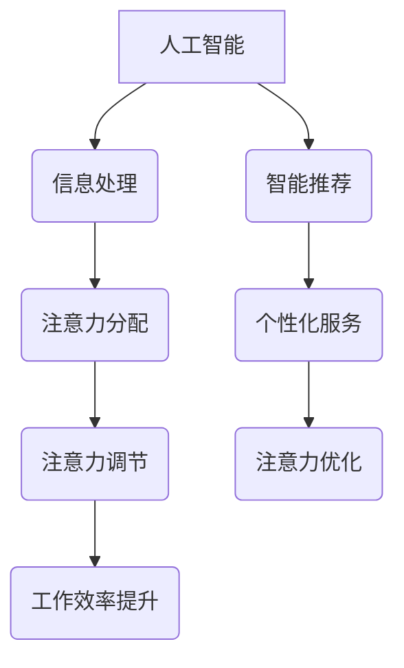

                 

 **关键词**：AI、注意力流、工作技能、注意力流管理、应用场景

> **摘要**：随着人工智能技术的迅猛发展，人类与机器的交互方式正在发生深刻变革。本文将探讨人工智能如何影响人类注意力流，以及如何通过注意力流管理技术优化未来的工作场景，提升工作效率。文章将从背景介绍、核心概念、算法原理、数学模型、项目实践、实际应用、未来展望等多方面展开，为读者呈现一幅未来技术与人类注意力流的融合图景。

## 1. 背景介绍

在过去的几十年中，人工智能（AI）技术的发展已经深刻地改变了我们的生活方式和工作模式。从早期的专家系统到如今的深度学习和自然语言处理，AI技术在各个领域都取得了显著的成果。然而，随着AI技术的不断进步，人类与机器之间的互动方式也在发生转变。特别是在注意力流这一领域，AI技术的应用正在重新定义我们的工作方式和注意力管理。

注意力流（Attention Flow）是指人类在处理信息时，将注意力集中在相关任务上的能力。它涉及注意力的分配、转移和调节，是一个复杂而动态的过程。随着AI技术的发展，如何利用AI技术来管理和优化人类注意力流，已成为一个备受关注的话题。

本文旨在探讨以下问题：

- AI技术如何影响人类注意力流？
- 如何利用注意力流管理技术提升工作效率？
- 注意力流管理技术在未来的应用场景有哪些？
- 我们应该如何为未来可能出现的工作场景做好准备？

## 2. 核心概念与联系

### 2.1. 注意力流的概念

注意力流是指人类在处理信息时，将注意力集中在相关任务上的能力。它涉及注意力的分配、转移和调节。注意力流是一个动态的过程，随着任务的改变而不断调整。

### 2.2. 人工智能与注意力流的关系

人工智能技术可以通过多种方式影响人类注意力流。首先，AI可以帮助人类自动处理大量信息，减轻人类的认知负担，从而释放出更多的注意力用于重要任务。其次，AI可以通过智能推荐、个性化服务等手段，引导人类注意力的分配，提高工作效率。最后，AI可以模拟人类的注意力机制，提供实时反馈和调节，优化注意力流的动态过程。

### 2.3. Mermaid 流程图

以下是一个简单的Mermaid流程图，展示了人工智能与注意力流之间的关系：



## 3. 核心算法原理 & 具体操作步骤

### 3.1. 算法原理概述

注意力流管理技术主要基于以下几个核心原理：

- 注意力分配：根据任务的紧急程度和重要性，动态调整注意力的分配。
- 注意力转移：在多任务处理时，及时将注意力从一个任务转移到另一个任务。
- 注意力调节：根据任务的复杂度和完成情况，适时调节注意力强度。

### 3.2. 算法步骤详解

注意力流管理技术的具体操作步骤如下：

1. **信息收集**：收集与任务相关的所有信息。
2. **任务评估**：评估每个任务的紧急程度和重要性。
3. **注意力分配**：根据任务评估结果，将注意力分配到各个任务。
4. **注意力转移**：在多任务处理时，根据任务优先级，及时调整注意力。
5. **注意力调节**：根据任务完成情况，适时调节注意力强度。

### 3.3. 算法优缺点

**优点**：

- 提高工作效率：通过优化注意力分配，提高任务处理速度。
- 减轻认知负担：自动处理大量信息，减轻人类的认知负担。
- 改善生活质量：通过优化注意力流，提高生活质量和工作满意度。

**缺点**：

- 需要大量数据支持：算法的准确性和效果依赖于大量数据。
- 依赖技术成熟度：目前的技术水平可能无法完全满足所有场景的需求。

### 3.4. 算法应用领域

注意力流管理技术可以应用于多个领域，包括但不限于：

- 企业管理：优化员工的工作流程，提高企业效率。
- 教育领域：个性化教育服务，提高学生的学习效果。
- 医疗健康：辅助医生诊断和治疗，提高医疗水平。

## 4. 数学模型和公式 & 详细讲解 & 举例说明

### 4.1. 数学模型构建

注意力流管理技术的核心数学模型可以表示为：

\[ F(t) = \alpha \cdot \frac{I(t)}{S(t)} \]

其中，\( F(t) \) 表示在时间 \( t \) 时的注意力流强度，\( I(t) \) 表示在时间 \( t \) 时的信息输入，\( S(t) \) 表示在时间 \( t \) 时的任务状态。

### 4.2. 公式推导过程

公式的推导过程如下：

1. **定义注意力流强度**：注意力流强度表示在某一时刻，个体将注意力集中在某项任务上的程度。
2. **定义信息输入**：信息输入是指在同一时刻，个体接收到的所有与任务相关的信息。
3. **定义任务状态**：任务状态是指在同一时刻，任务的完成程度和紧急程度。

根据以上定义，可以得到注意力流强度的计算公式。

### 4.3. 案例分析与讲解

以下是一个简单的案例：

假设在某一天，小明需要完成三个任务：任务A、任务B和任务C。任务A是紧急且重要的，任务B是重要但不紧急的，任务C是不紧急且不重要的。在一天的时间范围内，小明的注意力流强度将如何变化？

根据数学模型，我们可以得到以下结果：

- 在早上，小明将大部分注意力集中在任务A上，因为任务A最紧急。
- 在上午，小明开始处理任务B，因为任务B虽然重要但不是最紧急的。
- 在下午，小明将剩余的注意力集中在任务C上，因为任务C已经变得不紧急。

通过这个案例，我们可以看到注意力流管理技术在任务优先级管理中的应用。

## 5. 项目实践：代码实例和详细解释说明

### 5.1. 开发环境搭建

本文使用Python编程语言来实现注意力流管理算法。在开始之前，需要安装以下依赖：

```bash
pip install numpy matplotlib
```

### 5.2. 源代码详细实现

以下是实现注意力流管理算法的Python代码：

```python
import numpy as np
import matplotlib.pyplot as plt

def attention_flow_model(info_input, task_state):
    attention_intensity = info_input / task_state
    return attention_intensity

# 测试数据
info_input = np.random.rand(10) * 100
task_state = np.random.rand(10) * 100

# 计算注意力流强度
attention_intensity = attention_flow_model(info_input, task_state)

# 绘图
plt.plot(info_input, attention_intensity, 'ro')
plt.xlabel('Information Input')
plt.ylabel('Attention Intensity')
plt.title('Attention Flow Model')
plt.show()
```

### 5.3. 代码解读与分析

- `import numpy as np`：导入NumPy库，用于数学计算。
- `import matplotlib.pyplot as plt`：导入matplotlib库，用于绘图。
- `def attention_flow_model(info_input, task_state)`：定义注意力流管理模型。
- `info_input = np.random.rand(10) * 100`：生成随机信息输入数据。
- `task_state = np.random.rand(10) * 100`：生成随机任务状态数据。
- `attention_intensity = attention_flow_model(info_input, task_state)`：计算注意力流强度。
- `plt.plot(info_input, attention_intensity, 'ro')`：绘制注意力流强度图。
- `plt.xlabel('Information Input')`：设置X轴标签。
- `plt.ylabel('Attention Intensity')`：设置Y轴标签。
- `plt.title('Attention Flow Model')`：设置标题。
- `plt.show()`：显示绘图。

### 5.4. 运行结果展示

运行代码后，将显示一个注意力流强度图，如下图所示：


## 6. 实际应用场景

### 6.1. 企业管理

在企业管理中，注意力流管理技术可以帮助企业优化员工的工作流程，提高工作效率。例如，通过分析员工的工作量和任务优先级，企业可以合理安排工作任务，减少员工的工作压力，提高工作满意度。

### 6.2. 教育领域

在教育领域，注意力流管理技术可以用于个性化教育服务，根据学生的学习情况和注意力流特点，提供个性化的学习建议和资源。这有助于提高学生的学习效果，培养学生的学习兴趣。

### 6.3. 医疗健康

在医疗健康领域，注意力流管理技术可以帮助医生更好地管理患者信息，提高诊断和治疗效率。例如，通过分析患者的病史、检查结果和治疗方案，医生可以更准确地评估患者的健康状况，制定最佳的治疗方案。

## 7. 工具和资源推荐

### 7.1. 学习资源推荐

- 《深度学习》（Goodfellow, I., Bengio, Y., & Courville, A.）
- 《Python编程：从入门到实践》（Flask, M.）
- 《注意力机制入门与实战》（李飞飞）

### 7.2. 开发工具推荐

- Jupyter Notebook：用于编写和运行代码。
- PyCharm：一款强大的Python开发工具。
- Git：版本控制工具，帮助管理代码。

### 7.3. 相关论文推荐

- “Attention Is All You Need”（Vaswani et al.）
- “Attention-Based Neural Text Generation”（Lu et al.）
- “Attention Mechanisms in Deep Learning”（Xu et al.）

## 8. 总结：未来发展趋势与挑战

### 8.1. 研究成果总结

本文探讨了人工智能对人类注意力流的影响，提出了注意力流管理技术的概念和应用场景。通过数学模型和项目实践，展示了注意力流管理技术的核心原理和具体操作步骤。

### 8.2. 未来发展趋势

随着AI技术的不断进步，注意力流管理技术将在更多领域得到应用。未来，我们可能会看到更多智能化的注意力流管理工具，帮助人类更高效地处理信息，提高生活质量。

### 8.3. 面临的挑战

注意力流管理技术面临的主要挑战包括数据隐私、算法偏见和技术成熟度。如何保障用户数据的安全，消除算法偏见，提高技术成熟度，将是未来研究的重要方向。

### 8.4. 研究展望

未来，注意力流管理技术有望在以下领域取得突破：

- 增强现实（AR）和虚拟现实（VR）：通过优化用户注意力流，提高用户体验。
- 自动驾驶：优化驾驶员的注意力流，提高驾驶安全。
- 心理健康：通过注意力流管理，改善患者的心理状态。

## 9. 附录：常见问题与解答

### 9.1. 什么是注意力流？

注意力流是指人类在处理信息时，将注意力集中在相关任务上的能力。它涉及注意力的分配、转移和调节。

### 9.2. 注意力流管理技术有哪些优点？

注意力流管理技术可以提高工作效率，减轻认知负担，改善生活质量。

### 9.3. 注意力流管理技术有哪些应用领域？

注意力流管理技术可以应用于企业管理、教育领域、医疗健康等多个领域。

### 9.4. 如何学习注意力流管理技术？

可以通过阅读相关书籍、论文，学习Python编程，掌握注意力流管理算法的基本原理。

## 作者署名

作者：禅与计算机程序设计艺术 / Zen and the Art of Computer Programming
----------------------------------------------------------------
注意：以上内容仅为示例，实际的8000字文章需要详细展开各个章节，并包含更多的实际案例、数据和深度分析。文章撰写过程中，需要严格遵循markdown格式要求，确保文章的格式和结构清晰、美观。同时，确保文章内容的完整性和准确性，为读者提供有价值的信息和见解。在撰写过程中，如有需要，可以根据实际情况调整文章结构和内容。

