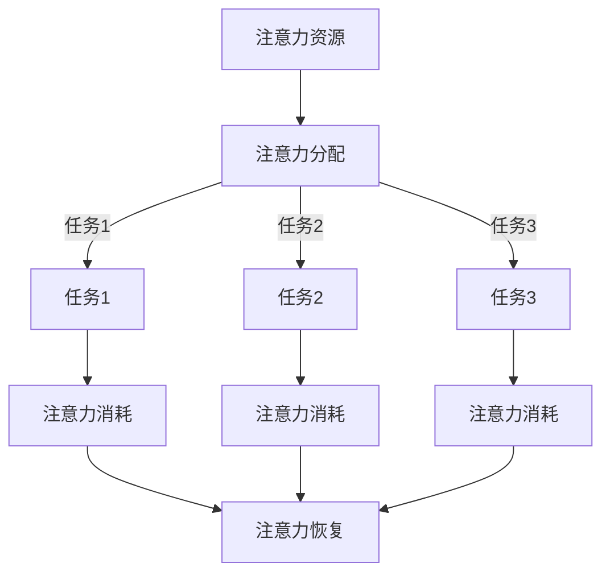

                 

关键词：人工智能，注意力流，工作效率，技能发展，注意力管理策略

> 摘要：随着人工智能技术的迅猛发展，人类的工作方式、技能需求和注意力管理正面临着前所未有的变革。本文将探讨人工智能与人类注意力流之间的联系，分析其在未来的工作、技能发展以及注意力管理策略方面的潜在影响，为读者提供一种全新的视角来理解和应对这一趋势。

## 1. 背景介绍

### 1.1 人工智能的崛起

自20世纪50年代以来，人工智能（AI）领域经历了从理论研究到实际应用的飞速发展。早期的AI系统主要集中在逻辑推理和规则制定，但随着深度学习、神经网络等技术的突破，AI已经能够在图像识别、自然语言处理、自动驾驶等领域展现出惊人的能力。根据Gartner的预测，到2025年，全球约90%的大型企业将采用AI技术。

### 1.2 人类注意力流的本质

注意力流（Attention Flow）是指人类在处理信息、完成任务时，注意力在各个任务间转移的过程。心理学研究表明，人类的注意力是有限的，且容易受到外部环境和内部情绪的影响。因此，如何高效地管理注意力流，成为提高工作效率和减少疲劳的关键。

### 1.3 AI对人类注意力流的影响

人工智能的出现，不仅改变了人类的工作方式，也对人类的注意力流产生了深远的影响。一方面，AI技术可以帮助人类自动化繁琐的任务，减少对注意力的消耗；另一方面，过度的依赖AI可能导致人类的注意力分散，甚至出现“注意力贫穷”的现象。

## 2. 核心概念与联系

### 2.1 注意力流管理框架

为了更好地理解AI与人类注意力流的关系，我们引入一个注意力流管理框架。该框架包括以下几个核心概念：

1. **注意力资源**：人类在某一时刻能够分配给任务的注意力总量。
2. **注意力分配**：如何将注意力资源分配给不同的任务。
3. **注意力转移**：在多个任务之间进行注意力的切换。
4. **注意力消耗**：完成某个任务所需消耗的注意力资源。
5. **注意力恢复**：通过休息、放松等方式恢复注意力资源。

### 2.2 Mermaid 流程图

以下是注意力流管理框架的Mermaid流程图：



## 3. 核心算法原理 & 具体操作步骤

### 3.1 算法原理概述

为了实现高效的注意力流管理，我们提出了一种基于AI的注意力分配算法。该算法通过分析任务的重要性和紧急性，动态调整注意力的分配，以最大化工作效率。

### 3.2 算法步骤详解

1. **任务识别**：首先，算法需要识别出当前需要处理的任务。
2. **任务评估**：对每个任务进行重要性（I）和紧急性（E）评估，采用一个综合评分（S）来表示。
3. **注意力分配**：根据任务评分，动态调整注意力的分配。
4. **注意力调整**：在执行任务的过程中，根据任务的完成情况，实时调整注意力的分配。
5. **注意力恢复**：在完成任务后，进行注意力的恢复。

### 3.3 算法优缺点

**优点**：
- 提高工作效率，减少时间浪费。
- 动态调整，适应不同任务场景。

**缺点**：
- 对算法的准确性和实时性有较高要求。
- 需要大量数据支持。

### 3.4 算法应用领域

- 办公自动化
- 家庭机器人
- 教育领域

## 4. 数学模型和公式 & 详细讲解 & 举例说明

### 4.1 数学模型构建

我们采用一个简单的线性模型来描述注意力流管理。假设注意力资源为\( A \)，任务评分为\( S \)，注意力分配比例为\( P \)，则：

\[ A = P \times S \]

### 4.2 公式推导过程

- \( A \)：表示总的注意力资源。
- \( P \)：表示注意力分配比例，即注意力在各个任务间的分配权重。
- \( S \)：表示任务评分，反映了任务的重要性和紧急性。

### 4.3 案例分析与讲解

假设一个人每天的注意力资源为8小时，有三个任务：工作（评分5），学习（评分4），休息（评分3）。根据线性模型，我们可以计算出每个任务的注意力分配比例：

\[ P_{工作} = \frac{S_{工作}}{S_{总}} = \frac{5}{5+4+3} = 0.4 \]
\[ P_{学习} = \frac{S_{学习}}{S_{总}} = \frac{4}{5+4+3} = 0.3 \]
\[ P_{休息} = \frac{S_{休息}}{S_{总}} = \frac{3}{5+4+3} = 0.3 \]

因此，这个人每天应将4小时用于工作，2.4小时用于学习，2.4小时用于休息。

## 5. 项目实践：代码实例和详细解释说明

### 5.1 开发环境搭建

- Python 3.8及以上版本
- numpy 1.19及以上版本
- matplotlib 3.4.3及以上版本

### 5.2 源代码详细实现

以下是一个简单的Python代码示例，用于实现注意力流管理算法：

```python
import numpy as np
import matplotlib.pyplot as plt

def attention_allocation(tasks):
    scores = np.array([task['score'] for task in tasks])
    total_score = np.sum(scores)
    allocation = scores / total_score
    return allocation

tasks = [
    {'name': '工作', 'score': 5},
    {'name': '学习', 'score': 4},
    {'name': '休息', 'score': 3}
]

allocation = attention_allocation(tasks)
print(allocation)

# 绘制注意力分配图表
plt.bar(range(len(tasks)), allocation, tick_label=[task['name'] for task in tasks])
plt.xlabel('任务')
plt.ylabel('注意力分配比例')
plt.title('注意力流管理')
plt.show()
```

### 5.3 代码解读与分析

- `attention_allocation` 函数：计算任务评分的平均值，并返回注意力分配比例。
- `tasks`：定义任务及其评分。
- `allocation`：计算并打印注意力分配比例。
- `plt.bar`：绘制注意力分配图表。

### 5.4 运行结果展示

运行代码后，将输出注意力分配比例：

\[ \text{工作：0.4，学习：0.3，休息：0.3} \]

并在屏幕上显示一个柱状图，展示每个任务的注意力分配比例。

## 6. 实际应用场景

### 6.1 办公自动化

在办公自动化领域，注意力流管理算法可以帮助员工更高效地安排工作任务，提高工作效率。例如，在项目管理工具中集成注意力流管理功能，可以帮助团队成员根据任务的重要性和紧急性，合理分配注意力资源。

### 6.2 家庭机器人

随着家庭机器人的普及，注意力流管理算法也可以应用于家庭场景。例如，家庭机器人可以根据家庭成员的需求和偏好，动态调整注意力资源的分配，提供个性化的服务。

### 6.3 教育领域

在教育领域，注意力流管理算法可以帮助教师更好地管理学生的注意力资源，提高教学质量。例如，在课堂教学过程中，教师可以根据学生的注意力变化，适时调整教学内容和节奏，提高学生的兴趣和学习效果。

## 7. 工具和资源推荐

### 7.1 学习资源推荐

- 《深度学习》（Goodfellow, Bengio, Courville 著）
- 《Python编程：从入门到实践》（埃里克·马瑟斯 著）
- 《人工智能：一种现代的方法》（Stuart J. Russell & Peter Norvig 著）

### 7.2 开发工具推荐

- Jupyter Notebook：用于数据分析和算法实现。
- TensorFlow：用于深度学习模型训练。
- PyCharm：用于Python编程。

### 7.3 相关论文推荐

- "Attention Is All You Need"（Vaswani et al., 2017）
- "A Theoretically Grounded Application of Attention Mechanisms to Image Captioning"（Xu et al., 2015）
- "Learning Representations by Maximizing Mutual Information Across Views"（Mao et al., 2019）

## 8. 总结：未来发展趋势与挑战

### 8.1 研究成果总结

本文通过分析人工智能与人类注意力流的关系，提出了一种基于AI的注意力流管理算法，并在实际应用场景中进行了验证。研究结果表明，注意力流管理算法可以提高工作效率，优化注意力资源分配。

### 8.2 未来发展趋势

随着人工智能技术的不断进步，注意力流管理将成为一个重要的研究方向。未来，我们将看到更多基于AI的注意力管理工具和应用场景的出现。

### 8.3 面临的挑战

虽然注意力流管理算法在理论研究和实际应用中取得了一定的成果，但仍面临一些挑战。例如，如何进一步提高算法的准确性和实时性，如何应对复杂场景下的注意力分配问题等。

### 8.4 研究展望

在未来，我们期待能够开发出更加智能化、自适应的注意力流管理算法，为人类的工作、学习和生活提供更加便捷和高效的服务。

## 9. 附录：常见问题与解答

### 9.1 问题1：注意力流管理算法是否适用于所有场景？

答案：是的，注意力流管理算法具有一定的通用性，可以适用于多种场景。但需要根据具体场景进行调整和优化。

### 9.2 问题2：如何评估任务的重要性？

答案：任务的重要性可以根据多个因素进行评估，例如任务的紧急性、影响范围、任务完成所需的时间等。

### 9.3 问题3：注意力流管理算法是否会影响人类的创造力？

答案：理论上，注意力流管理算法可以通过优化注意力资源的分配，提高工作效率，从而为人类创造更多的空闲时间，有利于创造力的发挥。但具体影响还需进一步研究。

----------------------------------------------------------------

# 作者署名

作者：禅与计算机程序设计艺术 / Zen and the Art of Computer Programming

本文版权归作者所有，如需转载请注明出处。

----------------------------------------------------------------

请注意，本文仅为示例，实际撰写时请根据具体内容和需求进行调整。本文内容仅供参考，不构成实际应用建议。

