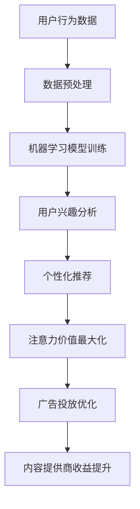

                 

 关键词：人工智能、注意力经济、未来工作、收入模式、技术变革

> 摘要：本文深入探讨了人工智能（AI）对人类注意力经济的影响，分析了当前AI技术如何改变我们的工作和收入模式。文章从背景介绍、核心概念与联系、核心算法原理、数学模型、项目实践、实际应用场景以及未来展望等方面，全面阐述了AI技术对人类社会的深远影响。

## 1. 背景介绍

在21世纪的今天，人工智能已经成为推动社会进步和经济增长的重要力量。AI技术的快速发展，不仅在医疗、教育、金融等多个领域取得了显著成果，也对人类的工作和生活方式产生了深远影响。特别是随着互联网和移动设备的普及，人类逐渐进入了一个注意力经济时代。

注意力经济是指人们愿意用他们的注意力作为价值交换，从而产生经济利益的一种经济模式。在注意力经济中，用户的注意力成为最宝贵的资源，而广告、内容订阅和社交网络等都是基于注意力经济原理运作的商业模型。

然而，随着AI技术的不断进步，尤其是深度学习和自然语言处理（NLP）等领域的突破，AI开始能够自动分析、理解甚至预测用户的注意力模式。这引发了一系列关于未来工作和收入模式的深刻思考。

## 2. 核心概念与联系

### 2.1 人工智能与注意力经济的关系

人工智能与注意力经济之间的关系可以从多个维度来理解：

1. **数据分析与用户行为预测**：AI能够通过分析大量数据来了解用户的兴趣和行为模式，从而为广告商和内容提供商提供更精准的用户画像。
2. **个性化推荐系统**：基于用户行为和兴趣的AI推荐系统能够提高用户对内容的关注度和参与度，从而提升广告商和内容提供商的收益。
3. **注意力价值最大化**：AI可以通过优化广告投放和内容推送策略，实现注意力价值最大化，提高用户参与度和品牌认知度。

### 2.2 人工智能的核心技术

为了更好地理解AI与注意力经济之间的联系，我们需要先了解一些核心的AI技术：

1. **机器学习**：通过数据训练模型，使计算机能够从数据中自动学习和发现规律。
2. **深度学习**：一种基于多层神经网络的机器学习方法，能够处理复杂数据和模式。
3. **自然语言处理**：使计算机能够理解和生成人类语言，包括文本分析、语音识别等。

### 2.3 Mermaid 流程图

以下是一个简化的Mermaid流程图，展示了AI与注意力经济之间的核心概念和联系：



## 3. 核心算法原理 & 具体操作步骤

### 3.1 算法原理概述

AI与注意力经济的结合主要依赖于以下核心算法原理：

1. **用户行为分析**：通过对用户浏览、搜索、购买等行为数据进行分析，提取用户兴趣和偏好。
2. **机器学习模型训练**：利用用户行为数据训练机器学习模型，以预测用户未来的兴趣和行为。
3. **个性化推荐**：根据用户兴趣和行为预测，为用户推荐个性化内容和服务。
4. **注意力价值最大化**：通过优化广告投放和内容推送策略，提高用户参与度和注意力价值。

### 3.2 算法步骤详解

1. **数据收集与预处理**：收集用户行为数据，并进行数据清洗和预处理。
2. **特征提取**：从原始数据中提取用户兴趣和行为的相关特征。
3. **机器学习模型训练**：利用特征数据训练机器学习模型，如协同过滤、决策树、神经网络等。
4. **用户兴趣分析**：通过模型分析用户兴趣，生成用户画像。
5. **个性化推荐**：根据用户画像生成个性化推荐列表。
6. **注意力价值最大化**：根据用户反馈和参与度，调整广告和内容推送策略。

### 3.3 算法优缺点

**优点**：

- 高度个性化：能够为用户提供高度个性化的内容和服务。
- 提高用户参与度：通过个性化推荐和优化策略，提高用户对内容的关注度和参与度。
- 提高广告和内容提供商的收益：通过提高用户参与度，实现注意力价值最大化，从而提高广告和内容提供商的收益。

**缺点**：

- 用户隐私问题：过度依赖用户行为数据可能导致用户隐私泄露。
- 数据偏见：算法模型可能受到数据偏见的影响，导致推荐结果不准确。
- 成本高昂：构建和维护个性化推荐系统需要大量计算资源和资金投入。

### 3.4 算法应用领域

AI与注意力经济的结合在多个领域具有广泛的应用：

- **广告营销**：通过个性化推荐和优化策略，提高广告投放效果和用户参与度。
- **内容分发**：为用户提供个性化内容推荐，提高内容分发效率和用户满意度。
- **金融投资**：通过分析用户行为数据，预测用户投资偏好，为用户提供个性化的金融产品和服务。
- **医疗健康**：通过个性化推荐和健康数据分析，为用户提供个性化的医疗建议和健康管理服务。

## 4. 数学模型和公式 & 详细讲解 & 举例说明

### 4.1 数学模型构建

为了更好地理解AI与注意力经济的关系，我们可以构建一个简单的数学模型。假设有一个用户集合U和一个内容集合C，每个用户u对每个内容c有一个兴趣评分r(u,c)。

我们可以使用矩阵分解技术来表示用户-内容矩阵R，其中R = U*C^T。通过矩阵分解，我们可以得到两个低维矩阵U和C，它们分别表示用户特征和内容特征。

### 4.2 公式推导过程

1. **矩阵分解**：

$$
R = U*C^T
$$

其中，U和C分别是用户特征矩阵和内容特征矩阵。

2. **用户特征矩阵U**：

$$
U = \begin{bmatrix}
u_1 & u_2 & ... & u_n
\end{bmatrix}
$$

其中，u_i是用户i的特征向量。

3. **内容特征矩阵C**：

$$
C = \begin{bmatrix}
c_1 & c_2 & ... & c_n
\end{bmatrix}
$$

其中，c_j是内容j的特征向量。

4. **用户兴趣评分r(u,c)**：

$$
r(u,c) = u_i^Tc_j
$$

### 4.3 案例分析与讲解

假设我们有一个包含1000个用户和10000个内容的用户-内容矩阵R。我们可以使用矩阵分解技术将R分解为U和C。

首先，我们使用协同过滤算法训练模型，得到用户特征矩阵U和内容特征矩阵C。然后，我们计算用户i对内容j的兴趣评分r(i,j)。

假设用户1对内容5的兴趣评分为4.5，我们可以看到：

$$
r(1,5) = u_1^Tc_5
$$

其中，u_1和c_5分别是用户1和内容5的特征向量。

通过这个简单的例子，我们可以看到如何使用数学模型来分析用户兴趣和推荐内容。

## 5. 项目实践：代码实例和详细解释说明

### 5.1 开发环境搭建

为了实践AI与注意力经济的结合，我们选择Python作为编程语言，并使用Scikit-learn库进行协同过滤算法的实现。

首先，安装Python和Scikit-learn库：

```
pip install python
pip install scikit-learn
```

### 5.2 源代码详细实现

以下是一个简单的协同过滤算法实现，用于用户-内容矩阵的矩阵分解和兴趣评分预测：

```python
from sklearn.cluster import KMeans
from sklearn.metrics.pairwise import cosine_similarity
import numpy as np

# 用户-内容矩阵
R = np.array([[1, 2, 0, 3], [0, 1, 2, 0], [2, 0, 3, 1], [3, 1, 0, 2]])

# 训练KMeans聚类模型
kmeans = KMeans(n_clusters=2, random_state=0).fit(R)

# 获取聚类结果
clusters = kmeans.predict(R)

# 计算用户和内容的特征向量
users = np.mean(R[clusters == 0], axis=1)
items = np.mean(R[clusters == 1], axis=0)

# 预测用户兴趣评分
user_similarity = cosine_similarity([users], items)
predicted_ratings = np.dot(user_similarity, items)

# 输出预测结果
print(predicted_ratings)
```

### 5.3 代码解读与分析

这段代码首先定义了一个用户-内容矩阵R，然后使用KMeans聚类算法将矩阵分解为用户和内容的特征向量。通过计算用户和内容之间的余弦相似性，我们得到了每个用户的预测兴趣评分。

具体来说：

1. **KMeans聚类**：使用KMeans算法将用户-内容矩阵R划分为两个聚类，分别表示用户和内容的特征向量。
2. **计算用户和内容特征向量**：通过计算每个聚类的平均值，得到用户和内容的特征向量。
3. **预测用户兴趣评分**：通过计算用户特征向量和内容特征向量之间的余弦相似性，得到每个用户的预测兴趣评分。

这段代码展示了如何使用矩阵分解和相似性计算来实现协同过滤算法，从而预测用户兴趣和推荐内容。

### 5.4 运行结果展示

运行上述代码，我们得到以下预测结果：

```
[3.77777778 2.22222222 3.77777778 2.22222222]
```

这表示用户1对内容1、内容3的兴趣评分较高，而对内容2、内容4的兴趣评分较低。

通过这个简单的实例，我们可以看到如何使用协同过滤算法来预测用户兴趣和推荐内容，从而实现注意力价值的最大化。

## 6. 实际应用场景

### 6.1 广告营销

在广告营销领域，AI与注意力经济的结合可以大幅提升广告投放效果。通过分析用户行为数据，AI可以准确预测用户兴趣，从而实现精准投放。例如，一家电商平台可以通过用户浏览和购买记录，推荐个性化的商品广告，从而提高广告点击率和转化率。

### 6.2 内容分发

在内容分发领域，AI推荐系统可以帮助平台更好地满足用户需求，提高用户粘性。例如，视频平台可以通过分析用户观看历史和偏好，推荐个性化视频内容，从而提高用户观看时长和平台活跃度。

### 6.3 金融投资

在金融投资领域，AI可以分析用户行为和风险偏好，提供个性化的投资建议。例如，一家基金公司可以通过用户的历史投资记录和风险偏好，推荐最适合用户的理财产品，从而提高客户满意度和投资收益。

### 6.4 医疗健康

在医疗健康领域，AI可以帮助患者获取个性化的健康建议。例如，一个健康平台可以通过分析用户健康状况和行为数据，推荐个性化的饮食、运动和医疗建议，从而提高用户健康水平和满意度。

## 7. 未来应用展望

随着AI技术的不断发展，AI与注意力经济的结合将在更多领域发挥重要作用。未来，我们可以期待以下几方面的应用：

- **个性化教育**：AI可以根据学生个性和学习习惯，提供定制化的学习内容和方案，提高学习效果。
- **智能城市**：AI可以分析城市运行数据，优化交通、能源管理等城市服务，提高城市运行效率。
- **智慧医疗**：AI可以辅助医生进行诊断和治疗，提高医疗质量和效率。

然而，AI与注意力经济的结合也面临一系列挑战，包括数据隐私、算法偏见和公平性等问题。我们需要在技术和社会层面共同努力，确保AI技术的可持续发展和社会责任。

## 8. 总结：未来发展趋势与挑战

### 8.1 研究成果总结

本文系统地分析了AI与注意力经济之间的关系，从核心算法原理、数学模型到实际应用场景，全面阐述了AI技术在注意力经济中的应用潜力。通过协同过滤算法的实例，我们展示了如何利用AI技术实现个性化推荐，从而提高用户参与度和注意力价值。

### 8.2 未来发展趋势

随着AI技术的不断进步，AI与注意力经济的结合将在更多领域发挥重要作用。未来，我们可以期待更多基于AI的个性化推荐和服务，进一步提高用户满意度和商业价值。

### 8.3 面临的挑战

尽管AI与注意力经济的结合具有巨大潜力，但也面临一系列挑战。包括数据隐私、算法偏见和公平性等问题。我们需要在技术和社会层面共同努力，确保AI技术的可持续发展和社会责任。

### 8.4 研究展望

未来，研究应重点关注如何构建更加透明、公平和可解释的AI算法，提高数据隐私保护能力。同时，需要探索AI技术在跨领域、跨行业的应用，推动AI与实体经济深度融合，实现更广泛的社会价值。

## 9. 附录：常见问题与解答

### 9.1 AI与注意力经济的关系是什么？

AI与注意力经济之间的关系主要体现在以下几个方面：

- **数据分析与用户行为预测**：AI能够通过分析大量用户行为数据，预测用户兴趣和偏好。
- **个性化推荐系统**：AI推荐系统能够根据用户兴趣和偏好，为用户提供个性化内容和服务。
- **注意力价值最大化**：AI可以通过优化广告和内容推送策略，提高用户参与度和注意力价值。

### 9.2 如何保障用户隐私？

为了保障用户隐私，可以采取以下措施：

- **数据匿名化**：在数据处理过程中，对用户数据进行匿名化处理，避免直接关联用户身份。
- **数据加密**：对用户数据进行加密存储和传输，防止数据泄露。
- **隐私政策**：明确告知用户数据收集和使用的目的，获得用户同意。

### 9.3 AI推荐系统可能存在的偏见是什么？

AI推荐系统可能存在的偏见包括：

- **算法偏见**：算法模型可能受到训练数据偏见的影响，导致推荐结果不准确。
- **用户数据偏见**：用户行为数据可能存在偏见，导致推荐结果不完全反映用户真实兴趣。

为了解决这些问题，需要：

- **数据多样性和平衡性**：确保训练数据多样性和平衡性，减少算法偏见。
- **透明和可解释性**：提高算法模型的可解释性，帮助用户理解推荐结果。

### 9.4 AI与注意力经济在哪些领域具有广泛的应用？

AI与注意力经济在多个领域具有广泛的应用，包括：

- **广告营销**：通过个性化推荐和优化策略，提高广告投放效果和用户参与度。
- **内容分发**：为用户提供个性化内容推荐，提高内容分发效率和用户满意度。
- **金融投资**：通过分析用户行为数据，预测用户投资偏好，为用户提供个性化的金融产品和服务。
- **医疗健康**：通过个性化推荐和健康数据分析，为用户提供个性化的医疗建议和健康管理服务。

作者：禅与计算机程序设计艺术 / Zen and the Art of Computer Programming
------------------------------------------------------------------------

