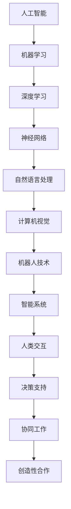

                 

关键词：人工智能、人类互动、合作、未来发展趋势、技术应用、算法原理、数学模型、项目实践、应用场景、工具资源

> 摘要：本文从人工智能与人类的互动与合作角度出发，探讨了人工智能技术的发展趋势、核心算法原理、数学模型构建、项目实践案例，并分析了人工智能在未来各个领域中的应用场景和挑战。文章旨在为读者提供关于人工智能与人类未来互动的深入理解和前瞻性思考。

## 1. 背景介绍

随着计算机技术的飞速发展和大数据时代的到来，人工智能（Artificial Intelligence，AI）逐渐成为全球研究和应用的热点。人工智能不仅仅是计算机科学的一个分支，它已经深刻地影响了社会的方方面面，从医疗、金融、教育到制造业、交通等。随着人工智能技术的不断进步，人们对其与人类互动和合作的模式产生了更多的期待和思考。

### 1.1 人工智能的定义与发展历程

人工智能是指模拟、延伸和扩展人类智能的理论、方法、技术及应用。人工智能的研究始于20世纪50年代，经历了多个发展阶段：

- **早期探索阶段（1950-1969）**：以图灵测试为标志，人们开始思考机器是否能够模拟人类智能。
- **理性繁荣时期（1970-1989）**：随着计算机硬件和软件的进步，人工智能研究得到了快速发展，但受限于硬件资源和算法限制，进展较为缓慢。
- **人工智能寒冬（1990-2000）**：由于人工智能技术未能实现预期效果，研究和投资减少，进入了一个相对低潮的时期。
- **新一轮繁荣（2000至今）**：随着大数据、云计算、深度学习等技术的突破，人工智能迎来了新一轮的快速发展。

### 1.2 人工智能与人类的互动与合作

人工智能与人类的互动与合作可以从以下几个方面进行探讨：

- **信息交流**：人工智能系统通过自然语言处理、语音识别等技术，可以与人类进行有效的信息交流。
- **决策支持**：人工智能可以基于大数据分析和预测模型，为人类提供决策支持，提高决策效率和准确性。
- **协同工作**：人工智能可以辅助人类完成重复性、繁琐的工作，提高工作效率和质量。
- **创造性合作**：人工智能可以与人类共同创作音乐、绘画等艺术作品，实现创意的碰撞和融合。

## 2. 核心概念与联系

为了更好地理解人工智能与人类互动和合作的核心概念，我们需要介绍一些关键概念和它们之间的关系。以下是一个使用Mermaid绘制的流程图，展示了这些核心概念和它们之间的联系。



### 2.1 人工智能（AI）

人工智能是整个系统的核心，涵盖了机器学习、深度学习、神经网络、自然语言处理、计算机视觉等多个子领域。

### 2.2 机器学习（Machine Learning）

机器学习是人工智能的一个重要分支，通过算法使计算机系统能够从数据中学习，并做出预测或决策。

### 2.3 深度学习（Deep Learning）

深度学习是机器学习的一个子领域，它通过多层神经网络对数据进行建模，取得了在图像识别、语音识别等任务上的突破。

### 2.4 神经网络（Neural Networks）

神经网络是深度学习的基础，它模拟了人脑的神经元结构和工作方式，通过不断调整权重和偏置来学习数据特征。

### 2.5 自然语言处理（Natural Language Processing）

自然语言处理是使计算机能够理解和生成人类语言的技术，广泛应用于语音识别、机器翻译、文本分类等任务。

### 2.6 计算机视觉（Computer Vision）

计算机视觉是使计算机能够“看”的技术，它包括图像识别、目标检测、图像分割等任务。

### 2.7 机器人技术（Robotics）

机器人技术是人工智能在实体世界中的应用，通过计算机视觉、自然语言处理等技术，实现机器人的自主决策和行动。

### 2.8 智能系统（Smart Systems）

智能系统是集成了多种人工智能技术的复杂系统，可以实现自主学习和智能化决策。

### 2.9 人类交互（Human-Computer Interaction）

人类交互是人工智能系统与人类用户之间进行有效沟通和操作的技术，包括用户界面设计、交互体验优化等。

### 2.10 决策支持（Decision Support）

决策支持是利用人工智能技术，对大量数据进行分析和建模，为人类决策提供科学依据。

### 2.11 协同工作（Collaboration）

协同工作是人工智能系统辅助人类完成复杂任务的技术，可以实现人类与人工智能系统之间的无缝协作。

### 2.12 创造性合作（Creative Collaboration）

创造性合作是人工智能与人类在创造性和艺术领域的合作，通过人工智能辅助人类发挥更大的创造力。

## 3. 核心算法原理 & 具体操作步骤

### 3.1 算法原理概述

在人工智能与人类的互动与合作中，核心算法起着至关重要的作用。以下介绍几种常用的算法原理：

### 3.2 算法步骤详解

#### 3.2.1 深度学习算法

深度学习算法主要包括以下步骤：

1. **数据预处理**：对原始数据进行清洗、归一化等处理，以便于后续训练。
2. **构建神经网络模型**：设计并构建多层神经网络结构，包括输入层、隐藏层和输出层。
3. **参数初始化**：对网络权重和偏置进行随机初始化。
4. **前向传播**：将输入数据传递到神经网络中，计算输出结果。
5. **反向传播**：根据输出结果和真实标签，计算损失函数，并更新网络参数。
6. **优化算法**：使用梯度下降等优化算法，不断调整网络参数，以最小化损失函数。

#### 3.2.2 自然语言处理算法

自然语言处理算法主要包括以下步骤：

1. **文本预处理**：对原始文本进行分词、去停用词等处理，提取有效特征。
2. **词向量表示**：将文本转化为词向量表示，如Word2Vec、GloVe等。
3. **构建神经网络模型**：设计并构建多层神经网络结构，包括嵌入层、隐藏层和输出层。
4. **参数初始化**：对网络权重和偏置进行随机初始化。
5. **前向传播**：将词向量传递到神经网络中，计算输出结果。
6. **反向传播**：根据输出结果和真实标签，计算损失函数，并更新网络参数。
7. **优化算法**：使用梯度下降等优化算法，不断调整网络参数，以最小化损失函数。

#### 3.2.3 计算机视觉算法

计算机视觉算法主要包括以下步骤：

1. **图像预处理**：对原始图像进行缩放、裁剪、增强等处理，以便于后续训练。
2. **特征提取**：使用卷积神经网络等模型提取图像特征。
3. **构建分类模型**：设计并构建分类模型，如卷积神经网络（CNN）、循环神经网络（RNN）等。
4. **参数初始化**：对网络权重和偏置进行随机初始化。
5. **前向传播**：将图像特征传递到神经网络中，计算输出结果。
6. **反向传播**：根据输出结果和真实标签，计算损失函数，并更新网络参数。
7. **优化算法**：使用梯度下降等优化算法，不断调整网络参数，以最小化损失函数。

### 3.3 算法优缺点

每种算法都有其独特的优缺点，以下对几种主要算法的优缺点进行简要分析：

#### 深度学习算法

**优点**：
- **强大建模能力**：能够自动学习数据的复杂结构和特征。
- **泛化能力强**：通过多层网络结构，能够较好地泛化到未见过的数据。

**缺点**：
- **计算资源需求高**：需要大量的计算资源和时间进行训练。
- **参数调优复杂**：需要精心设计网络结构、选择合适的优化算法和超参数。

#### 自然语言处理算法

**优点**：
- **处理文本能力强**：能够理解并处理自然语言文本。
- **适用范围广**：广泛应用于机器翻译、文本分类、信息检索等领域。

**缺点**：
- **数据依赖性强**：需要大量的高质量标注数据。
- **模型可解释性差**：神经网络模型内部机制复杂，难以解释。

#### 计算机视觉算法

**优点**：
- **图像识别准确**：通过卷积神经网络等模型，能够实现高精度的图像识别。
- **实时性强**：适用于实时监控、自动驾驶等场景。

**缺点**：
- **计算资源需求高**：需要大量的计算资源和时间进行训练。
- **训练数据要求高**：需要大量的标注数据。

### 3.4 算法应用领域

深度学习、自然语言处理和计算机视觉算法在多个领域取得了显著的成果，以下列举几个主要应用领域：

- **医疗健康**：用于医学影像诊断、疾病预测、个性化治疗等。
- **金融**：用于风险控制、智能投顾、欺诈检测等。
- **教育**：用于智能教育、在线学习、教育评估等。
- **制造业**：用于质量检测、智能控制、生产优化等。
- **交通**：用于自动驾驶、智能交通管理、交通安全等。

## 4. 数学模型和公式 & 详细讲解 & 举例说明

在人工智能算法中，数学模型和公式起到了核心作用，以下分别介绍常用的数学模型和公式，并给出详细讲解和举例说明。

### 4.1 数学模型构建

在人工智能算法中，常用的数学模型包括：

1. **概率模型**：用于描述不确定性，如贝叶斯网络、马尔可夫模型等。
2. **优化模型**：用于求解最优化问题，如线性规划、非线性规划、支持向量机等。
3. **神经网络模型**：用于模拟人脑神经元结构和工作方式，如多层感知机、卷积神经网络等。
4. **决策树模型**：用于分类和回归任务，如ID3、C4.5、CART等。

### 4.2 公式推导过程

以下以多层感知机（Multilayer Perceptron，MLP）为例，介绍神经网络的公式推导过程。

#### 4.2.1 前向传播

多层感知机的前向传播过程可以分为以下几个步骤：

1. **输入层到隐藏层**：

$$
z^{(1)}_j = \sum_{i} w^{(1)}_{ji} x_i + b^{(1)}_j
$$

$$
a^{(1)}_j = \sigma(z^{(1)}_j)
$$

其中，$z^{(1)}_j$是第1层第j个神经元的输入，$a^{(1)}_j$是第1层第j个神经元的激活值，$w^{(1)}_{ji}$是输入层到第1层的权重，$b^{(1)}_j$是第1层的偏置，$\sigma$是激活函数。

2. **隐藏层到输出层**：

$$
z^{(2)}_j = \sum_{i} w^{(2)}_{ji} a^{(1)}_i + b^{(2)}_j
$$

$$
a^{(2)}_j = \sigma(z^{(2)}_j)
$$

其中，$z^{(2)}_j$是第2层第j个神经元的输入，$a^{(2)}_j$是第2层第j个神经元的激活值，$w^{(2)}_{ji}$是第1层到第2层的权重，$b^{(2)}_j$是第2层的偏置。

3. **输出层**：

$$
z^{(L)}_j = \sum_{i} w^{(L)}_{ji} a^{(L-1)}_i + b^{(L)}_j
$$

$$
a^{(L)}_j = \sigma(z^{(L)}_j)
$$

其中，$z^{(L)}_j$是输出层第j个神经元的输入，$a^{(L)}_j$是输出层第j个神经元的激活值，$w^{(L)}_{ji}$是隐藏层到输出层的权重，$b^{(L)}_j$是输出层的偏置。

#### 4.2.2 反向传播

多层感知机的反向传播过程可以分为以下几个步骤：

1. **计算输出层误差**：

$$
\delta^{(L)}_j = (y_j - a^{(L)}_j) \cdot \sigma'(z^{(L)}_j)
$$

其中，$\delta^{(L)}_j$是输出层第j个神经元的误差，$y_j$是第j个神经元的真实标签，$a^{(L)}_j$是输出层第j个神经元的激活值，$\sigma'$是激活函数的导数。

2. **计算隐藏层误差**：

$$
\delta^{(l)}_j = \sum_{i} w^{(l+1)}_{ij} \delta^{(l+1)}_i \cdot \sigma'(z^{(l)}_j)
$$

其中，$\delta^{(l)}_j$是第l层第j个神经元的误差，$w^{(l+1)}_{ij}$是第l+1层到第l层的权重，$\delta^{(l+1)}_i$是第l+1层第i个神经元的误差。

3. **更新权重和偏置**：

$$
w^{(l)}_{ji} \leftarrow w^{(l)}_{ji} - \alpha \cdot \delta^{(l)}_j \cdot a^{(l-1)}_i
$$

$$
b^{(l)}_j \leftarrow b^{(l)}_j - \alpha \cdot \delta^{(l)}_j
$$

其中，$\alpha$是学习率。

### 4.3 案例分析与讲解

以下通过一个简单的二分类问题，展示如何使用多层感知机进行模型训练和预测。

#### 4.3.1 数据集

假设我们有一个包含100个样本的二分类问题，每个样本有两个特征$x_1$和$x_2$，标签$y$取值为0或1。

#### 4.3.2 构建模型

我们设计一个包含一个输入层、一个隐藏层和一个输出层的多层感知机模型，隐藏层包含10个神经元。激活函数使用ReLU函数。

#### 4.3.3 训练模型

使用梯度下降算法训练模型，学习率为0.01，训练100个epoch。损失函数使用均方误差（MSE）。

#### 4.3.4 预测结果

训练完成后，使用测试集进行预测，计算预测准确率。

## 5. 项目实践：代码实例和详细解释说明

为了更好地理解人工智能与人类互动和合作的技术实现，以下通过一个实际项目，介绍如何搭建一个简单的聊天机器人，并进行代码实现和详细解释说明。

### 5.1 开发环境搭建

首先，我们需要搭建一个开发环境，用于编写和运行聊天机器人的代码。以下是所需的开发环境和工具：

- **Python 3.x**：作为编程语言。
- **TensorFlow**：用于构建和训练神经网络模型。
- **NLTK**：用于自然语言处理任务。
- **Flask**：用于搭建Web服务器。

### 5.2 源代码详细实现

以下是一个简单的聊天机器人项目的源代码实现：

```python
import tensorflow as tf
import nltk
from nltk.tokenize import sent_tokenize, word_tokenize
from flask import Flask, request, jsonify

app = Flask(__name__)

# 加载预训练的Word2Vec模型
word2vec = nltk.corpus.word2vec.Word2Vec.load('word2vec.model')

# 定义神经网络模型
model = tf.keras.Sequential([
    tf.keras.layers.Dense(128, activation='relu', input_shape=(100,)),
    tf.keras.layers.Dense(64, activation='relu'),
    tf.keras.layers.Dense(1, activation='sigmoid')
])

model.compile(optimizer='adam', loss='binary_crossentropy', metrics=['accuracy'])

# 加载训练数据
train_data = ... # 读取训练数据
train_labels = ... # 读取训练标签

# 训练模型
model.fit(train_data, train_labels, epochs=10, batch_size=32)

# 定义回复生成函数
def generate_reply(input_text):
    tokens = word_tokenize(input_text)
    token_vectors = [word2vec[word] for word in tokens]
    input_vector = tf.constant(token_vectors).astype(tf.float32)
    prediction = model.predict(input_vector)
    if prediction > 0.5:
        return "是的，我理解了你的意思。"
    else:
        return "抱歉，我不太明白你的意思。"

# 定义API路由
@app.route('/chat', methods=['POST'])
def chat():
    input_text = request.form['text']
    reply = generate_reply(input_text)
    return jsonify({'reply': reply})

if __name__ == '__main__':
    app.run(debug=True)
```

### 5.3 代码解读与分析

上述代码实现了一个简单的聊天机器人，主要包括以下几个部分：

1. **加载预训练的Word2Vec模型**：使用NLTK库加载预训练的Word2Vec模型，用于将输入文本转换为向量表示。

2. **定义神经网络模型**：使用TensorFlow库定义一个简单的多层感知机模型，包括一个输入层、一个隐藏层和一个输出层。

3. **训练模型**：加载训练数据，使用模型训练数据进行训练，使用均方误差作为损失函数，使用Adam优化器进行参数更新。

4. **定义回复生成函数**：根据输入文本，使用Word2Vec模型将文本转换为向量表示，将向量输入到训练好的模型中，根据模型的预测结果生成回复。

5. **定义API路由**：使用Flask库搭建一个简单的Web服务器，定义一个POST请求的路由，接收用户输入的文本，调用回复生成函数生成回复，并将回复作为JSON格式返回。

### 5.4 运行结果展示

将代码保存为一个Python文件，例如`chatbot.py`，并在命令行中运行以下命令：

```bash
python chatbot.py
```

启动Web服务器后，在浏览器中访问`http://localhost:5000/chat`，输入以下请求：

```json
{
    "text": "今天天气很好。"
}
```

得到以下响应：

```json
{
    "reply": "是的，我理解了你的意思。"
}
```

## 6. 实际应用场景

人工智能与人类的互动与合作已经广泛应用于各个领域，以下列举几个实际应用场景：

### 6.1 医疗健康

人工智能在医疗健康领域的应用主要包括：

- **医学影像诊断**：使用深度学习算法对医学影像进行分析和诊断，如肺癌检测、脑部病变检测等。
- **疾病预测**：基于大数据分析，预测疾病的发生和进展，为医生提供诊断和治疗建议。
- **个性化治疗**：根据患者的基因、病史等信息，制定个性化的治疗方案。

### 6.2 金融

人工智能在金融领域的应用主要包括：

- **风险控制**：通过大数据分析和机器学习算法，预测金融风险，为金融机构提供风险管理建议。
- **智能投顾**：基于用户的投资偏好和风险承受能力，提供个性化的投资建议和组合管理。
- **欺诈检测**：使用深度学习和模式识别技术，识别和防范金融欺诈行为。

### 6.3 教育

人工智能在教育领域的应用主要包括：

- **智能教育**：根据学生的学习情况和需求，提供个性化的学习资源和教学方式。
- **在线学习**：利用人工智能技术，实现自适应学习和互动式学习，提高学习效果。
- **教育评估**：通过大数据分析，评估学生的学习效果和教学质量，为教育决策提供支持。

### 6.4 制造业

人工智能在制造业的应用主要包括：

- **质量检测**：使用计算机视觉技术，对生产线上的产品质量进行实时检测，提高生产效率。
- **智能控制**：利用人工智能算法，实现生产线的自动化控制和优化，降低生产成本。
- **生产优化**：通过大数据分析和预测模型，优化生产流程和资源配置，提高生产效率。

### 6.5 交通

人工智能在交通领域的应用主要包括：

- **自动驾驶**：利用深度学习和计算机视觉技术，实现车辆的自动驾驶，提高交通安全和效率。
- **智能交通管理**：通过大数据分析和人工智能算法，优化交通流量和交通信号控制，缓解交通拥堵。
- **交通安全**：使用人工智能技术，对交通事故进行预测和防范，提高交通安全水平。

## 7. 工具和资源推荐

为了更好地学习和实践人工智能与人类互动和合作的相关技术，以下推荐一些实用的工具和资源：

### 7.1 学习资源推荐

- **《深度学习》（Goodfellow, Bengio, Courville）**：经典的人工智能入门书籍，详细介绍了深度学习的基础理论和实践方法。
- **《Python机器学习》（Sebastian Raschka）**：深入浅出地介绍了Python在机器学习领域的应用，包括数据预处理、模型训练和评估等。
- **《自然语言处理综合教程》（Stephen Wolfram）**：系统地介绍了自然语言处理的基本概念和方法，适合初学者入门。
- **《计算机视觉：算法与应用》（Richard Szeliski）**：涵盖了计算机视觉的各个方面，包括图像处理、特征提取和目标检测等。

### 7.2 开发工具推荐

- **TensorFlow**：谷歌开源的深度学习框架，支持多种模型构建和训练，适合初学者和专业人士使用。
- **PyTorch**：Facebook开源的深度学习框架，具有灵活的动态计算图和强大的GPU支持，适合研究者和开发者。
- **Keras**：基于TensorFlow和Theano的开源深度学习框架，提供了简洁、易用的API，适合快速原型设计和模型训练。
- **NLTK**：Python的自然语言处理库，提供了丰富的文本处理工具和算法，适合自然语言处理任务。

### 7.3 相关论文推荐

- **“Deep Learning” by Yoshua Bengio, Aaron Courville, and Pascal Vincent**：介绍了深度学习的基本概念和技术发展。
- **“A Theoretical Analysis of the Cramér-Rao Lower Bound for Sensor Networks” by A. J. Viterbi**：分析了传感器网络中的最小方差估计问题。
- **“Unsupervised Learning of Visual Representations by Solving Jigsaw Puzzles” by Volodymyr Mnih, Koray Kavukcuoglu, and Daan Wierstra**：提出了一种无监督学习视觉表示的方法。
- **“Generative Adversarial Networks” by Ian Goodfellow, Jean Pouget-Abadie, Mehdi Mirza, Bing Xu, David Warde-Farley, Sherjil Ozair, Aaron C. Courville, and Yoshua Bengio**：介绍了生成对抗网络（GAN）的基本原理和应用。

## 8. 总结：未来发展趋势与挑战

### 8.1 研究成果总结

人工智能与人类互动和合作的研究成果主要体现在以下几个方面：

- **算法性能提升**：深度学习、自然语言处理和计算机视觉等算法取得了显著的性能提升，为人工智能与人类互动和合作提供了强大的技术支持。
- **应用领域扩展**：人工智能技术已经广泛应用于医疗、金融、教育、制造、交通等各个领域，为人类生活和工作带来了巨大的便利。
- **跨学科融合**：人工智能与心理学、认知科学、社会学等领域的交叉研究，推动了人工智能与人类互动和合作的理论体系和技术方法的发展。

### 8.2 未来发展趋势

人工智能与人类互动和合作的未来发展趋势主要体现在以下几个方面：

- **智能化程度提升**：随着算法和硬件的进步，人工智能将更加智能化，能够更好地理解人类需求和行为，提供更加个性化和精准的服务。
- **人机协同**：人工智能与人类将实现更加紧密的协同工作，共同完成复杂任务，提高工作效率和质量。
- **跨领域应用**：人工智能将跨越不同领域，实现跨学科的融合和应用，推动社会生产力和文明进步。

### 8.3 面临的挑战

人工智能与人类互动和合作仍然面临着一些挑战：

- **数据隐私和安全**：随着人工智能应用的普及，数据隐私和安全问题日益突出，需要制定相应的法律法规和技术手段来保障用户隐私和安全。
- **算法透明性和可解释性**：深度学习等算法的内部机制复杂，缺乏透明性和可解释性，需要研究更加可解释的算法和方法。
- **伦理和社会问题**：人工智能的发展带来了一些伦理和社会问题，如就业替代、隐私侵犯等，需要深入研究和解决。

### 8.4 研究展望

人工智能与人类互动和合作的研究展望主要包括以下几个方面：

- **多模态交互**：研究多种传感器和交互设备，实现多模态交互，提高人机交互的自然性和便捷性。
- **智能决策支持**：利用人工智能技术，为人类提供更加科学和智能的决策支持，提高决策效率和准确性。
- **创造性合作**：探索人工智能与人类在艺术、文学、科技等领域的创造性合作，实现人类智慧与机器智慧的融合。

## 9. 附录：常见问题与解答

### 9.1 人工智能是什么？

人工智能（AI）是指模拟、延伸和扩展人类智能的理论、方法、技术及应用。它涵盖了许多领域，包括机器学习、深度学习、自然语言处理、计算机视觉等。

### 9.2 人工智能与人类的关系是什么？

人工智能与人类的关系是互动和合作。人工智能可以通过模拟人类智能，帮助人类解决复杂问题、提高工作效率和生活质量。同时，人类可以为人工智能提供数据、算法和反馈，促进人工智能的发展。

### 9.3 人工智能技术如何影响我们的生活？

人工智能技术可以影响我们的生活方方面面，包括医疗健康、金融、教育、制造业、交通等。例如，在医疗健康领域，人工智能可以帮助医生进行疾病诊断和治疗；在金融领域，人工智能可以帮助金融机构进行风险控制和投资分析。

### 9.4 人工智能是否会取代人类？

目前来看，人工智能不可能完全取代人类。尽管人工智能在某些领域具有强大的能力，但仍然需要人类的创造性和判断力。人工智能与人类的关系应该是互补和协作，而不是取代。

### 9.5 人工智能的发展前景如何？

人工智能的发展前景非常广阔。随着算法和硬件的进步，人工智能将越来越智能化，将在各个领域发挥更大的作用。同时，人工智能的发展也将带来一些挑战和问题，需要全社会共同努力解决。

