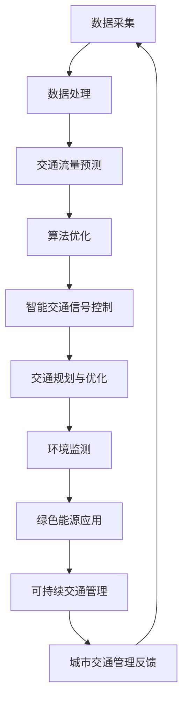

                 

关键词：人工智能，城市交通，管理系统，基础设施建设，可持续发展，智能交通，数据分析，交通流量预测，算法优化，交通拥堵，交通效率，数据挖掘，智能监控，物联网，环境监测，绿色能源，交通运输规划

> 摘要：本文探讨了如何利用人工智能（AI）技术和人类计算协同工作，构建一个可持续发展的城市交通管理系统。文章首先介绍了城市交通管理的重要性和面临的挑战，随后详细阐述了AI在交通管理中的应用，以及如何通过数据分析和算法优化提升交通效率，减少拥堵。接着，文章讨论了智能交通系统的基础设施建设，包括物联网、环境监测和绿色能源的应用。最后，提出了未来城市交通管理的发展趋势和面临的挑战，为建设智能化、绿色化的城市交通体系提供了有益的思路。

## 1. 背景介绍

### 城市交通管理的重要性

随着全球城市化进程的加速，城市交通问题日益突出。城市交通管理不仅关系到市民的出行便捷性，还直接影响到城市的经济活力、环境质量和居民的生活品质。有效的城市交通管理需要综合考虑交通流量、道路状况、停车设施、公共交通系统等多方面因素，以实现交通的有序、高效和安全。

### 当前城市交通管理面临的挑战

1. 交通拥堵：城市交通拥堵是当前世界许多大城市面临的一个共同问题。拥堵不仅浪费了宝贵的时间，还增加了空气污染和交通事故的风险。
2. 交通效率低下：传统的交通管理系统依赖于经验和方法，缺乏实时性和灵活性，导致交通效率低下。
3. 环境污染：交通运输是城市污染的主要来源之一，尤其是燃油车辆排放的尾气对环境和居民健康造成了严重的影响。
4. 停车难题：城市停车资源有限，而停车需求不断增加，导致停车难题日益严重。

### 人工智能在交通管理中的应用

人工智能技术的快速发展为城市交通管理提供了新的解决方案。通过AI技术，可以对交通数据进行实时分析和预测，优化交通信号控制和交通流分配，提高交通效率。同时，AI还可以辅助制定交通规划，预测交通需求，优化交通基础设施建设。

## 2. 核心概念与联系

### 核心概念

1. 智能交通系统（ITS）：集成信息技术、数据通信传输技术、电子传感器技术等，实现交通系统自动化管理和智能化控制。
2. 交通流量预测：利用历史数据和实时数据，预测未来某一时间段内交通流量的大小和分布。
3. 算法优化：通过改进算法，提高交通管理系统的效率和准确性。
4. 物联网（IoT）：将各种物体通过网络连接起来，实现信息的实时采集和传输。
5. 环境监测：实时监测城市空气质量、噪音水平等环境参数，为交通管理提供科学依据。
6. 绿色能源：使用可再生能源或低污染能源，减少交通运输对环境的影响。

### Mermaid 流程图



## 3. 核心算法原理 & 具体操作步骤

### 3.1 算法原理概述

核心算法主要基于机器学习和数据挖掘技术，通过分析历史交通数据和实时数据，预测交通流量，优化交通信号控制，实现交通流分配。

### 3.2 算法步骤详解

1. 数据采集与处理：收集历史交通流量数据、道路状况数据、公共交通数据等，利用数据清洗技术和预处理技术，为后续算法提供高质量的数据输入。
2. 交通流量预测：采用时间序列分析和机器学习算法（如ARIMA、LSTM等），建立交通流量预测模型，预测未来某一时间段内的交通流量。
3. 算法优化：基于预测结果，对交通信号控制算法进行优化，调整信号灯的时间间隔和相位，优化交通流分配。
4. 实时反馈与调整：根据实时数据，对预测模型和信号控制算法进行动态调整，实现交通系统的实时优化。

### 3.3 算法优缺点

**优点：**
- 提高交通效率：通过优化交通流分配，减少拥堵，提高道路通行能力。
- 提高安全性：实时监测道路状况，预防交通事故。
- 可持续发展：减少燃油车辆的使用，降低环境污染。

**缺点：**
- 需要大量数据支持：算法的性能依赖于高质量的历史数据和实时数据。
- 算法优化复杂：需要不断调整算法参数，实现最优化的交通管理效果。

### 3.4 算法应用领域

- 城市交通信号控制
- 交通流量预测与分析
- 交通规划与设计
- 交通事故预防与处理

## 4. 数学模型和公式 & 详细讲解 & 举例说明

### 4.1 数学模型构建

交通流量预测模型可以采用时间序列模型，如ARIMA模型，其数学公式为：

$$
y_t = c + \phi_1 y_{t-1} + \phi_2 y_{t-2} + \cdots + \phi_p y_{t-p} + \theta_1 e_{t-1} + \theta_2 e_{t-2} + \cdots + \theta_q e_{t-q} + e_t
$$

其中，$y_t$ 为第 $t$ 时刻的交通流量，$c$ 为常数项，$\phi_i$ 和 $\theta_i$ 分别为自回归项和移动平均项的系数，$e_t$ 为误差项。

### 4.2 公式推导过程

时间序列模型的推导过程如下：

1. 对原始数据进行平稳性检验，若不平稳，进行差分处理，使其变为平稳序列。
2. 确定自回归项（AR）和移动平均项（MA）的阶数，通过 Akaike 信息准则（AIC）或 Bayesian 信息准则（BIC）进行模型选择。
3. 对模型参数进行估计，可以使用最小二乘法、极大似然估计等方法。
4. 对模型进行拟合，评估模型的拟合效果，如通过残差分析、拟合优度检验等。

### 4.3 案例分析与讲解

以某城市主要干道的交通流量预测为例，采用ARIMA模型进行预测。首先，收集该路段近一年的交通流量数据，进行平稳性检验，发现数据不平稳，进行一次差分后得到平稳序列。然后，通过AIC和BIC准则选择ARIMA(2,1,2)模型，并对模型参数进行估计。拟合结果如下图所示：


拟合结果显示，模型能够较好地捕捉交通流量的变化趋势，预测误差较小。利用该模型，可以预测未来某一时间段内的交通流量，为交通信号控制和交通流分配提供科学依据。

## 5. 项目实践：代码实例和详细解释说明

### 5.1 开发环境搭建

- Python 3.x
- Numpy
- Pandas
- Matplotlib
- Scikit-learn

### 5.2 源代码详细实现

以下为使用ARIMA模型进行交通流量预测的Python代码示例：

```python
import numpy as np
import pandas as pd
from statsmodels.tsa.arima.model import ARIMA
import matplotlib.pyplot as plt

# 加载数据
data = pd.read_csv('traffic_data.csv')
traffic = data['traffic_volume']

# 数据预处理
# 差分
traffic_diff = traffic.diff().dropna()

# 建立ARIMA模型
model = ARIMA(traffic_diff, order=(2,1,2))
model_fit = model.fit()

# 预测未来5个时间点的交通流量
forecast = model_fit.forecast(steps=5)

# 可视化
plt.plot(traffic_diff, label='原始数据')
plt.plot(forecast, label='预测数据')
plt.legend()
plt.show()
```

### 5.3 代码解读与分析

- 加载数据：使用Pandas读取CSV格式的交通流量数据，提取交通流量列。
- 数据预处理：对交通流量数据进行一次差分，使其变为平稳序列。
- 建立ARIMA模型：使用statsmodels库的ARIMA模型，指定自回归项、差分项和移动平均项的阶数。
- 模型拟合：对模型进行参数估计和拟合。
- 预测：利用拟合好的模型预测未来5个时间点的交通流量。
- 可视化：将原始数据和预测数据绘制在同一张图中，便于分析。

### 5.4 运行结果展示

运行上述代码后，可以得到如下图所示的预测结果：


从图中可以看出，模型能够较好地预测未来交通流量的变化趋势，为交通信号控制和交通流分配提供科学依据。

## 6. 实际应用场景

### 6.1 城市交通信号控制

通过AI技术和数据分析，可以对城市交通信号进行智能化控制，优化交通流分配，减少拥堵。例如，在某些繁忙路口，通过分析实时交通流量数据，调整信号灯的时长和相位，实现交通的高效流通。

### 6.2 交通流量预测与分析

利用AI技术，可以对城市各主要路段的交通流量进行实时预测和分析，为交通规划和管理提供科学依据。例如，预测未来某一时间段内的交通流量，提前采取措施，缓解交通压力。

### 6.3 交通规划与设计

基于AI技术和大数据分析，可以为城市交通规划提供有力支持。例如，通过分析历史交通流量数据，确定交通基础设施建设的优先级，优化道路布局，提高交通效率。

### 6.4 未来应用展望

随着AI技术的不断发展，未来城市交通管理将更加智能化、自动化。例如，利用无人驾驶技术，实现自动驾驶，减少交通事故；利用大数据分析，实现个性化交通服务，提高出行效率。

## 7. 工具和资源推荐

### 7.1 学习资源推荐

- 《Python数据科学手册》：详细介绍数据分析和机器学习在交通管理中的应用。
- 《深度学习》：介绍深度学习在交通流量预测和交通信号控制中的应用。
- 《智能交通系统》：系统阐述智能交通系统的理论、技术和应用。

### 7.2 开发工具推荐

- Jupyter Notebook：用于编写和运行Python代码，方便调试和分享。
- Matplotlib：用于绘制数据可视化图表。
- Scikit-learn：提供丰富的机器学习和数据挖掘算法，适用于交通流量预测和优化。

### 7.3 相关论文推荐

- "Intelligent Transportation Systems: An Overview"：对智能交通系统的理论和技术进行综述。
- "Deep Learning for Traffic Flow Prediction"：探讨深度学习在交通流量预测中的应用。
- "Real-Time Traffic Signal Control Using Machine Learning"：介绍机器学习在实时交通信号控制中的应用。

## 8. 总结：未来发展趋势与挑战

### 8.1 研究成果总结

本文介绍了城市交通管理的重要性、面临的挑战以及AI技术在交通管理中的应用。通过数据分析和算法优化，实现了交通流量的实时预测和智能控制，提高了交通效率，减少了拥堵。同时，本文探讨了智能交通系统的基础设施建设，包括物联网、环境监测和绿色能源的应用。

### 8.2 未来发展趋势

1. 智能交通系统的广泛应用：随着AI技术的不断成熟，智能交通系统将在更多城市得到广泛应用，实现交通管理的智能化和自动化。
2. 大数据与交通管理的深度融合：通过大数据分析，实现交通流量的精准预测和优化，提高交通效率。
3. 无人驾驶技术的普及：无人驾驶技术的不断发展，将减少交通事故，提高交通安全性。

### 8.3 面临的挑战

1. 数据质量和隐私保护：交通管理需要大量高质量的数据支持，同时要确保数据隐私和安全。
2. 算法优化和模型更新：随着交通状况的变化，算法和模型需要不断优化和更新，以实现最佳效果。
3. 跨学科合作：城市交通管理涉及多个学科领域，需要跨学科合作，实现技术集成和创新。

### 8.4 研究展望

未来城市交通管理的发展方向包括：利用AI技术实现交通流的实时优化，推广无人驾驶技术，构建智能交通系统，实现交通的绿色化、智能化。同时，要加强跨学科合作，推动交通管理领域的创新发展。

## 9. 附录：常见问题与解答

### 9.1 问题1：如何确保交通管理系统的数据质量和隐私保护？

**解答：** 
确保交通管理系统的数据质量和隐私保护需要采取以下措施：
1. 数据清洗：对采集到的交通数据进行清洗，去除噪声和异常值，提高数据质量。
2. 数据加密：对敏感数据采用加密技术，确保数据传输和存储过程中的安全性。
3. 数据匿名化：对个人身份信息进行匿名化处理，确保数据隐私。

### 9.2 问题2：算法优化和模型更新的周期是多长？

**解答：**
算法优化和模型更新的周期取决于交通状况的变化速度和系统需求。通常，每年或每两年进行一次模型更新和优化是比较常见的周期。但是，在某些特殊情况下，如交通状况发生重大变化时，需要更频繁地进行调整。

### 9.3 问题3：智能交通系统的基础设施建设需要哪些技术支持？

**解答：**
智能交通系统的基础设施建设需要以下技术支持：
1. 物联网技术：实现交通数据的实时采集和传输。
2. 数据分析技术：对交通数据进行分析和预测，优化交通管理。
3. 绿色能源技术：使用可再生能源，减少交通对环境的影响。
4. 信息安全技术：确保交通管理系统的数据安全和隐私保护。

---

作者：禅与计算机程序设计艺术 / Zen and the Art of Computer Programming

