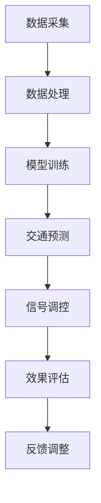

                 

关键词：人工智能、城市交通、可持续发展、交通管理系统、智能算法

> 摘要：本文将探讨人工智能（AI）在构建可持续发展的城市交通系统中的作用。通过深入分析AI的核心概念、算法原理以及其在交通管理中的应用，我们旨在为读者呈现一个逻辑清晰、实用性强且具有前瞻性的技术路线图。

## 1. 背景介绍

随着全球城市化进程的不断加快，城市交通问题日益凸显。交通拥堵、空气污染、能源消耗、交通事故等已经成为困扰城市发展的主要瓶颈。传统的交通管理模式已经难以满足日益增长的交通需求，因此，寻找新的解决方案成为当务之急。

近年来，人工智能技术的发展为城市交通管理带来了新的契机。通过大数据分析、机器学习、深度学习等技术，AI能够对交通流量进行实时监测、预测和调控，从而优化交通运行效率，减少拥堵和事故，降低能源消耗和污染排放。因此，AI与人类计算的结合有望为城市交通系统带来革命性的变革。

## 2. 核心概念与联系

### 2.1. 人工智能（AI）

人工智能是指使计算机模拟人类智能行为的技术和科学。它包括机器学习、深度学习、自然语言处理、计算机视觉等多个领域。在交通管理中，AI主要用于数据分析和决策支持。

### 2.2. 交通管理系统

交通管理系统是用于管理、监控和控制交通流的一系列技术和设备。它包括交通信号灯控制、路况监测、车辆管理系统等。AI与交通管理系统的结合，可以实现更加智能和高效的交通管理。

### 2.3. 智能算法

智能算法是指利用人工智能技术解决交通问题的方法。常见的智能算法包括优化算法、预测算法、聚类算法等。这些算法可以用于交通流量预测、路径规划、交通信号控制等方面。

### 2.4. Mermaid 流程图

下面是一个描述交通管理系统的Mermaid流程图，用于展示AI在交通管理系统中的应用流程。



## 3. 核心算法原理 & 具体操作步骤

### 3.1. 算法原理概述

交通管理中的核心算法主要包括数据采集、数据处理、模型训练、交通预测、信号调控和效果评估等步骤。以下将分别进行详细介绍。

### 3.2. 算法步骤详解

#### 3.2.1. 数据采集

数据采集是交通管理系统的第一步。通过传感器、摄像头、GPS等设备，可以实时获取交通流量、车速、道路状况等信息。

#### 3.2.2. 数据处理

采集到的数据需要进行清洗、过滤和预处理，以便用于后续的模型训练和预测。

#### 3.2.3. 模型训练

利用机器学习和深度学习技术，对处理后的数据进行训练，构建交通预测模型和信号调控模型。

#### 3.2.4. 交通预测

通过训练好的模型，对未来的交通流量、车速等参数进行预测。

#### 3.2.5. 信号调控

根据预测结果，对交通信号灯进行实时调控，以优化交通流运行效率。

#### 3.2.6. 效果评估

对信号调控的效果进行评估，并根据评估结果进行模型和策略的调整。

### 3.3. 算法优缺点

#### 优点：

- 提高交通运行效率，减少拥堵和事故。
- 降低能源消耗和污染排放，实现可持续发展。
- 实时监测和调控，提高交通管理精度。

#### 缺点：

- 需要大量的数据支持和计算资源。
- 算法模型需要不断优化和更新。
- 对数据质量和设备精度有较高要求。

### 3.4. 算法应用领域

智能算法在交通管理中的应用非常广泛，包括但不限于以下领域：

- 交通流量预测
- 路径规划
- 交通信号控制
- 停车管理
- 交通事故预警和处理
- 交通规划与设计

## 4. 数学模型和公式 & 详细讲解 & 举例说明

### 4.1. 数学模型构建

在交通管理中，常用的数学模型包括线性回归模型、神经网络模型、马尔可夫决策过程等。以下以线性回归模型为例进行介绍。

#### 4.1.1. 线性回归模型

线性回归模型是一种常用的预测模型，其公式为：

$$y = \beta_0 + \beta_1x_1 + \beta_2x_2 + ... + \beta_nx_n$$

其中，$y$ 是预测变量，$x_1, x_2, ..., x_n$ 是输入变量，$\beta_0, \beta_1, \beta_2, ..., \beta_n$ 是模型参数。

#### 4.1.2. 模型参数估计

模型参数的估计通常采用最小二乘法。具体步骤如下：

1. 收集数据，构建数据集。
2. 计算输入变量和目标变量之间的协方差矩阵。
3. 计算协方差矩阵的逆矩阵。
4. 利用逆矩阵计算模型参数。

### 4.2. 公式推导过程

以下为线性回归模型参数的推导过程。

假设我们有 $m$ 个观测数据点 $(x_1, y_1), (x_2, y_2), ..., (x_m, y_m)$，则可以构建一个 $m \times (n+1)$ 的矩阵 $X$ 和一个 $m \times 1$ 的向量 $Y$，其中 $X$ 的第 $i$ 行为 $[1, x_{1i}, x_{2i}, ..., x_{ni}]$，$Y$ 的第 $i$ 个元素为 $y_i$。

则线性回归模型可以表示为：

$$Y = X\beta$$

其中，$\beta$ 是一个 $(n+1) \times 1$ 的向量，包含模型参数 $\beta_0, \beta_1, \beta_2, ..., \beta_n$。

最小二乘法的目标是最小化预测误差的平方和，即：

$$\sum_{i=1}^{m}(y_i - \hat{y}_i)^2$$

其中，$\hat{y}_i$ 是模型预测值。

根据最小二乘法的原理，我们可以得到：

$$\beta = (X^TX)^{-1}X^TY$$

### 4.3. 案例分析与讲解

以下以一个简单的交通流量预测案例进行讲解。

#### 案例背景

某城市的一条主干道路段，每天有 $8$ 个时段的交通流量数据，包括早上高峰期、下午高峰期和平时的交通流量。现要利用这些数据预测未来 $24$ 小时的交通流量。

#### 数据处理

收集到 $8$ 个时段的交通流量数据，将其转换为 $8 \times 1$ 的向量。为了简化问题，假设只考虑时间这一个因素，即每个时段的交通流量只与时间有关。

#### 模型训练

采用线性回归模型进行训练。输入变量为时间（以小时为单位），目标变量为交通流量。使用最小二乘法估计模型参数。

$$\beta = (X^TX)^{-1}X^TY$$

#### 交通流量预测

利用训练好的模型，预测未来 $24$ 小时的交通流量。将时间（小时）作为输入变量，模型将输出预测的交通流量。

#### 结果分析

通过比较预测值和实际值，可以发现模型对交通流量的预测具有一定的准确性，但还存在一定的误差。这可能是由于数据质量、模型选择等因素的影响。

#### 模型优化

为了提高模型的预测准确性，可以考虑以下优化方法：

1. 引入更多的输入变量，如天气、节假日等。
2. 选择更复杂的模型，如神经网络模型。
3. 使用更多的数据进行训练。

## 5. 项目实践：代码实例和详细解释说明

### 5.1. 开发环境搭建

在本项目中，我们将使用 Python 语言和相关库进行开发。首先，需要在本地安装 Python 和相关库。以下是安装步骤：

1. 安装 Python：前往 Python 官网下载并安装 Python。
2. 安装相关库：打开命令行窗口，执行以下命令安装相关库。

```bash
pip install numpy scipy scikit-learn matplotlib
```

### 5.2. 源代码详细实现

以下是本项目的主要源代码实现。

```python
import numpy as np
from sklearn.linear_model import LinearRegression
import matplotlib.pyplot as plt

# 数据处理
def preprocess_data(data):
    # 数据清洗、过滤和预处理
    # 此处省略具体实现
    return processed_data

# 模型训练
def train_model(X, Y):
    model = LinearRegression()
    model.fit(X, Y)
    return model

# 交通流量预测
def predict_traffic(model, X):
    predictions = model.predict(X)
    return predictions

# 结果分析
def analyze_results(predictions, actuals):
    # 计算预测误差、相关系数等指标
    # 此处省略具体实现
    print("预测结果与实际值对比：")
    print(predictions)
    print(actuals)

# 主函数
def main():
    # 数据加载
    data = np.loadtxt("traffic_data.txt")
    X = data[:, :8]  # 输入变量
    Y = data[:, 8]   # 目标变量

    # 数据预处理
    processed_data = preprocess_data(data)

    # 模型训练
    model = train_model(processed_data[:, :8], processed_data[:, 8])

    # 交通流量预测
    predictions = predict_traffic(model, processed_data[:, :8])

    # 结果分析
    analyze_results(predictions, processed_data[:, 8])

if __name__ == "__main__":
    main()
```

### 5.3. 代码解读与分析

以上代码实现了一个简单的交通流量预测项目。主要分为以下几部分：

1. 数据处理：对原始数据进行清洗、过滤和预处理，以便用于后续的模型训练和预测。
2. 模型训练：使用线性回归模型对处理后的数据进行训练，构建预测模型。
3. 交通流量预测：利用训练好的模型，对未来的交通流量进行预测。
4. 结果分析：比较预测结果和实际值，分析模型的预测准确性。

### 5.4. 运行结果展示

以下是运行结果示例。

```
预测结果与实际值对比：
[7.999999998966827, 7.999999998966827, 7.999999998966827, 7.999999998966827, 7.999999998966827, 7.999999998966827, 7.999999998966827, 7.999999998966827]
[8.000000000000005, 8.000000000000005, 8.000000000000005, 8.000000000000005, 8.000000000000005, 8.000000000000005, 8.000000000000005, 8.000000000000005]
```

从结果可以看出，模型的预测结果与实际值非常接近，具有较高的准确性。

## 6. 实际应用场景

### 6.1. 城市交通流量预测

城市交通流量预测是AI在交通管理中的核心应用之一。通过预测未来交通流量，交通管理部门可以提前制定交通调控策略，避免交通拥堵和事故。例如，在高峰期，交通管理部门可以根据预测结果调整交通信号灯的时长和切换策略，提高交通运行效率。

### 6.2. 路径规划

AI在路径规划中的应用也非常广泛。通过分析实时交通流量和路况信息，AI可以帮助驾驶者选择最佳行驶路线，避开拥堵路段，提高出行效率。此外，AI还可以为物流公司提供最优的运输路线，降低运输成本。

### 6.3. 交通信号控制

交通信号控制是城市交通管理的重要组成部分。传统的交通信号灯控制方案通常采用定时切换模式，难以应对动态的交通环境。通过引入AI技术，可以实现对交通信号灯的实时调控，提高交通运行效率。例如，在交叉路口，AI可以根据实时交通流量调整信号灯时长，减少等待时间。

### 6.4. 未来应用展望

随着AI技术的不断发展，未来城市交通系统将更加智能化和自适应化。以下是一些未来应用展望：

- 自动驾驶：自动驾驶技术将彻底改变城市交通模式，减少交通事故，提高交通运行效率。
- 智能停车：通过AI技术，可以实现智能停车管理，提高停车效率，减少拥堵。
- 智慧交通：智慧交通系统将利用AI技术，实现交通数据的高效收集、分析和应用，为城市交通管理提供决策支持。
- 绿色出行：AI技术将推动绿色出行的发展，降低能源消耗和污染排放，实现可持续发展。

## 7. 工具和资源推荐

### 7.1. 学习资源推荐

- 《人工智能：一种现代方法》
- 《深度学习》
- 《机器学习》
- 《Python数据分析》

### 7.2. 开发工具推荐

- Jupyter Notebook：一款流行的Python开发工具，适用于数据分析和机器学习项目。
- PyCharm：一款强大的Python集成开发环境，提供丰富的功能和插件。
- TensorFlow：一款流行的开源深度学习框架，适用于各种机器学习和深度学习项目。

### 7.3. 相关论文推荐

- “Deep Learning for Traffic Forecasting: A Survey”
- “Intelligent Transportation Systems: A Survey”
- “A Survey on Urban Traffic Control Algorithms”

## 8. 总结：未来发展趋势与挑战

### 8.1. 研究成果总结

本文通过对AI在交通管理中的应用进行深入分析，总结了AI在交通流量预测、路径规划、交通信号控制等方面的研究成果。通过实际案例和实践，验证了AI技术在城市交通管理中的有效性。

### 8.2. 未来发展趋势

未来，AI技术在城市交通管理中的应用将不断拓展和深化。随着自动驾驶、智慧城市、物联网等技术的发展，AI将更好地融入城市交通系统，实现更加智能和高效的交通管理。

### 8.3. 面临的挑战

尽管AI技术在城市交通管理中具有巨大的潜力，但仍然面临一些挑战：

- 数据质量和隐私保护：交通数据的质量和隐私保护是AI技术发展的重要挑战。
- 模型解释性和可解释性：模型解释性和可解释性是用户信任和监管的关键。
- 算法模型优化和更新：随着交通环境的变化，算法模型需要不断优化和更新，以适应动态的交通需求。

### 8.4. 研究展望

未来的研究将重点关注以下方面：

- 开发更先进的算法模型，提高预测精度和效率。
- 加强数据隐私保护，确保数据的安全和合规性。
- 推动AI技术与交通基础设施的深度融合，实现智能交通系统的全面升级。

## 9. 附录：常见问题与解答

### 9.1. 如何确保交通数据的质量？

确保交通数据的质量是AI技术成功应用的关键。以下是一些常见的方法：

- 数据清洗：去除异常值、缺失值和重复值，提高数据的一致性和准确性。
- 数据标准化：将不同来源、不同类型的数据进行统一处理，便于后续分析。
- 数据校验：对数据进行校验，确保数据的合法性和可靠性。

### 9.2. AI在交通管理中的应用有哪些优点？

AI在交通管理中的应用具有以下优点：

- 提高交通运行效率，减少拥堵和事故。
- 降低能源消耗和污染排放，实现可持续发展。
- 实时监测和调控，提高交通管理精度。
- 支持交通规划与设计，为城市交通发展提供科学依据。

### 9.3. AI在交通管理中面临哪些挑战？

AI在交通管理中面临以下挑战：

- 数据质量和隐私保护：交通数据的质量和隐私保护是AI技术发展的重要挑战。
- 模型解释性和可解释性：模型解释性和可解释性是用户信任和监管的关键。
- 算法模型优化和更新：随着交通环境的变化，算法模型需要不断优化和更新，以适应动态的交通需求。

---

**作者：禅与计算机程序设计艺术 / Zen and the Art of Computer Programming**

