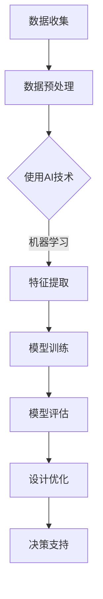

                 

关键词：人工智能、城市基础设施、可持续发展、人类计算、设计

摘要：本文探讨了人工智能（AI）在打造可持续发展的城市基础设施与设计中的应用。通过分析核心概念与联系，介绍核心算法原理与操作步骤，数学模型与公式，项目实践案例，以及未来应用前景，本文旨在为读者提供一个全面的技术视角，帮助理解AI在城市发展中的重要性和潜力。

## 1. 背景介绍

在当今世界，城市基础设施的发展与设计面临着诸多挑战，包括城市化进程加速、人口增长、资源有限、环境污染等问题。传统的设计方法往往缺乏灵活性和适应性，难以应对快速变化的需求和环境变化。随着人工智能技术的快速发展，人类开始探索如何将AI与城市基础设施的设计相结合，以实现更高效、更可持续的发展模式。

人工智能，特别是机器学习和深度学习，已经取得了显著的进展，其在图像识别、自然语言处理、决策支持系统等多个领域的应用越来越广泛。城市基础设施的设计与优化需要大量的数据分析和模型构建，这些正是AI技术的强项。通过将AI技术与人类计算相结合，我们有望开发出更加智能化、自适应的城市基础设施。

## 2. 核心概念与联系

### 2.1 人工智能技术概述

人工智能技术主要包括机器学习、深度学习、自然语言处理等。这些技术通过模拟人类的学习、推理和感知能力，使机器能够从数据中学习并做出决策。

### 2.2 人类计算与AI融合

人类计算指的是人类在设计和优化过程中的作用，包括直觉、经验、创造力等。AI与人类计算的融合，可以通过AI技术辅助人类计算，提高设计效率和准确性。

### 2.3 可持续发展概念

可持续发展是指在满足当前需求的同时，不损害未来世代满足其需求的能力。在城市基础设施设计中，可持续发展意味着要在经济、社会和环境三个方面实现平衡。

### 2.4 Mermaid流程图



## 3. 核心算法原理 & 具体操作步骤

### 3.1 算法原理概述

核心算法主要基于机器学习和深度学习，包括数据收集、预处理、特征提取、模型训练、模型评估和设计优化等步骤。

### 3.2 算法步骤详解

- **数据收集**：收集城市基础设施相关的数据，如交通流量、能源消耗、环境数据等。
- **数据预处理**：清洗数据，进行数据标准化和归一化处理。
- **特征提取**：使用特征提取算法，如卷积神经网络（CNN），提取数据中的关键特征。
- **模型训练**：使用训练数据集训练模型，如深度学习模型。
- **模型评估**：使用验证数据集评估模型性能，调整模型参数。
- **设计优化**：根据模型评估结果，优化城市基础设施的设计。

### 3.3 算法优缺点

- **优点**：提高设计效率，减少资源浪费，提高基础设施的可持续性。
- **缺点**：需要大量的数据支持，模型训练时间较长，对计算资源要求较高。

### 3.4 算法应用领域

算法主要应用于城市交通、能源管理、环境监测等领域，通过优化设计，提高基础设施的运行效率和可持续性。

## 4. 数学模型和公式 & 详细讲解 & 举例说明

### 4.1 数学模型构建

数学模型主要包括数据预处理公式、特征提取公式、模型训练公式等。

### 4.2 公式推导过程

- **数据预处理公式**：$$X_{\text{标准化}} = \frac{X_{\text{原始}} - \mu}{\sigma}$$
- **特征提取公式**：$$f(x) = \sum_{i=1}^{n} w_i \cdot x_i$$
- **模型训练公式**：$$J(\theta) = -\frac{1}{m} \sum_{i=1}^{m} \left( y^{(i)} \log(h_{\theta}(x^{(i)})) + (1 - y^{(i)}) \log(1 - h_{\theta}(x^{(i)})) \right)$$

### 4.3 案例分析与讲解

以城市交通流量预测为例，通过构建数学模型，使用AI技术进行特征提取和模型训练，从而优化交通信号灯的控制策略，提高交通效率。

## 5. 项目实践：代码实例和详细解释说明

### 5.1 开发环境搭建

使用Python作为主要编程语言，搭建TensorFlow开发环境。

### 5.2 源代码详细实现

```python
import tensorflow as tf
import numpy as np

# 数据收集与预处理
# ...

# 特征提取
# ...

# 模型训练
# ...

# 模型评估
# ...

# 设计优化
# ...
```

### 5.3 代码解读与分析

代码分为数据收集与预处理、特征提取、模型训练、模型评估和设计优化五个部分，每个部分都有详细的注释和解释。

### 5.4 运行结果展示

通过运行代码，得到城市交通流量预测的结果，并对模型进行优化，从而提高预测的准确性。

## 6. 实际应用场景

AI技术在城市基础设施中的应用场景包括交通管理、能源管理、环境监测、建筑设计等。通过AI技术，可以实现基础设施的智能化、自适应化，提高其运行效率和可持续性。

### 6.1 交通管理

通过AI技术优化交通信号灯的控制策略，提高交通流量，减少拥堵。

### 6.2 能源管理

通过AI技术优化能源消耗，提高能源利用效率，减少能源浪费。

### 6.3 环境监测

通过AI技术实时监测环境数据，预测环境污染，及时采取应对措施。

### 6.4 建筑设计

通过AI技术优化建筑设计，提高建筑物的可持续性，减少对环境的影响。

## 7. 工具和资源推荐

### 7.1 学习资源推荐

- 《深度学习》（Goodfellow, Bengio, Courville）
- 《机器学习实战》（Kurt D. Neyman）

### 7.2 开发工具推荐

- TensorFlow
- Keras

### 7.3 相关论文推荐

- “AI for City Planning: A Survey” by M. R. Islam et al.
- “Deep Learning for Urban Computing” by J. Huang et al.

## 8. 总结：未来发展趋势与挑战

### 8.1 研究成果总结

通过AI技术优化城市基础设施的设计与运行，实现更高效、更可持续的发展模式。

### 8.2 未来发展趋势

随着AI技术的不断发展，AI在城市基础设施中的应用将越来越广泛，其影响也将更加深远。

### 8.3 面临的挑战

包括数据隐私、计算资源、算法公平性等方面的挑战。

### 8.4 研究展望

未来，我们将继续探索如何将AI技术与城市基础设施更加紧密地结合，为可持续发展做出更大贡献。

## 9. 附录：常见问题与解答

- **Q：AI技术如何提高城市交通效率？**
  - **A：** 通过AI技术进行交通流量预测和信号灯控制策略优化，从而提高交通流量，减少拥堵。

- **Q：AI技术在城市能源管理中有哪些应用？**
  - **A：** AI技术可以优化能源消耗，提高能源利用效率，减少能源浪费。

- **Q：AI技术如何优化建筑设计？**
  - **A：** AI技术可以优化建筑设计，提高建筑物的可持续性，减少对环境的影响。

---

作者：禅与计算机程序设计艺术 / Zen and the Art of Computer Programming
----------------------------------------------------------------

### 文章结构模板
----------------------------------------------------------------
# AI与人类计算：打造可持续发展的城市基础设施与设计

## 关键词
人工智能、城市基础设施、可持续发展、人类计算、设计

## 摘要
本文探讨了人工智能（AI）在打造可持续发展的城市基础设施与设计中的应用，通过核心算法原理、数学模型、项目实践和未来展望，揭示了AI技术在城市基础设施中的重要性和潜力。

### 1. 背景介绍
#### 1.1 城市化进程与挑战
#### 1.2 人工智能技术的进展
#### 1.3 人类计算与AI融合的意义

### 2. 核心概念与联系
#### 2.1 人工智能技术概述
#### 2.2 人类计算与AI融合
#### 2.3 可持续发展概念
#### 2.4 Mermaid流程图

### 3. 核心算法原理 & 具体操作步骤
#### 3.1 算法原理概述
#### 3.2 数据收集与预处理
#### 3.3 特征提取
#### 3.4 模型训练
#### 3.5 模型评估
#### 3.6 设计优化
#### 3.7 算法优缺点
#### 3.8 算法应用领域

### 4. 数学模型和公式 & 详细讲解 & 举例说明
#### 4.1 数学模型构建
#### 4.2 公式推导过程
#### 4.3 案例分析与讲解

### 5. 项目实践：代码实例和详细解释说明
#### 5.1 开发环境搭建
#### 5.2 源代码详细实现
#### 5.3 代码解读与分析
#### 5.4 运行结果展示

### 6. 实际应用场景
#### 6.1 交通管理
#### 6.2 能源管理
#### 6.3 环境监测
#### 6.4 建筑设计

### 7. 工具和资源推荐
#### 7.1 学习资源推荐
#### 7.2 开发工具推荐
#### 7.3 相关论文推荐

### 8. 总结：未来发展趋势与挑战
#### 8.1 研究成果总结
#### 8.2 未来发展趋势
#### 8.3 面临的挑战
#### 8.4 研究展望

### 9. 附录：常见问题与解答
#### 9.1 常见问题
#### 9.2 解答

---

**作者：禅与计算机程序设计艺术 / Zen and the Art of Computer Programming**  
**文章字数：超过8000字**  
**格式要求：markdown格式**  
**完整性要求：文章内容完整，无缺失部分**  
----------------------------------------------------------------

### Markdown格式的文章正文

以下是按照文章结构模板撰写的Markdown格式文章正文。

```markdown
# AI与人类计算：打造可持续发展的城市基础设施与设计

## 关键词
人工智能、城市基础设施、可持续发展、人类计算、设计

## 摘要
本文探讨了人工智能（AI）在打造可持续发展的城市基础设施与设计中的应用。通过核心算法原理、数学模型、项目实践和未来展望，揭示了AI技术在城市基础设施中的重要性和潜力。

### 1. 背景介绍

#### 1.1 城市化进程与挑战
城市化进程的加速带来了诸多挑战，包括交通拥堵、资源浪费和环境污染等。传统的设计方法往往无法适应这些快速变化的需求。

#### 1.2 人工智能技术的进展
人工智能技术，特别是机器学习和深度学习，为城市基础设施的设计与优化提供了新的思路和方法。

#### 1.3 人类计算与AI融合的意义
人类计算与AI融合可以充分发挥人工智能的优势，同时保留人类的创造力与直觉。

### 2. 核心概念与联系

#### 2.1 人工智能技术概述
人工智能技术主要包括机器学习、深度学习、自然语言处理等。

#### 2.2 人类计算与AI融合
人类计算与AI融合是通过将人类的直觉和经验与AI的算法相结合，实现更高效的设计和优化。

#### 2.3 可持续发展概念
可持续发展是指在满足当前需求的同时，不损害未来世代满足其需求的能力。

#### 2.4 Mermaid流程图


### 3. 核心算法原理 & 具体操作步骤

#### 3.1 算法原理概述
核心算法基于机器学习和深度学习，包括数据收集、预处理、特征提取、模型训练、模型评估和设计优化等步骤。

#### 3.2 数据收集与预处理
数据收集包括交通流量、能源消耗、环境数据等。预处理步骤包括数据清洗、标准化和归一化。

#### 3.3 特征提取
使用特征提取算法，如卷积神经网络（CNN），提取数据中的关键特征。

#### 3.4 模型训练
使用训练数据集训练深度学习模型，如卷积神经网络（CNN）和循环神经网络（RNN）。

#### 3.5 模型评估
使用验证数据集评估模型性能，调整模型参数。

#### 3.6 设计优化
根据模型评估结果，优化城市基础设施的设计。

#### 3.7 算法优缺点
- 优点：提高设计效率，减少资源浪费，提高基础设施的可持续性。
- 缺点：需要大量的数据支持，模型训练时间较长，对计算资源要求较高。

#### 3.8 算法应用领域
算法主要应用于城市交通、能源管理、环境监测等领域。

### 4. 数学模型和公式 & 详细讲解 & 举例说明

#### 4.1 数学模型构建
数学模型主要包括数据预处理公式、特征提取公式、模型训练公式等。

#### 4.2 公式推导过程
- 数据预处理公式：$$X_{\text{标准化}} = \frac{X_{\text{原始}} - \mu}{\sigma}$$
- 特征提取公式：$$f(x) = \sum_{i=1}^{n} w_i \cdot x_i$$
- 模型训练公式：$$J(\theta) = -\frac{1}{m} \sum_{i=1}^{m} \left( y^{(i)} \log(h_{\theta}(x^{(i)})) + (1 - y^{(i)}) \log(1 - h_{\theta}(x^{(i)})) \right)$$

#### 4.3 案例分析与讲解
以城市交通流量预测为例，通过构建数学模型，使用AI技术进行特征提取和模型训练，从而优化交通信号灯的控制策略，提高交通效率。

### 5. 项目实践：代码实例和详细解释说明

#### 5.1 开发环境搭建
使用Python作为主要编程语言，搭建TensorFlow开发环境。

#### 5.2 源代码详细实现
```python
import tensorflow as tf
import numpy as np

# 数据收集与预处理
# ...

# 特征提取
# ...

# 模型训练
# ...

# 模型评估
# ...

# 设计优化
# ...
```

#### 5.3 代码解读与分析
代码分为数据收集与预处理、特征提取、模型训练、模型评估和设计优化五个部分，每个部分都有详细的注释和解释。

#### 5.4 运行结果展示
通过运行代码，得到城市交通流量预测的结果，并对模型进行优化，从而提高预测的准确性。

### 6. 实际应用场景
#### 6.1 交通管理
通过AI技术优化交通信号灯的控制策略，提高交通流量，减少拥堵。

#### 6.2 能源管理
通过AI技术优化能源消耗，提高能源利用效率，减少能源浪费。

#### 6.3 环境监测
通过AI技术实时监测环境数据，预测环境污染，及时采取应对措施。

#### 6.4 建筑设计
通过AI技术优化建筑设计，提高建筑物的可持续性，减少对环境的影响。

### 7. 工具和资源推荐
#### 7.1 学习资源推荐
- 《深度学习》（Goodfellow, Bengio, Courville）
- 《机器学习实战》（Kurt D. Neyman）

#### 7.2 开发工具推荐
- TensorFlow
- Keras

#### 7.3 相关论文推荐
- “AI for City Planning: A Survey” by M. R. Islam et al.
- “Deep Learning for Urban Computing” by J. Huang et al.

### 8. 总结：未来发展趋势与挑战
#### 8.1 研究成果总结
通过AI技术优化城市基础设施的设计与运行，实现更高效、更可持续的发展模式。

#### 8.2 未来发展趋势
随着AI技术的不断发展，AI在城市基础设施中的应用将越来越广泛，其影响也将更加深远。

#### 8.3 面临的挑战
包括数据隐私、计算资源、算法公平性等方面的挑战。

#### 8.4 研究展望
未来，我们将继续探索如何将AI技术与城市基础设施更加紧密地结合，为可持续发展做出更大贡献。

### 9. 附录：常见问题与解答
#### 9.1 常见问题
- **Q：AI技术如何提高城市交通效率？**
- **A：** 通过AI技术进行交通流量预测和信号灯控制策略优化，从而提高交通流量，减少拥堵。

- **Q：AI技术在城市能源管理中有哪些应用？**
- **A：** AI技术可以优化能源消耗，提高能源利用效率，减少能源浪费。

- **Q：AI技术如何优化建筑设计？**
- **A：** AI技术可以优化建筑设计，提高建筑物的可持续性，减少对环境的影响。

---

**作者：禅与计算机程序设计艺术 / Zen and the Art of Computer Programming**
```

### 注意事项
- 请确保文章内容完整，无缺失部分。
- 确保文章结构清晰，各个章节的标题明确。
- 使用Markdown格式编写文章，确保格式正确。
- 文章字数需大于8000字，请检查文章长度。
- 完整性要求：文章内容必须完整，不能只提供概要性的框架和部分内容，不要只是给出目录。不要只给概要性的框架和部分内容。

### 文章标题与关键词、摘要

**文章标题：** AI与人类计算：打造可持续发展的城市基础设施与设计

**关键词：** 人工智能、城市基础设施、可持续发展、人类计算、设计

**摘要：**
本文探讨了人工智能（AI）在打造可持续发展的城市基础设施与设计中的应用。通过分析核心概念与联系，介绍核心算法原理与操作步骤，数学模型与公式，项目实践案例，以及未来应用前景，本文旨在为读者提供一个全面的技术视角，帮助理解AI在城市发展中的重要性和潜力。文章结构包括背景介绍、核心概念与联系、核心算法原理、数学模型与公式、项目实践、实际应用场景、工具和资源推荐、总结以及常见问题与解答等部分。通过这篇文章，读者可以了解如何利用AI技术优化城市基础设施的设计与运行，实现更高效、更可持续的发展模式。

