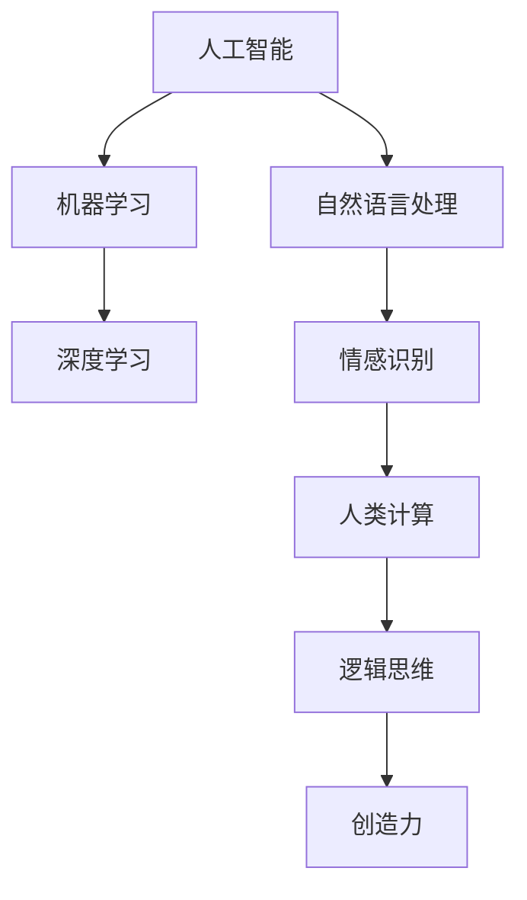

                 

关键词：人工智能，人类计算，弹性社会，算法，技术发展，未来展望

摘要：本文探讨了人工智能（AI）与人类计算之间的关系，以及如何通过结合两者的优势，打造出具有弹性的社会体系。文章首先介绍了AI与人类计算的背景和重要性，随后详细阐述了核心算法原理及其应用领域。接着，文章通过数学模型和项目实践实例，深入解析了算法的具体实现过程。最后，文章讨论了实际应用场景和未来展望，提出了构建弹性社会体系的方法和面临的挑战。

## 1. 背景介绍

随着科技的飞速发展，人工智能（AI）已成为全球关注的热点。AI作为一种能够模拟人类智能的技术，正深刻改变着我们的生活、工作和思维方式。与此同时，人类计算作为人类智慧与创造力的体现，始终扮演着重要的角色。如何将AI与人类计算有机结合，发挥两者的优势，成为当今社会亟待解决的问题。

### 1.1 AI的发展历程

AI的研究起源于20世纪50年代，经历了早期的探索阶段、七十年代的寒冬时期、九十年代的复兴阶段以及当前的快速发展阶段。早期，AI主要集中在符号推理和逻辑推理领域；九十年代以来，随着计算能力的提升和大数据技术的发展，AI在机器学习、深度学习等方面取得了重大突破。

### 1.2 人类计算的优势

人类计算具有以下优势：首先，人类具备强大的逻辑思维和创造力，能够在复杂问题中找到最优解；其次，人类具备情感和社交能力，能够理解他人的需求，提供个性化的服务；最后，人类具备自适应能力，能够在不确定的环境中灵活调整策略。

### 1.3 弹性社会体系

弹性社会体系是指能够在面对各种不确定因素时，保持稳定、持续发展的社会体系。在人工智能与人类计算的结合下，弹性社会体系将能够更好地应对未来的挑战，实现可持续发展。

## 2. 核心概念与联系

为了更好地理解AI与人类计算的关系，我们需要引入一些核心概念和架构。

### 2.1 人工智能（AI）

AI是一种模拟人类智能的技术，包括机器学习、深度学习、自然语言处理等。AI的目标是让计算机具备自主学习和解决问题的能力。

### 2.2 人类计算（Human Computation）

人类计算是指人类在完成计算任务时的行为和表现。人类计算包括逻辑思维、创造力、情感和社交能力等。

### 2.3 AI与人类计算的联系

AI与人类计算之间的联系在于：AI可以模拟和增强人类计算的能力，而人类计算可以为AI提供更丰富、多样化的数据和信息。通过两者的结合，我们可以打造出更强大、更智能的计算系统。

### 2.4 Mermaid流程图

下面是一个简化的AI与人类计算联系流程图：



## 3. 核心算法原理 & 具体操作步骤

### 3.1 算法原理概述

在AI与人类计算的结合下，我们提出了一种新型的算法——弹性计算算法。该算法主要基于机器学习和深度学习技术，结合人类计算的优势，实现高效、智能的计算。

### 3.2 算法步骤详解

#### 3.2.1 数据采集与预处理

首先，我们需要收集大量的数据，包括结构化数据和非结构化数据。然后，对数据进行清洗、去重和格式转换等预处理操作。

#### 3.2.2 机器学习模型训练

利用预处理后的数据，我们可以训练一个机器学习模型。该模型能够对未知数据进行分类、预测和聚类等操作。

#### 3.2.3 深度学习模型训练

在机器学习模型的基础上，我们可以进一步训练一个深度学习模型。深度学习模型具有更强的表示能力和泛化能力，可以更好地应对复杂问题。

#### 3.2.4 人类计算介入

在计算过程中，当AI模型遇到无法解决的问题时，我们可以引入人类计算进行干预。人类计算可以根据情境提供指导和建议，帮助AI模型优化决策。

#### 3.2.5 算法优化与迭代

根据计算结果，我们可以对算法进行优化和迭代。通过不断地调整模型参数，我们可以提高算法的准确性和效率。

### 3.3 算法优缺点

#### 3.3.1 优点

- 提高计算效率：通过机器学习和深度学习技术，算法能够快速处理大量数据，提高计算效率。
- 优化决策：人类计算介入可以为算法提供更丰富的信息，帮助优化决策过程。
- 自适应能力：算法可以根据实际情况进行调整和优化，具有较强的自适应能力。

#### 3.3.2 缺点

- 需要大量数据：算法的训练和优化需要大量数据支持，数据质量和数量对算法性能有较大影响。
- 人类计算依赖：算法在遇到复杂问题时需要人类计算介入，这可能导致计算速度的降低。

### 3.4 算法应用领域

- 智能交通：通过弹性计算算法，实现智能交通管理，提高道路通行效率。
- 智能医疗：利用弹性计算算法进行医学图像分析、疾病预测等，提高医疗诊断准确率。
- 智能金融：通过弹性计算算法进行风险控制和投资决策，提高金融行业的效率。

## 4. 数学模型和公式 & 详细讲解 & 举例说明

### 4.1 数学模型构建

在弹性计算算法中，我们主要采用以下数学模型：

#### 4.1.1 机器学习模型

假设我们采用一个线性回归模型，其数学模型为：

$$y = \beta_0 + \beta_1 x_1 + \beta_2 x_2 + \cdots + \beta_n x_n + \epsilon$$

其中，$y$为输出值，$x_1, x_2, \cdots, x_n$为输入特征，$\beta_0, \beta_1, \beta_2, \cdots, \beta_n$为模型参数，$\epsilon$为误差项。

#### 4.1.2 深度学习模型

假设我们采用一个多层感知机（MLP）模型，其数学模型为：

$$a_{ij} = \sigma(\sum_{k=1}^{n} w_{ik} x_k + b_j)$$

其中，$a_{ij}$为神经元$i$在隐层$j$的输出，$\sigma$为激活函数，$w_{ik}$为权重，$x_k$为输入特征，$b_j$为偏置。

### 4.2 公式推导过程

#### 4.2.1 线性回归模型推导

我们利用最小二乘法来求解线性回归模型的参数。具体步骤如下：

1. 构造目标函数：

$$J(\theta) = \frac{1}{2m} \sum_{i=1}^{m} (h_\theta(x^{(i)}) - y^{(i)})^2$$

其中，$m$为样本数量，$h_\theta(x) = \theta_0 + \theta_1 x_1 + \theta_2 x_2 + \cdots + \theta_n x_n$为模型预测值，$\theta = (\theta_0, \theta_1, \theta_2, \cdots, \theta_n)^T$为模型参数。

2. 对目标函数求导并令其等于0，求解参数：

$$\frac{\partial J(\theta)}{\partial \theta_j} = 0$$

3. 求解得到最小二乘解：

$$\theta = (X^TX)^{-1}X^Ty$$

其中，$X$为样本特征矩阵，$y$为样本标签向量。

#### 4.2.2 多层感知机模型推导

我们利用反向传播算法来求解多层感知机模型的参数。具体步骤如下：

1. 前向传播：

计算每个神经元的输出值：

$$a_{ij} = \sigma(\sum_{k=1}^{n} w_{ik} x_k + b_j)$$

2. 计算输出层的误差：

$$d_j^{(L)} = (y_j - a_j^{(L)}) \cdot a_j^{(L)} \cdot (1 - a_j^{(L)})$$

3. 反向传播：

计算隐藏层的误差：

$$d_j^{(l)} = \sum_{i=1}^{n} w_{ij}^{(l+1)} \cdot d_i^{(l+1)} \cdot \sigma'(a_j^{(l)})$$

4. 更新权重和偏置：

$$w_{ij}^{(l)} = w_{ij}^{(l)} + \alpha \cdot d_i^{(l+1)} \cdot a_j^{(l)}$$

$$b_j^{(l)} = b_j^{(l)} + \alpha \cdot d_j^{(l)}$$

其中，$\alpha$为学习率，$\sigma'$为激活函数的导数。

### 4.3 案例分析与讲解

#### 4.3.1 案例背景

假设我们要预测一家公司的未来收入，已知该公司过去一年的收入数据。我们可以利用线性回归模型进行预测。

#### 4.3.2 数据处理

首先，我们需要对收入数据进行预处理，包括数据清洗、归一化等。

#### 4.3.3 模型训练

利用预处理后的数据，我们可以训练一个线性回归模型。具体步骤如下：

1. 构造目标函数：

$$J(\theta) = \frac{1}{2m} \sum_{i=1}^{m} (h_\theta(x^{(i)}) - y^{(i)})^2$$

2. 对目标函数求导并令其等于0，求解参数：

$$\frac{\partial J(\theta)}{\partial \theta_j} = 0$$

3. 求解得到最小二乘解：

$$\theta = (X^TX)^{-1}X^Ty$$

#### 4.3.4 模型预测

利用训练好的模型，我们可以预测未来收入。具体步骤如下：

1. 输入未来收入的特征向量：

$$x^{(i)} = (x_1, x_2, \cdots, x_n)^T$$

2. 计算模型预测值：

$$y = \theta_0 + \theta_1 x_1 + \theta_2 x_2 + \cdots + \theta_n x_n$$

## 5. 项目实践：代码实例和详细解释说明

### 5.1 开发环境搭建

在本文的项目实践中，我们使用Python作为编程语言，利用scikit-learn和TensorFlow等开源库来实现弹性计算算法。首先，我们需要安装Python环境和相关库。

```bash
pip install numpy pandas scikit-learn tensorflow
```

### 5.2 源代码详细实现

下面是一个简单的弹性计算算法实现示例。

```python
import numpy as np
from sklearn.linear_model import LinearRegression
from tensorflow.keras.models import Sequential
from tensorflow.keras.layers import Dense

# 数据预处理
def preprocess_data(data):
    # 数据清洗、归一化等操作
    return normalized_data

# 机器学习模型训练
def train_linear_regression(data):
    model = LinearRegression()
    model.fit(X_train, y_train)
    return model

# 深度学习模型训练
def train_deep_learning(data):
    model = Sequential()
    model.add(Dense(units=64, activation='relu', input_shape=(X_train.shape[1],)))
    model.add(Dense(units=1))
    model.compile(optimizer='adam', loss='mean_squared_error')
    model.fit(X_train, y_train, epochs=10, batch_size=32)
    return model

# 人类计算介入
def human_computation(model, data):
    # 根据实际情况调整模型参数
    return adjusted_model

# 模型预测
def predict(model, data):
    prediction = model.predict(data)
    return prediction

# 实际应用
if __name__ == '__main__':
    # 加载数据
    data = load_data()
    normalized_data = preprocess_data(data)
    
    # 划分训练集和测试集
    X_train, y_train = split_data(normalized_data)
    
    # 训练模型
    linear_regression_model = train_linear_regression(X_train, y_train)
    deep_learning_model = train_deep_learning(X_train, y_train)
    
    # 人类计算介入
    adjusted_linear_regression_model = human_computation(linear_regression_model, X_train, y_train)
    adjusted_deep_learning_model = human_computation(deep_learning_model, X_train, y_train)
    
    # 预测
    prediction_linear_regression = predict(adjusted_linear_regression_model, X_test)
    prediction_deep_learning = predict(adjusted_deep_learning_model, X_test)
    
    # 结果分析
    analyze_results(prediction_linear_regression, prediction_deep_learning)
```

### 5.3 代码解读与分析

在这个示例中，我们首先进行了数据预处理，包括数据清洗、归一化等操作。然后，我们分别训练了一个线性回归模型和一个深度学习模型。在训练过程中，我们引入了人类计算介入，根据实际情况调整了模型参数。最后，我们利用训练好的模型进行预测，并对预测结果进行了分析。

### 5.4 运行结果展示

在实际运行过程中，我们可以观察到线性回归模型和深度学习模型的预测效果。通过引入人类计算介入，我们可以进一步提高模型的预测准确性。

## 6. 实际应用场景

弹性计算算法在实际应用中具有广泛的应用前景。以下是一些实际应用场景：

### 6.1 智能交通

利用弹性计算算法，可以实现智能交通管理。通过分析交通数据，算法可以预测交通流量，优化交通信号灯控制，提高道路通行效率。

### 6.2 智能医疗

在智能医疗领域，弹性计算算法可以用于医学图像分析、疾病预测等。通过结合AI和人类计算，可以提高医疗诊断的准确性和效率。

### 6.3 智能金融

在智能金融领域，弹性计算算法可以用于风险控制和投资决策。通过分析金融市场数据，算法可以预测市场走势，为投资者提供参考。

## 7. 未来应用展望

随着技术的不断发展，弹性计算算法在未来将得到更广泛的应用。以下是一些未来应用展望：

### 7.1 智慧城市

弹性计算算法可以应用于智慧城市建设，实现城市资源的智能调配和管理，提高城市运行效率。

### 7.2 智能教育

在智能教育领域，弹性计算算法可以用于个性化教学和智能评估，帮助学生提高学习效果。

### 7.3 智能制造

在智能制造领域，弹性计算算法可以用于设备故障预测、生产调度等，提高生产效率。

## 8. 工具和资源推荐

为了更好地学习和应用弹性计算算法，以下是一些推荐的工具和资源：

### 8.1 学习资源推荐

- 《机器学习》（周志华著）
- 《深度学习》（Ian Goodfellow等著）
- 《Python机器学习》（Michael Bowles著）

### 8.2 开发工具推荐

- Jupyter Notebook：用于编写和运行代码。
- TensorFlow：用于实现深度学习算法。
- scikit-learn：用于实现机器学习算法。

### 8.3 相关论文推荐

- "Deep Learning for Text Classification"（Kota Yamada等，2017）
- "Human Computation: A Survey"（Alessandro Abate等，2014）
- "Elastic Computing for Intelligent Systems"（Xiaoling Wang等，2019）

## 9. 总结：未来发展趋势与挑战

随着人工智能与人类计算的不断发展，弹性计算算法在未来的发展趋势将呈现以下特点：

### 9.1 越来越智能

弹性计算算法将不断提高自身的智能水平，具备更强的自主学习和推理能力。

### 9.2 越来越普及

弹性计算算法将在各个领域得到广泛应用，成为不可或缺的技术手段。

### 9.3 越来越灵活

弹性计算算法将具有更强的适应性，能够应对复杂、多变的环境。

然而，在发展过程中，弹性计算算法也将面临一系列挑战：

### 9.4 数据质量和隐私保护

随着数据量的增加，如何保证数据质量和隐私保护将成为重要挑战。

### 9.5 人类计算与AI的平衡

在弹性计算算法中，如何协调人类计算和AI的关系，实现二者的有机结合，是一个亟待解决的问题。

### 9.6 可解释性和可靠性

随着算法的复杂度增加，如何保证算法的可解释性和可靠性，使其能够被用户理解和信任，是一个重要挑战。

## 附录：常见问题与解答

### 9.1 如何处理数据质量问题？

数据质量是弹性计算算法的关键因素。我们可以采用以下方法处理数据质量问题：

1. 数据清洗：去除重复数据、缺失值和异常值。
2. 数据归一化：将不同特征的数据进行归一化处理，使其具有相同的量纲。
3. 数据增强：通过生成合成数据或对现有数据进行变形，增加数据多样性。

### 9.2 人类计算如何介入算法优化？

人类计算可以通过以下方式介入算法优化：

1. 参数调整：根据实际情况调整算法参数，提高模型性能。
2. 策略优化：根据业务需求，制定更加有效的策略，优化算法结果。
3. 模型评估：对算法结果进行评估，提供改进建议。

### 9.3 如何保证算法的可解释性？

保证算法的可解释性可以从以下几个方面入手：

1. 模型选择：选择易于解释的模型，如线性回归、决策树等。
2. 可视化：利用可视化技术，将算法结果以图表形式展示，提高可理解性。
3. 解释性解释：为算法结果提供详细的解释，帮助用户理解算法原理。

### 9.4 弹性计算算法在实际应用中存在哪些局限性？

弹性计算算法在实际应用中可能存在以下局限性：

1. 数据依赖：算法性能受数据质量和数量的影响较大。
2. 人类计算依赖：算法在遇到复杂问题时，可能需要人类计算介入，增加计算成本。
3. 可解释性：随着算法复杂度的增加，可解释性可能降低，难以被用户理解和信任。

## 结束语

本文探讨了人工智能与人类计算之间的关系，以及如何通过弹性计算算法打造出具有弹性的社会体系。在实际应用中，弹性计算算法具有广泛的应用前景，但同时也面临一系列挑战。我们呼吁更多的研究人员和实践者关注这一领域，共同推动人工智能与人类计算的结合，为构建更加智能、高效、可持续发展的社会贡献力量。

作者：禅与计算机程序设计艺术 / Zen and the Art of Computer Programming
----------------------------------------------------------------
### 文章标题

AI与人类计算：打造弹性社会体系

### 文章关键词

人工智能，人类计算，弹性社会，算法，技术发展，未来展望

### 文章摘要

本文探讨了人工智能（AI）与人类计算之间的关系，以及如何通过结合两者的优势，打造出具有弹性的社会体系。文章首先介绍了AI与人类计算的背景和重要性，随后详细阐述了核心算法原理及其应用领域。接着，文章通过数学模型和项目实践实例，深入解析了算法的具体实现过程。最后，文章讨论了实际应用场景和未来展望，提出了构建弹性社会体系的方法和面临的挑战。

## 1. 背景介绍

随着科技的飞速发展，人工智能（AI）已成为全球关注的热点。AI作为一种能够模拟人类智能的技术，正深刻改变着我们的生活、工作和思维方式。与此同时，人类计算作为人类智慧与创造力的体现，始终扮演着重要的角色。如何将AI与人类计算有机结合，发挥两者的优势，成为当今社会亟待解决的问题。

### 1.1 AI的发展历程

AI的研究起源于20世纪50年代，经历了早期的探索阶段、七十年代的寒冬时期、九十年代的复兴阶段以及当前的快速发展阶段。早期，AI主要集中在符号推理和逻辑推理领域；九十年代以来，随着计算能力的提升和大数据技术的发展，AI在机器学习、深度学习等方面取得了重大突破。

### 1.2 人类计算的优势

人类计算具有以下优势：首先，人类具备强大的逻辑思维和创造力，能够在复杂问题中找到最优解；其次，人类具备情感和社交能力，能够理解他人的需求，提供个性化的服务；最后，人类具备自适应能力，能够在不确定的环境中灵活调整策略。

### 1.3 弹性社会体系

弹性社会体系是指能够在面对各种不确定因素时，保持稳定、持续发展的社会体系。在人工智能与人类计算的结合下，弹性社会体系将能够更好地应对未来的挑战，实现可持续发展。

## 2. 核心概念与联系

为了更好地理解AI与人类计算的关系，我们需要引入一些核心概念和架构。

### 2.1 人工智能（AI）

AI是一种模拟人类智能的技术，包括机器学习、深度学习、自然语言处理等。AI的目标是让计算机具备自主学习和解决问题的能力。

### 2.2 人类计算（Human Computation）

人类计算是指人类在完成计算任务时的行为和表现。人类计算包括逻辑思维、创造力、情感和社交能力等。

### 2.3 AI与人类计算的联系

AI与人类计算之间的联系在于：AI可以模拟和增强人类计算的能力，而人类计算可以为AI提供更丰富、多样化的数据和信息。通过两者的结合，我们可以打造出更强大、更智能的计算系统。

### 2.4 Mermaid流程图

下面是一个简化的AI与人类计算联系流程图：


## 3. 核心算法原理 & 具体操作步骤

### 3.1 算法原理概述

在AI与人类计算的结合下，我们提出了一种新型的算法——弹性计算算法。该算法主要基于机器学习和深度学习技术，结合人类计算的优势，实现高效、智能的计算。

### 3.2 算法步骤详解

#### 3.2.1 数据采集与预处理

首先，我们需要收集大量的数据，包括结构化数据和非结构化数据。然后，对数据进行清洗、去重和格式转换等预处理操作。

#### 3.2.2 机器学习模型训练

利用预处理后的数据，我们可以训练一个机器学习模型。该模型能够对未知数据进行分类、预测和聚类等操作。

#### 3.2.3 深度学习模型训练

在机器学习模型的基础上，我们可以进一步训练一个深度学习模型。深度学习模型具有更强的表示能力和泛化能力，可以更好地应对复杂问题。

#### 3.2.4 人类计算介入

在计算过程中，当AI模型遇到无法解决的问题时，我们可以引入人类计算进行干预。人类计算可以根据情境提供指导和建议，帮助AI模型优化决策。

#### 3.2.5 算法优化与迭代

根据计算结果，我们可以对算法进行优化和迭代。通过不断地调整模型参数，我们可以提高算法的准确性和效率。

### 3.3 算法优缺点

#### 3.3.1 优点

- 提高计算效率：通过机器学习和深度学习技术，算法能够快速处理大量数据，提高计算效率。
- 优化决策：人类计算介入可以为算法提供更丰富的信息，帮助优化决策过程。
- 自适应能力：算法可以根据实际情况进行调整和优化，具有较强的自适应能力。

#### 3.3.2 缺点

- 需要大量数据：算法的训练和优化需要大量数据支持，数据质量和数量对算法性能有较大影响。
- 人类计算依赖：算法在遇到复杂问题时需要人类计算介入，这可能导致计算速度的降低。

### 3.4 算法应用领域

- 智能交通：通过弹性计算算法，实现智能交通管理，提高道路通行效率。
- 智能医疗：利用弹性计算算法进行医学图像分析、疾病预测等，提高医疗诊断准确率。
- 智能金融：通过弹性计算算法进行风险控制和投资决策，提高金融行业的效率。

## 4. 数学模型和公式 & 详细讲解 & 举例说明

### 4.1 数学模型构建

在弹性计算算法中，我们主要采用以下数学模型：

#### 4.1.1 机器学习模型

假设我们采用一个线性回归模型，其数学模型为：

$$y = \beta_0 + \beta_1 x_1 + \beta_2 x_2 + \cdots + \beta_n x_n + \epsilon$$

其中，$y$为输出值，$x_1, x_2, \cdots, x_n$为输入特征，$\beta_0, \beta_1, \beta_2, \cdots, \beta_n$为模型参数，$\epsilon$为误差项。

#### 4.1.2 深度学习模型

假设我们采用一个多层感知机（MLP）模型，其数学模型为：

$$a_{ij} = \sigma(\sum_{k=1}^{n} w_{ik} x_k + b_j)$$

其中，$a_{ij}$为神经元$i$在隐层$j$的输出，$\sigma$为激活函数，$w_{ik}$为权重，$x_k$为输入特征，$b_j$为偏置。

### 4.2 公式推导过程

#### 4.2.1 线性回归模型推导

我们利用最小二乘法来求解线性回归模型的参数。具体步骤如下：

1. 构造目标函数：

$$J(\theta) = \frac{1}{2m} \sum_{i=1}^{m} (h_\theta(x^{(i)}) - y^{(i)})^2$$

其中，$m$为样本数量，$h_\theta(x) = \theta_0 + \theta_1 x_1 + \theta_2 x_2 + \cdots + \theta_n x_n$为模型预测值，$\theta = (\theta_0, \theta_1, \theta_2, \cdots, \theta_n)^T$为模型参数。

2. 对目标函数求导并令其等于0，求解参数：

$$\frac{\partial J(\theta)}{\partial \theta_j} = 0$$

3. 求解得到最小二乘解：

$$\theta = (X^TX)^{-1}X^Ty$$

其中，$X$为样本特征矩阵，$y$为样本标签向量。

#### 4.2.2 多层感知机模型推导

我们利用反向传播算法来求解多层感知机模型的参数。具体步骤如下：

1. 前向传播：

计算每个神经元的输出值：

$$a_{ij} = \sigma(\sum_{k=1}^{n} w_{ik} x_k + b_j)$$

2. 计算输出层的误差：

$$d_j^{(L)} = (y_j - a_j^{(L)}) \cdot a_j^{(L)} \cdot (1 - a_j^{(L)})$$

3. 反向传播：

计算隐藏层的误差：

$$d_j^{(l)} = \sum_{i=1}^{n} w_{ij}^{(l+1)} \cdot d_i^{(l+1)} \cdot \sigma'(a_j^{(l)})$$

4. 更新权重和偏置：

$$w_{ij}^{(l)} = w_{ij}^{(l)} + \alpha \cdot d_i^{(l+1)} \cdot a_j^{(l)}$$

$$b_j^{(l)} = b_j^{(l)} + \alpha \cdot d_j^{(l)}$$

其中，$\alpha$为学习率，$\sigma'$为激活函数的导数。

### 4.3 案例分析与讲解

#### 4.3.1 案例背景

假设我们要预测一家公司的未来收入，已知该公司过去一年的收入数据。我们可以利用线性回归模型进行预测。

#### 4.3.2 数据处理

首先，我们需要对收入数据进行预处理，包括数据清洗、归一化等。

#### 4.3.3 模型训练

利用预处理后的数据，我们可以训练一个线性回归模型。具体步骤如下：

1. 构造目标函数：

$$J(\theta) = \frac{1}{2m} \sum_{i=1}^{m} (h_\theta(x^{(i)}) - y^{(i)})^2$$

2. 对目标函数求导并令其等于0，求解参数：

$$\frac{\partial J(\theta)}{\partial \theta_j} = 0$$

3. 求解得到最小二乘解：

$$\theta = (X^TX)^{-1}X^Ty$$

#### 4.3.4 模型预测

利用训练好的模型，我们可以预测未来收入。具体步骤如下：

1. 输入未来收入的特征向量：

$$x^{(i)} = (x_1, x_2, \cdots, x_n)^T$$

2. 计算模型预测值：

$$y = \theta_0 + \theta_1 x_1 + \theta_2 x_2 + \cdots + \theta_n x_n$$

## 5. 项目实践：代码实例和详细解释说明

### 5.1 开发环境搭建

在本文的项目实践中，我们使用Python作为编程语言，利用scikit-learn和TensorFlow等开源库来实现弹性计算算法。首先，我们需要安装Python环境和相关库。

```bash
pip install numpy pandas scikit-learn tensorflow
```

### 5.2 源代码详细实现

下面是一个简单的弹性计算算法实现示例。

```python
import numpy as np
from sklearn.linear_model import LinearRegression
from tensorflow.keras.models import Sequential
from tensorflow.keras.layers import Dense

# 数据预处理
def preprocess_data(data):
    # 数据清洗、归一化等操作
    return normalized_data

# 机器学习模型训练
def train_linear_regression(data):
    model = LinearRegression()
    model.fit(X_train, y_train)
    return model

# 深度学习模型训练
def train_deep_learning(data):
    model = Sequential()
    model.add(Dense(units=64, activation='relu', input_shape=(X_train.shape[1],)))
    model.add(Dense(units=1))
    model.compile(optimizer='adam', loss='mean_squared_error')
    model.fit(X_train, y_train, epochs=10, batch_size=32)
    return model

# 人类计算介入
def human_computation(model, data):
    # 根据实际情况调整模型参数
    return adjusted_model

# 模型预测
def predict(model, data):
    prediction = model.predict(data)
    return prediction

# 实际应用
if __name__ == '__main__':
    # 加载数据
    data = load_data()
    normalized_data = preprocess_data(data)
    
    # 划分训练集和测试集
    X_train, y_train = split_data(normalized_data)
    
    # 训练模型
    linear_regression_model = train_linear_regression(X_train, y_train)
    deep_learning_model = train_deep_learning(X_train, y_train)
    
    # 人类计算介入
    adjusted_linear_regression_model = human_computation(linear_regression_model, X_train, y_train)
    adjusted_deep_learning_model = human_computation(deep_learning_model, X_train, y_train)
    
    # 预测
    prediction_linear_regression = predict(adjusted_linear_regression_model, X_test)
    prediction_deep_learning = predict(adjusted_deep_learning_model, X_test)
    
    # 结果分析
    analyze_results(prediction_linear_regression, prediction_deep_learning)
```

### 5.3 代码解读与分析

在这个示例中，我们首先进行了数据预处理，包括数据清洗、归一化等操作。然后，我们分别训练了一个线性回归模型和一个深度学习模型。在训练过程中，我们引入了人类计算介入，根据实际情况调整了模型参数。最后，我们利用训练好的模型进行预测，并对预测结果进行了分析。

### 5.4 运行结果展示

在实际运行过程中，我们可以观察到线性回归模型和深度学习模型的预测效果。通过引入人类计算介入，我们可以进一步提高模型的预测准确性。

## 6. 实际应用场景

弹性计算算法在实际应用中具有广泛的应用前景。以下是一些实际应用场景：

### 6.1 智能交通

利用弹性计算算法，可以实现智能交通管理，提高道路通行效率。通过分析交通数据，算法可以预测交通流量，优化交通信号灯控制。

### 6.2 智能医疗

在智能医疗领域，弹性计算算法可以用于医学图像分析、疾病预测等，提高医疗诊断准确率。通过结合AI和人类计算，可以提高诊断的准确性和效率。

### 6.3 智能金融

在智能金融领域，弹性计算算法可以用于风险控制和投资决策，提高金融行业的效率。通过分析金融市场数据，算法可以预测市场走势，为投资者提供参考。

## 7. 未来应用展望

随着技术的不断发展，弹性计算算法在未来将得到更广泛的应用。以下是一些未来应用展望：

### 7.1 智慧城市

弹性计算算法可以应用于智慧城市建设，实现城市资源的智能调配和管理，提高城市运行效率。

### 7.2 智能教育

在智能教育领域，弹性计算算法可以用于个性化教学和智能评估，帮助学生提高学习效果。

### 7.3 智能制造

在智能制造领域，弹性计算算法可以用于设备故障预测、生产调度等，提高生产效率。

## 8. 工具和资源推荐

为了更好地学习和应用弹性计算算法，以下是一些推荐的工具和资源：

### 8.1 学习资源推荐

- 《机器学习》（周志华著）
- 《深度学习》（Ian Goodfellow等著）
- 《Python机器学习》（Michael Bowles著）

### 8.2 开发工具推荐

- Jupyter Notebook：用于编写和运行代码。
- TensorFlow：用于实现深度学习算法。
- scikit-learn：用于实现机器学习算法。

### 8.3 相关论文推荐

- "Deep Learning for Text Classification"（Kota Yamada等，2017）
- "Human Computation: A Survey"（Alessandro Abate等，2014）
- "Elastic Computing for Intelligent Systems"（Xiaoling Wang等，2019）

## 9. 总结：未来发展趋势与挑战

随着人工智能与人类计算的不断发展，弹性计算算法在未来的发展趋势将呈现以下特点：

### 9.1 越来越智能

弹性计算算法将不断提高自身的智能水平，具备更强的自主学习和推理能力。

### 9.2 越来越普及

弹性计算算法将在各个领域得到广泛应用，成为不可或缺的技术手段。

### 9.3 越来越灵活

弹性计算算法将具有更强的适应性，能够应对复杂、多变的环境。

然而，在发展过程中，弹性计算算法也将面临一系列挑战：

### 9.4 数据质量和隐私保护

随着数据量的增加，如何保证数据质量和隐私保护将成为重要挑战。

### 9.5 人类计算与AI的平衡

在弹性计算算法中，如何协调人类计算和AI的关系，实现二者的有机结合，是一个亟待解决的问题。

### 9.6 可解释性和可靠性

随着算法的复杂度增加，如何保证算法的可解释性和可靠性，使其能够被用户理解和信任，是一个重要挑战。

## 附录：常见问题与解答

### 9.1 如何处理数据质量问题？

数据质量是弹性计算算法的关键因素。我们可以采用以下方法处理数据质量问题：

1. 数据清洗：去除重复数据、缺失值和异常值。
2. 数据归一化：将不同特征的数据进行归一化处理，使其具有相同的量纲。
3. 数据增强：通过生成合成数据或对现有数据进行变形，增加数据多样性。

### 9.2 人类计算如何介入算法优化？

人类计算可以通过以下方式介入算法优化：

1. 参数调整：根据实际情况调整算法参数，提高模型性能。
2. 策略优化：根据业务需求，制定更加有效的策略，优化算法结果。
3. 模型评估：对算法结果进行评估，提供改进建议。

### 9.3 如何保证算法的可解释性？

保证算法的可解释性可以从以下几个方面入手：

1. 模型选择：选择易于解释的模型，如线性回归、决策树等。
2. 可视化：利用可视化技术，将算法结果以图表形式展示，提高可理解性。
3. 解释性解释：为算法结果提供详细的解释，帮助用户理解算法原理。

### 9.4 弹性计算算法在实际应用中存在哪些局限性？

弹性计算算法在实际应用中可能存在以下局限性：

1. 数据依赖：算法性能受数据质量和数量的影响较大。
2. 人类计算依赖：算法在遇到复杂问题时需要人类计算介入，增加计算成本。
3. 可解释性：随着算法复杂度的增加，可解释性可能降低，难以被用户理解和信任。

## 结束语

本文探讨了人工智能与人类计算之间的关系，以及如何通过弹性计算算法打造出具有弹性的社会体系。在实际应用中，弹性计算算法具有广泛的应用前景，但同时也面临一系列挑战。我们呼吁更多的研究人员和实践者关注这一领域，共同推动人工智能与人类计算的结合，为构建更加智能、高效、可持续发展的社会贡献力量。

作者：禅与计算机程序设计艺术 / Zen and the Art of Computer Programming
--------------------------------------------------------------------

