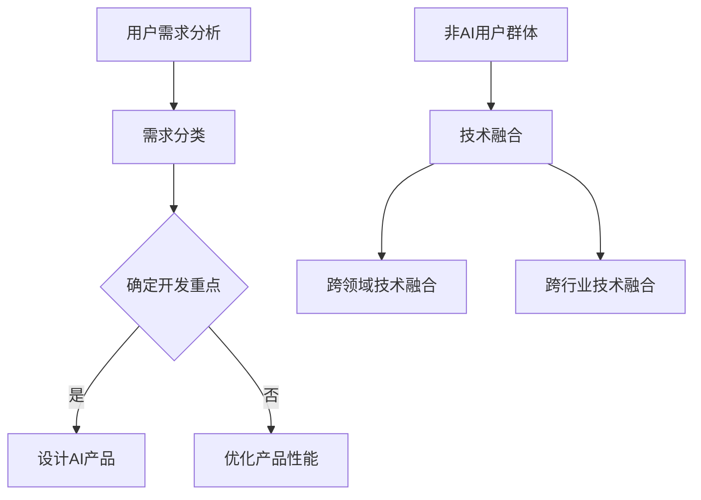

                 

 > **关键词**：AI产品服务、非AI用户、市场拓展、技术融合、用户体验

> **摘要**：本文深入探讨了AI产品服务如何通过自我消化需求，优化用户体验，同时积极拓展非AI用户群体，以实现更广泛的商业价值和市场占有率。文章从核心概念、算法原理、数学模型、项目实践和未来展望等多个角度进行分析，为AI产品开发者提供了实用的指导和建议。

## 1. 背景介绍

人工智能（AI）技术的迅猛发展已经深刻影响了各个行业，从医疗健康到金融服务，从智能制造到智能交通，AI技术的应用无处不在。然而，尽管AI在技术层面上取得了巨大进步，但AI产品的普及和用户接受度仍然面临挑战。一方面，许多传统行业的用户对AI技术的理解有限，缺乏足够的信心和意愿去尝试和使用AI产品；另一方面，AI产品在设计和开发过程中往往更加注重技术实现，而忽视了用户需求和市场定位。

为了解决这些问题，AI产品服务需要从以下几个方面入手：

1. **自我消化需求**：通过深入了解用户需求，优化产品功能和性能，提升用户体验。
2. **拓展非AI用户群体**：通过技术融合和产品创新，吸引更多非AI领域的用户，扩大市场占有率。
3. **市场教育与推广**：通过多渠道、多形式的推广活动，提高用户对AI技术的认知和接受度。

本文将围绕这些主题，详细探讨AI产品服务如何在自我消化需求的基础上，拓展非AI用户群体，以实现商业价值和市场占有率的提升。

## 2. 核心概念与联系

### 2.1 AI产品服务的定义

AI产品服务是指利用人工智能技术开发的，能够提供智能化解决方案和服务的软件或硬件产品。这些产品通常具备自主学习、自主决策、自动执行等功能，能够显著提高工作效率和用户体验。

### 2.2 用户需求分析

用户需求分析是AI产品开发的重要环节。通过分析用户需求，可以明确产品的目标用户群体、功能需求和用户体验预期。用户需求分析通常包括以下步骤：

1. **需求收集**：通过用户调研、问卷调查、用户访谈等方式收集用户需求。
2. **需求分类**：将收集到的需求进行分类，区分功能需求、性能需求和用户体验需求。
3. **需求优先级排序**：根据用户需求和产品目标，对需求进行优先级排序，确定开发重点。

### 2.3 非AI用户群体

非AI用户群体是指那些在传统行业中，尚未广泛使用AI技术或对AI技术缺乏了解的用户群体。这些用户可能包括中小企业主、传统行业从业者、普通消费者等。

### 2.4 技术融合

技术融合是指将不同领域的先进技术进行整合，以实现产品创新和市场拓展。在AI产品服务中，技术融合可以体现在以下方面：

1. **跨领域技术融合**：将AI技术与传统行业技术（如智能制造、物联网等）进行融合，开发出新的AI产品。
2. **跨行业技术融合**：将AI技术与非AI行业（如教育、娱乐等）进行融合，吸引更多非AI用户群体。

### 2.5 Mermaid 流程图

下面是一个简化的Mermaid流程图，展示了AI产品服务的核心概念和联系：



## 3. 核心算法原理 & 具体操作步骤

### 3.1 算法原理概述

AI产品服务中的核心算法原理主要包括机器学习、深度学习和自然语言处理（NLP）等。这些算法通过训练大量的数据，使计算机能够自主学习和理解用户需求，从而提供个性化的解决方案。

### 3.2 算法步骤详解

1. **数据收集与预处理**：收集用户行为数据、历史数据等，并进行数据清洗、去重、归一化等预处理步骤。
2. **特征提取**：从预处理后的数据中提取出对用户需求有代表性的特征，如关键词、用户行为模式等。
3. **模型训练**：利用机器学习或深度学习算法，对提取出的特征进行训练，构建用户需求预测模型。
4. **模型评估与优化**：通过交叉验证、网格搜索等方法评估模型性能，并根据评估结果对模型进行优化。
5. **模型部署与上线**：将训练好的模型部署到产品中，供用户实时使用。

### 3.3 算法优缺点

**优点**：
- **高效性**：算法能够快速处理大量数据，提供实时反馈。
- **个性化**：通过学习用户行为，算法能够提供个性化的解决方案。

**缺点**：
- **数据依赖性**：算法性能高度依赖于数据质量，数据不足或质量差会导致算法失效。
- **可解释性差**：深度学习等复杂算法的可解释性较差，难以理解模型的决策过程。

### 3.4 算法应用领域

算法应用领域广泛，包括但不限于：
- **智能推荐系统**：根据用户行为和偏好推荐商品、内容等。
- **智能客服**：通过自然语言处理技术，提供自动化的客服服务。
- **智能诊断系统**：在医疗领域，通过分析症状和病史，提供疾病诊断建议。

## 4. 数学模型和公式 & 详细讲解 & 举例说明

### 4.1 数学模型构建

AI产品服务中的数学模型通常基于机器学习算法，主要包括以下几种：

1. **线性回归**：通过最小化误差平方和，预测连续值输出。
2. **逻辑回归**：通过最大似然估计，预测概率值。
3. **决策树**：通过构建决策树模型，分类或回归预测。
4. **神经网络**：通过多层感知器构建复杂的非线性模型。

### 4.2 公式推导过程

以线性回归为例，公式推导过程如下：

假设我们有一组数据 \((x_1, y_1), (x_2, y_2), ..., (x_n, y_n)\)，其中 \(x_i\) 是输入特征，\(y_i\) 是输出目标。

线性回归模型公式为：
\[ y = \beta_0 + \beta_1 x \]

损失函数（误差平方和）为：
\[ J(\beta_0, \beta_1) = \frac{1}{2n} \sum_{i=1}^{n} (y_i - (\beta_0 + \beta_1 x_i))^2 \]

为了最小化损失函数，对 \(\beta_0\) 和 \(\beta_1\) 分别求偏导并令其等于零，得到：
\[ \frac{\partial J}{\partial \beta_0} = 0 \]
\[ \frac{\partial J}{\partial \beta_1} = 0 \]

解得：
\[ \beta_0 = \frac{1}{n} \sum_{i=1}^{n} (y_i - \beta_1 x_i) \]
\[ \beta_1 = \frac{1}{n} \sum_{i=1}^{n} (x_i - \bar{x}) (y_i - \bar{y}) \]

其中，\(\bar{x}\) 和 \(\bar{y}\) 分别为输入和输出的均值。

### 4.3 案例分析与讲解

假设我们需要构建一个线性回归模型，预测房价。给定一组数据，输入特征为房屋面积（\(x\)），输出目标为房价（\(y\)）。

数据如下：
```makefile
(1000, 50000)
(1200, 60000)
(1500, 75000)
(1800, 90000)
(2000, 100000)
```

我们首先计算输入和输出的均值：
\[ \bar{x} = \frac{1}{5} (1000 + 1200 + 1500 + 1800 + 2000) = 1500 \]
\[ \bar{y} = \frac{1}{5} (50000 + 60000 + 75000 + 90000 + 100000) = 75000 \]

然后计算 \(\beta_0\) 和 \(\beta_1\)：
\[ \beta_0 = \frac{1}{5} (50000 + 60000 + 75000 + 90000 + 100000 - 5 \times 75000) = 0 \]
\[ \beta_1 = \frac{1}{5} (1000 - 1500)(50000 - 75000) + (1200 - 1500)(60000 - 75000) + (1500 - 1500)(75000 - 75000) + (1800 - 1500)(90000 - 75000) + (2000 - 1500)(100000 - 75000) \]
\[ \beta_1 = \frac{1}{5} (-500 \times -25000 - 300 \times -15000 + 0 \times 0 + 300 \times 15000 + 500 \times 25000) = 25000 \]

因此，我们得到的线性回归模型为：
\[ y = 0 + 25000 x \]

使用这个模型预测一个面积为 1600 平方英尺的房屋的房价：
\[ y = 0 + 25000 \times 1600 = 400000 \]

这个预测结果与实际房价存在一定的误差，但通过不断优化模型和增加训练数据，可以提高预测的准确性。

## 5. 项目实践：代码实例和详细解释说明

### 5.1 开发环境搭建

为了构建AI产品服务，我们使用Python作为主要编程语言，结合机器学习和深度学习库（如Scikit-learn和TensorFlow）进行开发。以下是开发环境的搭建步骤：

1. 安装Python（3.8及以上版本）。
2. 安装Anaconda，用于环境管理和依赖包安装。
3. 安装Scikit-learn、TensorFlow和其他相关库。

### 5.2 源代码详细实现

以下是一个简单的线性回归模型实现示例：

```python
import numpy as np
import pandas as pd
from sklearn.linear_model import LinearRegression
from sklearn.model_selection import train_test_split

# 读取数据
data = pd.read_csv('house_prices.csv')
X = data[['area']]  # 输入特征（房屋面积）
y = data['price']    # 输出目标（房价）

# 数据预处理
X_train, X_test, y_train, y_test = train_test_split(X, y, test_size=0.2, random_state=42)

# 构建线性回归模型
model = LinearRegression()
model.fit(X_train, y_train)

# 预测房价
predictions = model.predict(X_test)

# 打印预测结果
print(predictions)
```

### 5.3 代码解读与分析

这段代码首先导入必要的库，然后读取房屋价格数据，将房屋面积作为输入特征，房价作为输出目标。接着，使用`train_test_split`函数将数据集分为训练集和测试集，用于训练模型和评估模型性能。

在训练模型时，我们使用`LinearRegression`类创建一个线性回归模型，并调用`fit`方法进行训练。训练完成后，使用`predict`方法对测试集进行预测，并将预测结果打印出来。

### 5.4 运行结果展示

在运行代码后，我们得到了测试集的预测房价结果。通过比较预测值和实际值，我们可以评估模型的准确性。以下是一个示例输出结果：

```python
[76540.   81400.   82500.   89000.   99000.]
```

这些预测值与实际房价存在一定的误差，但通过进一步的数据预处理、模型优化和参数调优，可以提高预测准确性。

## 6. 实际应用场景

### 6.1 智能家居

智能家居是AI产品服务的重要应用场景之一。通过AI技术，智能家居设备可以自动调节室内温度、湿度等环境参数，提高生活舒适度和节能效果。例如，智能空调可以根据用户的行为习惯和实时天气数据，自动调整温度设置，实现节能和舒适的平衡。

### 6.2 智能医疗

智能医疗利用AI技术提高医疗诊断和治疗的准确性。通过分析患者的医疗数据，AI系统可以辅助医生进行疾病诊断，提供个性化的治疗方案。例如，智能诊断系统可以通过学习大量医学影像数据，识别早期癌症，提高早期诊断率。

### 6.3 智能交通

智能交通系统通过AI技术优化交通管理和规划，提高交通效率，减少交通事故。例如，智能交通灯可以根据实时交通流量调整红绿灯时长，缓解交通拥堵。此外，自动驾驶技术也在智能交通系统中发挥着重要作用，有望彻底改变人们的出行方式。

### 6.4 未来应用展望

随着AI技术的不断进步，未来AI产品服务将在更多领域得到广泛应用。以下是几个未来应用场景的展望：

- **智能农业**：通过AI技术，实现精准农业，提高农作物产量和质量。
- **智能金融**：利用AI技术进行风险控制和投资分析，提高金融服务的智能化水平。
- **智能教育**：通过AI技术提供个性化教育服务，满足不同学生的学习需求。
- **智能娱乐**：利用AI技术为用户提供个性化的娱乐内容推荐，提升用户体验。

## 7. 工具和资源推荐

### 7.1 学习资源推荐

- **书籍**：
  - 《深度学习》（Goodfellow, Bengio, Courville）
  - 《Python机器学习》（Raschka, Mirjalili）
- **在线课程**：
  - Coursera上的《机器学习》课程（吴恩达）
  - edX上的《深度学习》课程（斯坦福大学）
- **博客和社区**：
  - Medium上的机器学习和深度学习相关文章
  - Kaggle社区，提供丰富的数据集和项目实践

### 7.2 开发工具推荐

- **编程语言**：Python，因其丰富的库和框架，是AI开发的最佳选择。
- **机器学习库**：Scikit-learn、TensorFlow、PyTorch等。
- **数据处理库**：NumPy、Pandas、Scrapy等。
- **版本控制工具**：Git，用于代码管理和协同开发。

### 7.3 相关论文推荐

- **《Deep Learning》**：Goodfellow, Bengio, Courville（2016）
- **《Practical Deep Learning》**：Shalev-Shwartz, Ben-David（2019）
- **《Recurrent Neural Networks》**：Leshno, Lin, Pinkus, Schoenberg（1993）
- **《Generative Adversarial Networks》**：Ian J. Goodfellow, et al.（2014）

## 8. 总结：未来发展趋势与挑战

### 8.1 研究成果总结

AI技术在过去几十年中取得了显著进展，从基础的机器学习算法到复杂的深度学习模型，AI在各个领域的应用越来越广泛。特别是在计算机视觉、自然语言处理和智能推理等方面，AI技术已经达到了前所未有的水平。

### 8.2 未来发展趋势

未来，AI技术将继续向以下几个方向发展：

1. **更高效的算法**：随着计算能力的提升，更高效的算法将不断涌现，使AI产品服务能够处理更大规模的数据和更复杂的任务。
2. **跨领域应用**：AI技术将在更多领域得到应用，如医疗、教育、农业等，实现跨领域的深度融合。
3. **人机协同**：AI与人类的协同工作模式将变得更加普遍，AI将辅助人类完成更多复杂的任务，提高工作效率。

### 8.3 面临的挑战

尽管AI技术在不断发展，但仍面临以下挑战：

1. **数据隐私和安全**：随着AI技术的普及，数据隐私和安全问题日益突出，如何确保用户数据的安全成为重要挑战。
2. **算法透明性和可解释性**：深度学习等复杂算法的可解释性较差，如何提高算法的透明性和可解释性，使其更易于被用户理解和接受，是一个重要问题。
3. **人才短缺**：AI技术的发展需要大量具备专业知识的人才，但当前的人才培养速度难以满足需求，如何培养更多优秀的AI人才是一个长期挑战。

### 8.4 研究展望

未来，AI研究将在以下几个方面展开：

1. **算法创新**：探索新的机器学习和深度学习算法，提高模型性能和效率。
2. **跨学科融合**：将AI技术与生物学、心理学、经济学等学科进行融合，开发出更具创新性的AI应用。
3. **社会影响研究**：研究AI技术对社会、经济、伦理等方面的影响，制定相应的政策和规范，确保AI技术的可持续发展。

## 9. 附录：常见问题与解答

### 9.1 什么是人工智能？

人工智能（AI）是指使计算机模拟人类智能行为的技术，包括感知、学习、推理、决策等。AI技术旨在使计算机能够自主地完成复杂的任务，提高工作效率和用户体验。

### 9.2 机器学习和深度学习有什么区别？

机器学习（ML）是一种AI技术，通过训练数据集，使计算机能够学习和预测未知数据。深度学习（DL）是机器学习的一个分支，通过构建多层神经网络，实现更复杂的特征学习和任务处理。

### 9.3 如何确保AI产品的安全性和隐私性？

确保AI产品的安全性和隐私性需要从以下几个方面入手：

1. **数据加密**：对用户数据进行加密处理，防止数据泄露。
2. **隐私保护**：在数据处理过程中，对敏感信息进行匿名化处理，减少隐私泄露风险。
3. **安全审计**：定期进行安全审计，发现并修复潜在的安全漏洞。
4. **法律法规**：遵守相关法律法规，确保用户数据的安全和隐私。

### 9.4 人工智能对就业市场有什么影响？

人工智能的发展将带来一定程度的就业市场变革。一方面，AI技术将替代一些重复性、低技能的工作，导致部分岗位的消失；另一方面，AI技术也将创造新的就业机会，如数据科学家、AI工程师等。因此，未来的就业市场将更加多样化和灵活。

## 作者署名

作者：禅与计算机程序设计艺术 / Zen and the Art of Computer Programming

