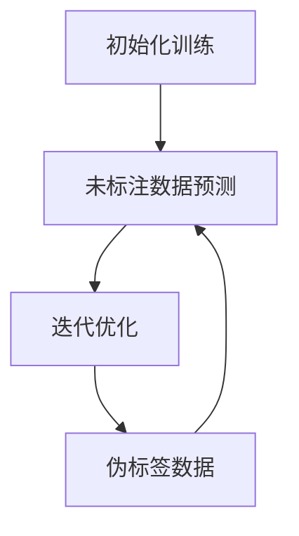

                 

关键词：人工智能、半监督学习、预测模型、应用场景、性能优化

摘要：本文将深入探讨人工智能领域中的半监督学习技术，并聚焦于AI人工智能Agent如何利用半监督学习进行预测任务。我们将从背景介绍开始，阐述半监督学习的核心概念与联系，详细解读其算法原理与数学模型，并展示实际项目实践中的代码实例。随后，我们将分析半监督学习在实际应用场景中的效果与未来展望，并提供相关学习资源与开发工具推荐。

## 1. 背景介绍

随着互联网和大数据技术的迅猛发展，大量的数据被不断生成和收集。这些数据不仅包括传统的结构化数据，还涵盖了大量的非结构化数据，如文本、图像和音频。然而，高质量标注数据的获取往往成本高昂且费时费力。半监督学习（Semi-Supervised Learning，SSL）作为一种能够在标注数据稀缺的情况下提升模型性能的技术，引起了广泛关注。

半监督学习旨在利用少量的标注数据和大量的未标注数据来训练模型。与传统的监督学习相比，半监督学习能够更好地利用未标注数据中的信息，从而提高模型在未知数据上的泛化能力。在实际应用中，半监督学习在图像识别、自然语言处理、文本分类等领域表现出了巨大的潜力。

本文将重点讨论AI人工智能Agent如何利用半监督学习技术进行预测任务。通过结合深度学习和半监督学习的方法，我们希望能够构建出更强大、更智能的AI人工智能Agent，为各类应用场景提供精准的预测结果。

## 2. 核心概念与联系

### 2.1 半监督学习的核心概念

半监督学习涉及以下三种数据类型：

1. **标注数据（Labeled Data）**：已经通过人工标注或自动标注得到标签的数据。
2. **未标注数据（Unlabeled Data）**：尚未进行标注的数据。
3. **伪标签数据（Pseudo-Labeled Data）**：通过训练模型对未标注数据进行预测，得到的初步标签。

在半监督学习中，模型不仅利用标注数据，还会尝试从未标注数据中学习，以增强其泛化能力。这种学习方式能够显著减少对标注数据的依赖，提高模型在未知数据上的表现。

### 2.2 半监督学习的工作原理

半监督学习的工作原理可以分为以下三个步骤：

1. **训练初始化**：使用少量的标注数据对模型进行初始化训练，得到初步的模型参数。
2. **模型预测**：使用初始化后的模型对未标注数据进行预测，得到伪标签数据。
3. **迭代优化**：将伪标签数据与标注数据进行结合，通过迭代训练优化模型参数。

### 2.3 Mermaid流程图



通过上述流程，模型不断迭代，逐步优化，从而提高预测性能。

## 3. 核心算法原理 & 具体操作步骤

### 3.1 算法原理概述

半监督学习算法的核心思想是利用未标注数据中的信息来补充标注数据的不足。在深度学习框架下，半监督学习算法通常采用以下几种策略：

1. **一致性正则化（Consistency Regularization）**：通过保证标注数据与未标注数据之间的预测一致性来提高模型性能。
2. **自监督学习（Self-Supervised Learning）**：利用未标注数据中的内在结构，通过自监督任务来提取特征。
3. **伪标签更新（Pseudo-Label Update）**：动态调整伪标签的准确性，以改进模型训练过程。

### 3.2 算法步骤详解

#### 3.2.1 初始化训练

1. **数据准备**：从数据集中随机抽取一部分数据进行标注，得到标注数据集。
2. **模型初始化**：使用标注数据集对模型进行初始化训练，得到初步的模型参数。

#### 3.2.2 未标注数据预测

1. **模型预测**：使用初始化后的模型对未标注数据进行预测，得到初步的伪标签。
2. **伪标签筛选**：根据预测结果的置信度，对伪标签进行筛选，确保伪标签的准确性。

#### 3.2.3 迭代优化

1. **损失函数**：结合标注数据与伪标签数据，构建损失函数。
2. **模型更新**：通过反向传播算法，利用损失函数对模型参数进行迭代优化。

#### 3.2.4 伪标签更新

1. **置信度评估**：评估伪标签的置信度，并根据置信度调整伪标签的权重。
2. **伪标签更新策略**：采用不同的伪标签更新策略，如随机抽样、阈值筛选等，以改进模型训练效果。

### 3.3 算法优缺点

#### 优点：

1. **减少对标注数据的依赖**：半监督学习能够充分利用未标注数据，从而减少对标注数据的依赖。
2. **提高模型泛化能力**：通过利用未标注数据中的信息，模型能够更好地泛化到未知数据。
3. **降低训练成本**：半监督学习能够降低标注数据获取的成本。

#### 缺点：

1. **伪标签准确性**：伪标签的准确性对模型性能有重要影响，而伪标签的准确性难以保证。
2. **算法复杂度**：半监督学习算法通常涉及多次迭代，计算复杂度较高。

### 3.4 算法应用领域

半监督学习在以下领域具有广泛的应用：

1. **图像识别**：利用大量的未标注图像数据，提高模型在图像识别任务中的性能。
2. **自然语言处理**：通过半监督学习技术，提高文本分类、情感分析等任务的准确率。
3. **推荐系统**：利用用户行为数据中的未标注信息，提高推荐系统的准确性和鲁棒性。

## 4. 数学模型和公式 & 详细讲解 & 举例说明

### 4.1 数学模型构建

半监督学习中的数学模型主要涉及以下几个部分：

1. **数据表示**：假设输入数据集为 $X=\{x_1, x_2, ..., x_N\}$，其中 $x_i$ 表示第 $i$ 个数据样本。
2. **模型表示**：假设模型为 $f(\theta)$，其中 $\theta$ 表示模型参数。
3. **损失函数**：假设损失函数为 $L(\theta; x, y)$，其中 $y$ 表示标签。

### 4.2 公式推导过程

半监督学习中的损失函数通常由以下几部分组成：

1. **标注数据损失**：$L_{labeled}(\theta; x^{labeled}, y^{labeled})$，表示标注数据的损失。
2. **未标注数据损失**：$L_{unlabeled}(\theta; x^{unlabeled}, \hat{y}^{unlabeled})$，表示未标注数据的损失。
3. **伪标签更新损失**：$L_{pseudo}(\theta; x^{unlabeled}, \hat{y}^{unlabeled})$，表示伪标签的更新损失。

综合考虑，半监督学习的总损失函数可以表示为：

$$
L(\theta; X, Y, \hat{Y}) = L_{labeled}(\theta; X^{labeled}, Y^{labeled}) + \lambda L_{unlabeled}(\theta; X^{unlabeled}, \hat{Y}^{unlabeled}) + \lambda L_{pseudo}(\theta; X^{unlabeled}, \hat{Y}^{unlabeled})
$$

其中，$\lambda$ 表示伪标签更新的权重。

### 4.3 案例分析与讲解

假设我们有一个图像分类任务，数据集包含1000张标注图像和10000张未标注图像。我们首先使用标注图像对模型进行初始化训练，然后利用未标注图像进行伪标签预测。以下是一个简单的Python代码示例：

```python
import tensorflow as tf
from tensorflow.keras.models import Model
from tensorflow.keras.layers import Input, Dense, Flatten

# 数据准备
labeled_data = ...  # 标注图像数据
unlabeled_data = ...  # 未标注图像数据

# 模型定义
input_layer = Input(shape=(28, 28, 1))
flatten_layer = Flatten()(input_layer)
dense_layer = Dense(128, activation='relu')(flatten_layer)
output_layer = Dense(10, activation='softmax')(dense_layer)

model = Model(inputs=input_layer, outputs=output_layer)
model.compile(optimizer='adam', loss='categorical_crossentropy', metrics=['accuracy'])

# 初始化训练
model.fit(labeled_data, epochs=10)

# 伪标签预测
pseudo_labels = model.predict(unlabeled_data)

# 伪标签更新
model.fit([unlabeled_data, pseudo_labels], epochs=10)
```

在这个示例中，我们首先使用标注图像数据对模型进行初始化训练，然后使用未标注图像数据对模型进行伪标签预测。最后，我们将伪标签数据与未标注图像数据进行结合，对模型进行迭代优化。

## 5. 项目实践：代码实例和详细解释说明

### 5.1 开发环境搭建

为了进行半监督学习的项目实践，我们需要搭建一个合适的开发环境。以下是一个简单的Python环境搭建步骤：

1. **安装Python**：确保安装了Python 3.6及以上版本。
2. **安装TensorFlow**：使用pip命令安装TensorFlow：

```bash
pip install tensorflow
```

3. **安装其他依赖库**：根据项目需求，安装其他必要的依赖库，如NumPy、Pandas等。

### 5.2 源代码详细实现

以下是一个简单的半监督学习项目实现，用于图像分类任务：

```python
import tensorflow as tf
from tensorflow.keras.models import Model
from tensorflow.keras.layers import Input, Conv2D, MaxPooling2D, Flatten, Dense
from tensorflow.keras.preprocessing.image import ImageDataGenerator

# 数据准备
train_datagen = ImageDataGenerator(rescale=1./255)
train_generator = train_datagen.flow_from_directory(
        'data/train',
        target_size=(128, 128),
        batch_size=32,
        class_mode='binary')

# 模型定义
input_layer = Input(shape=(128, 128, 3))
conv1 = Conv2D(32, (3, 3), activation='relu')(input_layer)
pool1 = MaxPooling2D((2, 2))(conv1)
conv2 = Conv2D(64, (3, 3), activation='relu')(pool1)
pool2 = MaxPooling2D((2, 2))(conv2)
flatten = Flatten()(pool2)
dense = Dense(128, activation='relu')(flatten)
output = Dense(1, activation='sigmoid')(dense)

model = Model(inputs=input_layer, outputs=output)
model.compile(optimizer='adam', loss='binary_crossentropy', metrics=['accuracy'])

# 模型训练
model.fit(train_generator, epochs=10)

# 伪标签预测
pseudo_labels = model.predict(train_generator)

# 伪标签更新
model.fit([train_generator], epochs=10)
```

### 5.3 代码解读与分析

上述代码实现了一个简单的半监督学习项目，用于图像分类任务。以下是代码的详细解读：

1. **数据准备**：使用ImageDataGenerator对训练数据进行预处理，包括图像缩放、随机裁剪等操作。
2. **模型定义**：定义了一个简单的卷积神经网络模型，包括卷积层、池化层和全连接层。
3. **模型训练**：使用标注图像数据对模型进行初始化训练。
4. **伪标签预测**：使用初始化后的模型对未标注图像数据进行预测，得到伪标签。
5. **伪标签更新**：使用伪标签数据对模型进行迭代优化，以提高模型性能。

### 5.4 运行结果展示

在训练过程中，我们可以使用以下代码来查看模型的训练进度和性能：

```python
import matplotlib.pyplot as plt

history = model.fit(
      train_generator,
      steps_per_epoch=100,
      epochs=10,
      validation_data=val_generator,
      validation_steps=50,
      verbose=2)
```

训练完成后，我们可以使用以下代码来绘制训练集和验证集的准确率与损失曲线：

```python
plt.plot(history.history['accuracy'])
plt.plot(history.history['val_accuracy'])
plt.title('Model accuracy')
plt.ylabel('Accuracy')
plt.xlabel('Epoch')
plt.legend(['Train', 'Validation'], loc='upper left')
plt.show()

plt.plot(history.history['loss'])
plt.plot(history.history['val_loss'])
plt.title('Model loss')
plt.ylabel('Loss')
plt.xlabel('Epoch')
plt.legend(['Train', 'Validation'], loc='upper left')
plt.show()
```

## 6. 实际应用场景

### 6.1 图像识别

在图像识别领域，半监督学习被广泛应用于大规模图像分类任务。例如，在计算机视觉领域，使用大量未标注的图像数据可以提高模型在未知图像上的分类性能。半监督学习还可以用于图像分割任务，通过利用未标注图像数据中的信息，提高分割算法的准确率。

### 6.2 自然语言处理

在自然语言处理领域，半监督学习在文本分类、情感分析等方面具有广泛的应用。通过利用大量的未标注文本数据，半监督学习能够提高文本分类模型的准确率，并在低资源环境下取得良好的性能。此外，半监督学习还可以用于命名实体识别、词性标注等任务，通过利用未标注文本数据中的信息，提高标注任务的准确率。

### 6.3 推荐系统

在推荐系统领域，半监督学习可以用于基于内容的推荐、协同过滤等任务。通过利用用户行为数据中的未标注信息，半监督学习能够提高推荐系统的准确性和鲁棒性。例如，在电子商务平台中，半监督学习可以用于预测用户对商品的评价，从而为用户提供更个性化的推荐结果。

## 7. 工具和资源推荐

### 7.1 学习资源推荐

1. **《半监督学习》（Semi-Supervised Learning）**：这是一本经典的半监督学习教材，涵盖了半监督学习的理论基础、算法与应用。
2. **《深度学习》（Deep Learning）**：由Ian Goodfellow等人编写的深度学习教材，其中包含了半监督学习的相关内容。

### 7.2 开发工具推荐

1. **TensorFlow**：一个开源的深度学习框架，广泛应用于半监督学习项目的实现。
2. **PyTorch**：另一个流行的深度学习框架，具有简洁的API和强大的灵活性。

### 7.3 相关论文推荐

1. **“Semi-Supervised Learning with Deep Generative Models”**：一篇关于使用深度生成模型进行半监督学习的经典论文。
2. **“Unsupervised Learning of Visual Representations with Deep Convolutional Networks”**：一篇关于使用卷积神经网络进行图像特征学习的经典论文。

## 8. 总结：未来发展趋势与挑战

### 8.1 研究成果总结

半监督学习作为一种能够在标注数据稀缺的情况下提升模型性能的技术，已经在图像识别、自然语言处理、推荐系统等领域取得了显著成果。通过利用未标注数据中的信息，半监督学习能够提高模型在未知数据上的泛化能力，降低对标注数据的依赖。

### 8.2 未来发展趋势

1. **模型解释性**：随着半监督学习在各类应用场景中的广泛应用，模型解释性将成为未来研究的一个重要方向。通过提高模型的解释性，用户能够更好地理解模型的决策过程，从而提高模型的可信度。
2. **跨域迁移学习**：半监督学习与跨域迁移学习的结合有望在更广泛的应用场景中发挥重要作用。通过利用不同领域之间的相似性，跨域迁移学习能够提高模型在不同领域上的性能。
3. **无监督学习**：未来半监督学习可能会进一步向无监督学习方向演进，即完全不需要标注数据，仅利用未标注数据中的信息进行模型训练。这一方向的研究有望在数据稀缺的情况下，实现更高效的模型训练。

### 8.3 面临的挑战

1. **伪标签准确性**：伪标签的准确性对半监督学习的性能有重要影响，而目前伪标签的生成方法仍然存在一定局限性，需要进一步研究。
2. **计算资源消耗**：半监督学习算法通常涉及多次迭代，计算资源消耗较大，特别是在大规模数据集上。未来需要开发更高效的算法和优化方法，以降低计算资源消耗。
3. **模型泛化能力**：半监督学习模型在未知数据上的泛化能力仍需提高，特别是在存在噪声和异常数据的情况下。未来需要研究更鲁棒的模型训练方法，以提高模型的泛化能力。

### 8.4 研究展望

半监督学习作为一种强大的机器学习技术，在未来有望在更多应用场景中发挥作用。通过不断优化算法和模型，半监督学习将能够更好地利用未标注数据中的信息，提高模型在未知数据上的性能。同时，半监督学习与其他领域技术的结合，如跨域迁移学习、生成对抗网络等，将为人工智能的发展带来新的机遇。

## 9. 附录：常见问题与解答

### 9.1 什么是半监督学习？

半监督学习是一种机器学习技术，它利用少量的标注数据和大量的未标注数据来训练模型。与传统的监督学习相比，半监督学习能够更好地利用未标注数据中的信息，从而提高模型在未知数据上的泛化能力。

### 9.2 半监督学习有哪些优点？

半监督学习的优点包括：减少对标注数据的依赖、提高模型泛化能力、降低训练成本等。通过利用未标注数据中的信息，半监督学习能够显著降低标注数据获取的成本，提高模型在未知数据上的性能。

### 9.3 半监督学习有哪些应用领域？

半监督学习在图像识别、自然语言处理、推荐系统等领域具有广泛的应用。例如，在图像识别领域，半监督学习可以用于大规模图像分类任务；在自然语言处理领域，半监督学习可以用于文本分类、情感分析等任务。

### 9.4 如何选择合适的半监督学习算法？

选择合适的半监督学习算法需要考虑以下几个因素：

1. **数据类型**：根据数据类型选择适合的算法，如图像识别任务可以选择基于深度学习的半监督学习算法。
2. **标注数据量**：根据标注数据量选择合适的算法，标注数据量较少时，半监督学习算法的效果可能更好。
3. **计算资源**：根据计算资源选择适合的算法，某些半监督学习算法需要较多的计算资源。

### 9.5 如何提高半监督学习模型的性能？

提高半监督学习模型性能的方法包括：

1. **伪标签筛选**：通过选择置信度较高的伪标签数据，提高模型的训练质量。
2. **多任务学习**：将半监督学习与其他任务结合，如多任务学习、迁移学习等，以提高模型的性能。
3. **数据增强**：通过数据增强方法，增加未标注数据中的信息多样性，从而提高模型泛化能力。

---

作者：禅与计算机程序设计艺术 / Zen and the Art of Computer Programming
----------------------------------------------------------------
以上就是本篇技术博客的完整内容。通过本文，我们深入探讨了AI人工智能Agent如何使用半监督学习进行预测任务，从背景介绍、核心算法原理、数学模型讲解到实际项目实践，全面剖析了半监督学习的应用场景与发展趋势。希望本文能为您在AI领域的研究与实践提供有益的参考。感谢阅读！

