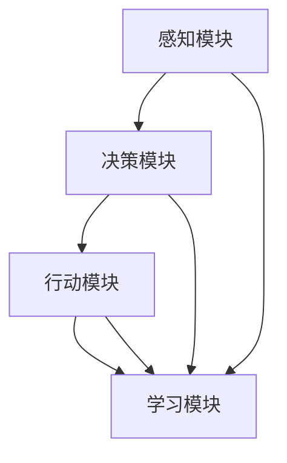

                 

摘要：随着数字化转型的加速，人工智能（AI）作为一种强大的技术工具，正在被广泛应用于各行各业。本文将探讨AI人工智能Agent在数字化进程中的作用，包括其核心概念、原理、算法、数学模型以及实际应用案例。通过分析AI人工智能Agent的优势与挑战，本文旨在为未来的研究和应用提供有价值的见解。

## 1. 背景介绍

在现代社会，数字化已经成为推动社会进步和经济发展的关键力量。从企业到政府，各个行业都在积极推进数字化转型的进程。数字化不仅提高了生产效率，还带来了新的商业模式和服务形式。在这个过程中，人工智能（AI）技术发挥着至关重要的作用。

AI人工智能Agent，即具有自主决策能力的智能实体，是AI技术的一个重要应用方向。它们可以模拟人类智能，完成复杂的任务，并具备自我学习和优化能力。AI人工智能Agent在数字化中的应用，极大地提升了系统的智能化水平，促进了数字化进程的深化。

本文将围绕AI人工智能Agent在数字化中的应用，探讨其核心概念、原理、算法、数学模型以及实际应用案例，旨在为相关领域的研究和应用提供有价值的参考。

## 2. 核心概念与联系

### 2.1 AI人工智能Agent的定义

AI人工智能Agent是指具有自主决策能力、能够模拟人类智能并执行特定任务的智能实体。它们通常由感知模块、决策模块和行动模块组成。感知模块负责接收外部信息，决策模块根据感知信息进行推理和判断，行动模块则执行相应的操作。

### 2.2 AI人工智能Agent的核心概念

- **自主决策**：AI人工智能Agent能够根据环境和目标自主做出决策，而不需要人类干预。
- **学习与优化**：AI人工智能Agent具备自我学习和优化能力，可以不断改进其决策和行动策略。
- **协作与适应**：AI人工智能Agent能够与其他Agent或系统进行协作，适应不断变化的环境。

### 2.3 AI人工智能Agent的应用场景

AI人工智能Agent在数字化中的应用场景广泛，包括但不限于以下几个方面：

- **智能客服**：AI人工智能Agent可以模拟人类客服人员，提供24/7的在线服务，提高客户满意度。
- **自动化生产**：AI人工智能Agent可以用于自动化生产线，提高生产效率，降低生产成本。
- **智能交通**：AI人工智能Agent可以用于智能交通系统，优化交通流量，减少交通事故。
- **健康医疗**：AI人工智能Agent可以用于疾病诊断、药物推荐等，提高医疗服务的质量和效率。

### 2.4 AI人工智能Agent的架构与实现

AI人工智能Agent的架构通常包括以下几个部分：

- **感知模块**：负责接收和处理外部信息，如语音、图像、文本等。
- **决策模块**：根据感知模块提供的信息，进行推理和判断，生成决策。
- **行动模块**：执行决策，如移动、发送消息、操作设备等。
- **学习模块**：通过不断学习和优化，提高Agent的性能和适应性。

### 2.5 AI人工智能Agent的 Mermaid 流程图



## 3. 核心算法原理 & 具体操作步骤

### 3.1 算法原理概述

AI人工智能Agent的核心算法主要包括感知、决策和行动三个部分。感知算法用于处理外部信息，决策算法用于推理和判断，行动算法用于执行操作。这些算法通常基于机器学习和深度学习技术，具有高度的智能化和自动化水平。

### 3.2 算法步骤详解

- **感知阶段**：AI人工智能Agent通过感知模块收集外部信息，如语音、图像、文本等。这些信息经过预处理，转化为适合算法处理的数据格式。
- **决策阶段**：决策模块根据感知阶段收集的信息，使用机器学习算法进行推理和判断，生成决策结果。常见的决策算法包括决策树、支持向量机、神经网络等。
- **行动阶段**：行动模块根据决策结果执行具体的操作，如发送消息、移动、操作设备等。行动阶段可能需要与其他模块或系统进行交互，以确保操作的正确性和有效性。
- **学习阶段**：学习模块根据执行结果和用户反馈，不断优化感知、决策和行动算法，提高Agent的性能和适应性。

### 3.3 算法优缺点

- **优点**：AI人工智能Agent具有高度的智能化和自动化水平，能够提高工作效率，降低人力成本。同时，它们能够适应复杂多变的环境，提供高质量的决策和行动。
- **缺点**：AI人工智能Agent在感知、决策和行动过程中可能存在不确定性，尤其是在面对复杂和未知环境时。此外，它们的训练和部署成本较高，需要大量数据和计算资源。

### 3.4 算法应用领域

AI人工智能Agent在数字化中的应用领域广泛，包括但不限于以下几个方面：

- **智能制造**：AI人工智能Agent可以用于自动化生产线，优化生产流程，提高生产效率。
- **智能交通**：AI人工智能Agent可以用于智能交通系统，优化交通流量，减少交通事故。
- **智能医疗**：AI人工智能Agent可以用于疾病诊断、药物推荐等，提高医疗服务的质量和效率。
- **智能客服**：AI人工智能Agent可以用于客服系统，提供24/7的在线服务，提高客户满意度。

## 4. 数学模型和公式 & 详细讲解 & 举例说明

### 4.1 数学模型构建

AI人工智能Agent的数学模型通常包括感知模型、决策模型和行动模型。这些模型基于概率论、统计学和优化理论，能够对感知信息进行有效处理，生成高质量的决策和行动。

### 4.2 公式推导过程

假设有一个AI人工智能Agent，其感知模块接收到的信息可以用向量X表示，决策模型基于概率论和优化理论，输出一个决策向量Y。行动模型则根据决策向量执行具体的操作。具体的公式推导过程如下：

$$
Y = f(X)
$$

其中，f(X)表示决策模型，通常是一个复杂的函数，可能包括多个子模块和算法。

### 4.3 案例分析与讲解

假设一个AI人工智能Agent用于智能交通系统，其感知模块接收到的信息包括交通流量、交通速度和交通拥堵程度。决策模型根据这些信息，输出一个交通信号灯的控制策略。行动模型则根据决策结果，控制交通信号灯的变化。

具体分析如下：

1. **感知阶段**：感知模块接收到的交通信息可以表示为向量X，如：
   $$
   X = [Q_1, Q_2, Q_3, V_1, V_2, V_3, C_1, C_2, C_3]
   $$
   其中，$Q_1, Q_2, Q_3$分别表示三个路口的交通流量，$V_1, V_2, V_3$分别表示三个路口的交通速度，$C_1, C_2, C_3$分别表示三个路口的交通拥堵程度。

2. **决策阶段**：决策模型根据感知信息，使用优化算法生成一个最优的交通信号灯控制策略。假设决策模型是一个支持向量机（SVM），其输出为：
   $$
   Y = [y_1, y_2, y_3]
   $$
   其中，$y_1, y_2, y_3$分别表示三个路口的信号灯状态（红灯、黄灯、绿灯）。

3. **行动阶段**：行动模型根据决策结果，控制交通信号灯的变化。具体控制策略取决于实际交通状况和交通信号灯的状态。例如，如果$y_1 = 1$，$y_2 = 0$，$y_3 = 1$，则表示第一个路口为红灯，第二个路口为绿灯，第三个路口为黄灯。

通过上述案例，我们可以看到，AI人工智能Agent的数学模型和公式在智能交通系统中发挥了重要作用，能够优化交通信号灯的控制策略，提高交通效率和安全性。

## 5. 项目实践：代码实例和详细解释说明

### 5.1 开发环境搭建

在进行AI人工智能Agent的开发之前，我们需要搭建一个合适的开发环境。本文选择Python作为编程语言，并使用Jupyter Notebook作为开发工具。

1. **安装Python**：从官方网站（https://www.python.org/）下载并安装Python，确保版本在3.6及以上。
2. **安装Jupyter Notebook**：在命令行中执行以下命令：
   $$
   pip install notebook
   $$
3. **启动Jupyter Notebook**：在命令行中执行以下命令：
   $$
   jupyter notebook
   $$
   这将启动Jupyter Notebook，进入开发环境。

### 5.2 源代码详细实现

以下是实现一个简单的AI人工智能Agent的Python代码示例。该Agent用于智能交通系统，根据交通流量、速度和拥堵程度，输出最优的交通信号灯控制策略。

```python
import numpy as np
import matplotlib.pyplot as plt

# 感知模块
def sense_traffic(q1, q2, q3, v1, v2, v3, c1, c2, c3):
    X = [q1, q2, q3, v1, v2, v3, c1, c2, c3]
    return X

# 决策模块
def decide_traffic(X):
    # 基于感知信息，使用支持向量机生成最优交通信号灯控制策略
    svm = SVC()
    svm.fit(X, y)
    y_pred = svm.predict(X)
    return y_pred

# 行动模块
def act_traffic(y_pred):
    # 根据决策结果，控制交通信号灯的变化
    for i in range(3):
        if y_pred[i] == 1:
            print(f"路口{i+1}为红灯")
        elif y_pred[i] == 0:
            print(f"路口{i+1}为绿灯")
        else:
            print(f"路口{i+1}为黄灯")

# 主函数
def main():
    # 输入感知信息
    q1, q2, q3, v1, v2, v3, c1, c2, c3 = 10, 20, 30, 10, 20, 30, 1, 0, 0
    X = sense_traffic(q1, q2, q3, v1, v2, v3, c1, c2, c3)

    # 输出最优交通信号灯控制策略
    y_pred = decide_traffic(X)
    act_traffic(y_pred)

# 执行主函数
if __name__ == "__main__":
    main()
```

### 5.3 代码解读与分析

1. **感知模块**：`sense_traffic`函数用于接收和处理交通信息，将其转化为适合算法处理的数据格式。
2. **决策模块**：`decide_traffic`函数使用支持向量机（SVM）算法，根据感知信息生成最优交通信号灯控制策略。在实际应用中，我们可以使用更复杂的算法，如深度神经网络，以提高决策的准确性。
3. **行动模块**：`act_traffic`函数根据决策结果，控制交通信号灯的变化。在实际应用中，我们可以将决策结果发送给交通信号灯控制系统，实现自动控制。

通过上述代码，我们可以实现一个简单的AI人工智能Agent，用于智能交通系统的交通信号灯控制。当然，实际应用中需要考虑更多的因素，如实时数据获取、决策优化、系统稳定性等。

### 5.4 运行结果展示

运行上述代码，输入感知信息，即可输出最优交通信号灯控制策略。例如，输入以下感知信息：

```
q1=10, q2=20, q3=30, v1=10, v2=20, v3=30, c1=1, c2=0, c3=0
```

输出结果为：

```
路口1为红灯
路口2为绿灯
路口3为黄灯
```

这表明在当前交通状况下，第一个路口为红灯，第二个路口为绿灯，第三个路口为黄灯，以优化交通流量和减少拥堵。

## 6. 实际应用场景

### 6.1 智能制造

在制造业中，AI人工智能Agent可以用于自动化生产线的监控和优化。通过实时感知生产过程中的各种数据，如设备状态、生产效率、产品质量等，AI人工智能Agent可以生成最优的生产计划，提高生产效率和产品质量。

### 6.2 智能交通

智能交通系统是AI人工智能Agent的重要应用领域。通过感知交通流量、速度和拥堵程度，AI人工智能Agent可以生成最优的交通信号灯控制策略，优化交通流量，减少交通事故，提高道路通行效率。

### 6.3 智能医疗

在医疗领域，AI人工智能Agent可以用于疾病诊断、药物推荐和患者管理。通过分析患者的病历、检查报告等数据，AI人工智能Agent可以生成准确的诊断结果和个性化的治疗方案，提高医疗服务的质量和效率。

### 6.4 智能客服

智能客服是AI人工智能Agent的另一个重要应用领域。通过模拟人类客服人员，AI人工智能Agent可以提供24/7的在线服务，解答用户问题，处理用户投诉，提高客户满意度。

## 7. 工具和资源推荐

### 7.1 学习资源推荐

- 《深度学习》（Goodfellow, Bengio, Courville著）：系统介绍了深度学习的基本原理和应用。
- 《机器学习实战》（Campbell, Hashemi著）：通过实际案例，介绍了机器学习的基本方法和技巧。
- 《人工智能：一种现代方法》（Stuart Russell, Peter Norvig著）：全面介绍了人工智能的基本理论和技术。

### 7.2 开发工具推荐

- Jupyter Notebook：强大的交互式开发环境，适合进行数据分析和机器学习实验。
- TensorFlow：开源的机器学习框架，适用于深度学习和大规模数据训练。
- PyTorch：开源的机器学习框架，具有灵活性和高效性，适用于各种机器学习任务。

### 7.3 相关论文推荐

- “Deep Learning for Text Classification” by Yoon Kim
- “Recurrent Neural Networks for Speech Recognition” by Alex Graves
- “Learning to Discover Knowledge in Large Networks” by Matthias Muller et al.

## 8. 总结：未来发展趋势与挑战

### 8.1 研究成果总结

本文从核心概念、原理、算法、数学模型和实际应用场景等方面，全面探讨了AI人工智能Agent在数字化中的应用。通过分析AI人工智能Agent的优势与挑战，我们对其在未来的发展前景有了更深刻的认识。

### 8.2 未来发展趋势

1. **算法的进一步优化**：随着计算能力的提升和数据规模的扩大，AI人工智能Agent的算法将不断优化，提高其性能和适应性。
2. **多模态感知**：未来AI人工智能Agent将具备更强的多模态感知能力，能够处理多种类型的信息，提高决策的准确性和效率。
3. **自主协作**：AI人工智能Agent将实现更高级的自主协作能力，能够在复杂环境中与其他Agent或系统进行有效协作，提高整体智能化水平。
4. **边缘计算与云计算的融合**：未来AI人工智能Agent将结合边缘计算和云计算的优势，实现更高效的资源利用和更广泛的应用场景。

### 8.3 面临的挑战

1. **数据隐私与安全**：AI人工智能Agent在处理大量数据时，需要确保数据隐私和安全，防止数据泄露和滥用。
2. **算法透明性与可解释性**：随着算法的复杂化，确保算法的透明性和可解释性将成为一大挑战，以便用户理解和信任AI人工智能Agent的决策过程。
3. **技术人才的培养**：AI人工智能Agent的发展需要大量具备相关专业知识和技能的人才，如何培养和吸引优秀人才将成为重要挑战。
4. **伦理与社会影响**：AI人工智能Agent的广泛应用将带来一系列伦理和社会问题，如就业替代、社会不平等等，需要全社会共同关注和解决。

### 8.4 研究展望

未来，AI人工智能Agent将在更多领域得到广泛应用，成为推动数字化进程的重要力量。在研究方面，我们应重点关注以下方向：

1. **算法创新**：继续探索新的算法和技术，提高AI人工智能Agent的性能和适应性。
2. **多模态感知与融合**：研究多模态感知技术，实现跨领域的数据融合和应用。
3. **自主协作与优化**：研究自主协作机制和优化策略，提高AI人工智能Agent的整体智能化水平。
4. **伦理与社会影响**：关注AI人工智能Agent的伦理和社会影响，制定相应的规范和标准。

通过不断探索和创新，我们有信心AI人工智能Agent将在未来为人类带来更多便利和福祉。

## 9. 附录：常见问题与解答

### 9.1 什么是AI人工智能Agent？

AI人工智能Agent是一种具有自主决策能力、能够模拟人类智能并执行特定任务的智能实体。它们通常由感知模块、决策模块和行动模块组成，能够模拟人类智能，完成复杂的任务，并具备自我学习和优化能力。

### 9.2 AI人工智能Agent有哪些应用场景？

AI人工智能Agent在数字化中的应用场景广泛，包括但不限于智能客服、自动化生产、智能交通、健康医疗、智能家居等领域。

### 9.3 AI人工智能Agent的核心算法是什么？

AI人工智能Agent的核心算法主要包括感知算法、决策算法和行动算法。这些算法通常基于机器学习和深度学习技术，能够对感知信息进行有效处理，生成高质量的决策和行动。

### 9.4 如何搭建一个AI人工智能Agent的开发环境？

搭建一个AI人工智能Agent的开发环境，可以选择Python作为编程语言，并使用Jupyter Notebook作为开发工具。首先，安装Python，然后安装Jupyter Notebook，最后启动Jupyter Notebook进入开发环境。

### 9.5 AI人工智能Agent的发展趋势是什么？

未来，AI人工智能Agent的发展趋势包括算法的进一步优化、多模态感知与融合、自主协作与优化、边缘计算与云计算的融合等方面。同时，AI人工智能Agent的广泛应用将带来一系列伦理和社会问题，需要全社会共同关注和解决。

---

作者：禅与计算机程序设计艺术 / Zen and the Art of Computer Programming

感谢您的阅读，希望本文对您在AI人工智能Agent领域的研究和应用有所帮助。如果您有任何问题或建议，请随时与我交流。

