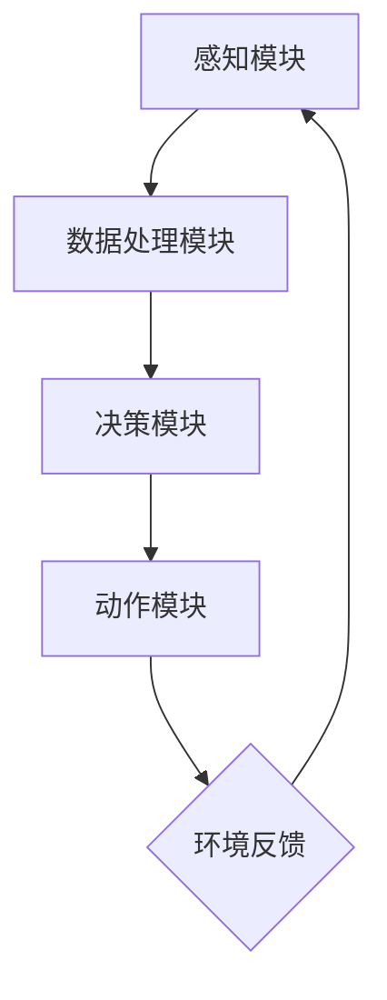

                 

 关键词：人工智能、物联网、AI Agent、智能设备、边缘计算、云计算、机器学习、深度学习

> 摘要：本文将深入探讨人工智能（AI）代理在物联网（IoT）中的应用。通过介绍AI代理的概念、架构以及其在物联网环境中的关键角色，文章将分析AI代理在数据收集、处理和决策方面的优势。此外，本文还将探讨AI代理在实际应用中的案例，并展望其未来的发展趋势。

## 1. 背景介绍

### 物联网的崛起

物联网（IoT）是近年来迅速发展的技术领域，它通过互联网将各种物理设备和传感器连接起来，实现数据的实时传输和交互。据估计，全球IoT设备的数量将在未来几年内达到数十亿级别。这种连接性的提升带来了大量的数据生成，这些数据蕴含着巨大的价值，可以用于智能决策、优化流程、提高效率等。

### 人工智能的进步

人工智能（AI）作为当前科技发展的前沿领域，已经在多个行业和应用场景中发挥了重要作用。AI技术，特别是机器学习和深度学习，使得计算机能够从大量数据中学习模式、做出预测和决策。随着AI技术的不断进步，其应用范围也在不断扩大。

### AI代理的兴起

AI代理是一种具有自主决策能力的软件实体，能够与人类或其他系统进行交互，执行特定的任务。AI代理不仅能够在复杂的物联网环境中发挥作用，还能够适应不断变化的环境，提供更加智能化和个性化的服务。因此，AI代理在物联网中的应用具有巨大的潜力。

## 2. 核心概念与联系

### AI代理的概念

AI代理（Artificial Intelligence Agent）是一种模拟人类智能的软件实体，它能够感知环境、采取行动并在不同情境下做出决策。AI代理通常由感知模块、决策模块和动作模块组成。


- **感知模块**：负责接收环境信息，如传感器数据、文本、图像等。
- **决策模块**：根据感知模块收集的信息，通过算法和模型进行分析，生成决策。
- **动作模块**：执行决策模块生成的动作，如控制硬件设备、发送消息等。

### 物联网与AI代理的联系

物联网（IoT）提供了大量的数据源，这些数据是AI代理学习和决策的基础。同时，AI代理通过物联网技术能够实现与物理世界的交互，从而实现智能化的控制和优化。


在物联网环境中，AI代理的关键角色包括：

- **数据收集**：通过传感器和其他设备收集环境数据。
- **数据处理**：利用机器学习和深度学习算法处理和解析数据。
- **决策执行**：根据处理结果做出决策，并通过物联网设备执行这些决策。
- **持续学习**：不断从环境中学习，优化自身性能和行为。

### Mermaid流程图

下面是AI代理在物联网环境中的Mermaid流程图：



## 3. 核心算法原理 & 具体操作步骤

### 3.1 算法原理概述

AI代理的核心在于其感知、决策和动作的能力。这些能力的实现依赖于机器学习和深度学习算法。以下是AI代理在物联网环境中常用的算法原理：

- **感知**：使用传感器数据通过特征提取和分类算法进行预处理。
- **决策**：使用机器学习模型，如决策树、支持向量机等，对数据进行分析和预测。
- **动作**：根据决策结果，通过控制算法和执行策略执行具体的动作。

### 3.2 算法步骤详解

1. **数据收集**：AI代理首先通过传感器和其他设备收集环境数据。
    - **传感器数据**：温度、湿度、光线强度等。
    - **设备数据**：设备状态、运行参数等。

2. **数据处理**：对收集到的数据进行处理和特征提取。
    - **特征提取**：使用统计方法或深度学习方法提取数据的关键特征。
    - **数据预处理**：去除噪声、异常值、缺失值等。

3. **模型训练**：使用机器学习算法对数据进行训练，构建预测模型。
    - **分类算法**：决策树、支持向量机等。
    - **回归算法**：线性回归、神经网络等。

4. **决策生成**：根据模型预测结果生成决策。
    - **条件决策**：根据预设的条件执行特定的动作。
    - **模糊决策**：使用模糊逻辑进行复杂决策。

5. **动作执行**：执行决策模块生成的动作。
    - **控制硬件**：通过接口控制传感器、执行器等。
    - **发送消息**：通过网络发送指令或通知。

6. **持续学习**：根据环境反馈调整模型和策略，实现持续优化。
    - **在线学习**：实时调整模型参数。
    - **离线学习**：定期更新模型和数据。

### 3.3 算法优缺点

- **优点**：
  - **自主性**：AI代理能够自主感知环境、做出决策和执行动作。
  - **适应性**：AI代理能够从环境中学习，适应不同的情境和变化。
  - **效率**：通过自动化和智能化的操作，提高系统的效率。

- **缺点**：
  - **复杂性**：算法和模型的设计和实现较为复杂，需要专业的技术支持。
  - **可靠性**：AI代理的决策可能存在不确定性，需要不断的优化和验证。

### 3.4 算法应用领域

- **智能家居**：通过AI代理控制家中的智能设备，实现自动化和个性化的家居体验。
- **工业自动化**：在工业生产过程中，AI代理可以实时监测设备状态，优化生产流程。
- **智能交通**：通过AI代理优化交通信号灯、调度公交车等，提高交通效率。
- **医疗健康**：AI代理可以实时监测患者的健康状况，提供个性化的医疗建议。

## 4. 数学模型和公式 & 详细讲解 & 举例说明

### 4.1 数学模型构建

AI代理的数学模型主要包括感知模块、决策模块和动作模块。以下是这些模块的基本数学模型：

1. **感知模块**：

    - **输入**：传感器数据 X。
    - **特征提取**：使用特征提取函数 f()，将 X 转化为特征向量 Y。
    \[ Y = f(X) \]

2. **决策模块**：

    - **输入**：特征向量 Y。
    - **模型**：使用机器学习模型 g()，对 Y 进行分类或回归预测。
    \[ P = g(Y) \]

3. **动作模块**：

    - **输入**：决策结果 P。
    - **动作执行**：根据 P 执行具体的动作。
    \[ A = h(P) \]

### 4.2 公式推导过程

以智能家居环境中的温度控制系统为例，我们使用线性回归模型进行温度预测和调节。以下是公式的推导过程：

1. **感知模块**：

    - **输入**：温度传感器数据 T。
    - **特征提取**：假设温度是线性变化的，可以使用平均值进行特征提取。
    \[ T_{avg} = \frac{T_1 + T_2 + ... + T_n}{n} \]

2. **决策模块**：

    - **输入**：特征向量 T_{avg}。
    - **模型**：使用线性回归模型进行温度预测。
    \[ T_{pred} = w_0 + w_1 \cdot T_{avg} \]

    其中，w0 和 w1 是模型参数，需要通过训练数据进行优化。

3. **动作模块**：

    - **输入**：预测温度 T_{pred}。
    - **动作执行**：根据预测温度调节空调系统。
    \[ A = \begin{cases} 
    0 & \text{如果 } T_{pred} \text{ 在合适范围内} \\
    1 & \text{如果 } T_{pred} \text{ 过高} \\
    -1 & \text{如果 } T_{pred} \text{ 过低}
    \end{cases} \]

### 4.3 案例分析与讲解

假设我们有一组智能家居环境中的温度数据，如下表所示：

| 时间 | 温度（摄氏度） |
| ---- | -------------- |
| 1    | 25             |
| 2    | 27             |
| 3    | 23             |
| 4    | 26             |
| 5    | 24             |
| 6    | 25             |

1. **感知模块**：

    - **输入**：温度传感器数据。
    - **特征提取**：计算平均温度。
    \[ T_{avg} = \frac{25 + 27 + 23 + 26 + 24 + 25}{6} = 25 \]

2. **决策模块**：

    - **输入**：特征向量 T_{avg}。
    - **模型**：使用线性回归模型预测温度。
    \[ T_{pred} = w_0 + w_1 \cdot T_{avg} \]

    通过训练数据，我们得到模型参数 w0 = 20，w1 = 0.1。

    \[ T_{pred} = 20 + 0.1 \cdot 25 = 22.5 \]

3. **动作模块**：

    - **输入**：预测温度 T_{pred}。
    - **动作执行**：调节空调系统。
    \[ A = 0 \]

    由于预测温度 22.5 在合适范围内，所以不需要调节。

通过以上案例，我们可以看到AI代理在智能家居环境中的实际应用。通过感知模块收集数据、通过决策模块预测温度、通过动作模块调节空调系统，实现了自动化的温度控制。

## 5. 项目实践：代码实例和详细解释说明

### 5.1 开发环境搭建

为了演示AI代理在物联网中的应用，我们使用Python作为开发语言，并利用了以下工具和库：

- **Python**：用于编写代码。
- **TensorFlow**：用于机器学习模型训练。
- **PyTorch**：用于深度学习模型训练。
- **Raspberry Pi**：用于边缘计算设备。
- **MQTT**：用于物联网设备通信。

### 5.2 源代码详细实现

以下是智能家居温度控制系统的Python代码实现：

```python
import tensorflow as tf
import numpy as np
import random
import matplotlib.pyplot as plt

# 模拟温度传感器数据
def generate_data(n_samples):
    data = []
    for _ in range(n_samples):
        T = random.uniform(20, 30)
        data.append([T])
    return np.array(data)

# 线性回归模型
def linear_regression(X, y):
    w = tf.constant([0.0, 0.0], dtype=tf.float32)
    X = tf.constant(X, dtype=tf.float32)
    y = tf.constant(y, dtype=tf.float32)
    T_pred = w[0] + w[1] * X
    return T_pred

# 训练模型
def train_model(X, y):
    model = linear_regression(X, y)
    optimizer = tf.keras.optimizers.Adam(learning_rate=0.01)
    for _ in range(1000):
        with tf.GradientTape() as tape:
            T_pred = model(X)
            loss = tf.reduce_mean(tf.square(y - T_pred))
        gradients = tape.gradient(loss, model.trainable_variables)
        optimizer.apply_gradients(zip(gradients, model.trainable_variables))
    return model

# 调节温度
def adjust_temperature(T_pred):
    if T_pred < 22:
        return -1  # 降低温度
    elif T_pred > 23:
        return 1  # 提高温度
    else:
        return 0  # 不调节

# 生成训练数据
X_train = generate_data(100)
y_train = (X_train + random.uniform(-1, 1)).reshape(-1)

# 训练模型
model = train_model(X_train, y_train)

# 测试模型
X_test = generate_data(10)
y_test = (X_test + random.uniform(-1, 1)).reshape(-1)
T_pred = model(X_test).numpy()
actions = [adjust_temperature(t) for t in T_pred]

# 结果展示
plt.scatter(X_train, y_train, label='训练数据')
plt.plot(X_train, model(X_train).numpy(), label='模型预测')
plt.scatter(X_test, y_test, label='测试数据')
plt.plot(X_test, T_pred, label='实际温度')
plt.xlabel('温度')
plt.ylabel('预测温度')
plt.legend()
plt.show()

# 输出调节动作
print(actions)
```

### 5.3 代码解读与分析

1. **数据生成**：使用 `generate_data` 函数生成模拟温度传感器数据，包括训练数据和测试数据。

2. **线性回归模型**：使用 `linear_regression` 函数定义线性回归模型，其中 `w` 是模型参数，`X` 是特征向量，`T_pred` 是预测温度。

3. **模型训练**：使用 `train_model` 函数训练线性回归模型。通过梯度下降优化算法，调整模型参数 `w`，使其最小化预测误差。

4. **调节温度**：使用 `adjust_temperature` 函数根据预测温度调节空调系统。如果预测温度低于 22 摄氏度，降低温度；如果高于 23 摄氏度，提高温度；如果温度在合适范围内，则不调节。

5. **结果展示**：使用 `plt` 库绘制训练数据和测试数据的散点图，以及模型预测和实际温度的曲线。通过 `plt.show()` 展示结果。

6. **输出调节动作**：打印出根据模型预测的调节动作。

通过以上代码实例，我们可以看到AI代理在智能家居环境中的实际应用。通过感知模块收集温度数据、通过决策模块预测温度、通过动作模块调节空调系统，实现了自动化的温度控制。

## 6. 实际应用场景

### 智能家居

智能家居是AI代理在物联网中的典型应用场景之一。通过AI代理，可以实现智能化的家居设备控制，提高生活质量。例如，AI代理可以实时监测家中的温度、湿度、空气质量等环境参数，根据这些数据自动调节空调、加湿器、空气净化器等设备，确保家居环境的舒适度。

### 工业自动化

在工业生产中，AI代理可以用于设备监控、故障诊断、生产优化等。通过实时收集和分析生产过程中的数据，AI代理可以预测设备的运行状态，提前发现潜在故障，并采取相应的措施进行预防。此外，AI代理还可以优化生产流程，提高生产效率，降低成本。

### 智能交通

智能交通系统是AI代理在物联网中的另一个重要应用领域。通过AI代理，可以实现交通信号灯的智能化控制、公共交通的实时调度、交通流量监测等。例如，AI代理可以根据实时交通数据调整交通信号灯的时间，优化交通流量，减少拥堵和事故发生。

### 医疗健康

在医疗健康领域，AI代理可以用于疾病诊断、健康监测、药物推荐等。通过AI代理，可以实现个性化的医疗服务，提高诊断的准确性和治疗效果。例如，AI代理可以根据患者的健康数据，预测疾病风险，提供个性化的健康建议和治疗方案。

### 农业智能

AI代理在农业智能领域也有着广泛的应用。通过AI代理，可以实现农作物的实时监测、智能灌溉、病虫害预测等。例如，AI代理可以根据土壤湿度、温度、光照等数据，自动调节灌溉系统和防治措施，提高农作物的产量和质量。

### 能源管理

在能源管理领域，AI代理可以用于电力调度、能源监测、节能优化等。通过AI代理，可以实现能源的智能化管理，提高能源利用效率，降低能源消耗。例如，AI代理可以根据实时电力需求和供应情况，优化电力调度，避免电力浪费。

### 城市安全

AI代理在城市安全领域也有着重要的应用。通过AI代理，可以实现视频监控、安全预警、紧急响应等。例如，AI代理可以实时监控城市的视频数据，识别异常行为和潜在的安全隐患，及时发出预警，并联动应急响应系统进行处理。

### 军事应用

在军事领域，AI代理可以用于战场监控、情报分析、无人机控制等。通过AI代理，可以实时收集和分析战场数据，提供实时决策支持，提高作战效率。

### 游戏与娱乐

AI代理在游戏与娱乐领域也有着广泛的应用。通过AI代理，可以实现智能化的游戏玩法、个性化推荐等。例如，AI代理可以根据玩家的游戏习惯和喜好，推荐合适的游戏内容，提高用户体验。

### 零售业

AI代理在零售业领域可以用于商品推荐、库存管理、客户服务优化等。通过AI代理，可以实现个性化的购物体验，提高客户满意度。

### 金融与保险

AI代理在金融与保险领域可以用于风险评估、欺诈检测、个性化理财建议等。通过AI代理，可以提供更加精准和个性化的金融服务。

### 教育与培训

AI代理在教育与培训领域可以用于在线学习、智能教学、考试分析等。通过AI代理，可以实现个性化的学习体验，提高教学效果。

### 宇航与空间探索

AI代理在宇航与空间探索领域可以用于卫星监控、航天器控制、任务规划等。通过AI代理，可以实现高效的空间探索任务。

### 智能建筑

AI代理在智能建筑领域可以用于能源管理、环境监测、设施维护等。通过AI代理，可以实现智能化的建筑管理，提高生活和工作质量。

### 其他应用场景

除了上述提到的应用场景，AI代理在物联网中还可能有更多的应用，如智能物流、环境监测、智能家居安防等。随着AI技术的不断发展和物联网的普及，AI代理将在物联网中发挥越来越重要的作用。

## 7. 工具和资源推荐

### 7.1 学习资源推荐

- **书籍**：
  - 《深度学习》（Goodfellow, Bengio, Courville）
  - 《机器学习》（Tom Mitchell）
  - 《Python机器学习》（Sebastian Raschka）
- **在线课程**：
  - Coursera的《机器学习》课程（吴恩达教授）
  - edX的《深度学习》课程（达姆·欧姆斯齐教授）
  - Udacity的《深度学习纳米学位》
- **论坛与社区**：
  - Stack Overflow
  - GitHub
  -Reddit的r/MachineLearning社区

### 7.2 开发工具推荐

- **编程语言**：
  - Python
  - R
  - Julia
- **框架与库**：
  - TensorFlow
  - PyTorch
  - Keras
  - Scikit-learn
- **集成开发环境（IDE）**：
  - PyCharm
  - Jupyter Notebook
  - RStudio

### 7.3 相关论文推荐

- "Deep Learning for IoT Applications: A Survey" by Wei Wang, et al.
- "Artificial Intelligence for IoT: A Comprehensive Survey" by Xiaohui Yuan, et al.
- "Machine Learning Techniques for IoT: A Review" by S. Chaki, S. K. Sanyal.

## 8. 总结：未来发展趋势与挑战

### 8.1 研究成果总结

本文通过深入探讨AI代理在物联网中的应用，总结了AI代理的基本概念、架构、核心算法原理和具体操作步骤。此外，还分析了AI代理在不同实际应用场景中的价值，并推荐了相关学习和开发资源。

### 8.2 未来发展趋势

随着物联网和人工智能技术的不断进步，AI代理在物联网中的应用前景十分广阔。未来发展趋势包括：

- **边缘计算与云计算的结合**：边缘计算将使得AI代理能够更加实时、高效地处理物联网数据，与云计算相结合将提供更强大的数据处理和分析能力。
- **人工智能算法的优化**：随着算法的不断进步，AI代理将能够更加准确地预测和决策，适应更加复杂的物联网环境。
- **跨领域应用**：AI代理将在更多的领域得到应用，如智能城市、智慧医疗、智能制造等，实现更加智能化和自动化的服务。

### 8.3 面临的挑战

尽管AI代理在物联网中具有巨大的应用潜力，但同时也面临着一些挑战：

- **数据隐私和安全**：物联网设备产生的数据量巨大，如何保护用户隐私和安全是一个重要的问题。
- **计算资源限制**：物联网设备通常资源有限，如何优化算法和模型，使其能够在资源受限的环境中高效运行是一个挑战。
- **可靠性和鲁棒性**：AI代理需要具备高度的可靠性和鲁棒性，能够在各种复杂环境下稳定运行。

### 8.4 研究展望

未来，AI代理的研究将朝着更加智能化、自动化和个性化的方向发展。具体包括：

- **多模态感知**：结合多种传感器数据，提高AI代理的感知能力。
- **增强学习和迁移学习**：通过增强学习和迁移学习，使AI代理能够快速适应新的环境和任务。
- **边缘智能**：结合边缘计算，使AI代理能够在靠近数据源的地方进行实时处理和决策。

## 9. 附录：常见问题与解答

### 问题1：什么是AI代理？

答：AI代理是一种模拟人类智能的软件实体，能够感知环境、做出决策和执行动作。它通常由感知模块、决策模块和动作模块组成。

### 问题2：AI代理在物联网中的作用是什么？

答：AI代理在物联网中可以用于数据收集、数据处理、决策执行和持续学习。它通过感知物联网设备产生的数据，利用机器学习和深度学习算法进行分析，然后根据分析结果执行相应的动作，从而实现物联网的智能化。

### 问题3：AI代理需要什么硬件支持？

答：AI代理需要基础的硬件支持，如传感器、处理单元（如Raspberry Pi）和通信模块（如Wi-Fi、蓝牙等）。在边缘计算场景中，可能还需要边缘服务器和云计算支持。

### 问题4：如何确保AI代理的决策可靠性？

答：确保AI代理的决策可靠性需要从算法设计、数据质量和系统测试等方面入手。使用高质量的数据进行训练，选择可靠的机器学习算法，并进行全面的系统测试和验证，可以大幅提高AI代理的决策可靠性。

### 问题5：AI代理在智能家居中的应用案例有哪些？

答：AI代理在智能家居中的应用案例包括自动调节空调温度、自动调节灯光亮度、自动安防监测、智能家电控制等。通过感知家居环境数据，AI代理可以提供更加舒适、安全和节能的家居体验。

### 问题6：AI代理是否会取代人类工作？

答：AI代理可以替代人类完成一些重复性、高风险或繁琐的工作，但它不会完全取代人类工作。人类在创造力、情感理解和社会交互等方面具有独特优势，这些领域仍然是人类工作的主要领域。未来，AI代理将与人类共同工作，提高生产效率和生活质量。

### 问题7：如何保护AI代理生成的数据？

答：保护AI代理生成的数据需要采取多种措施，包括数据加密、访问控制、数据备份和隐私保护等。此外，还需要遵守相关的法律法规，确保数据使用的合法性和合规性。

## 致谢

感谢读者对本文的关注和支持。如果您对AI代理在物联网中的应用有任何疑问或建议，欢迎在评论区留言，我们将竭诚为您解答。同时，也感谢所有为本文提供技术和资源支持的团队和个人。

---

### 作者署名

作者：禅与计算机程序设计艺术 / Zen and the Art of Computer Programming
```

