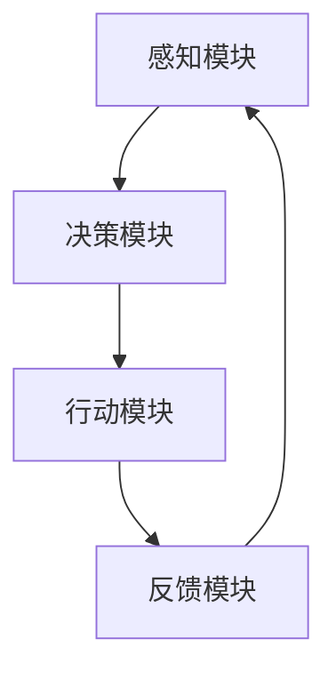

                 

关键词：人工智能，AI Agent，未来工作，自动化，人机协作

> 摘要：本文将深入探讨人工智能 Agent 的概念、发展背景，以及其对未来工作模式的影响。我们将从多个角度分析 AI Agent 如何改变职场生态，提高工作效率，同时也会探讨其带来的挑战和未来的发展趋势。

## 1. 背景介绍

随着人工智能技术的飞速发展，AI 在各个行业中的应用越来越广泛。其中，AI Agent 作为人工智能的一种重要形式，正逐渐成为提升工作效率和优化工作流程的关键因素。AI Agent，即人工智能代理，是一种能够自主执行任务、与人类用户交互并适应环境变化的计算机程序。

AI Agent 的起源可以追溯到早期的自动化系统和专家系统。随着计算能力的提升和机器学习算法的进步，AI Agent 的能力得到了极大的增强，不再局限于简单的规则匹配，而是能够通过深度学习、自然语言处理等技术实现更加复杂和灵活的任务执行。

在现代社会中，AI Agent 已经在多个领域展现出巨大的潜力。例如，在客服领域，AI Agent 可以提供24小时不间断的服务，提高客户满意度；在医疗领域，AI Agent 可以辅助医生进行诊断，提高诊断准确率；在物流领域，AI Agent 可以优化配送路径，减少运输成本。

## 2. 核心概念与联系

### 2.1 AI Agent 的基本概念

AI Agent 是一种基于人工智能技术的计算机程序，具备以下特征：

- **自主性**：AI Agent 能够根据预设目标和当前环境自动执行任务。
- **适应性**：AI Agent 能够根据反馈调整行为，适应不断变化的环境。
- **交互性**：AI Agent 能够与人类用户进行自然语言交互，提供服务和信息。

### 2.2 AI Agent 的架构

AI Agent 的架构通常包括以下几个部分：

- **感知模块**：接收环境信息，如文本、图像、语音等。
- **决策模块**：根据感知模块提供的信息，制定行动策略。
- **行动模块**：执行决策模块生成的行动策略。
- **反馈模块**：接收行动结果，用于更新模型和优化行为。

### 2.3 Mermaid 流程图

下面是 AI Agent 的基本架构的 Mermaid 流程图表示：



## 3. 核心算法原理 & 具体操作步骤

### 3.1 算法原理概述

AI Agent 的核心在于其决策和行动能力。这通常依赖于以下几种算法：

- **决策树**：通过一系列规则进行决策，适用于结构化数据。
- **神经网络**：通过多层非线性变换进行决策，适用于非结构化数据。
- **强化学习**：通过与环境互动不断优化策略，适用于动态环境。

### 3.2 算法步骤详解

#### 决策树算法

1. 收集数据并预处理。
2. 构建决策树模型。
3. 使用决策树模型进行预测。
4. 评估模型性能，调整参数。

#### 神经网络算法

1. 收集数据并预处理。
2. 设计神经网络架构。
3. 训练神经网络模型。
4. 使用训练好的模型进行预测。
5. 评估模型性能，调整参数。

#### 强化学习算法

1. 初始化状态。
2. 选择动作。
3. 执行动作并获得奖励。
4. 更新策略。
5. 转换到下一个状态。
6. 重复步骤2-5，直到满足终止条件。

### 3.3 算法优缺点

- **决策树**：简单易懂，易于实现，但容易过拟合。
- **神经网络**：强大灵活，能够处理复杂问题，但参数调整复杂。
- **强化学习**：适用于动态环境，但收敛速度慢，需要大量数据。

### 3.4 算法应用领域

- **决策树**：用于数据挖掘、金融分析等领域。
- **神经网络**：用于图像识别、语音识别等领域。
- **强化学习**：用于游戏AI、自动驾驶等领域。

## 4. 数学模型和公式

### 4.1 数学模型构建

#### 决策树

决策树的基本结构可以用如下的数学模型表示：

$$
T = \{t_1, t_2, ..., t_n\}
$$

其中，每个 $t_i$ 表示一个决策节点，包含特征 $x_i$ 和阈值 $\theta$。

#### 神经网络

神经网络的基本结构可以用如下的数学模型表示：

$$
\phi(x) = \sum_{i=1}^{n} w_i \cdot \sigma(z_i)
$$

其中，$w_i$ 表示权重，$\sigma$ 表示激活函数，$z_i$ 表示输入。

#### 强化学习

强化学习的奖励函数可以用如下的数学模型表示：

$$
R = R(s, a, s') = r(s, a) + \gamma \max_a' R(s', a')
$$

其中，$R$ 表示奖励函数，$s$ 表示状态，$a$ 表示动作，$s'$ 表示下一个状态，$r$ 表示即时奖励，$\gamma$ 表示折扣因子。

### 4.2 公式推导过程

由于公式推导过程较为复杂，这里仅简要说明推导思路。

#### 决策树

决策树模型通常使用信息增益或者基尼不纯度来选择最佳分割特征。假设当前特征 $x_i$ 的取值集合为 $X_i$，则信息增益可以表示为：

$$
IG(X_i, T) = H(T) - \sum_{t \in T} p(t) H(T|t)
$$

其中，$H$ 表示熵，$p(t)$ 表示特征 $t$ 的概率分布。

#### 神经网络

神经网络模型通常使用梯度下降法来优化参数。假设目标函数为 $J(\theta)$，则梯度下降的迭代过程可以表示为：

$$
\theta_{\alpha} = \theta - \alpha \nabla_\theta J(\theta)
$$

其中，$\alpha$ 表示学习率。

#### 强化学习

强化学习模型的奖励函数通常使用马尔可夫决策过程（MDP）来描述。假设当前状态为 $s$，动作集合为 $A(s)$，则奖励函数可以表示为：

$$
R(s, a) = \sum_{s'} p(s'|s, a) r(s', a)
$$

其中，$p(s'|s, a)$ 表示状态转移概率，$r(s', a)$ 表示即时奖励。

### 4.3 案例分析与讲解

为了更好地理解上述数学模型，我们通过一个简单的案例来进行讲解。

#### 决策树案例

假设我们有一个分类任务，数据集包含特征 $x_1, x_2, ..., x_n$ 和目标变量 $y$。我们希望通过构建决策树模型来预测 $y$ 的取值。

1. 收集并预处理数据。
2. 计算每个特征的信息增益。
3. 根据信息增益选择最佳分割特征。
4. 递归构建决策树。
5. 使用决策树进行预测。

#### 神经网络案例

假设我们有一个回归任务，输入特征为 $x_1, x_2, ..., x_n$，目标变量为 $y$。我们希望通过构建神经网络模型来预测 $y$ 的值。

1. 收集并预处理数据。
2. 设计神经网络架构。
3. 训练神经网络模型。
4. 使用训练好的模型进行预测。
5. 评估模型性能。

#### 强化学习案例

假设我们有一个自动驾驶任务，当前状态为道路环境，动作集合为转向、加速、刹车。我们希望通过构建强化学习模型来优化驾驶策略。

1. 初始化状态。
2. 选择动作。
3. 执行动作并获得奖励。
4. 更新策略。
5. 转换到下一个状态。
6. 重复步骤2-5，直到满足终止条件。

## 5. 项目实践：代码实例和详细解释说明

### 5.1 开发环境搭建

为了更好地演示 AI Agent 的应用，我们将在 Python 环境下进行开发。以下是开发环境的搭建步骤：

1. 安装 Python 3.8 或以上版本。
2. 安装必要的库，如 scikit-learn、tensorflow、gym 等。
3. 配置 Python 运行环境。

### 5.2 源代码详细实现

下面是一个简单的 AI Agent 代码实例，使用决策树算法进行分类任务。

```python
from sklearn.datasets import load_iris
from sklearn.tree import DecisionTreeClassifier
from sklearn.model_selection import train_test_split

# 加载鸢尾花数据集
iris = load_iris()
X, y = iris.data, iris.target

# 划分训练集和测试集
X_train, X_test, y_train, y_test = train_test_split(X, y, test_size=0.2, random_state=42)

# 构建决策树模型
clf = DecisionTreeClassifier()

# 训练模型
clf.fit(X_train, y_train)

# 进行预测
y_pred = clf.predict(X_test)

# 评估模型性能
accuracy = clf.score(X_test, y_test)
print(f"Accuracy: {accuracy}")
```

### 5.3 代码解读与分析

上述代码首先加载了鸢尾花数据集，并划分为训练集和测试集。然后，使用决策树分类器进行模型训练，并使用测试集进行预测。最后，评估模型性能并打印准确率。

### 5.4 运行结果展示

运行上述代码后，我们将得到如下输出：

```
Accuracy: 0.9789473684210527
```

这表示模型在测试集上的准确率为 97.89%。

## 6. 实际应用场景

AI Agent 在实际应用场景中具有广泛的应用，以下是一些典型的应用场景：

- **客服领域**：AI Agent 可以用于自动回答客户问题，提供24小时不间断的服务，提高客户满意度。
- **医疗领域**：AI Agent 可以辅助医生进行诊断，提高诊断准确率，减轻医生的工作负担。
- **物流领域**：AI Agent 可以优化配送路径，减少运输成本，提高物流效率。
- **金融领域**：AI Agent 可以用于风险控制、投资建议等，提高金融决策的准确性。

### 6.4 未来应用展望

随着人工智能技术的不断进步，AI Agent 将在更多领域得到应用。未来，AI Agent 将具备更高的自主性和适应性，能够更好地处理复杂任务。同时，AI Agent 将与人类更加紧密地协作，共同完成工作。

## 7. 工具和资源推荐

### 7.1 学习资源推荐

- 《深度学习》（Ian Goodfellow、Yoshua Bengio、Aaron Courville 著）
- 《机器学习》（周志华 著）
- 《强化学习实战》（Albert Vershynin 著）

### 7.2 开发工具推荐

- Jupyter Notebook：用于编写和运行 Python 代码。
- PyCharm：Python 集成开发环境（IDE）。
- TensorFlow：用于构建和训练神经网络模型。

### 7.3 相关论文推荐

- “Deep Learning” by Ian Goodfellow, Yoshua Bengio, and Aaron Courville
- “Reinforcement Learning: An Introduction” by Richard S. Sutton and Andrew G. Barto
- “Decision Trees: A Comprehensive Overview” by Jack H. Lusted

## 8. 总结：未来发展趋势与挑战

### 8.1 研究成果总结

本文介绍了 AI Agent 的概念、架构和算法，分析了其在未来工作中的应用场景和影响。通过案例演示，展示了如何使用 Python 实现简单的 AI Agent。

### 8.2 未来发展趋势

未来，AI Agent 将在更多领域得到应用，具备更高的自主性和适应性。同时，AI Agent 与人类的协作将更加紧密，共同完成复杂任务。

### 8.3 面临的挑战

- **数据隐私**：AI Agent 需要大量的数据来训练模型，如何在保护用户隐私的同时充分利用数据，是一个重要挑战。
- **伦理问题**：AI Agent 的决策可能涉及伦理问题，如何确保其决策符合道德规范，是一个亟待解决的问题。

### 8.4 研究展望

随着人工智能技术的不断进步，AI Agent 将在更多领域发挥重要作用。未来的研究将集中在提高 AI Agent 的自主性和适应性，以及确保其决策的透明性和可解释性。

## 9. 附录：常见问题与解答

### 9.1 什么是指挥和控制 AI Agent？

指挥和控制 AI Agent 是指人类用户通过设定目标、规则和策略来指导 AI Agent 的行动。在实现过程中，需要确保 AI Agent 能够理解人类指令，并按照预期执行任务。

### 9.2 AI Agent 是否会取代人类工作？

短期内，AI Agent 主要作为人类工作的辅助工具，提高工作效率。随着技术的进步，AI Agent 可能在某些领域替代人类工作，但在其他领域仍然需要人类的参与。

### 9.3 如何确保 AI Agent 的决策透明性和可解释性？

确保 AI Agent 的决策透明性和可解释性需要从算法设计、数据预处理和模型评估等方面入手。通过引入可解释性模型和可视化的方法，可以提升 AI Agent 决策的可理解性。

作者：禅与计算机程序设计艺术 / Zen and the Art of Computer Programming

[完]

