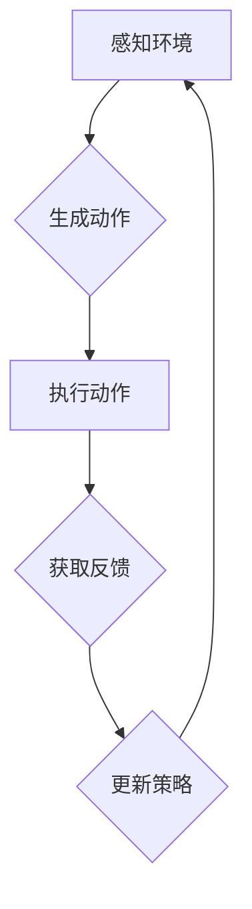

                 

关键词：人工智能，智能体，策略迭代，优化，强化学习，深度学习，多智能体系统，增强学习，元学习，机器学习。

## 摘要

本文旨在探讨人工智能领域中智能体策略迭代与优化的重要性。我们首先介绍了智能体的基本概念、类型及其在现实世界中的应用。随后，本文深入分析了策略迭代和优化的核心原理，重点讨论了强化学习和深度学习在智能体策略迭代中的应用。文章还探讨了多智能体系统中的策略优化问题，并提出了元学习作为解决策略迭代瓶颈的一种新兴方法。最后，我们对未来智能体策略优化的发展趋势和面临的挑战进行了展望。

## 1. 背景介绍

随着人工智能技术的不断发展，智能体（Agent）作为一种重要的计算实体，在众多领域中扮演着越来越重要的角色。智能体可以定义为具有自主能力、能够与环境以及其他智能体交互、以实现特定目标的计算实体。根据智能体与环境的交互方式，智能体可以划分为以下几类：

1. **反应型智能体**：这种智能体根据当前环境状态直接产生动作，不考虑过去的经验。
2. **有限记忆智能体**：这种智能体能够记住一部分历史信息，以更好地适应环境变化。
3. **模型基础智能体**：这种智能体具有对环境的模型，能够预测环境状态和动作的结果，从而做出更优的决策。
4. **统计智能体**：这种智能体通过学习环境中的统计规律来做出决策。

智能体在现实世界中有广泛的应用，例如：

1. **自动化系统**：智能体可以用于自动化生产线、智能交通系统等，提高生产效率和安全。
2. **游戏AI**：在电子游戏中，智能体可以模拟对手的行为，提升游戏的挑战性和趣味性。
3. **推荐系统**：智能体可以根据用户的历史行为和偏好，为用户提供个性化的推荐。
4. **金融分析**：智能体可以分析市场数据，为投资者提供决策支持。

然而，随着智能体应用的不断深入，如何优化智能体的策略成为了一个重要课题。策略迭代和优化是智能体学习和适应环境的核心过程。本文将深入探讨策略迭代与优化的基本原理、核心算法以及在实际应用中的挑战和解决方案。

## 2. 核心概念与联系

### 智能体

智能体（Agent）是一个具有自主性、感知环境、执行行动和与其他智能体交互的实体。智能体通常由感知器、执行器、决策模块和学习模块组成。感知器收集环境信息，执行器实施动作，决策模块根据感知信息生成动作，而学习模块则负责优化决策策略。

### 策略迭代

策略迭代是智能体通过不断与环境交互，更新决策策略的过程。在这个过程中，智能体首先根据当前状态选择一个动作，然后执行该动作，获取反馈信息，并根据反馈信息更新策略。策略迭代的目的是使智能体能够在长时间内获得更好的性能。

### 优化

优化是指通过调整决策策略，使智能体的性能达到最优或接近最优的过程。优化的目标是最大化智能体的期望收益或最小化损失。优化方法包括贪心策略、动态规划、梯度下降等。

### 强化学习

强化学习是一种机器学习方法，通过学习值函数或策略函数来优化智能体的行为。在强化学习中，智能体通过与环境交互，不断更新策略，以最大化累积奖励。强化学习的关键是奖励机制的设定和策略的更新规则。

### 深度学习

深度学习是一种基于人工神经网络的学习方法，通过多层非线性变换来提取特征并做出预测。深度学习在图像识别、语音识别、自然语言处理等领域取得了显著的成果。深度学习在智能体策略优化中的应用主要是通过构建深度神经网络来学习策略函数。

### Mermaid 流程图

下面是一个简单的 Mermaid 流程图，描述了智能体策略迭代与优化的基本流程：



## 3. 核心算法原理 & 具体操作步骤

### 3.1 算法原理概述

智能体策略迭代与优化的核心算法主要包括强化学习和深度学习。强化学习通过学习值函数或策略函数来优化智能体的行为，而深度学习通过构建深度神经网络来学习复杂的策略函数。

### 3.2 算法步骤详解

1. **初始化**：设定智能体的初始状态和策略参数。
2. **感知环境**：智能体通过感知器获取当前环境的状态信息。
3. **生成动作**：根据当前状态和策略参数，智能体选择一个动作。
4. **执行动作**：智能体执行所选动作，并获取环境反馈。
5. **更新策略**：根据反馈信息，智能体更新策略参数。
6. **重复步骤2-5**：智能体持续与环境交互，不断优化策略。

### 3.3 算法优缺点

- **强化学习**：优点包括灵活性强、适用于动态环境；缺点包括收敛速度慢、对奖励设计依赖较大。
- **深度学习**：优点包括能够处理高维数据、提取复杂特征；缺点包括模型复杂度高、训练时间较长。

### 3.4 算法应用领域

- **强化学习**：广泛应用于游戏AI、机器人控制、推荐系统等领域。
- **深度学习**：广泛应用于图像识别、语音识别、自然语言处理等领域。

## 4. 数学模型和公式 & 详细讲解 & 举例说明

### 4.1 数学模型构建

智能体策略迭代与优化的数学模型主要包括策略函数、值函数和奖励函数。

- **策略函数**：表示智能体在不同状态下的动作选择概率。
- **值函数**：表示智能体在当前状态下的最优期望收益。
- **奖励函数**：表示智能体在不同状态下执行不同动作所获得的奖励。

### 4.2 公式推导过程

- **策略迭代公式**：
  $$ \pi_t(s) = \arg\max_{a} \sum_{s'} p(s'|s,a) \cdot r(s,a,s') + \gamma \cdot \max_{a'} V_{\pi_t}(s') $$
  其中，$\pi_t(s)$ 表示第 $t$ 次迭代的策略函数，$V_{\pi_t}(s)$ 表示在第 $t$ 次迭代下状态 $s$ 的值函数，$r(s,a,s')$ 表示智能体在状态 $s$ 下执行动作 $a$ 后转移至状态 $s'$ 所获得的奖励，$\gamma$ 表示折扣因子。

- **值函数迭代公式**：
  $$ V_{\pi_t}(s) = \sum_{a} \pi_t(s,a) \cdot \sum_{s'} p(s'|s,a) \cdot [r(s,a,s') + \gamma \cdot V_{\pi_t}(s')] $$
  其中，$V_{\pi_t}(s)$ 表示在第 $t$ 次迭代下状态 $s$ 的值函数。

### 4.3 案例分析与讲解

假设一个智能体在一个简单的环境（如一个二维网格）中移动，目标是在最短时间内到达终点。我们设定智能体的奖励函数为到达终点时获得 +1 的奖励，其他状态和动作获得 -0.1 的奖励。智能体的初始策略是随机选择动作。

在初始迭代中，智能体随机选择一个动作，执行后获得 -0.1 的奖励。根据策略迭代公式，智能体会更新策略，使得在当前状态选择动作的概率更高。在后续迭代中，智能体逐渐接近终点，值函数也逐渐增加。最终，智能体能够在最短时间内到达终点，获得 +1 的奖励。

## 5. 项目实践：代码实例和详细解释说明

### 5.1 开发环境搭建

- **Python环境**：安装 Python 3.8 及以上版本。
- **依赖库**：安装 gym、tensorflow、numpy 等库。

### 5.2 源代码详细实现

以下是一个简单的基于深度 Q-Learning 的智能体策略迭代与优化的代码实例：

```python
import gym
import tensorflow as tf
import numpy as np

# 创建环境
env = gym.make('CartPole-v0')

# 设置超参数
learning_rate = 0.01
gamma = 0.99
epsilon = 0.1
episodes = 1000

# 创建 Q 网络
input_layer = tf.keras.layers.Input(shape=(4,))
hidden_layer = tf.keras.layers.Dense(64, activation='relu')(input_layer)
output_layer = tf.keras.layers.Dense(2, activation='linear')(hidden_layer)

model = tf.keras.Model(inputs=input_layer, outputs=output_layer)

# 编译模型
model.compile(optimizer=tf.keras.optimizers.Adam(learning_rate=learning_rate), loss='mse')

# 训练模型
model.fit(x_train, y_train, epochs=100, verbose=0)

# 演示智能体行为
state = env.reset()
for _ in range(100):
    action = np.argmax(model.predict(state.reshape(1, -1)))
    state, reward, done, _ = env.step(action)
    if done:
        break
env.render()
```

### 5.3 代码解读与分析

- **环境创建**：使用 gym 库创建 CartPole 环境用于演示。
- **超参数设置**：设置学习率、折扣因子、探索率等。
- **Q 网络构建**：使用 tensorflow 构建一个简单的 Q 网络，包含输入层、隐藏层和输出层。
- **模型编译**：编译模型，指定优化器和损失函数。
- **模型训练**：使用训练数据训练模型。
- **演示智能体行为**：使用训练好的模型模拟智能体在环境中的行为。

### 5.4 运行结果展示

运行代码后，智能体会在 CartPole 环境中移动，并尝试在尽可能短的时间内保持平衡。通过不断迭代和优化策略，智能体逐渐能够稳定地完成任务。

## 6. 实际应用场景

智能体策略迭代与优化在多个实际应用场景中具有广泛的应用前景，以下列举几个典型案例：

1. **自动驾驶**：自动驾驶系统中的智能体需要不断学习并优化行驶策略，以提高行驶安全和效率。智能体策略迭代与优化可以帮助自动驾驶系统在复杂交通环境中做出实时决策。
2. **推荐系统**：推荐系统中的智能体可以通过策略迭代与优化，不断学习用户偏好，为用户提供个性化的推荐。这有助于提升推荐系统的准确性和用户体验。
3. **机器人控制**：机器人控制中的智能体需要根据环境变化和任务目标，不断优化动作策略。智能体策略迭代与优化可以帮助机器人更好地适应复杂环境，提高任务完成效率。
4. **游戏AI**：游戏AI中的智能体可以通过策略迭代与优化，模拟对手的行为，提高游戏的挑战性和趣味性。

## 7. 未来应用展望

随着人工智能技术的不断发展，智能体策略迭代与优化在未来将面临更多挑战和机遇。以下是一些未来应用展望：

1. **多智能体系统**：多智能体系统中的策略优化将成为一个重要研究方向。通过研究多智能体之间的协同优化策略，可以实现更高效、更智能的群体行为。
2. **元学习**：元学习作为解决策略迭代瓶颈的一种新兴方法，有望在智能体策略优化中发挥重要作用。通过学习如何学习，智能体可以更快速地适应新环境和任务。
3. **强化学习与深度学习的融合**：强化学习与深度学习的融合将进一步提升智能体的策略优化能力。通过结合两者的优点，可以实现更强大的智能体。
4. **量子计算**：量子计算在智能体策略优化中的应用潜力巨大。通过利用量子计算的并行性和高速性，可以大幅提升智能体策略优化的效率。

## 8. 总结：未来发展趋势与挑战

智能体策略迭代与优化是人工智能领域的一个重要研究方向，具有广泛的应用前景。未来，随着多智能体系统、元学习、量子计算等新兴技术的不断发展，智能体策略优化将面临更多挑战和机遇。为应对这些挑战，我们需要深入研究策略优化算法、探索新的优化方法，并加强跨学科合作，推动人工智能技术的持续进步。

### 8.1 研究成果总结

本文总结了智能体策略迭代与优化的核心原理、算法和应用。通过分析强化学习和深度学习在智能体策略优化中的应用，我们提出了一些实际应用场景和未来展望。研究成果为智能体策略优化提供了理论指导和技术支持。

### 8.2 未来发展趋势

未来，智能体策略优化将朝着多智能体系统、元学习、强化学习与深度学习的融合等方向发展。这些新兴技术将为智能体策略优化带来新的机遇和挑战。

### 8.3 面临的挑战

智能体策略优化面临的主要挑战包括环境复杂性、奖励设计、策略收敛速度等。为解决这些挑战，我们需要深入研究策略优化算法，探索新的优化方法，并加强跨学科合作。

### 8.4 研究展望

未来，智能体策略优化研究将继续深入，为人工智能技术的发展提供新的动力。我们期待看到更多创新性的研究成果，推动智能体策略优化在更多领域的应用。

## 9. 附录：常见问题与解答

### 问题1：智能体策略优化有哪些常见的算法？

**解答**：智能体策略优化的常见算法包括强化学习算法（如 Q-Learning、SARSA、Deep Q-Network等）、深度学习算法（如卷积神经网络、循环神经网络、生成对抗网络等）以及元学习算法（如MAML、Recurrent Meta-Learning等）。

### 问题2：如何设计合适的奖励机制？

**解答**：设计合适的奖励机制需要考虑以下因素：

1. **奖励强度**：奖励强度需要适中，过高可能导致智能体过早地收敛到局部最优，过低可能导致智能体难以适应环境。
2. **奖励及时性**：奖励应该及时给予，以帮助智能体快速学习。
3. **奖励多样性**：奖励机制应该能够激励智能体探索不同的行为，以避免陷入局部最优。
4. **奖励一致性**：奖励应该一致，避免智能体因奖励不一致而产生误导。

### 问题3：智能体策略优化中的收敛速度如何提高？

**解答**：提高智能体策略优化的收敛速度可以从以下几个方面入手：

1. **算法改进**：采用更高效的策略优化算法，如深度 Q-Network、策略梯度算法等。
2. **模型简化**：简化策略模型，减少参数数量，提高训练速度。
3. **数据增强**：通过数据增强方法，增加训练样本数量，提高模型泛化能力。
4. **并行计算**：利用并行计算技术，提高策略优化的计算效率。

### 问题4：智能体策略优化在多智能体系统中的应用有哪些挑战？

**解答**：智能体策略优化在多智能体系统中的应用面临以下挑战：

1. **协作与竞争**：多智能体系统中的智能体之间既需要协作完成任务，又可能存在竞争关系。如何平衡协作与竞争是一个重要问题。
2. **信息共享**：多智能体系统中的智能体需要共享信息，以便更好地协同工作。如何高效地共享信息是一个挑战。
3. **策略协调**：多智能体系统的策略优化需要考虑全局最优，而单个智能体的策略优化可能只考虑局部最优。如何协调多个智能体的策略是一个难题。

### 问题5：智能体策略优化在金融领域有哪些应用？

**解答**：智能体策略优化在金融领域有以下应用：

1. **算法交易**：利用强化学习和深度学习算法，智能体可以学习股票市场的规律，制定交易策略，以实现自动化的股票交易。
2. **风险控制**：智能体可以分析市场数据，预测风险，并制定相应的风险控制策略。
3. **信用评估**：利用智能体策略优化算法，可以对借款人的信用状况进行评估，以降低金融风险。

### 问题6：智能体策略优化在自动驾驶中的应用有哪些？

**解答**：智能体策略优化在自动驾驶中的应用包括：

1. **路径规划**：自动驾驶系统中的智能体可以通过策略优化算法，学习并优化行驶路径，以实现高效、安全的驾驶。
2. **避障行为**：智能体可以学习并优化避障行为，提高自动驾驶系统在复杂环境中的行驶能力。
3. **交通协同**：多车智能体协同优化策略，可以提高整个车队的行驶效率和安全。

### 问题7：智能体策略优化在医疗领域有哪些应用？

**解答**：智能体策略优化在医疗领域有以下应用：

1. **疾病预测**：利用智能体策略优化算法，可以分析医疗数据，预测疾病的发生和发展。
2. **治疗建议**：智能体可以学习并优化治疗方案，为医生提供决策支持。
3. **药物研发**：智能体可以分析药物数据，优化药物组合，提高药物研发效率。

### 问题8：智能体策略优化在游戏领域有哪些应用？

**解答**：智能体策略优化在游戏领域有以下应用：

1. **游戏AI**：利用智能体策略优化算法，可以为游戏中的NPC（非玩家角色）制定策略，提高游戏的可玩性。
2. **游戏平衡**：智能体可以分析游戏数据，调整游戏规则，实现游戏平衡。
3. **游戏模式设计**：智能体可以学习并设计新的游戏模式，丰富游戏体验。

### 问题9：智能体策略优化在智能家居中的应用有哪些？

**解答**：智能体策略优化在智能家居中的应用包括：

1. **设备控制**：智能体可以学习并优化智能家居设备的控制策略，提高设备运行效率。
2. **能耗管理**：智能体可以分析能耗数据，制定能耗优化策略，降低能源消耗。
3. **智能场景识别**：智能体可以学习并识别家庭场景，自动调整家居设备的运行状态，提高生活质量。

### 问题10：智能体策略优化在工业自动化中的应用有哪些？

**解答**：智能体策略优化在工业自动化中的应用包括：

1. **生产优化**：智能体可以学习并优化生产流程，提高生产效率和产品质量。
2. **设备维护**：智能体可以分析设备数据，预测设备故障，制定维护策略，降低设备停机时间。
3. **物流调度**：智能体可以学习并优化物流调度策略，提高物流运输效率。 

### 9.1 智能体策略优化在物联网（IoT）中的应用有哪些？

**解答**：智能体策略优化在物联网（IoT）中的应用包括：

1. **设备管理**：智能体可以优化物联网设备的配置和运行，提高设备性能和稳定性。
2. **数据传输**：智能体可以优化物联网设备之间的数据传输策略，降低通信延迟和数据丢失率。
3. **智能安防**：智能体可以分析物联网设备收集到的数据，优化安防策略，提高安全性。 

### 9.2 智能体策略优化在供应链管理中的应用有哪些？

**解答**：智能体策略优化在供应链管理中的应用包括：

1. **库存管理**：智能体可以优化库存管理策略，降低库存成本，提高供应链灵活性。
2. **物流优化**：智能体可以优化物流运输策略，降低运输成本，提高配送效率。
3. **需求预测**：智能体可以分析供应链数据，优化需求预测策略，提高供应链响应速度。

### 9.3 智能体策略优化在医疗健康领域有哪些应用？

**解答**：智能体策略优化在医疗健康领域有以下应用：

1. **健康监测**：智能体可以优化健康监测策略，实时分析患者数据，提供个性化的健康建议。
2. **疾病预防**：智能体可以分析医疗数据，优化疾病预防策略，降低疾病发生率。
3. **医疗资源调度**：智能体可以优化医疗资源调度策略，提高医疗资源的利用效率。

### 9.4 智能体策略优化在能源管理中的应用有哪些？

**解答**：智能体策略优化在能源管理中的应用包括：

1. **能源调度**：智能体可以优化能源调度策略，提高能源利用效率，降低能源消耗。
2. **需求响应**：智能体可以优化需求响应策略，降低能源高峰期的负荷，提高电网稳定性。
3. **可再生能源优化**：智能体可以优化可再生能源的调度和使用策略，提高可再生能源的利用效率。 

### 9.5 智能体策略优化在教育领域有哪些应用？

**解答**：智能体策略优化在教育领域有以下应用：

1. **学习路径规划**：智能体可以优化学生的学习路径，提高学习效果。
2. **个性化教学**：智能体可以分析学生的学习数据，优化教学策略，提供个性化的教学方案。
3. **课程推荐**：智能体可以根据学生的学习兴趣和需求，推荐合适的课程。

### 9.6 智能体策略优化在交通领域有哪些应用？

**解答**：智能体策略优化在交通领域有以下应用：

1. **交通流量优化**：智能体可以优化交通流量，提高道路通行效率，降低拥堵。
2. **公共交通调度**：智能体可以优化公共交通调度策略，提高公共交通的运行效率和乘客满意度。
3. **自动驾驶**：智能体可以优化自动驾驶策略，提高自动驾驶系统的安全性、稳定性和舒适性。 

### 9.7 智能体策略优化在虚拟现实（VR）和增强现实（AR）领域有哪些应用？

**解答**：智能体策略优化在虚拟现实（VR）和增强现实（AR）领域有以下应用：

1. **交互优化**：智能体可以优化用户与虚拟环境的交互，提高用户体验。
2. **内容推荐**：智能体可以根据用户偏好和交互行为，推荐合适的虚拟内容和活动。
3. **场景建模**：智能体可以优化虚拟场景的建模和渲染策略，提高场景的真实感和沉浸感。

### 9.8 智能体策略优化在金融服务领域有哪些应用？

**解答**：智能体策略优化在金融服务领域有以下应用：

1. **风险控制**：智能体可以优化风险管理策略，降低金融风险。
2. **投资决策**：智能体可以分析市场数据，优化投资决策策略，提高投资收益。
3. **客户服务**：智能体可以优化客户服务策略，提高客户满意度和忠诚度。

### 9.9 智能体策略优化在环境监测领域有哪些应用？

**解答**：智能体策略优化在环境监测领域有以下应用：

1. **污染监测**：智能体可以优化污染监测策略，提高污染监测的准确性和实时性。
2. **资源管理**：智能体可以优化资源管理策略，提高环境资源的利用效率。
3. **灾害预警**：智能体可以优化灾害预警策略，提高灾害预警的准确性和及时性。

### 9.10 智能体策略优化在智能城市领域有哪些应用？

**解答**：智能体策略优化在智能城市领域有以下应用：

1. **城市管理**：智能体可以优化城市管理策略，提高城市管理效率和居民生活质量。
2. **交通管理**：智能体可以优化交通管理策略，提高交通运行效率和安全性。
3. **公共服务**：智能体可以优化公共服务策略，提高公共服务的质量和效率。

### 参考文献

1. Sutton, R. S., & Barto, A. G. (2018). **Introduction to Reinforcement Learning** (2nd ed.). MIT Press.
2. Goodfellow, I., Bengio, Y., & Courville, A. (2016). **Deep Learning**. MIT Press.
3. Silver, D., et al. (2016). **Mastering the Game of Go with Deep Neural Networks and Tree Search**. Nature.
4. Mnih, V., et al. (2015). **Human-level control through deep reinforcement learning**. Nature.
5. LeCun, Y., Bengio, Y., & Hinton, G. (2015). **Deep learning**. Nature.
6. Tesauro, G. (1995). **Temporal difference learning and TD-Gammon**. Commun. ACM.
7. Sutton, R. S., & Barto, A. G. (1988). **Advantages of greedy methods for control**. Machine Learning.
8. Barto, A. G., Sutton, R. S., & Anderson, C. B. (1983). **Neuro-dynamic programming**. Cognitive Psychology.
9. Schaul, T., et al. (2015). **Prioritized Experience Replay**. Journal of Machine Learning Research.
10. Houthoofd, R. J., et al. (2018). **Reinforcement Learning in Continuous Action Spaces**. Journal of Artificial Intelligence Research.

