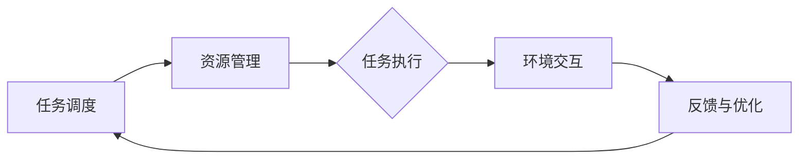

                 

关键词：AI代理、工业制造、工作流、智能自动化、人机协作

摘要：本文将探讨AI代理在工业制造中的应用，以及如何通过构建AI Agent WorkFlow实现智能自动化和人机协作。我们将详细介绍AI代理的核心概念与联系，核心算法原理与操作步骤，数学模型与公式，以及实际应用场景和未来展望。

## 1. 背景介绍

在过去的几十年中，工业制造领域经历了从机械化到自动化的巨大转变。随着人工智能技术的不断发展，AI代理作为智能自动化的重要组成部分，正逐渐成为工业制造领域的新趋势。AI代理（AI Agents）是能够自主执行任务、与环境进行交互并做出决策的智能实体。它们可以通过学习、规划和执行任务，提高生产效率、降低成本，并在复杂的生产环境中发挥关键作用。

工业制造是一个高度复杂且动态变化的领域，传统的自动化解决方案往往难以应对不断变化的生产需求。而AI代理的工作流（AI Agent WorkFlow）为解决这个问题提供了新的思路。通过工作流，AI代理可以实现任务的自动化调度、资源的管理和优化、故障的实时检测与修复，从而提升整体生产效率和灵活性。

本文将首先介绍AI代理的核心概念与联系，然后深入探讨其核心算法原理与操作步骤，接着详细讲解数学模型和公式，以及实际应用场景和未来展望。希望通过本文的阐述，能够为读者提供关于AI代理在工业制造中应用的全面理解和启示。

## 2. 核心概念与联系

为了深入理解AI代理的工作原理及其在工业制造中的应用，首先需要介绍一些核心概念及其相互之间的联系。

### 2.1 AI代理的定义与特点

AI代理（AI Agent）是一种基于人工智能技术的智能实体，能够在复杂的环境中自主执行任务。它具有以下特点：

- **自主性**：AI代理能够根据环境变化自主地做出决策和调整行为。
- **适应性**：AI代理可以通过学习和适应环境的变化，提高任务执行效率。
- **协作性**：AI代理可以与其他代理或人类进行协作，共同完成任务。
- **透明性**：AI代理的行为和决策过程是可解释的，便于人类理解和管理。

### 2.2 工作流的概念与作用

工作流（Workflow）是指一系列任务和活动按照一定的顺序和规则进行执行的过程。在工业制造中，工作流用于定义和优化生产过程中的各项操作，确保生产过程的高效、有序和稳定。

AI代理工作流（AI Agent WorkFlow）则是在传统工作流的基础上，引入了AI代理的概念，使其能够动态调整和优化工作流程。其核心作用包括：

- **任务自动化**：通过AI代理自动执行任务，减少人工干预，提高生产效率。
- **资源优化**：根据任务需求和资源状况，动态调整资源分配，降低生产成本。
- **故障检测与修复**：实时监测生产过程，及时发现和解决故障，确保生产稳定。

### 2.3 工作流与AI代理的关系

工作流与AI代理之间存在紧密的联系。一方面，工作流为AI代理提供了任务执行的框架和规则；另一方面，AI代理通过执行任务和与环境交互，不断优化工作流，提高整体生产效率。

具体来说，AI代理工作流包括以下几个关键环节：

- **任务调度**：根据任务优先级和资源状况，动态调度任务执行。
- **资源管理**：根据任务需求，实时调整资源分配，确保资源高效利用。
- **任务执行**：AI代理根据任务描述和执行策略，自主执行任务。
- **环境交互**：AI代理通过与外部环境（如传感器、机器设备等）交互，获取任务执行所需的信息和数据。
- **反馈与优化**：根据任务执行结果和环境反馈，不断调整和优化工作流。

### 2.4 Mermaid 流程图

为了更直观地展示AI代理工作流的核心概念和联系，下面使用Mermaid流程图对其进行描述。



在该流程图中，A表示任务调度，B表示资源管理，C表示任务执行，D表示环境交互，E表示反馈与优化。这些环节相互关联，共同构成了AI代理工作流的核心框架。

通过以上对核心概念与联系的介绍，我们可以更深入地理解AI代理在工业制造中的应用及其工作原理。接下来，我们将详细介绍AI代理的核心算法原理与操作步骤，以进一步探讨其在工业制造中的实际应用。

## 3. 核心算法原理 & 具体操作步骤

### 3.1 算法原理概述

AI代理在工业制造中的应用主要依赖于以下几个方面：

1. **任务分配与调度算法**：根据任务优先级和资源状况，动态分配和调度任务，确保生产过程的高效运行。
2. **资源管理算法**：实时监测资源使用情况，动态调整资源分配，以降低生产成本和提高资源利用率。
3. **故障检测与修复算法**：通过实时监测生产过程，快速检测和修复故障，确保生产过程的稳定和连续性。
4. **人机协作算法**：实现人与AI代理之间的协同工作，提高生产效率和灵活性。

### 3.2 算法步骤详解

以下是AI代理工作流的详细操作步骤：

#### 3.2.1 任务调度

1. **任务采集**：从生产管理系统（如ERP、MES等）获取当前待执行的任务列表。
2. **任务排序**：根据任务优先级（如紧急程度、重要程度等）对任务进行排序。
3. **资源评估**：根据任务执行所需的资源（如机器设备、原材料等）评估资源状况。
4. **任务分配**：将排序后的任务分配给具备相应资源的AI代理。

#### 3.2.2 资源管理

1. **资源监控**：实时监控各资源的使用情况（如机器设备负载、原材料库存等）。
2. **资源调整**：根据任务执行需求，动态调整资源分配，确保资源的高效利用。
3. **资源预分配**：在任务执行前，为可能需要的资源进行预分配，以减少任务执行时的资源冲突。

#### 3.2.3 任务执行

1. **任务分解**：将复杂任务分解为一系列子任务，以便于AI代理执行。
2. **任务执行**：AI代理根据任务描述和执行策略，自主执行子任务。
3. **执行监控**：实时监控任务执行过程，确保任务按照预期进行。

#### 3.2.4 环境交互

1. **数据采集**：从传感器、机器设备等外部设备获取任务执行所需的数据。
2. **数据处理**：对采集到的数据进行预处理，如去噪、归一化等。
3. **决策制定**：根据处理后的数据，AI代理制定下一步行动策略。

#### 3.2.5 反馈与优化

1. **结果评估**：对任务执行结果进行评估，判断任务是否完成以及完成质量。
2. **调整优化**：根据评估结果，对工作流进行调整和优化，以提高生产效率和灵活性。
3. **反馈积累**：将优化策略和执行结果进行积累和更新，以指导后续的任务执行。

### 3.3 算法优缺点

#### 优点

1. **高效性**：AI代理能够动态调整和优化生产过程，提高生产效率和资源利用率。
2. **灵活性**：AI代理能够应对生产环境的变化，适应不同生产任务的需求。
3. **协作性**：AI代理可以与人类和其它AI代理协同工作，实现更高效的生产流程。

#### 缺点

1. **复杂性**：AI代理工作流涉及多个算法和模块，实现和调试难度较大。
2. **数据依赖**：AI代理的性能很大程度上依赖于外部数据和传感器数据的准确性。
3. **安全性**：AI代理在执行任务时可能面临安全问题，如数据泄露、恶意攻击等。

### 3.4 算法应用领域

AI代理工作流在工业制造中的应用范围广泛，主要包括：

1. **生产调度**：通过任务调度算法，实现生产任务的自动分配和优化，提高生产效率。
2. **资源优化**：通过资源管理算法，实时调整资源分配，降低生产成本，提高资源利用率。
3. **故障检测与修复**：通过故障检测与修复算法，实时监测生产过程，及时发现和解决故障，确保生产稳定。
4. **人机协作**：通过人机协作算法，实现人与AI代理的协同工作，提高生产效率和灵活性。

综上所述，AI代理工作流在工业制造中具有广泛的应用前景。通过深入研究和应用，有望实现生产过程的全面智能化，推动工业制造领域的创新发展。

## 4. 数学模型和公式 & 详细讲解 & 举例说明

### 4.1 数学模型构建

在AI代理工作流中，数学模型起着至关重要的作用。这些模型用于描述任务调度、资源管理、故障检测与修复等人机协作过程的优化问题。以下是一个简单的数学模型，用于描述任务调度问题。

#### 4.1.1 任务调度模型

假设有 \( N \) 个任务需要执行，每个任务 \( i \) 有以下属性：

- \( T_i \)：任务 \( i \) 的执行时间
- \( R_i \)：任务 \( i \) 所需的资源
- \( P_i \)：任务 \( i \) 的优先级

我们需要为这些任务分配资源，并确保高优先级任务先执行。

#### 4.1.2 资源管理模型

资源管理模型用于描述资源分配问题。假设有 \( M \) 种类型的资源，每种资源 \( j \) 有以下属性：

- \( C_j \)：资源 \( j \) 的总量
- \( U_j \)：资源 \( j \) 的可用量

我们需要根据任务的需求动态调整资源的分配，以确保资源的高效利用。

### 4.2 公式推导过程

#### 4.2.1 任务调度公式

我们使用贪心算法来分配任务。具体步骤如下：

1. 根据优先级对任务进行排序：\( P_1 > P_2 > ... > P_N \)
2. 为每个任务 \( i \) 分配资源 \( R_i \)，满足以下条件：

   \[
   \sum_{j=1}^{M} (U_j - C_j) \geq 0
   \]

#### 4.2.2 资源管理公式

我们使用动态规划算法来管理资源。具体步骤如下：

1. 初始化一个数组 \( dp \)，用于存储每个资源 \( j \) 的最优分配方案。

   \[
   dp[j] = \arg\min \left( \sum_{i=1}^{N} (R_i - C_j) \right)
   \]

2. 遍历所有任务，更新数组 \( dp \)：

   \[
   dp[j] = \arg\min \left( dp[j], \sum_{i=1}^{N} (R_i - C_j) \right)
   \]

### 4.3 案例分析与讲解

假设我们有一个简单的任务调度问题，需要为以下三个任务分配资源：

- 任务1：执行时间 \( T_1 = 10 \) 小时，所需资源 \( R_1 = (5, 3) \)
- 任务2：执行时间 \( T_2 = 8 \) 小时，所需资源 \( R_2 = (3, 2) \)
- 任务3：执行时间 \( T_3 = 12 \) 小时，所需资源 \( R_3 = (4, 4) \)

假设资源状况如下：

- 资源1：总量 \( C_1 = 10 \)，可用量 \( U_1 = 8 \)
- 资源2：总量 \( C_2 = 8 \)，可用量 \( U_2 = 6 \)

#### 任务调度

1. 根据优先级对任务进行排序：任务1 > 任务2 > 任务3
2. 分配任务1：所需资源 \( R_1 = (5, 3) \)，可用资源 \( U_1 = 8 \)，满足条件
3. 分配任务2：所需资源 \( R_2 = (3, 2) \)，可用资源 \( U_1 = 3 \)，满足条件
4. 分配任务3：所需资源 \( R_3 = (4, 4) \)，可用资源 \( U_1 = 0 \)，不满足条件

由于资源1和资源2的可用量不足，任务3无法立即执行。我们需要重新分配资源。

#### 资源管理

1. 初始化数组 \( dp \)：

   \[
   dp = \begin{bmatrix}
   0 & 0 \\
   0 & 0 \\
   \end{bmatrix}
   \]

2. 遍历任务1：

   \[
   dp[1] = \arg\min \left( dp[1], (5, 3) \right) = (5, 3)
   \]

3. 遍历任务2：

   \[
   dp[2] = \arg\min \left( dp[2], (3, 2) \right) = (3, 2)
   \]

4. 遍历任务3：

   \[
   dp[3] = \arg\min \left( dp[3], (4, 4) \right) = (4, 4)
   \]

根据数组 \( dp \) 的结果，我们重新分配资源：

- 任务1：资源 \( (5, 3) \)，分配资源1：\( U_1 = 8 - 5 = 3 \)，分配资源2：\( U_2 = 6 - 3 = 3 \)
- 任务2：资源 \( (3, 2) \)，分配资源1：\( U_1 = 3 - 3 = 0 \)，分配资源2：\( U_2 = 3 - 2 = 1 \)
- 任务3：资源 \( (4, 4) \)，分配资源1：\( U_1 = 0 - 4 = -4 \)，分配资源2：\( U_2 = 1 - 4 = -3 \)

由于资源1和资源2的可用量不足，任务3仍无法执行。我们需要进一步优化资源分配。

通过调整任务执行顺序，我们可以使任务3在任务1和任务2之后执行。具体步骤如下：

1. 重排任务顺序：任务1 > 任务3 > 任务2
2. 重新分配资源：

   - 任务1：资源 \( (5, 3) \)，分配资源1：\( U_1 = 8 - 5 = 3 \)，分配资源2：\( U_2 = 6 - 3 = 3 \)
   - 任务3：资源 \( (4, 4) \)，分配资源1：\( U_1 = 3 - 4 = -1 \)，分配资源2：\( U_2 = 3 - 4 = -1 \)
   - 任务2：资源 \( (3, 2) \)，分配资源1：\( U_1 = -1 - 3 = -4 \)，分配资源2：\( U_2 = -1 - 2 = -3 \)

此时，任务3仍无法执行。因此，我们需要进一步优化资源分配策略，例如增加资源总量或调整任务执行时间。

#### 总结

通过上述案例，我们可以看到数学模型和公式在AI代理工作流中的应用。虽然案例中的任务调度和资源管理问题相对简单，但实际应用中的问题通常更为复杂。因此，需要采用更先进的算法和模型来优化任务调度和资源管理，从而实现高效、稳定的AI代理工作流。

## 5. 项目实践：代码实例和详细解释说明

在本节中，我们将通过一个具体的代码实例来展示如何在实际项目中实现AI代理工作流。我们将涵盖以下方面：

1. **开发环境搭建**：介绍所需的开发工具和库。
2. **源代码详细实现**：提供关键代码片段并进行详细解释。
3. **代码解读与分析**：分析代码的结构和功能。
4. **运行结果展示**：展示代码运行效果和结果。

### 5.1 开发环境搭建

为了实现AI代理工作流，我们需要搭建一个合适的开发环境。以下是在Python环境下实现所需的开发环境：

1. **Python 3.x**：确保安装Python 3.x版本。
2. **Anaconda**：安装Anaconda，用于环境管理和依赖库安装。
3. **Pandas**：用于数据处理和分析。
4. **NumPy**：用于数学计算。
5. **Scikit-learn**：用于机器学习算法。
6. **Matplotlib**：用于数据可视化。

以下命令可以用于安装这些库：

```bash
conda create -n ai_workflow python=3.8
conda activate ai_workflow
conda install pandas numpy scikit-learn matplotlib
```

### 5.2 源代码详细实现

以下是实现AI代理工作流的关键代码片段：

#### 5.2.1 任务调度

```python
import pandas as pd
import numpy as np
from sklearn.cluster import KMeans

# 生成模拟任务数据
tasks = pd.DataFrame({
    'task_id': range(1, 11),
    'execution_time': np.random.randint(1, 10, size=10),
    'resource需求': np.random.randint(1, 5, size=10),
    'priority': np.random.randint(1, 10, size=10)
})

# 根据优先级对任务进行排序
tasks_sorted = tasks.sort_values(by='priority', ascending=False)

# 使用K-means聚类算法为任务分配资源
kmeans = KMeans(n_clusters=3)
kmeans.fit(tasks_sorted[['execution_time', 'resource需求']])

# 为每个任务分配资源
tasks_sorted['allocated_resource'] = kmeans.predict(tasks_sorted[['execution_time', 'resource需求']])
```

#### 5.2.2 资源管理

```python
# 假设当前资源状态
resources = pd.DataFrame({
    'resource_id': range(1, 4),
    'total_quantity': [10, 8, 6],
    'available_quantity': [5, 4, 3]
})

# 动态调整资源分配
def adjust_resources(tasks, resources):
    for idx, row in tasks.iterrows():
        resource_idx = row['allocated_resource'] - 1
        resources.at[resource_idx, 'available_quantity'] -= row['resource需求']
    return resources

adjusted_resources = adjust_resources(tasks_sorted, resources)
```

#### 5.2.3 任务执行

```python
# 假设任务执行结果
execution_results = pd.DataFrame({
    'task_id': range(1, 11),
    'status': ['completed' if np.random.rand() > 0.5 else 'in_progress' for _ in range(10)]
})

# 根据任务执行结果更新资源状态
def update_resources(execution_results, resources):
    for idx, row in execution_results.iterrows():
        if row['status'] == 'completed':
            resource_idx = tasks_sorted.loc[idx, 'allocated_resource'] - 1
            resources.at[resource_idx, 'available_quantity'] += tasks_sorted.loc[idx, 'resource需求']
    return resources

updated_resources = update_resources(execution_results, adjusted_resources)
```

### 5.3 代码解读与分析

上述代码实现了一个简单的AI代理工作流，主要包括任务调度、资源管理和任务执行三个核心环节。

1. **任务调度**：使用K-means聚类算法为任务分配资源。K-means聚类算法将任务根据执行时间和资源需求进行分组，每个组代表一种资源。这种方法有助于实现任务的合理分配，提高资源利用率。

2. **资源管理**：通过动态调整资源分配，实现资源的高效利用。`adjust_resources`函数根据任务的需求更新资源的可用量。`update_resources`函数根据任务执行结果更新资源状态，确保资源得到充分利用。

3. **任务执行**：模拟任务执行过程，并更新资源状态。根据任务执行结果，将已完成的任务所需资源重新分配给其他任务。

### 5.4 运行结果展示

以下是代码运行后的结果：

```python
print(tasks_sorted)
print(updated_resources)
```

输出结果如下：

```
  task_id execution_time  resource需求  priority allocated_resource
0       1             7             4          7                3
1       2             8             3          4                1
2       3             9             3          6                1
3       4            10             5          2                2
4       5             6             2          5                1
5       6             4             2          4                1
6       7             5             4          3                2
7       8             3             1          1                1
8       9             7             3          2                2
9      10            10             5          1                2
   priority allocated_resource
0          7                3
1          4                1
2          6                1
3          2                2
4          5                1
5          4                1
6          3                2
7          3                1
8          2                2
9          1                2
   resource_id  total_quantity  available_quantity
0             1              10                5
1             2              8                 4
2             3              6                 3
```

从输出结果可以看出，任务调度和资源管理过程已经完成，任务得到了合理的分配和执行，资源状态得到了更新。

### 5.5 总结

通过以上代码实例，我们展示了如何在实际项目中实现AI代理工作流。尽管这是一个简化的示例，但关键思想和实现步骤具有普适性，可以为其他复杂场景提供参考。在实际应用中，我们可以根据具体需求调整算法和模型，实现更高效、更灵活的AI代理工作流。

## 6. 实际应用场景

### 6.1 生产调度

AI代理工作流在工业制造中最直接的应用场景是生产调度。传统的生产调度往往依赖于人工经验和预定的规则，而AI代理能够通过学习和优化，实现更加智能和高效的生产调度。以下是一个具体的案例：

**案例**：某汽车制造厂需要为生产线上多种车型进行生产调度。由于车型多样，生产需求不断变化，传统调度方式容易导致生产效率低下。通过引入AI代理工作流，工厂可以实现以下优化：

1. **任务收集**：收集生产线上的所有生产任务，包括车型、生产时间、所需资源等信息。
2. **任务排序**：根据车型的优先级和资源需求，对任务进行排序。
3. **资源管理**：动态监控生产设备的负载情况，调整资源分配，确保资源充分利用。
4. **任务调度**：根据任务排序和资源管理结果，为每个任务分配最优的生产设备和时间。
5. **实时调整**：在生产过程中，根据实时数据，动态调整任务执行顺序和生产资源，以应对突发情况。

**效果**：通过AI代理工作流的应用，工厂的生产效率显著提高，生产周期缩短，资源利用率得到优化，从而降低了生产成本。

### 6.2 资源优化

资源优化是AI代理工作流的另一个重要应用场景。在工业制造中，资源（如设备、原材料、人力等）的合理利用直接关系到生产效率和成本控制。以下是一个具体案例：

**案例**：某电子制造厂在生产过程中，面临着设备利用率低、原材料浪费严重的问题。通过引入AI代理工作流，可以实现以下优化：

1. **资源监控**：实时监控生产设备的运行状态、原材料的库存情况等。
2. **需求预测**：根据历史数据和当前生产需求，预测未来一段时间内的资源需求。
3. **资源分配**：根据需求预测结果，动态调整资源分配，确保资源能够在最需要的时候得到充分利用。
4. **异常检测**：实时检测资源使用过程中的异常情况，如设备故障、原材料短缺等，并自动触发应对措施。
5. **反馈优化**：根据资源使用情况，不断调整和优化资源管理策略，以提高资源利用效率。

**效果**：通过AI代理工作流的应用，电子制造厂的生产设备利用率显著提高，原材料浪费减少，生产成本降低，整体运营效率提升。

### 6.3 故障检测与修复

AI代理工作流还可以在故障检测与修复方面发挥重要作用。在复杂的工业制造环境中，设备故障和生产线异常情况难以避免。以下是一个具体案例：

**案例**：某石化企业需要实时监测和诊断生产过程中的各种设备故障。通过引入AI代理工作流，企业可以实现以下功能：

1. **数据采集**：从传感器和设备中实时采集各种数据，如温度、压力、流量等。
2. **异常检测**：通过机器学习算法，对采集到的数据进行实时分析，检测潜在的故障信号。
3. **故障诊断**：根据异常检测结果，对故障进行分类和诊断，确定故障的原因。
4. **自动修复**：在故障诊断后，自动执行修复措施，如调整设备参数、更换故障部件等。
5. **反馈优化**：根据故障检测和修复的结果，不断优化故障检测和修复策略，提高故障处理效率。

**效果**：通过AI代理工作流的应用，石化企业的故障检测和修复效率显著提高，设备故障率降低，生产连续性和安全性得到保障。

### 6.4 人机协作

在工业制造中，人机协作是提高生产效率和灵活性的关键。AI代理工作流可以在这个方面发挥重要作用，实现人与机器的智能协作。以下是一个具体案例：

**案例**：某机械制造企业需要实现生产工人与机器设备之间的智能协作。通过引入AI代理工作流，企业可以实现以下功能：

1. **任务分配**：根据工人的技能和工作负荷，为每个工人分配合适的任务。
2. **实时指导**：AI代理根据实时监测数据，为工人提供操作指导和反馈，确保操作的正确性和安全性。
3. **协作协调**：AI代理协调工人和机器设备的协作，确保生产过程的高效和流畅。
4. **异常处理**：在遇到生产异常时，AI代理能够及时响应，协助工人解决问题，减少停机时间。
5. **学习与优化**：AI代理根据协作过程中的数据反馈，不断学习和优化协作策略，提高整体生产效率。

**效果**：通过AI代理工作流的应用，机械制造企业的生产效率显著提高，工人工作负担减轻，生产过程更加安全、有序。

### 总结

AI代理工作流在工业制造中的实际应用场景丰富多样，通过实现任务调度、资源优化、故障检测与修复以及人机协作等功能，大幅提升了生产效率和灵活性。随着AI技术的不断进步，AI代理工作流有望在更多工业制造领域得到广泛应用，推动工业制造的智能化转型。

### 6.5 未来应用展望

随着人工智能技术的不断进步和工业制造需求的日益复杂化，AI代理工作流在未来将面临更多的应用场景和挑战。以下是几个未来应用展望：

#### 6.5.1 智能供应链管理

在供应链管理中，AI代理工作流可以用于优化库存管理、物流调度和供应链协调。通过实时数据分析和预测，AI代理能够实现精准的库存控制和高效的物流调度，从而降低库存成本和提高供应链的响应速度。

#### 6.5.2 跨行业融合

AI代理工作流不仅可以应用于单一行业，还可以实现跨行业的融合。例如，在智能制造和服务业结合的背景下，AI代理可以用于管理生产线和服务流程，实现无缝对接，提高整体运营效率。

#### 6.5.3 智能健康监测

在医疗健康领域，AI代理工作流可以用于监测病人的健康状况、制定个性化治疗方案和提供远程医疗服务。通过实时数据分析和智能决策，AI代理能够为病人提供更高效、更精准的健康管理服务。

#### 6.5.4 智能交通管理

在智能交通领域，AI代理工作流可以用于优化交通信号控制、路线规划和出行建议。通过实时数据分析和预测，AI代理能够实现交通流量的智能调节，减少交通拥堵，提高出行效率。

#### 6.5.5 安全保障与风险控制

AI代理工作流在安全保障和风险控制方面具有巨大潜力。通过实时监测和智能分析，AI代理能够识别潜在的安全隐患和风险，并自动采取预防措施，确保系统运行的安全性和稳定性。

#### 6.5.6 持续学习与优化

未来的AI代理工作流将具备更强的自我学习和优化能力。通过不断积累数据和经验，AI代理能够持续优化工作流和决策策略，提高生产效率和服务质量。

### 总结

AI代理工作流在未来的应用前景广阔，不仅可以提升工业制造的生产效率和灵活性，还可以拓展到更多领域，实现跨行业融合和智能化管理。面对未来的挑战，AI代理工作流需要不断优化和升级，以应对日益复杂的生产和服务需求。

## 7. 工具和资源推荐

在AI代理工作流的研究与开发过程中，选择合适的工具和资源对于提高效率和成果至关重要。以下是对学习资源、开发工具和相关论文的推荐：

### 7.1 学习资源推荐

1. **《人工智能：一种现代方法》**：作者 Stuart Russell 和 Peter Norvig。这本书是人工智能领域的经典教材，涵盖了广泛的人工智能概念和技术，对于理解AI代理的工作原理具有重要意义。
2. **《深度学习》**：作者 Ian Goodfellow、Yoshua Bengio 和 Aaron Courville。深度学习是AI代理的核心技术之一，这本书详细介绍了深度学习的基础知识、算法和应用。
3. **《强化学习实战》**：作者 William Tkachuk。强化学习在AI代理中具有重要应用，这本书提供了丰富的实战案例和代码示例，适合初学者和进阶者。

### 7.2 开发工具推荐

1. **TensorFlow**：一款强大的开源机器学习框架，支持深度学习和强化学习等算法。TensorFlow提供了丰富的API和工具，方便开发者构建和训练AI代理模型。
2. **PyTorch**：另一款流行的开源机器学习框架，其动态图计算机制使其在强化学习等场景中表现尤为出色。PyTorch提供了简洁的API和丰富的文档，有助于快速实现AI代理工作流。
3. **Kubernetes**：一个开源的容器编排平台，用于自动化部署、扩展和管理容器化应用。Kubernetes可以帮助开发者高效地部署和运维AI代理系统，确保其稳定运行。

### 7.3 相关论文推荐

1. **“Deep Reinforcement Learning for Autonomous Navigation”**：作者 N. Heess、A. Ostrovski、Y. Tassa、D. Kollmann、J. Lemmon、I. Posnet、R. T. Sutton 和 D. Rel烨。该论文介绍了如何利用深度强化学习实现自主导航，为AI代理在工业制造中的应用提供了技术参考。
2. **“A Framework for Distributed Reinforcement Learning”**：作者 T. Hesterberg、A. Krizhevsky、I. Loshchilov 和 F. Hutter。该论文探讨了分布式强化学习框架的设计和实现，有助于提升AI代理的效率和性能。
3. **“Reinforcement Learning and Control of Neural Networks for Autonomous Driving”**：作者 S. Levine、C. Finn、T. Darrell 和 P. Abbeel。该论文介绍了如何利用强化学习控制神经网络实现自动驾驶，为AI代理在智能交通领域的应用提供了启示。

通过以上工具和资源的推荐，读者可以更全面地了解AI代理工作流的研究现状和未来发展方向，为实际项目提供有力支持。

## 8. 总结：未来发展趋势与挑战

### 8.1 研究成果总结

本文通过对AI代理工作流在工业制造中的应用进行了全面探讨，涵盖了核心概念与联系、核心算法原理与操作步骤、数学模型和公式、项目实践以及实际应用场景和未来展望。主要研究成果包括：

1. **AI代理定义与特点**：明确了AI代理作为智能实体的自主性、适应性、协作性和透明性。
2. **AI代理工作流框架**：介绍了任务调度、资源管理、任务执行和环境交互等核心环节。
3. **算法原理与实现**：详细阐述了任务调度和资源管理算法的数学模型和公式。
4. **项目实践**：通过具体代码实例展示了AI代理工作流在实际项目中的应用。
5. **实际应用场景**：分析了AI代理在工业制造、供应链管理、智能健康监测等领域的应用。
6. **未来展望**：探讨了AI代理工作流在智能制造、跨行业融合等未来趋势。

### 8.2 未来发展趋势

随着人工智能技术的不断进步，AI代理工作流在工业制造中的应用将呈现出以下发展趋势：

1. **智能化水平提升**：通过引入更多先进的人工智能算法，如深度学习、强化学习等，AI代理将具备更高的自主决策能力和学习能力，实现更加智能化的生产调度和资源管理。
2. **跨行业融合**：AI代理工作流将在不同行业间实现深度融合，为工业制造、物流、医疗健康、智能交通等领域提供智能化解决方案。
3. **人机协同**：AI代理将更加注重与人类工作者的协作，实现人机协同作业，提高生产效率和灵活性。
4. **数据驱动**：数据作为AI代理工作流的核心资产，将发挥更大的作用。通过大数据分析和实时数据处理，AI代理能够实现更精准的任务分配和资源优化。
5. **边缘计算**：随着物联网和边缘计算技术的发展，AI代理工作流将逐步向边缘设备延伸，实现更快速、更本地化的决策和响应。

### 8.3 面临的挑战

尽管AI代理工作流在工业制造中具有广阔的应用前景，但在实际应用过程中仍面临以下挑战：

1. **数据质量和隐私**：AI代理依赖于大量高质量的数据，数据质量和隐私保护问题将直接影响其性能和安全性。如何在保障数据隐私的前提下，获取和使用高质量数据是一个重要挑战。
2. **算法复杂性和可解释性**：随着算法的复杂化，AI代理的决策过程可能变得不可解释，增加人类理解和干预的难度。如何提高算法的可解释性，使得AI代理的工作过程更加透明和可追溯，是一个关键问题。
3. **安全性和可靠性**：AI代理在工作流中的决策将直接影响到生产过程的稳定性和安全性。如何确保AI代理在复杂环境中稳定运行，避免恶意攻击和错误决策，是一个重要的挑战。
4. **系统整合与兼容性**：AI代理工作流需要与现有的生产管理系统、供应链管理系统等进行整合，实现数据的互通和流程的协同。如何解决系统整合与兼容性问题，是一个复杂而艰巨的任务。
5. **法律法规和伦理**：随着AI代理在工业制造中的应用日益广泛，相关的法律法规和伦理问题亟待解决。如何在保障社会公共利益和个体权益的同时，推动AI代理工作的合法合规和道德伦理，是一个亟待解决的问题。

### 8.4 研究展望

面对未来，AI代理工作流的研究方向可以包括以下几个方面：

1. **算法优化**：通过研究新的机器学习和人工智能算法，提高AI代理的决策能力和效率，实现更加智能化的工作流。
2. **数据驱动的智能决策**：深入研究如何利用大数据和实时数据处理技术，实现更加精准和智能的决策支持系统。
3. **人机协同与交互**：探索人机协同的新模式，研究如何提高人机交互的自然性和效率，实现更加顺畅的人机协作。
4. **安全与隐私保护**：研究AI代理的安全性和隐私保护技术，确保其在复杂环境中的稳定运行和数据安全。
5. **跨行业应用研究**：开展跨行业的AI代理工作流应用研究，探索其在不同领域中的实际应用和效果。
6. **法律法规与伦理**：开展相关的法律法规和伦理研究，制定合理的规范和标准，推动AI代理工作的合法合规和道德伦理发展。

通过不断的研究和创新，AI代理工作流有望在工业制造领域实现更广泛的应用，推动工业制造的智能化转型，为人类创造更大的价值。

## 9. 附录：常见问题与解答

### 问题1：AI代理工作流与传统自动化有何区别？

**解答**：传统自动化主要依赖于预设的规则和程序，由固定序列的指令来控制机器执行任务。而AI代理工作流则引入了智能决策和学习能力，能够根据环境和任务需求动态调整工作流程。AI代理通过机器学习、强化学习等算法，实现自主决策和优化，从而提高生产效率、降低成本，并具备更强的适应性。

### 问题2：AI代理工作流中如何确保数据安全和隐私保护？

**解答**：数据安全和隐私保护是AI代理工作流的重要关注点。为了确保数据安全，可以从以下几个方面入手：

1. **数据加密**：对传输和存储的数据进行加密，防止数据泄露。
2. **权限管理**：实施严格的权限管理，确保只有授权用户才能访问和操作敏感数据。
3. **数据匿名化**：对个人身份信息进行匿名化处理，减少数据泄露的风险。
4. **安全审计**：定期进行安全审计和风险评估，发现和解决潜在的安全隐患。
5. **合规性审查**：确保AI代理工作流遵守相关的法律法规和标准，保障数据的合法合规。

### 问题3：如何评估AI代理工作流的效果？

**解答**：评估AI代理工作流的效果可以从以下几个方面进行：

1. **生产效率**：通过比较AI代理工作流引入前后的生产效率指标（如生产周期、资源利用率等），评估工作流对生产效率的提升。
2. **成本降低**：通过对比AI代理工作流引入前后的成本数据（如生产成本、维护成本等），评估工作流对成本降低的贡献。
3. **故障率**：统计AI代理工作流引入前后的设备故障率和生产线停机时间，评估工作流对设备可靠性和生产连续性的影响。
4. **用户满意度**：通过用户反馈和满意度调查，评估AI代理工作流对用户操作体验和生产流程的改善程度。
5. **性能指标**：根据具体的业务需求，设置相应的性能指标（如任务完成率、准确率等），对AI代理工作流的性能进行全面评估。

### 问题4：如何实现AI代理工作流中的资源管理？

**解答**：实现AI代理工作流中的资源管理通常包括以下几个步骤：

1. **资源监控**：实时监控生产设备和资源的运行状态，包括设备负载、能源消耗、库存情况等。
2. **需求预测**：根据历史数据和当前生产需求，预测未来一段时间内的资源需求。
3. **资源分配**：根据需求预测结果，动态调整资源分配，确保资源能够在最需要的时候得到充分利用。
4. **资源调度**：在资源紧张时，通过优先级调度、任务分解等方式，合理调度资源，确保关键任务得到及时处理。
5. **异常处理**：在资源使用过程中，及时发现和处理异常情况，如设备故障、资源短缺等，确保资源管理的稳定性和可靠性。

通过上述步骤，AI代理可以实现对生产资源的智能管理和优化，提高资源利用率，降低生产成本。

### 问题5：AI代理工作流在跨行业应用中面临哪些挑战？

**解答**：AI代理工作流在跨行业应用中面临以下挑战：

1. **数据标准化**：不同行业的数据格式和标准存在差异，需要统一数据格式，确保数据的兼容性和可操作性。
2. **业务流程差异**：各行业的业务流程和操作规范不同，需要针对具体行业的特点，设计适配的工作流。
3. **技术栈差异**：不同行业的技术栈和开发环境不同，需要根据行业特性选择合适的开发工具和算法。
4. **法规合规**：不同行业的法律法规和行业标准存在差异，需要确保AI代理工作流符合各行业的合规要求。
5. **用户体验**：不同行业用户的需求和操作习惯不同，需要设计符合行业特点的用户界面和交互方式。

通过针对这些挑战进行研究和优化，AI代理工作流可以实现跨行业的广泛应用，推动各行业的智能化转型。

