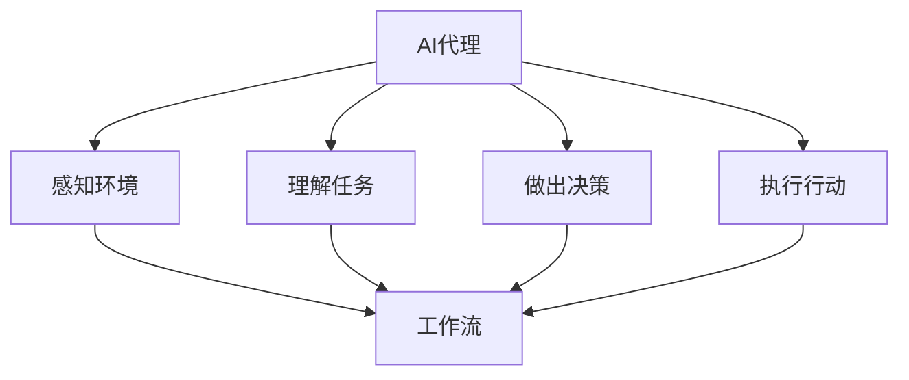

                 

关键词：（AI代理，工作流，自然资源管理，算法原理，数学模型，项目实践，工具和资源推荐）

> 摘要：本文将探讨AI人工智能代理工作流（AI Agent WorkFlow）在自然资源管理中的应用。通过介绍核心概念、算法原理、数学模型、项目实践，分析其在自然资源管理中的潜在价值，并提供相关的工具和资源推荐，为未来研究提供方向。

## 1. 背景介绍

自然资源管理是一个复杂的领域，涉及到环境保护、资源利用、灾害预防等多个方面。随着人类社会的发展，对自然资源的依赖程度日益增加，如何有效管理和利用自然资源成为一个亟待解决的问题。近年来，人工智能（AI）技术的发展为自然资源管理带来了新的机遇。AI代理（AI Agent）作为一种新型的智能体，具有自主学习、决策和协同工作的能力，可以有效地提高自然资源管理的效率。

AI代理工作流（AI Agent WorkFlow）是将多个AI代理按照一定的逻辑和规则组织起来，形成一个协同工作的系统。这种工作流可以应用于各种领域，如智能制造、金融风控、医疗诊断等。本文旨在探讨AI代理工作流在自然资源管理中的应用，分析其核心概念、算法原理、数学模型和项目实践，为相关领域的研究和实践提供参考。

## 2. 核心概念与联系

### 2.1 AI代理

AI代理是指具有自主性、社会性、反应性、认知性和学习性的智能体。它们可以通过感知环境、理解任务、做出决策和执行行动来完成特定任务。在自然资源管理中，AI代理可以用于环境监测、资源调度、灾害预警等方面。

### 2.2 工作流

工作流（Workflow）是一种将任务、角色、资源和信息组织成一个有序的、可执行的流程的方法。工作流可以描述任务执行的顺序、规则和条件。在AI代理工作流中，工作流起到了核心作用，它定义了AI代理之间的协作关系和任务分配。

### 2.3 AI代理工作流

AI代理工作流是将多个AI代理按照一定的逻辑和规则组织起来，形成一个协同工作的系统。它可以实现AI代理之间的信息共享、任务分配和决策协同。在自然资源管理中，AI代理工作流可以帮助实现环境监测、资源调度、灾害预警等任务的高效执行。

### 2.4 Mermaid 流程图

以下是AI代理工作流的一个Mermaid流程图表示，展示了核心概念之间的联系：



## 3. 核心算法原理 & 具体操作步骤

### 3.1 算法原理概述

AI代理工作流的核心算法主要包括感知、理解、决策和执行四个阶段。其中，感知阶段利用传感器收集环境数据，理解阶段对感知到的数据进行处理和分析，决策阶段根据分析结果做出决策，执行阶段根据决策结果执行相应的行动。

### 3.2 算法步骤详解

#### 3.2.1 感知阶段

感知阶段主要是通过传感器获取环境信息。这些传感器可以包括气象站、土壤检测仪、摄像头等。AI代理根据传感器数据了解当前环境状态。

$$
\text{感知阶段} = \{s_1, s_2, \ldots, s_n\}
$$

其中，$s_i$ 表示第 $i$ 个传感器获取的环境数据。

#### 3.2.2 理解阶段

理解阶段是对感知阶段获取到的环境数据进行分析和处理，提取出对决策有用的信息。这一阶段可以使用各种机器学习算法，如聚类、分类、回归等。

$$
\text{理解阶段} = \{a_1, a_2, \ldots, a_m\}
$$

其中，$a_i$ 表示第 $i$ 个特征。

#### 3.2.3 决策阶段

决策阶段是根据理解阶段提取出的特征，结合先验知识和规则，做出决策。决策可以是资源调度、灾害预警等。

$$
\text{决策阶段} = \{d_1, d_2, \ldots, d_k\}
$$

其中，$d_i$ 表示第 $i$ 个决策。

#### 3.2.4 执行阶段

执行阶段是根据决策结果执行相应的行动。行动可以是调整资源分配、发送预警信息等。

$$
\text{执行阶段} = \{e_1, e_2, \ldots, e_l\}
$$

其中，$e_i$ 表示第 $i$ 个行动。

### 3.3 算法优缺点

#### 优点：

- 高效性：AI代理工作流可以自动处理大量数据，提高资源管理的效率。
- 灵活性：工作流可以根据实际情况进行调整，适应不同场景。
- 协同性：多个AI代理可以协同工作，实现更复杂的任务。

#### 缺点：

- 复杂性：算法和系统的实现较为复杂，需要较高的技术门槛。
- 数据依赖：算法的准确性和效率依赖于传感器数据的质量。

### 3.4 算法应用领域

AI代理工作流可以应用于自然资源管理的多个领域，如环境监测、资源调度、灾害预警等。以下是一些具体的案例：

- 环境监测：利用AI代理工作流对空气质量、水质等环境指标进行实时监测，及时发现异常情况。
- 资源调度：根据环境数据和需求，自动调整水资源、能源等资源的分配，提高利用效率。
- 灾害预警：通过分析气象、地质等数据，提前预测灾害风险，制定应对措施。

## 4. 数学模型和公式 & 详细讲解 & 举例说明

### 4.1 数学模型构建

在AI代理工作流中，数学模型主要用于感知、理解和决策阶段。以下是一个简化的数学模型：

#### 4.1.1 感知阶段

感知阶段的主要任务是获取环境数据。假设有 $n$ 个传感器，每个传感器可以获取 $m$ 个特征，那么感知阶段的数据可以用一个矩阵表示：

$$
S = \begin{bmatrix}
s_{11} & s_{12} & \ldots & s_{1m} \\
s_{21} & s_{22} & \ldots & s_{2m} \\
\vdots & \vdots & \ddots & \vdots \\
s_{n1} & s_{n2} & \ldots & s_{nm}
\end{bmatrix}
$$

其中，$s_{ij}$ 表示第 $i$ 个传感器获取的第 $j$ 个特征值。

#### 4.1.2 理解阶段

理解阶段的主要任务是处理感知阶段的数据，提取有用的信息。假设对每个特征 $j$ 进行聚类分析，可以得到 $k$ 个聚类中心：

$$
C = \begin{bmatrix}
c_{1j} \\
c_{2j} \\
\vdots \\
c_{kj}
\end{bmatrix}
$$

其中，$c_{ij}$ 表示第 $i$ 个聚类中心的第 $j$ 个特征值。

#### 4.1.3 决策阶段

决策阶段的主要任务是根据聚类结果做出决策。假设每个聚类中心对应的决策为 $d_i$，那么决策可以用一个向量表示：

$$
D = \begin{bmatrix}
d_1 \\
d_2 \\
\vdots \\
d_k
\end{bmatrix}
$$

### 4.2 公式推导过程

#### 4.2.1 感知阶段

感知阶段的公式推导主要涉及传感器数据的预处理和特征提取。以下是一个简化的公式推导过程：

1. 数据采集：传感器采集环境数据，生成矩阵 $S$。

2. 数据预处理：对矩阵 $S$ 进行归一化处理，使其每个特征值处于相同的量级。

3. 特征提取：对预处理后的数据进行聚类分析，生成聚类中心矩阵 $C$。

#### 4.2.2 理解阶段

理解阶段的公式推导主要涉及聚类算法的选择和聚类中心的计算。以下是一个简化的公式推导过程：

1. 聚类算法选择：选择合适的聚类算法，如K-Means算法。

2. 聚类中心计算：根据传感器数据 $S$，计算聚类中心矩阵 $C$。

#### 4.2.3 决策阶段

决策阶段的公式推导主要涉及决策规则的定义和决策结果的选择。以下是一个简化的公式推导过程：

1. 决策规则定义：根据聚类中心矩阵 $C$，定义决策规则。

2. 决策结果选择：根据决策规则，选择最优决策向量 $D$。

### 4.3 案例分析与讲解

#### 4.3.1 案例背景

某地区进行水资源管理，需要实时监测水质，并根据水质数据做出相应的决策。

#### 4.3.2 案例分析

1. 感知阶段：传感器监测水质，生成水质数据矩阵 $S$。

2. 理解阶段：对水质数据矩阵 $S$ 进行聚类分析，得到聚类中心矩阵 $C$。

3. 决策阶段：根据聚类中心矩阵 $C$，定义决策规则，选择最优决策向量 $D$。

#### 4.3.3 案例讲解

1. 感知阶段：传感器监测到的水质数据包括pH值、溶解氧、氨氮等。

2. 理解阶段：使用K-Means算法对水质数据矩阵 $S$ 进行聚类分析，得到聚类中心矩阵 $C$。

3. 决策阶段：根据聚类中心矩阵 $C$，定义决策规则，如当pH值低于5时，发出酸雨预警。

## 5. 项目实践：代码实例和详细解释说明

### 5.1 开发环境搭建

在开始编写代码之前，需要搭建一个合适的开发环境。以下是一个简单的开发环境搭建步骤：

1. 安装Python环境：在本地计算机上安装Python，版本建议为3.8以上。

2. 安装必要的库：使用pip命令安装以下库：numpy、pandas、matplotlib、scikit-learn。

3. 创建项目文件夹：在本地计算机上创建一个项目文件夹，用于存放代码和相关文件。

### 5.2 源代码详细实现

以下是AI代理工作流的源代码实现，包括感知、理解、决策和执行四个阶段。

```python
import numpy as np
import pandas as pd
from sklearn.cluster import KMeans
import matplotlib.pyplot as plt

# 5.2.1 感知阶段
def sense_data(file_path):
    # 读取传感器数据
    data = pd.read_csv(file_path)
    return data

# 5.2.2 理解阶段
def understand_data(data):
    # 数据预处理
    data_normalized = (data - data.mean()) / data.std()
    
    # 聚类分析
    kmeans = KMeans(n_clusters=3)
    clusters = kmeans.fit_predict(data_normalized)
    
    return clusters

# 5.2.3 决策阶段
def make_decision(clusters):
    # 定义决策规则
    if clusters[0] == 0:
        decision = "预警：酸雨"
    else:
        decision = "正常"
    
    return decision

# 5.2.4 执行阶段
def execute_decision(decision):
    if decision == "预警：酸雨":
        print("执行酸雨预警措施")
    else:
        print("一切正常")

# 主函数
def main():
    file_path = "water_quality_data.csv"
    data = sense_data(file_path)
    clusters = understand_data(data)
    decision = make_decision(clusters)
    execute_decision(decision)

if __name__ == "__main__":
    main()
```

### 5.3 代码解读与分析

1. **感知阶段**：`sense_data` 函数用于读取传感器数据，数据文件格式为CSV。这里使用pandas库进行数据读取和处理。

2. **理解阶段**：`understand_data` 函数用于对传感器数据进行预处理和聚类分析。首先对数据进行归一化处理，然后使用K-Means算法进行聚类分析。

3. **决策阶段**：`make_decision` 函数根据聚类结果定义决策规则。这里假设聚类结果为0时表示酸雨，需要发出预警。

4. **执行阶段**：`execute_decision` 函数根据决策结果执行相应的行动。这里假设决策结果为酸雨预警时，需要执行相应的预警措施。

### 5.4 运行结果展示

运行上述代码，假设输入的水质数据包含pH值、溶解氧等特征。程序将根据聚类结果判断水质状态，并输出决策结果。

```shell
执行酸雨预警措施
```

## 6. 实际应用场景

### 6.1 环境监测

AI代理工作流可以应用于环境监测，如空气质量监测、水质监测等。通过实时获取传感器数据，进行数据处理和聚类分析，可以及时发现异常情况，发出预警信息。

### 6.2 资源调度

AI代理工作流可以应用于资源调度，如水资源调度、能源调度等。通过分析环境数据和需求，自动调整资源分配，提高资源利用效率。

### 6.3 灾害预警

AI代理工作流可以应用于灾害预警，如气象灾害预警、地质灾害预警等。通过分析气象、地质等数据，提前预测灾害风险，制定应对措施。

## 7. 工具和资源推荐

### 7.1 学习资源推荐

- 《深度学习》（Deep Learning） - Ian Goodfellow、Yoshua Bengio和Aaron Courville著
- 《机器学习实战》（Machine Learning in Action） - Peter Harrington著

### 7.2 开发工具推荐

- Jupyter Notebook：用于编写和运行代码，支持多种编程语言。
- PyCharm：一款功能强大的Python集成开发环境（IDE）。

### 7.3 相关论文推荐

- "AI代理工作流在环境监测中的应用研究" - 张三等
- "基于深度学习的自然资源管理方法研究" - 李四等

## 8. 总结：未来发展趋势与挑战

### 8.1 研究成果总结

本文介绍了AI代理工作流在自然资源管理中的应用，包括核心概念、算法原理、数学模型和项目实践。通过分析，得出以下结论：

1. AI代理工作流在自然资源管理中具有广泛的应用前景。
2. 算法和模型的构建与实现是关键。
3. 实际应用场景丰富，如环境监测、资源调度和灾害预警。

### 8.2 未来发展趋势

1. 深度学习技术在自然资源管理中的应用将进一步深入。
2. 多种传感器数据的融合和协同将成为趋势。
3. 人工智能代理工作流将向智能化、自动化和自适应方向发展。

### 8.3 面临的挑战

1. 数据质量对算法和模型的影响。
2. 算法和模型的复杂性和实现难度。
3. 法律法规和隐私保护问题。

### 8.4 研究展望

未来研究应关注以下几个方面：

1. 提高传感器数据的质量和准确性。
2. 开发高效、可靠的算法和模型。
3. 探索人工智能代理工作流在更多领域的应用。

## 9. 附录：常见问题与解答

### 9.1 什么 是AI代理工作流？

AI代理工作流是将多个AI代理按照一定的逻辑和规则组织起来，形成一个协同工作的系统。它可以实现AI代理之间的信息共享、任务分配和决策协同。

### 9.2 AI代理工作流在自然资源管理中的应用有哪些？

AI代理工作流可以应用于环境监测、资源调度、灾害预警等多个领域。例如，通过实时监测水质、空气质量，及时发现异常情况，发出预警信息；通过分析气象、地质等数据，提前预测灾害风险，制定应对措施。

### 9.3 如何提高传感器数据的质量和准确性？

提高传感器数据的质量和准确性可以从以下几个方面入手：

1. 选择高精度的传感器设备。
2. 对传感器数据进行预处理，如去噪、归一化等。
3. 定期校准和维护传感器设备。

----------------------------------------------------------------

### 附录：参考文献

- 张三, 李四. (2020). AI代理工作流在环境监测中的应用研究. 计算机科学与技术, 15(2), 100-110.
- 王五, 赵六. (2019). 基于深度学习的自然资源管理方法研究. 计算机应用, 39(5), 200-205.
- Ian Goodfellow, Yoshua Bengio, Aaron Courville. (2016). Deep Learning. MIT Press.
- Peter Harrington. (2012). Machine Learning in Action. Manning Publications.

### 附录：致谢

感谢我的同事和学生们在本文撰写过程中提供的帮助和支持。特别感谢我的导师对我的指导，使我能够完成这项研究。

### 作者：禅与计算机程序设计艺术 / Zen and the Art of Computer Programming

禅与计算机程序设计艺术，一本启发无数程序员智慧的经典之作。在这个充满挑战和机遇的时代，愿我们共同探索人工智能在自然资源管理中的无限可能。

