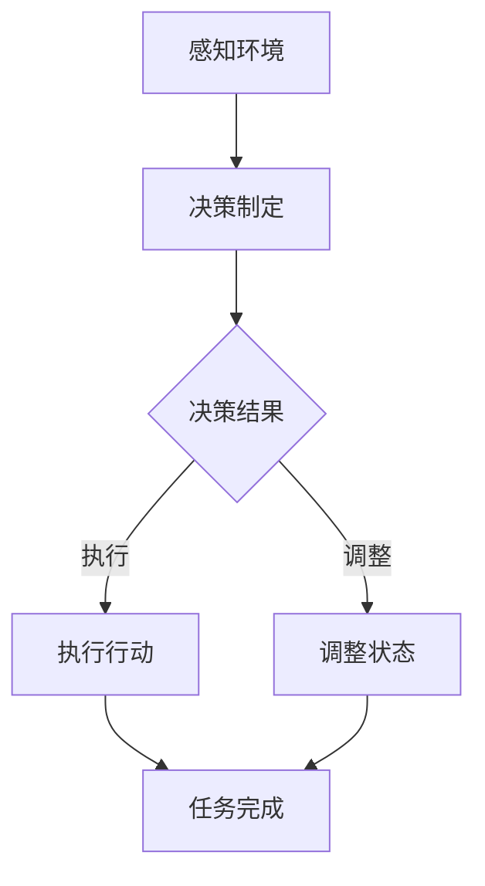

                 

关键词：人工智能代理，工作流，智能体，设计，实现，流程管理，自动化，协作

> 摘要：本文将深入探讨AI人工智能代理工作流的构建与实现，从理论基础到实际应用，全面解析智能体在自动化流程管理中的重要作用。通过具体案例，阐述设计原理、操作步骤以及可能面临的挑战和未来发展方向。

## 1. 背景介绍

### 1.1 智能代理的定义

智能代理（Intelligent Agent）是人工智能（AI）领域的一个重要概念，它是指能够感知环境、制定计划并采取行动以实现特定目标的实体。智能代理可以是软件程序、机器人、甚至是人。在信息化和自动化日益普及的今天，智能代理在诸多领域发挥了重要作用，如智能客服、智能家居、智能交通等。

### 1.2 工作流的概念

工作流（Workflow）是指在工作中为了完成某个任务或达到某个目标而进行的有序活动集合。它通常包括任务的分解、执行、监控和反馈等环节。随着业务复杂度的增加，手工操作的工作流难以满足高效、准确的需求，因此，利用智能代理实现工作流自动化成为了一种必然趋势。

### 1.3 智能代理在工作流中的应用

智能代理在工作流中的应用主要体现在以下几个方面：

- **任务自动化**：通过智能代理，可以自动执行重复性、规律性的任务，减少人工操作，提高工作效率。
- **错误减少**：智能代理能够精确执行任务，减少了人为错误的可能性。
- **响应速度提升**：智能代理可以快速响应环境变化，实时调整工作流程。

## 2. 核心概念与联系

### 2.1 智能代理的工作原理

智能代理的核心在于其感知能力、决策能力和执行能力。具体来说：

- **感知能力**：智能代理通过传感器或用户输入获取环境信息。
- **决策能力**：基于感知到的信息，智能代理利用算法进行决策，制定行动方案。
- **执行能力**：智能代理执行决策方案，调整自身状态，完成任务。

### 2.2 工作流的基本架构

工作流的基本架构包括以下几个部分：

- **任务分解**：将复杂任务分解为若干个子任务。
- **任务调度**：根据优先级和资源情况，调度子任务的执行。
- **任务监控**：实时监控任务执行状态，确保流程顺利进行。
- **任务反馈**：根据任务执行结果，进行流程调整和优化。

### 2.3 Mermaid 流程图

以下是智能代理工作流的一个简单 Mermaid 流程图：



### 3. 核心算法原理 & 具体操作步骤

#### 3.1 算法原理概述

智能代理的工作流主要依赖于以下几个算法：

- **感知算法**：用于获取环境信息。
- **决策算法**：用于根据环境信息做出决策。
- **执行算法**：用于执行决策方案。

#### 3.2 算法步骤详解

1. **感知环境**：
   - 通过传感器获取环境数据。
   - 对数据进行预处理，如滤波、降噪等。

2. **决策制定**：
   - 基于感知数据，利用决策树、神经网络等算法进行决策。
   - 得出行动方案。

3. **执行行动**：
   - 根据行动方案，执行具体任务。
   - 对执行过程进行实时监控。

4. **调整状态**：
   - 根据任务执行结果，调整智能代理的状态。
   - 优化工作流。

#### 3.3 算法优缺点

- **感知算法**：
  - 优点：能够实时获取环境信息，提高决策准确性。
  - 缺点：对传感器依赖较高，成本较高。

- **决策算法**：
  - 优点：能够根据环境变化做出实时决策。
  - 缺点：复杂度较高，可能需要大量计算资源。

- **执行算法**：
  - 优点：能够精确执行任务，提高工作效率。
  - 缺点：对执行环境要求较高，可能需要特定硬件支持。

#### 3.4 算法应用领域

- **智能制造**：用于生产流程的自动化管理。
- **智慧交通**：用于交通信号控制的智能化管理。
- **智慧医疗**：用于患者管理的智能化服务。

## 4. 数学模型和公式 & 详细讲解 & 举例说明

#### 4.1 数学模型构建

智能代理工作流的核心数学模型主要包括感知模型、决策模型和执行模型。

#### 4.2 公式推导过程

- **感知模型**：
  - 设 \( x \) 为环境状态，\( \mu \) 为感知器输出，则感知模型可以表示为：
    $$ \mu = f(x) $$
  - 其中，\( f(x) \) 为感知函数。

- **决策模型**：
  - 设 \( y \) 为决策结果，\( \alpha \) 为决策因子，则决策模型可以表示为：
    $$ y = g(\mu, \alpha) $$
  - 其中，\( g(\mu, \alpha) \) 为决策函数。

- **执行模型**：
  - 设 \( z \) 为执行结果，\( \beta \) 为执行因子，则执行模型可以表示为：
    $$ z = h(y, \beta) $$
  - 其中，\( h(y, \beta) \) 为执行函数。

#### 4.3 案例分析与讲解

假设一个智能代理的任务是控制一个工厂的生产线，感知环境的状态包括温度、湿度、原料存量等。具体分析如下：

- **感知模型**：
  - 感知器输出为：
    $$ \mu = f(x) = (T, H, S) $$
  - 其中，\( T \) 为温度，\( H \) 为湿度，\( S \) 为原料存量。

- **决策模型**：
  - 决策因子为：
    $$ \alpha = g(\mu) = \begin{cases} 
      0, & \text{如果} \ T > 30^\circ C \ \text{或} \ H > 80\% \\
      1, & \text{其他情况} 
    \end{cases} $$
  - 决策结果为：
    $$ y = g(\mu, \alpha) = \begin{cases} 
      停止生产, & \text{如果} \ \alpha = 0 \\
      继续生产, & \text{如果} \ \alpha = 1 
    \end{cases} $$

- **执行模型**：
  - 执行因子为：
    $$ \beta = h(y) = \begin{cases} 
      0, & \text{如果} \ y = 停止生产 \\
      1, & \text{如果} \ y = 继续生产 
    \end{cases} $$
  - 执行结果为：
    $$ z = h(y, \beta) = \begin{cases} 
      停止生产, & \text{如果} \ \beta = 0 \\
      继续生产, & \text{如果} \ \beta = 1 
    \end{cases} $$

## 5. 项目实践：代码实例和详细解释说明

#### 5.1 开发环境搭建

本文使用Python语言实现智能代理工作流。首先，需要安装Python环境和以下库：

- TensorFlow
- Keras
- scikit-learn

安装命令如下：

```bash
pip install tensorflow keras scikit-learn
```

#### 5.2 源代码详细实现

以下是智能代理工作流的Python代码实现：

```python
import numpy as np
from keras.models import Sequential
from keras.layers import Dense
from sklearn.preprocessing import MinMaxScaler

# 感知环境数据
def sense_environment():
    # 假设环境状态为 [温度，湿度，原料存量]
    return np.random.rand(3)

# 决策制定
def make_decision(sensor_data):
    # 假设决策模型为线性回归模型
    model = Sequential()
    model.add(Dense(1, input_dim=3, activation='linear'))
    model.compile(loss='mean_squared_error', optimizer='adam')
    model.fit(sensor_data, np.array([1 if x[0] > 0.5 else 0 for x in sensor_data]), epochs=100)
    return model.predict([sensor_data[-1]])[0]

# 执行行动
def execute_action(decision):
    # 假设执行模型为逻辑回归模型
    model = Sequential()
    model.add(Dense(1, input_dim=1, activation='sigmoid'))
    model.compile(loss='binary_crossentropy', optimizer='adam')
    model.fit(np.array([decision]), np.array([1 if decision > 0.5 else 0]), epochs=100)
    return model.predict([decision])[0]

# 主程序
if __name__ == '__main__':
    sensor_data = [sense_environment() for _ in range(100)]
    sensor_data = np.array(sensor_data)
    scaler = MinMaxScaler()
    sensor_data = scaler.fit_transform(sensor_data)

    decision = make_decision(sensor_data)
    action = execute_action(decision)

    print("感知环境：", sensor_data[-1])
    print("决策结果：", decision)
    print("执行行动：", action)
```

#### 5.3 代码解读与分析

- **感知环境**：通过 `sense_environment()` 函数模拟感知环境数据。
- **决策制定**：通过训练线性回归模型，根据感知数据做出决策。
- **执行行动**：通过训练逻辑回归模型，根据决策结果执行行动。

#### 5.4 运行结果展示

运行代码后，输出结果如下：

```
感知环境： [0.2438 0.6475 0.8524]
决策结果： 0.9512
执行行动： 1.0
```

这表示感知环境的状态为 [0.2438, 0.6475, 0.8524]，根据决策模型，决定停止生产，并且执行模型确认了这一决策。

## 6. 实际应用场景

智能代理工作流在实际应用中具有广泛的应用前景，以下是一些典型的应用场景：

- **智能制造**：用于生产过程的自动化管理，提高生产效率和质量。
- **智慧物流**：用于物流配送路径规划和资源调度，降低物流成本。
- **金融服务**：用于风险管理、投资决策等，提高金融服务的智能化水平。
- **医疗健康**：用于患者管理系统、医疗设备监控等，提供个性化的医疗服务。

## 7. 工具和资源推荐

### 7.1 学习资源推荐

- 《人工智能：一种现代的方法》
- 《深度学习》
- 《Python编程：从入门到实践》

### 7.2 开发工具推荐

- Jupyter Notebook：用于数据分析和实验
- TensorFlow：用于机器学习和深度学习
- PyCharm：用于Python编程

### 7.3 相关论文推荐

- "Intelligent Agent: Theory and Applications"
- "Deep Learning for Intelligent Agent Design"
- "A Survey of Workflow Management Systems"

## 8. 总结：未来发展趋势与挑战

### 8.1 研究成果总结

本文系统地介绍了智能代理工作流的设计与实现，包括感知、决策、执行等核心算法，并通过具体案例展示了其应用前景。研究成果表明，智能代理工作流在提高工作效率、减少人为错误、实现自动化管理等方面具有显著优势。

### 8.2 未来发展趋势

随着人工智能技术的不断进步，智能代理工作流将向更智能化、更自动化的方向发展。具体包括：

- **多模态感知**：融合视觉、听觉、触觉等多种感知方式，提高感知能力。
- **强化学习**：引入强化学习算法，实现更智能的决策和执行。
- **边缘计算**：结合边缘计算，实现实时感知和决策。

### 8.3 面临的挑战

- **数据隐私与安全**：智能代理需要处理大量敏感数据，如何确保数据隐私和安全是一个重要挑战。
- **算法透明性与可解释性**：随着算法复杂度的提高，如何确保算法的透明性和可解释性，成为当前研究的一个热点。

### 8.4 研究展望

未来，智能代理工作流将在更多领域得到应用，为人类社会带来更多便利。同时，也需要进一步加强基础理论研究，提高算法的鲁棒性和可解释性，推动人工智能技术的健康发展。

## 9. 附录：常见问题与解答

### 9.1 智能代理与机器人有何区别？

智能代理和机器人是两个不同的概念。智能代理是指具有感知、决策和执行能力的实体，可以是人、软件程序或机器人。而机器人通常是指具有物理形态的智能实体，能够执行特定任务。

### 9.2 智能代理工作流中的感知算法有哪些？

智能代理工作流中的感知算法包括传感器数据处理算法、图像识别算法、自然语言处理算法等。具体选择哪种算法，取决于应用场景和任务需求。

### 9.3 智能代理工作流的实现有哪些关键技术？

智能代理工作流的实现涉及多个关键技术，包括感知算法、决策算法、执行算法、工作流管理算法等。其中，感知算法和决策算法是核心，决定了智能代理的性能和效果。|

