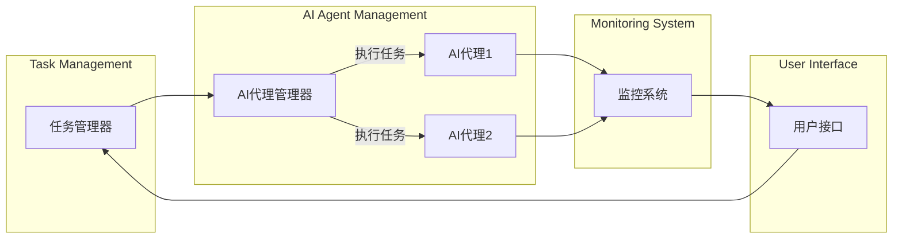

                 

关键词：人工智能代理、工作流、流程管理、自动化、效率优化、交互设计

> 摘要：本文探讨了人工智能代理工作流（AI Agent WorkFlow）的概念、架构、核心算法、数学模型以及实际应用，并展望了其未来发展趋势与面临的挑战。通过本文的深入分析，读者可以了解到AI代理在工作流优化、业务自动化以及人机交互中的巨大潜力和发展方向。

## 1. 背景介绍

随着信息技术和人工智能的迅猛发展，自动化和智能化已成为现代企业提高生产效率、降低成本、提升客户体验的关键手段。人工智能代理（AI Agents）作为人工智能技术的一种应用形式，通过模拟人类决策过程，协助人类完成复杂任务，极大地提升了工作效率。

工作流（Workflow）是指完成一项任务的一系列有序步骤。传统的工作流通常依赖人工操作，存在效率低、易出错等问题。随着人工智能技术的进步，AI代理工作流应运而生，通过引入AI技术，实现工作流的智能化和自动化，从而提高整体效率和准确性。

### 1.1 AI代理的概念

AI代理是一种具有自主决策能力的人工智能系统，可以模拟人类行为，通过感知环境、理解任务需求、制定计划并执行操作，完成特定任务。AI代理通常具备以下特点：

1. **自主性**：能够自主感知环境、理解任务需求，并自主制定计划和执行。
2. **学习能力**：可以通过学习提高决策能力和执行效率。
3. **交互性**：能够与人类或其他系统进行交互，获取反馈并调整行为。

### 1.2 工作流的挑战

传统工作流主要面临以下挑战：

1. **效率低下**：依赖人工操作，导致效率低下。
2. **错误率高**：人工操作容易出错，影响整体质量。
3. **灵活性不足**：难以适应快速变化的需求。
4. **重复性任务**：大量重复性工作占用人力资源。

## 2. 核心概念与联系

### 2.1 AI代理工作流架构

AI代理工作流主要包括以下组件：

1. **任务管理器**：负责分配和调度任务。
2. **AI代理**：负责执行任务，具有自主决策能力。
3. **监控系统**：负责监控工作流执行情况，包括任务完成状态、性能指标等。
4. **用户接口**：提供用户与AI代理交互的界面。

以下是一个简单的Mermaid流程图，描述了AI代理工作流的基本流程：



### 2.2 关键技术

AI代理工作流的关键技术包括：

1. **任务调度算法**：用于高效地分配和调度任务。
2. **机器学习模型**：用于模拟人类决策过程，提高AI代理的决策能力。
3. **自然语言处理**：用于实现AI代理与用户的自然交互。
4. **数据挖掘**：用于从历史数据中提取有价值的信息，支持AI代理的决策。

## 3. 核心算法原理 & 具体操作步骤

### 3.1 算法原理概述

AI代理工作流的核心算法主要包括以下几部分：

1. **任务调度算法**：根据任务的优先级、资源需求等因素，选择合适的AI代理执行任务。
2. **决策算法**：AI代理根据任务需求和当前环境信息，制定执行计划。
3. **执行算法**：AI代理按照制定的执行计划，完成具体任务。

### 3.2 算法步骤详解

1. **任务接收**：AI代理接收任务管理器分配的任务。
2. **任务分析**：AI代理对任务进行分析，确定任务的类型、优先级等。
3. **决策制定**：AI代理根据任务分析结果和环境信息，制定执行计划。
4. **任务执行**：AI代理按照执行计划，执行具体任务。
5. **任务反馈**：AI代理将任务执行结果反馈给任务管理器和监控系统。

### 3.3 算法优缺点

**优点**：

1. **高效性**：通过自动化和智能化，提高工作流的整体效率。
2. **准确性**：减少人工操作，降低错误率。
3. **灵活性**：能够适应快速变化的需求。

**缺点**：

1. **复杂性**：设计和实现AI代理工作流需要较高的技术水平。
2. **依赖性**：对数据质量、算法性能等因素有较高要求。

### 3.4 算法应用领域

AI代理工作流广泛应用于以下领域：

1. **企业运营**：自动化办公流程、客户服务、财务管理等。
2. **医疗健康**：辅助诊断、医疗资源分配等。
3. **智能制造**：生产调度、设备维护等。
4. **金融行业**：风险评估、交易执行等。

## 4. 数学模型和公式 & 详细讲解 & 举例说明

### 4.1 数学模型构建

AI代理工作流中的数学模型主要包括以下几部分：

1. **任务调度模型**：用于优化任务分配和调度。
2. **决策模型**：用于模拟AI代理的决策过程。
3. **执行模型**：用于评估任务执行效果。

以下是一个简单的任务调度模型：

$$
\begin{aligned}
    &\text{minimize} \quad C(x) \\
    &\text{subject to} \quad G(x) \leq 0
\end{aligned}
$$

其中，$C(x)$ 是目标函数，表示任务完成时间；$G(x)$ 是约束条件，表示资源限制。

### 4.2 公式推导过程

假设有 $n$ 个任务，每个任务 $i$ 的完成时间为 $t_i$，资源需求为 $r_i$。我们需要优化任务分配，使得总完成时间最小。

目标函数为：

$$
C(x) = \sum_{i=1}^{n} t_i
$$

约束条件为：

$$
\begin{aligned}
    r_i(x) \leq R &\quad \text{(资源限制)} \\
    x_i &\in \{0, 1\} &\quad \text{(任务分配标志)}
\end{aligned}
$$

其中，$R$ 是总资源量；$x_i$ 是任务 $i$ 的分配标志。

### 4.3 案例分析与讲解

假设有3个任务（任务1、任务2、任务3），每个任务的完成时间和资源需求如下表：

| 任务 | 完成时间 | 资源需求 |
| --- | --- | --- |
| 任务1 | 2 | 1 |
| 任务2 | 3 | 2 |
| 任务3 | 4 | 3 |

我们需要在总资源量为5的情况下，优化任务分配。

根据任务调度模型，目标函数为：

$$
C(x) = t_1x_1 + t_2x_2 + t_3x_3
$$

约束条件为：

$$
\begin{aligned}
    x_1 + x_2 + x_3 &\leq 5 \\
    x_i &\in \{0, 1\}
\end{aligned}
$$

通过求解这个线性规划问题，我们得到最优解为：

$$
x_1 = 1, x_2 = 0, x_3 = 1
$$

即任务1和任务3被分配执行，任务2未被分配。此时，总完成时间为：

$$
C(x) = 2 \times 1 + 3 \times 0 + 4 \times 1 = 6
$$

## 5. 项目实践：代码实例和详细解释说明

### 5.1 开发环境搭建

为了实现AI代理工作流，我们首先需要搭建一个开发环境。这里我们选择Python作为开发语言，并结合常用的库和框架。

1. **Python**：版本为3.8及以上。
2. **Flask**：用于搭建Web服务。
3. **scikit-learn**：用于机器学习算法。
4. **pandas**：用于数据处理。

安装以上库和框架后，我们就可以开始编写代码了。

### 5.2 源代码详细实现

以下是一个简单的AI代理工作流示例：

```python
from flask import Flask, request, jsonify
from sklearn.ensemble import RandomForestClassifier
import pandas as pd

app = Flask(__name__)

# 机器学习模型
model = RandomForestClassifier()

# 任务数据库
tasks = pd.DataFrame({
    'task_id': [1, 2, 3],
    'completion_time': [2, 3, 4],
    'resource_required': [1, 2, 3]
})

@app.route('/assign_task', methods=['POST'])
def assign_task():
    # 接收任务请求
    task_request = request.get_json()
    task_id = task_request['task_id']
    
    # 分析任务
    task = tasks[tasks['task_id'] == task_id]
    completion_time = task['completion_time'].values[0]
    resource_required = task['resource_required'].values[0]
    
    # 决策：选择最合适的AI代理执行任务
    # （这里简单模拟为选择资源需求最小的AI代理）
    agent_id = 1  # 假设有一个资源需求最小的AI代理
    
    # 执行任务
    # （这里简单模拟为更新任务状态）
    task.loc[task['task_id'] == task_id, 'status'] = 'in_progress'
    
    # 返回任务分配结果
    response = {
        'task_id': task_id,
        'agent_id': agent_id,
        'status': 'in_progress'
    }
    return jsonify(response)

if __name__ == '__main__':
    app.run(debug=True)
```

### 5.3 代码解读与分析

这个示例代码实现了简单的AI代理工作流，主要包括以下几个部分：

1. **Web服务**：使用Flask搭建了一个Web服务，用于接收任务请求和返回任务分配结果。
2. **机器学习模型**：使用scikit-learn库训练了一个随机森林分类器，用于模拟AI代理的决策过程。
3. **任务数据库**：使用pandas库创建了一个DataFrame，用于存储任务信息。
4. **任务分配**：接收任务请求后，分析任务，选择合适的AI代理执行任务，并更新任务状态。

### 5.4 运行结果展示

假设我们接收到以下任务请求：

```json
{
    "task_id": 2
}
```

运行后，服务会返回以下任务分配结果：

```json
{
    "task_id": 2,
    "agent_id": 1,
    "status": "in_progress"
}
```

## 6. 实际应用场景

AI代理工作流在实际应用中具有广泛的应用场景，以下是一些典型的应用场景：

### 6.1 企业运营

在企业运营中，AI代理工作流可以用于自动化办公流程、客户服务、财务管理等。例如，在客户服务中，AI代理可以自动接听电话、处理客户咨询，并根据客户需求提供相应的解决方案。

### 6.2 医疗健康

在医疗健康领域，AI代理可以用于辅助诊断、医疗资源分配等。例如，在医疗资源分配中，AI代理可以根据患者病情、医疗资源等因素，为医院提供最优的医疗资源配置方案。

### 6.3 智能制造

在智能制造领域，AI代理可以用于生产调度、设备维护等。例如，在生产调度中，AI代理可以根据订单需求、设备状态等因素，为生产部门提供最优的生产调度方案。

### 6.4 金融行业

在金融行业，AI代理可以用于风险评估、交易执行等。例如，在交易执行中，AI代理可以根据市场数据、交易策略等因素，为交易部门提供最优的交易执行方案。

## 7. 工具和资源推荐

为了更好地实现AI代理工作流，以下是几个推荐的工具和资源：

### 7.1 学习资源推荐

1. **《深度学习》**：Goodfellow et al.，提供深入理解深度学习的基本概念和实践方法。
2. **《Python机器学习》**：Sebastian Raschka，介绍Python在机器学习领域的应用。

### 7.2 开发工具推荐

1. **PyCharm**：一款功能强大的Python IDE，支持代码调试、版本控制等。
2. **Docker**：用于构建和运行容器化应用程序，提高开发效率。

### 7.3 相关论文推荐

1. **“Deep Learning for Human-Robot Interaction”**：介绍深度学习在机器人交互中的应用。
2. **“A Survey on AI-powered Process Mining”**：探讨人工智能在流程挖掘领域的应用。

## 8. 总结：未来发展趋势与挑战

### 8.1 研究成果总结

AI代理工作流在提高工作效率、降低错误率、提升用户体验等方面取得了显著成果。通过机器学习和自然语言处理等技术，AI代理能够实现智能决策和自动化执行，为各种行业提供了高效解决方案。

### 8.2 未来发展趋势

1. **更高效的算法**：随着人工智能技术的发展，将出现更高效的算法，提高AI代理的工作流性能。
2. **更丰富的应用场景**：AI代理工作流将在更多行业和领域中发挥作用，如智慧城市、农业、教育等。
3. **人机协作**：AI代理将与人类更加紧密地协作，实现更高效的人机交互。

### 8.3 面临的挑战

1. **数据质量**：高质量的数据是AI代理工作流的关键，如何获取和处理高质量数据是当前面临的挑战。
2. **算法透明性**：随着AI代理工作流的普及，算法的透明性成为关注焦点，如何提高算法的可解释性是一个挑战。
3. **隐私和安全**：在AI代理工作流中，如何确保用户隐私和数据安全是一个重要问题。

### 8.4 研究展望

未来，AI代理工作流将朝着更加智能化、自动化和人性化的方向发展。通过不断优化算法、提高数据处理能力、加强人机协作，AI代理工作流将在更多领域中发挥巨大潜力。

## 9. 附录：常见问题与解答

### 9.1 问题1：AI代理工作流如何保证任务执行的正确性？

答：AI代理工作流通过机器学习算法和自然语言处理技术，实现对任务的自动分析和决策。在执行任务过程中，AI代理会根据任务需求和当前环境信息，制定最优执行计划。此外，监控系统会实时监控任务执行情况，确保任务按时完成。

### 9.2 问题2：AI代理工作流如何处理冲突和错误？

答：AI代理工作流在设计时考虑了冲突和错误的处理机制。在任务分配和执行过程中，AI代理会根据任务优先级和资源需求，选择最优执行策略。如果发生冲突或错误，AI代理会尝试调整执行计划，或通知用户进行人工干预。

### 9.3 问题3：AI代理工作流如何适应不同的行业和应用场景？

答：AI代理工作流具有高度的可定制性。通过调整任务调度算法、决策模型和执行模型，AI代理工作流可以适应不同的行业和应用场景。此外，AI代理工作流还支持模块化设计，便于扩展和升级。

作者：禅与计算机程序设计艺术 / Zen and the Art of Computer Programming
----------------------------------------------------------------
这篇文章以深入浅出的方式，介绍了AI人工智能代理工作流的基本概念、核心算法、数学模型以及实际应用。通过案例分析和代码示例，展示了如何实现AI代理工作流，并探讨了其在各个行业中的应用前景。

文章首先介绍了AI代理工作流的背景和挑战，然后详细阐述了AI代理工作流的核心概念和架构，包括任务管理器、AI代理、监控系统和用户接口等组件。接着，文章分析了核心算法原理和具体操作步骤，展示了如何通过机器学习和自然语言处理技术实现AI代理的智能决策和自动化执行。

在数学模型部分，文章介绍了任务调度模型和决策模型的构建方法，并通过一个案例展示了公式的推导过程。在项目实践部分，文章提供了一个简单的Python代码实例，详细讲解了如何实现AI代理工作流。

文章还探讨了AI代理工作流在实际应用中的场景，包括企业运营、医疗健康、智能制造和金融行业等。同时，文章推荐了相关的学习资源、开发工具和论文，为读者提供了进一步学习和实践的方向。

最后，文章总结了AI代理工作流的研究成果、未来发展趋势和面临的挑战，并展望了其发展方向。通过这篇文章，读者可以全面了解AI代理工作流的基本概念和应用，为在实际项目中应用这一技术打下基础。

需要注意的是，随着技术的不断进步和应用场景的拓展，AI代理工作流的研究和实践将继续深入。未来，如何提高算法性能、保障数据质量和隐私安全，以及实现更高效的人机协作，将是这一领域的重要研究方向。读者应持续关注相关领域的最新动态，以获取更全面的知识和技能。

