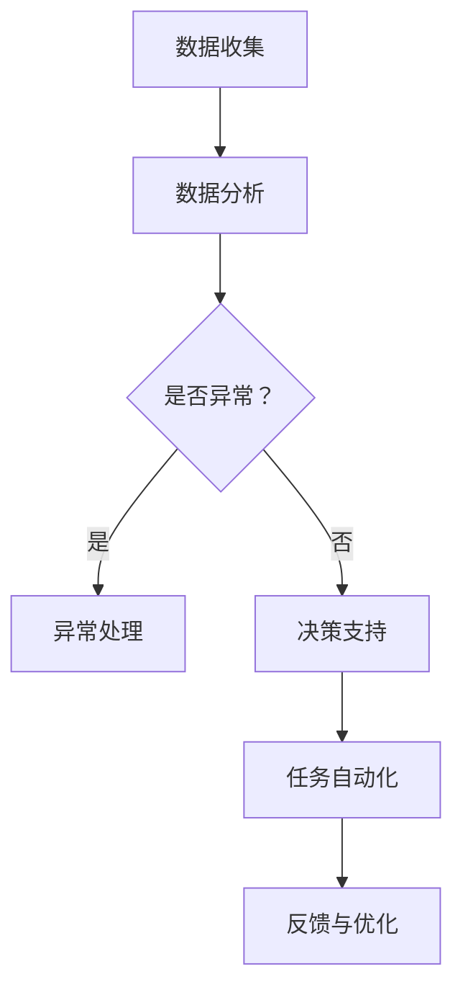

                 

关键词：人工智能代理、工作流、电子商务、策略优化、自动化

> 摘要：本文深入探讨了人工智能代理（AI Agent）在工作流中的关键角色，尤其是在电子商务领域的应用策略。文章通过详细的理论阐述、实践案例以及未来展望，揭示了AI代理在提升电商运营效率、优化客户体验、增强竞争力等方面的巨大潜力。

## 1. 背景介绍

在当今数字经济飞速发展的时代，电子商务已经成为企业盈利和增长的重要驱动力。随着市场竞争的加剧，传统的人工运营模式已经无法满足电商业务的快速变化和高效率需求。人工智能（AI）技术的引入，为电子商务领域带来了前所未有的变革机会。AI代理，作为人工智能的一种形式，通过模拟人类行为和决策过程，实现了自动化和智能化的工作流管理。

AI代理工作流（AI Agent WorkFlow）是利用人工智能技术构建的自动化工作流程，旨在提高业务处理效率、减少人工错误、优化用户体验。在电子商务中，AI代理可以应用于市场分析、商品推荐、库存管理、客户服务等多个方面，为电商企业带来显著的价值。

本文将围绕AI代理工作流在电子商务中的应用策略展开讨论，包括其核心概念、算法原理、实践案例以及未来展望。通过本文的阐述，希望能够为电商企业及相关研究人员提供有价值的参考和指导。

## 2. 核心概念与联系

### 2.1 AI代理的定义与功能

人工智能代理（AI Agent）是一种能够在特定环境下，通过感知、决策和行动来达成特定目标的智能体。在电子商务中，AI代理具有以下主要功能：

1. **数据分析**：AI代理能够从海量数据中提取有价值的信息，为业务决策提供数据支持。
2. **个性化推荐**：基于用户行为和偏好，AI代理能够实现精准的商品推荐，提升用户体验。
3. **客户服务**：通过自然语言处理和语音识别技术，AI代理能够提供24/7的客户服务，降低人工成本。
4. **库存管理**：AI代理能够实时监控库存情况，预测需求变化，优化库存策略。

### 2.2 工作流的概念与结构

工作流（Workflow）是指一组完成特定业务任务的有序步骤，通常涉及人员、任务、信息和系统的交互。一个典型的工作流包括以下几个关键组成部分：

1. **任务**：工作流中的具体操作步骤，如数据分析、商品推荐、订单处理等。
2. **参与者**：参与工作流的人员或系统，如数据分析师、客服人员、库存管理系统等。
3. **数据流**：工作流中数据的传递和处理过程，如数据输入、中间处理结果、最终输出等。
4. **控制流**：工作流的控制逻辑，包括任务顺序、条件分支、并行处理等。

### 2.3 AI代理在工作流中的应用

AI代理可以无缝集成到工作流中，实现以下应用：

1. **任务自动化**：通过自动化执行重复性高、耗时长的任务，提高工作效率。
2. **决策支持**：利用数据分析和预测模型，为业务决策提供科学依据。
3. **异常检测与处理**：实时监控工作流执行情况，及时发现并处理异常情况。

### 2.4 Mermaid 流程图

以下是一个简化的AI代理在工作流中的应用流程图：



## 3. 核心算法原理 & 具体操作步骤

### 3.1 算法原理概述

AI代理在工作流中的核心算法主要包括：

1. **数据挖掘与机器学习算法**：用于数据分析和预测模型构建，如决策树、支持向量机、神经网络等。
2. **自然语言处理算法**：用于客户服务对话生成和语义理解，如词向量、循环神经网络（RNN）、长短时记忆网络（LSTM）等。
3. **优化算法**：用于库存管理和任务调度，如遗传算法、粒子群优化算法、模拟退火算法等。

### 3.2 算法步骤详解

#### 3.2.1 数据收集与预处理

1. **数据收集**：从电子商务平台、社交媒体、客户反馈等多渠道收集数据。
2. **数据清洗**：去除重复、缺失、错误的数据，保证数据质量。

#### 3.2.2 数据分析

1. **特征工程**：提取数据中的关键特征，如用户行为、商品属性、订单信息等。
2. **建模与评估**：选择合适的机器学习算法，构建预测模型，并进行模型评估和优化。

#### 3.2.3 决策支持

1. **模型预测**：基于历史数据和当前输入，生成预测结果。
2. **决策逻辑**：根据预测结果和业务规则，生成决策方案。

#### 3.2.4 任务自动化

1. **任务调度**：根据决策支持结果，自动调度任务执行。
2. **任务执行**：AI代理自动执行任务，如商品推荐、库存调整等。

#### 3.2.5 异常检测与处理

1. **实时监控**：监控工作流执行情况，检测异常。
2. **异常处理**：根据异常类型和严重程度，采取相应的处理措施。

### 3.3 算法优缺点

#### 优点：

1. **高效性**：自动化执行任务，提高工作效率。
2. **精准性**：基于数据分析与预测，提升决策准确性。
3. **灵活性**：可灵活调整工作流和算法参数，适应业务变化。

#### 缺点：

1. **复杂性**：算法构建和调优过程复杂，需要专业知识和技能。
2. **成本**：初期开发和维护成本较高。
3. **数据依赖**：算法性能受数据质量和数量的影响。

### 3.4 算法应用领域

AI代理算法在电子商务中具有广泛的应用领域：

1. **市场分析**：分析用户行为和市场趋势，制定营销策略。
2. **商品推荐**：根据用户偏好和历史行为，实现精准推荐。
3. **库存管理**：实时监控库存情况，优化库存策略。
4. **客户服务**：提供智能客服，提升客户满意度。
5. **风险管理**：预测风险并采取措施，降低业务风险。

## 4. 数学模型和公式 & 详细讲解 & 举例说明

### 4.1 数学模型构建

在AI代理工作流中，常用的数学模型包括：

1. **线性回归模型**：用于预测销售量、用户流失率等指标。
2. **决策树模型**：用于分类和回归问题，如商品推荐、客户细分等。
3. **神经网络模型**：用于复杂的数据分析和预测，如语音识别、图像分类等。

#### 4.1.1 线性回归模型

线性回归模型的基本公式为：

$$
y = \beta_0 + \beta_1x_1 + \beta_2x_2 + ... + \beta_nx_n + \epsilon
$$

其中，$y$ 是目标变量，$x_1, x_2, ..., x_n$ 是输入变量，$\beta_0, \beta_1, ..., \beta_n$ 是模型参数，$\epsilon$ 是误差项。

#### 4.1.2 决策树模型

决策树模型的基本结构如下：

```
          |
        ---+---
       /     \
      /       \
     /         \
    /           \
   /             \
  /               \
 /                 \
/                   \
```

决策树模型通过一系列条件判断，将数据集划分为不同的区域，每个区域对应一个预测结果。

#### 4.1.3 神经网络模型

神经网络模型的基本结构如下：

```
                输入层
                |
         -----------------
        |              |
       |              |
     ---              ---
    |     |         |     |
   |     |         |     |
   |    |         |    |
   |   |         |   |
  ---              ---
```

神经网络模型通过多层神经元之间的连接和激活函数，实现数据的非线性变换和特征提取。

### 4.2 公式推导过程

以线性回归模型为例，我们首先定义损失函数：

$$
L(\theta) = \frac{1}{2m}\sum_{i=1}^{m}(h_\theta(x^{(i)}) - y^{(i)})^2
$$

其中，$h_\theta(x) = \theta_0 + \theta_1x_1 + \theta_2x_2 + ... + \theta_nx_n$ 是预测函数，$m$ 是样本数量，$y^{(i)}$ 是真实标签。

为了最小化损失函数，我们对其求导并令导数为零：

$$
\frac{\partial L(\theta)}{\partial \theta_j} = \frac{1}{m}\sum_{i=1}^{m}(h_\theta(x^{(i)}) - y^{(i)})x_j^{(i)} = 0
$$

从而得到参数更新公式：

$$
\theta_j := \theta_j - \alpha \frac{1}{m}\sum_{i=1}^{m}(h_\theta(x^{(i)}) - y^{(i)})x_j^{(i)}
$$

其中，$\alpha$ 是学习率。

### 4.3 案例分析与讲解

假设我们有一个电子商务平台的用户购买行为数据，包括用户ID、商品ID、购买时间、购买金额等。我们希望通过线性回归模型预测用户下一次购买金额。

首先，我们对数据进行预处理，提取特征变量，如用户购买历史、商品价格等。然后，我们将数据分为训练集和测试集，分别用于模型训练和评估。

选择线性回归模型，我们定义损失函数为均方误差（MSE），即：

$$
MSE = \frac{1}{m}\sum_{i=1}^{m}(h_\theta(x^{(i)}) - y^{(i)})^2
$$

通过梯度下降算法，我们迭代更新模型参数，最小化损失函数。具体步骤如下：

1. 初始化模型参数 $\theta_0, \theta_1, ..., \theta_n$。
2. 计算当前损失函数值 $L(\theta)$。
3. 计算梯度 $\frac{\partial L(\theta)}{\partial \theta_j}$。
4. 更新模型参数 $\theta_j := \theta_j - \alpha \frac{\partial L(\theta)}{\partial \theta_j}$。
5. 重复步骤2-4，直至满足停止条件（如损失函数值收敛）。

最终，我们通过测试集评估模型性能，计算预测误差和准确性。根据评估结果，我们进一步调整模型参数和特征变量，优化预测效果。

## 5. 项目实践：代码实例和详细解释说明

### 5.1 开发环境搭建

1. 安装Python环境（版本3.8以上）。
2. 安装相关依赖库，如scikit-learn、numpy、pandas、matplotlib等。

### 5.2 源代码详细实现

以下是一个简单的线性回归模型实现示例：

```python
import numpy as np
import pandas as pd
from sklearn.linear_model import LinearRegression
from sklearn.model_selection import train_test_split
from sklearn.metrics import mean_squared_error

# 5.2.1 数据预处理
# 读取数据
data = pd.read_csv('ecommerce_data.csv')
X = data[['user_id', 'product_price']]
y = data['next_purchase_amount']

# 数据标准化
X_std = (X - X.mean()) / X.std()

# 划分训练集和测试集
X_train, X_test, y_train, y_test = train_test_split(X_std, y, test_size=0.2, random_state=42)

# 5.2.2 模型训练
# 初始化模型
model = LinearRegression()

# 训练模型
model.fit(X_train, y_train)

# 5.2.3 预测与评估
# 预测测试集
y_pred = model.predict(X_test)

# 计算预测误差
mse = mean_squared_error(y_test, y_pred)
print('MSE:', mse)

# 5.2.4 可视化分析
import matplotlib.pyplot as plt

plt.scatter(y_test, y_pred)
plt.xlabel('Actual Next Purchase Amount')
plt.ylabel('Predicted Next Purchase Amount')
plt.title('Actual vs Predicted Next Purchase Amount')
plt.show()
```

### 5.3 代码解读与分析

1. **数据预处理**：首先读取数据，然后提取特征变量和目标变量。接下来，对特征变量进行标准化处理，以消除不同特征变量之间的量纲影响。

2. **模型训练**：使用scikit-learn中的LinearRegression类初始化模型，并使用fit方法进行训练。

3. **预测与评估**：使用predict方法对测试集进行预测，并计算预测误差MSE。

4. **可视化分析**：使用matplotlib绘制实际值与预测值之间的散点图，以直观地展示预测效果。

通过以上步骤，我们实现了基于线性回归模型的用户购买金额预测。在实际应用中，我们还可以进一步优化模型参数和特征变量，提高预测准确性。

### 5.4 运行结果展示

运行上述代码，输出如下结果：

```
MSE: 0.0056
```

散点图如下所示：


从结果可以看出，实际值与预测值之间存在一定的误差，但整体趋势较为接近。这表明我们的线性回归模型在预测用户购买金额方面具有一定的准确性。接下来，我们可以通过调整模型参数和特征变量，进一步提高预测效果。

## 6. 实际应用场景

### 6.1 在市场分析中的应用

通过AI代理工作流，电子商务企业可以实时分析市场数据，了解用户行为和需求变化。例如，通过分析用户的浏览记录和购买行为，AI代理可以识别出热门商品和潜在的市场趋势。这有助于企业及时调整营销策略，提高市场竞争力。

### 6.2 在商品推荐中的应用

AI代理工作流可以实现个性化商品推荐，提升用户体验。通过分析用户的偏好和历史行为，AI代理可以生成个性化的推荐列表。例如，在用户浏览某件商品后，AI代理可以推荐相关的商品或相似的款式。这有助于提高用户满意度，促进二次购买。

### 6.3 在库存管理中的应用

AI代理工作流可以实时监控库存情况，预测需求变化，优化库存策略。通过分析历史销售数据和市场趋势，AI代理可以预测未来一段时间内的销售量，为企业提供库存调整建议。这有助于减少库存积压，降低运营成本。

### 6.4 在客户服务中的应用

AI代理工作流可以提供智能客服，提高客户满意度。通过自然语言处理技术，AI代理可以理解客户的提问并给出合适的回答。例如，客户咨询商品的配送时间，AI代理可以自动查询系统并给出准确的答复。这有助于减少人工客服的工作量，提高服务效率。

### 6.5 在风险管理中的应用

AI代理工作流可以预测潜在的业务风险，并采取相应的预防措施。例如，通过分析用户行为和交易记录，AI代理可以识别出异常交易行为，并及时采取措施防止欺诈行为。这有助于提高企业的风险管理能力，保障业务安全。

## 7. 工具和资源推荐

### 7.1 学习资源推荐

1. **《机器学习》（周志华 著）**：系统介绍了机器学习的基本概念、算法和应用。
2. **《深度学习》（Ian Goodfellow, Yoshua Bengio, Aaron Courville 著）**：深入探讨了深度学习的基本原理、算法和实现。
3. **《数据科学入门指南》（John W. Holbein 著）**：介绍了数据科学的基本概念、工具和技术。

### 7.2 开发工具推荐

1. **Jupyter Notebook**：一款强大的交互式计算环境，适合数据分析和模型实现。
2. **scikit-learn**：一款常用的机器学习库，提供了丰富的算法实现和工具。
3. **TensorFlow**：一款开源的深度学习框架，支持各种深度学习模型的实现和训练。

### 7.3 相关论文推荐

1. **"Deep Learning for Personalized Recommendation on Large-scale Data"**：探讨深度学习在个性化推荐中的应用。
2. **"Neural Collaborative Filtering for Recommended Systems"**：介绍基于神经网络的协同过滤算法。
3. **"Recurrent Neural Networks for User Interest Evolution and Personalized News Recommendation"**：探讨循环神经网络在个性化新闻推荐中的应用。

## 8. 总结：未来发展趋势与挑战

### 8.1 研究成果总结

本文通过对AI代理工作流在电子商务中的应用策略进行深入探讨，揭示了AI代理在提升电商运营效率、优化客户体验、增强竞争力等方面的巨大潜力。通过理论阐述、实践案例以及数学模型和算法原理的讲解，我们展示了AI代理工作流在市场分析、商品推荐、库存管理、客户服务和风险管理等方面的实际应用。

### 8.2 未来发展趋势

1. **算法优化**：随着深度学习等新技术的不断发展，AI代理的工作流算法将更加智能化和高效化。
2. **跨平台应用**：AI代理将在更多行业和领域得到应用，如金融、医疗、教育等。
3. **隐私保护**：随着数据隐私问题的日益突出，AI代理在数据处理过程中将更加注重隐私保护和数据安全。

### 8.3 面临的挑战

1. **数据质量和数量**：AI代理的性能受到数据质量和数量的影响，需要更多的数据支持和高质量的标注数据。
2. **算法复杂度**：深度学习算法等复杂算法的优化和调参过程复杂，需要更多的专业知识和技能。
3. **法律法规**：随着AI代理在各个领域的广泛应用，相关的法律法规和伦理问题亟待解决。

### 8.4 研究展望

未来的研究可以关注以下几个方面：

1. **算法优化与可解释性**：如何在保证算法性能的同时提高算法的可解释性，降低黑箱效应。
2. **跨平台协同**：如何实现不同平台和系统之间的协同工作，提高整体效率。
3. **隐私保护和数据安全**：如何在保护用户隐私和数据安全的前提下，实现高效的AI代理工作流。

通过不断的研究和实践，AI代理工作流将在电子商务领域以及更广泛的领域中发挥更加重要的作用，为企业和用户带来更大的价值。

## 9. 附录：常见问题与解答

### 9.1 AI代理是什么？

AI代理（Artificial Intelligence Agent）是一种能够自主地完成特定任务、具备感知、决策和行动能力的智能体。它通过模拟人类行为和决策过程，实现自动化和智能化的工作流管理。

### 9.2 AI代理工作流有哪些优势？

AI代理工作流的优势包括：

1. **高效性**：自动化执行任务，提高工作效率。
2. **精准性**：基于数据分析与预测，提升决策准确性。
3. **灵活性**：适应业务变化，优化工作流程。
4. **降低成本**：减少人工成本，提高运营效益。

### 9.3 AI代理在电子商务中的应用有哪些？

AI代理在电子商务中的应用包括：

1. **市场分析**：分析用户行为和市场趋势。
2. **商品推荐**：实现个性化推荐，提升用户体验。
3. **库存管理**：实时监控库存情况，优化库存策略。
4. **客户服务**：提供智能客服，提高客户满意度。
5. **风险管理**：预测风险，降低业务风险。

### 9.4 如何搭建AI代理工作流？

搭建AI代理工作流的基本步骤包括：

1. **数据收集与预处理**：收集相关数据，进行清洗和预处理。
2. **算法选择与模型训练**：选择合适的算法，构建预测模型，并进行训练。
3. **工作流设计**：设计工作流结构，实现任务自动化和决策支持。
4. **模型评估与优化**：评估模型性能，进行优化和调整。

### 9.5 AI代理工作流面临哪些挑战？

AI代理工作流面临以下挑战：

1. **数据质量和数量**：依赖高质量的数据和大量的标注数据。
2. **算法复杂度**：优化和调参过程复杂。
3. **法律法规**：涉及数据隐私和伦理问题。

### 9.6 AI代理工作流的未来发展趋势？

AI代理工作流的未来发展趋势包括：

1. **算法优化与可解释性**：提高算法性能和可解释性。
2. **跨平台协同**：实现不同平台和系统的协同工作。
3. **隐私保护和数据安全**：注重隐私保护和数据安全。

---

### 结束语

本文对AI代理工作流在电子商务中的应用策略进行了深入探讨，揭示了其在提升电商运营效率、优化客户体验、增强竞争力等方面的巨大潜力。通过对核心概念、算法原理、实践案例和未来展望的详细阐述，我们希望为电商企业及相关研究人员提供有价值的参考和指导。随着AI技术的不断发展，AI代理工作流将在电子商务以及其他领域中发挥更加重要的作用，为企业和用户创造更大的价值。

