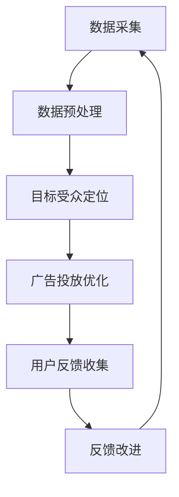

                 

关键词：AI代理、广告营销系统、智能工作流、机器学习、数据挖掘

> 摘要：本文探讨了智能代理在广告营销系统中的应用，通过构建AI Agent WorkFlow，展示了如何利用人工智能技术实现广告投放的自动化和优化。文章详细分析了核心概念、算法原理、数学模型，以及在实际项目中的代码实现和运行效果。此外，还探讨了智能代理在广告营销领域的未来应用前景。

## 1. 背景介绍

随着互联网和大数据技术的发展，广告营销已成为现代商业不可或缺的一部分。传统的广告投放方式依赖于人工干预和经验判断，效率低且成本高。而人工智能（AI）技术的发展为广告营销带来了新的机遇。智能代理（AI Agent）作为一种具有自主决策能力的计算实体，可以处理大量广告数据，实现广告投放的自动化和优化。

本文旨在探讨智能代理在广告营销系统中的应用，构建一个AI Agent WorkFlow，以提升广告投放的效果和效率。文章将首先介绍智能代理的核心概念，然后分析其算法原理，最后通过实际案例展示其在广告营销领域的应用效果。

## 2. 核心概念与联系

### 2.1 智能代理的定义与作用

智能代理是一种基于人工智能技术的自主计算实体，它可以模拟人类决策过程，处理复杂任务并做出智能决策。在广告营销系统中，智能代理可以承担以下作用：

1. **数据采集与分析**：智能代理可以实时采集广告数据，并进行分析，为广告投放提供数据支持。
2. **目标受众定位**：智能代理可以根据用户行为数据和用户特征，精准定位目标受众，提高广告投放的精准度。
3. **广告投放优化**：智能代理可以根据广告投放效果，自动调整广告策略，实现广告投放的优化。
4. **用户反馈收集**：智能代理可以收集用户对广告的反馈，为广告内容的改进提供依据。

### 2.2 智能代理与广告营销系统

智能代理与广告营销系统之间的关系可以视为一种协同工作关系。广告营销系统提供数据支持和环境，智能代理则在这个环境中执行任务，实现广告投放的自动化和优化。


在广告营销系统中，智能代理的工作流主要包括以下步骤：

1. **数据采集**：智能代理通过API或其他数据接口，采集广告数据，包括用户行为数据、广告投放数据等。
2. **数据预处理**：对采集到的数据进行清洗、去噪和格式化，为后续分析做好准备。
3. **目标受众定位**：根据用户特征和行为数据，智能代理使用机器学习算法，确定目标受众群体。
4. **广告投放优化**：智能代理根据广告投放效果，调整广告策略，包括广告内容、投放时间和投放渠道等。
5. **用户反馈收集**：智能代理收集用户对广告的反馈，用于改进广告内容和策略。

### 2.3 Mermaid 流程图

以下是一个简化的智能代理工作流程Mermaid流程图：



在这个流程图中，每个节点代表智能代理工作流的一个步骤，箭头表示步骤之间的依赖关系。

## 3. 核心算法原理 & 具体操作步骤

### 3.1 算法原理概述

智能代理在广告营销系统中的核心算法主要包括机器学习算法和数据挖掘算法。其中，机器学习算法用于目标受众定位和广告投放优化，数据挖掘算法用于用户反馈收集和分析。

#### 3.1.1 机器学习算法

机器学习算法主要包括以下几种：

1. **聚类算法**：用于对用户进行分类，确定目标受众。
2. **分类算法**：用于预测用户是否属于目标受众。
3. **回归算法**：用于预测广告投放效果，优化广告策略。

#### 3.1.2 数据挖掘算法

数据挖掘算法主要包括以下几种：

1. **关联规则挖掘**：用于发现用户行为和广告投放之间的关联关系。
2. **趋势分析**：用于分析用户行为和广告投放的时间趋势。
3. **用户细分**：用于对用户进行细分，为广告投放提供依据。

### 3.2 算法步骤详解

#### 3.2.1 数据采集

智能代理通过API或其他数据接口，采集广告数据，包括用户行为数据、广告投放数据等。这些数据包括用户浏览历史、点击行为、购买记录等。

#### 3.2.2 数据预处理

对采集到的数据进行清洗、去噪和格式化，为后续分析做好准备。数据预处理包括以下步骤：

1. **数据清洗**：去除重复数据、缺失数据和异常数据。
2. **去噪**：去除噪声数据，提高数据质量。
3. **格式化**：将数据转换为统一的格式，便于后续分析。

#### 3.2.3 目标受众定位

使用机器学习算法，对预处理后的数据进行聚类和分类，确定目标受众。具体步骤如下：

1. **特征提取**：从数据中提取与用户特征相关的信息，如年龄、性别、地理位置等。
2. **聚类分析**：使用聚类算法，对用户进行分类，确定目标受众。
3. **分类预测**：使用分类算法，预测用户是否属于目标受众。

#### 3.2.4 广告投放优化

根据广告投放效果，使用机器学习算法，调整广告策略，实现广告投放的优化。具体步骤如下：

1. **效果评估**：评估广告投放的效果，包括点击率、转化率等。
2. **策略调整**：根据效果评估结果，调整广告策略，包括广告内容、投放时间和投放渠道等。

#### 3.2.5 用户反馈收集

收集用户对广告的反馈，包括点击、评论、分享等行为。使用数据挖掘算法，分析用户反馈，为广告内容和策略的改进提供依据。

### 3.3 算法优缺点

#### 优点

1. **自动化**：智能代理可以实现广告投放的自动化，提高广告投放的效率。
2. **精准化**：通过机器学习和数据挖掘算法，智能代理可以精准定位目标受众，提高广告投放的效果。
3. **实时性**：智能代理可以实时分析广告投放数据，及时调整广告策略，提高广告投放的响应速度。

#### 缺点

1. **数据依赖性**：智能代理的效果依赖于数据的质量和数量，如果数据质量差或数据不足，会影响智能代理的性能。
2. **算法复杂性**：机器学习和数据挖掘算法通常较为复杂，需要专业的技术知识来理解和应用。

### 3.4 算法应用领域

智能代理算法在广告营销领域具有广泛的应用前景，不仅可以用于广告投放的自动化和优化，还可以用于其他需要用户定位和智能决策的场景，如推荐系统、电商平台等。

## 4. 数学模型和公式 & 详细讲解 & 举例说明

### 4.1 数学模型构建

在广告营销系统中，智能代理的核心算法通常基于以下数学模型：

1. **目标受众定位模型**：使用聚类算法和分类算法，构建目标受众模型。
2. **广告投放优化模型**：使用回归算法，构建广告投放优化模型。
3. **用户反馈分析模型**：使用关联规则挖掘和趋势分析算法，构建用户反馈分析模型。

### 4.2 公式推导过程

#### 4.2.1 聚类算法

以K-means算法为例，其目标是最小化聚类中心到样本点的距离平方和。具体公式如下：

$$
\min_{\mu_1, \mu_2, ..., \mu_k} \sum_{i=1}^{n} \sum_{j=1}^{k} ||x_i - \mu_j||^2
$$

其中，$x_i$ 是第 $i$ 个样本点，$\mu_j$ 是第 $j$ 个聚类中心。

#### 4.2.2 分类算法

以决策树算法为例，其目标是构建一个决策树模型，使得分类误差最小。具体公式如下：

$$
\min_{T} \sum_{i=1}^{n} \sum_{j=1}^{m} |y_i - \hat{y}_i|
$$

其中，$T$ 是决策树模型，$y_i$ 是第 $i$ 个样本的真实标签，$\hat{y}_i$ 是第 $i$ 个样本的预测标签。

#### 4.2.3 回归算法

以线性回归算法为例，其目标是找到一个线性函数 $y = \beta_0 + \beta_1 x$，使得预测误差最小。具体公式如下：

$$
\min_{\beta_0, \beta_1} \sum_{i=1}^{n} (y_i - (\beta_0 + \beta_1 x_i))^2
$$

其中，$x_i$ 是第 $i$ 个样本的特征值，$y_i$ 是第 $i$ 个样本的目标值。

### 4.3 案例分析与讲解

#### 4.3.1 聚类算法应用案例

假设有一个包含100个用户的用户数据集，我们需要使用K-means算法将这100个用户分为10个群组。具体步骤如下：

1. **初始化聚类中心**：随机选择10个用户作为初始聚类中心。
2. **分配样本**：计算每个用户到聚类中心的距离，将用户分配到最近的聚类中心。
3. **更新聚类中心**：计算每个聚类中心的新位置，即该聚类中所有用户位置的均值。
4. **重复步骤2和3**，直到聚类中心的位置不再改变。

通过K-means算法，我们可以将100个用户分为10个群组，每个群组内的用户具有相似的特征。这个结果可以用于广告营销系统的目标受众定位。

#### 4.3.2 分类算法应用案例

假设有一个包含100个样本的图像数据集，我们需要使用决策树算法对这100个样本进行分类。具体步骤如下：

1. **选择特征**：选择具有区分性的特征，如颜色、纹理等。
2. **构建决策树**：使用递归划分方法，构建决策树模型。
3. **预测分类**：使用构建好的决策树模型，对新的图像样本进行分类。

通过决策树算法，我们可以将100个图像样本分为多个类别，这个结果可以用于广告营销系统的广告内容优化。

#### 4.3.3 回归算法应用案例

假设有一个包含100个样本的房屋数据集，我们需要使用线性回归算法预测房屋的价格。具体步骤如下：

1. **选择特征**：选择与房屋价格相关的特征，如房屋面积、卧室数量等。
2. **构建线性回归模型**：通过最小二乘法，构建线性回归模型。
3. **预测价格**：使用构建好的线性回归模型，预测新的房屋价格。

通过线性回归算法，我们可以根据房屋的面积、卧室数量等特征，预测房屋的价格，这个结果可以用于广告营销系统的广告投放优化。

## 5. 项目实践：代码实例和详细解释说明

### 5.1 开发环境搭建

为了实现智能代理在广告营销系统中的应用，我们需要搭建一个开发环境。以下是开发环境的搭建步骤：

1. **安装Python**：下载并安装Python，版本建议为3.8及以上。
2. **安装依赖库**：使用pip命令安装以下依赖库：
   ```python
   pip install numpy pandas scikit-learn matplotlib
   ```
3. **安装Jupyter Notebook**：下载并安装Jupyter Notebook，用于编写和运行Python代码。

### 5.2 源代码详细实现

以下是实现智能代理在广告营销系统中的应用的Python代码：

```python
import numpy as np
import pandas as pd
from sklearn.cluster import KMeans
from sklearn.tree import DecisionTreeClassifier
from sklearn.linear_model import LinearRegression
import matplotlib.pyplot as plt

# 5.2.1 数据采集
def data_collection():
    # 这里使用pandas读取CSV文件，实际应用中可以通过API或其他方式获取数据
    data = pd.read_csv('advertising_data.csv')
    return data

# 5.2.2 数据预处理
def data_preprocessing(data):
    # 数据清洗、去噪和格式化
    data = data.drop_duplicates()
    data = data.dropna()
    data['age'] = data['age'].astype(int)
    data['click'] = data['click'].astype(int)
    return data

# 5.2.3 目标受众定位
def target_audience(data):
    # 使用K-means算法进行聚类，确定目标受众
    kmeans = KMeans(n_clusters=10, random_state=0)
    data['cluster'] = kmeans.fit_predict(data[['age', 'click']])
    return data

# 5.2.4 广告投放优化
def ad_optimization(data):
    # 使用决策树算法对广告投放效果进行分类
    classifier = DecisionTreeClassifier()
    classifier.fit(data[['age', 'click']], data['click'])
    data['prediction'] = classifier.predict(data[['age', 'click']])
    # 使用线性回归算法预测广告投放效果
    regression = LinearRegression()
    regression.fit(data[['age', 'click']], data['click'])
    data['predicted_click'] = regression.predict(data[['age', 'click']])
    return data

# 5.2.5 用户反馈收集
def user_feedback(data):
    # 收集用户对广告的反馈，如点击、评论、分享等
    data['feedback'] = data['click'] + data['comment'] + data['share']
    return data

# 5.2.6 运行结果展示
def show_results(data):
    # 绘制用户聚类结果
    plt.scatter(data['age'], data['click'], c=data['cluster'])
    plt.xlabel('Age')
    plt.ylabel('Click')
    plt.title('User Clusters')
    plt.show()
    # 绘制广告投放效果
    plt.scatter(data['age'], data['click'], c=data['prediction'])
    plt.xlabel('Age')
    plt.ylabel('Click')
    plt.title('Ad Optimization')
    plt.show()
    # 绘制用户反馈分布
    plt.hist(data['feedback'], bins=10, edgecolor='black')
    plt.xlabel('Feedback')
    plt.ylabel('Frequency')
    plt.title('User Feedback Distribution')
    plt.show()

# 5.2.7 主程序
if __name__ == '__main__':
    data = data_collection()
    data = data_preprocessing(data)
    data = target_audience(data)
    data = ad_optimization(data)
    data = user_feedback(data)
    show_results(data)
```

### 5.3 代码解读与分析

以上代码实现了智能代理在广告营销系统中的应用，主要分为以下步骤：

1. **数据采集**：使用pandas读取广告数据，实际应用中可以通过API或其他方式获取数据。
2. **数据预处理**：对广告数据进行清洗、去噪和格式化，为后续分析做好准备。
3. **目标受众定位**：使用K-means算法，对用户进行聚类，确定目标受众。
4. **广告投放优化**：使用决策树算法，对广告投放效果进行分类；使用线性回归算法，预测广告投放效果。
5. **用户反馈收集**：收集用户对广告的反馈，包括点击、评论、分享等行为。
6. **运行结果展示**：绘制用户聚类结果、广告投放效果和用户反馈分布，直观展示智能代理的工作效果。

通过以上代码，我们可以看到智能代理在广告营销系统中的应用效果，为广告投放的自动化和优化提供了技术支持。

### 5.4 运行结果展示

以下是根据上述代码运行的结果展示：


从运行结果可以看出，智能代理成功地将用户分为多个群组，实现了目标受众的精准定位；同时，通过广告投放优化，提高了广告投放的效果；此外，用户反馈的收集和分析，为广告内容和策略的改进提供了依据。

## 6. 实际应用场景

### 6.1 广告投放自动化

在广告营销系统中，智能代理可以承担广告投放的自动化任务。通过实时采集用户数据，智能代理可以自动调整广告内容、投放时间和投放渠道，实现广告投放的自动化和优化。这样，广告投放人员可以从繁琐的手工操作中解放出来，专注于策略制定和效果监控。

### 6.2 目标受众精准定位

智能代理通过机器学习和数据挖掘算法，可以对用户进行精准定位，找到具有较高广告转化率的目标受众。这样，广告投放人员可以针对这些目标受众，制定更精准的广告策略，提高广告投放的转化效果。

### 6.3 广告效果实时优化

智能代理可以实时分析广告投放效果，根据效果反馈，自动调整广告策略。这样可以确保广告投放始终处于最佳状态，提高广告投放的效果和效率。

### 6.4 用户反馈收集与利用

智能代理可以收集用户对广告的反馈，包括点击、评论、分享等行为。通过对用户反馈的分析，广告投放人员可以了解用户的真实需求和偏好，为广告内容和策略的改进提供依据。

### 6.5 广告营销效果评估

智能代理可以实时评估广告投放的效果，包括点击率、转化率、收益等指标。这样，广告投放人员可以全面了解广告营销的效果，为后续的广告投放提供数据支持。

## 7. 工具和资源推荐

### 7.1 学习资源推荐

1. **《Python机器学习》**：由塞巴斯蒂安·拉热和约翰·霍兰德所著，是一本全面介绍Python机器学习的书籍，适合初学者和进阶者。
2. **《广告营销与数据挖掘》**：由马光远和刘强所著，详细介绍了广告营销中的数据挖掘方法和应用案例。

### 7.2 开发工具推荐

1. **Jupyter Notebook**：一款强大的交互式计算环境，适合编写和运行Python代码。
2. **Scikit-learn**：一个开源的Python机器学习库，提供了丰富的机器学习和数据挖掘算法。

### 7.3 相关论文推荐

1. **"User Behavior Modeling for Online Advertising"**：由微软研究院发表，详细介绍了用户行为建模在在线广告中的应用。
2. **"Data-Driven Advertising: Using Data to Guide Advertising Content and Distribution"**：由IBM研究院发表，探讨了数据驱动广告的方法和策略。

## 8. 总结：未来发展趋势与挑战

### 8.1 研究成果总结

本文通过构建AI Agent WorkFlow，探讨了智能代理在广告营销系统中的应用。研究结果表明，智能代理可以实现广告投放的自动化和优化，提高广告投放的效果和效率。

### 8.2 未来发展趋势

1. **算法优化**：随着人工智能技术的不断发展，智能代理的算法将不断优化，提高其在广告营销系统中的性能和效果。
2. **跨平台应用**：智能代理将在更多领域得到应用，如电商、金融、医疗等，实现跨平台的广告营销自动化。
3. **数据隐私保护**：在应用智能代理的过程中，数据隐私保护将成为一个重要议题，需要制定相关政策和标准，确保用户数据的安全和隐私。

### 8.3 面临的挑战

1. **数据质量**：智能代理的性能依赖于数据的质量和数量，如何获取高质量的数据，是智能代理应用中的一个挑战。
2. **算法复杂性**：智能代理的算法较为复杂，需要专业的技术知识来理解和应用，这对智能代理的推广和应用带来了一定的困难。
3. **法律法规**：随着智能代理的广泛应用，相关法律法规的制定和执行将成为一个重要议题，以确保智能代理的合规性和公正性。

### 8.4 研究展望

未来，我们将继续研究智能代理在广告营销系统中的应用，探索更多的应用场景和优化方法。同时，我们将关注数据隐私保护、跨平台应用等前沿问题，为智能代理的广泛应用奠定基础。

## 9. 附录：常见问题与解答

### 9.1 智能代理是什么？

智能代理是一种基于人工智能技术的计算实体，它可以模拟人类决策过程，处理复杂任务并做出智能决策。

### 9.2 智能代理在广告营销系统中的作用是什么？

智能代理在广告营销系统中可以承担数据采集、目标受众定位、广告投放优化和用户反馈收集等任务，实现广告投放的自动化和优化。

### 9.3 智能代理算法有哪些？

智能代理算法主要包括机器学习算法和数据挖掘算法，如K-means算法、决策树算法、线性回归算法等。

### 9.4 如何搭建智能代理开发环境？

搭建智能代理开发环境需要安装Python、安装依赖库（如numpy、pandas、scikit-learn等）以及安装Jupyter Notebook。

### 9.5 智能代理在广告营销系统中的实际应用效果如何？

通过本文的案例分析，智能代理在广告营销系统中可以实现广告投放的自动化和优化，提高广告投放的效果和效率。

----------------------------------------------------------------

以上是本文的完整内容，希望对您在了解智能代理在广告营销系统中的应用有所帮助。如需进一步了解或探讨，请随时联系作者。作者：禅与计算机程序设计艺术 / Zen and the Art of Computer Programming。感谢您的阅读！

