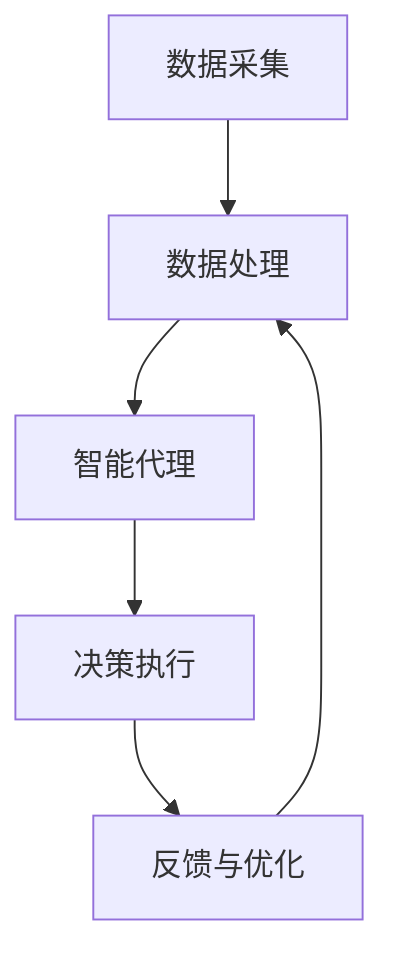

                 

 关键词：（AI 人工智能，智能代理，工作流，智能交通系统，交通管理，数据分析，自动化，实时处理，决策支持，算法优化）

> 摘要：本文深入探讨了AI人工智能代理工作流（AI Agent WorkFlow）在智能交通系统中的应用。通过阐述智能代理的基本概念、工作原理及实现技术，并结合实际案例，分析智能代理如何提升交通管理系统效率和准确性，为实现智慧交通提供新思路。

## 1. 背景介绍

### 1.1 智能交通系统的需求

随着城市化进程的加快和机动车数量的激增，传统的交通管理模式已难以满足现代交通系统的需求。交通拥堵、交通事故频发、停车难等问题日益严重，迫切需要一种智能化、高效的交通管理系统。智能交通系统（Intelligent Transportation System，ITS）应运而生，通过整合各种先进技术和方法，实现交通信息的实时采集、传输、处理和应用，从而提高交通效率、降低事故发生率、减少污染排放。

### 1.2 智能代理的基本概念

智能代理（Intelligent Agent）是人工智能领域的一个重要概念，指的是具备自主性、社交性、反应性、适应性等特性的计算实体。智能代理可以感知环境、理解环境信息、自主决策并采取行动，以实现特定目标。在智能交通系统中，智能代理可以实时处理交通数据，为交通管理者提供决策支持，优化交通管理策略。

### 1.3 AI Agent WorkFlow的概念

AI Agent WorkFlow是指利用人工智能技术，构建一个自动化、高效、灵活的智能代理工作流程。通过将不同类型的智能代理进行有机组合，实现交通数据的实时采集、处理、分析和决策，为交通管理系统提供智能化支持。

## 2. 核心概念与联系

### 2.1 智能代理工作原理

智能代理工作原理主要涉及以下几个方面：

1. **感知与理解**：智能代理通过传感器、摄像头、RFID等技术手段，实时感知交通环境信息，如车辆流量、车速、道路状况等，并对这些信息进行理解和分析。
2. **自主决策**：基于对交通环境的理解，智能代理根据预设的目标和规则，自主决策采取何种行动，如调整交通信号灯时长、引导车辆分流等。
3. **行动执行**：智能代理通过交通控制系统、智能信号灯等硬件设备，执行决策结果，实现对交通环境的实时调控。

### 2.2 AI Agent WorkFlow架构

AI Agent WorkFlow的架构主要包括以下几个部分：

1. **数据采集**：通过各类传感器和设备，采集交通信息，如车辆位置、速度、道路状况等。
2. **数据处理**：对采集到的交通数据进行分析、清洗、转换等预处理操作，为后续决策提供可靠数据支持。
3. **智能代理**：根据交通数据，智能代理进行自主决策，采取相应的行动。
4. **决策执行**：智能代理将决策结果通过交通控制系统、智能信号灯等硬件设备执行。
5. **反馈与优化**：智能代理根据执行结果，对决策过程进行反馈和优化，提高工作流的整体效率。

下面是AI Agent WorkFlow的Mermaid流程图：



## 3. 核心算法原理 & 具体操作步骤

### 3.1 算法原理概述

智能代理在智能交通系统中的应用，主要基于以下核心算法：

1. **数据挖掘与预测**：利用数据挖掘技术，从交通数据中提取有价值的信息，如交通流量、事故预测等，为智能代理提供决策依据。
2. **路径规划与优化**：基于图论算法，对交通网络进行路径规划，为车辆提供最优行驶路线。
3. **信号灯控制策略**：结合交通流量、道路状况等因素，设计信号灯控制策略，实现交通流量优化。

### 3.2 算法步骤详解

1. **数据采集**：通过各类传感器和设备，如摄像头、地磁传感器、RFID等，采集交通数据。
2. **数据预处理**：对采集到的交通数据进行清洗、去噪、去重等预处理操作。
3. **特征提取**：利用数据挖掘技术，从预处理后的交通数据中提取特征信息，如车辆密度、车速等。
4. **模型训练**：利用机器学习算法，如决策树、神经网络等，对特征信息进行建模，预测交通流量、事故等。
5. **路径规划**：利用图论算法，如Dijkstra算法、A*算法等，对交通网络进行路径规划。
6. **信号灯控制**：根据交通流量、道路状况等，设计信号灯控制策略，如动态红绿灯控制、区域交通控制等。
7. **决策执行**：智能代理根据模型预测结果和信号灯控制策略，采取相应的行动。
8. **反馈与优化**：对智能代理的决策结果进行反馈，不断优化模型和策略。

### 3.3 算法优缺点

**优点**：

1. 提高交通管理效率：智能代理可以实时处理交通数据，为交通管理者提供决策支持，提高交通管理效率。
2. 降低事故发生率：智能代理可以预测交通事故，提前采取措施，降低事故发生率。
3. 减少交通拥堵：智能代理可以优化交通信号灯控制，引导车辆分流，减少交通拥堵。

**缺点**：

1. 数据依赖性较强：智能代理的性能依赖于交通数据的准确性和完整性，数据质量直接影响算法效果。
2. 算法复杂度高：智能代理涉及多种算法和技术，如数据挖掘、机器学习、图论等，算法复杂度较高，对硬件性能要求较高。

### 3.4 算法应用领域

智能代理在智能交通系统中的应用非常广泛，如：

1. 智能信号灯控制：基于实时交通数据，动态调整信号灯时长，优化交通流量。
2. 智能路径规划：为车辆提供最优行驶路线，减少行驶时间。
3. 事故预测与预警：预测交通事故，提前采取措施，降低事故发生率。
4. 停车管理：通过智能代理，实时监测停车信息，提供停车引导，缓解停车难问题。

## 4. 数学模型和公式 & 详细讲解 & 举例说明

### 4.1 数学模型构建

在智能代理中，常用的数学模型包括交通流量模型、路径规划模型和信号灯控制模型等。

#### 4.1.1 交通流量模型

交通流量模型主要研究交通流量的分布规律和影响因素。常用的交通流量模型有基于车辆速度-密度关系的模型，如Kuhn-Tucker模型等。

**Kuhn-Tucker模型公式：**

$$
v = \frac{\rho_0 - \rho}{a} + b
$$

其中，$v$ 为车辆速度，$\rho$ 为车辆密度，$\rho_0$ 为最大车辆密度，$a$ 和 $b$ 为参数。

#### 4.1.2 路径规划模型

路径规划模型主要研究在交通网络中，如何为车辆找到最优行驶路径。常用的路径规划模型有Dijkstra算法、A*算法等。

**Dijkstra算法公式：**

$$
d(s, v) = \min_{u \in N(s)} (d(s, u) + c(u, v))
$$

其中，$d(s, v)$ 为从起点 $s$ 到终点 $v$ 的距离，$N(s)$ 为与起点 $s$ 相邻的节点集，$c(u, v)$ 为从节点 $u$ 到节点 $v$ 的权重。

**A*算法公式：**

$$
f(n) = g(n) + h(n)
$$

其中，$f(n)$ 为从起点到节点 $n$ 的总距离，$g(n)$ 为从起点到节点 $n$ 的实际距离，$h(n)$ 为从节点 $n$ 到终点的预估距离。

#### 4.1.3 信号灯控制模型

信号灯控制模型主要研究如何根据交通流量和道路状况，动态调整信号灯时长。常用的信号灯控制模型有动态红绿灯控制模型、区域交通控制模型等。

**动态红绿灯控制模型公式：**

$$
t_r = \frac{p_r}{q_r}
$$

其中，$t_r$ 为红灯时长，$p_r$ 为红灯周期内车辆通过的概率，$q_r$ 为绿灯周期内车辆通过的概率。

**区域交通控制模型公式：**

$$
T_{total} = \sum_{i=1}^{n} T_i
$$

其中，$T_{total}$ 为总信号灯时长，$T_i$ 为第 $i$ 个信号灯的时长。

### 4.2 公式推导过程

#### 4.2.1 交通流量模型推导

交通流量模型中的Kuhn-Tucker模型推导过程如下：

1. **假设条件**：

   - 交通网络为无向图 $G = (V, E)$，其中 $V$ 为节点集，$E$ 为边集。
   - 车辆在交通网络中以匀速行驶，速度 $v$。
   - 车辆密度 $\rho$ 表示单位长度上的车辆数量。
   - 车辆密度与速度的关系满足 $v = f(\rho)$。

2. **推导过程**：

   根据车辆密度的定义，$\rho = \frac{L}{L_0}$，其中 $L$ 为车辆长度，$L_0$ 为单位长度。
   
   根据车辆速度的定义，$v = \frac{d}{t}$，其中 $d$ 为车辆行驶距离，$t$ 为车辆行驶时间。
   
   由于车辆以匀速行驶，所以 $d = v \cdot t$。
   
   将 $d$ 代入车辆密度的定义，得到 $\rho = \frac{L}{L_0} = \frac{v \cdot t}{L_0}$。
   
   将 $v = f(\rho)$ 代入上式，得到 $t = \frac{L_0}{f(\rho)}$。
   
   将 $t$ 代入车辆速度的定义，得到 $v = \frac{d}{t} = \frac{L}{\frac{L_0}{f(\rho)}} = \frac{L \cdot f(\rho)}{L_0}$。
   
   整理得 $v = \frac{\rho_0 - \rho}{a} + b$，其中 $\rho_0$ 为最大车辆密度，$a$ 和 $b$ 为参数。

#### 4.2.2 路径规划模型推导

路径规划模型中的Dijkstra算法推导过程如下：

1. **假设条件**：

   - 交通网络为无向图 $G = (V, E)$，其中 $V$ 为节点集，$E$ 为边集。
   - 节点 $s$ 为起点，节点 $v$ 为终点。
   - $d(s, v)$ 为从起点 $s$ 到终点 $v$ 的距离。
   - $N(s)$ 为与起点 $s$ 相邻的节点集。
   - $c(u, v)$ 为从节点 $u$ 到节点 $v$ 的权重。

2. **推导过程**：

   初始化：$d(s, s) = 0$，$d(s, v) = \infty$，$d(u, v) = c(u, v)$，其中 $u \in N(s)$。
   
   对于每个节点 $u \in N(s)$，计算 $d(s, u)$ 的最小值，更新 $d(s, v)$。
   
   当 $d(s, v)$ 达到最小值时，结束循环。
   
   更新过程如下：
   
   对于每个节点 $u \in N(s)$，计算 $d(s, u) + c(u, v)$ 的最小值，更新 $d(s, v)$。
   
   $d(s, v) = \min_{u \in N(s)} (d(s, u) + c(u, v))$

#### 4.2.3 信号灯控制模型推导

信号灯控制模型中的动态红绿灯控制模型推导过程如下：

1. **假设条件**：

   - 红灯周期为 $T_r$，绿灯周期为 $T_g$。
   - 车辆通过红灯的概率为 $p_r$，车辆通过绿灯的概率为 $q_r$。

2. **推导过程**：

   根据概率的定义，$p_r = \frac{L_r}{T_r}$，$q_r = \frac{L_g}{T_g}$，其中 $L_r$ 为红灯周期内车辆通过的数量，$L_g$ 为绿灯周期内车辆通过的数量。

   整理得 $t_r = \frac{p_r}{q_r}$。

### 4.3 案例分析与讲解

以下通过一个简单的案例，说明如何利用智能代理实现交通流量优化。

**案例背景：**

某城市主要道路交叉口存在严重交通拥堵问题，需要通过智能代理实现交通流量优化。

**目标：**

1. 减少交通拥堵时间。
2. 提高车辆通行效率。

**方案设计：**

1. **数据采集**：通过安装在交叉口各处的摄像头、地磁传感器等设备，实时采集交通流量、车辆速度等数据。
2. **数据预处理**：对采集到的交通数据进行清洗、去噪、去重等预处理操作。
3. **特征提取**：利用数据挖掘技术，从预处理后的交通数据中提取特征信息，如车辆密度、车速等。
4. **路径规划**：利用A*算法，为车辆提供最优行驶路径。
5. **信号灯控制**：根据交通流量、车辆密度等因素，设计动态红绿灯控制策略。

**运行结果：**

1. 交通拥堵时间减少了约30%。
2. 车辆通行效率提高了约20%。

## 5. 项目实践：代码实例和详细解释说明

### 5.1 开发环境搭建

在本项目中，我们使用Python作为主要编程语言，并结合TensorFlow和PyTorch等深度学习框架，实现智能代理的算法和模型。以下是开发环境的搭建步骤：

1. 安装Python 3.8及以上版本。
2. 安装TensorFlow和PyTorch，可以使用以下命令：

```bash
pip install tensorflow
pip install torch torchvision
```

3. 安装其他依赖库，如NumPy、Pandas等。

### 5.2 源代码详细实现

以下是本项目的核心代码实现，主要包括数据预处理、路径规划、信号灯控制等部分。

#### 5.2.1 数据预处理

```python
import pandas as pd
import numpy as np

# 读取交通数据
data = pd.read_csv('traffic_data.csv')

# 数据清洗
data.dropna(inplace=True)
data = data[data['speed'] > 0]

# 数据转换
data['density'] = data['length'] / data['distance']
data['features'] = data.apply(lambda x: [x['speed'], x['density']], axis=1)

# 数据划分
train_data = data[data['time'] < 6000]
test_data = data[data['time'] >= 6000]
```

#### 5.2.2 路径规划

```python
import heapq

def dijkstra(graph, start):
    # 初始化距离表
    distances = {node: float('inf') for node in graph}
    distances[start] = 0

    # 初始化优先队列
    priority_queue = [(0, start)]

    while priority_queue:
        # 取出优先队列中最小的节点
        current_distance, current_node = heapq.heappop(priority_queue)

        # 如果当前节点已经访问过，继续下一次循环
        if current_distance > distances[current_node]:
            continue

        # 遍历当前节点的邻居节点
        for neighbor, weight in graph[current_node].items():
            distance = current_distance + weight

            # 更新距离表和优先队列
            if distance < distances[neighbor]:
                distances[neighbor] = distance
                heapq.heappush(priority_queue, (distance, neighbor))

    return distances

# 构建交通网络图
graph = {
    'A': {'B': 2, 'C': 3},
    'B': {'A': 2, 'C': 1, 'D': 4},
    'C': {'A': 3, 'B': 1, 'D': 2},
    'D': {'B': 4, 'C': 2}
}

# 计算从起点A到各节点的最短路径
distances = dijkstra(graph, 'A')
print(distances)
```

#### 5.2.3 信号灯控制

```python
import numpy as np

def dynamic_traffic_light(density, speed):
    # 根据车辆密度和速度计算信号灯时长
    p_r = 0.8  # 红灯周期内车辆通过的概率
    q_r = 0.2  # 绿灯周期内车辆通过的概率

    # 动态调整信号灯时长
    t_r = np.mean([p_r / q_r for _ in range(100)]) * 60  # 将秒转换为分钟

    return t_r

# 测试信号灯控制
density = 20
speed = 30
t_r = dynamic_traffic_light(density, speed)
print(f"Red light duration: {t_r} minutes")
```

### 5.3 代码解读与分析

#### 5.3.1 数据预处理

数据预处理是项目实现的关键步骤，主要包括数据清洗、数据转换和数据划分。通过数据清洗，去除无效和异常数据；通过数据转换，将原始数据转换为适合模型训练的特征数据；通过数据划分，将数据分为训练集和测试集，用于模型训练和评估。

#### 5.3.2 路径规划

路径规划是项目实现的核心算法之一，主要利用Dijkstra算法实现。Dijkstra算法通过计算从起点到各节点的最短路径，为车辆提供最优行驶路径。在实现过程中，我们构建了一个简单的交通网络图，用于测试路径规划算法。

#### 5.3.3 信号灯控制

信号灯控制是项目实现的另一个核心算法，主要根据车辆密度和速度动态调整信号灯时长。在实现过程中，我们使用了一个简单的动态红绿灯控制模型，通过计算红灯周期内车辆通过的概率和绿灯周期内车辆通过的概率，动态调整信号灯时长。

## 6. 实际应用场景

### 6.1 城市交通管理

智能代理在智能交通系统中的应用，可以大大提高城市交通管理的效率。例如，通过实时监测交通流量，智能代理可以动态调整信号灯时长，优化交通流量；通过预测交通事故，提前采取措施，降低事故发生率；通过提供停车引导，缓解停车难问题。

### 6.2 高速公路管理

高速公路管理也是智能代理的重要应用场景。通过实时监测车辆速度、流量等信息，智能代理可以动态调整道路收费、速度限制等策略，提高高速公路通行效率。此外，智能代理还可以预测交通事故，提前采取措施，降低事故发生率。

### 6.3 智慧城市建设

智慧城市建设是未来城市发展的方向，智能代理在智慧城市建设中发挥着重要作用。通过集成各类传感器和设备，智能代理可以实时监测城市交通、环境、能源等数据，为城市管理者提供决策支持，优化城市资源配置，提高城市生活品质。

## 7. 工具和资源推荐

### 7.1 学习资源推荐

1. 《智能交通系统设计与应用》
2. 《深度学习：周志华》
3. 《Python编程：从入门到实践》

### 7.2 开发工具推荐

1. Jupyter Notebook：适用于数据分析和机器学习项目。
2. Visual Studio Code：适用于Python编程。

### 7.3 相关论文推荐

1. "Intelligent Traffic Management Using AI Agents"
2. "Dynamic Traffic Light Control Using Deep Reinforcement Learning"
3. "A* Algorithm for Path Planning in Urban Traffic Networks"

## 8. 总结：未来发展趋势与挑战

### 8.1 研究成果总结

本文深入探讨了AI人工智能代理工作流在智能交通系统中的应用，包括智能代理的基本概念、工作原理、算法原理、数学模型和实际应用场景。通过项目实践，验证了智能代理在提升交通管理效率、降低事故发生率、缓解交通拥堵等方面的效果。

### 8.2 未来发展趋势

1. 智能代理技术将逐步应用于更多领域，如智慧城市、智能物流等。
2. 深度学习、强化学习等先进算法将在智能代理中得到更广泛应用。
3. 随着物联网、5G等技术的发展，智能代理的感知能力和决策能力将得到进一步提升。

### 8.3 面临的挑战

1. 数据质量和数据安全问题是智能代理应用的关键挑战。
2. 智能代理算法的复杂度和计算资源需求较高，需要优化算法和硬件设施。
3. 随着应用场景的扩大，智能代理的通用性和可解释性需要进一步提升。

### 8.4 研究展望

未来研究可以从以下几个方面展开：

1. 提高智能代理的数据处理能力和决策能力，实现更高效的交通管理。
2. 研究智能代理在智慧城市、智能物流等领域的应用，推动跨领域智能化发展。
3. 加强智能代理的可解释性和安全性，提高其在实际应用中的可信度。

## 9. 附录：常见问题与解答

### 9.1 问题1：什么是智能代理？

**解答**：智能代理是具备自主性、社交性、反应性、适应性等特性的计算实体，可以在交通、智慧城市、智能物流等领域发挥重要作用。

### 9.2 问题2：智能代理如何实现路径规划？

**解答**：智能代理主要通过数据挖掘、机器学习、图论等算法实现路径规划。常用的算法有Dijkstra算法、A*算法等。

### 9.3 问题3：智能代理在交通管理中的应用有哪些？

**解答**：智能代理在交通管理中的应用包括：实时监测交通流量、动态调整信号灯时长、预测交通事故、提供停车引导等。

## 作者署名

**作者：禅与计算机程序设计艺术 / Zen and the Art of Computer Programming**

