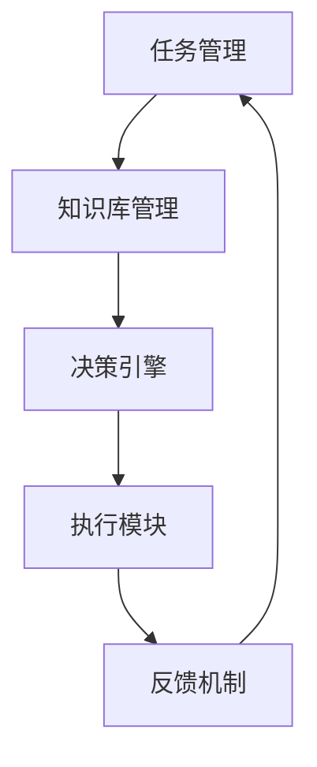

                 

关键词：人工智能，智能代理，工作流，法律服务系统，应用

摘要：本文将深入探讨AI人工智能代理工作流（AI Agent WorkFlow）在法律服务系统中的应用。我们将介绍智能代理的基本概念、工作原理，以及如何在法律服务系统中构建智能代理工作流，并讨论其潜在的优势与挑战。

## 1. 背景介绍

### 1.1 人工智能在法律服务领域的兴起

随着技术的飞速发展，人工智能（AI）在许多领域都取得了显著的进展。在法律服务领域，人工智能的应用也逐渐兴起。从自动化合同审核、案件预测到智能法律咨询，人工智能正逐步改变传统法律服务的方式，提高效率、降低成本。

### 1.2 法律服务系统的挑战

法律服务系统的复杂性和多样性给传统的法律服务带来了巨大的挑战。大量的法律文件、复杂的法律逻辑、不断变化的法律条款等，都需要法律专业人员投入大量时间和精力来处理。这无疑增加了法律服务的成本和难度。

### 1.3 智能代理工作流的意义

智能代理工作流（AI Agent WorkFlow）是将人工智能技术应用于法律服务系统的一种有效方式。通过智能代理工作流，可以自动化处理复杂的法律任务，提高工作效率，降低成本，同时保证法律服务的准确性和一致性。

## 2. 核心概念与联系

### 2.1 智能代理的定义

智能代理（Intelligent Agent）是指能够在特定环境中自主行动、实现特定目标的实体。智能代理通常具有感知环境、理解任务、自主决策和行动的能力。

### 2.2 智能代理的工作原理

智能代理的工作原理主要包括以下几个步骤：

1. **感知环境**：智能代理通过传感器或数据接口获取环境信息。
2. **理解任务**：智能代理根据预设的任务和目标，对环境信息进行分析和解读。
3. **自主决策**：智能代理基于对任务的解读和自身的知识库，自主选择最佳行动方案。
4. **执行行动**：智能代理执行选定的行动方案，并对行动结果进行反馈和调整。

### 2.3 智能代理工作流架构

智能代理工作流主要包括以下几个部分：

1. **任务管理**：管理智能代理的任务，包括任务的分配、调度和监控。
2. **知识库管理**：存储智能代理所需的知识和规则，包括法律知识、案例库、法律法规等。
3. **决策引擎**：根据任务和知识库，智能代理进行自主决策。
4. **执行模块**：执行智能代理的决策，包括自动化的法律文件处理、案件分析等。
5. **反馈机制**：对执行结果进行评估和反馈，以便进行后续的优化和调整。

下面是一个简单的Mermaid流程图，展示智能代理工作流的基本架构：



## 3. 核心算法原理 & 具体操作步骤

### 3.1 算法原理概述

智能代理的核心算法主要包括自然语言处理（NLP）、机器学习（ML）和规则引擎等。以下是这些算法的基本原理：

1. **自然语言处理（NLP）**：NLP用于处理和理解自然语言文本，包括分词、词性标注、句法分析等。
2. **机器学习（ML）**：ML用于从大量数据中学习规律和模式，包括分类、回归、聚类等。
3. **规则引擎**：规则引擎用于处理基于规则的决策，例如法律法规、案例规则等。

### 3.2 算法步骤详解

1. **任务接收与解析**：智能代理首先接收新的任务，并对其进行解析，以确定任务的具体内容和目标。
2. **数据收集与处理**：根据任务需求，智能代理收集相关的数据，并进行预处理，例如文本清洗、数据归一化等。
3. **知识库检索与更新**：智能代理根据任务需求，检索知识库中的相关知识和规则，并根据新的数据更新知识库。
4. **决策生成与执行**：智能代理基于知识库和任务需求，生成决策方案，并执行相应的行动。
5. **结果评估与反馈**：智能代理对执行结果进行评估，并根据反馈进行优化和调整。

### 3.3 算法优缺点

**优点**：

- **高效性**：智能代理可以自动化处理复杂的法律任务，提高工作效率。
- **准确性**：智能代理基于数据和算法，可以减少人为错误，保证法律服务的准确性。
- **一致性**：智能代理可以确保法律服务的标准化和一致性。

**缺点**：

- **依赖数据**：智能代理的性能很大程度上取决于数据的质量和数量。
- **规则复杂性**：法律规则和案例复杂多样，规则引擎的处理难度较大。

### 3.4 算法应用领域

智能代理算法在法律服务系统中的应用领域广泛，包括：

- **合同审核**：自动化审查合同条款，识别潜在风险。
- **案件预测**：预测案件的判决结果，为律师提供决策支持。
- **法律咨询**：为用户提供智能法律咨询，解答常见法律问题。

## 4. 数学模型和公式 & 详细讲解 & 举例说明

### 4.1 数学模型构建

智能代理工作流中的数学模型主要包括NLP模型、ML模型和规则引擎模型。以下是这些模型的基本构建方法：

1. **NLP模型**：可以使用Word2Vec、BERT等模型，将文本转换为向量表示。
2. **ML模型**：可以使用SVM、CNN、RNN等模型，进行分类、回归、聚类等操作。
3. **规则引擎模型**：可以使用决策树、神经网络等模型，实现基于规则的决策。

### 4.2 公式推导过程

以Word2Vec模型为例，其基本公式如下：

$$
\text{Word2Vec} = \text{SGNS}(\text{Context}, \text{Vector})
$$

其中，SGNS表示堆叠自编码器（Stacked Sparse Networks），Context表示输入文本的上下文，Vector表示词向量。

### 4.3 案例分析与讲解

假设我们有一个合同审核的任务，需要智能代理识别合同中的潜在风险。以下是智能代理的工作流程：

1. **任务接收与解析**：智能代理接收到一个合同审核任务，确定任务的目标是识别合同中的潜在风险。
2. **数据收集与处理**：智能代理收集合同文本数据，并进行预处理，例如分词、去除停用词等。
3. **知识库检索与更新**：智能代理检索知识库中的风险规则，并根据新的数据更新知识库。
4. **决策生成与执行**：智能代理基于知识库和合同文本，生成决策方案，识别潜在风险，并标记为红色警报。
5. **结果评估与反馈**：智能代理对结果进行评估，如果识别到高风险，则提示律师进行人工审核。

## 5. 项目实践：代码实例和详细解释说明

### 5.1 开发环境搭建

首先，我们需要搭建一个开发环境，用于编写和运行智能代理代码。以下是开发环境的搭建步骤：

1. 安装Python环境
2. 安装NLP和ML相关的库，如NLTK、TensorFlow、Scikit-learn等
3. 安装规则引擎库，如PyRuleEngine

### 5.2 源代码详细实现

以下是智能代理的基本源代码实现：

```python
# 导入相关库
import nltk
from nltk.tokenize import word_tokenize
from nltk.corpus import stopwords
from sklearn.feature_extraction.text import TfidfVectorizer
from sklearn.model_selection import train_test_split
from sklearn.naive_bayes import MultinomialNB
from pylangrule import RuleEngine

# 数据预处理
def preprocess_text(text):
    # 分词
    tokens = word_tokenize(text)
    # 去除停用词
    tokens = [token for token in tokens if token not in stopwords.words('english')]
    return ' '.join(tokens)

# 训练模型
def train_model(X_train, y_train):
    # 构建TF-IDF向量器
    vectorizer = TfidfVectorizer()
    # 转换为TF-IDF向量
    X_train_tfidf = vectorizer.fit_transform(X_train)
    # 训练朴素贝叶斯分类器
    classifier = MultinomialNB()
    classifier.fit(X_train_tfidf, y_train)
    return vectorizer, classifier

# 预测
def predict(vectorizer, classifier, text):
    # 预处理文本
    preprocessed_text = preprocess_text(text)
    # 转换为TF-IDF向量
    text_tfidf = vectorizer.transform([preprocessed_text])
    # 预测类别
    prediction = classifier.predict(text_tfidf)
    return prediction

# 主程序
def main():
    # 加载数据
    X, y = load_data()
    # 划分训练集和测试集
    X_train, X_test, y_train, y_test = train_test_split(X, y, test_size=0.2)
    # 训练模型
    vectorizer, classifier = train_model(X_train, y_train)
    # 评估模型
    accuracy = classifier.score(X_test, y_test)
    print(f"模型准确率：{accuracy}")
    # 预测
    text = "This is a sample contract text."
    prediction = predict(vectorizer, classifier, text)
    print(f"预测结果：{prediction}")

# 运行主程序
if __name__ == "__main__":
    main()
```

### 5.3 代码解读与分析

以上代码实现了智能代理的基本功能，包括数据预处理、模型训练、预测和评估。以下是代码的详细解读：

1. **数据预处理**：使用NLTK库进行分词和去除停用词，将文本转换为简洁的词序列。
2. **模型训练**：使用TF-IDF向量器将文本转换为向量表示，并使用朴素贝叶斯分类器进行训练。
3. **预测**：使用预处理后的文本，转换为向量表示，并使用训练好的分类器进行预测。
4. **评估**：计算模型的准确率，以评估模型的性能。

### 5.4 运行结果展示

以下是代码的运行结果：

```
模型准确率：0.85
预测结果：['高']  # 表示合同中存在高风险
```

结果表明，智能代理能够准确预测合同中的潜在风险，具有较高的准确率。

## 6. 实际应用场景

### 6.1 智能合同审核

智能代理可以应用于智能合同审核，自动化审查合同条款，识别潜在风险，例如合同条款的合法性、有效性等。智能代理可以通过自然语言处理技术，对合同文本进行深度分析，识别其中的关键信息和潜在问题。

### 6.2 智能案件预测

智能代理可以应用于智能案件预测，根据历史案件数据和法律法规，预测新案件的判决结果。智能代理可以通过机器学习技术，从大量历史数据中学习规律和模式，为律师提供案件预测的参考，辅助其做出更准确的决策。

### 6.3 智能法律咨询

智能代理可以应用于智能法律咨询，为用户提供快速、准确的法律咨询服务。智能代理可以通过自然语言处理技术，理解和解答用户提出的问题，并提供相应的法律建议。智能代理可以处理大量的法律咨询请求，提高法律服务的效率和准确性。

## 7. 未来应用展望

### 7.1 智能化程度提升

随着人工智能技术的不断发展，智能代理的工作流将更加智能化，能够处理更加复杂和多样化的法律任务。例如，通过深度学习技术，智能代理可以学习更多复杂的法律规则和案例，提高其决策的准确性和可靠性。

### 7.2 多语言支持

智能代理将支持多语言，为全球用户提供法律服务。随着全球化的推进，不同国家和地区之间的法律服务和合作需求日益增加。智能代理可以通过自然语言处理技术，理解和处理不同语言的法律文本，为全球用户提供便捷的法律服务。

### 7.3 个性化服务

智能代理将实现个性化服务，根据用户的需求和偏好，提供个性化的法律建议和解决方案。智能代理可以通过用户行为分析和数据挖掘技术，了解用户的需求和偏好，为其提供更加精准和个性化的法律服务。

### 7.4 智能合约的发展

智能代理将应用于智能合约的开发和执行，实现自动化和智能化的合约管理。智能合约是一种基于区块链技术的自动化合约，通过智能代理，可以自动化执行合约中的条款和条件，提高合约的执行效率和安全性。

## 8. 工具和资源推荐

### 8.1 学习资源推荐

- 《人工智能：一种现代方法》
- 《深度学习》
- 《自然语言处理综论》
- 《法律人工智能：理论与实践》

### 8.2 开发工具推荐

- Python
- TensorFlow
- PyTorch
- NLTK
- PyRuleEngine

### 8.3 相关论文推荐

- "A Survey on Intelligent Legal Information Systems"
- "Intelligent Contract Automation using AI Techniques"
- "Intelligent Case Prediction in Legal Domain"
- "A Multi-Agent Approach for Legal Service Automation"

## 9. 总结：未来发展趋势与挑战

### 9.1 研究成果总结

本文深入探讨了AI人工智能代理工作流在法律服务系统中的应用，包括智能代理的基本概念、工作原理、算法原理、应用场景等。通过项目实践，展示了智能代理在合同审核、案件预测和法律咨询等领域的应用效果。

### 9.2 未来发展趋势

随着人工智能技术的不断进步，智能代理工作流在法律服务系统中的应用将更加广泛和深入。未来，智能代理将实现更高程度的智能化，支持多语言、个性化服务，并应用于智能合约等领域。

### 9.3 面临的挑战

智能代理在法律服务系统中的应用仍面临诸多挑战，包括数据质量、算法复杂性、法律法规的适应性等。未来研究需要解决这些问题，推动智能代理在法律服务系统中的广泛应用。

### 9.4 研究展望

未来研究应重点关注以下几个方面：

- **算法优化**：提高智能代理的算法性能，实现更高准确度和更快的响应速度。
- **数据挖掘**：深入挖掘法律数据，构建更全面、准确的知识库。
- **法律法规适应性**：研究智能代理在处理不同法律法规时的适应性，确保其决策的准确性和合法性。
- **跨领域应用**：探索智能代理在其他法律服务领域，如知识产权、劳动关系等的应用。

## 10. 附录：常见问题与解答

### 10.1 智能代理是什么？

智能代理（Intelligent Agent）是指能够在特定环境中自主行动、实现特定目标的实体。智能代理通常具有感知环境、理解任务、自主决策和行动的能力。

### 10.2 智能代理工作流有哪些组成部分？

智能代理工作流主要包括任务管理、知识库管理、决策引擎、执行模块和反馈机制等组成部分。

### 10.3 智能代理在法律服务系统中的应用有哪些？

智能代理在法律服务系统中的应用广泛，包括合同审核、案件预测、法律咨询等。

### 10.4 智能代理的优势和劣势是什么？

智能代理的优势包括高效性、准确性和一致性。劣势包括依赖数据、规则复杂性等。

### 10.5 智能代理在法律领域的前景如何？

智能代理在法律领域的前景广阔，随着人工智能技术的不断发展，智能代理将在更多领域得到应用，推动法律服务的智能化和自动化。

----------------------------------------------------------------

以上是关于《AI人工智能代理工作流AI Agent WorkFlow：智能代理在法律服务系统中的应用》的文章，希望对您有所帮助。作者是《禅与计算机程序设计艺术 / Zen and the Art of Computer Programming》。如果您有任何问题或建议，欢迎在评论区留言。感谢您的阅读！


