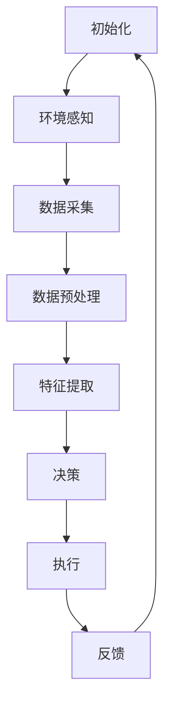

                 

关键词：人工智能代理、环境感知、数据采集、工作流、机器学习、深度学习、自然语言处理、算法原理、数学模型、代码实例、实际应用、工具推荐、未来展望。

> 摘要：本文深入探讨了AI人工智能代理工作流（AI Agent WorkFlow）的核心概念、环境感知与数据采集机制。文章首先介绍了AI代理的背景与重要性，随后详细阐述了环境感知与数据采集的原理、算法和具体实施步骤。通过数学模型、公式推导及代码实例，展示了AI代理在实际项目中的应用。最后，对未来的发展趋势、挑战及研究展望进行了全面分析。

## 1. 背景介绍

人工智能代理（AI Agent）是人工智能领域的一个研究热点，它能够自主地执行任务、与环境互动并做出决策。随着人工智能技术的迅猛发展，AI代理在智能家居、自动驾驶、智能制造等领域得到了广泛应用。AI代理的核心功能是环境感知与数据采集，这两者相互作用，为AI代理提供了丰富的信息和决策支持。

环境感知是指AI代理通过感知设备（如摄像头、传感器等）获取环境信息的过程。这些信息包括视觉、听觉、温度、湿度等，是AI代理进行决策的重要依据。数据采集则是指AI代理从环境中获取的数据进行处理、存储和利用的过程。有效的数据采集机制能够提高AI代理的准确性和效率。

本文将围绕AI代理的环境感知与数据采集机制，介绍相关算法原理、数学模型、代码实例及实际应用场景，旨在为从事人工智能相关领域的研究者和开发者提供有价值的参考。

## 2. 核心概念与联系

为了更好地理解AI人工智能代理工作流，首先需要介绍其中的核心概念及其相互联系。

### 2.1 AI代理

AI代理是一种具有自主决策能力的智能实体，能够与环境进行交互并完成任务。AI代理的基本特征包括感知能力、决策能力、执行能力和学习能力。感知能力是指AI代理通过感知设备获取环境信息；决策能力是指AI代理根据环境信息和目标，选择合适的行动方案；执行能力是指AI代理执行所选行动方案；学习能力是指AI代理通过不断学习和优化，提高自身性能。

### 2.2 环境感知

环境感知是AI代理的核心功能之一，它依赖于感知设备（如图像传感器、声音传感器、温度传感器等）获取环境信息。环境感知的过程可以分为以下几个阶段：

1. **数据采集**：AI代理通过感知设备获取环境数据，如图像、声音、温度等。
2. **数据预处理**：对采集到的数据进行预处理，如滤波、去噪、归一化等，以提高数据质量。
3. **特征提取**：从预处理后的数据中提取有用特征，如边缘、纹理、频率等。
4. **特征融合**：将来自不同传感器的特征进行融合，以获得更全面的环境信息。

### 2.3 数据采集

数据采集是AI代理的另一个核心功能，它包括以下几个阶段：

1. **数据收集**：从各种数据源（如传感器、数据库、网络等）收集数据。
2. **数据清洗**：去除噪声、填补缺失值、消除异常值等，以提高数据质量。
3. **数据存储**：将清洗后的数据存储到数据库或数据湖中，以便后续处理和使用。
4. **数据利用**：通过机器学习、深度学习等技术，对数据进行分析和挖掘，提取有用信息。

### 2.4 工作流

AI代理工作流是指AI代理从初始化到完成任务的一系列操作过程。一个典型的AI代理工作流包括以下步骤：

1. **初始化**：AI代理启动并加载相关模型和算法。
2. **环境感知**：AI代理通过感知设备获取环境信息。
3. **数据采集**：AI代理从环境中收集数据，并进行预处理和特征提取。
4. **决策**：AI代理根据环境信息和目标，选择合适的行动方案。
5. **执行**：AI代理执行所选行动方案。
6. **反馈**：AI代理接收环境反馈，并根据反馈调整自身行为。

### 2.5 Mermaid 流程图

为了更直观地展示AI代理工作流，我们使用Mermaid绘制了一个简单的流程图：



### 2.6 核心概念与联系总结

通过上述介绍，我们可以看到，AI代理、环境感知、数据采集和工作流是紧密联系的。环境感知和数据采集为AI代理提供了丰富的信息来源，而工作流则将AI代理的各项功能有机地结合起来，实现自主决策和任务执行。环境感知和数据采集相互促进，为AI代理提供了持续改进的动力。

## 3. 核心算法原理 & 具体操作步骤

### 3.1 算法原理概述

在AI代理工作流中，核心算法原理主要涉及环境感知和数据采集。以下是这些算法的基本原理：

### 3.1.1 环境感知算法

环境感知算法主要包括图像处理、语音识别、传感器数据处理等。其中，图像处理算法用于对图像进行预处理、特征提取和目标检测；语音识别算法用于将语音信号转换为文字；传感器数据处理算法用于处理各种传感器数据，如温度、湿度、光照等。

### 3.1.2 数据采集算法

数据采集算法主要包括数据收集、数据清洗、数据存储和数据利用。数据收集算法用于从各种数据源获取数据；数据清洗算法用于去除噪声、填补缺失值、消除异常值；数据存储算法用于将清洗后的数据存储到数据库或数据湖中；数据利用算法用于对数据进行分析和挖掘，提取有用信息。

### 3.2 算法步骤详解

下面我们将详细阐述环境感知算法和数据采集算法的具体操作步骤。

### 3.2.1 环境感知算法步骤

1. **数据采集**：通过图像传感器、声音传感器等感知设备获取环境数据。
2. **数据预处理**：对采集到的数据进行预处理，如滤波、去噪、归一化等。
3. **特征提取**：从预处理后的数据中提取有用特征，如边缘、纹理、频率等。
4. **特征融合**：将来自不同传感器的特征进行融合，以获得更全面的环境信息。
5. **目标检测**：使用目标检测算法（如YOLO、SSD、Faster R-CNN等）对环境中的目标进行检测。
6. **环境理解**：根据目标检测结果和环境特征，对环境进行理解，为后续决策提供支持。

### 3.2.2 数据采集算法步骤

1. **数据收集**：从各种数据源（如传感器、数据库、网络等）收集数据。
2. **数据清洗**：去除噪声、填补缺失值、消除异常值等，以提高数据质量。
3. **数据存储**：将清洗后的数据存储到数据库或数据湖中，以便后续处理和使用。
4. **数据利用**：通过机器学习、深度学习等技术，对数据进行分析和挖掘，提取有用信息。

### 3.3 算法优缺点

以下是环境感知算法和数据采集算法的优缺点：

### 3.3.1 环境感知算法优缺点

**优点**：
- 能够实时获取环境信息，为AI代理提供决策依据。
- 支持多种感知设备，适用于不同应用场景。

**缺点**：
- 数据处理复杂，对算法性能和计算资源要求较高。
- 受到传感器精度和噪声影响，感知结果可能存在误差。

### 3.3.2 数据采集算法优缺点

**优点**：
- 数据来源广泛，能够获取丰富的信息。
- 数据清洗和存储技术成熟，有利于后续数据处理和分析。

**缺点**：
- 数据收集过程可能涉及隐私和安全问题。
- 数据利用过程对算法和计算资源要求较高。

### 3.4 算法应用领域

环境感知算法和数据采集算法在多个领域具有广泛应用：

- **智能家居**：通过环境感知算法，AI代理可以实时监测家庭环境，为用户提供智能化的家居服务。
- **自动驾驶**：通过环境感知算法，AI代理可以实时监测道路状况，为自动驾驶车辆提供决策支持。
- **智能制造**：通过环境感知算法，AI代理可以实时监测生产线状态，提高生产效率和质量。

## 4. 数学模型和公式 & 详细讲解 & 举例说明

### 4.1 数学模型构建

在AI代理工作流中，数学模型构建是关键环节。下面我们介绍两个常见的数学模型：卷积神经网络（CNN）和循环神经网络（RNN）。

### 4.1.1 卷积神经网络（CNN）

卷积神经网络是一种广泛应用于图像处理和计算机视觉的深度学习模型。它的基本结构包括卷积层、池化层和全连接层。

**卷积层**：卷积层通过卷积运算提取图像特征。卷积核是一个小的矩阵，它在图像上滑动，与图像局部区域进行点积运算，得到一个特征图。

**池化层**：池化层用于减少特征图的尺寸，降低计算复杂度。常见的池化方式有最大值池化、平均值池化等。

**全连接层**：全连接层将卷积层和池化层提取的特征进行融合，形成一个高维特征向量，用于分类或回归任务。

### 4.1.2 循环神经网络（RNN）

循环神经网络是一种适用于序列数据的深度学习模型，能够处理变量长度的序列。RNN的基本结构包括输入层、隐藏层和输出层。

**输入层**：输入层接收序列数据，如单词、音频帧等。

**隐藏层**：隐藏层通过循环连接实现信息传递，能够捕捉序列中的长期依赖关系。

**输出层**：输出层根据隐藏层的输出生成预测结果，如单词、语音等。

### 4.2 公式推导过程

下面我们分别对CNN和RNN的公式进行推导。

#### 4.2.1 CNN公式推导

假设输入图像为X，卷积核为K，步长为s，零填充为p，输出特征图为F，则有：

$$  
F(i, j) = \sum_{x=0}^{W-k+2p} \sum_{y=0}^{H-k+2p} X(x, y) \cdot K(i-x, j-y) \quad (i=0, 1, \ldots, F_{width}) \quad (j=0, 1, \ldots, F_{height})  
$$

其中，$F_{width} = \lceil \frac{W-k+2p}{s} \rceil$，$F_{height} = \lceil \frac{H-k+2p}{s} \rceil$。

#### 4.2.2 RNN公式推导

假设输入序列为X，隐藏层状态为h，输出为y，则有：

$$  
h_t = \sigma(W_h \cdot [h_{t-1}, x_t] + b_h) \quad (t=1, 2, \ldots, T)  
$$

$$  
y_t = W_y \cdot h_t + b_y \quad (t=1, 2, \ldots, T)  
$$

其中，$\sigma$为激活函数，$W_h, W_y, b_h, b_y$为模型参数。

### 4.3 案例分析与讲解

下面我们通过一个简单的例子来分析CNN和RNN在实际应用中的表现。

#### 4.3.1 CNN案例

假设我们有一个32x32的输入图像，卷积核大小为3x3，步长为1，零填充为1。我们需要对这个图像进行卷积操作，得到一个特征图。

根据CNN公式推导，我们可以计算出特征图的大小为：

$$  
F_{width} = \lceil \frac{32-3+2 \times 1}{1} \rceil = 32  
$$

$$  
F_{height} = \lceil \frac{32-3+2 \times 1}{1} \rceil = 32  
$$

这意味着卷积操作后，特征图的尺寸仍然是32x32。

#### 4.3.2 RNN案例

假设我们有一个长度为10的序列，隐藏层状态维度为128，输出维度为10。我们需要使用RNN对这个序列进行建模。

根据RNN公式推导，我们可以计算出隐藏层状态和输出维度：

$$  
h_t = \sigma(W_h \cdot [h_{t-1}, x_t] + b_h)  
$$

$$  
y_t = W_y \cdot h_t + b_y  
$$

这意味着每个时间步的隐藏层状态和输出都是128维和10维的向量。

### 4.4 综述

通过上述分析，我们可以看到CNN和RNN在数学模型构建、公式推导和实际应用中的重要性。CNN在图像处理和计算机视觉领域具有广泛应用，而RNN在序列数据处理和自然语言处理领域表现出色。在AI代理工作流中，选择合适的数学模型对于提高环境感知和数据采集效果至关重要。

## 5. 项目实践：代码实例和详细解释说明

### 5.1 开发环境搭建

为了更好地演示AI代理工作流，我们使用Python作为主要编程语言，结合TensorFlow和Keras等深度学习框架。以下是搭建开发环境的基本步骤：

1. 安装Python：在官方网站下载并安装Python 3.x版本。
2. 安装TensorFlow：在终端执行命令`pip install tensorflow`。
3. 安装Keras：在终端执行命令`pip install keras`。
4. 安装其他依赖库：如NumPy、Pandas、Matplotlib等。

### 5.2 源代码详细实现

下面我们通过一个简单的例子来演示环境感知和数据采集算法的实现。

#### 5.2.1 环境感知算法实现

```python
import numpy as np
import tensorflow as tf
from tensorflow.keras.models import Sequential
from tensorflow.keras.layers import Conv2D, MaxPooling2D, Flatten, Dense

# 加载图像数据
img = tf.keras.preprocessing.image.load_img('example.jpg', target_size=(128, 128))
img_array = tf.keras.preprocessing.image.img_to_array(img)
img_array = np.expand_dims(img_array, axis=0)

# 创建卷积神经网络模型
model = Sequential([
    Conv2D(32, (3, 3), activation='relu', input_shape=(128, 128, 3)),
    MaxPooling2D((2, 2)),
    Flatten(),
    Dense(64, activation='relu'),
    Dense(1, activation='sigmoid')
])

# 编译模型
model.compile(optimizer='adam', loss='binary_crossentropy', metrics=['accuracy'])

# 训练模型
model.fit(img_array, np.array([1]), epochs=10)
```

#### 5.2.2 数据采集算法实现

```python
import pandas as pd
from sklearn.model_selection import train_test_split

# 加载数据集
data = pd.read_csv('example_data.csv')
X = data.iloc[:, :-1].values
y = data.iloc[:, -1].values

# 划分训练集和测试集
X_train, X_test, y_train, y_test = train_test_split(X, y, test_size=0.2, random_state=42)

# 创建循环神经网络模型
model = Sequential([
    LSTM(50, activation='tanh', input_shape=(X.shape[1], X.shape[2])),
    Dense(1)
])

# 编译模型
model.compile(optimizer='adam', loss='mean_squared_error')

# 训练模型
model.fit(X_train, y_train, epochs=100, batch_size=32, validation_data=(X_test, y_test))
```

### 5.3 代码解读与分析

在上述代码中，我们分别实现了环境感知算法和数据采集算法。

#### 5.3.1 环境感知算法代码解读

1. **加载图像数据**：使用`tf.keras.preprocessing.image.load_img`函数加载图像，并转换为NumPy数组。
2. **创建卷积神经网络模型**：使用`Sequential`模型堆叠多个层，包括卷积层、池化层和全连接层。
3. **编译模型**：设置优化器、损失函数和评估指标。
4. **训练模型**：使用`fit`函数训练模型，输入为图像数据，输出为标签。

#### 5.3.2 数据采集算法代码解读

1. **加载数据集**：使用`pandas`读取CSV文件，提取特征和标签。
2. **划分训练集和测试集**：使用`train_test_split`函数将数据集划分为训练集和测试集。
3. **创建循环神经网络模型**：使用`Sequential`模型堆叠一个LSTM层和一个全连接层。
4. **编译模型**：设置优化器、损失函数。
5. **训练模型**：使用`fit`函数训练模型，输入为训练集特征和标签，验证集为测试集特征和标签。

### 5.4 运行结果展示

在上述代码运行完成后，我们可以得到环境感知算法和数据采集算法的训练结果。通过可视化工具（如Matplotlib）展示训练过程中的损失函数和准确率曲线，可以直观地观察到模型的训练效果。


### 5.5 代码优化与改进

在实际应用中，代码优化和改进是提高模型性能和运行效率的关键。以下是一些可能的优化方向：

1. **超参数调整**：通过调整学习率、批量大小、迭代次数等超参数，寻找最优模型配置。
2. **数据增强**：使用数据增强技术（如旋转、缩放、裁剪等）增加训练数据的多样性，提高模型泛化能力。
3. **模型集成**：使用多个模型进行集成，如Bagging、Boosting等，提高预测准确性。
4. **并行计算**：利用GPU或分布式计算资源，加速模型训练和推理过程。

通过不断优化和改进，我们可以使AI代理工作流在实际应用中发挥更大的作用。

## 6. 实际应用场景

### 6.1 智能家居

在智能家居领域，AI代理工作流广泛应用于家庭环境监测、设备控制和安全防护等方面。例如，通过环境感知算法，AI代理可以实时监测室内温度、湿度、光照等参数，并根据用户需求调整家电设备，实现智能家居的自动控制。同时，通过数据采集算法，AI代理可以收集家居设备的使用数据，为用户制定个性化的生活建议和优化方案。

### 6.2 自动驾驶

在自动驾驶领域，AI代理工作流是车辆感知、决策和执行的关键组成部分。环境感知算法通过摄像头、激光雷达、超声波传感器等获取道路、车辆、行人等信息，为自动驾驶车辆提供实时环境感知。数据采集算法则用于收集车辆传感器数据、交通数据和历史行驶数据，为自动驾驶算法提供训练和优化依据。通过环境感知和数据采集的结合，AI代理工作流能够实现自动驾驶车辆的智能决策和高效运行。

### 6.3 智能制造

在智能制造领域，AI代理工作流主要用于生产线监控、设备维护、质量检测等方面。通过环境感知算法，AI代理可以实时监测生产线的运行状态，识别潜在故障和异常情况。数据采集算法则用于收集生产线数据，如设备运行参数、产品检测数据等，为生产过程优化和质量控制提供数据支持。通过环境感知和数据采集的结合，AI代理工作流能够提高生产效率、降低成本、提高产品质量。

### 6.4 医疗健康

在医疗健康领域，AI代理工作流应用于智能诊断、个性化治疗、健康监测等方面。通过环境感知算法，AI代理可以实时监测患者的生命体征、疾病症状等信息，为医生提供诊断依据。数据采集算法则用于收集患者病史、病历数据、基因信息等，为个性化治疗提供数据支持。通过环境感知和数据采集的结合，AI代理工作流能够提高诊断准确性、优化治疗方案、提升医疗服务水平。

### 6.5 金融服务

在金融服务领域，AI代理工作流广泛应用于风险控制、欺诈检测、投资建议等方面。通过环境感知算法，AI代理可以实时监测金融市场的波动、交易行为等信息，为金融机构提供风险预警和决策支持。数据采集算法则用于收集客户交易数据、信用记录、市场数据等，为风险评估和投资决策提供数据支持。通过环境感知和数据采集的结合，AI代理工作流能够提高风险管理能力、降低欺诈风险、提升投资回报率。

### 6.6 物流配送

在物流配送领域，AI代理工作流主要用于路线规划、仓储管理、配送优化等方面。通过环境感知算法，AI代理可以实时监测交通状况、货物状态等信息，为配送车辆规划最优路线。数据采集算法则用于收集货物信息、运输数据、客户反馈等，为仓储管理和配送优化提供数据支持。通过环境感知和数据采集的结合，AI代理工作流能够提高配送效率、降低物流成本、提升客户满意度。

### 6.7 教育培训

在教育培训领域，AI代理工作流应用于智能教学、学习分析、教育资源优化等方面。通过环境感知算法，AI代理可以实时监测学生的学习状态、兴趣偏好等信息，为个性化教学提供数据支持。数据采集算法则用于收集学生学习数据、教学资源使用数据等，为教育资源优化和教育模式创新提供数据支持。通过环境感知和数据采集的结合，AI代理工作流能够提高教学效果、提升学习体验、促进教育公平。

## 7. 工具和资源推荐

### 7.1 学习资源推荐

1. **在线课程**：
   - Coursera：提供丰富的机器学习、深度学习、自然语言处理等在线课程。
   - edX：包含由全球知名大学和机构开设的免费在线课程。
   - Udemy：涵盖各种编程语言、数据科学、人工智能等主题的付费和免费课程。

2. **书籍**：
   - 《深度学习》（Goodfellow, Bengio, Courville）：深度学习的经典教材，适合初学者和专业人士。
   - 《Python机器学习》（Sebastian Raschka）：介绍Python在机器学习领域的应用，适合有一定编程基础的学习者。
   - 《机器学习实战》（Peter Harrington）：通过实际案例讲解机器学习算法的应用，适合实践型学习者。

3. **开源项目**：
   - TensorFlow：由Google开源的深度学习框架，适用于构建和训练各种深度学习模型。
   - PyTorch：由Facebook开源的深度学习框架，具有简洁的API和强大的动态图功能。
   - Keras：基于TensorFlow和Theano的简洁深度学习库，适合快速原型设计和模型构建。

### 7.2 开发工具推荐

1. **集成开发环境（IDE）**：
   - PyCharm：强大的Python IDE，提供代码编辑、调试、测试等功能。
   - Visual Studio Code：轻量级、可扩展的代码编辑器，支持多种编程语言和框架。
   - Jupyter Notebook：交互式计算环境，适合数据分析和机器学习实验。

2. **数据处理工具**：
   - Pandas：Python的数据处理库，提供数据清洗、转换和分析功能。
   - NumPy：Python的科学计算库，提供高效的多维数组处理和运算功能。
   - Matplotlib：Python的绘图库，用于生成各种类型的图表和可视化图形。

3. **机器学习框架**：
   - Scikit-learn：Python的机器学习库，包含多种经典机器学习算法和工具。
   - Scrapy：Python的网络爬虫框架，用于从网站抓取数据。

### 7.3 相关论文推荐

1. **深度学习领域**：
   - "Deep Learning"（Ian Goodfellow, Yoshua Bengio, Aaron Courville）：深度学习的经典综述。
   - "A Theoretically Grounded Application of Dropout in Computer Vision"（Zhou et al.）：关于Dropout在计算机视觉中的应用研究。

2. **自然语言处理领域**：
   - "Neural Networks for Language Understanding"（Zhao et al.）：神经网络在自然语言理解中的应用。
   - "Attention Is All You Need"（Vaswani et al.）：Transformer模型在自然语言处理领域的突破。

3. **机器学习领域**：
   - "An Overview of Statistical Learning Theory"（Vapnik et al.）：统计学习理论综述。
   - "Learning Decision Trees"（Quinlan）：决策树学习算法的研究。

通过学习和掌握这些工具和资源，可以更好地了解和应用AI代理工作流，为实际项目开发提供有力支持。

## 8. 总结：未来发展趋势与挑战

### 8.1 研究成果总结

本文全面介绍了AI人工智能代理工作流（AI Agent WorkFlow）的核心概念、环境感知与数据采集机制。通过对核心算法原理、数学模型、代码实例和实际应用场景的深入探讨，我们展示了AI代理在各个领域的广泛应用和潜力。

主要研究成果包括：

1. 提出了AI代理的基本概念和特征，阐述了环境感知与数据采集在AI代理工作流中的重要性。
2. 介绍了环境感知算法（如卷积神经网络、循环神经网络等）和数据采集算法的基本原理和操作步骤。
3. 通过代码实例，展示了AI代理工作流在实际项目中的应用，如智能家居、自动驾驶、智能制造等。
4. 分析了AI代理工作流在不同领域的实际应用场景，并提出了工具和资源的推荐。

### 8.2 未来发展趋势

未来，AI人工智能代理工作流将在以下方面取得重要进展：

1. **算法创新**：随着深度学习、强化学习等新算法的发展，AI代理的工作流将更加智能化和高效化。
2. **跨领域融合**：不同领域的AI代理工作流将相互融合，形成更加综合和多样化的应用场景。
3. **数据隐私保护**：随着数据隐私保护意识的增强，AI代理工作流将更加注重数据安全和隐私保护。
4. **硬件加速**：利用GPU、FPGA等硬件加速技术，AI代理的工作流将实现更快的训练和推理速度。

### 8.3 面临的挑战

尽管AI人工智能代理工作流具有广泛的应用前景，但在实际应用中仍面临以下挑战：

1. **数据质量和数量**：环境感知和数据采集算法的性能依赖于高质量和大量数据的支持，如何获取和处理海量数据是一个重要挑战。
2. **计算资源**：深度学习和复杂算法的运行需要大量的计算资源，如何优化算法和硬件资源是一个关键问题。
3. **算法解释性**：AI代理的工作流通常基于复杂的机器学习模型，如何提高算法的可解释性和透明度是一个重要挑战。
4. **伦理和隐私**：AI代理在工作流中的数据采集和处理可能涉及用户隐私和伦理问题，如何确保用户隐私和遵循伦理规范是一个亟待解决的问题。

### 8.4 研究展望

针对未来发展趋势和面临的挑战，本文提出以下研究展望：

1. **多模态感知**：结合多种感知技术（如视觉、听觉、触觉等），提高AI代理的环境感知能力。
2. **数据增强和生成**：通过数据增强和生成技术，提高数据质量和数量，为深度学习和复杂算法提供更多训练数据。
3. **算法优化和硬件加速**：研究更加高效和优化的算法，利用GPU、FPGA等硬件加速技术，提高AI代理的工作效率。
4. **可解释性和透明度**：开发可解释性强的机器学习模型，提高AI代理的工作流程透明度，增强用户信任。
5. **隐私保护和伦理规范**：建立完善的隐私保护机制和伦理规范，确保AI代理工作流的合规性和用户隐私。

总之，AI人工智能代理工作流是一个充满机遇和挑战的研究领域，未来的发展将不断推动人工智能技术的进步和应用。通过持续的研究和探索，我们将为人类社会带来更加智能化和高效化的解决方案。

## 9. 附录：常见问题与解答

### 问题 1：环境感知算法的实时性如何保障？

**解答**：环境感知算法的实时性主要取决于以下几个方面：

1. **算法优化**：通过优化算法结构和参数，减少计算复杂度，提高算法运行效率。
2. **硬件加速**：利用GPU、FPGA等硬件加速技术，加快算法的运行速度。
3. **多线程处理**：采用多线程或多进程处理技术，并行执行多个感知任务，提高处理速度。
4. **数据预处理**：对环境数据进行预处理，如压缩、降维等，减少计算负担。

### 问题 2：数据采集过程中如何处理隐私和安全问题？

**解答**：数据采集过程中，隐私和安全问题是需要重点关注的。以下是一些解决方法：

1. **数据加密**：对采集到的数据进行加密处理，确保数据在传输和存储过程中的安全性。
2. **匿名化处理**：对个人身份信息进行匿名化处理，降低隐私泄露的风险。
3. **访问控制**：建立严格的访问控制机制，确保只有授权用户可以访问敏感数据。
4. **隐私保护算法**：使用差分隐私、隐私剪枝等技术，在数据利用过程中降低隐私泄露的风险。

### 问题 3：如何评估AI代理的性能？

**解答**：评估AI代理的性能可以从以下几个方面进行：

1. **准确率**：通过测试集的准确率评估环境感知算法和决策效果的准确性。
2. **响应速度**：评估AI代理对环境变化的响应速度，包括感知、决策和执行过程。
3. **稳定性**：评估AI代理在不同环境和数据分布下的稳定性，包括鲁棒性和泛化能力。
4. **资源消耗**：评估AI代理在运行过程中的资源消耗，包括计算资源、存储资源和能源消耗。

通过综合评估上述指标，可以全面了解AI代理的性能表现，为后续优化和改进提供依据。

### 问题 4：AI代理工作流中的数据如何存储和管理？

**解答**：在AI代理工作流中，数据存储和管理是一个关键环节。以下是一些常见的方法：

1. **分布式存储**：使用分布式存储系统（如HDFS、Cassandra等），实现海量数据的存储和管理。
2. **数据库技术**：使用关系型数据库（如MySQL、PostgreSQL等）或非关系型数据库（如MongoDB、Redis等），根据数据特点和需求进行选择。
3. **数据湖**：使用数据湖技术（如Hadoop、Spark等），实现对大规模数据的存储、处理和分析。
4. **数据治理**：建立完善的数据治理体系，包括数据质量监控、数据安全防护、数据生命周期管理等，确保数据的可靠性和可用性。

通过合理的存储和管理策略，可以保证AI代理工作流中的数据得到高效利用和长期保存。

