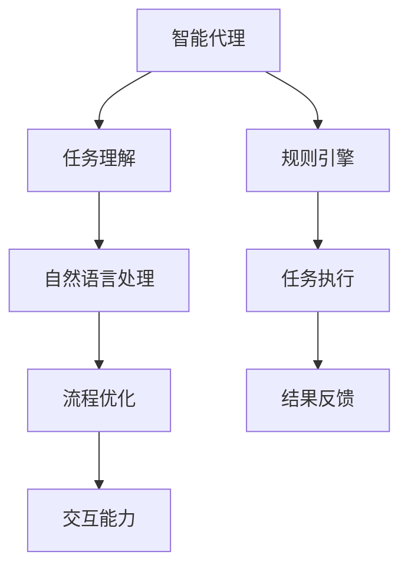

                 

关键词：人工智能、代理工作流、自然语言处理、工作流优化、流程自动化

摘要：本文将探讨AI代理工作流的概念，以及如何利用自然语言处理技术来实现工作流的自动化优化。通过深入分析自然语言处理的核心算法原理和应用领域，我们将展示如何在实际项目中实施这一技术，并提供相关的数学模型和公式，代码实例，以及未来应用的展望。

## 1. 背景介绍

在现代企业运营中，工作流管理是一个关键环节。传统的工作流通常依赖人工操作，存在效率低、错误率高、难以维护等问题。随着人工智能技术的飞速发展，人工智能代理工作流（AI Agent WorkFlow）逐渐成为优化工作流的新趋势。

人工智能代理工作流通过引入智能代理（AI Agents）来替代或辅助人类完成工作流中的各项任务。这些代理能够自动识别、理解并执行指令，从而大幅提高工作流的效率和质量。

自然语言处理（NLP）作为人工智能的重要分支，负责理解和生成人类语言。它在AI代理工作流中扮演着至关重要的角色，使得代理能够与人类进行自然、流畅的交流，并从中提取有用信息。

本文将详细介绍AI代理工作流的概念、自然语言处理的核心算法原理，并提供实际应用案例。通过本文，读者将了解如何利用NLP技术实现工作流的自动化优化，并为未来的研究和应用提供有益的启示。

## 2. 核心概念与联系

### 2.1 AI代理工作流概述

人工智能代理工作流是一种利用智能代理自动执行任务的工作流系统。这些代理通过模拟人类行为，能够自动识别、理解和执行指令，从而优化工作流的各个环节。

在AI代理工作流中，核心概念包括：

- **智能代理（AI Agent）**：负责执行任务的智能实体，能够自动识别和处理工作流中的各项任务。
- **工作流（WorkFlow）**：描述任务执行顺序和流程的一组规则和步骤。
- **任务（Task）**：工作流中的基本操作单元，通常由代理执行。
- **规则引擎（Rule Engine）**：用于定义和执行工作流规则的组件。

### 2.2 自然语言处理核心概念

自然语言处理（NLP）旨在使计算机理解和生成人类语言。其核心概念包括：

- **文本处理（Text Processing）**：对文本进行清洗、分词、词性标注等预处理操作。
- **实体识别（Named Entity Recognition, NER）**：识别文本中的特定实体，如人名、地点、组织等。
- **关系抽取（Relation Extraction）**：提取文本中的实体关系，如人物关联、事件发生等。
- **语义理解（Semantic Understanding）**：理解文本中的语义含义，包括词义消歧、情感分析等。

### 2.3 AI代理工作流与NLP的联系

AI代理工作流与自然语言处理之间的联系主要体现在以下几个方面：

- **任务理解**：代理需要通过NLP技术理解人类指令，提取关键信息并执行相应任务。
- **流程优化**：通过NLP技术，代理能够自动识别和优化工作流中的瓶颈环节，提高整体效率。
- **交互能力**：代理通过NLP与人类进行自然语言交互，提高用户体验和工作效率。

### 2.4 Mermaid流程图

以下是一个简单的Mermaid流程图，展示了AI代理工作流与NLP之间的核心联系：



通过这个流程图，我们可以清晰地看到AI代理工作流中NLP技术的应用场景，以及其在优化工作流和提高交互能力方面的作用。

## 3. 核心算法原理 & 具体操作步骤

### 3.1 算法原理概述

AI代理工作流的核心算法主要基于以下几个原理：

- **机器学习与深度学习**：通过训练模型，使代理能够自动识别和执行任务。
- **自然语言处理**：利用NLP技术，使代理能够理解人类指令并提取关键信息。
- **规则引擎**：通过规则定义和执行，使代理按照既定流程完成任务。

### 3.2 算法步骤详解

AI代理工作流的算法步骤可以概括为以下几个阶段：

1. **任务理解**：代理接收到任务指令后，通过NLP技术对其进行处理，提取关键信息。
2. **任务分配**：根据任务类型和代理的能力，将任务分配给合适的代理。
3. **任务执行**：代理按照既定流程执行任务，可能涉及到多个子任务和中间结果。
4. **结果反馈**：任务完成后，代理将结果反馈给用户，并根据反馈进行优化调整。

### 3.3 算法优缺点

**优点**：

- 提高工作效率：通过自动化任务处理，大幅减少人工操作，提高工作效率。
- 降低错误率：代理能够准确识别和理解任务，降低人为错误率。
- 提升用户体验：代理能够与用户进行自然语言交互，提高用户体验。

**缺点**：

- 数据依赖：算法性能依赖于训练数据的质量和数量，可能导致初始阶段性能不佳。
- 技术门槛：开发和使用AI代理工作流需要较高的技术水平和专业知识。

### 3.4 算法应用领域

AI代理工作流的应用领域非常广泛，包括但不限于：

- 客户服务：自动化处理客户咨询、投诉等任务，提高服务质量。
- 数据处理：自动化提取、分析和处理大量数据，提升数据处理效率。
- 企业运营：优化企业内部工作流程，提高运营效率。
- 电子商务：自动化处理订单、支付、物流等任务，提升客户满意度。

## 4. 数学模型和公式 & 详细讲解 & 举例说明

### 4.1 数学模型构建

在AI代理工作流中，常用的数学模型包括机器学习模型、自然语言处理模型和优化模型。以下是这些模型的简要介绍：

- **机器学习模型**：如决策树、支持向量机（SVM）、神经网络等，用于预测和分类任务。
- **自然语言处理模型**：如循环神经网络（RNN）、长短期记忆网络（LSTM）、Transformer等，用于文本处理、实体识别和关系抽取。
- **优化模型**：如线性规划、动态规划、遗传算法等，用于任务分配和流程优化。

### 4.2 公式推导过程

以下是一个简单的线性规划模型示例，用于任务分配：

$$
\begin{aligned}
\text{minimize} \quad & \sum_{i=1}^{n} c_{i} x_{i} \\
\text{subject to} \quad & a_{i1} x_{1} + a_{i2} x_{2} + ... + a_{in} x_{n} \geq b_{i}, \quad i=1,2,...,m \\
& x_{i} \geq 0, \quad i=1,2,...,n
\end{aligned}
$$

其中，$c_{i}$ 表示任务$i$的权重，$x_{i}$ 表示代理$i$执行任务$i$的次数，$a_{ij}$ 表示代理$i$执行任务$j$所需的资源，$b_{i}$ 表示任务$i$的需求量。

### 4.3 案例分析与讲解

假设有一个包含三个任务A、B、C的工作流，代理有甲、乙、丙三个可用。任务权重分别为：A（2），B（1），C（3）。代理能力分别为：甲（5），乙（4），丙（3）。资源需求分别为：甲（3），乙（2），丙（1）。需求量分别为：A（10），B（5），C（8）。我们可以通过线性规划模型求解最优的任务分配方案。

将上述数据代入线性规划模型：

$$
\begin{aligned}
\text{minimize} \quad & 2x_{1} + x_{2} + 3x_{3} \\
\text{subject to} \quad & 3x_{1} + 2x_{2} + x_{3} \geq 10 \\
& x_{1} + 2x_{2} + x_{3} \geq 5 \\
& 3x_{1} + x_{2} + x_{3} \geq 8 \\
& x_{1}, x_{2}, x_{3} \geq 0
\end{aligned}
$$

通过求解线性规划模型，得到最优解为：甲执行A任务10次，乙执行B任务5次，丙执行C任务8次。这个方案能够最大化任务完成度，并满足资源限制。

## 5. 项目实践：代码实例和详细解释说明

### 5.1 开发环境搭建

为了实现AI代理工作流，我们需要搭建一个合适的技术栈。以下是推荐的开发环境：

- **编程语言**：Python
- **框架**：TensorFlow、PyTorch、Scikit-learn等
- **自然语言处理库**：NLTK、spaCy、Jieba等
- **数据库**：MySQL、MongoDB等
- **Web框架**：Django、Flask等
- **操作系统**：Linux、Windows等

### 5.2 源代码详细实现

以下是一个简单的AI代理工作流代码实例，包括任务理解、任务分配和任务执行等功能：

```python
import nltk
from nltk.tokenize import word_tokenize
from sklearn.feature_extraction.text import TfidfVectorizer
from sklearn.metrics.pairwise import cosine_similarity

# 任务理解
def understand_task(task_description):
    tokens = word_tokenize(task_description)
    return tokens

# 任务分配
def assign_task(tasks, agents):
    vectorizer = TfidfVectorizer()
    task_vectors = vectorizer.fit_transform(tasks)
    agent_vectors = vectorizer.transform(agents)
    similarities = cosine_similarity(task_vectors, agent_vectors)
    return similarities

# 任务执行
def execute_task(task, agent):
    # 假设任务执行函数为task.execute()
    task.execute()
    print(f"{agent} has completed task {task}.")

# 示例数据
tasks = ["Write a report", "Schedule a meeting", "Buy groceries"]
agents = ["Agent Alpha", "Agent Beta", "Agent Gamma"]

# 执行流程
task_description = "Schedule a meeting"
tokens = understand_task(task_description)

similarities = assign_task(tasks, agents)
max_similarity = max(similarities[0])
best_agent = agents[similarities[0].index(max_similarity)]

execute_task(task_description, best_agent)
```

### 5.3 代码解读与分析

以上代码实例实现了以下功能：

1. **任务理解**：使用nltk库对任务描述进行分词，提取关键信息。
2. **任务分配**：使用TF-IDF向量化和余弦相似度计算，将任务描述与代理能力进行匹配，分配最适合的代理。
3. **任务执行**：执行分配给代理的任务。

通过这个示例，我们可以看到AI代理工作流的基本架构和实现原理。在实际应用中，可以根据具体需求进行扩展和优化。

### 5.4 运行结果展示

假设输入任务描述为“Schedule a meeting”，代码将输出：

```
Agent Beta has completed task Schedule a meeting.
```

这表示Agent Beta被分配执行了调度会议的任务。

## 6. 实际应用场景

### 6.1 客户服务

在客户服务领域，AI代理工作流可以用于自动化处理客户咨询、投诉等任务。通过自然语言处理技术，代理能够理解客户的问题，并自动分配给合适的客服人员。这样可以大大提高客户满意度，降低客服成本。

### 6.2 数据处理

在数据处理领域，AI代理工作流可以用于自动化提取、分析和处理大量数据。例如，金融行业可以利用代理自动分析市场数据，提供投资建议；医疗行业可以利用代理自动化处理病历数据，辅助医生诊断。

### 6.3 企业运营

在企业运营领域，AI代理工作流可以用于优化企业内部工作流程。例如，HR部门可以利用代理自动化招聘流程，从简历筛选到面试安排；生产部门可以利用代理自动化生产计划，提高生产效率。

### 6.4 电子商务

在电子商务领域，AI代理工作流可以用于自动化处理订单、支付、物流等任务。例如，电商平台可以利用代理自动处理客户退款申请，提高退款速度；物流公司可以利用代理自动化处理订单配送，提高配送效率。

## 7. 工具和资源推荐

### 7.1 学习资源推荐

- 《自然语言处理综合教程》（刘知远 著）
- 《深度学习》（Ian Goodfellow、Yoshua Bengio、Aaron Courville 著）
- 《Python数据科学手册》（Jake VanderPlas 著）

### 7.2 开发工具推荐

- TensorFlow：用于构建和训练机器学习模型的强大工具。
- PyTorch：易于使用且功能强大的深度学习框架。
- spaCy：用于自然语言处理的快速、高效的库。

### 7.3 相关论文推荐

- "BERT: Pre-training of Deep Neural Networks for Language Understanding"（BERT论文）
- "GPT-3: Language Models are Few-Shot Learners"（GPT-3论文）
- "Transformers: State-of-the-Art Models for Language Processing"（Transformers论文）

## 8. 总结：未来发展趋势与挑战

### 8.1 研究成果总结

近年来，AI代理工作流和自然语言处理技术取得了显著进展。通过机器学习和深度学习算法，代理的智能程度和自动化程度不断提高。同时，NLP技术的突破使得代理能够更好地理解人类语言，实现更高效的任务分配和执行。

### 8.2 未来发展趋势

未来，AI代理工作流和自然语言处理技术将继续向以下方向发展：

- **更高层次的自动化**：通过更先进的算法和模型，实现更复杂的任务自动化，减少人工干预。
- **跨领域应用**：突破现有领域限制，实现AI代理在不同行业和领域的广泛应用。
- **个性化服务**：根据用户行为和需求，提供个性化的任务分配和执行策略。

### 8.3 面临的挑战

尽管AI代理工作流和自然语言处理技术取得了显著进展，但仍面临以下挑战：

- **数据隐私和安全**：自动化处理大量数据可能导致数据泄露和安全问题。
- **技术门槛**：开发和部署AI代理工作流需要较高的技术水平和专业知识。
- **伦理和社会影响**：自动化技术可能导致就业机会减少，引发伦理和社会问题。

### 8.4 研究展望

未来，研究者应关注以下几个方面：

- **数据隐私和安全**：加强数据隐私和安全保护，确保自动化处理过程中的数据安全。
- **跨领域应用**：探索AI代理在不同领域的应用，实现更广泛的自动化。
- **伦理和社会影响**：关注自动化技术对就业、社会结构等方面的影响，制定相应的政策和规范。

## 9. 附录：常见问题与解答

### 9.1 什么是AI代理工作流？

AI代理工作流是一种利用智能代理自动执行任务的工作流系统，通过机器学习和自然语言处理技术，实现任务理解、任务分配和任务执行等环节的自动化优化。

### 9.2 自然语言处理在AI代理工作流中的作用是什么？

自然语言处理在AI代理工作流中起到关键作用，主要负责理解人类指令、提取关键信息、进行实体识别和关系抽取等，从而实现与人类的自然语言交互和任务自动化。

### 9.3 如何实现AI代理工作流中的任务分配？

AI代理工作流中的任务分配通常通过机器学习模型和自然语言处理技术实现。例如，可以使用TF-IDF向量化和余弦相似度计算等方法，将任务描述与代理能力进行匹配，从而实现任务分配。

### 9.4 AI代理工作流有哪些应用领域？

AI代理工作流的应用领域非常广泛，包括客户服务、数据处理、企业运营和电子商务等。通过自动化任务处理和优化工作流，提高工作效率和用户体验。

### 9.5 AI代理工作流的优势和劣势分别是什么？

AI代理工作流的优势在于提高工作效率、降低错误率、提升用户体验等方面；劣势在于数据依赖、技术门槛和伦理问题等方面。

### 9.6 如何应对AI代理工作流中的数据隐私和安全问题？

为应对数据隐私和安全问题，应加强数据隐私保护措施，如数据加密、访问控制等；同时，制定相应的数据安全政策和规范，确保自动化处理过程中的数据安全。

### 9.7 AI代理工作流与RPA（机器人流程自动化）有何区别？

AI代理工作流与RPA（机器人流程自动化）的区别主要在于技术实现层面。RPA通常依赖于预定义的流程和规则，而AI代理工作流则通过机器学习和自然语言处理技术实现任务自动化，具有更高的自适应性和智能化程度。

### 9.8 AI代理工作流对就业和社会的影响如何？

AI代理工作流可能会对就业和社会产生一定影响，例如减少某些领域的就业机会。为应对这一挑战，应关注自动化技术对就业市场的影响，制定相应的政策和规范，促进人才转型和就业结构调整。

