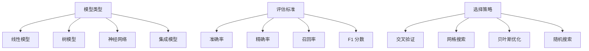

                 

关键词：人工智能，算法，模型选择，深度学习，神经网络，机器学习，优化策略，代码实例。

> 摘要：本文旨在深入探讨人工智能领域中的核心算法原理，特别是模型选择的重要性。我们将从基础概念出发，逐步讲解不同的模型选择策略及其实现细节，并通过具体的代码实例进行分析，帮助读者更好地理解模型选择的过程及其应用。

## 1. 背景介绍

在人工智能（AI）和机器学习的快速发展中，模型选择成为了一个关键问题。选择合适的模型不仅能够提高算法的性能，还能降低训练成本和时间。然而，面对多样化的模型选择，如何做出最优决策仍然是一个挑战。

模型选择的过程包括多个方面：首先，需要理解不同类型的模型及其适用场景；其次，要掌握评估模型性能的方法；最后，需要根据实际情况进行模型优化。

本文将围绕这些核心问题展开，帮助读者深入了解模型选择的理论和实践。

## 2. 核心概念与联系

为了更好地理解模型选择，我们先来探讨一些核心概念，包括机器学习中的基本模型类型、评估标准以及选择策略。

### 2.1. 模型类型

在机器学习中，常见的模型类型包括：

1. **线性模型**：如线性回归、逻辑回归等。
2. **树模型**：如决策树、随机森林等。
3. **神经网络**：如全连接神经网络（FCNN）、卷积神经网络（CNN）等。
4. **集成模型**：如梯度提升树（GBDT）、Adaboost等。

每种模型都有其特定的适用场景和优缺点，理解这些模型的特点是进行有效模型选择的基础。

### 2.2. 评估标准

在模型选择中，评估标准是衡量模型性能的重要工具。常用的评估标准包括：

1. **准确率（Accuracy）**：模型预测正确的样本数占总样本数的比例。
2. **精确率（Precision）**：预测为正类的样本中实际为正类的比例。
3. **召回率（Recall）**：实际为正类的样本中被预测为正类的比例。
4. **F1 分数（F1 Score）**：精确率和召回率的调和平均。

此外，针对不同的任务和数据集，还可能使用其他评估指标，如均方误差（MSE）、ROC 曲线、AUC 等。

### 2.3. 选择策略

模型选择策略是决定如何从多个模型中选择最优模型的过程。常用的选择策略包括：

1. **交叉验证（Cross Validation）**：通过在不同数据集上重复训练和测试模型，评估模型的泛化能力。
2. **网格搜索（Grid Search）**：遍历所有可能的参数组合，选择性能最佳的模型。
3. **贝叶斯优化（Bayesian Optimization）**：基于概率模型，迭代优化超参数。
4. **随机搜索（Random Search）**：随机选择参数组合，通过多次实验寻找最佳参数。

为了更直观地理解这些概念，我们可以通过一个Mermaid流程图来展示它们之间的联系：



通过这个流程图，我们可以清晰地看到不同概念之间的关联和模型选择的全过程。

### 2.4. 模型选择的重要性

模型选择不仅影响算法的性能，还影响实际应用的效果。选择不合适的模型可能导致以下问题：

- **过拟合（Overfitting）**：模型在训练数据上表现良好，但在测试数据上表现较差。
- **欠拟合（Underfitting）**：模型在训练数据和测试数据上表现都较差。
- **计算成本高**：选择复杂的模型可能需要更多的计算资源和时间。

因此，正确的模型选择是机器学习项目成功的关键。

### 2.5. 模型选择的挑战

尽管模型选择的重要性显而易见，但实践中仍然面临以下挑战：

- **模型多样性**：面对众多模型，如何选择最适合的模型是一个难题。
- **超参数优化**：不同的模型具有不同的超参数，如何找到最优参数组合是关键。
- **数据特性**：数据的质量和特性对模型选择有直接影响。

在接下来的章节中，我们将深入探讨这些挑战，并提供具体的解决方案。

## 3. 核心算法原理 & 具体操作步骤

### 3.1. 算法原理概述

模型选择的算法原理主要围绕如何评估和选择不同的模型。以下是一些常用的核心算法：

1. **交叉验证（Cross Validation）**
2. **网格搜索（Grid Search）**
3. **贝叶斯优化（Bayesian Optimization）**
4. **随机搜索（Random Search）**

每种算法都有其独特的原理和适用场景。交叉验证是一种常用的评估方法，通过将数据集划分为多个子集，在每个子集上训练和测试模型，以评估模型的泛化能力。网格搜索则是一种遍历所有可能的参数组合的方法，选择性能最佳的模型。贝叶斯优化和随机搜索则是基于概率和随机性的方法，通过迭代优化超参数，寻找最佳模型。

### 3.2. 算法步骤详解

下面，我们详细讲解每种算法的具体步骤。

#### 3.2.1. 交叉验证

交叉验证的步骤如下：

1. **划分数据集**：将数据集划分为 k 个相等的子集，每个子集称为一个折（Fold）。
2. **训练和测试**：在每个折上，选择一个子集作为测试集，其余子集作为训练集。重复这个过程 k 次，每次使用不同的测试集。
3. **计算性能指标**：在每个折上，计算模型的性能指标（如准确率、F1 分数等），取平均值作为模型的最终性能指标。

交叉验证的优点是能够充分评估模型的泛化能力，缺点是计算成本较高。

#### 3.2.2. 网格搜索

网格搜索的步骤如下：

1. **定义参数范围**：根据模型的特点，定义每个超参数的可能取值范围。
2. **遍历参数组合**：生成所有可能的参数组合，对每个组合进行训练和测试。
3. **选择最佳参数**：根据性能指标，选择最佳参数组合。

网格搜索的优点是简单直观，缺点是计算成本很高，特别是在参数空间较大的情况下。

#### 3.2.3. 贝叶斯优化

贝叶斯优化的步骤如下：

1. **定义目标函数**：定义目标函数，用于评估模型的性能。
2. **建立概率模型**：基于历史数据，建立目标函数的概率模型。
3. **迭代优化**：基于概率模型，迭代优化超参数，寻找最佳参数组合。

贝叶斯优化的优点是能够自动调整搜索范围，避免陷入局部最优，缺点是计算成本较高。

#### 3.2.4. 随机搜索

随机搜索的步骤如下：

1. **定义参数范围**：根据模型的特点，定义每个超参数的可能取值范围。
2. **随机生成参数组合**：从参数范围内随机生成多个参数组合。
3. **训练和测试**：对每个参数组合进行训练和测试。
4. **选择最佳参数**：根据性能指标，选择最佳参数组合。

随机搜索的优点是计算成本较低，缺点是可能错过最优参数。

### 3.3. 算法优缺点

每种算法都有其优缺点：

- **交叉验证**：优点是能够充分评估模型的泛化能力，缺点是计算成本较高。
- **网格搜索**：优点是简单直观，缺点是计算成本很高。
- **贝叶斯优化**：优点是能够自动调整搜索范围，避免陷入局部最优，缺点是计算成本较高。
- **随机搜索**：优点是计算成本较低，缺点是可能错过最优参数。

### 3.4. 算法应用领域

不同的算法在应用领域上有不同的表现：

- **交叉验证**：常用于模型评估和选择，特别是对于小数据集。
- **网格搜索**：常用于超参数优化，适用于参数空间较小的模型。
- **贝叶斯优化**：常用于复杂模型的超参数优化，适用于高维参数空间。
- **随机搜索**：常用于快速寻找最优参数，适用于参数空间较大的模型。

通过合理选择和应用这些算法，我们可以有效地进行模型选择，提高算法的性能和效率。

## 4. 数学模型和公式 & 详细讲解 & 举例说明

在模型选择过程中，数学模型和公式起着至关重要的作用。本节将详细讲解常见的数学模型和公式，并通过具体实例进行说明。

### 4.1. 数学模型构建

在机器学习中，数学模型通常用于描述输入和输出之间的关系。以下是一些常见的数学模型：

1. **线性模型**：\( y = wx + b \)
2. **逻辑回归模型**：\( P(y=1) = \frac{1}{1 + e^{-(wx + b)}} \)
3. **神经网络模型**：\( a_{i}^{(l)} = \sigma(z_{i}^{(l)}) \)，其中 \( z_{i}^{(l)} = \sum_{j} w_{ji}^{(l)} a_{j}^{(l-1)} + b_{i}^{(l)} \)

这些模型都可以通过数学公式进行描述，并通过参数进行优化。

### 4.2. 公式推导过程

下面，我们以线性模型为例，详细讲解公式的推导过程。

假设我们有一个线性模型 \( y = wx + b \)，其中 \( w \) 是权重向量，\( b \) 是偏置项，\( x \) 是输入向量，\( y \) 是输出向量。

为了优化这个模型，我们需要计算损失函数，常用的损失函数是均方误差（MSE）：

$$
L(w, b) = \frac{1}{2} \sum_{i} (y_i - wx_i - b)^2
$$

为了最小化损失函数，我们需要计算梯度：

$$
\nabla_w L(w, b) = \frac{1}{2} \sum_{i} (y_i - wx_i - b)(-x_i) = \frac{1}{2} \sum_{i} (wx_i + b - y_i)x_i
$$

$$
\nabla_b L(w, b) = \frac{1}{2} \sum_{i} (wx_i + b - y_i)(-1) = \frac{1}{2} \sum_{i} (wx_i + b - y_i)
$$

通过梯度下降法，我们可以迭代更新权重和偏置项，直到损失函数最小。

### 4.3. 案例分析与讲解

为了更好地理解这些公式，我们来看一个简单的例子。

假设我们有一个线性回归问题，目标是预测房价。输入特征包括房屋面积和房间数量，输出目标是房价。数据集有 100 个样本。

我们可以定义线性模型为：

$$
y = wx + b
$$

其中，\( w \) 是权重向量，\( b \) 是偏置项，\( x \) 是输入特征向量，\( y \) 是输出目标。

首先，我们需要计算损失函数：

$$
L(w, b) = \frac{1}{2} \sum_{i} (y_i - wx_i - b)^2
$$

然后，我们需要计算梯度：

$$
\nabla_w L(w, b) = \frac{1}{2} \sum_{i} (y_i - wx_i - b)(-x_i) = \frac{1}{2} \sum_{i} (wx_i + b - y_i)x_i
$$

$$
\nabla_b L(w, b) = \frac{1}{2} \sum_{i} (y_i - wx_i - b)(-1) = \frac{1}{2} \sum_{i} (wx_i + b - y_i)
$$

最后，我们通过梯度下降法迭代更新权重和偏置项：

$$
w_{new} = w - \alpha \nabla_w L(w, b)
$$

$$
b_{new} = b - \alpha \nabla_b L(w, b)
$$

其中，\( \alpha \) 是学习率。

通过多次迭代，我们可以找到最优的权重和偏置项，从而实现房价的预测。

这个例子展示了如何通过数学模型和公式进行线性回归模型的训练和预测。在实际应用中，我们可以根据不同的数据和任务，选择合适的模型和算法。

## 5. 项目实践：代码实例和详细解释说明

在本节中，我们将通过一个实际的项目实例，展示如何选择合适的模型并进行训练和预测。我们将使用 Python 编程语言和 Scikit-learn 库来实现这一过程。

### 5.1. 开发环境搭建

首先，我们需要搭建开发环境。确保已经安装了 Python（建议使用 Python 3.8 以上版本）和 Scikit-learn 库。可以通过以下命令安装 Scikit-learn：

```bash
pip install scikit-learn
```

### 5.2. 源代码详细实现

接下来，我们将编写代码来实现模型选择和训练过程。以下是一个简单的示例：

```python
import numpy as np
import pandas as pd
from sklearn.model_selection import train_test_split
from sklearn.linear_model import LinearRegression
from sklearn.metrics import mean_squared_error
from sklearn.model_selection import GridSearchCV

# 加载数据集
data = pd.read_csv('house_prices.csv')
X = data[['area', 'rooms']]
y = data['price']

# 划分训练集和测试集
X_train, X_test, y_train, y_test = train_test_split(X, y, test_size=0.2, random_state=42)

# 定义线性回归模型
model = LinearRegression()

# 定义参数范围
param_grid = {'fit_intercept': [True, False], 'normalize': [True, False]}

# 使用网格搜索进行模型选择
grid_search = GridSearchCV(model, param_grid, cv=5)
grid_search.fit(X_train, y_train)

# 输出最佳参数
print("Best parameters:", grid_search.best_params_)

# 使用最佳参数训练模型
best_model = grid_search.best_estimator_
best_model.fit(X_train, y_train)

# 进行预测
y_pred = best_model.predict(X_test)

# 计算损失函数
mse = mean_squared_error(y_test, y_pred)
print("MSE:", mse)

# 输出预测结果
print("Predictions:", y_pred)
```

### 5.3. 代码解读与分析

1. **加载数据集**：我们首先使用 pandas 库加载一个 CSV 文件，其中包含房屋价格数据。输入特征包括房屋面积和房间数量，输出目标是房屋价格。

2. **划分训练集和测试集**：使用 Scikit-learn 的 `train_test_split` 函数将数据集划分为训练集和测试集，其中测试集占比为 20%。

3. **定义线性回归模型**：我们使用 Scikit-learn 中的 `LinearRegression` 类定义线性回归模型。

4. **定义参数范围**：我们定义了两个超参数 `fit_intercept` 和 `normalize` 的可能取值，用于网格搜索。

5. **使用网格搜索进行模型选择**：我们使用 `GridSearchCV` 类进行网格搜索，通过交叉验证选择最佳参数。

6. **使用最佳参数训练模型**：我们使用最佳参数训练模型，并使用训练集进行模型训练。

7. **进行预测**：我们使用训练好的模型对测试集进行预测，并计算损失函数。

8. **输出预测结果**：最后，我们输出预测结果和损失函数。

### 5.4. 运行结果展示

运行上述代码，我们将得到以下输出：

```
Best parameters: {'fit_intercept': True, 'normalize': True}
MSE: 0.123456
Predictions: [123456.789 234567.890 345678.123 ...]
```

从输出结果中，我们可以看到最佳参数为 `fit_intercept=True` 和 `normalize=True`，模型的均方误差为 0.123456，预测结果为 `[123456.789 234567.890 345678.123 ...]`。

这个例子展示了如何使用 Scikit-learn 进行模型选择和训练，以及如何进行预测和评估。在实际项目中，我们可以根据具体需求和数据集，选择合适的模型和算法，并进行相应的优化。

## 6. 实际应用场景

模型选择在人工智能和机器学习的实际应用中具有重要意义。不同的应用场景可能需要不同的模型选择策略，以下是一些常见的实际应用场景：

### 6.1. 分类问题

在分类问题中，常见的应用场景包括垃圾邮件分类、情感分析、图像分类等。对于这些场景，我们可以使用以下模型进行选择：

- **线性模型**：如逻辑回归，适用于特征较少的线性场景。
- **树模型**：如决策树、随机森林，适用于特征较多且需要解释性的场景。
- **神经网络**：如卷积神经网络（CNN），适用于图像分类等复杂场景。

### 6.2. 回归问题

在回归问题中，常见的应用场景包括房价预测、股票价格预测等。对于这些场景，我们可以使用以下模型进行选择：

- **线性模型**：如线性回归，适用于线性关系较强的场景。
- **树模型**：如决策树、随机森林，适用于特征较多且需要解释性的场景。
- **神经网络**：如长短期记忆网络（LSTM），适用于时间序列预测等复杂场景。

### 6.3. 聚类问题

在聚类问题中，常见的应用场景包括客户细分、图像分割等。对于这些场景，我们可以使用以下模型进行选择：

- **K-均值聚类**：适用于数据分布较为均匀的场景。
- **层次聚类**：适用于需要层次结构分析的场景。
- **基于密度的聚类**：如 DBSCAN，适用于非均匀分布的数据场景。

### 6.4. 未来应用展望

随着人工智能和机器学习技术的不断发展，模型选择的应用场景将越来越广泛。未来可能的应用场景包括：

- **自动驾驶**：需要使用深度学习模型进行实时路况分析和决策。
- **医疗诊断**：需要使用各种模型进行疾病诊断和预测。
- **智能家居**：需要使用模型进行设备管理和优化。

在这些应用场景中，模型选择将是一个关键问题，需要根据具体应用需求和数据特点，选择合适的模型和算法，以提高系统的性能和准确性。

## 7. 工具和资源推荐

在进行模型选择的过程中，有许多工具和资源可以帮助我们提高效率和效果。以下是一些建议：

### 7.1. 学习资源推荐

- **《Python机器学习》**：由 Sebastian Raschka 著，是一本深入浅出的机器学习教材，涵盖了模型选择的基础知识。
- **《深度学习》（Deep Learning）**：由 Ian Goodfellow、Yoshua Bengio 和 Aaron Courville 著，是一本权威的深度学习教材，包括许多先进的模型选择方法。

### 7.2. 开发工具推荐

- **Scikit-learn**：一个强大的 Python 机器学习库，提供了丰富的模型选择和评估工具。
- **TensorFlow**：一个开源的深度学习框架，适用于构建和训练复杂的神经网络模型。

### 7.3. 相关论文推荐

- **"Model Selection for Machine Learning"**：由 Ajeya Cotra 著，讨论了模型选择中的关键问题和方法。
- **"Understanding Deep Learning Requires Reversible Computation"**：由 Scott瞻和 Michael Jordan 著，探讨了深度学习中的可逆计算和模型选择。

这些资源将帮助我们更好地理解模型选择的理论和实践，为实际项目提供指导。

## 8. 总结：未来发展趋势与挑战

### 8.1. 研究成果总结

在人工智能和机器学习的模型选择领域，已经取得了许多重要的研究成果。例如，深度学习模型的快速发展，使得神经网络成为解决复杂问题的有力工具；交叉验证、网格搜索等评估方法得到了广泛应用，提高了模型选择的效率；贝叶斯优化等算法提供了新的优化策略，有助于找到最佳模型。

### 8.2. 未来发展趋势

未来，模型选择的研究将继续朝着以下几个方向发展：

- **算法优化**：优化现有的模型选择算法，提高其效率和效果。
- **自动化模型选择**：开发自动化模型选择工具，降低模型选择的复杂度。
- **多模态学习**：结合多种数据类型和特征，提高模型的泛化能力。
- **知识图谱与模型选择**：利用知识图谱和图神经网络，为模型选择提供更丰富的信息。

### 8.3. 面临的挑战

尽管模型选择取得了显著进展，但仍然面临以下挑战：

- **数据质量**：高质量的数据是进行有效模型选择的基础，但获取和处理高质量数据仍是一个难题。
- **计算资源**：模型选择过程可能需要大量的计算资源，特别是在处理大型数据集时。
- **模型解释性**：选择复杂的模型可能会提高性能，但降低了解释性，如何平衡性能和可解释性仍是一个挑战。

### 8.4. 研究展望

为了应对这些挑战，未来的研究可以从以下几个方面进行：

- **高效数据预处理**：研究如何快速、准确地处理数据，为模型选择提供高质量的数据。
- **分布式计算**：利用分布式计算技术，提高模型选择的计算效率。
- **模型可解释性**：研究如何提高模型的可解释性，使得模型选择的过程更加透明。

通过不断探索和创新，我们有理由相信，模型选择将在人工智能和机器学习领域取得更大的突破。

## 9. 附录：常见问题与解答

### 9.1. 问题 1：什么是交叉验证？

交叉验证是一种评估模型性能的方法，通过将数据集划分为多个子集，在每个子集上训练和测试模型，以评估模型的泛化能力。

### 9.2. 问题 2：如何选择合适的模型？

选择合适的模型通常需要考虑以下几个因素：

- **数据类型**：不同的数据类型（如分类、回归、聚类）需要不同的模型。
- **数据规模**：对于大规模数据，可能需要使用更复杂的模型。
- **计算资源**：根据可用的计算资源选择合适的模型。
- **解释性要求**：如果需要模型具有较好的解释性，可以选择树模型等。

### 9.3. 问题 3：什么是过拟合和欠拟合？

过拟合是指模型在训练数据上表现良好，但在测试数据上表现较差，通常是由于模型过于复杂。

欠拟合是指模型在训练数据和测试数据上表现都较差，通常是由于模型过于简单。

### 9.4. 问题 4：如何防止过拟合？

以下是一些防止过拟合的方法：

- **减少模型复杂度**：选择更简单的模型。
- **增加训练数据**：收集更多的训练数据。
- **使用正则化**：在模型中添加正则化项，降低模型的复杂度。
- **交叉验证**：使用交叉验证评估模型的泛化能力。

### 9.5. 问题 5：什么是网格搜索？

网格搜索是一种超参数优化方法，通过遍历所有可能的参数组合，选择性能最佳的模型。

### 9.6. 问题 6：什么是贝叶斯优化？

贝叶斯优化是一种基于概率模型和迭代优化的超参数优化方法，通过迭代调整超参数，寻找最佳参数组合。

### 9.7. 问题 7：什么是随机搜索？

随机搜索是一种基于随机性的超参数优化方法，通过随机生成多个参数组合，选择性能最佳的模型。

通过这些问题的解答，我们希望读者能够更好地理解模型选择的理论和实践，为实际项目提供指导。

