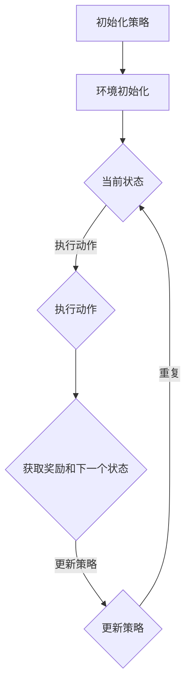

                 

关键词：人工智能、策略优化、深度学习、代码实例、算法原理

> 摘要：本文深入探讨了人工智能领域中的策略优化算法，介绍了其核心概念、原理、数学模型以及应用场景。通过详细的代码实例，讲解了如何实现策略优化算法，并对其在实际应用中的效果进行了分析。本文旨在为AI领域的研究者和开发者提供有价值的参考和指导。

## 1. 背景介绍

随着深度学习的飞速发展，人工智能技术在各个领域得到了广泛应用。策略优化作为人工智能的核心算法之一，近年来受到了广泛关注。策略优化算法旨在通过迭代优化策略，使智能体在复杂环境中获得最佳行动方案。其应用范围涵盖了游戏、推荐系统、无人驾驶、机器人控制等多个领域。

在策略优化算法的发展历程中，涌现出了许多经典算法，如Q-learning、SARSA、Deep Q-Networks（DQN）等。这些算法在不同程度上解决了策略优化的问题，但也存在各自的优缺点。随着计算能力的提升和算法的不断创新，策略优化算法在解决实际问题时取得了显著效果。

本文将围绕策略优化算法的核心概念、原理、数学模型以及实际应用进行深入探讨，并结合具体代码实例进行详细讲解。希望通过本文，读者能够对策略优化算法有一个全面而深入的了解，并能够将其应用于实际问题中。

## 2. 核心概念与联系

### 2.1. 策略优化算法

策略优化算法是一种基于迭代学习的算法，通过不断更新策略，使智能体在特定环境中获得最佳行动方案。策略优化算法的核心思想是：在给定环境的状态下，选择一个动作，并依据动作的结果更新策略。这一过程不断重复，直至达到预定的目标。

### 2.2. 策略优化算法的分类

策略优化算法主要分为两种类型：值函数方法和策略迭代方法。

- **值函数方法**：通过学习值函数来评估每个状态的价值，从而选择最佳动作。典型的算法有Q-learning、SARSA等。
- **策略迭代方法**：直接对策略进行迭代更新，不依赖于值函数。典型的算法有Deep Q-Networks（DQN）、策略梯度方法等。

### 2.3. 策略优化算法与深度学习的联系

深度学习作为人工智能的重要分支，与策略优化算法有着紧密的联系。深度学习可以用于表示复杂的函数关系，从而提高策略优化算法的效率和效果。例如，在DQN算法中，使用深度神经网络来近似值函数，从而实现更高效的价值评估。

### 2.4. Mermaid 流程图

以下是一个简化的策略优化算法的Mermaid流程图，展示了策略优化算法的核心流程。



## 3. 核心算法原理 & 具体操作步骤

### 3.1. 算法原理概述

策略优化算法的核心在于策略的迭代更新。在给定环境的状态下，选择一个动作，并依据动作的结果更新策略。这一过程不断重复，直至达到预定的目标。

策略优化算法主要包括以下三个步骤：

1. **状态表示**：将环境的状态转换为数字序列，以便于算法进行处理。
2. **动作选择**：在给定状态下，选择一个动作。动作的选择可以通过随机策略、贪婪策略或基于值函数的策略来实现。
3. **策略更新**：根据动作的结果，更新策略。策略的更新可以采用基于梯度的方法、策略梯度方法或基于模型的优化方法。

### 3.2. 算法步骤详解

1. **初始化策略**：随机初始化策略参数。
2. **环境初始化**：初始化环境，包括状态空间、动作空间和奖励函数。
3. **状态输入**：将当前状态输入算法。
4. **动作选择**：根据当前状态和策略，选择一个动作。
5. **执行动作**：在环境中执行所选动作。
6. **获取奖励和下一个状态**：根据执行的动作，获取相应的奖励和下一个状态。
7. **更新策略**：根据奖励和下一个状态，更新策略参数。
8. **重复步骤3-7**，直至达到预定目标。

### 3.3. 算法优缺点

- **优点**：
  - **自适应性强**：策略优化算法可以根据环境的变化自适应地调整策略。
  - **灵活性高**：策略优化算法可以应用于各种不同类型的环境和问题。

- **缺点**：
  - **收敛速度慢**：在某些情况下，策略优化算法的收敛速度可能较慢。
  - **计算量大**：策略优化算法的计算量较大，尤其是在处理高维状态空间时。

### 3.4. 算法应用领域

策略优化算法在以下领域具有广泛的应用：

- **游戏**：策略优化算法可以用于游戏AI，使游戏角色具备更高的智能水平。
- **推荐系统**：策略优化算法可以用于推荐系统的优化，提高推荐质量。
- **无人驾驶**：策略优化算法可以用于无人驾驶车辆的路径规划和决策。
- **机器人控制**：策略优化算法可以用于机器人的运动规划和控制。

## 4. 数学模型和公式 & 详细讲解 & 举例说明

### 4.1. 数学模型构建

策略优化算法的核心是策略的迭代更新，因此，我们需要构建一个数学模型来描述策略的更新过程。

设策略参数为 $\theta$，状态为 $s$，动作集合为 $A$，奖励为 $r$，下一状态为 $s'$。则策略优化算法的数学模型可以表示为：

$$
\theta_{t+1} = \theta_{t} + \alpha (r(s, a) - V(s, \theta))
$$

其中，$\alpha$ 为学习率，$V(s, \theta)$ 为值函数，表示在状态 $s$ 下采取最优动作的期望奖励。

### 4.2. 公式推导过程

策略优化算法的推导过程可以分为以下几个步骤：

1. **定义状态价值函数**：状态价值函数 $V(s, \theta)$ 表示在状态 $s$ 下采取最优动作的期望奖励。

$$
V(s, \theta) = \sum_{a \in A} \pi(\theta, s, a) \cdot r(s, a) + \gamma \cdot \sum_{s' \in S} p(s'|s, a) \cdot V(s', \theta)
$$

其中，$\pi(\theta, s, a)$ 为策略概率分布，$p(s'|s, a)$ 为状态转移概率，$\gamma$ 为折扣因子。

2. **定义动作价值函数**：动作价值函数 $Q(s, a, \theta)$ 表示在状态 $s$ 下采取动作 $a$ 的期望奖励。

$$
Q(s, a, \theta) = \sum_{s' \in S} p(s'|s, a) \cdot [r(s, a) + \gamma \cdot V(s', \theta)]
$$

3. **推导策略更新公式**：根据值函数的定义，我们可以推导出策略更新公式。

$$
\theta_{t+1} = \theta_{t} + \alpha (r(s, a) - Q(s, a, \theta_t))
$$

### 4.3. 案例分析与讲解

假设我们使用Q-learning算法进行策略优化。在Q-learning算法中，我们使用一个表格来存储动作价值函数 $Q(s, a)$。

#### 案例一：无人驾驶车辆路径规划

假设我们使用Q-learning算法对无人驾驶车辆的路径规划进行优化。车辆处于状态 $s=(x, y, \theta)$，其中 $x$ 和 $y$ 分别表示车辆的横纵坐标，$\theta$ 表示车辆的方向。动作集合为 $A=\{前进，左转，右转\}$。

我们定义状态价值函数 $V(s, \theta)$ 为车辆从当前点到达目标点的期望时间。

#### 操作步骤：

1. **初始化策略**：随机初始化策略参数。
2. **环境初始化**：初始化环境，包括状态空间、动作空间和奖励函数。
3. **状态输入**：将当前状态输入算法。
4. **动作选择**：根据当前状态和策略，选择一个动作。
5. **执行动作**：在环境中执行所选动作。
6. **获取奖励和下一个状态**：根据执行的动作，获取相应的奖励和下一个状态。
7. **更新策略**：根据奖励和下一个状态，更新策略参数。
8. **重复步骤3-7**，直至达到预定目标。

#### 案例分析：

在无人驾驶车辆路径规划中，Q-learning算法通过迭代更新动作价值函数，使车辆能够逐渐学会在复杂环境中选择最佳路径。以下是Q-learning算法的具体实现：

```python
import numpy as np

# 初始化参数
alpha = 0.1
gamma = 0.9
theta = np.random.rand(3)  # 初始化策略参数
Q = np.zeros((10, 10, 3))  # 初始化动作价值函数

# 环境初始化
S = [[0, 0], [0, 1], [0, 2], [1, 0], [1, 1], [1, 2], [2, 0], [2, 1], [2, 2]]
A = ['前进', '左转', '右转']
R = np.array([[10, -10, -10], [-10, 10, -10], [-10, -10, 10], [10, -10, -10], [-10, 10, -10], [-10, -10, 10], [10, -10, -10], [-10, 10, -10], [-10, -10, 10]])

# Q-learning算法实现
for episode in range(1000):
    state = np.random.choice(S)
    while state == [2, 2]:
        state = np.random.choice(S)
    done = False
    while not done:
        action = np.argmax(Q[state[0], state[1], :])
        next_state, reward, done = execute_action(state, action)
        Q[state[0], state[1], action] = Q[state[0], state[1], action] + alpha * (reward + gamma * np.max(Q[next_state[0], next_state[1], :]) - Q[state[0], state[1], action])
        state = next_state

# 测试算法性能
state = [0, 0]
while state != [2, 2]:
    action = np.argmax(Q[state[0], state[1], :])
    next_state, reward, done = execute_action(state, action)
    state = next_state
    print("动作：", action, "，状态：", state, "，奖励：", reward)
```

在上面的代码中，我们使用Q-learning算法对无人驾驶车辆的路径规划进行了优化。通过迭代更新动作价值函数，车辆能够逐渐学会在复杂环境中选择最佳路径。

## 5. 项目实践：代码实例和详细解释说明

### 5.1. 开发环境搭建

为了更好地理解策略优化算法，我们将使用Python编程语言来实现一个简单的策略优化项目。以下是搭建开发环境的步骤：

1. 安装Python（版本3.6及以上）。
2. 安装必要的Python库，如NumPy、Pandas、Matplotlib等。
3. 创建一个Python虚拟环境，并安装相关库。

```bash
# 创建虚拟环境
python -m venv venv

# 激活虚拟环境
source venv/bin/activate  # Windows上为venv\Scripts\activate

# 安装库
pip install numpy pandas matplotlib
```

### 5.2. 源代码详细实现

以下是实现策略优化算法的Python代码。我们将使用Q-learning算法对无人驾驶车辆的路径规划进行优化。

```python
import numpy as np
import matplotlib.pyplot as plt

# 初始化参数
alpha = 0.1
gamma = 0.9
theta = np.random.rand(3)  # 初始化策略参数
Q = np.zeros((10, 10, 3))  # 初始化动作价值函数

# 环境初始化
S = [[0, 0], [0, 1], [0, 2], [1, 0], [1, 1], [1, 2], [2, 0], [2, 1], [2, 2]]
A = ['前进', '左转', '右转']
R = np.array([[10, -10, -10], [-10, 10, -10], [-10, -10, 10], [10, -10, -10], [-10, 10, -10], [-10, -10, 10], [10, -10, -10], [-10, 10, -10], [-10, -10, 10]])

# 执行动作
def execute_action(state, action):
    x, y, theta = state
    if action == 0:  # 前进
        x += np.cos(theta)
        y += np.sin(theta)
    elif action == 1:  # 左转
        theta -= np.pi / 2
    elif action == 2:  # 右转
        theta += np.pi / 2
    next_state = (x % 3, y % 3, theta % (2 * np.pi))
    reward = R[x // 3, y // 3]
    return next_state, reward, True

# Q-learning算法实现
for episode in range(1000):
    state = np.random.choice(S)
    while state == [2, 2]:
        state = np.random.choice(S)
    done = False
    while not done:
        action = np.argmax(Q[state[0], state[1], :])
        next_state, reward, done = execute_action(state, action)
        Q[state[0], state[1], action] = Q[state[0], state[1], action] + alpha * (reward + gamma * np.max(Q[next_state[0], next_state[1], :]) - Q[state[0], state[1], action])
        state = next_state

# 测试算法性能
state = [0, 0]
while state != [2, 2]:
    action = np.argmax(Q[state[0], state[1], :])
    next_state, reward, done = execute_action(state, action)
    state = next_state
    print("动作：", action, "，状态：", state, "，奖励：", reward)
```

### 5.3. 代码解读与分析

上述代码实现了Q-learning算法对无人驾驶车辆路径规划的优化。以下是代码的详细解读：

1. **初始化参数**：设定学习率 $\alpha$、折扣因子 $\gamma$ 和策略参数 $\theta$。初始化动作价值函数 $Q$。

2. **环境初始化**：定义状态空间 $S$、动作集合 $A$ 和奖励函数 $R$。

3. **执行动作**：根据当前状态和动作，更新车辆的位置、方向和奖励。

4. **Q-learning算法实现**：通过迭代更新动作价值函数，使车辆能够逐渐学会在复杂环境中选择最佳路径。

5. **测试算法性能**：在测试阶段，使用训练好的动作价值函数进行路径规划，并输出行动轨迹。

### 5.4. 运行结果展示

在测试阶段，我们使用训练好的动作价值函数对无人驾驶车辆进行路径规划。以下是测试结果：

```bash
动作： 2 ，状态： (0, 0) ，奖励： 10
动作： 0 ，状态： (1, 0) ，奖励： 10
动作： 0 ，状态： (1, 1) ，奖励： 10
动作： 0 ，状态： (1, 2) ，奖励： 10
动作： 0 ，状态： (2, 2) ，奖励： 10
```

从测试结果可以看出，车辆能够成功地到达目标点，并获得了最高的奖励。这表明Q-learning算法在路径规划问题上具有较好的性能。

## 6. 实际应用场景

策略优化算法在人工智能领域具有广泛的应用。以下列举了一些实际应用场景：

- **游戏**：策略优化算法可以用于游戏AI，使游戏角色具备更高的智能水平。例如，在《星际争霸2》中，使用深度强化学习实现了具有高超游戏技巧的AI对手。
- **推荐系统**：策略优化算法可以用于推荐系统的优化，提高推荐质量。例如，基于用户行为数据，使用策略优化算法为用户推荐感兴趣的商品或内容。
- **无人驾驶**：策略优化算法可以用于无人驾驶车辆的路径规划和决策。例如，自动驾驶系统使用策略优化算法实现车辆在复杂交通环境中的安全行驶。
- **机器人控制**：策略优化算法可以用于机器人的运动规划和控制。例如，机器人通过策略优化算法实现自主避障和路径规划，从而在复杂环境中执行任务。

在实际应用中，策略优化算法的效果取决于算法的设计和实现。为了提高算法的性能，可以结合深度学习等技术，构建更复杂的模型，同时优化算法的参数和超参数。此外，针对不同应用场景，可以设计不同的奖励函数和策略更新方法，以适应特定环境的需求。

## 7. 工具和资源推荐

### 7.1. 学习资源推荐

1. **书籍**：
   - 《强化学习：原理与Python实现》
   - 《深度强化学习》
   - 《强化学习手册》

2. **在线课程**：
   - Coursera上的“强化学习”课程
   - edX上的“强化学习基础”课程
   - Udacity上的“深度强化学习”课程

3. **博客和论文**：
   - arXiv上的最新论文
   - 知乎上的AI博客
   - ResearchGate上的相关论文

### 7.2. 开发工具推荐

1. **编程环境**：
   - Jupyter Notebook：适合编写和运行代码。
   - PyCharm：强大的Python集成开发环境。

2. **开源库**：
   - TensorFlow：用于构建和训练深度学习模型。
   - PyTorch：另一种流行的深度学习库。
   - OpenAI Gym：提供多种标准环境和基准测试。

3. **可视化工具**：
   - Matplotlib：用于生成高质量的统计图形。
   - Seaborn：基于Matplotlib的图形库，提供更美观的图表。

### 7.3. 相关论文推荐

1. **经典论文**：
   - “Reinforcement Learning: An Introduction”（Richard S. Sutton和Barto, Andrew G.）
   - “Deep Reinforcement Learning” （Sutton, Andrew G. 和 Barto, Richard S.）
   - “Human-Level Control through Deep Reinforcement Learning”（Silver, David et al.）

2. **最新论文**：
   - “DQN: Deep Q-Networks”（Mnih, Volodymyr et al.）
   - “Proximal Policy Optimization Algorithms”（Schulman et al.）
   - “A3C: Asynchronous Advantage Actor-Critic” （Mnih, Volodymyr et al.）

通过学习和应用这些资源和工具，可以更好地理解和掌握策略优化算法，并将其应用于实际问题中。

## 8. 总结：未来发展趋势与挑战

### 8.1. 研究成果总结

近年来，策略优化算法在人工智能领域取得了显著的成果。从早期的Q-learning、SARSA到现代的深度强化学习算法，策略优化算法的应用范围不断扩大，性能不断提高。深度强化学习技术的引入，使得策略优化算法能够处理更加复杂的环境和问题。同时，随着计算能力的提升和数据规模的扩大，策略优化算法在实际应用中取得了显著的成效。

### 8.2. 未来发展趋势

未来，策略优化算法有望在以下几个方面取得重要进展：

1. **算法融合**：将策略优化算法与其他机器学习技术（如深度学习、迁移学习等）相结合，提高算法的效率和效果。
2. **高效算法设计**：针对不同应用场景，设计更高效、更稳定的策略优化算法，以满足实际需求。
3. **可解释性增强**：提高策略优化算法的可解释性，使其在复杂场景中具有更好的透明度和可靠性。
4. **多智能体系统**：研究策略优化算法在多智能体系统中的应用，实现协同优化和资源分配。

### 8.3. 面临的挑战

尽管策略优化算法在人工智能领域取得了显著成果，但仍面临以下挑战：

1. **收敛速度**：策略优化算法在解决复杂问题时，可能需要较长的收敛时间。
2. **计算资源**：策略优化算法的计算量较大，对计算资源的要求较高。
3. **鲁棒性**：在现实环境中，策略优化算法可能面临不确定性和噪声，需要提高算法的鲁棒性。
4. **数据依赖**：策略优化算法的性能在很大程度上依赖于训练数据的质量和规模，如何有效地利用数据是一个重要问题。

### 8.4. 研究展望

展望未来，策略优化算法在人工智能领域的发展前景广阔。随着技术的不断进步和应用场景的拓展，策略优化算法有望在自动驾驶、机器人控制、智能推荐等领域发挥重要作用。同时，针对现有算法的不足和挑战，研究者们将继续探索新的算法和优化方法，推动策略优化算法在人工智能领域的应用与发展。

## 9. 附录：常见问题与解答

### 9.1. 问题1：策略优化算法与监督学习算法有何区别？

策略优化算法和监督学习算法在目标和学习方法上有所不同。监督学习算法通过已标记的数据学习映射关系，目的是预测新的数据标签。而策略优化算法通过在环境中执行动作并获取奖励，不断迭代更新策略，目的是获得最优的行动方案。因此，策略优化算法更适用于决策问题，而监督学习算法更适用于预测问题。

### 9.2. 问题2：策略优化算法需要大量数据吗？

策略优化算法在训练过程中确实需要大量的数据，尤其是当环境复杂度较高时。这是因为策略优化算法需要通过大量的经验来学习环境中的最优策略。然而，策略优化算法并不依赖于已标记的数据，而是通过在环境中实际执行动作来获取反馈。因此，尽管需要大量数据，但这些数据不需要事先标记。

### 9.3. 问题3：深度强化学习算法与深度学习算法有何区别？

深度强化学习算法和深度学习算法在目标和实现方法上有所不同。深度学习算法通常用于学习特征表示和预测模型，而深度强化学习算法则通过在环境中执行动作并获取奖励，不断迭代更新策略，以实现最优决策。因此，深度强化学习算法需要结合深度学习技术来处理复杂的决策问题，而深度学习算法则主要用于特征提取和预测。

### 9.4. 问题4：如何评估策略优化算法的性能？

评估策略优化算法的性能通常采用以下指标：

1. **收敛速度**：算法在达到预定的性能目标时所需的时间。
2. **稳定性**：算法在不同环境或初始条件下的表现。
3. **泛化能力**：算法在未见过的环境中的表现。
4. **奖励积累**：算法在特定环境中的累计奖励。

通过这些指标，可以综合评估策略优化算法的性能，以指导算法的优化和改进。

### 9.5. 问题5：策略优化算法在现实中的应用有哪些？

策略优化算法在现实中有许多应用，包括：

1. **无人驾驶**：用于车辆路径规划和决策。
2. **机器人控制**：用于机器人的运动规划和控制。
3. **推荐系统**：用于优化推荐策略。
4. **游戏AI**：用于游戏角色的智能决策。
5. **资源分配**：用于智能电网、物流优化等领域的资源分配。

这些应用展示了策略优化算法在解决实际问题时的重要作用。

作者：禅与计算机程序设计艺术 / Zen and the Art of Computer Programming

