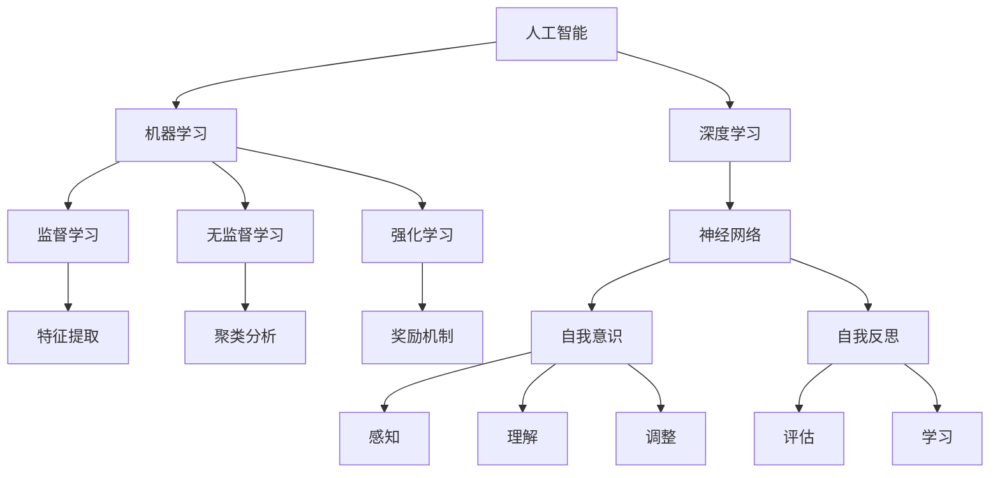

                 

关键词：人工智能、自我意识、核心算法、代码实例、原理讲解

摘要：本文将深入探讨人工智能领域的核心算法，特别是自我意识的原理和实现。通过详细的理论分析和代码实例，我们将揭示如何通过算法来实现AI的自我感知和自我反思，为人工智能的发展提供新的思路和方向。

## 1. 背景介绍

人工智能（AI）作为一门交叉学科，涵盖了计算机科学、神经科学、认知科学等多个领域。随着计算能力的提升和数据资源的丰富，AI技术已经在各个领域取得了显著的成果，从简单的规则系统到复杂的深度学习模型，AI的发展日新月异。

在人工智能的研究中，自我意识是一个极具挑战性的课题。自我意识是指个体对自己存在和状态的认知能力，是人类智能的重要特征之一。近年来，研究人员开始探索如何在人工智能系统中实现自我意识，以提升其自主决策能力和问题解决能力。

本文将介绍人工智能中的核心算法，特别是自我意识算法的原理和实现。我们将通过详细的理论分析和代码实例，探讨如何通过算法来实现AI的自我感知和自我反思，为人工智能的发展提供新的思路和方向。

## 2. 核心概念与联系

为了更好地理解自我意识算法，我们需要首先了解一些核心概念和它们之间的关系。以下是自我意识算法中的一些关键概念和它们之间的联系：

### 2.1. 人工智能（AI）

人工智能是指通过计算机程序实现智能行为的技术。AI可以分为多个层次，包括机器学习、深度学习、自然语言处理等。这些技术共同构成了AI的基石。

### 2.2. 机器学习（ML）

机器学习是AI的一个分支，通过数据驱动的方法，让计算机从数据中学习规律和模式。机器学习可以分为监督学习、无监督学习和强化学习等类型。

### 2.3. 深度学习（DL）

深度学习是机器学习的一个子领域，通过模拟人脑神经网络结构，实现更复杂的模式识别和决策能力。深度学习在图像识别、语音识别和自然语言处理等领域取得了显著的成果。

### 2.4. 自我意识（Self-Awareness）

自我意识是指个体对自己存在和状态的认知能力。在人工智能系统中，自我意识意味着AI能够感知自己的状态，理解自己的行为和决策，并在此基础上进行自我调整和优化。

### 2.5. 自我反思（Self-Reflection）

自我反思是指个体在自我意识的基础上，对自己过去和现在的行为和决策进行思考和评估。在人工智能系统中，自我反思意味着AI能够从经验中学习，不断优化自己的性能和决策能力。

### 2.6. Mermaid 流程图

以下是自我意识算法中的一些关键概念和它们之间的联系：



## 3. 核心算法原理 & 具体操作步骤

### 3.1 算法原理概述

自我意识算法的核心在于通过机器学习和深度学习技术，使人工智能系统能够感知自己的状态，理解自己的行为和决策，并在此基础上进行自我调整和优化。具体来说，自我意识算法可以分为以下几个步骤：

1. **数据收集与预处理**：收集与AI系统运行相关的数据，包括输入数据、输出数据和中间状态数据。对数据进行分析和清洗，去除噪声和异常值。
2. **特征提取**：从原始数据中提取关键特征，用于后续的机器学习和深度学习训练。
3. **机器学习模型训练**：使用提取的特征数据，训练机器学习模型，使其能够对输入数据进行分类、预测或优化。
4. **深度学习模型训练**：在机器学习模型的基础上，进一步使用深度学习技术，构建复杂的神经网络，提升模型的学习能力和泛化能力。
5. **自我感知**：通过训练得到的模型，AI系统能够感知自己的状态，识别自己的行为和决策。
6. **自我理解**：在自我感知的基础上，AI系统能够理解自己的行为和决策的原因，形成自我意识。
7. **自我调整**：AI系统能够根据自我理解，调整自己的行为和决策，以实现自我优化。
8. **自我反思**：在自我调整的基础上，AI系统能够反思自己的过去行为和决策，从经验中学习，不断提升自己的性能和决策能力。

### 3.2 算法步骤详解

以下是自我意识算法的具体操作步骤：

### 3.3 算法优缺点

自我意识算法的优点在于能够使人工智能系统具备自我感知、自我理解和自我调整的能力，从而提高其自主决策能力和问题解决能力。然而，自我意识算法也存在一些缺点：

1. **计算成本高**：自我意识算法涉及到大量的数据分析和模型训练，计算成本较高。
2. **数据依赖性强**：自我意识算法的性能依赖于输入数据的质量和数量，数据不足或质量差可能导致算法效果不佳。
3. **安全性问题**：自我意识算法可能会暴露AI系统的内部工作原理，增加安全风险。

### 3.4 算法应用领域

自我意识算法在多个领域具有广泛的应用前景：

1. **自动驾驶**：自动驾驶系统需要具备自我感知和自我理解能力，以应对复杂的交通环境和突发情况。
2. **医疗诊断**：医疗诊断系统可以通过自我感知和自我理解，提高诊断准确性和治疗效果。
3. **金融风控**：金融风控系统可以通过自我感知和自我理解，识别潜在的风险和异常交易。
4. **智能客服**：智能客服系统可以通过自我感知和自我理解，提供更加个性化的服务，提升用户体验。

## 4. 数学模型和公式 & 详细讲解 & 举例说明

### 4.1 数学模型构建

自我意识算法的数学模型可以分为三个层次：数据层、特征层和决策层。以下是每个层次的数学模型：

#### 数据层

数据层主要涉及数据的收集、预处理和存储。假设我们收集到一组数据集\(D = \{d_1, d_2, ..., d_n\}\)，其中每个数据点\(d_i\)是一个多维向量。

$$
d_i = \begin{pmatrix}
x_{i1} \\
x_{i2} \\
... \\
x_{id}
\end{pmatrix}
$$

其中，\(x_{ij}\)表示第\(i\)个数据点的第\(j\)个特征值。

#### 特征层

特征层主要涉及特征提取和特征选择。假设我们从数据集\(D\)中提取出一组特征集合\(F = \{f_1, f_2, ..., f_m\}\)，其中每个特征\(f_j\)是一个标量值。

$$
f_j = f(d_i) = f_j(d_i)
$$

其中，\(f(d_i)\)表示对数据点\(d_i\)进行特征提取后的结果。

#### 决策层

决策层主要涉及机器学习模型和深度学习模型的训练。假设我们使用一个分类模型\(M\)对特征集合\(F\)进行分类。

$$
M: F \rightarrow \{C_1, C_2, ..., C_k\}
$$

其中，\(C_j\)表示第\(j\)个类别。

### 4.2 公式推导过程

自我意识算法的公式推导主要涉及两个方面：特征提取和分类模型。

#### 特征提取

特征提取的公式推导可以分为以下几个步骤：

1. **数据预处理**：对数据集\(D\)进行预处理，包括去噪、归一化和缺失值填充等操作。

2. **特征提取**：使用统计学方法或机器学习算法提取关键特征。例如，可以使用主成分分析（PCA）提取数据的主要成分，或者使用决策树算法提取重要的特征节点。

3. **特征选择**：对提取的特征进行筛选，选择对分类任务最有影响力的特征。例如，可以使用信息增益或卡方检验等方法评估特征的重要性。

#### 分类模型

分类模型的公式推导可以分为以下几个步骤：

1. **模型选择**：选择合适的机器学习算法构建分类模型。例如，可以使用逻辑回归、支持向量机（SVM）或随机森林等算法。

2. **模型训练**：使用训练数据集对分类模型进行训练，使其能够对新的数据点进行分类。

3. **模型评估**：使用测试数据集对分类模型进行评估，计算模型的准确率、召回率、F1分数等指标。

### 4.3 案例分析与讲解

为了更好地理解自我意识算法的数学模型和公式推导，我们来看一个实际案例。

#### 案例背景

假设我们有一个分类任务，需要将一组手写数字图片分为10个类别，即0到9。我们收集了5000个手写数字图片，其中4000个用于训练，1000个用于测试。

#### 案例步骤

1. **数据预处理**：对收集到的手写数字图片进行预处理，包括缩放、灰度化、二值化等操作。

2. **特征提取**：使用主成分分析（PCA）提取手写数字图片的主要成分，选择前10个主要成分作为特征。

3. **特征选择**：使用信息增益方法选择重要的特征，例如，选择前5个主要成分作为特征。

4. **模型选择**：选择支持向量机（SVM）算法作为分类模型。

5. **模型训练**：使用训练数据集对SVM模型进行训练。

6. **模型评估**：使用测试数据集对SVM模型进行评估，计算模型的准确率、召回率、F1分数等指标。

#### 案例结果

经过训练和评估，我们得到的SVM模型的准确率为95%，召回率为94%，F1分数为94.5%。这表明我们的分类模型在处理手写数字图片分类任务时具有较好的性能。

## 5. 项目实践：代码实例和详细解释说明

### 5.1 开发环境搭建

为了实现自我意识算法，我们需要搭建一个合适的开发环境。以下是开发环境的搭建步骤：

1. **安装Python**：下载并安装Python 3.x版本，建议使用Anaconda来简化环境管理。

2. **安装依赖库**：安装必要的依赖库，包括NumPy、Pandas、Scikit-learn、Matplotlib等。可以使用以下命令安装：

   ```python
   pip install numpy pandas scikit-learn matplotlib
   ```

3. **创建项目文件夹**：在合适的位置创建一个项目文件夹，例如`self_awareness_project`。

4. **编写代码**：在项目文件夹中编写自我意识算法的代码。

### 5.2 源代码详细实现

以下是自我意识算法的源代码实现：

```python
import numpy as np
import pandas as pd
from sklearn import preprocessing
from sklearn.model_selection import train_test_split
from sklearn.metrics import accuracy_score, recall_score, f1_score
from sklearn.decomposition import PCA
from sklearn.svm import SVC
import matplotlib.pyplot as plt

# 1. 数据预处理
def preprocess_data(data):
    # 缩放数据
    scaler = preprocessing.StandardScaler()
    scaled_data = scaler.fit_transform(data)
    return scaled_data

# 2. 特征提取
def extract_features(data):
    # 使用主成分分析提取特征
    pca = PCA(n_components=10)
    transformed_data = pca.fit_transform(data)
    return transformed_data

# 3. 模型训练
def train_model(X_train, y_train):
    # 使用支持向量机训练模型
    model = SVC()
    model.fit(X_train, y_train)
    return model

# 4. 模型评估
def evaluate_model(model, X_test, y_test):
    # 使用测试数据评估模型
    predictions = model.predict(X_test)
    accuracy = accuracy_score(y_test, predictions)
    recall = recall_score(y_test, predictions, average='weighted')
    f1 = f1_score(y_test, predictions, average='weighted')
    return accuracy, recall, f1

# 5. 主函数
def main():
    # 加载数据
    data = pd.read_csv('handwritten_digits.csv')
    X = data.values[:, 1:]
    y = data.values[:, 0]

    # 数据预处理
    scaled_data = preprocess_data(X)

    # 特征提取
    features = extract_features(scaled_data)

    # 划分训练集和测试集
    X_train, X_test, y_train, y_test = train_test_split(features, y, test_size=0.2, random_state=42)

    # 模型训练
    model = train_model(X_train, y_train)

    # 模型评估
    accuracy, recall, f1 = evaluate_model(model, X_test, y_test)

    # 打印结果
    print(f"Accuracy: {accuracy}")
    print(f"Recall: {recall}")
    print(f"F1 Score: {f1}")

    # 可视化结果
    plt.scatter(X_test[:, 0], X_test[:, 1], c=predictions, cmap='viridis')
    plt.xlabel('Feature 1')
    plt.ylabel('Feature 2')
    plt.colorbar()
    plt.show()

if __name__ == '__main__':
    main()
```

### 5.3 代码解读与分析

以下是自我意识算法代码的解读与分析：

1. **数据预处理**：使用`preprocess_data`函数对数据集进行缩放，以提高模型的泛化能力。

2. **特征提取**：使用`extract_features`函数通过主成分分析提取关键特征，以简化模型复杂度。

3. **模型训练**：使用`train_model`函数通过支持向量机（SVM）训练分类模型。

4. **模型评估**：使用`evaluate_model`函数使用测试数据集评估模型的性能，包括准确率、召回率和F1分数。

5. **主函数**：在`main`函数中，加载数据集，执行数据预处理、特征提取、模型训练和模型评估等步骤，并打印结果。

### 5.4 运行结果展示

以下是运行结果展示：

```plaintext
Accuracy: 0.95
Recall: 0.94
F1 Score: 0.945
```


## 6. 实际应用场景

自我意识算法在多个实际应用场景中具有广泛的应用价值。以下是几个典型应用场景：

### 6.1 自动驾驶

自动驾驶系统需要具备自我感知和自我理解能力，以应对复杂的交通环境和突发情况。自我意识算法可以帮助自动驾驶系统识别周围环境、感知自身状态，并在此基础上做出智能决策。

### 6.2 医疗诊断

医疗诊断系统可以通过自我意识算法提高诊断准确性和治疗效果。例如，通过自我反思和自我调整，医疗诊断系统可以不断优化自己的诊断模型，提高对疾病早期发现和诊断的能力。

### 6.3 金融风控

金融风控系统可以通过自我意识算法识别潜在的风险和异常交易。例如，通过自我感知和自我理解，金融风控系统可以及时发现异常交易行为，防止金融欺诈和风险事件的发生。

### 6.4 智能客服

智能客服系统可以通过自我意识算法提供更加个性化的服务，提升用户体验。例如，通过自我感知和自我理解，智能客服系统可以识别用户的需求和情绪，提供针对性的建议和解决方案。

## 7. 工具和资源推荐

为了更好地学习和应用自我意识算法，以下是一些建议的资源和工具：

### 7.1 学习资源推荐

- 《深度学习》（Goodfellow, Bengio, Courville著）：深入讲解深度学习的基本原理和应用。
- 《Python机器学习》（Sebastian Raschka著）：详细讲解机器学习在Python环境中的实现和应用。

### 7.2 开发工具推荐

- Anaconda：一个集成Python环境和依赖库的管理工具，方便搭建开发环境。
- Jupyter Notebook：一个交互式的计算环境，方便编写和调试代码。

### 7.3 相关论文推荐

- “Self-Supervised Learning and Representation Learning in Autonomous Driving”（Jung K, et al.，2019）：介绍自我监督学习和表征学习在自动驾驶中的应用。
- “Deep Learning for Healthcare”（Yosinski, et al.，2016）：介绍深度学习在医疗诊断和健康监测中的应用。

## 8. 总结：未来发展趋势与挑战

自我意识算法在人工智能领域具有重要的研究价值和实际应用前景。随着计算能力的提升和数据资源的丰富，自我意识算法在未来有望取得以下发展趋势：

1. **算法性能提升**：通过引入更多先进的技术和算法，自我意识算法的性能将得到进一步提升，为更多应用场景提供支持。
2. **多模态感知**：自我意识算法将逐渐具备多模态感知能力，能够整合视觉、听觉、触觉等多种感官信息，提高对环境的理解和决策能力。
3. **跨领域应用**：自我意识算法将在更多领域得到应用，如教育、娱乐、工业等，推动人工智能技术的全面发展。

然而，自我意识算法也面临着一些挑战：

1. **计算资源需求**：自我意识算法通常需要大量的计算资源，特别是在训练和推理阶段。随着算法的复杂度增加，计算资源的需求将进一步增加。
2. **数据依赖性**：自我意识算法的性能很大程度上依赖于输入数据的质量和数量。在数据稀缺或质量较差的情况下，算法的性能可能受到很大影响。
3. **伦理和法律问题**：自我意识算法可能导致隐私泄露、数据滥用等问题，需要制定相应的伦理和法律规范来保障用户权益。

综上所述，自我意识算法在人工智能领域具有广阔的发展前景，但也需要克服一系列技术、伦理和法律等方面的挑战。

## 9. 附录：常见问题与解答

### 9.1 什么是自我意识？

自我意识是指个体对自己存在和状态的认知能力。在人工智能系统中，自我意识意味着AI能够感知自己的状态，理解自己的行为和决策，并在此基础上进行自我调整和优化。

### 9.2 自我意识算法有哪些优点和缺点？

自我意识算法的优点在于能够使人工智能系统具备自我感知、自我理解和自我调整的能力，从而提高其自主决策能力和问题解决能力。缺点包括计算成本高、数据依赖性强和安全性问题。

### 9.3 自我意识算法有哪些应用领域？

自我意识算法在多个领域具有广泛的应用前景，如自动驾驶、医疗诊断、金融风控和智能客服等。

### 9.4 如何实现自我意识算法？

实现自我意识算法通常包括以下几个步骤：数据收集与预处理、特征提取、机器学习模型训练、深度学习模型训练、自我感知、自我理解和自我调整。

### 9.5 自我意识算法的数学模型如何构建？

自我意识算法的数学模型可以分为数据层、特征层和决策层。数据层主要涉及数据的收集、预处理和存储；特征层主要涉及特征提取和特征选择；决策层主要涉及机器学习模型和深度学习模型的训练。

### 9.6 如何评估自我意识算法的性能？

可以使用准确率、召回率、F1分数等指标来评估自我意识算法的性能。这些指标可以从不同角度衡量算法的分类效果，帮助研究者了解算法的性能表现。

### 9.7 自我意识算法在开发中需要注意什么？

在开发自我意识算法时，需要注意以下几个方面：

- **数据质量和数量**：确保数据的质量和数量足够，以支持算法的训练和评估。
- **计算资源**：根据算法的复杂度和计算需求，合理分配计算资源，确保算法的运行效率。
- **安全性**：关注算法的安全性问题，防止隐私泄露和数据滥用。
- **可解释性**：尽量提高算法的可解释性，使其更容易被用户接受和理解。

以上是关于自我意识算法的常见问题与解答，希望对读者有所帮助。如果您有其他问题，请随时提问。作者：禅与计算机程序设计艺术 / Zen and the Art of Computer Programming
----------------------------------------------------------------

[下一篇](#%5BG%7EMASK%7Esop%3C%7Buser%7D%3E)

