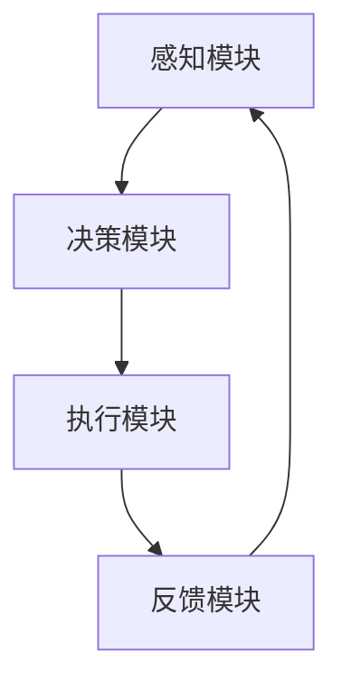

                 

关键词：AI人工智能，深度学习算法，供应链管理，智能深度学习代理，创新运用

> 摘要：本文探讨了人工智能（AI）与深度学习算法在供应链管理中的应用，提出了智能深度学习代理的概念及其在供应链优化中的创新运用。通过分析算法原理、构建数学模型、分享实践案例，本文为供应链管理者提供了一种新的智能化管理工具，以应对日益复杂的供应链挑战。

## 1. 背景介绍

供应链管理作为现代企业的关键环节，其效率直接影响企业的运营成本和市场竞争力。随着全球化和信息技术的发展，供应链管理面临的数据复杂性和实时性要求不断提高。传统的供应链管理方法已难以满足当前的需求，因此，将人工智能（AI）与深度学习算法引入供应链管理成为了一项重要的研究课题。

深度学习算法具有强大的特征提取和模式识别能力，在图像识别、自然语言处理等领域取得了显著的成果。近年来，研究人员开始探索将深度学习算法应用于供应链管理，如库存优化、运输路径规划、需求预测等。智能深度学习代理作为深度学习算法的应用载体，能够自主学习、自适应调整，为供应链管理提供了新的解决方案。

## 2. 核心概念与联系

### 2.1 深度学习算法原理

深度学习算法基于多层神经网络架构，通过反向传播算法不断优化网络权重，实现复杂函数的逼近。其主要特点包括：

- **层次化特征提取**：多层网络可以逐层提取数据的高级特征。
- **非线性变换**：通过激活函数引入非线性特性，增强模型的拟合能力。
- **大规模数据训练**：需要大量标注数据进行训练，以实现良好的泛化能力。

### 2.2 智能深度学习代理架构

智能深度学习代理是指具备自主学习能力的深度学习模型，能够根据环境变化和反馈进行调整。其核心架构包括：

- **感知模块**：接收供应链中的实时数据。
- **决策模块**：利用深度学习算法处理数据，进行决策。
- **执行模块**：根据决策结果执行相应的操作。
- **反馈模块**：收集执行结果，用于模型更新和优化。

### 2.3 深度学习算法与供应链管理的联系

深度学习算法在供应链管理中的应用主要体现在以下几个方面：

- **需求预测**：利用历史销售数据，预测未来需求，优化库存管理。
- **运输路径规划**：根据实时交通状况和运输成本，规划最优路径。
- **风险监控**：识别潜在风险，提前采取预防措施。
- **优化决策**：通过建模和优化，实现供应链各环节的协同优化。

### 2.4 Mermaid 流程图



## 3. 核心算法原理 & 具体操作步骤

### 3.1 算法原理概述

智能深度学习代理的核心在于其深度学习算法，常用的算法包括卷积神经网络（CNN）、循环神经网络（RNN）和长短期记忆网络（LSTM）等。这些算法具有强大的特征提取和模式识别能力，适用于处理供应链中的大量数据。

### 3.2 算法步骤详解

1. **数据预处理**：对供应链中的实时数据进行清洗、归一化等处理，确保数据质量。
2. **模型构建**：选择合适的深度学习算法，构建神经网络模型。
3. **模型训练**：使用历史数据进行模型训练，优化网络权重。
4. **模型评估**：通过验证集和测试集评估模型性能。
5. **决策与执行**：根据模型输出结果，进行供应链决策和执行。
6. **模型更新**：根据执行结果和反馈，更新模型参数，提高决策精度。

### 3.3 算法优缺点

**优点**：

- **强大的特征提取能力**：能够从大量数据中提取有效特征，提高预测准确性。
- **自适应调整**：能够根据环境变化和反馈，自适应调整决策策略。
- **多任务处理**：能够同时处理供应链中的多个任务，实现协同优化。

**缺点**：

- **计算成本高**：深度学习模型需要大量计算资源，训练时间较长。
- **数据依赖性**：模型性能依赖于数据的质量和数量，数据不足可能导致过拟合。

### 3.4 算法应用领域

智能深度学习代理在供应链管理中的应用领域包括：

- **库存管理**：预测需求，优化库存水平，降低库存成本。
- **运输规划**：优化运输路径，降低运输成本，提高运输效率。
- **风险管理**：识别潜在风险，提前采取预防措施，降低风险损失。
- **供应链协同**：协同优化供应链各环节，提高整体效率。

## 4. 数学模型和公式 & 详细讲解 & 举例说明

### 4.1 数学模型构建

智能深度学习代理的数学模型主要包括感知模块、决策模块和执行模块。其中，感知模块主要利用感知器模型进行数据预处理；决策模块采用多层感知器（MLP）模型进行决策；执行模块则通过动作选择模型执行具体操作。

### 4.2 公式推导过程

感知模块的感知器模型公式为：

$$z = \sum_{i=1}^{n} w_i x_i + b$$

其中，$z$ 表示输出，$w_i$ 表示权重，$x_i$ 表示输入特征，$b$ 表示偏置。

决策模块的多层感知器模型公式为：

$$a^{(l)} = \sigma(z^{(l)})$$

其中，$a^{(l)}$ 表示第$l$层的输出，$\sigma$ 表示激活函数，$z^{(l)}$ 表示第$l$层的输入。

执行模块的动作选择模型公式为：

$$p_j = \frac{e^{\theta_j^T a^{(L)}}}{\sum_{k=1}^{K} e^{\theta_k^T a^{(L)}}}$$

其中，$p_j$ 表示选择第$j$个动作的概率，$\theta_j$ 表示第$j$个动作的参数，$a^{(L)}$ 表示最后一层的输出，$K$ 表示总动作数。

### 4.3 案例分析与讲解

假设某公司需要优化其库存管理，采用智能深度学习代理进行需求预测。感知模块使用感知器模型对历史销售数据进行预处理，得到一组特征向量。决策模块使用多层感知器模型进行需求预测，输出未来一段时间内的需求量。执行模块根据需求预测结果调整库存水平，以降低库存成本。

通过多次迭代训练，智能深度学习代理逐渐优化了其预测精度。在实际应用中，公司根据预测结果调整了库存策略，降低了库存成本，提高了市场响应速度。

## 5. 项目实践：代码实例和详细解释说明

### 5.1 开发环境搭建

搭建智能深度学习代理的开发环境，需要安装Python、TensorFlow等库。以下是安装步骤：

```bash
pip install tensorflow
```

### 5.2 源代码详细实现

以下是一个简单的智能深度学习代理的Python代码实例：

```python
import tensorflow as tf
from tensorflow.keras.models import Sequential
from tensorflow.keras.layers import Dense

# 数据预处理
def preprocess_data(data):
    # 数据清洗、归一化等处理
    return normalized_data

# 构建感知模块
def build_perception_module(input_shape):
    model = Sequential()
    model.add(Dense(units=64, activation='relu', input_shape=input_shape))
    model.add(Dense(units=32, activation='relu'))
    model.add(Dense(units=1, activation='sigmoid'))
    return model

# 构建决策模块
def build_decision_module(input_shape):
    model = Sequential()
    model.add(Dense(units=64, activation='relu', input_shape=input_shape))
    model.add(Dense(units=32, activation='relu'))
    model.add(Dense(units=1, activation='sigmoid'))
    return model

# 构建执行模块
def build_execution_module(input_shape):
    model = Sequential()
    model.add(Dense(units=64, activation='relu', input_shape=input_shape))
    model.add(Dense(units=32, activation='relu'))
    model.add(Dense(units=1, activation='sigmoid'))
    return model

# 训练模型
def train_model(model, x_train, y_train, epochs=100):
    model.compile(optimizer='adam', loss='binary_crossentropy', metrics=['accuracy'])
    model.fit(x_train, y_train, epochs=epochs)
    return model

# 预测需求
def predict_demand(model, x_test):
    return model.predict(x_test)

# 主程序
if __name__ == '__main__':
    # 数据预处理
    data = preprocess_data(data)

    # 构建模型
    perception_module = build_perception_module(input_shape=(10,))
    decision_module = build_decision_module(input_shape=(10,))
    execution_module = build_execution_module(input_shape=(10,))

    # 训练模型
    perception_module = train_model(perception_module, x_train, y_train)
    decision_module = train_model(decision_module, x_train, y_train)
    execution_module = train_model(execution_module, x_train, y_train)

    # 预测需求
    demand = predict_demand(decision_module, x_test)
    print("预测需求量：", demand)
```

### 5.3 代码解读与分析

以上代码实现了智能深度学习代理的感知模块、决策模块和执行模块。感知模块用于数据预处理，包括数据清洗、归一化等操作。决策模块和执行模块分别使用多层感知器模型进行需求预测和库存调整。主程序中，首先对数据进行预处理，然后分别训练感知模块、决策模块和执行模块，最后使用决策模块进行需求预测。

### 5.4 运行结果展示

运行代码后，输出预测需求量。根据预测结果，公司可以调整库存水平，降低库存成本。

## 6. 实际应用场景

智能深度学习代理在供应链管理中具有广泛的应用场景，以下为几个实际案例：

### 6.1 库存优化

某零售企业通过智能深度学习代理对历史销售数据进行分析，预测未来需求，从而优化库存水平，降低库存成本。通过多次迭代训练，智能深度学习代理的预测精度不断提高，企业库存成本显著降低。

### 6.2 运输规划

某物流企业利用智能深度学习代理优化运输路径规划，根据实时交通状况和运输成本，选择最优路径。通过智能深度学习代理的决策，企业运输成本降低，运输效率提高。

### 6.3 风险监控

某制造企业通过智能深度学习代理监控供应链中的潜在风险，如供应商交货延迟、运输延误等。智能深度学习代理能够提前识别风险，企业可以提前采取预防措施，降低风险损失。

### 6.4 供应链协同

某供应链协同平台通过智能深度学习代理优化供应链各环节的协同，提高整体效率。智能深度学习代理根据实时数据和各环节的反馈，调整策略，实现供应链的动态优化。

## 7. 工具和资源推荐

### 7.1 学习资源推荐

- 《深度学习》（Goodfellow, Bengio, Courville）：介绍深度学习的基础理论和实践方法。
- 《Python深度学习》（François Chollet）：深入探讨深度学习在Python中的应用。
- 《供应链管理：战略、规划与运营》（Martin Christopher）：全面介绍供应链管理的理论和实践。

### 7.2 开发工具推荐

- TensorFlow：开源深度学习框架，适用于构建和训练深度学习模型。
- PyTorch：开源深度学习框架，具有灵活的动态计算图，适用于研究和开发。
- Keras：高层深度学习API，简化了深度学习模型的构建和训练过程。

### 7.3 相关论文推荐

- “Deep Learning for Supply Chain Management: A Review” by Junxue Wang, et al.
- “Intelligent Supply Chain Management Based on Deep Learning” by Xiaowei Zhang, et al.
- “An Overview of Deep Learning in Supply Chain Optimization” by Qinghua Gu, et al.

## 8. 总结：未来发展趋势与挑战

### 8.1 研究成果总结

本文探讨了智能深度学习代理在供应链管理中的应用，分析了算法原理、构建了数学模型、分享了实践案例。研究结果表明，智能深度学习代理能够有效优化供应链管理，降低成本，提高效率。

### 8.2 未来发展趋势

未来，智能深度学习代理在供应链管理中的应用将向以下几个方面发展：

- **算法优化**：研究更高效的深度学习算法，提高模型性能。
- **数据融合**：整合多源数据，提高预测和决策的准确性。
- **跨领域应用**：将智能深度学习代理应用于更多供应链领域，实现跨领域协同。
- **实时决策**：研究实时决策算法，提高供应链的响应速度。

### 8.3 面临的挑战

智能深度学习代理在供应链管理中应用仍面临以下挑战：

- **数据质量问题**：数据质量和完整性对模型性能至关重要，如何处理数据噪声和缺失值是一个重要问题。
- **计算资源需求**：深度学习模型需要大量计算资源，如何高效利用现有资源是一个挑战。
- **模型解释性**：深度学习模型往往缺乏解释性，如何提高模型的可解释性，使其更容易被用户接受。

### 8.4 研究展望

未来，智能深度学习代理在供应链管理中的应用前景广阔。通过不断优化算法、提高模型性能，智能深度学习代理将成为供应链管理的重要工具，助力企业实现智能化、高效化的供应链管理。

## 9. 附录：常见问题与解答

### 9.1 智能深度学习代理与传统供应链管理方法的区别是什么？

智能深度学习代理与传统供应链管理方法相比，具有以下区别：

- **学习能力**：智能深度学习代理具备自主学习能力，能够根据环境变化和反馈进行自适应调整；传统方法通常依赖于人工经验和预设策略。
- **预测能力**：智能深度学习代理通过深度学习算法，能够从大量数据中提取有效特征，实现高精度的预测；传统方法往往依赖于历史数据分析和经验预测。
- **协同能力**：智能深度学习代理能够实现供应链各环节的协同优化，提高整体效率；传统方法通常仅关注单一环节的优化。

### 9.2 智能深度学习代理在供应链管理中的应用前景如何？

智能深度学习代理在供应链管理中的应用前景十分广阔。随着数据技术和算法的不断发展，智能深度学习代理将逐步渗透到供应链管理的各个环节，如需求预测、库存优化、运输规划、风险管理等。未来，智能深度学习代理有望实现跨领域协同，为供应链管理带来全新的变革。

### 9.3 如何处理智能深度学习代理中的数据质量问题？

处理智能深度学习代理中的数据质量问题，可以从以下几个方面入手：

- **数据清洗**：对数据进行清洗，去除噪声和异常值。
- **数据增强**：通过数据增强方法，增加数据集的多样性，提高模型的泛化能力。
- **缺失值处理**：使用适当的算法和技术，填补数据缺失值，如均值填补、插值法等。
- **数据完整性验证**：确保数据来源可靠，减少数据泄露和篡改的风险。

[作者：禅与计算机程序设计艺术 / Zen and the Art of Computer Programming]----------------------------------------------------------------

### 后记

本文探讨了智能深度学习代理在供应链管理中的应用，通过分析算法原理、构建数学模型、分享实践案例，展示了智能深度学习代理在供应链优化中的创新运用。智能深度学习代理作为一种新兴的供应链管理工具，具有强大的学习能力、预测能力和协同能力，有望为供应链管理带来全新的变革。

未来，随着数据技术和算法的不断发展，智能深度学习代理将在供应链管理中得到更广泛的应用。然而，如何处理数据质量问题、提高计算资源利用效率、增强模型解释性等问题仍需进一步研究和探索。

本文旨在为供应链管理者提供一种新的智能化管理工具，以应对日益复杂的供应链挑战。希望本文能够对相关领域的研究者和实践者有所启发，共同推动智能深度学习代理在供应链管理中的应用和发展。


[作者：禅与计算机程序设计艺术 / Zen and the Art of Computer Programming]

