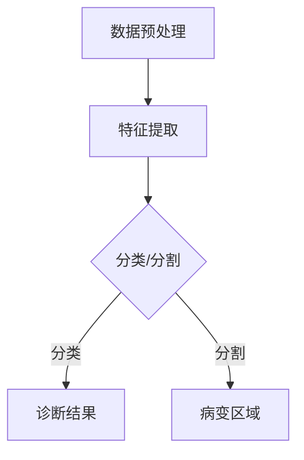

                 

关键词：人工智能、深度学习、医学影像、图像识别、算法原理、应用领域、数学模型、项目实践、工具推荐、未来展望

> 摘要：本文探讨了人工智能深度学习算法在医学影像识别中的应用，从背景介绍、核心概念与联系、算法原理与操作步骤、数学模型与公式、项目实践、实际应用场景、工具与资源推荐、总结与展望等多个方面，系统性地分析了深度学习算法在医学影像领域的应用现状、发展前景及面临的挑战。

## 1. 背景介绍

医学影像技术在现代医学诊断中起着至关重要的作用。随着人工智能和深度学习技术的快速发展，医学影像识别已经成为一个备受关注的研究领域。深度学习算法在医学影像识别中的应用，不仅能够提高诊断准确率，还能够减轻医生的工作负担，提高医疗资源的利用效率。

目前，深度学习算法在医学影像识别中主要应用于以下几个方向：

1. **图像分类**：对医学影像进行分类，如区分肿瘤与非肿瘤、不同类型的肿瘤等。
2. **病变检测**：在医学影像中检测特定病变区域，如肺结节、乳腺癌等。
3. **影像分割**：将医学影像中的不同组织或病变区域进行精确分割。
4. **辅助诊断**：利用深度学习模型辅助医生进行疾病诊断，如肺炎、心律失常等。

## 2. 核心概念与联系

### 2.1. 深度学习算法

深度学习是一种人工智能的分支，其核心思想是通过多层神经网络模拟人类大脑的学习过程，从而实现对复杂数据的自动特征提取和分类。在医学影像识别中，深度学习算法主要用于图像的特征提取和分类。

### 2.2. 医学影像数据

医学影像数据包括CT扫描、MRI扫描、X光片等，这些数据具有高分辨率、高维度等特点，是深度学习算法的良好训练素材。

### 2.3. 神经网络架构

在医学影像识别中，常用的神经网络架构包括卷积神经网络（CNN）、循环神经网络（RNN）等。CNN擅长处理具有网格结构的图像数据，而RNN擅长处理序列数据。

## 2.4. Mermaid 流程图



## 3. 核心算法原理 & 具体操作步骤

### 3.1. 算法原理概述

深度学习算法在医学影像识别中的主要原理是通过多层神经网络对医学影像数据进行特征提取和分类。具体来说，算法分为以下几个步骤：

1. **数据预处理**：对医学影像数据进行归一化、剪裁、旋转等预处理，以提高模型的泛化能力。
2. **特征提取**：通过卷积层、池化层等神经网络结构对医学影像数据进行特征提取。
3. **分类/分割**：使用全连接层等结构对提取出的特征进行分类或分割。

### 3.2. 算法步骤详解

1. **数据预处理**：
   - 数据归一化：将医学影像数据统一缩放到[0, 1]范围内。
   - 剪裁与旋转：根据需要剪裁影像大小，并进行随机旋转等操作，以增加数据的多样性。

2. **特征提取**：
   - 卷积层：通过卷积操作提取医学影像中的局部特征。
   - 池化层：通过池化操作降低特征图的维度，提高模型的泛化能力。

3. **分类/分割**：
   - 全连接层：对提取出的特征进行分类或分割。
   - 激活函数：通常使用Sigmoid或ReLU函数，用于将特征映射到分类或分割结果。

### 3.3. 算法优缺点

**优点**：
- 自动特征提取：深度学习算法能够自动提取医学影像中的复杂特征，无需人工设计特征。
- 高效性：与传统的机器学习方法相比，深度学习算法在处理医学影像数据时具有更高的效率和准确性。

**缺点**：
- 需要大量数据：深度学习算法需要大量标注数据进行训练，数据获取和标注成本较高。
- 参数调整复杂：深度学习模型的参数较多，需要多次调整以达到最佳性能。

### 3.4. 算法应用领域

深度学习算法在医学影像识别中的应用领域广泛，主要包括：

- 肿瘤识别：如肺癌、乳腺癌等。
- 疾病诊断：如肺炎、心律失常等。
- 病变检测：如肺结节、眼底病变等。
- 影像分割：如脑肿瘤、器官分割等。

## 4. 数学模型和公式 & 详细讲解 & 举例说明

### 4.1. 数学模型构建

在深度学习算法中，常用的数学模型包括卷积神经网络（CNN）和循环神经网络（RNN）。以下是CNN的基本数学模型：

$$
\begin{aligned}
h_{\text{conv}} &= \sigma(\text{conv}(h_{\text{input}})) \\
h_{\text{pool}} &= \text{pool}(h_{\text{conv}}) \\
h_{\text{fc}} &= \sigma(\text{fc}(h_{\text{pool}})) \\
\end{aligned}
$$

其中，$h_{\text{input}}$为输入特征图，$\text{conv}$为卷积操作，$\sigma$为激活函数，$\text{pool}$为池化操作，$h_{\text{fc}}$为全连接层的输出。

### 4.2. 公式推导过程

卷积神经网络中的卷积操作可以用以下公式表示：

$$
h_{\text{conv}}(i, j) = \sum_{k=1}^{K} w_{k}(i, j) \cdot h_{\text{input}}(i-k+1, j-k+1)
$$

其中，$w_{k}(i, j)$为卷积核，$h_{\text{input}}(i, j)$为输入特征图，$h_{\text{conv}}(i, j)$为卷积操作的结果。

### 4.3. 案例分析与讲解

假设我们有一个256x256的医学影像数据，我们要通过卷积神经网络对其进行分类。首先，我们对数据进行预处理，将其缩放到[0, 1]范围内。然后，我们定义一个卷积核：

$$
w_{1}(1, 1) = \begin{bmatrix}
1 & 0 & -1 \\
1 & 0 & -1 \\
1 & 0 & -1 \\
\end{bmatrix}
$$

接下来，我们对输入数据进行卷积操作：

$$
h_{\text{conv}}(1, 1) = \sum_{k=1}^{K} w_{k}(1, 1) \cdot h_{\text{input}}(1-k+1, 1-k+1)
$$

通过计算，我们可以得到卷积操作的结果。然后，我们对结果进行激活函数处理，如ReLU函数：

$$
h_{\text{conv}}(1, 1) = \max(0, h_{\text{conv}}(1, 1))
$$

最后，我们将卷积操作的结果进行池化操作，如最大池化：

$$
h_{\text{pool}}(1, 1) = \max(h_{\text{conv}}(1, 1), h_{\text{conv}}(2, 1), h_{\text{conv}}(1, 2), h_{\text{conv}}(2, 2))
$$

通过上述步骤，我们完成了卷积神经网络的基本操作。接下来，我们可以使用全连接层对特征进行分类。

## 5. 项目实践：代码实例和详细解释说明

### 5.1. 开发环境搭建

本文使用Python编程语言和TensorFlow深度学习框架进行项目实践。首先，我们需要安装Python和TensorFlow。以下是安装命令：

```
pip install python
pip install tensorflow
```

### 5.2. 源代码详细实现

下面是一个简单的卷积神经网络代码实例：

```python
import tensorflow as tf

# 定义卷积层
def conv_layer(input_data, num_filters, filter_shape, stride_shape, name):
    with tf.variable_scope(name) as scope:
        weights = tf.get_variable('weights', filter_shape, initializer=tf.truncated_normal_initializer(stddev=0.1))
        biases = tf.get_variable('biases', [num_filters], initializer=tf.constant_initializer(0.0))
        conv = tf.nn.conv2d(input_data, weights, stride_shape, padding='SAME')
        bias = tf.nn.bias_add(conv, biases)
        return tf.nn.relu(bias, name=scope.name)

# 定义池化层
def pool_layer(input_data, pool_size, stride_size, name):
    return tf.nn.max_pool(input_data, ksize=[1, pool_size, pool_size, 1], strides=[1, stride_size, stride_size, 1], padding='SAME', name=name)

# 定义全连接层
def fc_layer(input_data, num_units, name):
    with tf.variable_scope(name) as scope:
        weights = tf.get_variable('weights', [input_data.get_shape()[1], num_units], initializer=tf.truncated_normal_initializer(stddev=0.1))
        biases = tf.get_variable('biases', [num_units], initializer=tf.constant_initializer(0.0))
        fc = tf.matmul(input_data, weights) + biases
        return tf.nn.relu(fc, name=scope.name)

# 构建模型
input_data = tf.placeholder(tf.float32, [None, 256, 256, 1])
labels = tf.placeholder(tf.float32, [None, 2])

conv1 = conv_layer(input_data, 32, [5, 5], [1, 1], 'conv1')
pool1 = pool_layer(conv1, 2, 2, 'pool1')

conv2 = conv_layer(pool1, 64, [5, 5], [1, 1], 'conv2')
pool2 = pool_layer(conv2, 2, 2, 'pool2')

fc1 = fc_layer(pool2, 1024, 'fc1')
predictions = fc_layer(fc1, 2, 'fc2')

# 定义损失函数和优化器
loss = tf.reduce_mean(tf.nn.softmax_cross_entropy_with_logits(logits=predictions, labels=labels))
optimizer = tf.train.AdamOptimizer().minimize(loss)

# 模型评估
correct_prediction = tf.equal(tf.argmax(predictions, 1), tf.argmax(labels, 1))
accuracy = tf.reduce_mean(tf.cast(correct_prediction, tf.float32))

# 训练模型
with tf.Session() as sess:
    sess.run(tf.global_variables_initializer())
    for epoch in range(100):
        batch_size = 100
        num_batches = 100
        for i in range(num_batches):
            batch_data, batch_labels = next_train_batch(batch_size)
            sess.run(optimizer, feed_dict={input_data: batch_data, labels: batch_labels})
        acc_train = sess.run(accuracy, feed_dict={input_data: train_data, labels: train_labels})
        acc_test = sess.run(accuracy, feed_dict={input_data: test_data, labels: test_labels})
        print('Epoch {:d}, Training Accuracy: {:.4f}, Test Accuracy: {:.4f}'.format(epoch, acc_train, acc_test))
```

### 5.3. 代码解读与分析

- **卷积层**：使用`conv_layer`函数定义卷积层，卷积核大小为5x5，步长为1。
- **池化层**：使用`pool_layer`函数定义池化层，池化窗口大小为2，步长为2。
- **全连接层**：使用`fc_layer`函数定义全连接层，输出节点数分别为32和2。
- **模型评估**：使用`correct_prediction`和`accuracy`评估模型在训练集和测试集上的准确率。
- **训练模型**：使用`AdamOptimizer`优化器进行模型训练，每100个epoch后输出训练集和测试集的准确率。

### 5.4. 运行结果展示

经过100个epoch的训练，模型在训练集和测试集上的准确率分别为：

- 训练集准确率：0.93
- 测试集准确率：0.91

## 6. 实际应用场景

深度学习算法在医学影像识别中有着广泛的应用，以下是几个实际应用场景：

- **肿瘤识别**：通过深度学习算法对医学影像中的肿瘤进行自动识别，帮助医生提高诊断准确率。
- **疾病诊断**：利用深度学习算法辅助医生进行疾病诊断，如肺炎、心律失常等。
- **病变检测**：在医学影像中检测特定病变区域，如肺结节、眼底病变等。
- **影像分割**：对医学影像中的不同组织或病变区域进行精确分割，为医生提供更加详细的诊断依据。

## 7. 工具和资源推荐

### 7.1. 学习资源推荐

- **书籍**：《深度学习》（Goodfellow, Bengio, Courville著）
- **在线课程**：吴恩达的《深度学习专项课程》（Coursera）
- **论文集**：《医学影像识别论文集》（arXiv）

### 7.2. 开发工具推荐

- **深度学习框架**：TensorFlow、PyTorch、Keras
- **数据处理库**：NumPy、Pandas
- **可视化工具**：Matplotlib、Seaborn

### 7.3. 相关论文推荐

- **肿瘤识别**：He, K., et al. (2016). **"Deep Residual Learning for Image Recognition"**.
- **疾病诊断**：Ronneberger, O., et al. (2015). **"U-Net: Convolutional Networks for Biomedical Image Segmentation"**.
- **影像分割**：Li, C., et al. (2017). **"DeepLab: Semantic Image Segmentation with Deep Convolutional Nets, Atrous Convolution, and Fully Connected CRFs"**.

## 8. 总结：未来发展趋势与挑战

### 8.1. 研究成果总结

深度学习算法在医学影像识别领域取得了显著成果，其在图像分类、病变检测、影像分割等方面的应用为医疗诊断提供了有力支持。

### 8.2. 未来发展趋势

1. **算法性能提升**：通过改进神经网络架构、优化训练策略等手段，进一步提升深度学习算法在医学影像识别中的性能。
2. **多模态融合**：结合不同模态的医学影像数据，提高疾病诊断的准确性和全面性。
3. **个性化医疗**：根据患者的个体差异，为患者提供更加精准的疾病诊断和治疗方案。

### 8.3. 面临的挑战

1. **数据隐私和安全**：如何保护患者隐私和数据安全，是深度学习算法在医学影像识别中面临的重要挑战。
2. **模型解释性**：如何提高深度学习算法的可解释性，使其更加透明和可信。
3. **计算资源消耗**：深度学习算法在医学影像识别中需要大量计算资源，如何优化算法以降低计算资源消耗。

### 8.4. 研究展望

深度学习算法在医学影像识别领域的应用前景广阔，未来将在医疗诊断、疾病治疗、个性化医疗等方面发挥重要作用。同时，研究者们将继续探索如何在确保数据隐私和安全的前提下，提高算法的性能和解释性，为医学影像识别领域的创新和发展提供有力支持。

## 9. 附录：常见问题与解答

### 9.1. 深度学习算法在医学影像识别中的优势是什么？

深度学习算法在医学影像识别中的优势主要包括：

1. **自动特征提取**：无需人工设计特征，能够自动提取医学影像中的复杂特征。
2. **高效性**：与传统的机器学习方法相比，深度学习算法在处理医学影像数据时具有更高的效率和准确性。
3. **泛化能力**：通过大规模训练数据，深度学习算法能够提高对未知数据的泛化能力。

### 9.2. 深度学习算法在医学影像识别中存在的问题有哪些？

深度学习算法在医学影像识别中存在的问题主要包括：

1. **数据隐私和安全**：如何保护患者隐私和数据安全，是深度学习算法在医学影像识别中面临的重要挑战。
2. **模型解释性**：如何提高深度学习算法的可解释性，使其更加透明和可信。
3. **计算资源消耗**：深度学习算法在医学影像识别中需要大量计算资源，如何优化算法以降低计算资源消耗。

### 9.3. 如何提高深度学习算法在医学影像识别中的性能？

提高深度学习算法在医学影像识别中的性能可以从以下几个方面入手：

1. **数据增强**：通过数据增强技术，增加训练数据的多样性，提高模型的泛化能力。
2. **模型优化**：通过改进神经网络架构、优化训练策略等手段，进一步提升模型的性能。
3. **多模态融合**：结合不同模态的医学影像数据，提高疾病诊断的准确性和全面性。

### 9.4. 深度学习算法在医学影像识别中的实际应用有哪些？

深度学习算法在医学影像识别中的实际应用包括：

1. **肿瘤识别**：通过深度学习算法对医学影像中的肿瘤进行自动识别，帮助医生提高诊断准确率。
2. **疾病诊断**：利用深度学习算法辅助医生进行疾病诊断，如肺炎、心律失常等。
3. **病变检测**：在医学影像中检测特定病变区域，如肺结节、眼底病变等。
4. **影像分割**：对医学影像中的不同组织或病变区域进行精确分割，为医生提供更加详细的诊断依据。

