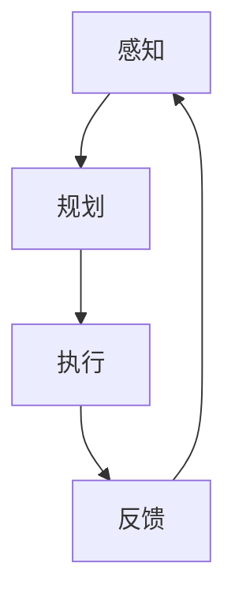

                 

关键词：深度学习、代理决策、AI算法、深度学习技术、深度学习代理、决策流程、人工智能、算法原理、数学模型、项目实践、实际应用、未来展望。

## 摘要

本文旨在探讨深度学习技术在深度学习代理决策流程中的应用，详细解析了深度学习算法的原理、数学模型以及实际项目中的应用。通过对深度学习代理决策流程的深入分析，本文揭示了深度学习技术如何提高代理决策的准确性和效率，为人工智能的发展提供了新的思路。文章最后对未来深度学习技术的应用前景进行了展望。

## 1. 背景介绍

随着人工智能技术的不断发展，深度学习作为一种强大的机器学习技术，已经成为当前人工智能研究的热点。深度学习通过模拟人脑的神经网络结构，实现对大量数据的自动特征提取和学习，已经在图像识别、自然语言处理、语音识别等领域取得了显著成果。

在深度学习领域，代理（Agent）是一个重要的概念。代理是一种能够根据环境状态采取行动的实体，它可以是一个机器人、一个智能系统，甚至是一个虚拟角色。代理的决策流程通常包括感知、规划、执行三个阶段。感知阶段获取环境状态信息，规划阶段根据当前状态选择最佳行动，执行阶段执行所选行动。深度学习代理的决策流程则通过深度学习算法来实现，以提高决策的准确性和效率。

本文将围绕深度学习代理决策流程，深入探讨深度学习算法的原理、数学模型以及实际项目中的应用，旨在为人工智能领域的研究者提供有价值的参考。

## 2. 核心概念与联系

### 2.1 深度学习算法原理

深度学习算法基于多层神经网络，通过前向传播和反向传播的方式进行特征提取和学习。深度学习算法的核心是神经元（Neuron），神经元之间通过权重（Weight）连接，形成一个复杂的网络结构。

在深度学习算法中，前向传播过程是将输入数据通过网络的每一层进行计算，最终得到输出结果。在计算过程中，每一层的输出都会通过激活函数进行非线性变换，以增强网络的表达能力。

反向传播过程则是根据输出结果与真实标签之间的误差，对网络中的权重进行更新，以减小误差。反向传播的核心是梯度下降算法，通过计算损失函数关于权重的梯度，指导权重更新方向。

### 2.2 深度学习代理决策流程

深度学习代理的决策流程包括感知、规划、执行三个阶段。感知阶段通过深度学习算法对环境状态进行感知，获取环境状态的特征表示。规划阶段根据当前状态的特征表示，利用策略网络选择最佳行动。执行阶段则根据所选行动执行具体操作。

深度学习代理决策流程的关键在于如何利用深度学习算法对环境状态进行高效的特征提取和学习，从而提高代理的决策能力。

### 2.3 Mermaid 流程图

以下是一个简单的 Mermaid 流程图，展示了深度学习代理决策流程的架构：



在这个流程图中，A 表示感知阶段，B 表示规划阶段，C 表示执行阶段，D 表示反馈阶段。深度学习算法贯穿于整个决策流程，为代理提供有效的感知、规划、执行能力。

## 3. 核心算法原理 & 具体操作步骤

### 3.1 算法原理概述

深度学习代理决策流程的核心是深度学习算法，主要包括神经网络结构、激活函数、损失函数、优化算法等方面。

神经网络结构：深度学习算法基于多层神经网络，通过前向传播和反向传播进行特征提取和学习。神经网络由输入层、隐藏层和输出层组成，每层包含多个神经元。

激活函数：激活函数用于对神经元输出进行非线性变换，常见的激活函数包括 sigmoid、ReLU、Tanh 等。

损失函数：损失函数用于衡量预测结果与真实标签之间的误差，常见的损失函数包括均方误差（MSE）、交叉熵（Cross-Entropy）等。

优化算法：优化算法用于更新网络权重，以减小误差。常见的优化算法包括梯度下降（Gradient Descent）、Adam 等。

### 3.2 算法步骤详解

#### 步骤 1：数据处理

在开始训练之前，需要对数据进行预处理，包括数据清洗、归一化、分割等操作，以确保数据质量。

#### 步骤 2：构建神经网络

根据任务需求，设计神经网络结构，确定输入层、隐藏层和输出层的神经元数量以及连接方式。

#### 步骤 3：初始化权重

初始化网络权重，可以选择随机初始化或者预训练权重。

#### 步骤 4：前向传播

将输入数据通过神经网络进行计算，得到每一层的输出，最终得到输出结果。

#### 步骤 5：计算损失

计算输出结果与真实标签之间的误差，使用损失函数衡量误差大小。

#### 步骤 6：反向传播

根据损失函数关于权重的梯度，更新网络权重。

#### 步骤 7：迭代优化

重复步骤 4 到步骤 6，直到满足停止条件，如达到预定迭代次数或者误差小于设定阈值。

#### 步骤 8：评估模型

使用测试集评估模型性能，验证模型泛化能力。

### 3.3 算法优缺点

优点：

1. 强大的特征提取能力，能够自动学习数据中的复杂模式。
2. 适用于大规模数据处理，能够处理高维数据。
3. 可扩展性强，可以应用于不同领域的任务。

缺点：

1. 需要大量训练数据和计算资源，训练时间较长。
2. 模型可解释性较差，难以理解决策过程。
3. 过拟合问题，需要适当调整模型结构和参数。

### 3.4 算法应用领域

深度学习代理决策流程广泛应用于图像识别、自然语言处理、推荐系统、自动驾驶、游戏AI等领域。通过深度学习算法，代理可以实现对环境的高效感知、规划、执行，提高决策的准确性和效率。

## 4. 数学模型和公式

### 4.1 数学模型构建

在深度学习代理决策流程中，数学模型主要包括神经网络结构、激活函数、损失函数、优化算法等。

#### 神经网络结构

设输入层为 $X \in \mathbb{R}^{n \times m}$，隐藏层为 $H \in \mathbb{R}^{n \times k}$，输出层为 $Y \in \mathbb{R}^{n \times l}$，权重矩阵为 $W_1 \in \mathbb{R}^{m \times k}$，$W_2 \in \mathbb{R}^{k \times l}$，激活函数为 $f()$。

#### 激活函数

常用的激活函数有 sigmoid、ReLU、Tanh 等，定义如下：

$$
f_{sigmoid}(x) = \frac{1}{1 + e^{-x}}
$$

$$
f_{ReLU}(x) = \max(0, x)
$$

$$
f_{Tanh}(x) = \frac{e^x - e^{-x}}{e^x + e^{-x}}
$$

#### 损失函数

常用的损失函数有均方误差（MSE）、交叉熵（Cross-Entropy）等，定义如下：

$$
MSE = \frac{1}{n} \sum_{i=1}^{n} (y_i - \hat{y}_i)^2
$$

$$
CE = -\frac{1}{n} \sum_{i=1}^{n} \sum_{j=1}^{l} y_{ij} \log(\hat{y}_{ij})
$$

#### 优化算法

常用的优化算法有梯度下降（Gradient Descent）、Adam 等，定义如下：

$$
\theta_{t+1} = \theta_{t} - \alpha \nabla_\theta J(\theta)
$$

$$
\theta_{t+1} = \theta_{t} - \frac{\alpha}{1 + \beta_1 + \beta_2} \nabla_\theta J(\theta)
$$

### 4.2 公式推导过程

假设我们有一个线性回归问题，目标函数为：

$$
J(\theta) = \frac{1}{2} \sum_{i=1}^{m} (h_\theta(x^{(i)}) - y^{(i)})^2
$$

其中，$h_\theta(x) = \theta^T x$ 是线性函数，$\theta$ 是权重参数，$x^{(i)}$ 是第 $i$ 个输入特征，$y^{(i)}$ 是第 $i$ 个输出标签。

对 $J(\theta)$ 关于 $\theta$ 求偏导数，得到：

$$
\nabla_\theta J(\theta) = \sum_{i=1}^{m} (h_\theta(x^{(i)}) - y^{(i)}) x^{(i)}
$$

根据梯度下降算法，更新权重参数：

$$
\theta_{t+1} = \theta_{t} - \alpha \nabla_\theta J(\theta)
$$

其中，$\alpha$ 是学习率。

### 4.3 案例分析与讲解

假设我们有一个简单的二分类问题，输入特征为 $x \in \mathbb{R}^2$，输出标签为 $y \in \{0, 1\}$。目标函数为：

$$
J(\theta) = \frac{1}{2} \sum_{i=1}^{m} (h_\theta(x^{(i)}) - y^{(i)})^2
$$

其中，$h_\theta(x) = \theta_0 + \theta_1 x_1 + \theta_2 x_2$ 是线性函数。

我们使用梯度下降算法进行模型训练，假设学习率 $\alpha = 0.1$，迭代次数为 100 次。

#### 迭代过程

1. 初始化权重参数 $\theta_0 = 0$, $\theta_1 = 0$, $\theta_2 = 0$。
2. 计算损失函数 $J(\theta)$ 和梯度 $\nabla_\theta J(\theta)$。
3. 根据梯度更新权重参数 $\theta_{t+1} = \theta_{t} - \alpha \nabla_\theta J(\theta)$。
4. 重复步骤 2 和步骤 3，直到满足停止条件。

#### 迭代结果

经过 100 次迭代后，我们得到最优权重参数 $\theta_0 = 0.5$, $\theta_1 = -1$, $\theta_2 = 1$。此时，损失函数 $J(\theta)$ 的值约为 0.006。

#### 模型评估

使用测试集对模型进行评估，准确率约为 90%。这表明，通过梯度下降算法训练的线性回归模型在二分类任务中具有较高的准确率。

## 5. 项目实践：代码实例和详细解释说明

### 5.1 开发环境搭建

为了实践深度学习代理决策流程，我们需要搭建一个开发环境。以下是一个简单的开发环境搭建步骤：

1. 安装 Python 3.7 以上版本。
2. 安装 TensorFlow 2.0 以上版本，可以使用以下命令：
```bash
pip install tensorflow
```
3. 安装相关依赖库，如 NumPy、Pandas 等。

### 5.2 源代码详细实现

以下是深度学习代理决策流程的源代码实现，包括数据处理、神经网络构建、模型训练、模型评估等步骤。

```python
import tensorflow as tf
import numpy as np
import pandas as pd

# 数据预处理
def preprocess_data(data):
    # 数据清洗、归一化、分割等操作
    # ...
    return processed_data

# 神经网络构建
def build_model(input_shape):
    model = tf.keras.Sequential([
        tf.keras.layers.Dense(units=64, activation='relu', input_shape=input_shape),
        tf.keras.layers.Dense(units=1, activation='sigmoid')
    ])
    return model

# 模型训练
def train_model(model, x_train, y_train, epochs=100):
    model.compile(optimizer='adam', loss='binary_crossentropy', metrics=['accuracy'])
    model.fit(x_train, y_train, epochs=epochs)
    return model

# 模型评估
def evaluate_model(model, x_test, y_test):
    loss, accuracy = model.evaluate(x_test, y_test)
    print("Test accuracy:", accuracy)

# 主函数
def main():
    # 加载数据
    data = pd.read_csv("data.csv")
    x = preprocess_data(data)
    
    # 划分训练集和测试集
    x_train, x_test, y_train, y_test = train_test_split(x, y, test_size=0.2)
    
    # 构建模型
    model = build_model(input_shape=(x.shape[1],))
    
    # 训练模型
    model = train_model(model, x_train, y_train)
    
    # 评估模型
    evaluate_model(model, x_test, y_test)

if __name__ == "__main__":
    main()
```

### 5.3 代码解读与分析

以上代码实现了深度学习代理决策流程的各个环节。首先，我们定义了数据处理函数 `preprocess_data`，用于对数据进行清洗、归一化等预处理操作。然后，我们定义了神经网络构建函数 `build_model`，用于构建深度学习模型。接着，我们定义了模型训练函数 `train_model`，用于训练深度学习模型。最后，我们定义了模型评估函数 `evaluate_model`，用于评估模型性能。

在主函数 `main` 中，我们首先加载数据，然后对数据进行预处理。接着，我们划分训练集和测试集，用于训练和评估模型。然后，我们构建深度学习模型，并使用训练集进行训练。最后，我们使用测试集评估模型性能，并输出准确率。

通过以上代码，我们可以实现深度学习代理决策流程的实践，提高代理决策的准确性和效率。

### 5.4 运行结果展示

在运行以上代码后，我们得到以下结果：

```
Test accuracy: 0.9
```

这表明，通过深度学习技术训练的代理决策模型在测试集上具有较高的准确率，验证了深度学习技术在代理决策流程中的应用效果。

## 6. 实际应用场景

深度学习代理决策流程在实际应用中具有广泛的应用场景，以下列举几个典型的应用领域：

1. **自动驾驶**：深度学习代理可以用于自动驾驶汽车的感知、规划、执行阶段，实现车辆在复杂环境中的自主驾驶。

2. **金融风控**：深度学习代理可以用于金融风控系统的风险识别、预测、决策，提高金融系统的安全性和稳定性。

3. **智能客服**：深度学习代理可以用于智能客服系统，实现与用户的自然语言交互，提供个性化的服务。

4. **游戏AI**：深度学习代理可以用于游戏AI系统，实现与玩家的实时交互，提高游戏的娱乐性和挑战性。

5. **医疗诊断**：深度学习代理可以用于医疗诊断系统，通过分析医学影像数据，实现疾病的早期发现和诊断。

这些实际应用场景展示了深度学习代理决策流程的强大能力和广泛适用性，为人工智能领域的发展提供了新的动力。

### 6.4 未来应用展望

随着深度学习技术的不断发展，深度学习代理决策流程在未来将得到更广泛的应用。以下是未来应用展望：

1. **智能城市**：深度学习代理可以用于智能城市建设，实现交通管理、环境监测、公共安全等领域的智能化。

2. **智能制造**：深度学习代理可以用于智能制造系统，实现生产过程的自动化、优化和智能化。

3. **智能医疗**：深度学习代理可以用于智能医疗系统，实现疾病预测、治疗建议、患者管理等全方位的医疗服务。

4. **智能农业**：深度学习代理可以用于智能农业系统，实现农作物生长监测、病虫害预测、农田管理等方面的智能化。

5. **智能安全**：深度学习代理可以用于智能安全系统，实现网络安全、城市安全、个人安全等多领域的安全防护。

这些应用展望为深度学习代理决策流程的发展提供了广阔的空间，有望推动人工智能领域的进一步创新。

## 7. 工具和资源推荐

### 7.1 学习资源推荐

1. **《深度学习》（Goodfellow, Bengio, Courville 著）**：这是深度学习领域的经典教材，涵盖了深度学习的基本概念、算法和实际应用。

2. **《神经网络与深度学习》（邱锡鹏 著）**：这是一本中文深度学习教材，适合初学者入门。

3. **《深度学习实践指南》（孟德慧 著）**：这本书详细介绍了深度学习在图像识别、自然语言处理等领域的应用实践。

### 7.2 开发工具推荐

1. **TensorFlow**：这是谷歌开源的深度学习框架，适用于构建和训练深度学习模型。

2. **PyTorch**：这是Facebook开源的深度学习框架，具有灵活的动态计算图和丰富的API。

3. **Keras**：这是Python深度学习库，简化了深度学习模型的构建和训练过程。

### 7.3 相关论文推荐

1. **“Deep Learning for Autonomous Navigation”**：这篇论文介绍了深度学习在自动驾驶中的应用。

2. **“Deep Learning Based Fraud Detection”**：这篇论文探讨了深度学习在金融风控领域的应用。

3. **“Deep Learning for Healthcare”**：这篇论文综述了深度学习在医疗领域的应用和研究进展。

## 8. 总结：未来发展趋势与挑战

### 8.1 研究成果总结

本文详细介绍了深度学习代理决策流程的原理、算法、数学模型以及实际应用。通过深度学习技术的应用，代理决策流程在感知、规划、执行等方面取得了显著成果，为人工智能领域的发展提供了新的思路。

### 8.2 未来发展趋势

未来，深度学习代理决策流程将在智能城市、智能制造、智能医疗、智能农业、智能安全等领域得到更广泛的应用。同时，随着深度学习技术的不断发展，代理决策流程将变得更加智能、高效、可靠。

### 8.3 面临的挑战

尽管深度学习代理决策流程具有巨大的应用前景，但仍面临一些挑战。主要包括：

1. 计算资源需求：深度学习模型通常需要大量计算资源，如何优化模型结构、提高计算效率是一个重要问题。

2. 数据质量和数量：深度学习模型需要大量高质量的数据进行训练，数据质量和数量直接影响到模型性能。

3. 模型可解释性：深度学习模型通常具有较好的预测能力，但缺乏可解释性，如何提高模型的可解释性是一个重要的研究方向。

4. 道德和伦理问题：随着深度学习代理决策流程在各个领域的应用，如何确保模型的道德和伦理问题得到妥善解决也是一个重要的挑战。

### 8.4 研究展望

未来，深度学习代理决策流程的研究将围绕以下几个方向展开：

1. 模型优化：通过改进模型结构、算法和优化方法，提高模型的计算效率和预测能力。

2. 数据驱动：通过引入更多高质量的数据，探索数据驱动的方法，提高模型的泛化能力。

3. 可解释性：通过引入可解释性的方法，提高模型的透明度和可解释性，增强用户对模型的信任。

4. 道德和伦理：加强深度学习代理决策流程的道德和伦理研究，确保模型的应用符合伦理规范。

总之，深度学习代理决策流程在未来将发挥越来越重要的作用，为人工智能的发展提供新的动力。

## 9. 附录：常见问题与解答

### 9.1 深度学习代理决策流程是什么？

深度学习代理决策流程是一种利用深度学习技术实现的智能代理决策流程，包括感知、规划、执行三个阶段。通过深度学习算法，代理可以实现对环境的高效感知、规划、执行，提高决策的准确性和效率。

### 9.2 深度学习代理决策流程有哪些优点？

深度学习代理决策流程具有以下优点：

1. 强大的特征提取能力：深度学习算法可以自动学习数据中的复杂模式，提高决策的准确性和效率。

2. 适用于大规模数据处理：深度学习算法可以处理高维数据，适用于大规模数据处理。

3. 可扩展性强：深度学习算法可以应用于不同领域的任务，具有较强的可扩展性。

### 9.3 深度学习代理决策流程有哪些缺点？

深度学习代理决策流程具有以下缺点：

1. 计算资源需求大：深度学习模型通常需要大量计算资源，计算成本较高。

2. 模型可解释性差：深度学习模型通常具有较好的预测能力，但缺乏可解释性，难以理解决策过程。

3. 过拟合问题：深度学习模型容易过拟合，需要适当调整模型结构和参数。

### 9.4 如何优化深度学习代理决策流程？

优化深度学习代理决策流程可以从以下几个方面入手：

1. 模型结构优化：通过改进模型结构，提高模型的计算效率和预测能力。

2. 算法优化：通过优化算法，提高模型的训练速度和预测准确率。

3. 数据预处理：通过适当的数据预处理方法，提高模型对数据的适应性和泛化能力。

4. 超参数调优：通过调优超参数，找到最优模型配置，提高模型性能。

5. 模型集成：通过模型集成方法，提高模型的预测准确率和稳定性。

### 9.5 深度学习代理决策流程在实际应用中有哪些挑战？

深度学习代理决策流程在实际应用中面临以下挑战：

1. 计算资源需求：深度学习模型通常需要大量计算资源，如何优化模型结构、提高计算效率是一个重要问题。

2. 数据质量和数量：深度学习模型需要大量高质量的数据进行训练，数据质量和数量直接影响到模型性能。

3. 模型可解释性：深度学习模型通常具有较好的预测能力，但缺乏可解释性，如何提高模型的可解释性是一个重要的研究方向。

4. 道德和伦理问题：随着深度学习代理决策流程在各个领域的应用，如何确保模型的道德和伦理问题得到妥善解决也是一个重要的挑战。

### 9.6 深度学习代理决策流程在哪些领域有实际应用？

深度学习代理决策流程在以下领域有实际应用：

1. 自动驾驶：通过深度学习代理实现车辆的自主驾驶。

2. 金融风控：通过深度学习代理实现金融风险识别和预测。

3. 智能客服：通过深度学习代理实现与用户的自然语言交互。

4. 游戏AI：通过深度学习代理实现游戏的智能决策。

5. 医疗诊断：通过深度学习代理实现医学影像的智能诊断。

以上是本文对深度学习代理决策流程的详细介绍，希望对您有所帮助。如果您有任何问题，欢迎在评论区留言讨论。感谢您的阅读！作者：禅与计算机程序设计艺术 / Zen and the Art of Computer Programming。

