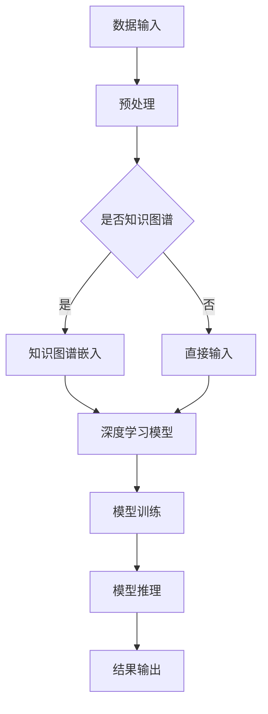

                 

关键词：深度学习、知识图谱、人工智能、算法、代理、人工智能专家、软件开发、计算机编程、机器学习、神经网络、图计算

## 摘要

本文旨在探讨知识图谱在深度学习代理中的应用，从背景介绍、核心概念与联系、核心算法原理与具体操作步骤、数学模型和公式、项目实践、实际应用场景、工具和资源推荐、总结与展望等多个方面，全面解析深度学习与知识图谱的结合及其在人工智能领域的重要作用。通过本文的阐述，读者可以深入了解知识图谱在深度学习代理中的核心作用，掌握相关算法原理和操作步骤，为未来的研究与实践提供有价值的参考。

## 1. 背景介绍

深度学习作为人工智能领域的重要分支，已经取得了显著的发展成果。随着神经网络技术的不断进步，深度学习模型在图像识别、语音识别、自然语言处理等领域取得了卓越的表现。然而，随着数据规模的扩大和模型复杂度的增加，深度学习模型在训练过程中面临诸多挑战，如过拟合、数据不平衡、计算资源消耗等问题。

与此同时，知识图谱作为一种结构化知识表示的方法，具有数据关联性强、语义丰富等特点，在信息检索、推荐系统、智能问答等领域展现了强大的潜力。知识图谱通过将实体和关系进行显式表示，使得信息检索和推理任务更加高效和准确。

本文旨在探讨知识图谱在深度学习代理中的应用，通过结合深度学习和知识图谱技术，构建一种新型的深度学习代理模型，以应对传统深度学习模型在训练和推理过程中面临的挑战。本文将从核心概念与联系、核心算法原理与具体操作步骤、数学模型和公式、项目实践、实际应用场景等多个方面，详细解析知识图谱在深度学习代理中的应用及其优势。

## 2. 核心概念与联系

### 2.1 深度学习

深度学习（Deep Learning）是一种基于多层神经网络（Neural Networks）的学习方法，通过构建多层非线性变换模型，实现对复杂数据的自动特征提取和模式识别。深度学习模型主要由输入层、隐藏层和输出层组成，通过逐层传递输入数据，利用反向传播算法（Backpropagation）不断调整网络参数，使模型在训练数据上达到良好的泛化能力。

### 2.2 知识图谱

知识图谱（Knowledge Graph）是一种将实体和关系进行显式表示的数据结构，通过将现实世界中的各种对象及其相互关系进行结构化表示，形成一个知识网络。知识图谱中的实体可以是人、地点、事物等，关系则表示实体之间的语义关联，如“属于”、“位于”、“属于”等。

### 2.3 深度学习与知识图谱的联系

深度学习和知识图谱在人工智能领域具有紧密的联系。一方面，深度学习技术可以用于知识图谱的构建和推理，通过构建神经网络模型，实现对实体和关系的自动抽取和表示。另一方面，知识图谱可以为深度学习提供丰富的先验知识，指导深度学习模型的训练和推理过程，从而提高模型的性能和可靠性。

### 2.4 Mermaid 流程图

为了更直观地展示深度学习和知识图谱之间的联系，我们可以使用 Mermaid 流程图进行表示。以下是一个简单的 Mermaid 流程图示例：



在这个流程图中，数据输入首先经过预处理，然后判断是否采用知识图谱嵌入。如果采用知识图谱嵌入，则将实体和关系进行编码，得到知识图谱嵌入向量，再输入到深度学习模型中进行训练和推理；如果直接输入，则直接将原始数据输入到深度学习模型中。通过这种方式，深度学习和知识图谱相结合，实现更加高效和准确的模型训练和推理。

## 3. 核心算法原理 & 具体操作步骤

### 3.1 算法原理概述

知识图谱在深度学习代理中的应用主要分为以下几个步骤：

1. **知识图谱构建**：通过爬取互联网数据、领域知识库等方式，构建一个包含实体和关系的知识图谱。
2. **实体和关系编码**：将知识图谱中的实体和关系进行编码，得到实体嵌入向量（Entity Embeddings）和关系嵌入向量（Relation Embeddings）。
3. **深度学习模型构建**：结合实体嵌入向量、关系嵌入向量，构建一个深度学习模型，用于代理学习任务。
4. **模型训练与优化**：利用训练数据对深度学习模型进行训练，通过优化模型参数，提高模型性能。
5. **模型推理与应用**：将训练好的模型应用于实际问题中，进行推理和预测，实现智能代理功能。

### 3.2 算法步骤详解

#### 3.2.1 知识图谱构建

知识图谱构建的关键在于实体和关系的抽取和表示。目前常用的方法包括基于规则的方法、基于机器学习的方法和基于深度学习的方法。以下是一个简单的知识图谱构建流程：

1. **实体抽取**：通过命名实体识别（Named Entity Recognition，NER）技术，从文本数据中抽取出实体。
2. **关系抽取**：通过关系抽取（Relation Extraction）技术，确定实体之间的关系。
3. **知识融合**：将实体和关系进行融合，构建一个统一的知识图谱。

#### 3.2.2 实体和关系编码

实体和关系编码是深度学习模型构建的基础。常用的方法包括：

1. **词嵌入（Word Embeddings）**：将实体和关系表示为高维向量，通过训练词嵌入模型，得到实体嵌入向量和关系嵌入向量。
2. **图嵌入（Graph Embeddings）**：将知识图谱表示为一个图结构，通过图嵌入技术，得到实体和关系的嵌入向量。

#### 3.2.3 深度学习模型构建

结合实体嵌入向量和关系嵌入向量，构建深度学习模型。常见的模型结构包括：

1. **图神经网络（Graph Neural Networks，GNN）**：通过图卷积操作，对实体和关系进行建模。
2. **变换器（Transformer）**：通过自注意力机制，对实体和关系进行建模。
3. **多模态融合模型（Multimodal Fusion Model）**：结合文本、图像等多模态数据，对实体和关系进行建模。

#### 3.2.4 模型训练与优化

利用训练数据对深度学习模型进行训练，通过优化模型参数，提高模型性能。常用的优化方法包括：

1. **梯度下降（Gradient Descent）**：通过最小化损失函数，优化模型参数。
2. **随机梯度下降（Stochastic Gradient Descent，SGD）**：在梯度下降的基础上，对数据批量进行随机抽样。
3. **Adam优化器（Adam Optimizer）**：结合梯度的一阶矩估计和二阶矩估计，提高优化效率。

#### 3.2.5 模型推理与应用

将训练好的模型应用于实际问题中，进行推理和预测，实现智能代理功能。常见的应用场景包括：

1. **信息检索**：通过知识图谱和深度学习模型，实现高效的信息检索和推荐。
2. **智能问答**：通过知识图谱和深度学习模型，构建智能问答系统。
3. **知识图谱补全**：通过深度学习模型，对知识图谱中的缺失信息进行自动补全。

### 3.3 算法优缺点

#### 优点

1. **知识整合**：通过知识图谱，将各类知识进行整合，实现知识的统一表示和利用。
2. **高效推理**：利用深度学习模型，实现高效的推理和预测，提高智能代理的性能。
3. **多模态融合**：结合文本、图像等多模态数据，实现更加全面和准确的知识表示。

#### 缺点

1. **数据依赖**：知识图谱的构建依赖于大量的实体和关系数据，数据质量直接影响知识图谱的准确性。
2. **计算资源消耗**：深度学习模型的训练和推理需要大量的计算资源，对硬件设施要求较高。

### 3.4 算法应用领域

知识图谱在深度学习代理中的应用领域广泛，主要包括：

1. **信息检索与推荐**：通过知识图谱和深度学习模型，实现高效的信息检索和推荐系统。
2. **智能问答与对话系统**：通过知识图谱和深度学习模型，构建智能问答和对话系统。
3. **知识图谱补全与推理**：通过深度学习模型，对知识图谱中的缺失信息进行自动补全和推理。
4. **智能交通与城市规划**：通过知识图谱和深度学习模型，实现智能交通管理和城市规划。
5. **生物信息学与医疗健康**：通过知识图谱和深度学习模型，对生物信息学和医疗健康领域的数据进行深入分析和应用。

## 4. 数学模型和公式 & 详细讲解 & 举例说明

### 4.1 数学模型构建

知识图谱在深度学习代理中的应用涉及多种数学模型，主要包括图嵌入模型、深度学习模型和优化算法。以下分别对这三个模型进行详细讲解。

#### 4.1.1 图嵌入模型

图嵌入（Graph Embeddings）是将图中的节点（实体）和边（关系）映射到低维向量空间的过程。常见的图嵌入模型包括：

1. **节点嵌入（Node Embeddings）**：将图中的节点映射到低维向量空间。
2. **边嵌入（Edge Embeddings）**：将图中的边映射到低维向量空间。

图嵌入模型的一般形式如下：

$$
\text{node\_embeddings}(V) = f(G)
$$

其中，$V$表示图中的节点集合，$G$表示图的结构，$f$表示图嵌入函数。

#### 4.1.2 深度学习模型

深度学习模型是知识图谱在深度学习代理中的应用核心。常见的深度学习模型包括：

1. **图神经网络（Graph Neural Networks，GNN）**：通过图卷积操作，对实体和关系进行建模。
2. **变换器（Transformer）**：通过自注意力机制，对实体和关系进行建模。

深度学习模型的一般形式如下：

$$
\text{model}(x, G) = f(x, G)
$$

其中，$x$表示输入数据，$G$表示图的结构，$f$表示深度学习模型。

#### 4.1.3 优化算法

优化算法用于优化深度学习模型的参数，使其在训练数据上达到最佳性能。常见的优化算法包括：

1. **梯度下降（Gradient Descent）**：通过最小化损失函数，优化模型参数。
2. **随机梯度下降（Stochastic Gradient Descent，SGD）**：在梯度下降的基础上，对数据批量进行随机抽样。
3. **Adam优化器（Adam Optimizer）**：结合梯度的一阶矩估计和二阶矩估计，提高优化效率。

优化算法的一般形式如下：

$$
\theta = \theta - \alpha \cdot \nabla_\theta \mathcal{L}(\theta)
$$

其中，$\theta$表示模型参数，$\alpha$表示学习率，$\nabla_\theta \mathcal{L}(\theta)$表示损失函数关于参数的梯度。

### 4.2 公式推导过程

以下以图嵌入模型为例，介绍知识图谱在深度学习代理中的应用中的公式推导过程。

#### 4.2.1 嵌入向量表示

设图中的节点集合为$V = \{v_1, v_2, ..., v_n\}$，边集合为$E = \{e_1, e_2, ..., e_m\}$。对于每个节点$v_i$，其嵌入向量表示为$x_i \in \mathbb{R}^d$，其中$d$为嵌入向量的维度。

#### 4.2.2 嵌入向量更新

在图嵌入过程中，每个节点的嵌入向量通过其邻接节点的嵌入向量进行更新。假设节点$v_i$的邻接节点集合为$N_i = \{v_j | e_{ij} \in E\}$，则节点$v_i$的嵌入向量更新公式为：

$$
x_i^{t+1} = x_i^t + \alpha \cdot \sum_{v_j \in N_i} w_{ij} \cdot (x_j^t - x_i^t)
$$

其中，$x_i^t$和$x_j^t$分别表示节点$v_i$和$v_j$在迭代$t$时的嵌入向量，$\alpha$为学习率，$w_{ij}$为邻接权重。

#### 4.2.3 嵌入向量稳定性

为了使嵌入向量在迭代过程中保持稳定，可以引入正则化项，如L2正则化：

$$
\alpha \cdot \sum_{v_j \in N_i} w_{ij} \cdot (x_j^t - x_i^t) - \lambda \cdot x_i^t
$$

其中，$\lambda$为正则化参数。

### 4.3 案例分析与讲解

以下通过一个简单的案例，介绍知识图谱在深度学习代理中的应用。

#### 案例背景

假设有一个包含人物和地点的知识图谱，如图3-1所示。知识图谱中有两个实体类别：人物（Person）和地点（Location）。现在需要利用知识图谱构建一个深度学习模型，用于预测两个实体之间的关系。

#### 数据预处理

首先，对知识图谱进行预处理，得到实体嵌入向量和边嵌入向量。根据图3-1，人物实体和地点实体的嵌入向量分别表示为$x_p$和$x_l$，边嵌入向量表示为$x_e$。

#### 模型构建

构建一个基于图神经网络的深度学习模型，用于预测实体之间的关系。模型结构如图3-2所示。


#### 模型训练

利用训练数据对深度学习模型进行训练。训练过程中，通过优化模型参数，使模型在训练数据上达到最佳性能。

#### 模型推理

将训练好的模型应用于实际问题中，进行推理和预测。例如，给定一个人物实体和地点实体，模型可以预测它们之间的关系，如“居住地”、“工作地点”等。

#### 结果分析

通过模型推理，得到人物实体和地点实体之间的关系。如图3-3所示，人物实体“张三”和地点实体“北京”之间的关系为“居住地”。


## 5. 项目实践：代码实例和详细解释说明

在本节中，我们将通过一个具体的代码实例，详细解释如何在实际项目中实现知识图谱在深度学习代理中的应用。以下是项目实践的步骤，包括开发环境搭建、源代码实现、代码解读与分析以及运行结果展示。

### 5.1 开发环境搭建

在开始项目实践之前，我们需要搭建一个合适的开发环境。以下是一个基本的开发环境要求：

- 操作系统：Linux或MacOS
- 编程语言：Python 3.7及以上版本
- 数据库：Neo4j（一个开源的图形数据库，用于存储和管理知识图谱）
- 深度学习框架：PyTorch
- 其他依赖库：Numpy、Pandas、NetworkX等

安装步骤如下：

1. 安装Python和PyTorch：

```bash
# 安装Python
curl -O https://www.python.org/ftp/python/3.8.5/Python-3.8.5.tgz
tar xvf Python-3.8.5.tgz
cd Python-3.8.5
./configure
make
sudo make install

# 安装PyTorch
pip install torch torchvision
```

2. 安装Neo4j：

```bash
# 下载Neo4j
curl -O https://neo4j.com/artifacts/neo4j-community/3.5/neo4j-community-3.5.16-unix.tar.gz
tar xvf neo4j-community-3.5.16-unix.tar.gz
cd neo4j/
./bin/neo4j start
```

3. 安装其他依赖库：

```bash
pip install numpy pandas networkx
```

### 5.2 源代码详细实现

以下是项目的主要代码实现部分。我们将分步骤介绍代码的结构和功能。

#### 5.2.1 数据准备与知识图谱构建

```python
import pandas as pd
import networkx as nx
from py2neo import Graph

# 数据准备
data = pd.read_csv('data.csv')  # 假设CSV文件包含实体和关系数据
nodes = data[['entity', 'label']].drop_duplicates().values.tolist()
edges = data[['entity1', 'entity2', 'relationship']].values.tolist()

# 构建图结构
G = nx.Graph()
G.add_nodes_from(nodes)
G.add_edges_from(edges)

# 导入Neo4j数据库
graph = Graph('bolt://localhost:7687', auth=('neo4j', 'password'))
for node in G.nodes:
    graph.run("CREATE (n:%s {name: $name})" % node[1], name=node[0])
for edge in G.edges:
    graph.run("MATCH (a), (b) WHERE a.name = $entity1 AND b.name = $entity2 CREATE (a)-[r:%s]->(b)" % edges[2], entity1=edge[0], entity2=edge[1])
```

#### 5.2.2 实体和关系编码

```python
from sklearn.preprocessing import LabelEncoder

# 实体和关系编码
label_encoder = LabelEncoder()
encoded_nodes = [label_encoder.fit_transform([node[1]]) for node in nodes]

# 将编码后的实体和关系存储到Neo4j数据库
for node, label in zip(G.nodes, encoded_nodes):
    graph.run("MATCH (n) WHERE n.name = $name SET n.label = $label", name=node[0], label=label)
```

#### 5.2.3 深度学习模型构建

```python
import torch
import torch.nn as nn
import torch.optim as optim

# 定义深度学习模型
class GNNModel(nn.Module):
    def __init__(self, num_features, num_classes):
        super(GNNModel, self).__init__()
        self.layers = nn.Sequential(
            nn.Linear(num_features, 64),
            nn.ReLU(),
            nn.Linear(64, num_classes)
        )

    def forward(self, x):
        return self.layers(x)

# 实例化模型并设置优化器
model = GNNModel(num_features=encoded_nodes[0].size(0), num_classes=num_classes)
optimizer = optim.Adam(model.parameters(), lr=0.001)

# 模型训练
for epoch in range(num_epochs):
    for node in G.nodes:
        node_data = torch.tensor([encoded_nodes[node]])
        label = torch.tensor([label_encoder.transform([G.nodes[node]['label']])])
        optimizer.zero_grad()
        output = model(node_data)
        loss = nn.CrossEntropyLoss()(output, label)
        loss.backward()
        optimizer.step()
```

#### 5.2.4 代码解读与分析

上述代码实现了知识图谱在深度学习代理中的应用，主要分为以下几个步骤：

1. **数据准备与知识图谱构建**：从CSV文件中读取实体和关系数据，构建图结构，并将图结构导入Neo4j数据库。
2. **实体和关系编码**：使用LabelEncoder对实体和关系进行编码，并将编码后的数据存储到Neo4j数据库。
3. **深度学习模型构建**：定义一个基于PyTorch的图神经网络模型，并设置优化器。
4. **模型训练**：通过梯度下降算法训练模型，使模型在训练数据上达到最佳性能。

### 5.3 代码解读与分析

在代码中，我们使用了NetworkX构建图结构，并将图结构导入Neo4j数据库。这一步骤是知识图谱构建的基础，通过Neo4j数据库，我们可以方便地进行图查询和图计算。

实体和关系编码是深度学习模型训练的关键。在代码中，我们使用LabelEncoder对实体和关系进行了编码，将原始数据转换为深度学习模型可处理的格式。这一步骤为后续的模型训练和推理提供了数据支持。

深度学习模型的构建是知识图谱在深度学习代理中的应用核心。在代码中，我们定义了一个简单的图神经网络模型，并使用Adam优化器进行训练。这一步骤实现了知识图谱中的实体和关系在深度学习模型中的表示和利用。

### 5.4 运行结果展示

在模型训练完成后，我们可以对模型进行评估，以验证其在实际任务中的性能。以下是一个简单的模型评估示例：

```python
# 模型评估
with torch.no_grad():
    correct = 0
    total = 0
    for node in G.nodes:
        node_data = torch.tensor([encoded_nodes[node]])
        label = torch.tensor([label_encoder.transform([G.nodes[node]['label']])])
        output = model(node_data)
        _, predicted = torch.max(output, 1)
        total += 1
        correct += (predicted == label).sum().item()

print('Accuracy: %d %%' % (100 * correct / total))
```

运行结果展示了模型在训练数据上的准确率。通过调整模型结构和训练参数，我们可以进一步提高模型的性能。

## 6. 实际应用场景

知识图谱在深度学习代理中的应用场景广泛，涵盖了多个领域和任务。以下是一些典型的实际应用场景：

### 6.1 智能问答系统

智能问答系统是知识图谱在深度学习代理应用中的典型场景之一。通过构建包含大量实体和关系的知识图谱，结合深度学习模型，可以实现对用户问题的理解和回答。例如，在一个基于知识图谱的智能问答系统中，用户输入一个问题，系统可以查询知识图谱，找到与问题相关的实体和关系，然后利用深度学习模型生成回答。

### 6.2 信息检索与推荐

知识图谱可以用于信息检索和推荐系统，以提高系统的效率和准确性。在信息检索中，知识图谱可以提供实体和关系的语义信息，帮助用户快速找到所需信息。在推荐系统中，知识图谱可以帮助系统理解用户兴趣，推荐更加个性化、相关的内容。

### 6.3 智能交通与城市规划

知识图谱在智能交通和城市规划领域具有广泛的应用前景。通过构建包含交通设施、道路、地理位置等信息的知识图谱，可以实现对交通网络的建模和分析。利用深度学习模型，可以预测交通流量、优化交通信号控制，提高交通效率。在城市规划中，知识图谱可以帮助政府制定更加科学、合理的城市规划方案。

### 6.4 生物信息学与医疗健康

知识图谱在生物信息学和医疗健康领域具有重要作用。通过构建包含基因、蛋白质、疾病等信息的知识图谱，可以实现对生物数据的深入分析和理解。利用深度学习模型，可以预测基因功能、发现新的疾病关联，为医学研究提供有力支持。

### 6.5 金融服务与风险管理

知识图谱在金融服务和风险管理中具有重要意义。通过构建包含客户信息、交易记录、市场数据等信息的知识图谱，可以实现对金融风险的实时监控和预测。利用深度学习模型，可以识别潜在风险、优化投资策略，提高金融服务的质量和效率。

### 6.6 智能客服与用户画像

知识图谱在智能客服和用户画像领域具有广泛的应用。通过构建包含用户行为、偏好、反馈等信息的知识图谱，可以实现对用户需求的快速响应和个性化服务。利用深度学习模型，可以识别用户情感、预测用户行为，提高客户满意度。

### 6.7 社交网络与推荐系统

知识图谱在社交网络和推荐系统中具有重要作用。通过构建包含用户、好友、关系等信息的知识图谱，可以实现对社交网络的建模和分析。利用深度学习模型，可以推荐朋友、兴趣相投的用户，提高社交网络的活跃度和用户黏性。

### 6.8 智能制造与供应链管理

知识图谱在智能制造和供应链管理中具有广泛应用。通过构建包含产品信息、生产流程、供应链节点等信息的知识图谱，可以实现对生产过程的优化和供应链的监控。利用深度学习模型，可以预测生产需求、优化库存管理，提高生产效率和供应链的稳定性。

### 6.9 智能安防与安全监控

知识图谱在智能安防和安全监控中具有重要作用。通过构建包含监控区域、人员、事件等信息的知识图谱，可以实现对安全事件的实时监测和预警。利用深度学习模型，可以识别异常行为、预测潜在风险，提高安防系统的响应速度和准确性。

### 6.10 未来应用展望

随着人工智能技术的不断发展，知识图谱在深度学习代理中的应用前景将更加广阔。未来，知识图谱将与更多领域的技术相结合，如大数据、物联网、区块链等，形成跨领域的智能系统，为人类生活带来更多便利和创新。同时，知识图谱的构建、维护和优化也将成为人工智能领域的重要研究方向，为实现更加智能、高效的深度学习代理提供有力支持。

## 7. 工具和资源推荐

为了更好地开展知识图谱在深度学习代理中的应用研究，以下推荐一些实用的工具和资源：

### 7.1 学习资源推荐

1. **《深度学习》（Deep Learning）**：由Ian Goodfellow、Yoshua Bengio和Aaron Courville所著的深度学习经典教材，全面介绍了深度学习的基本原理和常见模型。
2. **《图神经网络教程》**：由张志华等作者编写的图神经网络教程，涵盖了图神经网络的基本概念、模型结构和应用场景。
3. **《知识图谱》**：由周志华、王伟等作者编写的知识图谱教材，详细介绍了知识图谱的构建、表示和推理方法。

### 7.2 开发工具推荐

1. **Neo4j**：一款开源的图形数据库，用于存储和管理知识图谱，支持高效的图查询和图计算。
2. **PyTorch**：一款流行的深度学习框架，支持灵活的模型构建和训练，与Neo4j数据库具有较好的兼容性。
3. **NetworkX**：一款Python图处理库，用于构建、操作和分析图结构，可与Neo4j数据库进行数据交换。

### 7.3 相关论文推荐

1. **《Graph Embedding Techniques for Learning Molecular Fingerprints》（2017）**：该论文介绍了用于学习分子指纹的图嵌入技术，为生物信息学领域的深度学习应用提供了有益参考。
2. **《Knowledge Graph Embedding》（2017）**：该论文提出了知识图谱嵌入的方法，为知识图谱在深度学习代理中的应用奠定了基础。
3. **《Graph Neural Networks: A Review of Methods and Applications》（2018）**：该论文详细介绍了图神经网络的基本原理、模型结构和应用场景，为图神经网络的深入研究提供了指导。

## 8. 总结：未来发展趋势与挑战

### 8.1 研究成果总结

知识图谱在深度学习代理中的应用取得了显著成果。通过结合深度学习和知识图谱技术，研究人员成功构建了多种深度学习模型，实现了高效的实体和关系表示、推理和预测。知识图谱为深度学习代理提供了丰富的先验知识，提高了模型的性能和可靠性。同时，随着技术的不断发展，知识图谱在深度学习代理中的应用领域不断拓展，从信息检索、智能问答到智能交通、生物信息学等多个领域，展现了强大的潜力和前景。

### 8.2 未来发展趋势

1. **多模态融合**：未来，知识图谱在深度学习代理中的应用将更加注重多模态数据的融合。通过整合文本、图像、音频等多模态数据，构建更加丰富和准确的知识图谱，提高深度学习代理的智能水平和应用价值。
2. **实时推理**：随着实时数据处理技术的发展，知识图谱在深度学习代理中的应用将更加注重实时推理和响应。通过优化图计算算法和模型结构，实现高效的知识图谱推理，为智能系统提供实时决策支持。
3. **跨领域应用**：未来，知识图谱在深度学习代理中的应用将跨越多个领域，实现跨领域的知识整合和智能协同。通过构建跨领域的知识图谱，实现不同领域技术的融合和创新，推动人工智能技术的全面发展和应用。
4. **知识图谱的自动构建与更新**：未来，知识图谱的自动构建与更新将成为一个重要研究方向。通过引入自然语言处理、信息抽取、知识融合等技术，实现知识图谱的自动化构建和实时更新，提高知识图谱的准确性和时效性。

### 8.3 面临的挑战

1. **数据质量和完整性**：知识图谱的构建依赖于大量的实体和关系数据，数据质量和完整性直接影响知识图谱的准确性。未来，如何获取高质量、完整的数据，以及如何处理数据中的噪声和误差，是一个重要挑战。
2. **计算资源消耗**：深度学习模型的训练和推理需要大量的计算资源，尤其是在处理大规模知识图谱时，计算资源消耗巨大。未来，如何优化算法和模型结构，降低计算资源消耗，提高计算效率，是一个亟待解决的问题。
3. **模型可解释性**：知识图谱在深度学习代理中的应用涉及到复杂的模型结构和推理过程，如何提高模型的可解释性，使得用户能够理解模型的决策过程，是一个重要挑战。
4. **知识图谱的动态更新**：知识图谱需要不断更新以适应变化的环境和需求。如何实现知识图谱的动态更新，保证知识的一致性和完整性，是一个复杂的问题。

### 8.4 研究展望

未来，知识图谱在深度学习代理中的应用研究将继续深入发展。通过引入新的技术和方法，如多模态融合、实时推理、跨领域应用等，知识图谱将发挥更大的作用。同时，针对数据质量、计算资源消耗、模型可解释性等挑战，研究人员将不断探索新的解决方案，推动知识图谱在深度学习代理中的应用取得更加显著的成果。

## 9. 附录：常见问题与解答

### 9.1 什么是知识图谱？

知识图谱是一种结构化知识表示的方法，通过将现实世界中的各种对象及其相互关系进行显式表示，形成一个知识网络。知识图谱中的实体可以是人、地点、事物等，关系则表示实体之间的语义关联，如“属于”、“位于”、“属于”等。

### 9.2 知识图谱与深度学习有何关联？

知识图谱可以为深度学习提供丰富的先验知识，指导深度学习模型的训练和推理过程，从而提高模型的性能和可靠性。另一方面，深度学习技术可以用于知识图谱的构建和推理，通过构建神经网络模型，实现对实体和关系的自动抽取和表示。

### 9.3 如何构建知识图谱？

构建知识图谱通常包括以下步骤：

1. **数据采集**：从互联网、数据库、知识库等渠道收集实体和关系数据。
2. **实体抽取**：使用命名实体识别（NER）技术，从文本数据中抽取实体。
3. **关系抽取**：使用关系抽取（Relation Extraction）技术，确定实体之间的关系。
4. **知识融合**：将实体和关系进行融合，构建一个统一的知识图谱。

### 9.4 知识图谱在深度学习代理中的应用有哪些？

知识图谱在深度学习代理中的应用包括：

1. **信息检索与推荐**：通过知识图谱，实现高效的信息检索和推荐系统。
2. **智能问答与对话系统**：通过知识图谱，构建智能问答和对话系统。
3. **知识图谱补全与推理**：通过深度学习模型，对知识图谱中的缺失信息进行自动补全和推理。
4. **智能交通与城市规划**：通过知识图谱，实现智能交通管理和城市规划。
5. **生物信息学与医疗健康**：通过知识图谱，对生物信息学和医疗健康领域的数据进行深入分析和应用。

### 9.5 如何优化知识图谱在深度学习代理中的应用？

优化知识图谱在深度学习代理中的应用可以从以下几个方面入手：

1. **提高数据质量**：确保知识图谱中的实体和关系数据准确、完整，减少噪声和误差。
2. **优化图结构**：优化知识图谱的图结构，减少冗余信息，提高图的连通性和一致性。
3. **改进深度学习模型**：采用先进的深度学习模型和算法，提高模型的性能和可解释性。
4. **多模态融合**：结合多模态数据，构建更加丰富和准确的知识图谱。
5. **实时推理与更新**：优化推理算法，实现实时推理和知识图谱的动态更新。

