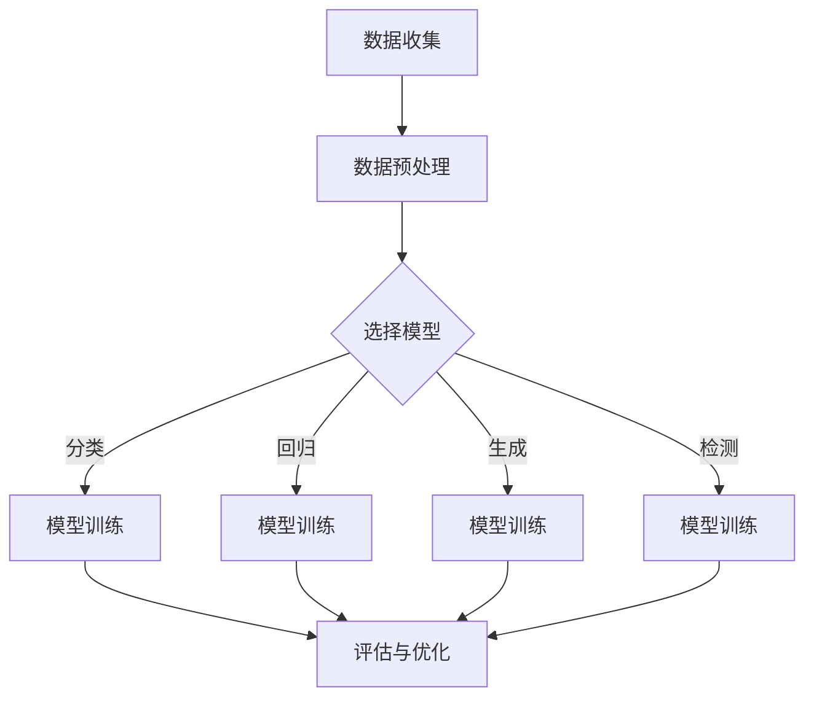

                 

关键词：深度学习，算法，流程，设计，人工智能，神经网络

> 摘要：本文深入探讨了人工智能领域中的深度学习算法及其在任务处理流程中的设计。通过剖析核心概念、算法原理、数学模型、实际应用以及未来展望，本文旨在为读者提供全面而深入的指导，帮助理解并掌握深度学习技术的精髓。

## 1. 背景介绍

深度学习作为人工智能的核心技术之一，近年来取得了飞速的发展。其基于多层神经网络的架构，通过自主学习大量数据，能够实现图像识别、语音识别、自然语言处理等多种复杂任务。深度学习在图像、语音、自然语言处理等领域取得了显著的成果，但其复杂的算法设计和庞大的计算需求也对研究和应用提出了挑战。

本文旨在梳理深度学习算法的设计流程，从理论基础到实际应用，全面解析深度学习在任务处理中的关键环节。通过本文的阅读，读者可以了解到深度学习算法的基本原理、设计思路以及具体实现方法。

## 2. 核心概念与联系

### 2.1. 神经网络

神经网络是深度学习的基础，由大量人工神经元组成，这些神经元模拟了人脑的信息处理过程。神经网络通过输入层、隐藏层和输出层层层传递信息，最终实现特定任务。


### 2.2. 深度学习

深度学习是一种利用多层神经网络进行学习的技术。通过不断增加网络层数，深度学习模型能够提取出数据的更深层次特征，从而实现更复杂的任务。

### 2.3. 深度学习任务

深度学习任务主要包括分类、回归、生成、目标检测等。分类任务是判断输入数据属于哪个类别；回归任务是预测输入数据的连续值；生成任务是创建新的数据样本；目标检测任务是识别图像中的目标物体。

### 2.4. Mermaid 流程图

下面是一个描述深度学习任务处理流程的 Mermaid 流程图：



## 3. 核心算法原理 & 具体操作步骤

### 3.1. 算法原理概述

深度学习算法的核心是多层神经网络，其通过反向传播算法不断调整网络权重，以优化模型的性能。反向传播算法包括前向传播和后向传播两个过程：

1. **前向传播**：输入数据通过网络的层层处理，最终产生输出。
2. **后向传播**：计算输出与实际结果之间的误差，并根据误差调整网络权重。

### 3.2. 算法步骤详解

#### 3.2.1. 数据收集与预处理

数据收集是深度学习任务的第一步。数据可以来自公开数据集、自有数据集或通过爬虫获取。数据预处理包括数据清洗、归一化、缩放等操作，以消除噪声和保证数据的一致性。

#### 3.2.2. 模型选择

根据任务需求选择合适的模型。常见的深度学习模型包括卷积神经网络（CNN）、循环神经网络（RNN）、生成对抗网络（GAN）等。

#### 3.2.3. 模型训练

使用训练数据集对模型进行训练。训练过程中，模型通过反向传播算法不断调整权重，以降低预测误差。

#### 3.2.4. 评估与优化

使用验证数据集对模型进行评估。根据评估结果调整模型参数，以优化模型性能。

### 3.3. 算法优缺点

#### 优点：

- **强大的表达能力**：深度学习模型可以自动提取数据的特征，无需手动特征工程。
- **高效的处理能力**：深度学习模型能够处理大量数据，提高任务处理速度。

#### 缺点：

- **计算资源需求高**：深度学习模型需要大量的计算资源，对硬件要求较高。
- **数据依赖性大**：深度学习模型对数据质量有较高要求，数据缺失或噪声可能会影响模型性能。

### 3.4. 算法应用领域

深度学习算法在图像识别、语音识别、自然语言处理、医学诊断等领域具有广泛的应用。

## 4. 数学模型和公式

### 4.1. 数学模型构建

深度学习模型的核心是多层感知器（MLP）。MLP的数学模型可以表示为：

\[ y = \sigma(W_1 \cdot x + b_1) \]

其中，\( y \) 是输出，\( \sigma \) 是激活函数，\( W_1 \) 是权重矩阵，\( b_1 \) 是偏置项。

### 4.2. 公式推导过程

#### 4.2.1. 前向传播

输入数据 \( x \) 经过网络层层处理，最终产生输出 \( y \)：

\[ y = \sigma(W_1 \cdot x + b_1) \]

#### 4.2.2. 后向传播

计算输出 \( y \) 与实际结果 \( y_{\text{真实}} \) 之间的误差，并根据误差调整权重 \( W_1 \) 和偏置项 \( b_1 \)：

\[ \delta = (y - y_{\text{真实}}) \cdot \sigma'(W_1 \cdot x + b_1) \]

\[ W_1^{+} = W_1 - \alpha \cdot \delta \cdot x^T \]

\[ b_1^{+} = b_1 - \alpha \cdot \delta \]

其中，\( \delta \) 是误差，\( \sigma' \) 是激活函数的导数，\( \alpha \) 是学习率。

### 4.3. 案例分析与讲解

#### 案例一：图像分类

假设有一个二分类问题，输入数据为 \( x \)，输出数据为 \( y \)。我们使用多层感知器进行分类。

1. **数据收集**：收集含有猫和狗的图像数据。
2. **数据预处理**：对图像进行归一化和预处理。
3. **模型选择**：选择一个含有两个隐藏层的多层感知器。
4. **模型训练**：使用训练数据集对模型进行训练。
5. **评估与优化**：使用验证数据集对模型进行评估，并根据评估结果调整模型参数。

#### 案例二：语音识别

假设有一个语音识别任务，输入数据为语音信号 \( x \)，输出数据为文本 \( y \)。

1. **数据收集**：收集语音数据。
2. **数据预处理**：对语音信号进行预处理，提取特征。
3. **模型选择**：选择一个循环神经网络（RNN）。
4. **模型训练**：使用训练数据集对模型进行训练。
5. **评估与优化**：使用验证数据集对模型进行评估，并根据评估结果调整模型参数。

## 5. 项目实践：代码实例和详细解释说明

### 5.1. 开发环境搭建

在 Python 中，我们可以使用 TensorFlow 和 Keras 库进行深度学习模型开发。首先，安装 TensorFlow：

```bash
pip install tensorflow
```

### 5.2. 源代码详细实现

以下是一个简单的多层感知器模型实现：

```python
import tensorflow as tf
from tensorflow.keras import layers

# 定义模型
model = tf.keras.Sequential([
    layers.Dense(64, activation='relu', input_shape=(784,)),
    layers.Dense(10, activation='softmax')
])

# 编译模型
model.compile(optimizer='adam',
              loss='categorical_crossentropy',
              metrics=['accuracy'])

# 加载数据
(x_train, y_train), (x_test, y_test) = tf.keras.datasets.mnist.load_data()

# 数据预处理
x_train = x_train.astype('float32') / 255
x_test = x_test.astype('float32') / 255
y_train = tf.keras.utils.to_categorical(y_train, 10)
y_test = tf.keras.utils.to_categorical(y_test, 10)

# 训练模型
model.fit(x_train, y_train, epochs=10, batch_size=128)

# 评估模型
model.evaluate(x_test, y_test)
```

### 5.3. 代码解读与分析

1. **模型定义**：使用 `tf.keras.Sequential` 模型，定义一个包含两个隐藏层的多层感知器。第一层有 64 个神经元，使用 ReLU 激活函数；第二层有 10 个神经元，使用 softmax 激活函数。
2. **模型编译**：使用 `compile` 方法编译模型，指定优化器、损失函数和评估指标。
3. **数据加载**：使用 `tf.keras.datasets.mnist.load_data` 方法加载数据，并转换为适当的数据类型。
4. **数据预处理**：对图像数据进行归一化和预处理。
5. **模型训练**：使用 `fit` 方法训练模型，指定训练轮数和批量大小。
6. **模型评估**：使用 `evaluate` 方法评估模型性能。

## 6. 实际应用场景

深度学习算法在图像识别、语音识别、自然语言处理等领域具有广泛的应用。

### 6.1. 图像识别

深度学习算法在图像识别领域取得了显著成果，如人脸识别、物体识别、场景识别等。

### 6.2. 语音识别

深度学习算法在语音识别领域得到了广泛应用，如语音助手、语音翻译等。

### 6.3. 自然语言处理

深度学习算法在自然语言处理领域取得了重要突破，如机器翻译、情感分析、文本生成等。

## 7. 工具和资源推荐

### 7.1. 学习资源推荐

- 《深度学习》（Goodfellow, Bengio, Courville 著）
- 《神经网络与深度学习》（邱锡鹏 著）

### 7.2. 开发工具推荐

- TensorFlow
- PyTorch

### 7.3. 相关论文推荐

- "A Theoretical Analysis of the Deep Learning Problem"
- "Generative Adversarial Nets"

## 8. 总结：未来发展趋势与挑战

### 8.1. 研究成果总结

深度学习在图像识别、语音识别、自然语言处理等领域取得了显著成果，展示了强大的学习能力。

### 8.2. 未来发展趋势

未来深度学习将继续发展，包括更高效的网络结构、更强大的算法、更广泛的应用领域。

### 8.3. 面临的挑战

深度学习在计算资源、数据质量、模型可解释性等方面仍面临挑战。

### 8.4. 研究展望

随着技术的发展，深度学习将在更多领域发挥重要作用，为人类带来更多便利。

## 9. 附录：常见问题与解答

### 9.1. 深度学习如何处理数据？

深度学习通过预处理和特征提取技术处理数据，以提高模型性能。

### 9.2. 如何选择深度学习模型？

根据任务需求、数据量和计算资源等因素选择合适的深度学习模型。

### 9.3. 如何优化深度学习模型？

通过调整模型参数、使用更高效的优化算法、增加训练数据等方法优化模型。

## 作者署名

作者：禅与计算机程序设计艺术 / Zen and the Art of Computer Programming
-------------------------------------------------------------------

以上就是本文的完整内容，涵盖了深度学习算法的设计流程、核心原理、数学模型、实际应用以及未来展望等多个方面。希望本文能为读者提供有益的参考和指导。如需进一步了解深度学习技术，建议参考本文中推荐的书籍和论文。同时，欢迎读者在评论区提出问题和建议，共同探讨深度学习的未来发展方向。

