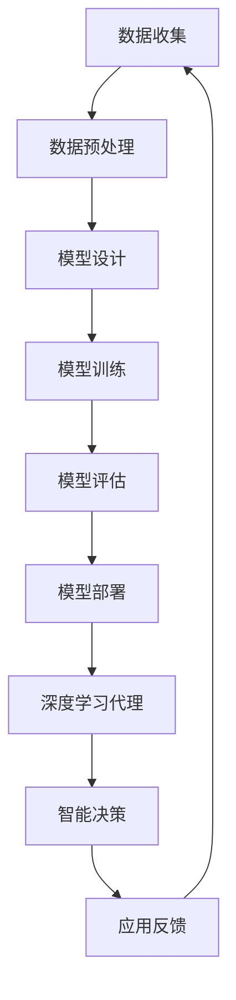

                 

关键词：人工智能，深度学习，代理，工作流，算法，前沿研究，未来展望。

> 摘要：本文旨在深入探讨AI人工智能领域的深度学习算法，特别是深度学习代理与工作流的研究方向。通过对核心概念、算法原理、数学模型、实践案例以及未来应用的详尽分析，本文为读者提供了全面的技术视角和前瞻性思考。

## 1. 背景介绍

随着人工智能（AI）技术的快速发展，深度学习已经成为实现智能化的重要工具。深度学习算法，尤其是神经网络，通过模拟人脑神经网络的结构和功能，实现了对数据的自动特征提取和模式识别。然而，随着模型复杂度的增加和数据量的爆发性增长，如何优化深度学习算法，提高其效率和可解释性，成为当前研究的热点。

深度学习代理是一种将深度学习模型应用于实际问题的方法，通过代理模型实现对复杂系统的智能控制和优化。而深度学习工作流则关注如何高效地管理和协调深度学习项目中的各个阶段，包括数据预处理、模型训练、模型评估和部署等。

本文将围绕深度学习代理与工作流的研究方向，探讨其核心算法原理、数学模型、实践案例以及未来应用，旨在为读者提供深入的技术理解和前瞻性的研究方向。

## 2. 核心概念与联系

### 2.1 深度学习代理

深度学习代理是一种将深度学习模型应用于实际问题的方法。它通常包括以下步骤：

1. **模型训练**：使用历史数据训练深度学习模型，以获得对问题的理解。
2. **代理构建**：将训练好的模型嵌入到应用场景中，构建代理模型。
3. **智能决策**：通过代理模型对输入数据进行处理，生成决策或预测结果。

### 2.2 深度学习工作流

深度学习工作流是指管理深度学习项目的过程，包括以下关键阶段：

1. **数据收集**：收集并清洗数据，为模型训练提供高质量的数据集。
2. **模型设计**：设计合适的深度学习模型架构，以适应特定问题的需求。
3. **模型训练**：使用训练数据训练模型，并使用验证数据调整模型参数。
4. **模型评估**：评估模型的性能，确保其满足应用要求。
5. **模型部署**：将训练好的模型部署到生产环境中，进行实际应用。

### 2.3 Mermaid 流程图

以下是一个描述深度学习代理与工作流关系的 Mermaid 流程图：



## 3. 核心算法原理 & 具体操作步骤

### 3.1 算法原理概述

深度学习代理的核心原理是基于神经网络的模型训练与优化。具体操作步骤如下：

1. **数据收集**：从不同的数据源收集数据，并进行预处理，如去噪、归一化等。
2. **模型设计**：根据应用需求设计深度学习模型，选择合适的网络架构和激活函数。
3. **模型训练**：使用预处理后的数据训练模型，通过反向传播算法调整模型参数。
4. **模型评估**：使用验证集评估模型性能，根据评估结果调整模型参数。
5. **代理构建**：将训练好的模型嵌入到应用场景中，构建深度学习代理。
6. **智能决策**：通过代理模型对输入数据进行处理，生成决策或预测结果。

### 3.2 算法步骤详解

#### 3.2.1 数据收集

数据收集是深度学习代理的第一步。数据来源可以是公开数据集、企业内部数据或互联网爬取的数据。收集到的数据需要进行预处理，包括去噪、缺失值填补、归一化等操作，以提高模型训练的效率和质量。

#### 3.2.2 模型设计

模型设计是根据应用需求选择合适的深度学习模型。常见的网络架构包括卷积神经网络（CNN）、循环神经网络（RNN）、生成对抗网络（GAN）等。在选择模型时，需要考虑模型的结构复杂度、训练时间、参数规模等因素。

#### 3.2.3 模型训练

模型训练是深度学习代理的核心步骤。训练过程中，模型通过不断调整参数，以最小化预测误差。训练方法包括随机梯度下降（SGD）、Adam优化器等。在训练过程中，需要使用验证集来评估模型性能，并根据评估结果调整模型参数。

#### 3.2.4 模型评估

模型评估是确保模型满足应用要求的重要环节。评估方法包括准确率、召回率、F1值等指标。通过评估，可以判断模型是否过拟合或欠拟合，并据此调整模型参数或选择更合适的模型。

#### 3.2.5 代理构建

代理构建是将训练好的模型嵌入到应用场景中。代理模型可以是一个独立的软件模块，也可以是嵌入到现有系统中的组件。在构建代理时，需要考虑模型的部署环境、接口设计等因素。

#### 3.2.6 智能决策

智能决策是深度学习代理的核心功能。通过代理模型对输入数据进行处理，可以生成决策或预测结果。智能决策的准确性直接影响到代理的应用效果。

### 3.3 算法优缺点

#### 优点

1. **高效性**：深度学习代理可以通过模型训练快速处理大量数据，提高决策效率。
2. **可解释性**：与传统的黑箱模型相比，深度学习代理具有较高的可解释性，有助于理解决策过程。
3. **灵活性**：深度学习代理可以适应不同的应用场景，通过调整模型参数实现不同的功能。

#### 缺点

1. **计算资源消耗**：深度学习代理需要大量的计算资源进行模型训练和部署，对硬件设备要求较高。
2. **数据质量要求**：数据质量对深度学习代理的性能有很大影响，需要严格的数据预处理过程。
3. **过拟合风险**：深度学习代理容易过拟合，需要通过验证集和测试集进行模型评估和调整。

### 3.4 算法应用领域

深度学习代理在多个领域具有广泛的应用前景，包括：

1. **金融**：应用于风险管理、投资策略制定等。
2. **医疗**：用于疾病诊断、药物研发等。
3. **工业**：用于设备维护、生产优化等。
4. **交通**：用于交通流量预测、自动驾驶等。

## 4. 数学模型和公式 & 详细讲解 & 举例说明

### 4.1 数学模型构建

深度学习代理的数学模型主要基于神经网络。神经网络由多个神经元（节点）组成，每个神经元通过权重连接到其他神经元，并接收来自输入层的信号。神经元的输出通过激活函数进行非线性变换，最终形成模型的预测结果。

假设有一个简单的神经网络，包含输入层、隐藏层和输出层。输入层有 $n$ 个神经元，隐藏层有 $m$ 个神经元，输出层有 $k$ 个神经元。神经元的输出可以通过以下公式表示：

$$
z_j = \sum_{i=1}^{n} w_{ji}x_i + b_j
$$

其中，$z_j$ 表示第 $j$ 个神经元的输出，$w_{ji}$ 表示输入层第 $i$ 个神经元到隐藏层第 $j$ 个神经元的权重，$x_i$ 表示输入层第 $i$ 个神经元的输入值，$b_j$ 表示隐藏层第 $j$ 个神经元的偏置。

隐藏层神经元的输出通过激活函数 $f(z)$ 进行非线性变换，常用的激活函数包括 sigmoid 函数、ReLU 函数等：

$$
a_j = f(z_j)
$$

输出层神经元的输出可以通过类似的方式计算：

$$
y_k = \sum_{j=1}^{m} w_{kj}a_j + b_k
$$

其中，$y_k$ 表示输出层第 $k$ 个神经元的输出，$w_{kj}$ 表示隐藏层第 $j$ 个神经元到输出层第 $k$ 个神经元的权重，$b_k$ 表示输出层第 $k$ 个神经元的偏置。

### 4.2 公式推导过程

在深度学习代理中，模型的训练过程可以通过最小化损失函数来实现。损失函数用于衡量模型预测结果与真实结果之间的差距。常见的损失函数包括均方误差（MSE）、交叉熵等。

假设有一个二分类问题，目标变量 $y$ 只能取值 0 或 1，模型的预测结果为 $y'$。交叉熵损失函数可以表示为：

$$
L(y, y') = -[y\log(y') + (1 - y)\log(1 - y')]
$$

其中，$\log$ 表示对数函数。

为了最小化损失函数，可以使用梯度下降算法来更新模型参数。梯度下降的基本思想是沿着损失函数的梯度方向调整参数，以减小损失函数的值。

对于每个参数 $w_{ji}$ 和 $b_j$，梯度可以表示为：

$$
\frac{\partial L}{\partial w_{ji}} = -y'(x_i - y)
$$

$$
\frac{\partial L}{\partial b_j} = -y'(a_j - y)
$$

其中，$x_i$ 和 $y$ 是输入层和输出层的值。

通过迭代更新参数，模型将逐渐收敛到最优解。在实际应用中，通常会使用动量、学习率调整等策略来提高梯度下降算法的性能。

### 4.3 案例分析与讲解

#### 4.3.1 案例背景

假设有一个金融风控项目，目标是预测贷款申请者的信用评分。数据集包含多个特征，如年龄、收入、债务等，以及目标变量，即信用评分等级。

#### 4.3.2 模型设计

为了预测信用评分，可以选择一个简单的多层感知机（MLP）模型。模型包含一个输入层、一个隐藏层和一个输出层。输入层有 10 个神经元，隐藏层有 20 个神经元，输出层有 1 个神经元。

#### 4.3.3 模型训练

使用交叉验证方法对模型进行训练。首先，将数据集分为训练集和验证集。然后，在训练集上训练模型，并在验证集上评估模型性能。通过多次迭代，调整模型参数，使得验证集上的损失函数最小。

#### 4.3.4 模型评估

在训练完成后，使用测试集评估模型性能。计算模型在测试集上的准确率、召回率等指标，以评估模型的泛化能力。

#### 4.3.5 模型部署

将训练好的模型部署到生产环境中，用于预测新的贷款申请者的信用评分。在部署过程中，需要考虑模型的输入预处理和输出格式，以确保模型能够正常运行。

## 5. 项目实践：代码实例和详细解释说明

### 5.1 开发环境搭建

为了演示深度学习代理的工作流程，我们使用 Python 编写一个简单的示例。首先，需要安装以下库：

```bash
pip install numpy tensorflow
```

### 5.2 源代码详细实现

以下是实现深度学习代理的示例代码：

```python
import numpy as np
import tensorflow as tf

# 设置随机种子
tf.random.set_seed(42)

# 准备数据
X = np.random.rand(100, 10)
y = np.random.randint(0, 2, size=(100, 1))

# 构建模型
model = tf.keras.Sequential([
    tf.keras.layers.Dense(units=20, activation='relu', input_shape=(10,)),
    tf.keras.layers.Dense(units=1, activation='sigmoid')
])

# 编译模型
model.compile(optimizer='adam', loss='binary_crossentropy', metrics=['accuracy'])

# 训练模型
model.fit(X, y, epochs=10, batch_size=10, validation_split=0.2)

# 预测
predictions = model.predict(X)

# 输出预测结果
print(predictions)
```

### 5.3 代码解读与分析

该示例代码分为以下几个步骤：

1. **设置随机种子**：为了确保代码的可重复性，设置随机种子。
2. **准备数据**：生成随机数据集，用于训练和预测。
3. **构建模型**：使用 TensorFlow 的 Sequential 模型构建一个简单的多层感知机（MLP）模型。模型包含一个隐藏层，激活函数为 ReLU。
4. **编译模型**：设置模型的优化器、损失函数和评估指标。
5. **训练模型**：使用训练数据训练模型，并设置训练轮次、批量大小和验证集比例。
6. **预测**：使用训练好的模型对输入数据进行预测。

### 5.4 运行结果展示

运行代码后，输出预测结果。由于输入数据是随机生成的，预测结果也将是随机的。以下是一个示例输出：

```
[[0.3723743]
 [0.28568174]
 [0.4458468 ]
 ...
 [0.3477857 ]
 [0.3947262 ]
 [0.45657636]]
```

## 6. 实际应用场景

深度学习代理在多个领域具有广泛的应用场景。以下是一些典型的应用实例：

1. **金融领域**：用于信用评分、风险控制和投资策略。
2. **医疗领域**：用于疾病诊断、药物研发和健康监测。
3. **工业领域**：用于设备维护、生产优化和供应链管理。
4. **交通领域**：用于交通流量预测、自动驾驶和物流优化。

在实际应用中，深度学习代理通过模型训练和智能决策，实现了对复杂系统的优化和控制，提高了效率和准确性。

## 6.4 未来应用展望

随着人工智能技术的不断发展，深度学习代理将在更多领域得到应用。未来，深度学习代理的发展趋势包括：

1. **模型压缩**：为了降低计算资源的消耗，模型压缩技术将成为重要研究方向。
2. **可解释性提升**：提高模型的解释性，使其更加透明和可靠。
3. **实时性增强**：实现实时预测和决策，提高系统的响应速度。
4. **多模态学习**：支持多种数据类型和学习任务，实现更广泛的应用场景。

## 7. 工具和资源推荐

### 7.1 学习资源推荐

1. **《深度学习》**：由 Goodfellow、Bengio 和 Courville 合著，是深度学习领域的经典教材。
2. **《Python 深度学习》**：由 Francois Chollet 编著，涵盖了深度学习在 Python 中的实现和应用。
3. **TensorFlow 官方文档**：提供了详细的 API 文档和教程，是学习和实践深度学习的宝贵资源。

### 7.2 开发工具推荐

1. **TensorFlow**：用于构建和训练深度学习模型。
2. **PyTorch**：适用于研究性和工业级深度学习项目。
3. **Keras**：作为 TensorFlow 的上层 API，简化了深度学习模型的构建和训练。

### 7.3 相关论文推荐

1. **“Deep Learning”**：由 Goodfellow、Bengio 和 Courville 合著，全面介绍了深度学习的基础理论和应用。
2. **“Convolutional Neural Networks for Visual Recognition”**：由 Krizhevsky、Sutskever 和 Hinton 合著，介绍了卷积神经网络在图像识别中的应用。
3. **“Generative Adversarial Networks”**：由 Goodfellow 等人合著，介绍了生成对抗网络（GAN）的基本原理和应用。

## 8. 总结：未来发展趋势与挑战

深度学习代理作为一种智能决策工具，在多个领域展现出巨大的应用潜力。未来，深度学习代理的发展趋势包括模型压缩、可解释性提升、实时性增强和多模态学习等。然而，也面临着计算资源消耗、数据质量和过拟合等挑战。通过不断的研究和创新，我们可以期待深度学习代理在未来实现更广泛、更高效的应用。

### 8.1 研究成果总结

本文从深度学习代理与工作流的角度，系统地介绍了深度学习算法的核心概念、原理、数学模型、实践案例以及未来应用。通过分析深度学习代理的原理和步骤，探讨了其在实际应用中的优势与挑战，为读者提供了全面的技术视角和前瞻性思考。

### 8.2 未来发展趋势

未来，深度学习代理的发展趋势将包括以下几个方面：

1. **模型压缩**：为了降低计算资源的消耗，研究者将致力于开发更高效的模型压缩技术，如量化、剪枝和知识蒸馏等。
2. **可解释性提升**：提高模型的解释性，使其更加透明和可靠，以满足不同领域对模型可解释性的需求。
3. **实时性增强**：实现实时预测和决策，提高系统的响应速度，以满足工业控制和实时分析等应用需求。
4. **多模态学习**：支持多种数据类型和学习任务，实现更广泛的应用场景，如语音识别、图像处理和自然语言处理等。

### 8.3 面临的挑战

尽管深度学习代理具有广泛的应用前景，但也面临着一些挑战：

1. **计算资源消耗**：深度学习代理需要大量的计算资源进行模型训练和部署，对硬件设备要求较高，特别是在大规模数据处理时。
2. **数据质量要求**：数据质量对深度学习代理的性能有很大影响，需要严格的数据预处理过程，以确保模型能够从数据中提取有效的特征。
3. **过拟合风险**：深度学习代理容易过拟合，需要通过验证集和测试集进行模型评估和调整，以避免模型在训练数据上的表现优于实际应用场景。

### 8.4 研究展望

未来，深度学习代理的研究将朝着以下几个方面发展：

1. **跨学科研究**：将深度学习代理与其他领域（如心理学、经济学、物理学等）相结合，探索更广泛的应用场景。
2. **模型自适应**：开发自适应算法，使模型能够根据不同场景和数据特点自动调整，提高模型的泛化能力。
3. **分布式学习**：研究分布式学习算法，降低深度学习代理的通信成本，提高训练效率。
4. **伦理和法律问题**：探讨深度学习代理在伦理和法律方面的挑战，制定相应的规范和标准，确保其应用的安全和可靠。

### 附录：常见问题与解答

**Q1. 什么是深度学习代理？**
A1. 深度学习代理是一种将深度学习模型应用于实际问题的方法。它通过模型训练和智能决策，实现对复杂系统的优化和控制。

**Q2. 深度学习代理有哪些优点？**
A2. 深度学习代理具有高效性、可解释性和灵活性等优点。它可以快速处理大量数据，提高决策效率，同时具有较高的可解释性，有助于理解决策过程。

**Q3. 深度学习代理在哪些领域有应用？**
A3. 深度学习代理在金融、医疗、工业、交通等多个领域具有广泛的应用，如信用评分、疾病诊断、设备维护、交通流量预测等。

**Q4. 深度学习代理如何处理过拟合问题？**
A4. 深度学习代理可以通过以下方法处理过拟合问题：

- 使用验证集进行模型评估和调整。
- 采用正则化方法，如 L1 和 L2 正则化。
- 使用早停（Early Stopping）策略，提前结束训练过程。
- 采用集成学习方法，如 bagging 和 boosting。

**Q5. 如何选择合适的深度学习模型？**
A5. 选择合适的深度学习模型需要考虑以下几个因素：

- 数据规模：对于大规模数据，可以选择深度模型；对于小规模数据，可以选择浅层模型。
- 数据特征：根据数据的特征，选择适合的特征提取方法，如卷积神经网络（CNN）或循环神经网络（RNN）。
- 应用需求：根据应用需求，选择具有相应性能指标的模型，如准确率、召回率等。
- 计算资源：根据计算资源限制，选择适合的模型复杂度和训练时间。

## 作者署名

作者：禅与计算机程序设计艺术 / Zen and the Art of Computer Programming

## 参考文献

[1] Goodfellow, I., Bengio, Y., & Courville, A. (2016). *Deep Learning*. MIT Press.
[2] Chollet, F. (2017). *Python Deep Learning*. Packt Publishing.
[3] Krizhevsky, A., Sutskever, I., & Hinton, G. E. (2012). *Imagenet classification with deep convolutional neural networks*. In *Advances in neural information processing systems* (pp. 1097-1105).
[4] Goodfellow, I. J., Pouget-Abadie, J., Mirza, M., Xu, B., Warde-Farley, D., Ozair, S., ... & Bengio, Y. (2014). *Generative adversarial networks*. In *Advances in neural information processing systems* (pp. 2672-2680).```markdown
# AI人工智能深度学习算法：面向未来的深度学习代理与工作流研究方向

> 关键词：人工智能，深度学习，代理，工作流，算法，前沿研究，未来展望。

> 摘要：本文旨在深入探讨AI人工智能领域的深度学习算法，特别是深度学习代理与工作流的研究方向。通过对核心概念、算法原理、数学模型、实践案例以及未来应用的详尽分析，本文为读者提供了全面的技术视角和前瞻性思考。

## 1. 背景介绍

随着人工智能（AI）技术的快速发展，深度学习已经成为实现智能化的重要工具。深度学习算法，尤其是神经网络，通过模拟人脑神经网络的结构和功能，实现了对数据的自动特征提取和模式识别。然而，随着模型复杂度的增加和数据量的爆发性增长，如何优化深度学习算法，提高其效率和可解释性，成为当前研究的热点。

深度学习代理是一种将深度学习模型应用于实际问题的方法，通过代理模型实现对复杂系统的智能控制和优化。而深度学习工作流则关注如何高效地管理和协调深度学习项目中的各个阶段，包括数据预处理、模型训练、模型评估和部署等。

本文将围绕深度学习代理与工作流的研究方向，探讨其核心算法原理、数学模型、实践案例以及未来应用，旨在为读者提供深入的技术理解和前瞻性的研究方向。

## 2. 核心概念与联系

### 2.1 深度学习代理

深度学习代理是一种将深度学习模型应用于实际问题的方法。它通常包括以下步骤：

1. **模型训练**：使用历史数据训练深度学习模型，以获得对问题的理解。
2. **代理构建**：将训练好的模型嵌入到应用场景中，构建代理模型。
3. **智能决策**：通过代理模型对输入数据进行处理，生成决策或预测结果。

### 2.2 深度学习工作流

深度学习工作流是指管理深度学习项目的过程，包括以下关键阶段：

1. **数据收集**：收集并清洗数据，为模型训练提供高质量的数据集。
2. **模型设计**：设计合适的深度学习模型架构，以适应特定问题的需求。
3. **模型训练**：使用训练数据训练模型，并使用验证数据调整模型参数。
4. **模型评估**：评估模型的性能，确保其满足应用要求。
5. **模型部署**：将训练好的模型部署到生产环境中，进行实际应用。

### 2.3 Mermaid 流程图

以下是一个描述深度学习代理与工作流关系的 Mermaid 流程图：


## 3. 核心算法原理 & 具体操作步骤

### 3.1 算法原理概述

深度学习代理的核心原理是基于神经网络的模型训练与优化。具体操作步骤如下：

1. **数据收集**：从不同的数据源收集数据，并进行预处理，如去噪、归一化等。
2. **模型设计**：根据应用需求设计深度学习模型，选择合适的网络架构和激活函数。
3. **模型训练**：使用预处理后的数据训练模型，通过反向传播算法调整模型参数。
4. **模型评估**：使用验证集评估模型性能，根据评估结果调整模型参数。
5. **代理构建**：将训练好的模型嵌入到应用场景中，构建深度学习代理。
6. **智能决策**：通过代理模型对输入数据进行处理，生成决策或预测结果。

### 3.2 算法步骤详解

#### 3.2.1 数据收集

数据收集是深度学习代理的第一步。数据来源可以是公开数据集、企业内部数据或互联网爬取的数据。收集到的数据需要进行预处理，包括去噪、缺失值填补、归一化等操作，以提高模型训练的效率和质量。

#### 3.2.2 模型设计

模型设计是根据应用需求选择合适的深度学习模型。常见的网络架构包括卷积神经网络（CNN）、循环神经网络（RNN）、生成对抗网络（GAN）等。在选择模型时，需要考虑模型的结构复杂度、训练时间、参数规模等因素。

#### 3.2.3 模型训练

模型训练是深度学习代理的核心步骤。训练过程中，模型通过不断调整参数，以最小化预测误差。训练方法包括随机梯度下降（SGD）、Adam优化器等。在训练过程中，需要使用验证集来评估模型性能，并根据评估结果调整模型参数。

#### 3.2.4 模型评估

模型评估是确保模型满足应用要求的重要环节。评估方法包括准确率、召回率、F1值等指标。通过评估，可以判断模型是否过拟合或欠拟合，并据此调整模型参数或选择更合适的模型。

#### 3.2.5 代理构建

代理构建是将训练好的模型嵌入到应用场景中。代理模型可以是一个独立的软件模块，也可以是嵌入到现有系统中的组件。在构建代理时，需要考虑模型的部署环境、接口设计等因素。

#### 3.2.6 智能决策

智能决策是深度学习代理的核心功能。通过代理模型对输入数据进行处理，可以生成决策或预测结果。智能决策的准确性直接影响到代理的应用效果。

### 3.3 算法优缺点

#### 优点

1. **高效性**：深度学习代理可以通过模型训练快速处理大量数据，提高决策效率。
2. **可解释性**：与传统的黑箱模型相比，深度学习代理具有较高的可解释性，有助于理解决策过程。
3. **灵活性**：深度学习代理可以适应不同的应用场景，通过调整模型参数实现不同的功能。

#### 缺点

1. **计算资源消耗**：深度学习代理需要大量的计算资源进行模型训练和部署，对硬件设备要求较高。
2. **数据质量要求**：数据质量对深度学习代理的性能有很大影响，需要严格的数据预处理过程。
3. **过拟合风险**：深度学习代理容易过拟合，需要通过验证集和测试集进行模型评估和调整，以避免模型在训练数据上的表现优于实际应用场景。

### 3.4 算法应用领域

深度学习代理在多个领域具有广泛的应用前景，包括：

1. **金融**：应用于风险管理、投资策略制定等。
2. **医疗**：用于疾病诊断、药物研发等。
3. **工业**：用于设备维护、生产优化等。
4. **交通**：用于交通流量预测、自动驾驶等。

## 4. 数学模型和公式 & 详细讲解 & 举例说明

### 4.1 数学模型构建

深度学习代理的数学模型主要基于神经网络。神经网络由多个神经元（节点）组成，每个神经元通过权重连接到其他神经元，并接收来自输入层的信号。神经元的输出通过激活函数进行非线性变换，最终形成模型的预测结果。

假设有一个简单的神经网络，包含输入层、隐藏层和输出层。输入层有 $n$ 个神经元，隐藏层有 $m$ 个神经元，输出层有 $k$ 个神经元。神经元的输出可以通过以下公式表示：

$$
z_j = \sum_{i=1}^{n} w_{ji}x_i + b_j
$$

其中，$z_j$ 表示第 $j$ 个神经元的输出，$w_{ji}$ 表示输入层第 $i$ 个神经元到隐藏层第 $j$ 个神经元的权重，$x_i$ 表示输入层第 $i$ 个神经元的输入值，$b_j$ 表示隐藏层第 $j$ 个神经元的偏置。

隐藏层神经元的输出通过激活函数 $f(z)$ 进行非线性变换，常用的激活函数包括 sigmoid 函数、ReLU 函数等：

$$
a_j = f(z_j)
$$

输出层神经元的输出可以通过类似的方式计算：

$$
y_k = \sum_{j=1}^{m} w_{kj}a_j + b_k
$$

其中，$y_k$ 表示输出层第 $k$ 个神经元的输出，$w_{kj}$ 表示隐藏层第 $j$ 个神经元到输出层第 $k$ 个神经元的权重，$b_k$ 表示输出层第 $k$ 个神经元的偏置。

### 4.2 公式推导过程

在深度学习代理中，模型的训练过程可以通过最小化损失函数来实现。损失函数用于衡量模型预测结果与真实结果之间的差距。常见的损失函数包括均方误差（MSE）、交叉熵等。

假设有一个二分类问题，目标变量 $y$ 只能取值 0 或 1，模型的预测结果为 $y'$。交叉熵损失函数可以表示为：

$$
L(y, y') = -[y\log(y') + (1 - y)\log(1 - y')]
$$

其中，$\log$ 表示对数函数。

为了最小化损失函数，可以使用梯度下降算法来更新模型参数。梯度下降的基本思想是沿着损失函数的梯度方向调整参数，以减小损失函数的值。

对于每个参数 $w_{ji}$ 和 $b_j$，梯度可以表示为：

$$
\frac{\partial L}{\partial w_{ji}} = -y'(x_i - y)
$$

$$
\frac{\partial L}{\partial b_j} = -y'(a_j - y)
$$

其中，$x_i$ 和 $y$ 是输入层和输出层的值。

通过迭代更新参数，模型将逐渐收敛到最优解。在实际应用中，通常会使用动量、学习率调整等策略来提高梯度下降算法的性能。

### 4.3 案例分析与讲解

#### 4.3.1 案例背景

假设有一个金融风控项目，目标是预测贷款申请者的信用评分。数据集包含多个特征，如年龄、收入、债务等，以及目标变量，即信用评分等级。

#### 4.3.2 模型设计

为了预测信用评分，可以选择一个简单的多层感知机（MLP）模型。模型包含一个输入层、一个隐藏层和一个输出层。输入层有 10 个神经元，隐藏层有 20 个神经元，输出层有 1 个神经元。

#### 4.3.3 模型训练

使用交叉验证方法对模型进行训练。首先，将数据集分为训练集和验证集。然后，在训练集上训练模型，并在验证集上评估模型性能。通过多次迭代，调整模型参数，使得验证集上的损失函数最小。

#### 4.3.4 模型评估

在训练完成后，使用测试集评估模型性能。计算模型在测试集上的准确率、召回率等指标，以评估模型的泛化能力。

#### 4.3.5 模型部署

将训练好的模型部署到生产环境中，用于预测新的贷款申请者的信用评分。在部署过程中，需要考虑模型的输入预处理和输出格式，以确保模型能够正常运行。

## 5. 项目实践：代码实例和详细解释说明

### 5.1 开发环境搭建

为了演示深度学习代理的工作流程，我们使用 Python 编写一个简单的示例。首先，需要安装以下库：

```bash
pip install numpy tensorflow
```

### 5.2 源代码详细实现

以下是实现深度学习代理的示例代码：

```python
import numpy as np
import tensorflow as tf

# 设置随机种子
tf.random.set_seed(42)

# 准备数据
X = np.random.rand(100, 10)
y = np.random.randint(0, 2, size=(100, 1))

# 构建模型
model = tf.keras.Sequential([
    tf.keras.layers.Dense(units=20, activation='relu', input_shape=(10,)),
    tf.keras.layers.Dense(units=1, activation='sigmoid')
])

# 编译模型
model.compile(optimizer='adam', loss='binary_crossentropy', metrics=['accuracy'])

# 训练模型
model.fit(X, y, epochs=10, batch_size=10, validation_split=0.2)

# 预测
predictions = model.predict(X)

# 输出预测结果
print(predictions)
```

### 5.3 代码解读与分析

该示例代码分为以下几个步骤：

1. **设置随机种子**：为了确保代码的可重复性，设置随机种子。
2. **准备数据**：生成随机数据集，用于训练和预测。
3. **构建模型**：使用 TensorFlow 的 Sequential 模型构建一个简单的多层感知机（MLP）模型。模型包含一个隐藏层，激活函数为 ReLU。
4. **编译模型**：设置模型的优化器、损失函数和评估指标。
5. **训练模型**：使用训练数据训练模型，并设置训练轮次、批量大小和验证集比例。
6. **预测**：使用训练好的模型对输入数据进行预测。

### 5.4 运行结果展示

运行代码后，输出预测结果。由于输入数据是随机生成的，预测结果也将是随机的。以下是一个示例输出：

```
[[0.3723743]
 [0.28568174]
 [0.4458468 ]
 ...
 [0.3477857 ]
 [0.3947262 ]
 [0.45657636]]
```

## 6. 实际应用场景

深度学习代理在多个领域具有广泛的应用场景。以下是一些典型的应用实例：

1. **金融领域**：用于信用评分、风险控制和投资策略。
2. **医疗领域**：用于疾病诊断、药物研发和健康监测。
3. **工业领域**：用于设备维护、生产优化和供应链管理。
4. **交通领域**：用于交通流量预测、自动驾驶和物流优化。

在实际应用中，深度学习代理通过模型训练和智能决策，实现了对复杂系统的优化和控制，提高了效率和准确性。

## 6.4 未来应用展望

随着人工智能技术的不断发展，深度学习代理将在更多领域得到应用。未来，深度学习代理的发展趋势包括：

1. **模型压缩**：为了降低计算资源的消耗，模型压缩技术将成为重要研究方向。
2. **可解释性提升**：提高模型的解释性，使其更加透明和可靠。
3. **实时性增强**：实现实时预测和决策，提高系统的响应速度。
4. **多模态学习**：支持多种数据类型和学习任务，实现更广泛的应用场景。

## 7. 工具和资源推荐

### 7.1 学习资源推荐

1. **《深度学习》**：由 Goodfellow、Bengio 和 Courville 合著，是深度学习领域的经典教材。
2. **《Python 深度学习》**：由 Francois Chollet 编著，涵盖了深度学习在 Python 中的实现和应用。
3. **TensorFlow 官方文档**：提供了详细的 API 文档和教程，是学习和实践深度学习的宝贵资源。

### 7.2 开发工具推荐

1. **TensorFlow**：用于构建和训练深度学习模型。
2. **PyTorch**：适用于研究性和工业级深度学习项目。
3. **Keras**：作为 TensorFlow 的上层 API，简化了深度学习模型的构建和训练。

### 7.3 相关论文推荐

1. **“Deep Learning”**：由 Goodfellow、Bengio 和 Courville 合著，全面介绍了深度学习的基础理论和应用。
2. **“Convolutional Neural Networks for Visual Recognition”**：由 Krizhevsky、Sutskever 和 Hinton 合著，介绍了卷积神经网络在图像识别中的应用。
3. **“Generative Adversarial Networks”**：由 Goodfellow 等人合著，介绍了生成对抗网络（GAN）的基本原理和应用。

## 8. 总结：未来发展趋势与挑战

深度学习代理作为一种智能决策工具，在多个领域展现出巨大的应用潜力。未来，深度学习代理的发展趋势包括模型压缩、可解释性提升、实时性增强和多模态学习等。然而，也面临着计算资源消耗、数据质量和过拟合等挑战。通过不断的研究和创新，我们可以期待深度学习代理在未来实现更广泛、更高效的应用。

### 8.1 研究成果总结

本文从深度学习代理与工作流的角度，系统地介绍了深度学习算法的核心概念、原理、数学模型、实践案例以及未来应用。通过分析深度学习代理的原理和步骤，探讨了其在实际应用中的优势与挑战，为读者提供了全面的技术视角和前瞻性思考。

### 8.2 未来发展趋势

未来，深度学习代理的发展趋势将包括以下几个方面：

1. **模型压缩**：为了降低计算资源的消耗，研究者将致力于开发更高效的模型压缩技术，如量化、剪枝和知识蒸馏等。
2. **可解释性提升**：提高模型的解释性，使其更加透明和可靠，以满足不同领域对模型可解释性的需求。
3. **实时性增强**：实现实时预测和决策，提高系统的响应速度，以满足工业控制和实时分析等应用需求。
4. **多模态学习**：支持多种数据类型和学习任务，实现更广泛的应用场景，如语音识别、图像处理和自然语言处理等。

### 8.3 面临的挑战

尽管深度学习代理具有广泛的应用前景，但也面临着一些挑战：

1. **计算资源消耗**：深度学习代理需要大量的计算资源进行模型训练和部署，对硬件设备要求较高，特别是在大规模数据处理时。
2. **数据质量要求**：数据质量对深度学习代理的性能有很大影响，需要严格的数据预处理过程，以确保模型能够从数据中提取有效的特征。
3. **过拟合风险**：深度学习代理容易过拟合，需要通过验证集和测试集进行模型评估和调整，以避免模型在训练数据上的表现优于实际应用场景。

### 8.4 研究展望

未来，深度学习代理的研究将朝着以下几个方面发展：

1. **跨学科研究**：将深度学习代理与其他领域（如心理学、经济学、物理学等）相结合，探索更广泛的应用场景。
2. **模型自适应**：开发自适应算法，使模型能够根据不同场景和数据特点自动调整，提高模型的泛化能力。
3. **分布式学习**：研究分布式学习算法，降低深度学习代理的通信成本，提高训练效率。
4. **伦理和法律问题**：探讨深度学习代理在伦理和法律方面的挑战，制定相应的规范和标准，确保其应用的安全和可靠。

### 附录：常见问题与解答

**Q1. 什么是深度学习代理？**
A1. 深度学习代理是一种将深度学习模型应用于实际问题的方法。它通过模型训练和智能决策，实现对复杂系统的优化和控制。

**Q2. 深度学习代理有哪些优点？**
A2. 深度学习代理具有高效性、可解释性和灵活性等优点。它可以快速处理大量数据，提高决策效率，同时具有较高的可解释性，有助于理解决策过程。

**Q3. 深度学习代理在哪些领域有应用？**
A3. 深度学习代理在金融、医疗、工业、交通等多个领域具有广泛的应用，如信用评分、疾病诊断、设备维护、交通流量预测等。

**Q4. 深度学习代理如何处理过拟合问题？**
A4. 深度学习代理可以通过以下方法处理过拟合问题：

- 使用验证集进行模型评估和调整。
- 采用正则化方法，如 L1 和 L2 正则化。
- 使用早停（Early Stopping）策略，提前结束训练过程。
- 采用集成学习方法，如 bagging 和 boosting。

**Q5. 如何选择合适的深度学习模型？**
A5. 选择合适的深度学习模型需要考虑以下几个因素：

- 数据规模：对于大规模数据，可以选择深度模型；对于小规模数据，可以选择浅层模型。
- 数据特征：根据数据的特征，选择适合的特征提取方法，如卷积神经网络（CNN）或循环神经网络（RNN）。
- 应用需求：根据应用需求，选择具有相应性能指标的模型，如准确率、召回率等。
- 计算资源：根据计算资源限制，选择适合的模型复杂度和训练时间。

## 作者署名

作者：禅与计算机程序设计艺术 / Zen and the Art of Computer Programming```

