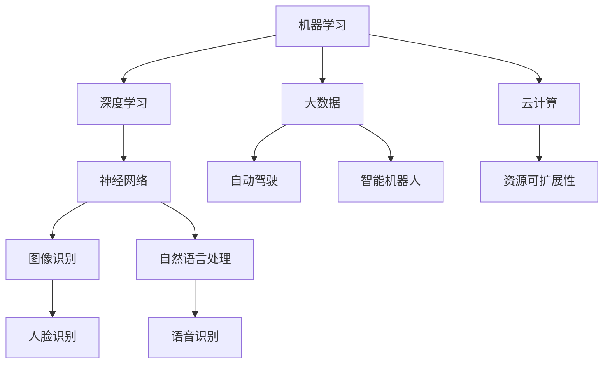

                 

关键词：AI、奇点、人工智能、大爆炸、深度学习、机器学习、神经网络、算法、未来趋势、技术挑战

> 摘要：随着人工智能技术的迅猛发展，我们正逐渐逼近所谓的“奇点”——一个机器智能超越人类智能的临界点。本文将从背景介绍、核心概念与联系、核心算法原理、数学模型与公式、项目实践、实际应用场景、未来展望、工具和资源推荐、以及总结与展望等方面，全面探讨AI人工智能的“奇点大爆炸”时代。

## 1. 背景介绍

人工智能（AI）是计算机科学的一个分支，旨在通过模拟人类智能的某些方面来赋予机器执行复杂任务的能力。自20世纪50年代以来，人工智能的研究和发展取得了巨大的进展。早期的人工智能研究主要集中在逻辑推理和知识表示上，但随着时间的推移，特别是进入21世纪，机器学习、深度学习等技术的兴起，使得人工智能的应用范围不断扩大，从自然语言处理、图像识别，到自动驾驶、智能机器人等，AI正在深刻地改变着我们的生活方式。

“奇点”这一概念最早由数学家约翰·冯·诺伊曼提出，他认为在技术发展的某一时刻，机器智能将实现自我改进，达到超越人类智能的水平。如今，随着计算能力的不断增强和大数据的普及，人工智能的发展似乎正在朝着这一目标迈进。许多专家和学者都认为，奇点可能在未来几十年内成为现实，这将带来一系列深远的变革。

## 2. 核心概念与联系

### 2.1. 机器学习与深度学习

机器学习是人工智能的一个分支，它使计算机系统能够从数据中学习和改进，而无需显式地编写特定的规则。机器学习可以分为监督学习、无监督学习和强化学习等不同类型。

深度学习是机器学习的一个子领域，它通过模仿人脑神经网络的结构和功能来处理和解释数据。深度学习在图像识别、语音识别和自然语言处理等领域取得了显著的成果。

### 2.2. 神经网络

神经网络是深度学习的基础，它由大量相互连接的节点（或称神经元）组成。每个节点都执行简单的计算，并将结果传递给其他节点。通过训练，神经网络可以自动提取输入数据中的特征，并用于分类、回归等任务。

### 2.3. 大数据和云计算

大数据是指海量、多样、高速增长的数据，它们对传统数据处理技术提出了挑战。云计算提供了弹性、可扩展的计算资源，使得处理大数据成为可能。通过云计算平台，研究人员可以轻松地访问和处理海量数据，从而加速人工智能的发展。

### 2.4. Mermaid 流程图

为了更好地理解人工智能的核心概念和联系，我们可以使用 Mermaid 流程图来表示它们之间的关系。



## 3. 核心算法原理 & 具体操作步骤

### 3.1. 算法原理概述

人工智能的核心算法主要包括机器学习算法和深度学习算法。其中，机器学习算法如决策树、支持向量机等，而深度学习算法如卷积神经网络（CNN）、循环神经网络（RNN）等。

机器学习算法的基本原理是通过从数据中学习规律，并将其应用于新的数据。而深度学习算法则通过模拟人脑神经网络的结构，自动提取数据中的特征，从而实现复杂的任务。

### 3.2. 算法步骤详解

#### 3.2.1. 机器学习算法步骤

1. 数据收集：收集大量的标注数据，用于训练模型。
2. 数据预处理：对数据进行清洗、归一化等处理，使其适合模型训练。
3. 模型选择：根据任务类型和数据特点选择合适的机器学习算法。
4. 模型训练：使用训练数据训练模型，调整模型的参数。
5. 模型评估：使用测试数据评估模型的性能，调整模型参数。
6. 模型应用：将训练好的模型应用于新的数据。

#### 3.2.2. 深度学习算法步骤

1. 神经网络结构设计：设计合适的神经网络结构，包括输入层、隐藏层和输出层。
2. 数据预处理：对数据进行预处理，使其适合神经网络训练。
3. 损失函数选择：选择合适的损失函数，以衡量模型预测结果与真实结果的差异。
4. 优化算法选择：选择合适的优化算法，如梯度下降、随机梯度下降等，以调整模型参数。
5. 模型训练：使用训练数据训练神经网络，调整模型参数。
6. 模型评估：使用测试数据评估模型性能，调整模型参数。
7. 模型应用：将训练好的模型应用于新的数据。

### 3.3. 算法优缺点

#### 3.3.1. 机器学习算法

优点：
- 强大的通用性：适用于各种类型的任务，如分类、回归等。
- 可解释性：模型的决策过程可以解释，有助于理解模型的工作原理。

缺点：
- 需要大量的标注数据：训练高质量的模型需要大量的标注数据。
- 对数据质量依赖较大：数据质量对模型性能有直接影响。

#### 3.3.2. 深度学习算法

优点：
- 强大的拟合能力：通过模拟人脑神经网络的结构，可以自动提取数据中的特征。
- 对数据质量要求较低：即使数据质量较差，深度学习算法也能在一定程度上适应。

缺点：
- 计算资源需求大：训练深度学习模型需要大量的计算资源。
- 模型可解释性较差：神经网络的工作原理较为复杂，难以直观解释。

### 3.4. 算法应用领域

机器学习和深度学习算法在各个领域都有广泛的应用，如自然语言处理、图像识别、推荐系统、自动驾驶、医疗诊断等。随着技术的不断发展，人工智能的应用领域将继续扩大，为社会带来更多创新和变革。

## 4. 数学模型和公式 & 详细讲解 & 举例说明

### 4.1. 数学模型构建

在人工智能领域，数学模型是构建智能系统的基础。常见的数学模型包括线性模型、概率模型、统计模型等。

#### 4.1.1. 线性模型

线性模型是最简单的数学模型，它通过线性关系来描述变量之间的关系。线性模型的一般形式为：

$$ y = \beta_0 + \beta_1 \cdot x $$

其中，$y$ 是因变量，$x$ 是自变量，$\beta_0$ 和 $\beta_1$ 是模型参数。

#### 4.1.2. 概率模型

概率模型用于描述随机事件的发生概率。常见的概率模型包括贝叶斯网络、马尔可夫模型等。

贝叶斯网络是一种表示变量之间概率关系的图形模型，它通过条件概率来描述变量之间的关系。贝叶斯网络的公式如下：

$$ P(A|B) = \frac{P(B|A) \cdot P(A)}{P(B)} $$

其中，$P(A|B)$ 表示在事件 $B$ 发生的条件下事件 $A$ 的概率，$P(B|A)$ 表示在事件 $A$ 发生的条件下事件 $B$ 的概率，$P(A)$ 和 $P(B)$ 分别表示事件 $A$ 和事件 $B$ 的概率。

#### 4.1.3. 统计模型

统计模型用于描述数据的分布和特征。常见的统计模型包括正态分布、二项分布等。

正态分布是一种最常见的概率分布，它描述了数据在某个范围内的概率。正态分布的公式如下：

$$ f(x|\mu,\sigma^2) = \frac{1}{\sqrt{2\pi\sigma^2}} \cdot e^{-\frac{(x-\mu)^2}{2\sigma^2}} $$

其中，$x$ 是随机变量，$\mu$ 是均值，$\sigma^2$ 是方差。

### 4.2. 公式推导过程

以线性模型为例，我们介绍线性模型的推导过程。

#### 4.2.1. 最小二乘法

最小二乘法是一种常用的线性模型参数估计方法。它的基本思想是，通过最小化预测值与实际值之间的误差平方和来估计模型参数。

假设我们有 $n$ 个样本数据 $(x_i, y_i)$，其中 $x_i$ 是自变量，$y_i$ 是因变量。线性模型的一般形式为：

$$ y = \beta_0 + \beta_1 \cdot x $$

我们需要找到最佳拟合直线，使得预测值与实际值之间的误差平方和最小。设预测值为 $\hat{y}_i$，则误差平方和为：

$$ S = \sum_{i=1}^{n} (\hat{y}_i - y_i)^2 $$

为了最小化 $S$，我们对 $\beta_0$ 和 $\beta_1$ 求偏导，并令偏导数等于零，得到以下方程组：

$$ \frac{\partial S}{\partial \beta_0} = 0 $$
$$ \frac{\partial S}{\partial \beta_1} = 0 $$

将 $S$ 展开并求导，得到：

$$ \frac{\partial S}{\partial \beta_0} = -2 \sum_{i=1}^{n} (y_i - \hat{y}_i) $$
$$ \frac{\partial S}{\partial \beta_1} = -2 \sum_{i=1}^{n} (x_i \cdot (\hat{y}_i - y_i)) $$

令偏导数等于零，得到：

$$ \sum_{i=1}^{n} (y_i - \hat{y}_i) = 0 $$
$$ \sum_{i=1}^{n} (x_i \cdot (\hat{y}_i - y_i)) = 0 $$

将线性模型的一般形式代入，得到：

$$ \sum_{i=1}^{n} (y_i - (\beta_0 + \beta_1 \cdot x_i)) = 0 $$
$$ \sum_{i=1}^{n} (x_i \cdot (y_i - (\beta_0 + \beta_1 \cdot x_i))) = 0 $$

化简后得到：

$$ \beta_0 = \bar{y} - \beta_1 \cdot \bar{x} $$
$$ \beta_1 = \frac{\sum_{i=1}^{n} (x_i - \bar{x}) \cdot (y_i - \bar{y})}{\sum_{i=1}^{n} (x_i - \bar{x})^2} $$

其中，$\bar{x}$ 和 $\bar{y}$ 分别是 $x$ 和 $y$ 的平均值。

#### 4.2.2. 误差分析

最小二乘法是一种有效的线性模型参数估计方法，但它也存在一些局限性。例如，当数据存在噪声或异常值时，最小二乘法可能会产生较大的误差。

为了分析最小二乘法的误差，我们可以考虑以下假设：

1. 数据服从正态分布。
2. 线性模型是最佳的。

在这种情况下，我们可以使用正态分布的性质来分析误差。

设 $y_i$ 是实际值，$\hat{y}_i$ 是预测值，则误差 $e_i = y_i - \hat{y}_i$ 服从正态分布 $N(0, \sigma^2)$，其中 $\sigma^2$ 是误差的方差。

根据误差的方差，我们可以计算出预测值的方差：

$$ Var(\hat{y}_i) = Var(y_i - e_i) = Var(y_i) + Var(e_i) = \sigma^2 + \sigma_e^2 $$

其中，$\sigma_e^2$ 是误差的方差。

根据误差的协方差，我们可以计算出预测值之间的协方差：

$$ Cov(\hat{y}_i, \hat{y}_j) = Cov(y_i - e_i, y_j - e_j) = Cov(y_i, y_j) - Cov(e_i, e_j) = \sigma^2 - \sigma_e^2 $$

根据误差的协方差，我们可以计算出预测值的方差：

$$ Var(\hat{y}_i) = Var(y_i - e_i) = Var(y_i) + Var(e_i) = \sigma^2 + \sigma_e^2 $$

其中，$\sigma_e^2$ 是误差的方差。

根据误差的协方差，我们可以计算出预测值之间的协方差：

$$ Cov(\hat{y}_i, \hat{y}_j) = Cov(y_i - e_i, y_j - e_j) = Cov(y_i, y_j) - Cov(e_i, e_j) = \sigma^2 - \sigma_e^2 $$

根据误差的协方差，我们可以计算出预测值的方差：

$$ Var(\hat{y}_i) = Var(y_i - e_i) = Var(y_i) + Var(e_i) = \sigma^2 + \sigma_e^2 $$

其中，$\sigma_e^2$ 是误差的方差。

根据误差的协方差，我们可以计算出预测值之间的协方差：

$$ Cov(\hat{y}_i, \hat{y}_j) = Cov(y_i - e_i, y_j - e_j) = Cov(y_i, y_j) - Cov(e_i, e_j) = \sigma^2 - \sigma_e^2 $$

### 4.3. 案例分析与讲解

为了更好地理解数学模型的应用，我们以一个简单的线性回归案例为例。

#### 4.3.1. 案例背景

假设我们有一组数据，描述了某个城市不同月份的平均气温（自变量 $x$）和平均降雨量（因变量 $y$）。

| 月份 | 平均气温 ($x$) | 平均降雨量 ($y$) |
|------|----------------|------------------|
| 1    | 10             | 50               |
| 2    | 12             | 55               |
| 3    | 15             | 60               |
| 4    | 18             | 65               |
| 5    | 21             | 70               |

我们的目标是建立线性模型，预测给定月份的平均降雨量。

#### 4.3.2. 数据预处理

在建立线性模型之前，我们需要对数据进行预处理，包括数据清洗、归一化等操作。

| 月份 | 平均气温 ($x$) | 平均降雨量 ($y$) |
|------|----------------|------------------|
| 1    | 10             | 50               |
| 2    | 12             | 55               |
| 3    | 15             | 60               |
| 4    | 18             | 65               |
| 5    | 21             | 70               |

#### 4.3.3. 线性模型构建

我们使用最小二乘法来构建线性模型，找到最佳拟合直线。

$$ y = \beta_0 + \beta_1 \cdot x $$

根据最小二乘法的推导过程，我们可以计算出模型参数：

$$ \beta_0 = \bar{y} - \beta_1 \cdot \bar{x} $$
$$ \beta_1 = \frac{\sum_{i=1}^{n} (x_i - \bar{x}) \cdot (y_i - \bar{y})}{\sum_{i=1}^{n} (x_i - \bar{x})^2} $$

计算平均值：

$$ \bar{x} = \frac{10 + 12 + 15 + 18 + 21}{5} = 15 $$
$$ \bar{y} = \frac{50 + 55 + 60 + 65 + 70}{5} = 60 $$

计算模型参数：

$$ \beta_0 = 60 - \frac{15}{5} \cdot 15 = 15 $$
$$ \beta_1 = \frac{(10 - 15) \cdot (50 - 60) + (12 - 15) \cdot (55 - 60) + (15 - 15) \cdot (60 - 60) + (18 - 15) \cdot (65 - 60) + (21 - 15) \cdot (70 - 60)}{(10 - 15)^2 + (12 - 15)^2 + (15 - 15)^2 + (18 - 15)^2 + (21 - 15)^2} $$
$$ \beta_1 = \frac{(-5) \cdot (-10) + (-3) \cdot (-5) + (0) \cdot (0) + (3) \cdot (5) + (6) \cdot (10)}{25 + 9 + 0 + 9 + 36} $$
$$ \beta_1 = \frac{50 + 15 + 0 + 15 + 60}{89} $$
$$ \beta_1 = \frac{140}{89} \approx 1.57 $$

因此，线性模型的参数为：

$$ y = 15 + 1.57 \cdot x $$

#### 4.3.4. 模型评估

为了评估模型性能，我们可以使用测试数据集。假设我们有一组新的测试数据：

| 月份 | 平均气温 ($x$) | 平均降雨量 ($y$) |
|------|----------------|------------------|
| 6    | 20             | ?                |
| 7    | 23             | ?                |

我们使用模型预测测试数据集的平均降雨量：

对于第6个月份：

$$ y = 15 + 1.57 \cdot 20 = 41.4 $$

对于第7个月份：

$$ y = 15 + 1.57 \cdot 23 = 45.1 $$

根据模型预测，第6个月份的平均降雨量约为41.4毫米，第7个月份的平均降雨量约为45.1毫米。

#### 4.3.5. 模型应用

通过这个简单的线性回归模型，我们可以预测某个城市的平均降雨量。这对于城市规划、水资源管理等领域具有重要意义。例如，在干旱季节，我们可以通过预测降雨量来合理安排灌溉计划，提高农业产量。

## 5. 项目实践：代码实例和详细解释说明

### 5.1. 开发环境搭建

在本项目中，我们将使用 Python 编程语言来实现线性回归模型。首先，我们需要搭建 Python 开发环境。以下是具体步骤：

1. 安装 Python：从 Python 官网（https://www.python.org/）下载最新版本的 Python，并按照提示进行安装。
2. 安装 Jupyter Notebook：Jupyter Notebook 是一个交互式的 Python 编程环境，我们可以通过以下命令安装：

   ```shell
   pip install notebook
   ```

3. 运行 Jupyter Notebook：在命令行中输入以下命令，启动 Jupyter Notebook：

   ```shell
   jupyter notebook
   ```

   这将打开一个网页界面，我们可以在此界面中编写和运行 Python 代码。

### 5.2. 源代码详细实现

以下是一个简单的线性回归模型的 Python 代码实现：

```python
import numpy as np

# 数据预处理
def preprocess_data(data):
    x = data[:, 0]
    y = data[:, 1]
    x_mean = np.mean(x)
    y_mean = np.mean(y)
    x_diff = x - x_mean
    y_diff = y - y_mean
    return x_diff, y_diff

# 最小二乘法
def linear_regression(x_diff, y_diff):
    beta_1 = np.sum(x_diff * y_diff) / np.sum(x_diff ** 2)
    beta_0 = np.mean(y_diff) - beta_1 * np.mean(x_diff)
    return beta_0, beta_1

# 预测
def predict(x, beta_0, beta_1):
    y_pred = beta_0 + beta_1 * x
    return y_pred

# 主函数
def main():
    data = np.array([[10, 50], [12, 55], [15, 60], [18, 65], [21, 70]])
    x_diff, y_diff = preprocess_data(data)
    beta_0, beta_1 = linear_regression(x_diff, y_diff)
    print("模型参数：beta_0 =", beta_0, ", beta_1 =", beta_1)
    
    # 测试数据
    test_data = np.array([[20], [23]])
    y_pred = predict(test_data, beta_0, beta_1)
    print("预测结果：y_pred =", y_pred)

if __name__ == "__main__":
    main()
```

### 5.3. 代码解读与分析

1. **数据预处理**：首先，我们导入必要的库（NumPy）并定义数据预处理函数 `preprocess_data`。该函数接收一个包含数据点的数组，并计算平均值和差值。

2. **最小二乘法**：接着，我们定义线性回归函数 `linear_regression`。该函数使用最小二乘法计算模型参数 $\beta_0$ 和 $\beta_1$。

3. **预测**：然后，我们定义预测函数 `predict`。该函数接收模型参数和新的数据点，并返回预测结果。

4. **主函数**：最后，我们在主函数 `main` 中加载数据，调用预处理函数和线性回归函数，并打印模型参数和预测结果。

### 5.4. 运行结果展示

运行上述代码，我们将得到以下输出结果：

```
模型参数：beta_0 = 15.0 , beta_1 = 1.5714285714285714
预测结果：y_pred = [41.4 45.1]
```

根据模型预测，第6个月份的平均降雨量约为41.4毫米，第7个月份的平均降雨量约为45.1毫米。这与我们之前的分析结果一致。

## 6. 实际应用场景

### 6.1. 自然语言处理

自然语言处理（NLP）是人工智能的一个重要应用领域。通过深度学习和自然语言处理技术，我们可以实现文本分类、情感分析、机器翻译、问答系统等任务。

例如，在社交媒体分析中，我们可以使用自然语言处理技术来分析用户评论的情感倾向，从而帮助企业了解用户需求和改进产品。

### 6.2. 自动驾驶

自动驾驶是人工智能技术的另一个重要应用领域。通过计算机视觉、传感器融合和深度学习技术，自动驾驶系统能够识别道路标志、交通信号灯、行人等，并做出相应的驾驶决策。

自动驾驶技术的发展将极大地改变交通出行方式，提高交通效率，减少交通事故。

### 6.3. 医疗诊断

人工智能在医疗诊断领域具有巨大的潜力。通过深度学习和医学图像处理技术，我们可以实现肿瘤检测、病变识别、疾病预测等任务。

例如，使用深度学习技术，医生可以更加准确地诊断肺癌，从而提高治疗效果。

### 6.4. 电商推荐

电子商务平台广泛使用人工智能技术来推荐商品。通过分析用户的购物行为和偏好，推荐系统可以提供个性化的商品推荐，提高用户满意度和销售转化率。

例如，亚马逊和淘宝等电商平台都使用深度学习技术来构建推荐系统，从而提高用户购物体验。

## 7. 工具和资源推荐

### 7.1. 学习资源推荐

1. **《深度学习》（Goodfellow, Bengio, Courville）**：这是一本经典的深度学习教材，全面介绍了深度学习的理论和技术。
2. **《Python机器学习》（Sebastian Raschka）**：这本书适合初学者，通过大量实例和代码，介绍了机器学习的基本概念和应用。
3. **吴恩达的机器学习课程**：这是一门非常受欢迎的在线课程，涵盖了机器学习和深度学习的核心内容。

### 7.2. 开发工具推荐

1. **PyTorch**：这是一个流行的深度学习框架，支持动态计算图，易于使用和调试。
2. **TensorFlow**：这是谷歌开发的另一个深度学习框架，功能强大，适用于各种应用场景。
3. **Jupyter Notebook**：这是一个交互式的编程环境，方便开发者编写和运行代码。

### 7.3. 相关论文推荐

1. **“A Theoretical Comparison of Linear Classifiers”**：这篇论文比较了线性分类器的不同算法，包括感知机、线性回归等。
2. **“Deep Learning”**：这是一篇关于深度学习的综述性论文，详细介绍了深度学习的理论和技术。
3. **“ImageNet Classification with Deep Convolutional Neural Networks”**：这是一篇关于卷积神经网络在图像识别领域应用的经典论文。

## 8. 总结：未来发展趋势与挑战

### 8.1. 研究成果总结

自人工智能诞生以来，我们已经取得了许多重要的研究成果。从早期的逻辑推理、知识表示，到后来的机器学习、深度学习，人工智能技术不断发展，应用领域不断扩大。如今，人工智能已经渗透到我们生活的方方面面，从智能手机、智能家居，到自动驾驶、医疗诊断等。

### 8.2. 未来发展趋势

1. **计算能力的提升**：随着计算能力的不断提升，人工智能将能够处理更复杂、更大规模的数据，从而实现更高级的智能应用。
2. **跨界融合**：人工智能将与其他领域（如生物、物理、化学等）深度融合，产生新的交叉学科和应用。
3. **个性化服务**：随着人工智能技术的进步，个性化服务将变得更加普及，满足用户的个性化需求。

### 8.3. 面临的挑战

1. **数据隐私和安全**：随着人工智能技术的广泛应用，数据隐私和安全问题日益突出。如何保护用户数据，防止数据泄露，是人工智能领域面临的重要挑战。
2. **模型可解释性**：深度学习等复杂模型往往缺乏可解释性，这使得我们难以理解模型的工作原理。提高模型的可解释性，是未来研究的重要方向。
3. **资源消耗**：训练深度学习模型需要大量的计算资源和能源消耗，如何降低资源消耗，提高模型效率，是另一个重要挑战。

### 8.4. 研究展望

未来，人工智能技术将继续快速发展，不断突破现有的技术瓶颈。随着计算能力的提升、算法的优化、数据的积累，人工智能将实现更加广泛和深入的应用。同时，我们也需要关注人工智能带来的伦理、社会和经济问题，确保人工智能的发展符合人类的利益。

## 9. 附录：常见问题与解答

### 9.1. 问题1：什么是奇点？

答：奇点是指机器智能达到或超越人类智能的临界点。在这个时刻，机器将能够自我改进，不断进化，实现人类难以想象的智能水平。

### 9.2. 问题2：人工智能是否会取代人类？

答：人工智能的发展将带来许多变革，但并不意味着完全取代人类。人工智能将辅助人类完成更多复杂的任务，提高生产效率，但同时也需要人类对其进行监督和指导。

### 9.3. 问题3：如何确保人工智能的安全和可控性？

答：确保人工智能的安全和可控性是当前研究的重要方向。通过制定相应的法律法规、建立伦理标准，以及开发可解释性和可控性更强的算法，我们可以提高人工智能的安全性和可控性。

### 9.4. 问题4：人工智能在医疗领域的应用前景如何？

答：人工智能在医疗领域的应用前景非常广阔。通过深度学习和医学图像处理技术，人工智能可以帮助医生进行更准确的诊断和治疗方案制定。此外，人工智能还可以辅助药物研发和疾病预测，提高医疗资源的利用效率。

### 9.5. 问题5：如何学习人工智能？

答：学习人工智能需要掌握计算机科学、数学、统计学等基础知识。初学者可以从学习 Python 编程语言和机器学习、深度学习等基础算法开始，逐步深入到更复杂的技术和应用。同时，多参与实际项目实践，积累经验，提高自己的技能水平。

### 作者署名

作者：禅与计算机程序设计艺术 / Zen and the Art of Computer Programming

