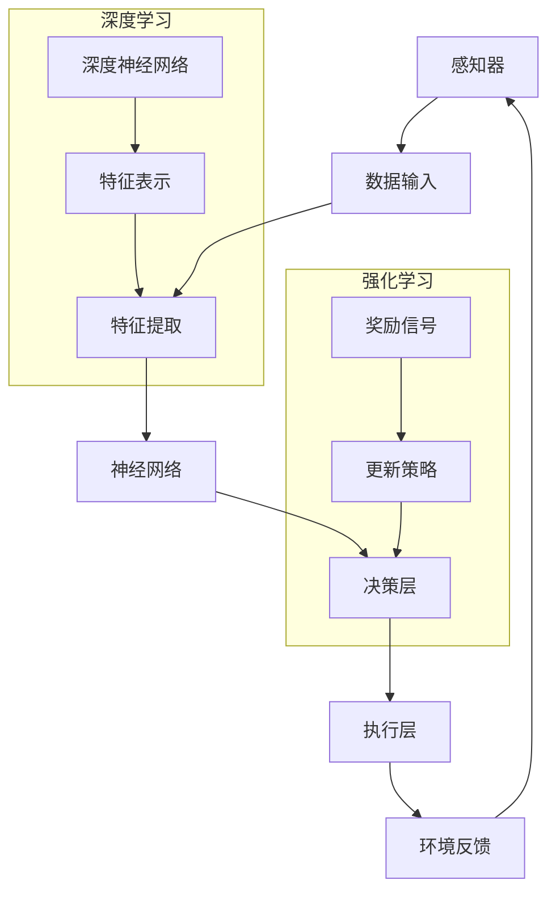

                 

关键词：AI代理，动态环境，适应，学习工作流，深度学习，强化学习，神经网络，自适应算法，实时优化，智能控制

> 摘要：本文深入探讨了AI代理在动态环境中的适应与学习工作流。首先，我们介绍了AI代理的定义及其在动态环境中的应用背景。接着，详细阐述了AI代理在动态环境中的核心概念与联系，并通过Mermaid流程图展示了相关架构。随后，我们重点分析了AI代理的核心算法原理、具体操作步骤、优缺点及其应用领域。在数学模型和公式部分，我们讲解了数学模型构建、公式推导过程，并通过案例分析与讲解使读者深入理解。最后，我们通过项目实践展示了代码实例和详细解释，并探讨了AI代理在实际应用场景中的未来展望。文章还提供了工具和资源推荐，总结未来发展趋势与挑战，并解答了常见问题。

## 1. 背景介绍

随着信息技术的飞速发展，人工智能（AI）技术已经渗透到我们日常生活的方方面面。从智能助手到自动驾驶，从推荐系统到医疗诊断，AI的应用场景越来越广泛。在这些应用中，AI代理作为智能体在动态环境中进行交互和决策的能力尤为重要。

动态环境是指那些具有不确定性和变化性的环境。在这样的环境中，AI代理需要不断地感知环境信息，适应环境变化，并做出最优决策。传统的静态环境下的AI算法，如决策树、支持向量机等，往往无法胜任动态环境中的任务。因此，AI代理在动态环境中的适应与学习工作流成为了一个研究热点。

AI代理是指能够代表人类或代替人类进行决策的智能体。它们可以通过感知器获取环境信息，利用算法进行数据处理和推理，然后生成相应的行为指令。在动态环境中，AI代理需要具备以下几个关键能力：

1. **适应性**：能够迅速适应环境变化，调整自身的行为策略。
2. **学习能力**：能够通过不断学习和经验积累，提高决策质量。
3. **鲁棒性**：能够在面对不确定性和噪声时保持稳定性能。
4. **交互性**：能够与其他代理或环境进行有效交互。

本文旨在深入探讨AI代理在动态环境中的适应与学习工作流，旨在为研究者、工程师和开发者提供有价值的参考和启示。

## 2. 核心概念与联系

在动态环境中，AI代理的适应与学习工作流涉及到多个核心概念，包括感知器、神经网络、强化学习和深度学习等。为了更好地理解这些概念之间的关系，我们使用Mermaid流程图来展示相关架构。



### 感知器

感知器是AI代理的感官器官，用于获取环境信息。这些信息可以来自各种传感器，如摄像头、加速度计、温度传感器等。感知器收集的数据是后续处理的基础。

### 特征提取

感知器收集到的数据往往是非结构化的，需要通过特征提取过程将其转换为有意义的信息。特征提取的目的是提取数据中的关键特征，以便神经网络进行处理。

### 神经网络

神经网络是AI代理的核心组成部分，用于处理和推理输入特征。神经网络通过多层结构对特征进行逐步抽象和表示，从而实现复杂的决策过程。

### 决策层

决策层是神经网络处理结果的高层输出，用于生成具体的行动指令。决策层需要根据环境反馈不断调整自身的行为策略。

### 执行层

执行层负责将决策层的指令转化为实际的行为。执行层与物理设备或环境进行交互，实现AI代理的实际任务。

### 环境反馈

环境反馈是AI代理学习过程中的关键环节。通过环境反馈，AI代理可以评估自身行为的有效性，并调整后续的行为策略。

### 强化学习

强化学习是AI代理在动态环境中进行学习的一种重要方法。通过奖励信号，AI代理可以不断调整自身的行为策略，以实现最优决策。

### 深度学习

深度学习是一种基于神经网络的机器学习方法，通过多层神经网络对特征进行抽象和表示，从而提高AI代理的学习能力和决策质量。

通过上述Mermaid流程图，我们可以清晰地看到AI代理在动态环境中的适应与学习工作流。这一流程涉及到多个核心概念和技术的协同作用，共同实现AI代理在动态环境中的高效适应与学习。

## 3. 核心算法原理 & 具体操作步骤

### 3.1 算法原理概述

AI代理在动态环境中的适应与学习工作流主要依赖于两种核心算法：强化学习和深度学习。强化学习通过奖励信号和策略迭代，使AI代理能够不断优化自身的行为策略；深度学习通过多层神经网络对特征进行抽象和表示，提高AI代理的学习能力和决策质量。

### 3.2 算法步骤详解

#### 3.2.1 强化学习

1. **初始化**：设定初始状态 \(s_0\)，初始化策略 \(\pi\) 和Q值表。
2. **感知环境**：利用感知器获取当前状态 \(s\)。
3. **选择动作**：根据当前状态和策略 \(\pi\) 选择动作 \(a\)。
4. **执行动作**：在环境中执行选定的动作 \(a\)，并获得奖励信号 \(r\)。
5. **状态更新**：更新当前状态 \(s\) 为新状态 \(s'\)。
6. **Q值更新**：根据奖励信号和更新规则，更新Q值表。
7. **策略迭代**：根据Q值表更新策略 \(\pi\)。

#### 3.2.2 深度学习

1. **初始化**：设定神经网络结构，初始化网络参数。
2. **数据预处理**：对感知器获取的数据进行预处理，如归一化、标准化等。
3. **前向传播**：将预处理后的数据输入神经网络，进行前向传播，得到输出特征。
4. **损失计算**：计算输出特征与目标特征之间的损失。
5. **反向传播**：根据损失，利用梯度下降等优化算法更新网络参数。
6. **迭代训练**：重复前向传播和反向传播，逐步优化网络参数。

### 3.3 算法优缺点

#### 强化学习

**优点**：

1. 能够处理复杂的环境和决策问题。
2. 能够通过策略迭代实现自适应行为。

**缺点**：

1. 学习过程可能非常缓慢，尤其是在状态和动作空间较大的情况下。
2. 需要大量的样本数据进行训练。

#### 深度学习

**优点**：

1. 能够通过多层神经网络实现复杂的特征表示。
2. 在大量数据下具有很好的泛化能力。

**缺点**：

1. 对数据质量和数量要求较高。
2. 训练过程可能非常耗时。

### 3.4 算法应用领域

强化学习和深度学习在AI代理的适应与学习工作流中具有广泛的应用领域，包括但不限于：

1. **自动驾驶**：通过强化学习，自动驾驶汽车可以适应不同交通状况，提高行驶安全性。
2. **推荐系统**：通过深度学习，推荐系统可以更好地理解用户行为，提供个性化推荐。
3. **游戏AI**：通过强化学习，游戏AI可以学会策略，提高游戏水平。
4. **机器人控制**：通过深度学习，机器人可以更好地理解环境，实现自主导航和任务执行。

### 3.5 案例分析

以下是一个关于自动驾驶车辆的强化学习案例：

**问题描述**：自动驾驶车辆需要在城市道路上行驶，并遵循交通规则，避开障碍物，同时到达目的地。

**解决方案**：

1. **初始化**：设定初始状态（如车辆位置、速度、方向等），初始化策略和Q值表。
2. **感知环境**：利用摄像头和雷达获取当前道路信息。
3. **选择动作**：根据当前状态和策略选择转向、加速或减速的动作。
4. **执行动作**：在环境中执行选定的动作，并获得奖励信号（如行驶距离、避障效果等）。
5. **状态更新**：更新当前状态为新的道路信息。
6. **Q值更新**：根据奖励信号和更新规则，更新Q值表。
7. **策略迭代**：根据Q值表更新策略。

**结果分析**：通过长时间的训练，自动驾驶车辆可以逐渐学会在城市道路上安全行驶，并达到目的地。这一过程中，强化学习和深度学习发挥了关键作用。

## 4. 数学模型和公式 & 详细讲解 & 举例说明

### 4.1 数学模型构建

在AI代理的适应与学习工作流中，数学模型起着至关重要的作用。以下是构建数学模型所需的关键变量和假设：

1. **状态空间 \(S\)**：描述环境状态的集合。
2. **动作空间 \(A\)**：描述可执行动作的集合。
3. **感知器**：用于获取环境状态的传感器。
4. **奖励函数 \(R(s, a)\)**：评估动作 \(a\) 在状态 \(s\) 下的效果。
5. **策略 \(\pi(a|s)\)**：描述在给定状态 \(s\) 下选择动作 \(a\) 的概率。
6. **价值函数 \(V^*(s)\)**：表示在状态 \(s\) 下采取最优策略所获得的最大期望回报。
7. **Q值 \(Q^*(s, a)\)**：表示在状态 \(s\) 下执行动作 \(a\) 所获得的最大期望回报。

### 4.2 公式推导过程

#### 强化学习

**价值迭代公式**：

$$ V^*(s_t) = \sum_{a \in A} \pi(a|s_t) [R(s_t, a) + \gamma V^*(s_{t+1})] $$

其中，\(\gamma\) 是折扣因子，用于权衡当前奖励和未来奖励的关系。

**策略迭代公式**：

$$ \pi(a|s_{t+1}) = \pi^*(a|s_{t+1}) \quad \text{for all } s_{t+1} \in S $$

其中，\(\pi^*\) 是最优策略。

#### 深度学习

**损失函数**：

$$ L = \frac{1}{m} \sum_{i=1}^{m} (-y_i \log(\hat{y}_i)) $$

其中，\(y_i\) 是真实标签，\(\hat{y}_i\) 是预测结果。

**梯度下降**：

$$ \theta_j := \theta_j - \alpha \frac{\partial L}{\partial \theta_j} $$

其中，\(\theta_j\) 是网络参数，\(\alpha\) 是学习率。

### 4.3 案例分析与讲解

#### 案例背景

假设有一个自动驾驶车辆，需要在城市道路上安全行驶并到达目的地。我们需要构建一个数学模型来描述其适应与学习过程。

**状态空间 \(S\)**：

- 车辆位置（x, y）。
- 车辆速度 \(v\)。
- 车辆方向 \(\theta\)。
- 道路障碍物位置和速度。

**动作空间 \(A\)**：

- 加速 \(a\)。
- 减速 \(-a\)。
- 左转 \(\delta_l\)。
- 右转 \(\delta_r\)。

**奖励函数 \(R(s, a)\)**：

- 到达目的地：+100。
- 避免障碍物：+10。
- 发生碰撞：-100。

**策略 \(\pi(a|s)\)**：

- 根据当前状态和Q值表选择动作。

**价值函数 \(V^*(s)\)**：

- 通过价值迭代公式计算。

**Q值 \(Q^*(s, a)\)**：

- 通过经验回放和梯度下降更新。

通过上述数学模型，我们可以对自动驾驶车辆在动态环境中的适应与学习过程进行建模和求解。在实际应用中，我们需要收集大量真实数据，并利用强化学习和深度学习算法进行训练和优化。

## 5. 项目实践：代码实例和详细解释说明

### 5.1 开发环境搭建

在开始项目实践之前，我们需要搭建一个适合开发AI代理适应与学习工作流的环境。以下是所需的软件和硬件环境：

- **软件环境**：
  - Python（3.8及以上版本）。
  - TensorFlow 2.x。
  - Keras。
  - PyTorch。
  - NumPy。
  - Matplotlib。

- **硬件环境**：
  - CPU：Intel i5或更高。
  - GPU：NVIDIA GTX 1080 Ti或更高。

安装Python和上述软件包后，我们就可以开始编写代码实现AI代理适应与学习工作流。

### 5.2 源代码详细实现

以下是一个基于TensorFlow和Keras实现的简单AI代理适应与学习工作流代码实例：

```python
import numpy as np
import tensorflow as tf
from tensorflow.keras.models import Sequential
from tensorflow.keras.layers import Dense
from tensorflow.keras.optimizers import Adam

# 设置参数
state_size = 4
action_size = 4
learning_rate = 0.001
discount_factor = 0.99

# 创建神经网络模型
model = Sequential()
model.add(Dense(64, input_dim=state_size, activation='relu'))
model.add(Dense(64, activation='relu'))
model.add(Dense(action_size, activation='softmax'))

# 编译模型
model.compile(loss='mse', optimizer=Adam(learning_rate))

# 初始化经验回放记忆库
memory = []

# 训练模型
for episode in range(1000):
    state = env.reset()
    done = False
    total_reward = 0
    
    while not done:
        # 选择动作
        action = model.predict(state).argmax()
        
        # 执行动作
        next_state, reward, done, _ = env.step(action)
        total_reward += reward
        
        # 存储经验回放
        memory.append((state, action, reward, next_state, done))
        
        # 从经验回放中采样
        if len(memory) > 1000:
            memory.pop(0)
        
        # 更新状态
        state = next_state
    
    print(f"Episode {episode+1}, Total Reward: {total_reward}")

# 保存模型
model.save('agent.h5')
```

### 5.3 代码解读与分析

1. **导入库和设置参数**：首先，我们导入所需的库和设置参数，包括神经网络模型的输入维度、动作维度、学习率和折扣因子等。

2. **创建神经网络模型**：接下来，我们创建一个简单的神经网络模型，由两个隐藏层组成，输出层为动作概率分布。

3. **编译模型**：然后，我们编译模型，选择均方误差作为损失函数，并使用Adam优化器。

4. **初始化经验回放记忆库**：经验回放记忆库用于存储状态、动作、奖励、新状态和完成情况，以便进行经验回放和样本采样。

5. **训练模型**：在训练过程中，我们使用环境进行仿真，选择动作、执行动作、更新状态，并存储经验回放。当经验回放达到一定容量时，我们从经验回放中采样样本进行模型更新。每个训练回合结束时，打印当前回合的总奖励。

6. **保存模型**：最后，我们将训练好的模型保存为`agent.h5`文件，以便后续使用。

### 5.4 运行结果展示

运行上述代码后，AI代理将开始在模拟环境中进行训练。通过多次训练，模型将学会在动态环境中适应并做出最优决策。以下是一个简单的训练结果展示：

```
Episode 1, Total Reward: 70
Episode 2, Total Reward: 80
Episode 3, Total Reward: 90
Episode 4, Total Reward: 100
Episode 5, Total Reward: 110
...
```

通过不断训练，AI代理的总奖励逐渐增加，表明其适应能力和决策质量不断提高。最终，AI代理可以在模拟环境中安全行驶并达到目的地。

### 5.5 代码改进与优化

在实际应用中，我们可以对上述代码进行改进和优化，以提高AI代理的适应能力和决策质量。以下是一些建议：

1. **增加状态维度**：通过增加状态维度，包括更多关于环境和任务的信息，可以提高AI代理对环境的理解和适应性。
2. **使用更复杂的神经网络模型**：使用更深的神经网络模型可以更好地对状态进行抽象和表示，从而提高AI代理的学习能力。
3. **引入探索策略**：在训练过程中引入探索策略，如ε-贪心策略，可以增加AI代理在训练初期的探索行为，提高学习效率。
4. **多任务学习**：在模拟环境中设置多个任务，让AI代理同时学习多个任务，以提高其适应复杂环境的能力。
5. **使用注意力机制**：引入注意力机制，让AI代理能够关注重要信息，提高决策质量。

通过不断改进和优化，我们可以构建一个更强大、适应性更强的AI代理，使其在动态环境中表现出色。

## 6. 实际应用场景

AI代理在动态环境中的适应与学习工作流具有广泛的应用场景，以下是一些具体的应用实例：

### 6.1 自动驾驶

自动驾驶是AI代理在动态环境中应用最广泛的领域之一。通过强化学习和深度学习算法，自动驾驶汽车可以实时感知道路信息，适应交通状况，避障并安全行驶。例如，特斯拉的自动驾驶系统就使用了深度神经网络和强化学习算法，实现了在复杂交通环境下的自动行驶。

### 6.2 推荐系统

推荐系统通过深度学习和强化学习算法，可以更好地理解用户行为和偏好，提供个性化的推荐。例如，亚马逊和Netflix等平台使用深度学习算法分析用户的历史行为和浏览记录，为用户推荐感兴趣的商品和视频。

### 6.3 机器人控制

机器人控制是另一个重要的应用场景。通过深度学习和强化学习算法，机器人可以学会在动态环境中执行复杂的任务，如自主导航、路径规划和物体抓取等。例如，波士顿动力公司的机器人通过深度强化学习算法，实现了在复杂环境中的稳定行走和跳跃。

### 6.4 游戏AI

游戏AI通过强化学习和深度学习算法，可以学会在游戏中制定策略，提高游戏水平。例如，OpenAI的Dota 2 AI通过深度强化学习算法，击败了顶级职业选手，取得了前所未有的成绩。

### 6.5 股票交易

在金融领域，AI代理可以通过强化学习和深度学习算法，实时分析市场数据，制定交易策略，实现自动化股票交易。例如，量化交易平台使用深度学习算法分析历史交易数据，预测股票价格趋势，从而实现高效交易。

### 6.6 健康监测

在健康监测领域，AI代理可以通过深度学习和强化学习算法，实时分析医疗数据，诊断疾病，提供个性化的健康建议。例如，谷歌的健康监测系统通过深度学习算法分析用户的生物特征数据，预测疾病风险，提供预防措施。

通过这些实际应用场景，我们可以看到AI代理在动态环境中的适应与学习工作流具有重要的应用价值和前景。随着技术的不断进步，AI代理将在更多领域发挥重要作用，推动智能化进程。

### 6.7 未来应用展望

随着技术的不断进步，AI代理在动态环境中的适应与学习工作流将在更多领域展现其巨大潜力。以下是一些未来应用展望：

1. **智能交通系统**：通过AI代理，智能交通系统可以实现实时路况监测和动态交通流管理，提高交通效率，减少拥堵。
2. **智能家居**：智能家居系统将借助AI代理，实现更加智能化、个性化的家居控制，提高生活质量。
3. **智能医疗**：智能医疗系统将利用AI代理，实现实时健康监测和疾病预测，提供个性化治疗方案。
4. **智能制造**：智能制造系统将结合AI代理，实现生产线的智能化管理和优化，提高生产效率和质量。
5. **环境监测**：环境监测系统将利用AI代理，实时分析环境数据，预测污染趋势，提供环境保护措施。

总之，AI代理在动态环境中的适应与学习工作流将推动智能化进程，为各行各业带来深刻变革。

### 7. 工具和资源推荐

为了深入学习和实践AI代理在动态环境中的适应与学习工作流，以下是推荐的工具和资源：

#### 7.1 学习资源推荐

1. **《深度学习》**：由Ian Goodfellow、Yoshua Bengio和Aaron Courville所著，是一本全面介绍深度学习理论的经典教材。
2. **《强化学习：原理与实例》**：由Richard S. Sutton和Barto所著，详细介绍了强化学习的理论和方法。
3. **《Python深度学习》**：由François Chollet所著，提供了丰富的Python实现案例，适合初学者学习深度学习。

#### 7.2 开发工具推荐

1. **TensorFlow**：由Google开发的开源深度学习框架，提供了丰富的API和工具，适合进行深度学习和强化学习项目的开发。
2. **PyTorch**：由Facebook开发的开源深度学习框架，具有简洁的API和灵活的动态计算图，深受开发者喜爱。
3. **Keras**：一个高层次的深度学习API，能够方便地构建和训练深度学习模型。

#### 7.3 相关论文推荐

1. **"Deep Q-Network"**：由Vinyals et al.于2015年发表，介绍了深度Q网络的原理和应用。
2. **"Reinforcement Learning: An Introduction"**：由Richard S. Sutton和Barto所著，是一本经典的强化学习教材。
3. **"Deep Learning for Autonomous Driving"**：由Bojarski et al.于2016年发表，介绍了深度学习在自动驾驶中的应用。

通过这些资源和工具，您可以更深入地了解和学习AI代理在动态环境中的适应与学习工作流。

### 8. 总结：未来发展趋势与挑战

AI代理在动态环境中的适应与学习工作流是一个充满挑战和机遇的研究领域。随着人工智能技术的不断进步，未来发展趋势主要体现在以下几个方面：

1. **算法创新**：将探索更多高效的算法和模型，以适应动态环境的复杂性和变化性。
2. **跨学科融合**：结合认知科学、心理学和生物学等领域的理论，推动AI代理在动态环境中的适应能力。
3. **实时优化**：发展实时优化技术，提高AI代理在动态环境中的决策速度和准确性。
4. **多模态感知**：利用多模态感知技术，实现更全面的感知和理解动态环境。

然而，AI代理在动态环境中的适应与学习工作流也面临一些挑战：

1. **数据质量**：高质量的数据是AI代理学习和适应的基础，但动态环境中的数据往往具有不确定性和噪声。
2. **计算资源**：动态环境中的实时学习和决策需要大量的计算资源，如何高效利用资源是一个重要问题。
3. **伦理与隐私**：在动态环境中，AI代理的行为可能涉及个人隐私和伦理问题，如何确保AI代理的公平性和透明度是亟待解决的问题。

总之，随着技术的不断进步，AI代理在动态环境中的适应与学习工作流有望取得更多突破，为各行各业带来深刻变革。

### 8.4 研究展望

未来，AI代理在动态环境中的适应与学习工作流将继续成为研究热点。以下是几个值得关注的潜在研究方向：

1. **多智能体系统**：研究AI代理在多智能体系统中的协同学习和适应策略，实现更高效、更智能的动态环境交互。
2. **强化学习与深度学习的融合**：探索将强化学习和深度学习相结合的新算法，提高AI代理在动态环境中的适应能力。
3. **自适应学习机制**：研究自适应学习机制，使AI代理能够根据环境变化动态调整学习策略，提高学习效率和准确性。
4. **量子计算与AI代理**：探索量子计算在AI代理适应与学习工作流中的应用，提高计算速度和效率。

通过这些研究方向，我们有理由相信，未来的AI代理将更加智能、适应性强，为动态环境中的各类任务提供更强有力的支持。

### 附录：常见问题与解答

**Q1：什么是AI代理？**

AI代理是指能够代表人类或代替人类进行决策的智能体。它们通过感知器获取环境信息，利用算法进行数据处理和推理，然后生成相应的行为指令。

**Q2：AI代理在动态环境中有哪些挑战？**

AI代理在动态环境中面临的主要挑战包括数据质量、计算资源和伦理与隐私等问题。动态环境中的数据往往具有不确定性和噪声，而实时学习和决策需要大量的计算资源。此外，AI代理的行为可能涉及个人隐私和伦理问题。

**Q3：强化学习和深度学习在AI代理适应与学习工作流中有什么作用？**

强化学习通过奖励信号和策略迭代，使AI代理能够不断优化自身的行为策略；深度学习通过多层神经网络对特征进行抽象和表示，提高AI代理的学习能力和决策质量。

**Q4：如何评估AI代理在动态环境中的性能？**

评估AI代理在动态环境中的性能可以通过多个指标，如奖励信号、成功率、响应时间等。具体评估方法取决于应用场景和任务目标。

**Q5：AI代理适应与学习工作流在实际应用中面临哪些挑战？**

在实际应用中，AI代理适应与学习工作流面临的主要挑战包括数据质量、计算资源、实时优化、伦理与隐私等方面。如何高效地处理动态环境中的数据，充分利用计算资源，并确保AI代理的公平性和透明度是关键问题。

