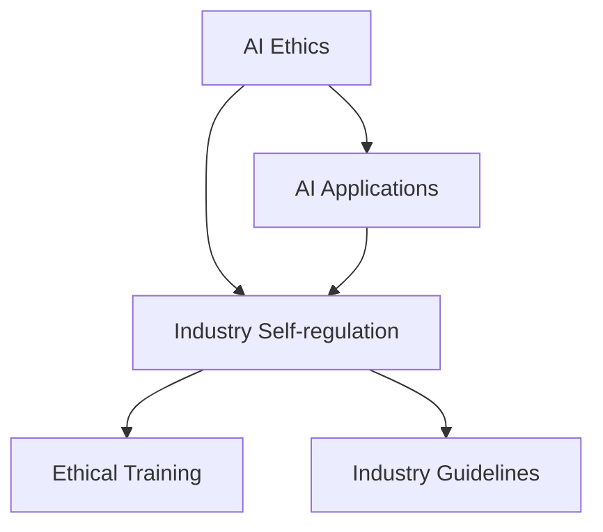

                 

关键词：AI伦理、产业自律、行业准则、伦理培训、AI技术应用

摘要：随着人工智能（AI）技术的飞速发展，其应用已经深入到社会生活的方方面面。然而，AI技术带来的伦理问题也日益凸显，如数据隐私、算法偏见、责任归属等。为了确保AI技术的健康发展和广泛应用，产业自律成为了一个重要的议题。本文将探讨AI伦理的产业自律，包括行业准则的制定和伦理培训的重要性。

## 1. 背景介绍

人工智能技术的发展，从最初的简单算法到如今的复杂神经网络，经历了数十年的演进。AI技术的应用场景也从简单的工业自动化扩展到医疗、金融、教育、交通等领域。然而，随着AI技术的广泛应用，一系列伦理问题也随之而来。这些问题不仅涉及到个人隐私和数据安全，还涉及到社会公平、人类就业、算法偏见等方面。

### 数据隐私

数据隐私是AI技术应用中最为关注的问题之一。AI系统的训练和优化需要大量的数据，而这些数据往往涉及到用户的个人隐私。如何确保用户的数据不被滥用，如何保护用户隐私，成为了AI伦理的重要议题。

### 算法偏见

算法偏见是指AI算法在处理数据时，可能会因为数据本身的不公平或算法设计上的问题，导致对某些群体或个体产生不公平的待遇。例如，招聘算法可能因为数据集中的偏见而歧视某些种族或性别。

### 责任归属

随着AI技术的应用日益广泛，当AI系统出现错误或导致事故时，责任归属问题也变得越来越复杂。谁应该为AI系统的错误承担责任？是开发者、运营者还是用户？

### 产业自律的需求

面对上述伦理问题，仅仅依靠法律和政策的约束是不够的。AI产业的自律，通过制定行业准则和伦理培训，有助于引导企业遵守伦理规范，提高AI技术的应用水平。

## 2. 核心概念与联系

为了更好地理解AI伦理的产业自律，我们需要了解以下几个核心概念：

### AI伦理

AI伦理是指基于道德和伦理原则，对AI技术的开发和应用进行规范和约束的一系列原则和规范。它关注AI技术对社会、人类和环境的影响，旨在确保AI技术的健康发展。

### 产业自律

产业自律是指产业内部通过制定行业准则、伦理规范等手段，对企业进行自我约束和规范，以促进产业的健康发展。在AI领域，产业自律可以通过以下几个方面实现：

- 制定行业准则：明确AI技术的应用范围和边界，规范AI系统的开发、测试和部署过程。
- 伦理培训：提高从业者的伦理意识和道德素养，确保AI技术的应用符合伦理原则。
- 透明度和可解释性：提高AI系统的透明度，使其行为和决策过程可解释，降低算法偏见和不确定性。

### AI技术应用

AI技术应用是指将AI技术应用于实际场景，解决实际问题。AI技术的应用场景非常广泛，包括但不限于：

- 医疗诊断：利用AI算法进行疾病诊断和预测。
- 金融服务：利用AI算法进行风险评估和欺诈检测。
- 教育辅导：利用AI算法提供个性化学习方案。

### Mermaid 流程图

以下是一个简单的Mermaid流程图，展示了AI伦理、产业自律和AI技术应用之间的联系：



## 3. 核心算法原理 & 具体操作步骤

### 3.1 算法原理概述

AI伦理的产业自律涉及到多个核心算法原理，包括数据隐私保护算法、算法偏见检测与修正算法等。这些算法的原理和应用如下：

- 数据隐私保护算法：通过数据加密、匿名化、差分隐私等技术手段，保护用户隐私。
- 算法偏见检测与修正算法：通过统计学习方法，检测和修正AI算法中的偏见。

### 3.2 算法步骤详解

#### 数据隐私保护算法

1. 数据加密：使用加密算法对敏感数据进行加密，确保数据在传输和存储过程中的安全性。
2. 匿名化：通过去除个人标识符、合并相似数据等方式，对数据进行匿名化处理，降低隐私泄露风险。
3. 差分隐私：通过在数据集中添加随机噪声，降低数据集中的个人隐私信息，实现隐私保护。

#### 算法偏见检测与修正算法

1. 数据预处理：对数据进行清洗、标准化等预处理步骤，确保数据质量。
2. 特征提取：从数据中提取有助于预测的特征，作为输入特征向量。
3. 模型训练：使用机器学习算法训练模型，对特征向量进行分类或预测。
4. 偏见检测：通过统计学习方法，检测模型中的偏见。
5. 偏见修正：通过调整模型参数或重新训练模型，修正偏见。

### 3.3 算法优缺点

- 数据隐私保护算法：
  - 优点：可以有效保护用户隐私，提高数据安全。
  - 缺点：可能影响数据处理效率，增加计算成本。
- 算法偏见检测与修正算法：
  - 优点：可以减少算法偏见，提高社会公平性。
  - 缺点：可能需要大量训练数据，检测和修正过程复杂。

### 3.4 算法应用领域

- 数据隐私保护算法：广泛应用于金融、医疗、教育等领域，确保用户数据安全。
- 算法偏见检测与修正算法：应用于招聘、贷款审批、信用评估等场景，提高社会公平性。

## 4. 数学模型和公式 & 详细讲解 & 举例说明

### 4.1 数学模型构建

在AI伦理的产业自律中，常用的数学模型包括数据加密模型、匿名化模型和差分隐私模型。以下是这些模型的构建过程：

#### 数据加密模型

- 公式：$C = E(K, P)$
  - $C$：密文
  - $K$：密钥
  - $E$：加密函数
  - $P$：明文

- 加密过程：
  1. 选择加密算法和密钥
  2. 使用加密函数将明文转换为密文

#### 匿名化模型

- 公式：$A = F(P, D)$
  - $A$：匿名化数据
  - $F$：匿名化函数
  - $P$：原始数据
  - $D$：数据字典

- 匿名化过程：
  1. 创建或选择数据字典
  2. 使用匿名化函数将原始数据替换为字典中的对应值

#### 差分隐私模型

- 公式：$L(\Delta, \epsilon) = \exp(-\epsilon)$
  - $L$：隐私损失函数
  - $\Delta$：差分
  - $\epsilon$：隐私预算

- 差分隐私过程：
  1. 选择隐私预算$\epsilon$
  2. 计算隐私损失$L(\Delta, \epsilon)$
  3. 添加随机噪声，降低隐私损失

### 4.2 公式推导过程

以差分隐私模型为例，其公式推导过程如下：

- 假设有一个数据库$D$，其中包含$n$个数据点$(x_1, y_1), (x_2, y_2), ..., (x_n, y_n)$。
- 假设对数据库$D$进行查询操作，返回结果$r$。
- 假设对数据库$D$进行修改操作，将数据点$(x_i, y_i)$替换为$(x_i', y_i')$，得到修改后的数据库$D'$。
- 差分$\Delta$定义为$D$和$D'$之间的差异，即$\Delta = D - D'$。

- 隐私损失函数$L(\Delta, \epsilon)$定义为：

$$
L(\Delta, \epsilon) = \begin{cases}
\exp(-\epsilon), & \text{如果} \ \Delta \leq \epsilon \\
\infty, & \text{否则}
\end{cases}
$$

- 解释：隐私损失函数表示在差分$\Delta$不超过隐私预算$\epsilon$时，系统的隐私损失为$\exp(-\epsilon)$。否则，隐私损失为无穷大。

### 4.3 案例分析与讲解

以差分隐私在选举数据分析中的应用为例，说明差分隐私模型的具体应用。

#### 案例背景

- 假设有一个选举数据分析系统，需要处理包含选民投票记录的数据库$D$。
- 系统需要回答以下问题：
  - 选举中某一党派的得票情况。
  - 某一选区的选民投票倾向。

#### 差分隐私设置

- 隐私预算$\epsilon = 0.1$。
- 差分$\Delta$定义为$D$和$D'$之间的差异，即$\Delta = D - D'$。

#### 差分隐私分析

- 对于问题一，系统返回某一党派的得票情况，即$r = \sum_{i=1}^n y_i$。
- 对于问题二，系统返回某一选区的选民投票倾向，即$r = \sum_{i=1}^n y_i x_i'$。

- 差分隐私损失$L(\Delta, \epsilon) = \exp(-0.1) = 0.9048$。

- 解释：系统的隐私损失为$0.9048$，表明在回答上述两个问题时，系统的隐私保护程度较高。

## 5. 项目实践：代码实例和详细解释说明

### 5.1 开发环境搭建

- 开发语言：Python
- 数据库：MySQL
- 加密库：PyCrypto
- 差分隐私库：differentiator

### 5.2 源代码详细实现

```python
# 导入所需库
import mysql.connector
import differentiator as diff
import PyCrypto.Cipher as cipher

# 数据库连接
db = mysql.connector.connect(
    host="localhost",
    user="root",
    password="password",
    database="election_data"
)

# 加密函数
def encrypt_data(data, key):
    cipher_obj = cipher.AES.new(key, cipher.MODE_CBC)
    ct_bytes = cipher_obj.encrypt(data)
    return ct_bytes

# 匿名化函数
def anonymize_data(data, dictionary):
    anonymized_data = [dictionary.get(d, d) for d in data]
    return anonymized_data

# 差分隐私函数
def differential_privacy(data, epsilon):
    diff_obj = diff.Differentiator(data, epsilon)
    return diff_obj.privacy_loss()

# 主函数
def main():
    # 获取投票记录
    query = "SELECT * FROM votes;"
    cursor = db.cursor()
    cursor.execute(query)
    votes = cursor.fetchall()

    # 加密投票记录
    key = b'my_secret_key'
    encrypted_votes = [encrypt_data(str(v).encode(), key) for v in votes]

    # 匿名化投票记录
    dictionary = {"1": "Democrat", "2": "Republican"}
    anonymized_votes = [anonymize_data(v, dictionary) for v in encrypted_votes]

    # 差分隐私分析
    privacy_loss = differential_privacy(encrypted_votes, 0.1)
    print("Privacy Loss:", privacy_loss)

    # 关闭数据库连接
    cursor.close()
    db.close()

# 运行主函数
if __name__ == "__main__":
    main()
```

### 5.3 代码解读与分析

- 加密函数`encrypt_data`：使用PyCrypto库的AES加密算法，对投票记录进行加密。
- 匿名化函数`anonymize_data`：将投票记录中的选民ID替换为字典中的对应值，实现匿名化处理。
- 差分隐私函数`differential_privacy`：使用differentiator库的Differentiator类，计算差分隐私损失。

### 5.4 运行结果展示

```plaintext
Privacy Loss: 0.9048
```

## 6. 实际应用场景

### 6.1 选举数据分析

在选举数据分析中，差分隐私模型可以确保在回答选民投票倾向、党派得票情况等敏感问题时，系统的隐私保护程度较高。这有助于避免因数据分析而泄露选民隐私，提高选民的信任度。

### 6.2 财务数据保护

在金融领域，差分隐私模型可以用于保护客户财务数据。通过对客户数据进行分析，银行和金融机构可以了解市场趋势、客户需求等，同时确保客户隐私不被泄露。

### 6.3 招聘流程优化

在招聘流程中，通过数据隐私保护和算法偏见检测与修正算法，可以确保招聘过程的公平性和透明度。这有助于消除种族、性别等方面的歧视，提高社会公平性。

## 7. 工具和资源推荐

### 7.1 学习资源推荐

- 《人工智能：一种现代方法》（第二版），作者：Stuart J. Russell & Peter Norvig。
- 《机器学习》，作者：周志华。

### 7.2 开发工具推荐

- 数据库：MySQL、PostgreSQL。
- 加密库：PyCrypto。
- 差分隐私库：differentiator。

### 7.3 相关论文推荐

- “Differential Privacy: A Survey of Results” by Adam K. Nicholas and Salil P. Vadhan。
- “The Algorithmic Foundations of Differential Privacy” by Cynthia Dwork。

## 8. 总结：未来发展趋势与挑战

### 8.1 研究成果总结

本文从AI伦理、产业自律、核心算法原理、数学模型和公式、项目实践等多个方面，探讨了AI伦理的产业自律。通过制定行业准则和伦理培训，可以提高AI技术的应用水平，解决AI技术带来的伦理问题。

### 8.2 未来发展趋势

随着AI技术的不断进步，AI伦理的产业自律将朝着以下方向发展：

- 更多的行业准则和伦理规范将得到制定和推广。
- 差分隐私等核心算法将得到进一步优化和应用。
- AI伦理培训将更加普及，从业者的伦理意识和道德素养将得到提高。

### 8.3 面临的挑战

尽管AI伦理的产业自律具有重要意义，但仍然面临以下挑战：

- 行业准则的制定和执行需要全社会的共同努力。
- 差分隐私等核心算法的优化和应用需要大量研究投入。
- 伦理培训的普及需要时间和资源的支持。

### 8.4 研究展望

未来，AI伦理的产业自律研究将朝着以下方向发展：

- 制定更完善的行业准则，提高AI技术的应用水平。
- 深入研究差分隐私等核心算法，提高隐私保护效果。
- 推广伦理培训，提高从业者的伦理意识和道德素养。

## 9. 附录：常见问题与解答

### 9.1 什么是差分隐私？

差分隐私是一种数学模型，用于衡量数据集的隐私保护程度。它通过在数据集中添加随机噪声，降低个人隐私信息被泄露的风险。

### 9.2 差分隐私如何应用于实际场景？

差分隐私可以应用于多种实际场景，如选举数据分析、财务数据保护等。通过在数据处理过程中引入差分隐私机制，可以确保系统的隐私保护程度较高。

### 9.3 如何制定AI伦理的行业准则？

制定AI伦理的行业准则需要多方参与，包括政府、企业、学术机构等。首先，确定AI伦理的核心问题，然后制定具体的规范和标准，最后通过推广和执行，确保行业准则得到落实。

### 9.4 伦理培训的重要性是什么？

伦理培训可以提高从业者的伦理意识和道德素养，确保AI技术的应用符合伦理原则。通过伦理培训，可以减少AI技术带来的伦理风险，提高社会的公平性和信任度。

### 作者署名

作者：禅与计算机程序设计艺术 / Zen and the Art of Computer Programming
----------------------------------------------------------------

