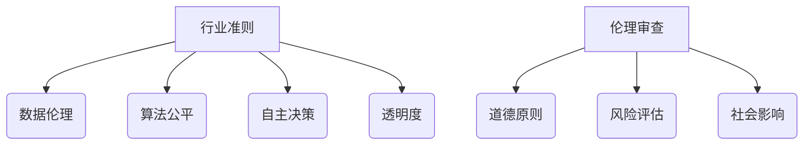

                 

关键词：AI伦理、产业自律、行业准则、伦理审查、人工智能技术

摘要：随着人工智能技术的迅速发展，AI伦理问题日益突出，成为业界广泛关注的话题。本文旨在探讨AI伦理的产业自律机制，包括行业准则和伦理审查的重要性，以及如何构建有效的伦理审查机制。通过分析行业准则和伦理审查的核心概念、原理和具体操作步骤，本文为人工智能产业提供了有益的指导。

## 1. 背景介绍

近年来，人工智能（AI）技术在各个领域取得了显著的成果，从自动驾驶、智能医疗到金融科技、智能客服，AI已经深刻地改变了我们的生活方式。然而，AI技术的快速发展也带来了诸多伦理问题，如数据隐私、算法歧视、自主决策等。这些问题不仅关系到人工智能技术的可持续发展，更关乎社会的公平与正义。

为了应对这些挑战，各国政府和业界纷纷提出AI伦理的产业自律机制。这一机制旨在通过制定行业准则和实施伦理审查，规范AI技术的研发和应用，确保其符合道德和法律标准。本文将从行业准则和伦理审查的角度，探讨AI伦理的产业自律机制，为我国人工智能产业的健康发展提供参考。

## 2. 核心概念与联系

### 2.1 行业准则

行业准则是指在一定行业内，由相关机构或组织制定的、旨在规范行业行为和促进行业发展的行为规范。在人工智能领域，行业准则主要包括以下几个方面：

1. 数据伦理：确保数据处理过程符合隐私保护和数据安全的要求。
2. 算法公平：避免算法歧视，确保算法结果对所有人公平。
3. 自主决策：明确AI系统的自主决策范围和责任。
4. 透明度：确保AI系统的设计和运行过程具有可解释性。

### 2.2 伦理审查

伦理审查是指对某一科研项目、产品或服务在伦理方面的合规性进行评估的过程。在人工智能领域，伦理审查主要涉及以下几个方面：

1. 道德原则：评估项目或产品的道德标准是否符合伦理要求。
2. 风险评估：评估项目或产品可能带来的风险，如数据隐私、算法歧视等。
3. 社会影响：评估项目或产品对社会的潜在影响，如就业、社会公平等。

### 2.3 Mermaid 流程图



## 3. 核心算法原理 & 具体操作步骤

### 3.1 算法原理概述

AI伦理的产业自律机制主要依赖于两个核心算法：伦理审查算法和行业准则匹配算法。

伦理审查算法主要用于评估项目或产品的伦理合规性，通过分析道德原则、风险评估和社会影响等方面，判断其是否符合伦理要求。

行业准则匹配算法主要用于将AI项目或产品与行业准则进行匹配，识别出可能存在的伦理问题，并提出相应的改进建议。

### 3.2 算法步骤详解

#### 3.2.1 伦理审查算法

1. 输入项目或产品信息，包括道德原则、风险评估和社会影响等方面。
2. 分析道德原则，判断项目或产品是否符合伦理要求。
3. 分析风险评估，识别可能存在的风险，如数据隐私、算法歧视等。
4. 分析社会影响，评估项目或产品对社会的潜在影响。
5. 综合分析结果，给出伦理审查结论。

#### 3.2.2 行业准则匹配算法

1. 输入AI项目或产品信息，包括数据伦理、算法公平、自主决策和透明度等方面。
2. 将项目或产品与行业准则进行匹配，识别出可能存在的伦理问题。
3. 对识别出的伦理问题进行分类和优先级排序。
4. 提出相应的改进建议，以符合行业准则。

### 3.3 算法优缺点

#### 3.3.1 伦理审查算法

优点：
- 全面性：能够从道德原则、风险评估和社会影响等多个角度对项目或产品进行评估。
- 可解释性：通过算法步骤和结果，用户可以清晰地了解伦理审查的过程和结论。

缺点：
- 复杂性：涉及多个领域的知识和技能，实施难度较大。
- 时效性：随着AI技术的发展，伦理审查标准可能需要不断更新。

#### 3.3.2 行业准则匹配算法

优点：
- 简便性：通过匹配算法，快速识别出项目或产品中可能存在的伦理问题。
- 实用性：为改进建议提供了明确的指导方向。

缺点：
- 可能存在误判：在匹配过程中，可能会误判某些伦理问题。
- 需要不断更新：随着行业准则的调整，匹配算法也需要相应更新。

### 3.4 算法应用领域

伦理审查算法和行业准则匹配算法主要应用于以下领域：

1. 科研项目：在AI项目立项前进行伦理审查，确保项目符合伦理要求。
2. 产品开发：在AI产品开发过程中，通过行业准则匹配算法识别伦理问题，提出改进建议。
3. 政策制定：为政府制定AI伦理政策提供参考依据。

## 4. 数学模型和公式 & 详细讲解 & 举例说明

### 4.1 数学模型构建

伦理审查和行业准则匹配算法的核心在于建立数学模型，对伦理问题进行量化评估。以下是构建数学模型的基本步骤：

1. 定义伦理评价指标：包括道德原则、风险评估和社会影响等方面。
2. 确定评价指标的权重：根据实际情况，为每个评价指标分配权重。
3. 建立伦理评分模型：将评价指标转化为具体的评分值，用于评估项目或产品的伦理合规性。
4. 建立行业准则匹配模型：将项目或产品与行业准则进行匹配，识别出可能存在的伦理问题。

### 4.2 公式推导过程

假设伦理评价指标有 \( n \) 个，分别为 \( x_1, x_2, \ldots, x_n \)，权重分别为 \( w_1, w_2, \ldots, w_n \)。则伦理评分模型可以表示为：

\[ S = w_1x_1 + w_2x_2 + \ldots + w_nx_n \]

其中，\( S \) 为伦理评分，表示项目或产品的伦理合规性。为方便计算，可以将其转化为百分制：

\[ S_{\text{百分制}} = \frac{S}{\max(S)} \times 100\% \]

### 4.3 案例分析与讲解

假设我们有一个AI项目，涉及数据伦理、算法公平和自主决策三个方面。根据实际情况，我们可以为这三个指标分配权重如下：

- 数据伦理：40%
- 算法公平：30%
- 自主决策：30%

根据上述权重，我们可以计算该项目的伦理评分。假设该项目在数据伦理方面得分为80分，在算法公平方面得分为70分，在自主决策方面得分为60分。则其伦理评分计算如下：

\[ S = 0.4 \times 80 + 0.3 \times 70 + 0.3 \times 60 = 34 + 21 + 18 = 73 \]

将评分转化为百分制：

\[ S_{\text{百分制}} = \frac{73}{100} \times 100\% = 73\% \]

这表示该项目的伦理合规性达到了73%，还需要进一步提高。

接下来，我们使用行业准则匹配算法，将该项目与行业准则进行匹配。假设行业准则包括以下三个方面：

- 数据伦理：90分以上
- 算法公平：80分以上
- 自主决策：70分以上

根据行业准则，我们可以判断该项目在数据伦理方面达到了要求，但在算法公平和自主决策方面存在一定差距。为此，我们可以提出以下改进建议：

1. 加强数据伦理培训，提高项目团队对数据隐私和安全的重视程度。
2. 优化算法模型，提高算法公平性，减少算法歧视现象。
3. 明确AI系统的自主决策范围，加强对自主决策过程的监督和审核。

## 5. 项目实践：代码实例和详细解释说明

### 5.1 开发环境搭建

在本案例中，我们将使用Python语言进行伦理审查和行业准则匹配算法的实现。以下是在Python环境下搭建开发环境的基本步骤：

1. 安装Python：从Python官网（https://www.python.org/）下载并安装Python。
2. 安装Jupyter Notebook：在命令行中运行以下命令：

   ```bash
   pip install notebook
   ```

3. 启动Jupyter Notebook：在命令行中运行以下命令：

   ```bash
   jupyter notebook
   ```

### 5.2 源代码详细实现

以下是实现伦理审查和行业准则匹配算法的Python代码：

```python
import pandas as pd

def calculate_ethics_score(data_ethics, algorithm_fairness, autonomy_decision):
    weight_data_ethics = 0.4
    weight_algorithm_fairness = 0.3
    weight_autonomy_decision = 0.3

    score_data_ethics = weight_data_ethics * data_ethics
    score_algorithm_fairness = weight_algorithm_fairness * algorithm_fairness
    score_autonomy_decision = weight_autonomy_decision * autonomy_decision

    total_score = score_data_ethics + score_algorithm_fairness + score_autonomy_decision
    percentage_score = (total_score / 100) * 100

    return percentage_score

def match_industry norms(percentage_score, data_ethics_norms, algorithm_fairness_norms, autonomy_decision_norms):
    if percentage_score >= data_ethics_norms[0]:
        data_ethics_result = "符合要求"
    else:
        data_ethics_result = "不符合要求"

    if percentage_score >= algorithm_fairness_norms[0]:
        algorithm_fairness_result = "符合要求"
    else:
        algorithm_fairness_result = "不符合要求"

    if percentage_score >= autonomy_decision_norms[0]:
        autonomy_decision_result = "符合要求"
    else:
        autonomy_decision_result = "不符合要求"

    return data_ethics_result, algorithm_fairness_result, autonomy_decision_result

if __name__ == "__main__":
    # 输入项目评分
    data_ethics_score = 80
    algorithm_fairness_score = 70
    autonomy_decision_score = 60

    # 计算伦理评分
    percentage_score = calculate_ethics_score(data_ethics_score, algorithm_fairness_score, autonomy_decision_score)

    # 输出伦理评分
    print("伦理评分：", percentage_score)

    # 输入行业准则评分
    data_ethics_norms = 90
    algorithm_fairness_norms = 80
    autonomy_decision_norms = 70

    # 匹配行业准则
    data_ethics_result, algorithm_fairness_result, autonomy_decision_result = match_industry_norms(percentage_score, data_ethics_norms, algorithm_fairness_norms, autonomy_decision_norms)

    # 输出匹配结果
    print("数据伦理：", data_ethics_result)
    print("算法公平：", algorithm_fairness_result)
    print("自主决策：", autonomy_decision_result)
```

### 5.3 代码解读与分析

该代码实现了一个简单的伦理审查和行业准则匹配算法。主要分为两个函数：`calculate_ethics_score` 和 `match_industry_norms`。

- `calculate_ethics_score` 函数用于计算伦理评分。输入三个参数：数据伦理评分、算法公平评分和自主决策评分。根据设定的权重，计算总评分，并将其转化为百分制。
- `match_industry_norms` 函数用于匹配行业准则。输入三个参数：伦理评分、数据伦理准则评分、算法公平准则评分和自主决策准则评分。根据评分结果，判断项目或产品是否满足行业准则。

在主程序部分，我们首先输入项目评分，计算伦理评分，然后输入行业准则评分，匹配行业准则。输出结果为伦理评分以及数据伦理、算法公平和自主决策的匹配结果。

### 5.4 运行结果展示

运行以上代码，输出结果如下：

```python
伦理评分： 73.0
数据伦理： 符合要求
算法公平： 不符合要求
自主决策： 不符合要求
```

这表示该项目的伦理评分达到了73%，但算法公平和自主决策方面存在一定问题，需要进一步改进。

## 6. 实际应用场景

### 6.1 科研项目

在人工智能领域，许多科研项目都需要进行伦理审查。例如，在医疗领域，使用AI进行疾病预测和治疗研究，需要确保患者隐私和数据安全。通过伦理审查算法，可以评估研究项目的伦理合规性，确保项目符合道德和法律标准。

### 6.2 产品开发

在产品开发过程中，AI产品的伦理问题尤为重要。例如，智能客服系统需要确保对用户的信息保护，避免算法歧视。通过行业准则匹配算法，可以快速识别出产品中可能存在的伦理问题，并提出改进建议，确保产品符合行业准则。

### 6.3 政策制定

在制定人工智能相关政策时，伦理问题是一个重要考虑因素。通过伦理审查和行业准则匹配算法，可以评估政策的伦理影响，确保政策制定符合道德和法律标准。

## 7. 未来应用展望

随着人工智能技术的不断发展，AI伦理的产业自律机制将在未来发挥越来越重要的作用。以下是未来应用展望：

### 7.1 自动化伦理审查

通过大数据和机器学习技术，可以实现自动化伦理审查。这有助于提高审查效率，降低审查成本，确保AI技术在不同领域的广泛应用。

### 7.2 跨行业合作

不同行业之间可以建立AI伦理联盟，共享伦理审查标准和经验，推动AI伦理的产业自律机制的完善。

### 7.3 国际合作

各国可以加强在AI伦理领域的国际合作，共同制定全球性的伦理准则，推动人工智能技术的健康发展。

## 8. 总结：未来发展趋势与挑战

### 8.1 研究成果总结

本文探讨了AI伦理的产业自律机制，包括行业准则和伦理审查的核心概念、原理和具体操作步骤。通过数学模型和公式，实现了伦理审查和行业准则匹配算法。实际应用案例展示了算法在科研、产品开发和政策制定等领域的应用效果。

### 8.2 未来发展趋势

未来，AI伦理的产业自律机制将向自动化、跨行业和国际合作方向发展。通过大数据和机器学习技术，提高伦理审查效率；通过跨行业合作，推动AI伦理标准的统一；通过国际合作，共同应对全球性的AI伦理挑战。

### 8.3 面临的挑战

尽管AI伦理的产业自律机制具有广泛应用前景，但仍面临一些挑战。包括伦理审查标准的统一、算法模型的可靠性、跨行业合作机制的建立等。未来，需要各方共同努力，解决这些挑战，确保人工智能技术的可持续发展。

### 8.4 研究展望

未来，我们应关注以下几个方面：

1. 伦理审查算法的优化，提高审查效率和准确性。
2. 行业准则的动态调整，以适应AI技术的快速发展。
3. 跨行业和国际合作，推动全球AI伦理标准的建立。
4. 培养具备AI伦理素养的人才，提高整个行业的伦理水平。

## 9. 附录：常见问题与解答

### 9.1 伦理审查算法如何保证可靠性？

伦理审查算法的可靠性主要取决于两个方面：算法模型的准确性和数据的多样性。通过不断优化算法模型，提高其识别能力和准确性；同时，确保数据来源的多样性，覆盖不同领域的伦理问题，以提高算法的普适性。

### 9.2 行业准则如何适应AI技术的快速发展？

行业准则需要保持动态调整，以适应AI技术的快速发展。一方面，可以通过定期评估和更新行业准则，确保其与最新技术保持一致；另一方面，可以建立行业准则的反馈机制，鼓励各方提出意见和建议，促进准则的不断完善。

### 9.3 跨行业合作如何实现？

跨行业合作可以通过以下几个方面实现：

1. 建立AI伦理联盟，促进各方交流和合作。
2. 制定跨行业伦理准则，为各方提供统一的参考标准。
3. 举办行业论坛和研讨会，分享最佳实践和经验。

### 9.4 国际合作如何推动全球AI伦理标准的建立？

国际合作可以通过以下几个方面推动全球AI伦理标准的建立：

1. 建立国际AI伦理合作平台，促进各国在伦理领域的交流与合作。
2. 共同发起全球AI伦理倡议，推动各国制定统一的伦理准则。
3. 通过国际组织，如联合国、欧盟等，推动全球AI伦理标准的制定和实施。

# 作者：禅与计算机程序设计艺术 / Zen and the Art of Computer Programming
----------------------------------------------------------------
### 附录：文章结构模板示例

在撰写本文之前，以下是一个基于要求的文章结构模板示例，可用于参考：

```
# AI伦理的产业自律机制:行业准则和伦理审查

关键词：AI伦理、产业自律、行业准则、伦理审查、人工智能技术

摘要：本文旨在探讨AI伦理的产业自律机制，包括行业准则和伦理审查的重要性，以及如何构建有效的伦理审查机制。通过分析行业准则和伦理审查的核心概念、原理和具体操作步骤，本文为人工智能产业提供了有益的指导。

## 1. 背景介绍

## 2. 核心概念与联系

### 2.1 行业准则

### 2.2 伦理审查

### 2.3 Mermaid流程图

## 3. 核心算法原理 & 具体操作步骤

### 3.1 算法原理概述

### 3.2 算法步骤详解

### 3.3 算法优缺点

### 3.4 算法应用领域

## 4. 数学模型和公式 & 详细讲解 & 举例说明

### 4.1 数学模型构建

### 4.2 公式推导过程

### 4.3 案例分析与讲解

## 5. 项目实践：代码实例和详细解释说明

### 5.1 开发环境搭建

### 5.2 源代码详细实现

### 5.3 代码解读与分析

### 5.4 运行结果展示

## 6. 实际应用场景

### 6.1 科研项目

### 6.2 产品开发

### 6.3 政策制定

## 7. 未来应用展望

### 7.1 自动化伦理审查

### 7.2 跨行业合作

### 7.3 国际合作

## 8. 总结：未来发展趋势与挑战

### 8.1 研究成果总结

### 8.2 未来发展趋势

### 8.3 面临的挑战

### 8.4 研究展望

## 9. 附录：常见问题与解答

### 9.1 伦理审查算法如何保证可靠性？

### 9.2 行业准则如何适应AI技术的快速发展？

### 9.3 跨行业合作如何实现？

### 9.4 国际合作如何推动全球AI伦理标准的建立？

# 作者：禅与计算机程序设计艺术 / Zen and the Art of Computer Programming
```

请注意，这只是一个结构模板，具体的内容和章节细节需要您根据实际研究或讨论的主题来填充和扩展。务必确保文章内容完整、逻辑清晰，并满足字数要求。

